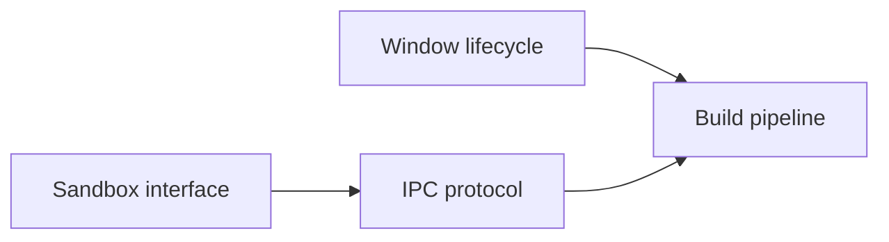

# Break Down Spec into Sub-Design Specs

Decompose a large design spec into smaller sub-design specs, each focused on a
single design problem. These are NOT implementation tasks — they are design
problems that need further iteration, exploration, and potentially their own
breakdown before becoming dispatchable.

## Step 0: Parse arguments

Extract the spec file path from the first token of the arguments.

## Step 1: Read the spec and context

1. Read the spec file in full.
2. **Parse YAML frontmatter** — extract `title`, `status`, `depends_on`,
   `affects`, `effort`, `created`, `updated`, `author`.
3. Read `specs/README.md` to understand track organization and dependency graph.
4. Identify the distinct design problems embedded in the spec — look for
   separate concerns, architectural boundaries, independent decisions, or
   sections that could be explored in isolation.

## Step 2: Explore the codebase

Explore the codebase to understand the scope of each design problem:

- What subsystems, packages, and interfaces are involved
- Where architectural boundaries naturally fall
- What existing patterns and abstractions are relevant
- Whether any design problems have cross-cutting concerns with other specs

Use Agent subagents (Explore type) for thorough codebase exploration. Launch up
to 3 in parallel for independent areas.

## Step 3: Identify design problems

Decompose the spec into distinct design problems. Each sub-design spec should:

- Focus on **one design problem** — a single architectural decision, interface
  design, data model, protocol, UX flow, or integration concern
- Be **explorable independently** — the user can iterate on this sub-design
  without needing to resolve other sub-designs first (though dependencies are
  allowed)
- Contain **open questions** that need resolution before implementation
- Be scoped so that when resolved, it produces either implementation-ready leaf
  specs (via `/task-breakdown`) or further sub-designs (via `/design-breakdown`
  again)

Guidelines for identifying design boundaries:
- Separate concerns that touch different subsystems or packages
- Separate decisions that have independent trade-offs
- Separate user-facing design (UX, API surface) from internal design (data
  model, algorithms)
- Separate integration concerns (how components connect) from component design
  (how one component works internally)

## Step 4: Order the sub-designs

Determine a logical ordering based on:

1. **Dependency flow** — designs that inform other designs come first. Express
   this via `depends_on` in frontmatter.
2. **Risk** — uncertain or high-impact design decisions earlier, so downstream
   designs can build on resolved foundations.
3. **Incremental understanding** — order so that resolving earlier designs gives
   the user progressively better understanding of the full picture.

## Step 5: Create the child spec folder and files

Per the spec document model, breaking down a spec creates child specs in a
subdirectory named after the parent. For example, breaking down
`specs/local/desktop-app.md` creates children in `specs/local/desktop-app/`.

1. Create the subdirectory if it doesn't exist.
2. Create one markdown file per sub-design, using descriptive names (no numeric
   prefixes — execution order comes from `depends_on`, not filenames).

Each child spec file must have YAML frontmatter and follow this structure:

````markdown
---
title: <Descriptive title of the design problem>
status: drafted
depends_on:
  - <relative path to sibling spec if ordering matters, or empty list>
affects:
  - <code paths / packages this design will govern>
effort: <small | medium | large | xlarge>
created: <today>
updated: <today>
author: <from parent spec>
dispatched_task_id: null
---

# <Title>

## Design Problem

<Clear statement of the single design problem this spec addresses. What
decision needs to be made? What are the constraints? Why can't this be
resolved trivially?>

## Context

<Relevant codebase context, existing patterns, related specs, prior art.
What does the reader need to know to reason about this problem?>

## Options

<At least two concrete approaches, each with pro/con analysis. Include
enough detail that the user can make an informed decision or direct the
agent to explore further.>

## Open Questions

<Specific questions that need resolution before this design can move to
`validated` and be broken into implementation tasks. Each question should
be answerable — avoid vague "what should we do?" in favor of "should X
use approach A or B, given constraint C?">

## Affects

<Which parts of the codebase this design governs, and how the design
decision will ripple into implementation. This helps the user understand
blast radius before committing to a direction.>
````

**Key differences from implementation specs (task-breakdown):**
- Status starts as `drafted`, not `validated` — these need iteration.
- Body has Options and Open Questions instead of "What to do" and "Tests".
- No acceptance criteria — the goal is a design decision, not a code change.
- `dispatched_task_id` is always `null` — non-leaf specs are never dispatched.

## Step 6: Index the breakdown on the parent spec

Append or update a `## Design Breakdown` section on the parent spec. This
section serves as the ordered index of sub-designs with a summary of each
design problem and a dependency graph:

````markdown
## Design Breakdown

| # | Sub-design | Design problem | Depends on | Effort | Status |
|---|-----------|---------------|-----------|--------|--------|
| 1 | [Sandbox interface](desktop-app/sandbox-interface.md) | How to abstract container backends | — | medium | drafted |
| 2 | [Window lifecycle](desktop-app/window-lifecycle.md) | Native window create/destroy and state persistence | — | large | drafted |
| 3 | [IPC protocol](desktop-app/ipc-protocol.md) | Communication between native shell and webview | sandbox-interface | medium | drafted |
| 4 | [Build pipeline](desktop-app/build-pipeline.md) | Cross-platform build and packaging | window-lifecycle, ipc-protocol | small | drafted |



**Recommended iteration order:** Start with #1 (Sandbox interface) and #2
(Window lifecycle) in parallel — they are independent. Then #3 (IPC protocol)
once the sandbox interface is settled. Finally #4 (Build pipeline) once all
runtime decisions are made.
````

The `#` column provides a recommended reading/iteration order. This is a
suggestion, not a hard constraint — the user can explore sub-designs in any
order. The `depends_on` DAG is the actual constraint.

If the spec already has a `## Design Breakdown` section, replace its contents.

## Step 7: Commit

Stage the new folder, child spec files, and the updated parent spec. Commit
with a message like: `specs: break down <spec-name> into sub-design specs`

## Step 8: Summary

Report to the user:
- Total number of sub-design specs created
- The dependency graph and recommended iteration order
- Which sub-designs can be explored in parallel
- Any design problems that were intentionally left in the parent spec (too
  cross-cutting to isolate) and why
