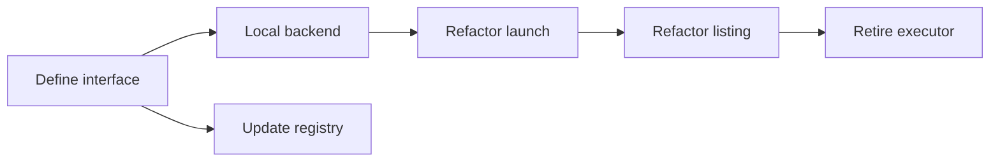

# Break Down Spec into Tasks

Decompose a design spec into smaller, implementable task files organized in a
folder alongside the spec.

## Step 0: Parse arguments

Extract the spec file path from the first token of the arguments.

## Step 1: Read the spec and context

1. Read the spec file in full.
2. **Parse YAML frontmatter** — extract `title`, `status`, `track`,
   `depends_on`, `affects`, `effort`, `created`, `updated`, `author`,
   `dispatched_task_id` from the `---` fenced block at the top.
3. **Check lifecycle readiness** — the spec should be `validated` before
   breaking down. If `status` is `vague` or `drafted`, warn the user that the
   design may not be stable enough for task decomposition. If `stale`, suggest
   `/refine` first.
4. **Check dependencies** — for each path in `depends_on`, read that spec's
   frontmatter and confirm its `status` is `complete`. Report any incomplete
   blockers.
5. Read `specs/README.md` to understand track organization and dependency graph.
6. Use the `affects` list to identify the primary code files and packages this
   spec touches.
7. Identify the spec's implementation plan, phases, and any existing task
   breakdown structure.

## Step 2: Explore the codebase

For each phase or major section in the spec, explore the codebase to understand:

- What files will be created or modified
- What existing patterns, types, and interfaces are relevant
- What test patterns exist in those packages
- Whether any items are already partially implemented

Use Agent subagents (Explore type) for thorough codebase exploration. Launch up
to 3 in parallel for independent areas.

## Step 3: Design the task breakdown

Break the spec into discrete, implementable tasks. Each task should:

- Be completable in a single commit
- Leave the project in a working state (tests pass)
- Have clear boundaries (what to change, what NOT to change)
- Include specific test requirements

Order tasks so dependencies flow forward (no task depends on a later task).

Guidelines for task granularity:
- **Small** (~50-100 lines changed): Add a type, add a method, add a field
- **Medium** (~100-300 lines): Refactor a function, add a new file with tests
- **Large** (~300+ lines): Multi-file refactor, complex feature with many touchpoints

Prefer smaller tasks. If a task feels large, split it further.

## Step 4: Create the child spec folder and files

Per the spec document model, breaking down a spec creates child specs in a
subdirectory named after the parent. For example, breaking down
`specs/foundations/sandbox-backends.md` creates children in
`specs/foundations/sandbox-backends/`.

1. Create the subdirectory if it doesn't exist.
2. Create one markdown file per task, using descriptive names (no numeric
   prefixes — execution order comes from `depends_on`, not filenames).

Each child spec file must have YAML frontmatter and follow this template:

````markdown
---
title: <Descriptive title>
status: validated
track: <same track as parent>
depends_on:
  - <relative path to sibling spec, or empty list>
affects:
  - <files/directories this task will create or modify>
effort: <small | medium | large | xlarge>
created: <today>
updated: <today>
author: <from parent spec>
dispatched_task_id: null
---

# <Title>

## Goal

<1-2 sentences explaining what this task achieves and why>

## What to do

<Numbered list of specific implementation steps with file paths,
function names, and code patterns. Include pseudocode for non-obvious
changes.>

## Tests

<Bulleted list of specific test cases to write, with test function
names and what they verify>

## Boundaries

<Bulleted list of what NOT to change in this task — helps scope the
work and prevents task creep>
````

**Important:** Use `depends_on` with full relative paths from the repo root
(e.g., `specs/foundations/sandbox-backends/define-interface.md`) to express
ordering between sibling tasks. Do not use task numbers — the DAG is defined
by `depends_on` edges.

## Step 5: Verify the breakdown

Check that:
- Every item from the spec's implementation plan is covered by at least one task
- No circular dependencies exist in the `depends_on` DAG (topological sort must
  succeed)
- The dependency graph allows parallel execution where possible
- Each task's "What to do" section references real file paths and function names
- All `depends_on` paths resolve to existing spec files
- Each child spec's `track` matches the parent's `track`
- Each child spec's `affects` paths are plausible (files exist or will be created)

## Step 6: Document the breakdown in the parent spec

Append a `## Task Breakdown` section to the original spec file (if one does not
already exist). Include a summary table showing each child spec's frontmatter
fields and a Mermaid dependency graph derived from `depends_on`:

````markdown
## Task Breakdown

| Child spec | Depends on | Effort | Status |
|------------|-----------|--------|--------|
| [Define interface](sandbox-backends/define-interface.md) | — | small | validated |
| [Local backend](sandbox-backends/local-backend.md) | define-interface | medium | validated |
| [Refactor launch](sandbox-backends/runner-migration/refactor-launch.md) | local-backend | small | validated |


````

Use relative links from the parent spec to the child spec files. Specs with no
`depends_on` entries should appear as root nodes. The graph makes the critical
path and parallelism opportunities visible at a glance.

If the spec already has a `## Task Breakdown` section, replace its contents with
the updated table and graph.

## Step 7: Commit

Stage the new task folder, task files, and the updated spec. Commit with a
message like: `specs: break down <spec-name> into implementable tasks`

## Step 8: Summary

Report to the user:
- Total number of tasks created
- The dependency graph (which tasks can run in parallel)
- Any spec items that were intentionally excluded and why
