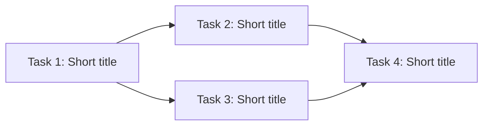

# Break Down Spec into Tasks

Decompose a design spec into smaller, implementable task files organized in a
folder alongside the spec.

## Step 0: Parse arguments

Extract the spec file path from the first token of the arguments.

## Step 1: Read the spec and context

1. Read the spec file in full.
2. Read `specs/README.md` to understand milestone ordering and dependencies.
3. Identify the spec's implementation plan, phases, and any existing task
   breakdown structure.

## Step 2: Explore the codebase

For each phase or major section in the spec, explore the codebase to understand:

- What files will be created or modified
- What existing patterns, types, and interfaces are relevant
- What test patterns exist in those packages
- Whether any items are already partially implemented

Use Agent subagents (Explore type) for thorough codebase exploration. Launch up
to 3 in parallel for independent areas.

## Step 3: Design the task breakdown

Break the spec into discrete, implementable tasks. Each task should:

- Be completable in a single commit
- Leave the project in a working state (tests pass)
- Have clear boundaries (what to change, what NOT to change)
- Include specific test requirements

Order tasks so dependencies flow forward (no task depends on a later task).

Guidelines for task granularity:
- **Small** (~50-100 lines changed): Add a type, add a method, add a field
- **Medium** (~100-300 lines): Refactor a function, add a new file with tests
- **Large** (~300+ lines): Multi-file refactor, complex feature with many touchpoints

Prefer smaller tasks. If a task feels large, split it further.

## Step 4: Create the task folder and files

1. Create a folder named after the spec (e.g., `specs/03-container-reuse/`)
2. Create one markdown file per task, numbered sequentially:
   `task-01-<name>.md`, `task-02-<name>.md`, etc.

Each task file must follow this template:

```markdown
# Task N: <Title>

**Status:** Todo
**Depends on:** <Task numbers or "None">
**Phase:** <Phase number and name from the spec>
**Effort:** <Small | Medium | Large>

## Goal

<1-2 sentences explaining what this task achieves and why>

## What to do

<Numbered list of specific implementation steps with file paths,
function names, and code patterns. Include pseudocode for non-obvious
changes.>

## Tests

<Bulleted list of specific test cases to write, with test function
names and what they verify>

## Boundaries

<Bulleted list of what NOT to change in this task — helps scope the
work and prevents task creep>
```

## Step 5: Verify the breakdown

Check that:
- Every item from the spec's implementation plan is covered by at least one task
- No circular dependencies exist between tasks
- The dependency graph allows parallel execution where possible
- Each task's "What to do" section references real file paths and function names

## Step 6: Document dependencies in the spec

Append a `## Task Breakdown` section to the original spec file (if one does not
already exist). Include a summary table and a Mermaid dependency graph:

````markdown
## Task Breakdown

| # | Task | Depends on | Effort | Status |
|---|------|-----------|--------|--------|
| 1 | [Short title](folder/task-01-name.md) | — | Small | Todo |
| 2 | [Short title](folder/task-02-name.md) | 1 | Medium | Todo |
| 3 | [Short title](folder/task-03-name.md) | 1 | Small | Todo |
| 4 | [Short title](folder/task-04-name.md) | 2, 3 | Large | Todo |


````

Use relative links from the spec to the task files. Tasks with no dependencies
should appear as root nodes. The graph makes the critical path and parallelism
opportunities visible at a glance.

If the spec already has a `## Task Breakdown` section, replace its contents with
the updated table and graph.

## Step 7: Commit

Stage the new task folder, task files, and the updated spec. Commit with a
message like: `specs: break down <spec-name> into implementable tasks`

## Step 8: Summary

Report to the user:
- Total number of tasks created
- The dependency graph (which tasks can run in parallel)
- Any spec items that were intentionally excluded and why
