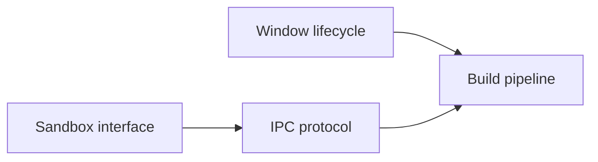

# Break Down Spec

Decompose a spec into smaller child specs. The output is either **design specs**
(sub-design problems that need further iteration) or **implementation tasks**
(leaf specs ready to dispatch to the kanban board).

## Step 0: Parse arguments and determine mode

$ARGUMENTS has the form: `<spec-file.md> [design|tasks]`

- The **first token** is the spec file path.
- The optional **second token** is an explicit mode override: `design` or `tasks`.

If no mode is given, determine it from the spec's lifecycle state:

- `vague` or `drafted` with unresolved open questions → **design** mode.
  The spec's design problems need further exploration before implementation.
- `validated` with a clear implementation plan → **tasks** mode.
  The design is settled; decompose into implementable leaf specs.
- `stale` → warn the user and suggest `/refine` first.
- `complete` → warn the user; completed specs don't normally need breakdown.

If the heuristic is ambiguous (e.g., `drafted` but the spec has a detailed
implementation plan), ask the user which mode to use.

## Step 1: Read the spec and context

1. Read the spec file in full.
2. **Parse YAML frontmatter** — extract `title`, `status`, `depends_on`,
   `affects`, `effort`, `created`, `updated`, `author`, `dispatched_task_id`.
3. **Check dependencies** — for each path in `depends_on`, read that spec's
   frontmatter and confirm its `status` is `complete`. Report any incomplete
   blockers. (In design mode, incomplete dependencies are a warning; in tasks
   mode, they are a stronger signal that the breakdown may be premature.)
4. Read `specs/README.md` to understand track organization and dependency graph.
5. Use the `affects` list to identify the primary code files and packages.
6. Identify the spec's structure: design problems, implementation plan, phases,
   existing breakdown.

## Step 2: Explore the codebase

For each major area the spec touches, explore the codebase to understand:

- What files will be created or modified
- What existing patterns, types, and interfaces are relevant
- What test patterns exist in those packages
- Whether any items are already partially implemented

Use Agent subagents (Explore type) for thorough codebase exploration. Launch up
to 3 in parallel for independent areas.

## Step 3: Design the breakdown

### Design mode

Identify the distinct design problems embedded in the spec. Each child should:

- Focus on **one design problem** — a single architectural decision, interface
  design, data model, protocol, UX flow, or integration concern
- Be **explorable independently** — the user can iterate on this sub-design
  without needing to resolve other sub-designs first (though dependencies are
  allowed)
- Contain **open questions** that need resolution before implementation

Guidelines for identifying design boundaries:
- Separate concerns that touch different subsystems or packages
- Separate decisions that have independent trade-offs
- Separate user-facing design (UX, API surface) from internal design (data
  model, algorithms)
- Separate integration concerns (how components connect) from component design

Order by: (1) dependency flow, (2) risk — uncertain or high-impact decisions
earlier, (3) incremental understanding — earlier designs build foundations for
later ones.

### Tasks mode

Break the spec into discrete, implementable tasks. Each child should:

- Be completable in a single commit
- Leave the project in a working state (tests pass)
- Have clear boundaries (what to change, what NOT to change)
- Include specific test requirements

Sizing guidelines:
- **Small** (~50-100 lines changed): add a type, method, or field
- **Medium** (~100-300 lines): refactor a function, add a new file with tests
- **Large** (~300+ lines): multi-file refactor, complex feature

Prefer smaller tasks. If a task feels large, split it further.

Order so dependencies flow forward (no task depends on a later task). Maximize
parallelism — tasks without mutual dependencies should be independent.

## Step 4: Create the child spec folder and files

Per the spec document model, child specs live in a subdirectory named after the
parent. For example, breaking down `specs/local/desktop-app.md` creates children
in `specs/local/desktop-app/`.

1. Create the subdirectory if it doesn't exist.
2. Create one markdown file per child, using descriptive names (no numeric
   prefixes — execution order comes from `depends_on`, not filenames).

### Design mode child template

````markdown
---
title: <Descriptive title of the design problem>
status: drafted
depends_on:
  - <relative path to sibling spec if ordering matters, or empty list>
affects:
  - <code paths / packages this design will govern>
effort: <small | medium | large | xlarge>
created: <today>
updated: <today>
author: <from parent spec>
dispatched_task_id: null
---

# <Title>

## Design Problem

<Clear statement of the single design problem this spec addresses. What
decision needs to be made? What are the constraints? Why can't this be
resolved trivially?>

## Context

<Relevant codebase context, existing patterns, related specs, prior art.
What does the reader need to know to reason about this problem?>

## Options

<At least two concrete approaches, each with pro/con analysis. Include
enough detail that the user can make an informed decision or direct the
agent to explore further.>

## Open Questions

<Specific questions that need resolution before this design can move to
`validated` and be broken into implementation tasks. Each question should
be answerable — avoid vague "what should we do?" in favor of "should X
use approach A or B, given constraint C?">

## Affects

<Which parts of the codebase this design governs, and how the design
decision will ripple into implementation.>
````

Key properties: status is `drafted` (needs iteration), body has Options and
Open Questions, `dispatched_task_id` is always `null` (non-leaf).

### Tasks mode child template

````markdown
---
title: <Descriptive title>
status: validated
depends_on:
  - <relative path to sibling spec, or empty list>
affects:
  - <files/directories this task will create or modify>
effort: <small | medium | large | xlarge>
created: <today>
updated: <today>
author: <from parent spec>
dispatched_task_id: null
---

# <Title>

## Goal

<1-2 sentences explaining what this task achieves and why>

## What to do

<Numbered list of specific implementation steps with file paths,
function names, and code patterns. Include pseudocode for non-obvious
changes.>

## Tests

<Bulleted list of specific test cases to write, with test function
names and what they verify>

## Boundaries

<Bulleted list of what NOT to change in this task — helps scope the
work and prevents task creep>
````

Key properties: status is `validated` (ready to dispatch), body has Goal,
What to do, Tests, Boundaries.

**Important for both modes:** Use `depends_on` with full relative paths from
the repo root (e.g., `specs/local/desktop-app/sandbox-interface.md`) to express
ordering. Do not use task numbers.

## Step 5: Verify the breakdown

Check that:
- Every item from the spec's plan is covered by at least one child
- No circular dependencies exist in the `depends_on` DAG
- The dependency graph allows parallel execution where possible
- All `depends_on` paths resolve to existing spec files
- Each child's `affects` paths are plausible

Additional checks for tasks mode:
- Each child's "What to do" references real file paths and function names
- Leaf specs are small enough for one agent task (2-5 files, one clear goal)

## Step 6: Index the breakdown on the parent spec

Append or update a breakdown section on the parent spec.

### Design mode: `## Design Breakdown`

````markdown
## Design Breakdown

| # | Sub-design | Design problem | Depends on | Effort | Status |
|---|-----------|---------------|-----------|--------|--------|
| 1 | [Sandbox interface](desktop-app/sandbox-interface.md) | How to abstract container backends | — | medium | drafted |
| 2 | [Window lifecycle](desktop-app/window-lifecycle.md) | Native window create/destroy | — | large | drafted |
| 3 | [IPC protocol](desktop-app/ipc-protocol.md) | Communication between shell and webview | sandbox-interface | medium | drafted |



**Recommended iteration order:** Start with #1 and #2 in parallel — they
are independent. Then #3 once the sandbox interface is settled.
````

The `#` column provides a recommended reading/iteration order (suggestion, not
constraint). The `depends_on` DAG is the actual constraint.

### Tasks mode: `## Task Breakdown`

````markdown
## Task Breakdown

| Child spec | Depends on | Effort | Status |
|------------|-----------|--------|--------|
| [Define interface](sandbox-backends/define-interface.md) | — | small | validated |
| [Local backend](sandbox-backends/local-backend.md) | define-interface | medium | validated |
| [Refactor launch](sandbox-backends/refactor-launch.md) | local-backend | small | validated |


````

Use relative links from the parent spec to the child spec files. If the parent
already has a breakdown section, replace its contents.

## Step 7: Commit

Stage the new folder, child spec files, and the updated parent spec. Commit:

- Design mode: `specs: break down <spec-name> into sub-design specs`
- Tasks mode: `specs: break down <spec-name> into implementable tasks`

Do NOT push unless the user explicitly asks.

## Step 8: Summary

Report to the user:
- Mode used (design or tasks) and why
- Total number of child specs created
- The dependency graph and parallelism opportunities
- Any spec items intentionally excluded and why
- Suggested next steps:
  - Design mode: "Iterate on sub-designs, then `/wf-spec-breakdown <child> tasks`
    when each is validated"
  - Tasks mode: "Run `/wf-review-breakdown <spec>` to validate, then dispatch"
