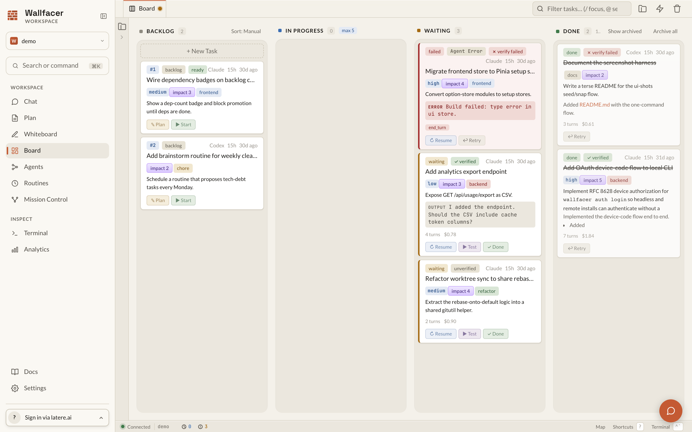
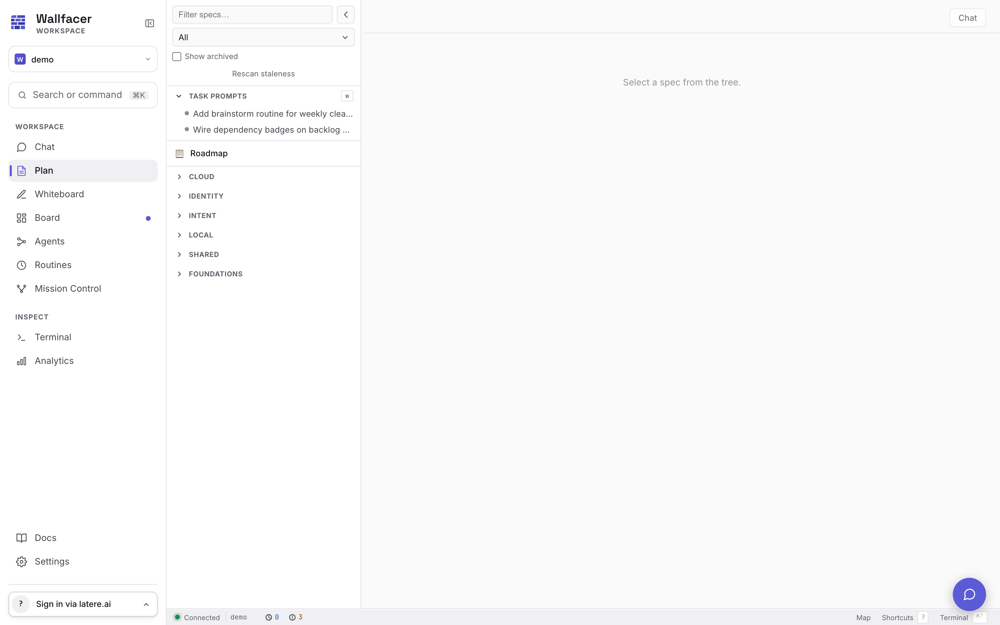
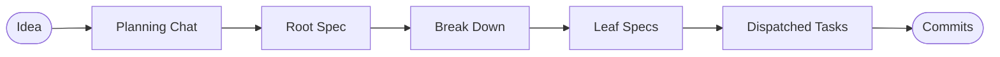
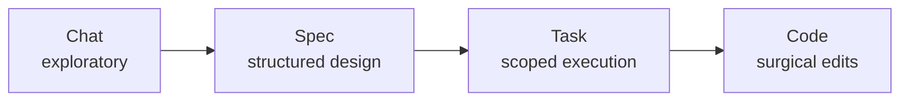

# Wallfacer

**Full autonomy when you trust it. Full control when you don't.**

[](https://go.dev/)
[](https://github.com/changkun/wallfacer/releases)
[](./LICENSE)
[](https://app.codecov.io/gh/changkun/wallfacer)
[](https://github.com/changkun/wallfacer/stargazers)
[](https://github.com/changkun/wallfacer/commits/main)

Wallfacer is an autonomous engineering platform that works across multiple levels of abstraction. Start with a conversation when you're exploring an idea. Move to specs when the shape becomes clear. Track tasks when it's time to execute. Drop into code when you need precision. Agents operate at every level, and you decide how much freedom they get.

Open source. Runs locally. No IDE lock-in. No cloud dependency. Bring your own LLM provider.

|  |
|:--:|
| *Task board — coordinate parallel agent execution* |

|  |
|:--:|
| *Plan mode — design before you build* |

## Why Wallfacer

Every AI coding tool today pins you to one interaction mode. Chat-based tools are fast but lose structure at scale. Spec-driven tools add discipline but slow you down on day one. Task boards help you coordinate but don't understand your architecture. Wallfacer connects all of these into a continuous workflow.

**Adaptive abstraction** — Chat-centric for greenfield exploration, spec-centric for complex systems — a recursive tree of markdown specs that agents can read, iterate on, break down, and dispatch as tasks — task-centric for parallel execution, code-level for surgical edits. Move between levels as your project evolves.

**Autonomy spectrum** — Run the full loop autonomously (implement, test, commit, push) or step in at any point. Dial autonomy up or down per task, per spec, per project.

**Spec as intermediate representation** — Ideas don't go straight to code. They become structured specs that agents can reason about, iterate on, and implement against. Specs are versioned and reviewable.

**Isolation by default** — Per-task containers and git worktrees for safe parallel execution. Multiple agents work simultaneously without stepping on each other.

**Operator visibility** — Live logs, traces, timelines, diff review, and usage/cost tracking. Full audit trail from idea to deployed code.

**Self-development** — Wallfacer builds Wallfacer. Most recent capabilities were developed by the system itself.

**Model flexibility** — Works with Claude Code, Codex, and custom sandbox setups. Not locked to any single LLM provider.

## Quick Start

Install:

```bash
curl -fsSL https://raw.githubusercontent.com/changkun/wallfacer/main/install.sh | sh
```

Check prerequisites:

```bash
wallfacer doctor
```

Start the server:

```bash
wallfacer run                    # container backend (default) — uses podman/docker
wallfacer run --backend host     # host mode — execs claude/codex directly, no container
```

A browser window opens automatically. Add your Claude credential (OAuth token via `claude setup-token`, or API key from [console.anthropic.com](https://console.anthropic.com/)) in **Settings**. See [Getting Started](docs/guide/getting-started.md) for the full setup walkthrough, and [Configuration → Host mode](docs/guide/configuration.md#host-mode) if you'd rather skip the container runtime entirely.

## How It Works

1. **Explore** — Describe what you want to build in chat. Wallfacer helps you shape the idea.
2. **Specify** — The idea becomes a structured spec. Iterate on it until the design is right.
3. **Execute** — Specs break into tasks on a board. Agents implement, test, and commit in isolated sandboxes.
4. **Ship** — Reviewed changes merge automatically. Auto-commit, auto-push, auto-build when you're ready.



## The Autonomy Spectrum

Wallfacer lets you work at whichever abstraction level fits the problem, and move between them as the shape becomes clearer.



Move left for more freedom and lower commitment; move right for more precision and higher commitment. Agents operate at every level, and autonomy dials up or down independently at each one. Specs move through a six-state lifecycle (`vague → drafted → validated → complete`, with `stale` and `archived` off to the side), and the planning chat exposes slash commands like `/create`, `/validate`, `/break-down`, and `/dispatch` to drive them.

Read more: [The Autonomy Spectrum](docs/guide/autonomy-spectrum.md), [Designing Specs](docs/guide/designing-specs.md), and [Exploring Ideas](docs/guide/exploring-ideas.md).

## How execution is structured

Wallfacer runs every task through a small, composable set of primitives:

- **Agents** are sub-roles (impl, test, refine, commit-msg, etc.), each with a harness pin (Claude or Codex), capabilities, and an optional system prompt.
- **Flows** compose agents into an ordered pipeline. Built-ins include `implement`, `brainstorm`, `refine-only`, and `test-only`.
- **Tasks** pick a flow; the runner walks the flow's step chain.
- **Routines** spawn tasks against a flow on a schedule.

User-authored agents and flows live as YAML under `~/.wallfacer/{agents,flows}/` and are edited through the sidebar **Agents** and **Flows** tabs. Clone a built-in to pin it to a specific harness, override its system prompt, or insert a review step, without restarting the server.

Read more: [Agents & Flows](docs/guide/agents-and-flows.md).

## Product Tour

### Task Board, Managed Execution


Coordinate many agent tasks on a task board. Drag cards across the lifecycle, batch-create with dependency wiring, refine prompts before execution, and let autopilot promote backlog items as capacity opens. Each task runs in an isolated container with its own git worktree.

### Plan Mode, Structured Design


Design before you build. The three-pane plan view gives you an explorer tree (left), focused markdown view (center), and planning chat (right). Break large ideas into structured specs, validate dependencies, and dispatch leaf specs to the task board when the design is right.

### Oversight, Actionable Audit Trail


Inspect what happened, when it happened, and why it happened before you accept any automated output. Every task produces a structured event timeline, diff against the default branch, and AI-generated oversight summary.

### Cost and Usage Visibility


Track token usage and cost by task, activity, and turn so operations stay measurable as automation scales. Per-role breakdown (implementation, testing, refinement, oversight) shows exactly where budget goes.

## Capability Stack

- **Chat** — planning chat with slash commands and file-explorer context, refinement and brainstorm agents, conversational drift away from or back into specs.
- **Spec** — six-state lifecycle, dependency DAG, recursive progress tracking, impact analysis, atomic dispatch and undo.
- **Task** — isolated containers or host-mode exec, per-task git worktrees, autopilot, auto-test, auto-submit, auto-retry, circuit breakers, cost and token budgets, oversight summaries.
- **Code** — file explorer with editor, integrated terminal, live logs and diff review, per-turn usage and timeline, workspace-level AGENTS.md instructions.

Built on seven composable sub-agent roles (Claude or Codex) arranged into flows (`implement`, `brainstorm`, `refine-only`, `test-only`, plus user-authored clones) that can be inspected or rewritten from the sidebar.

## Roadmap

Development is organized into three parallel tracks with shared foundations. See [`specs/README.md`](specs/README.md) for the full dependency graph and spec index.

**Foundations** (complete): Sandbox backend interface, storage backend interface, container reuse, file explorer, host terminal, multi-workspace groups, Windows support.

**Local Product**: Desktop experience and developer workflow. Spec coordination (document model, planning UX, drift detection), agents & flows (composable sub-agent pipelines), routine tasks (scheduled spawns), desktop app, file/image attachments, host mounts, oversight risk scoring, visual verification, live serve.

**Cloud Platform**: Multi-tenant hosted service. Tenant filesystem, K8s sandbox backend, cloud infrastructure, multi-tenant control plane, tenant API.

**Shared Design**: Cross-track specs. Authentication, agent abstraction, native sandboxes (Linux/macOS/Windows), overlay snapshots.

## Documentation

**[User Manual](docs/guide/usage.md)** — start here for the full reading order.

| # | Guide | Topics |
|---|-------|--------|
| 1 | [Getting Started](docs/guide/getting-started.md) | Installation, credentials, first run |
| 2 | [The Autonomy Spectrum](docs/guide/autonomy-spectrum.md) | Mental model: chat, spec, task, code |
| 3 | [Exploring Ideas](docs/guide/exploring-ideas.md) | Planning chat, slash commands, @mentions |
| 4 | [Designing Specs](docs/guide/designing-specs.md) | Spec mode, focused view, dependency minimap |
| 5 | [Executing Tasks](docs/guide/board-and-tasks.md) | Task board, lifecycle, dependencies, search |
| 6 | [Automation & Control](docs/guide/automation.md) | Autopilot, auto-test, auto-submit, auto-retry |
| 7 | [Oversight & Analytics](docs/guide/oversight-and-analytics.md) | Oversight summaries, costs, timeline, logs |
| 8 | [Workspaces & Git](docs/guide/workspaces.md) | Workspace management, git integration, branches |
| 9 | [Refinement & Ideation](docs/guide/refinement-and-ideation.md) | Prompt refinement, brainstorm agent |
| 10 | [Configuration](docs/guide/configuration.md) | Settings, env vars, sandboxes, CLI, shortcuts |
| 11 | [Circuit Breakers](docs/guide/circuit-breakers.md) | Fault isolation, self-healing automation |

**[Technical Internals](docs/internals/internals.md)** — start here for implementation details and architecture.

| # | Reference | Topics |
|---|-----------|--------|
| 1 | [Architecture](docs/internals/architecture.md) | System design, package map, handler organisation, end-to-end walkthrough |
| 2 | [Data & Storage](docs/internals/data-and-storage.md) | Data models, persistence, event sourcing, spec document model |
| 3 | [Task Lifecycle](docs/internals/task-lifecycle.md) | State machine, turn loop, dependencies, failure categorization |
| 4 | [Git Operations](docs/internals/git-worktrees.md) | Worktree lifecycle, commit pipeline, branch management |
| 5 | [API & Transport](docs/internals/api-and-transport.md) | HTTP route reference, SSE, WebSocket terminal, middleware |
| 6 | [Automation](docs/internals/automation.md) | Background watchers, autopilot, circuit breakers, ideation |
| 7 | [Workspaces & Config](docs/internals/workspaces-and-config.md) | Workspace manager, sandboxes, templates, env config |
| 8 | [Development Setup](docs/internals/development.md) | Building, testing, make targets, release workflow |

## Origin

Wallfacer started as a task board for coordinating concurrent agent runs and grew into its own gaps from there: spec coordination, oversight, refinement, an integrated IDE. Most recent capabilities were developed by Wallfacer itself. See [docs/origin.md](docs/origin.md) for the long version.

## License

[MIT](LICENSE)
