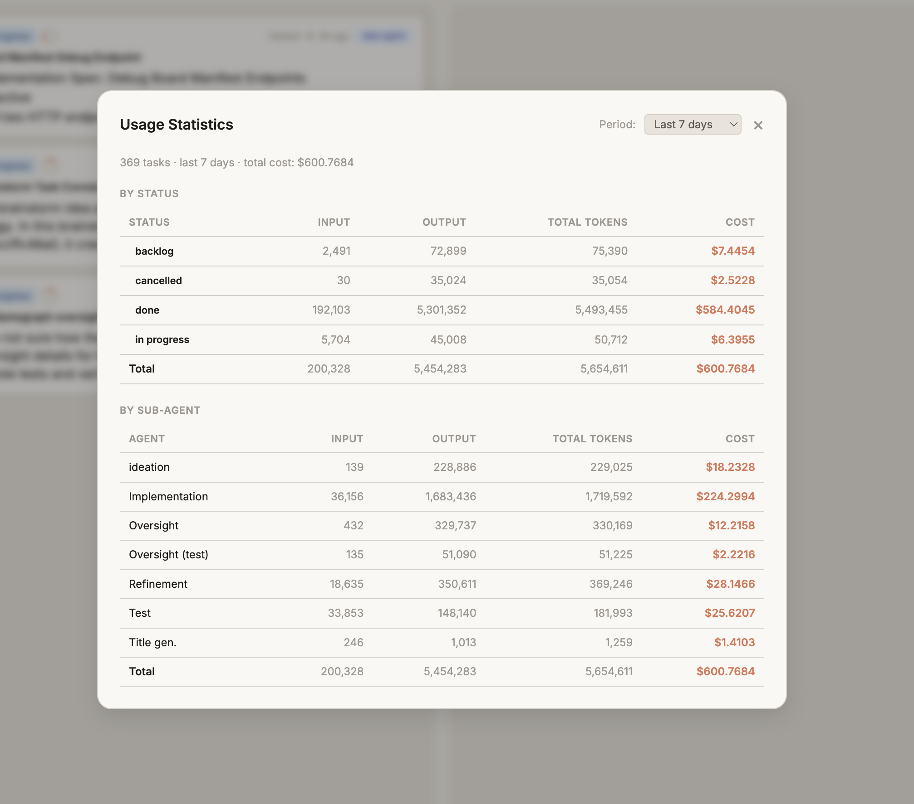

# Wallfacer

> Build software with a self-operating engineering team.

[](https://go.dev/)
[](https://github.com/changkun/wallfacer/releases)
[](./LICENSE)
[](https://app.codecov.io/gh/changkun/wallfacer)
[](https://github.com/changkun/wallfacer/stargazers)
[](https://github.com/changkun/wallfacer/commits/main)

Wallfacer is a task-board orchestration system for autonomous coding agents.
Create tasks, run them in isolated sandboxes, review diffs, and keep shipping with minimal manual overhead.


## Why Wallfacer

- **Autonomous delivery loop**: backlog -> implementation -> testing -> review -> merge-ready output
- **Self-development capability**: wallfacer can run tasks that improve wallfacer itself
- **Isolation by default**: per-task containers and per-task git worktrees for safe parallelism
- **Operator visibility**: live logs, traces, timelines, and usage/cost tracking
- **Model/runtime flexibility**: support for Claude Code, Codex, and custom sandbox setups

## Capability Stack

- **Execution engine**: isolated containers, per-task git worktrees, safe parallel runs, circuit breaker, resource limits
- **Autonomous loop**: refinement, implementation, testing, auto-submit, autopilot promotion, auto-retry, cost/token budgets
- **Oversight layer**: live logs, timelines, traces, diff review, usage/cost visibility, per-turn breakdown, task search
- **Repo operations**: branch switching, sync/rebase helpers, auto commit and push, task forking
- **Flexible runtime**: Podman/Docker support, workspace-level instructions, Claude + Codex backends, system prompt customization

For a complete walkthrough of workflows and controls, see [Usage Guide](docs/guide/usage.md).
For implementation details and architecture, see [Technical Internals](docs/internals/internals.md).

## Product Tour

### Mission Control Board


Coordinate many agent tasks in one place, move cards across the lifecycle, and keep execution throughput high without losing control.

### Oversight That Is Actually Actionable

**Execution oversight**


**Timeline and phase detail**


Inspect what happened, when it happened, and why it happened before you accept any automated output.

### Cost and Usage Visibility



Track token usage and cost by task/activity so operations stay measurable as automation scales.

## Quick Start

```bash
# 1. Install
curl -fsSL https://raw.githubusercontent.com/changkun/wallfacer/main/install.sh | sh

# 2. Start the server (restores your last workspace group, or starts empty)
wallfacer run
```

The browser opens to `http://localhost:8080`. Add your Claude credential (OAuth token or API key) in **Settings → API Configuration**. The sandbox image is pulled automatically on first task run.

Codex can be enabled either by:
- host auth cache at `~/.codex/auth.json` (auto-detected at bootstrap), or
- `OPENAI_API_KEY` in `~/.wallfacer/.env` / **Settings → API Configuration** (plus one successful Codex test).

**See [Getting Started](docs/guide/getting-started.md) for the full setup walkthrough**, including credential setup, configuration options, and troubleshooting.

### Common Commands

```bash
# Custom port, skip auto-opening the browser
wallfacer run -addr :9090 -no-browser

# Check prerequisites and configuration
wallfacer doctor
```

For all available `make` targets (build, test, release, etc.), see [Technical Internals: Architecture](docs/internals/architecture.md#development-setup).

## Documentation

**[User Manual](docs/guide/usage.md)** — start here for the full reading order.

| # | Guide | Topics |
|---|-------|--------|
| 1 | [Getting Started](docs/guide/getting-started.md) | Installation, credentials, first run |
| 2 | [Board & Tasks](docs/guide/board-and-tasks.md) | Kanban board, task lifecycle, dependencies, search |
| 3 | [Workspaces & Git](docs/guide/workspaces.md) | Workspace management, git integration, branches |
| 4 | [Automation](docs/guide/automation.md) | Autopilot, auto-test, auto-submit, auto-retry |
| 5 | [Refinement & Ideation](docs/guide/refinement-and-ideation.md) | Prompt refinement, brainstorm agent |
| 6 | [Oversight & Analytics](docs/guide/oversight-and-analytics.md) | Oversight summaries, costs, timeline |
| 7 | [Configuration](docs/guide/configuration.md) | Settings, env vars, sandboxes, CLI |
| 8 | [Circuit Breakers](docs/guide/circuit-breakers.md) | Fault isolation, self-healing automation |

**[Technical Internals](docs/internals/internals.md)** — start here for implementation details and architecture.

| # | Reference | Topics |
|---|-----------|--------|
| 1 | [Architecture](docs/internals/architecture.md) | System design, end-to-end walkthrough, concurrency model, where to look |
| 2 | [Data & Storage](docs/internals/data-and-storage.md) | Data models, persistence, event sourcing, search index |
| 3 | [Task Lifecycle](docs/internals/task-lifecycle.md) | State machine, turn loop, dependencies, board context |
| 4 | [Git Worktrees](docs/internals/git-worktrees.md) | Worktree lifecycle, commit pipeline, branch management |
| 5 | [API & Transport](docs/internals/api-and-transport.md) | HTTP routes, SSE, metrics, middleware |
| 6 | [Automation](docs/internals/automation.md) | Background watchers, autopilot, circuit breakers |
| 7 | [Workspaces & Config](docs/internals/workspaces-and-config.md) | Workspace manager, sandboxes, templates, env config |

## Origin Story

Wallfacer started as a practical response to a repeated workflow: write a task prompt, run an agent, inspect output, and do it again. The bottleneck was not coding speed, it was coordination and visibility across many concurrent agent tasks. A task board became the control surface.

The first version was a Go server with a minimal web UI. Tasks moved from backlog to in progress, executed in isolated containers, and landed in done when complete. Git worktrees provided branch-level isolation so many tasks could run in parallel without collisions.

Wallfacer is now beyond simple task execution. It has become a fully automated engineering team: planning and refinement, implementation, test verification, commit and sync workflows, and continuous operation controls such as autopilot.

Just as importantly, automation is paired with oversight. Operators can inspect live logs, timelines, traces, diffs, and usage/cost signals before accepting results. The goal is not blind autonomy; it is high-throughput engineering with clear, auditable control.

Most recent capabilities were developed by wallfacer itself, creating a compounding loop where the system continuously improves its own engineering process.

## License

See [LICENSE](LICENSE).

## Star History

[](https://star-history.com/#changkun/wallfacer&Date)
