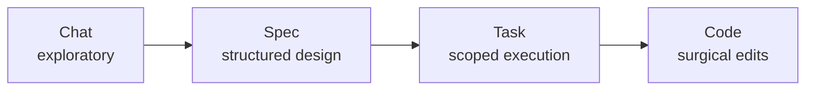

# Wallfacer

**Full autonomy when you trust it. Full control when you don't.**

[](https://go.dev/)
[](https://github.com/changkun/wallfacer/releases)
[](./LICENSE)
[](https://app.codecov.io/gh/changkun/wallfacer)
[](https://github.com/changkun/wallfacer/stargazers)
[](https://github.com/changkun/wallfacer/commits/main)

Wallfacer is an autonomous engineering platform that works across multiple levels of abstraction. Start with a conversation when you're exploring an idea. Move to specs when the shape becomes clear. Track tasks when it's time to execute. Drop into code when you need precision. Agents operate at every level, and you decide how much freedom they get.

Open source. Runs locally. No IDE lock-in. No cloud dependency. Bring your own LLM provider.

|  |
|:--:|
| *Task board: coordinate parallel agent execution* |

|  |
|:--:|
| *Plan mode: design before you build* |

## Why Wallfacer

Every AI coding tool today pins you to one interaction mode. Chat-based tools are fast but lose structure at scale. Spec-driven tools add discipline but slow you down on day one. Task boards help you coordinate but don't understand your architecture. Wallfacer connects all of these into a continuous workflow.

**Adaptive abstraction.** Chat for greenfield exploration, specs for complex systems (a recursive tree of markdown specs that agents read, iterate on, break down, and dispatch as tasks), tasks for parallel execution, code for surgical edits. Move between levels as your project evolves.

**Autonomy spectrum.** Run the full loop autonomously (implement, test, commit, push) or step in at any point. Dial autonomy up or down per task, per spec, per project.

**Spec as intermediate representation.** Ideas don't go straight to code. They become structured specs that agents can reason about, iterate on, and implement against. Specs are versioned and reviewable.

**Per-task git worktrees.** Each task works in its own git worktree for safe parallel execution. Multiple agents work simultaneously without stepping on each other.

**Operator visibility.** Live logs, traces, timelines, diff review, and usage and cost tracking. A full audit trail from idea to merged code.

**Self-development.** Wallfacer builds Wallfacer. Most recent capabilities were developed by the system itself.

**Model flexibility.** Works with Claude Code and Codex through a pluggable harness layer. Not locked to any single provider.

## Quick Start

Install:

```bash
curl -fsSL https://raw.githubusercontent.com/changkun/wallfacer/main/install.sh | sh
```

Check prerequisites:

```bash
wallfacer doctor
```

Start the server:

```bash
wallfacer run                    # execs claude/codex directly as host processes
```

A browser window opens automatically. Add your Claude credential (OAuth token via `claude setup-token`, or API key from [console.anthropic.com](https://console.anthropic.com/)) in **Settings**. See [Getting Started](docs/guide/getting-started.md) for the full walkthrough.

Other commands: `wallfacer status` (print or watch board state), `wallfacer spec` (validate or scaffold specs), and `wallfacer auth` (cloud sign-in). Run `wallfacer <command> -help` for flags.

## How It Works

1. **Explore.** Describe what you want to build in chat. Wallfacer helps you shape the idea.
2. **Specify.** The idea becomes a structured spec. Iterate on it until the design is right.
3. **Execute.** Specs break into tasks on a board. Agents implement, test, and commit in isolated git worktrees.
4. **Ship.** Reviewed changes merge automatically. Auto-commit, auto-push, and auto-build when you're ready.


## The Autonomy Spectrum

Wallfacer lets you work at whichever abstraction level fits the problem, and move between them as the shape becomes clearer.



Move left for more freedom and lower commitment; move right for more precision and higher commitment. Agents operate at every level, and autonomy dials up or down independently at each one. Specs move through a six-state lifecycle (`vague` to `drafted` to `validated` to `complete`, with `stale` and `archived` off to the side), and the planning chat exposes slash commands like `/create`, `/validate`, `/break-down`, and `/dispatch` to drive them.

Read more: [The Autonomy Spectrum](docs/guide/autonomy-spectrum.md), [Designing Specs](docs/guide/designing-specs.md), and [Exploring Ideas](docs/guide/exploring-ideas.md).

## How execution is structured

Wallfacer runs every task through a small, composable set of primitives:

- **Agents** are sub-roles (impl, test, commit-msg, title, oversight, ideate), each with a harness pin (Claude or Codex), capabilities, and an optional system prompt.
- **Flows** compose agents into an ordered pipeline. Built-ins are `implement`, `brainstorm`, and `test-only`.
- **Tasks** pick a flow; the runner walks the flow's step chain.
- **Routines** spawn tasks against a flow on a schedule.

User-authored agents and flows live as YAML under `~/.wallfacer/{agents,flows}/` and are edited through the sidebar **Agents** and **Flows** tabs. Clone a built-in to pin it to a harness, override its system prompt, or insert a review step, without restarting the server. Prompt refinement happens in the Plan task-mode chat (see [Refinement & Ideation](docs/guide/refinement-and-ideation.md)).

Read more: [Agents & Flows](docs/guide/agents-and-flows.md).

## Product Tour

### Task board: managed execution

The board (shown above) coordinates many agent tasks at once. Drag cards across the lifecycle, batch-create with dependency wiring, refine prompts before execution, and let autopilot promote backlog items as capacity opens. Each task runs as a host process in its own git worktree.

### Plan mode: structured design

Design before you build (shown above). The three-pane plan view gives you an explorer tree (left), a focused markdown view (center), and the planning chat (right). Break large ideas into structured specs, validate dependencies, and dispatch leaf specs to the board when the design is right.

### Oversight: an actionable audit trail


Inspect what happened, when, and why before you accept any automated output. Every task produces a structured event timeline, a diff against the default branch, and an AI-generated oversight summary.

### Cost and usage visibility


Track token usage and cost by task, activity, and turn, so operations stay measurable as automation scales. The per-activity breakdown (implementation, testing, refinement, oversight) shows exactly where budget goes.

## Capability Stack

- **Chat.** Planning chat with slash commands and file-explorer context, the brainstorm and ideation agents, conversational drift away from or back into specs.
- **Spec.** Six-state lifecycle, dependency DAG, recursive progress tracking, impact analysis, atomic dispatch and undo.
- **Task.** Host-process execution, per-task git worktrees, autopilot, auto-test, auto-submit, auto-retry, circuit breakers, cost and token budgets, oversight summaries.
- **Code.** File explorer with editor, integrated terminal, live logs and diff review, per-turn usage and timeline, workspace-level AGENTS.md instructions.

Six composable sub-agent roles (Claude or Codex) arrange into flows (`implement`, `brainstorm`, `test-only`, plus user-authored clones) that you can inspect or rewrite from the sidebar.

## Roadmap

Development is organized into three parallel tracks with shared foundations. See [`specs/README.md`](specs/README.md) for the full dependency graph and spec index.

**Foundations** (complete): Execution backend interface, storage backend interface, file explorer, host terminal, multi-workspace groups, Windows support.

**Local Product**: Developer workflow. Spec coordination (document model, planning UX, drift detection), agents and flows (composable sub-agent pipelines), routine tasks (scheduled spawns), file and image attachments, host mounts, oversight risk scoring, visual verification, live serve.

**Cloud Platform**: Multi-tenant hosted service. Tenant filesystem, K8s execution backend, cloud infrastructure, multi-tenant control plane, tenant API.

**Shared Design**: Cross-track specs. Authentication, agent abstraction, native sandboxes (Linux, macOS, Windows), overlay snapshots.

## Documentation

**[User Manual](docs/guide/usage.md)** is the full reading order. Guides are grouped by what you are doing.

**Get Started**

| Guide | Topics |
|-------|--------|
| [Getting Started](docs/guide/getting-started.md) | Installation, credentials, first run |
| [The Autonomy Spectrum](docs/guide/autonomy-spectrum.md) | Mental model: chat, spec, task, code |

**Use Wallfacer**

| Guide | Topics |
|-------|--------|
| [Exploring Ideas](docs/guide/exploring-ideas.md) | Planning chat, slash commands, @mentions |
| [Designing Specs](docs/guide/designing-specs.md) | Spec mode, focused view, dependency minimap |
| [Agents & Flows](docs/guide/agents-and-flows.md) | Agents, flows, cloning, harness pinning, recipes |
| [Board & Tasks](docs/guide/board-and-tasks.md) | Task board, lifecycle, dependencies, search |
| [Refinement & Ideation](docs/guide/refinement-and-ideation.md) | Prompt refinement, brainstorm agent |

**Operate**

| Guide | Topics |
|-------|--------|
| [Automation](docs/guide/automation.md) | Autopilot, auto-test, auto-submit, auto-retry |
| [Oversight & Analytics](docs/guide/oversight-and-analytics.md) | Oversight summaries, costs, timeline, logs |
| [Workspaces](docs/guide/workspaces.md) | Workspace management, git integration, branches |
| [Configuration](docs/guide/configuration.md) | Settings, env vars, harnesses, CLI, shortcuts |
| [Circuit Breakers](docs/guide/circuit-breakers.md) | Fault isolation, self-healing automation |

**Build On (Internals)** is the deep reference for how the system works. Start at **[Technical Internals](docs/internals/internals.md)**.

| Reference | Topics |
|-----------|--------|
| [Architecture](docs/internals/architecture.md) | System design, package map, handler organization, end-to-end walkthrough |
| [Data & Storage](docs/internals/data-and-storage.md) | Data models, persistence, event sourcing, spec document model |
| [Task Lifecycle](docs/internals/task-lifecycle.md) | State machine, turn loop, dependencies, failure categorization |
| [Git Operations](docs/internals/git-worktrees.md) | Worktree lifecycle, commit pipeline, branch management |
| [API & Transport](docs/internals/api-and-transport.md) | HTTP route reference, SSE, WebSocket terminal, middleware |
| [Automation](docs/internals/automation.md) | Background watchers, autopilot, circuit breakers, ideation |
| [Workspaces & Config](docs/internals/workspaces-and-config.md) | Workspace manager, harness routing, templates, env config |
| [Development Setup](docs/internals/development.md) | Building, testing, make targets, release workflow |

Contributing? See **[CONTRIBUTING.md](CONTRIBUTING.md)** for the developer orientation, build commands, and conventions.

## Origin

Wallfacer started as a task board for coordinating concurrent agent runs and grew from there: spec coordination, oversight, refinement, an integrated IDE. Most recent capabilities were developed by Wallfacer itself. See [docs/origin.md](docs/origin.md) for the long version.

## License

[MIT](LICENSE)
