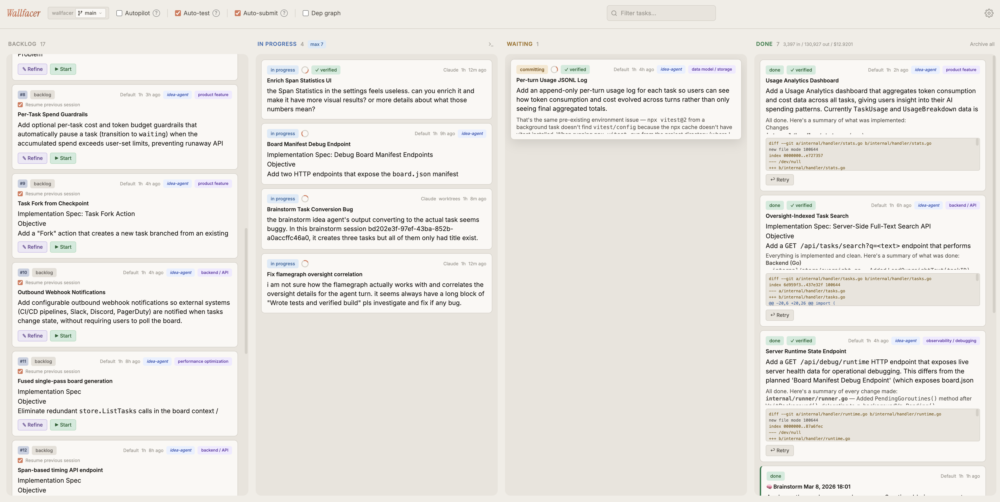
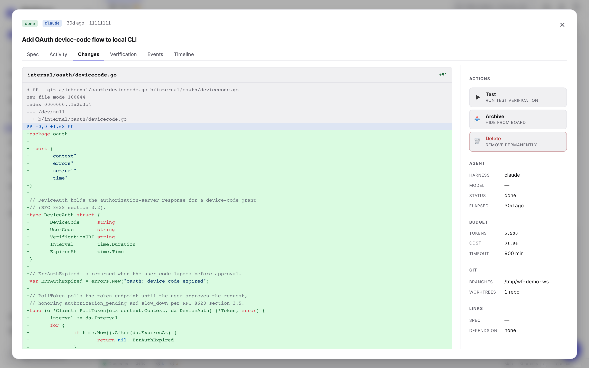
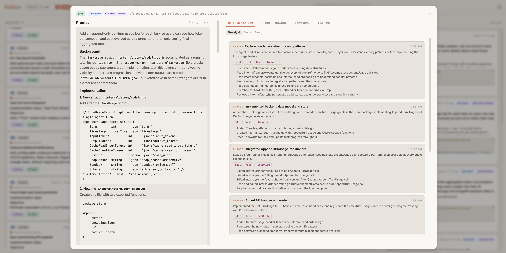
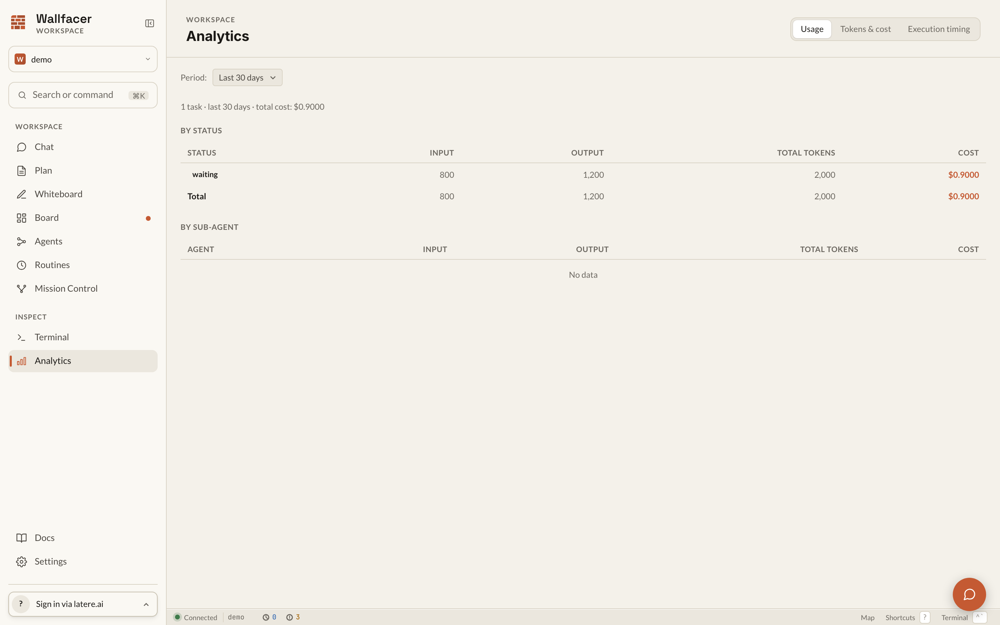

# Wallfacer

**Full autonomy when you trust it. Full control when you don't.**

[](https://go.dev/)
[](https://github.com/changkun/wallfacer/releases)
[](./LICENSE)
[](https://app.codecov.io/gh/changkun/wallfacer)
[](https://github.com/changkun/wallfacer/stargazers)
[](https://github.com/changkun/wallfacer/commits/main)

Wallfacer is an autonomous engineering platform that works across multiple levels of abstraction. Start with a conversation when you're exploring an idea. Move to specs when the shape becomes clear. Track tasks when it's time to execute. Drop into code when you need precision. Agents operate at every level, and you decide how much freedom they get.

Open source. Runs locally. No IDE lock-in. No cloud dependency. Bring your own LLM provider.



## Why Wallfacer

Every AI coding tool today pins you to one interaction mode. Chat-based tools are fast but lose structure at scale. Spec-driven tools add discipline but slow you down on day one. Task boards help you coordinate but don't understand your architecture. Wallfacer connects all of these into a continuous workflow.

**Adaptive abstraction** — Chat-centric for greenfield exploration, spec-centric for complex systems, task-centric for parallel execution, code-level for surgical edits. Move between levels as your project evolves.

**Autonomy spectrum** — Run the full loop autonomously (implement, test, commit, push) or step in at any point. Dial autonomy up or down per task, per spec, per project.

**Spec as intermediate representation** — Ideas don't go straight to code. They become structured specs that agents can reason about, iterate on, and implement against. Specs are versioned and reviewable.

**Isolation by default** — Per-task containers and git worktrees for safe parallel execution. Multiple agents work simultaneously without stepping on each other.

**Operator visibility** — Live logs, traces, timelines, diff review, and usage/cost tracking. Full audit trail from idea to deployed code.

**Self-development** — Wallfacer builds Wallfacer. Most recent capabilities were developed by the system itself.

**Model flexibility** — Works with Claude Code, Codex, and custom sandbox setups. Not locked to any single LLM provider.

## Quick Start

Install:

```bash
curl -fsSL https://raw.githubusercontent.com/changkun/wallfacer/main/install.sh | sh
```

Check prerequisites:

```bash
wallfacer doctor
```

Start the server:

```bash
wallfacer run
```

A browser window opens automatically. Add your Claude credential (OAuth token via `claude setup-token`, or API key from [console.anthropic.com](https://console.anthropic.com/)) in **Settings**. See [Getting Started](docs/guide/getting-started.md) for the full setup walkthrough.

## How It Works

1. **Explore** — Describe what you want to build in chat. Wallfacer helps you shape the idea.
2. **Specify** — The idea becomes a structured spec. Iterate on it until the design is right.
3. **Execute** — Specs break into tasks on a board. Agents implement, test, and commit in isolated sandboxes.
4. **Ship** — Reviewed changes merge automatically. Auto-commit, auto-push, auto-build when you're ready.

## Product Tour

### Mission Control Board


Coordinate many agent tasks in one place, move cards across the lifecycle, and keep execution throughput high without losing control. Batch-create tasks with dependency wiring, refine prompts before execution, and let autopilot promote backlog items as capacity opens.

### Oversight That Is Actually Actionable

**Execution oversight**



**Timeline and phase detail**



Inspect what happened, when it happened, and why it happened before you accept any automated output. Every task produces a structured event timeline, diff against the default branch, and AI-generated oversight summary.

### Cost and Usage Visibility



Track token usage and cost by task, activity, and turn so operations stay measurable as automation scales. Per-role breakdown (implementation, testing, refinement, oversight) shows exactly where budget goes.

## Capability Stack

- **Execution engine**: isolated containers, per-task git worktrees, worker container reuse, safe parallel runs, circuit breaker, resource limits, dependency caching
- **Autonomous loop**: prompt refinement, implementation, testing, auto-submit, autopilot promotion, auto-retry, cost/token budgets, failure categorization
- **Spec workflow**: structured design specs, five-state lifecycle, dependency DAG, recursive progress tracking, planning chat agent with slash commands
- **Oversight layer**: live logs, timelines, traces, diff review, usage/cost visibility, per-turn breakdown, task search, oversight summaries
- **Repo operations**: multi-workspace groups, branch switching, sync/rebase helpers, auto commit and push, task forking
- **Development tools**: file explorer with editor, interactive host terminal, prompt templates, system prompt customization
- **Flexible runtime**: Podman/Docker support, workspace-level AGENTS.md instructions, Claude + Codex backends, per-role sandbox routing

## Roadmap

Development is organized into three parallel tracks with shared foundations. See [`specs/README.md`](specs/README.md) for the full dependency graph and spec index.

**Foundations** (complete) — Sandbox backend interface, storage backend interface, container reuse, file explorer, host terminal, multi-workspace groups, Windows support.

**Local Product** — Desktop experience and developer workflow: spec coordination (document model, planning UX, drift detection), desktop app, file/image attachments, host mounts, oversight risk scoring, visual verification, live serve.

**Cloud Platform** — Multi-tenant hosted service: tenant filesystem, K8s sandbox backend, cloud infrastructure, multi-tenant control plane, tenant API.

**Shared Design** — Cross-track specs: authentication, agent abstraction, native sandboxes (Linux/macOS/Windows), overlay snapshots.

## Documentation

**[User Manual](docs/guide/usage.md)** — start here for the full reading order.

| # | Guide | Topics |
|---|-------|--------|
| 1 | [Getting Started](docs/guide/getting-started.md) | Installation, credentials, first run |
| 2 | [The Autonomy Spectrum](docs/guide/autonomy-spectrum.md) | Mental model: chat, spec, task, code |
| 3 | [Exploring Ideas](docs/guide/exploring-ideas.md) | Planning chat, slash commands, @mentions |
| 4 | [Designing Specs](docs/guide/designing-specs.md) | Spec mode, focused view, dependency minimap |
| 5 | [Executing Tasks](docs/guide/board-and-tasks.md) | Task board, lifecycle, dependencies, search |
| 6 | [Automation & Control](docs/guide/automation.md) | Autopilot, auto-test, auto-retry, circuit breakers |
| 7 | [Oversight & Analytics](docs/guide/oversight-and-analytics.md) | Oversight summaries, costs, timeline, logs |
| 8 | [Workspaces & Git](docs/guide/workspaces.md) | Workspace management, git integration, branches |
| 9 | [Configuration](docs/guide/configuration.md) | Settings, env vars, sandboxes, CLI, shortcuts |

**[Technical Internals](docs/internals/internals.md)** — start here for implementation details and architecture.

| # | Reference | Topics |
|---|-----------|--------|
| 1 | [Architecture](docs/internals/architecture.md) | System design, package map, handler organisation, end-to-end walkthrough |
| 2 | [Data & Storage](docs/internals/data-and-storage.md) | Data models, persistence, event sourcing, spec document model |
| 3 | [Task Lifecycle](docs/internals/task-lifecycle.md) | State machine, turn loop, dependencies, failure categorization |
| 4 | [Git Operations](docs/internals/git-worktrees.md) | Worktree lifecycle, commit pipeline, branch management |
| 5 | [API & Transport](docs/internals/api-and-transport.md) | 97 HTTP routes, SSE, WebSocket terminal, middleware |
| 6 | [Automation](docs/internals/automation.md) | Background watchers, autopilot, circuit breakers, ideation |
| 7 | [Workspaces & Config](docs/internals/workspaces-and-config.md) | Workspace manager, sandboxes, templates, env config |
| 8 | [Development Setup](docs/internals/development.md) | Building, testing, make targets, release workflow |

## Origin

Wallfacer started as a practical response to a repeated workflow: write a task prompt, run an agent, inspect output, and do it again. The bottleneck was not coding speed — it was coordination and visibility across many concurrent agent tasks. A task board became the control surface.

The first version was a Go server with a minimal web UI. Tasks moved from backlog to in progress, executed in isolated containers, and landed in done when complete. Git worktrees provided branch-level isolation so many tasks could run in parallel without collisions.

Then the system kept growing into its own gaps. The execution engine gained container reuse, circuit breakers, dependency caching, and multi-workspace groups. An autonomous loop handles prompt refinement, implementation, testing, auto-retry, and autopilot promotion. An oversight layer — live logs, timelines, traces, diffs, and per-turn cost breakdown — ensures every agent decision is auditable before results are accepted.

As the projects grew in complexity, raw task prompts became insufficient. Design specs emerged as the thinking layer between ideas and executable tasks — structured documents with lifecycle states, dependency graphs, and recursive progress tracking. A planning chat agent made specs conversational: explore an idea in chat, iterate on the design, break it into tasks, dispatch to the board.

The integrated development environment now includes a file explorer with editor, an interactive host terminal, system prompt customization, and prompt templates — all accessible from the browser.

Most of Wallfacer's recent capabilities were developed by Wallfacer itself, creating a compounding loop where the system continuously improves its own engineering process.

## License

[MIT](LICENSE)
