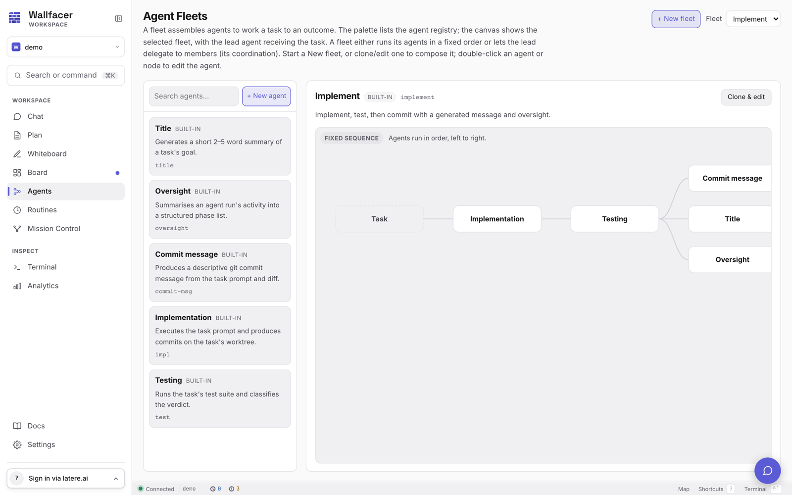

# Agent Graph

The Agent Graph page (`/agent-graph`, the **Agents** entry in the sidebar) is the single surface for defining agents and composing them into fleets. It replaces the earlier separate Agents and Flows pages; the legacy routes `/agents`, `/flows`, and `/workflows` all redirect here.

Two things live on this page:

- **The agent registry** (left palette): every agent the runner knows about, built-in and user-authored.
- **The fleet canvas** (center): the selected fleet rendered as a graph of agent nodes, with the lead agent marked as the entry point.

A *fleet* (called a *flow* in the API) assembles agents to work a task to an outcome. Every task on the [board](board.md) executes against exactly one fleet.

## The agent registry

Five built-in agent roles ship with Wallfacer:

| Agent | Slug | Purpose |
|---|---|---|
| Implementation | `impl` | Executes the task prompt and produces commits on the task's worktree. Multiturn, with workspace write access. |
| Testing | `test` | Runs the task's test suite and classifies the verdict. Multiturn, with workspace write access. |
| Title | `title` | Generates a short 2-5 word summary of the task's goal. |
| Oversight | `oversight` | Summarizes an agent run's activity into a structured phase list. |
| Commit message | `commit-msg` | Produces a descriptive git commit message from the task prompt and diff. |

Built-in agents are read-only: their prompt bodies can be inspected but not edited in place, and they cannot be deleted. To customize one, clone it.

## Authoring agents

Open the agent editor with **+ New agent** in the palette, or double-click any agent card or canvas node. Cloning a built-in seeds the editor with its descriptor and prompt body under a suggested new slug.

An agent descriptor has:

- **Slug**: a kebab-case identifier (2-40 characters, lowercase, digits, hyphens). Unique across the registry; built-in slugs cannot be reused.
- **Title and description**: what the palette and canvas display.
- **Prompt template**: either an inline prompt body or the name of an embedded template. An inline body wins when both are present.
- **Harness**: an optional per-agent harness pin. `claude` or `codex`; leave empty to inherit the task's normal harness routing (see [Configuration](configuration.md)).
- **Multiturn**: advisory metadata marking agents that hold a session across turns.

User-authored agents are stored as YAML files under `~/.wallfacer/agents/` (override with `WALLFACER_AGENTS_DIR`). Files in that directory are loaded at startup, merged with the built-in catalog, and hot-reloaded when they change on disk, so editing the YAML directly works as well as using the UI. A malformed file fails the directory load and the runner falls back to the built-in catalog with a logged warning.

## Fleets

The **Fleet** picker at the top of the page selects which fleet the canvas renders. Fleets are marked *built-in* or *user*.

### The built-in Implement fleet

The `implement` fleet is the default execution path for every task:

1. **Implementation** works the task prompt in the task's worktree.
2. **Testing** verifies the result.
3. **Commit message**, **Title**, and **Oversight** run as a parallel fan-out stage.

The built-in fleet runs in fixed sequence through the flow engine, with real worktrees and commits.

### Composing a fleet

Press **+ New fleet** to start from a blank draft, or select a fleet and press **Clone & edit** (built-in) or **Edit** (user fleet). While a draft is open:

- Drag agents from the palette onto the canvas to add members. Each agent can appear at most once per fleet.
- Hover a member for its controls: make it the lead, or remove it. The lead agent receives the task.
- Pick the **Coordination** mode (below), name the fleet, and save. Saving a clone creates a new user fleet; saving an edit updates it in place.

User fleets can be deleted from the detail header. Like agents, user fleets are stored as YAML files under `~/.wallfacer/flows/` (override with `WALLFACER_FLOWS_DIR`) and hot-reload on change.

### Coordination modes

A fleet either runs its agents in a fixed order or lets the lead delegate to members:

- **Fixed sequence**: the production path. Agents run in declared order through the flow engine, with worktrees, commits, and verification.
- **Lead delegates** (experimental): the fleet runs through the in-process topos runtime. Only the lead agent may delegate to members; the model decides whom to hand off to.
- **Open mesh** (experimental): also topos-backed. Any agent may delegate to a peer recursively, bounded by the configurable handoff depth (default 3).

The delegating modes are experimental: they do not yet produce durable commits or run verification. Use Fixed sequence for real task runs.

## How a task picks a fleet

The task composer on the board includes an **Agent graph** selector listing every registered fleet; `implement` is the default. [Routines](routines.md) carry the same selector for the tasks they spawn.

Resolution is forgiving: a task or routine pinned to an unknown or since-removed fleet slug (including the retired brainstorm and test-only flows) resolves to `implement` rather than failing to dispatch.

## The topos runtime (experimental)

Wallfacer embeds the topos agent-graph runtime as an in-process execution path, alongside the five subprocess harnesses. It is opt-in and reaches execution two ways:

- A fleet saved with a delegating coordination mode (Lead delegates or Open mesh) executes as a topos region: the lead is the entry agent and members are its delegation peers.
- A task explicitly pinned to the `topos` harness executes as a single in-process agent rooted at the task's worktree.

Current limitations, stated plainly:

- **Credentials**: only a static `ANTHROPIC_API_KEY` is wired. With `ANTHROPIC_BASE_URL` set, calls route through the configured gateway; without it, directly to the provider. OAuth and bearer tokens (`CLAUDE_CODE_OAUTH_TOKEN`, `ANTHROPIC_AUTH_TOKEN`) are not yet supported on this path.
- **No key, no problem for demos**: without an API key the runtime falls back to a deterministic fake model, so the execution path can be exercised without spend, but the output is synthetic.
- **Capabilities**: system prompts and token usage reporting are supported; session resume and MCP are not.
- **No durable output for delegating fleets**: delegating runs do not make commits or run verification yet.

What a topos run does provide:

- **Live agent traces**: each agent turn's text, delegations, and tool use stream onto the task timeline as it happens.
- **Lineage**: the run's agent graph is persisted on the task and rendered in the task detail (Agent Lineage) and as a **Run** overlay on this page, coloring each fleet node with its per-run status. Fleet-wide activity across specs and tasks is visible on [Mission Control](mission-control.md).

## Related pages

- [Concepts](concepts.md) for how agents and fleets fit the overall model.
- [Board](board.md) for creating tasks and reading their timelines.
- [Routines](routines.md) for scheduling fleets on a cadence.
- [Automation](automation.md) for the watchers that drive fleets without manual clicks.
- [Configuration](configuration.md) for harness selection and environment variables.
- [Internals: architecture](../internals/architecture.md) for the package-level picture.
