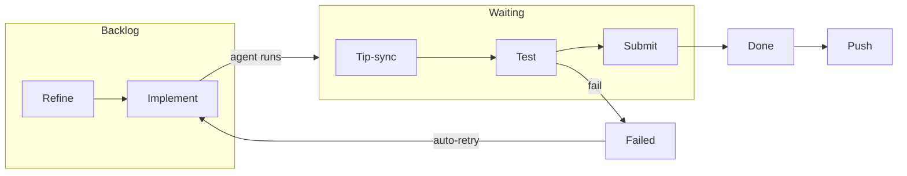

# ⚡ Automation Pipeline

Wallfacer can operate anywhere on the spectrum from fully manual to fully
hands-off. At one extreme, you drag individual cards between columns and
review every result before committing. At the other, you load the
backlog, enable every automation toggle, and let Wallfacer refine,
execute, test, submit, and push without intervention. The automation
pipeline is the set of toggles and background watchers that make
hands-off operation possible.

---

## Essentials

### What is Automation?

Automation is a set of toggles that control background watchers. Each
toggle enables a specific stage of the pipeline -- from promoting tasks
out of the backlog, through testing and submission, to pushing changes
upstream. You can enable any combination to match your workflow, anywhere
on the spectrum from fully manual to fully hands-off.

### The Automation Menu

Open the Automation menu by clicking the lightning bolt icon in the
header bar. The menu contains a horizontal strip of toggle switches:

| Toggle | Label in menu | What it controls |
|--------|---------------|------------------|
| Ideate | **Ideate** | Recurring brainstorm agent (see [Usage Guide](usage.md)) |
| Auto-refine | **Refine** | Automatic prompt refinement for backlog tasks |
| Autopilot | **Implement** | Automatic promotion of backlog tasks to In Progress |
| Tip-sync | **Tip-sync** | Automatic rebase of waiting tasks |
| Auto-test | **Test** | Automatic test verification of waiting tasks |
| Auto-submit | **Submit** | Automatic completion of verified waiting tasks |
| Auto-push | **Push** | Automatic git push after task completion |
| Dep graph | **Dep graph** | Show/hide the dependency graph overlay |

A badge on the lightning bolt icon shows how many toggles are currently
active. All toggles default to off and reset to off on server restart,
except Auto-push which persists via the env file.

### Enabling Autopilot

Autopilot (the **Implement** toggle) automatically promotes the
highest-priority eligible backlog task to In Progress whenever there is
available capacity. The number of tasks that can run simultaneously is
controlled by `WALLFACER_MAX_PARALLEL` (default: 5). Enable it from the
Automation menu or via `PUT /api/config` with `autopilot: true`.

### Enabling Auto-Test

Auto-test (the **Test** toggle) automatically launches the test
verification agent on waiting tasks that have no test result yet and
whose worktrees are up to date with the default branch. Enable it from
the Automation menu or via `PUT /api/config` with `autotest: true`.

### Enabling Auto-Submit

Auto-submit (the **Submit** toggle) automatically moves waiting tasks to
Done when they meet all of the following criteria:

- **Verified:** the task has a passing test result, **or** the task
  completed naturally and Auto-test is disabled.
- **Up to date:** no worktree is behind the default branch.
- **Conflict-free:** no worktree has unresolved merge conflicts.

Enable it from the Automation menu or via `PUT /api/config` with
`autosubmit: true`. Use it together with Auto-test for a fully automated
test-and-submit cycle.

### The Pipeline at a Glance

The automation stages form a left-to-right pipeline. Each stage hands
off to the next when its work is complete:

1. 🔄 **Refine** -- sharpen prompts for unrefined backlog tasks.
2. 🤖 **Implement** (Autopilot) -- promote backlog tasks to In Progress.
3. 🔗 **Tip-sync** -- rebase waiting tasks onto the latest default branch.
4. 🧪 **Test** -- run the verification agent on waiting tasks.
5. ✅ **Submit** -- move verified, conflict-free tasks to Done.
6. 📤 **Push** -- push committed changes to the remote repository.

Auto-retry sits alongside the pipeline: when a task fails with a
transient error, it is automatically returned to the backlog for another
attempt.

---

## Advanced Topics

### Stage Reference (Deep Dive)

#### 🔄 Refine (Auto-refine)

When enabled, the auto-refiner scans the backlog every 30 seconds. For
each task that has never been refined and does not have a refinement
currently running, it launches the refinement agent to produce a
detailed implementation spec. Only one refinement is triggered per poll
cycle to avoid overwhelming the system.

Tasks created by the brainstorm agent (idea-agent tasks) are skipped.

**When to use:** Enable this when you want every task to be refined
before execution, especially useful when combined with Autopilot so
that tasks enter execution with well-specified prompts.

#### 🤖 Implement (Autopilot)

When enabled, the auto-promoter watches for available capacity and
promotes the highest-priority eligible backlog task to In Progress.

**Concurrency limit.** The number of tasks that can run simultaneously
is controlled by `WALLFACER_MAX_PARALLEL` (default: 5). The
auto-promoter will not promote a new task if the current count of
regular in-progress tasks meets or exceeds this limit.

**Priority ordering.** Candidates are ranked by:

1. Critical-path score (tasks with more downstream dependents are
   promoted first).
2. Board position (lower position = higher priority).
3. Creation time (older tasks first, as a tiebreaker).

**Dependency enforcement.** A task is only eligible for promotion when
all of its dependencies have reached Done. Tasks with unsatisfied
dependencies are skipped regardless of their position.

**Scheduled execution.** Tasks with a `ScheduledAt` timestamp are
skipped until the scheduled time arrives. A supplementary 60-second
ticker ensures scheduled tasks are promoted promptly even when no other
board activity triggers a scan.

**Test-fail auto-resume.** When a waiting task has failed a test (up to
3 consecutive failures), the auto-promoter automatically resumes it with
the test failure feedback so the agent can fix the issue. After 3
consecutive test failures, auto-resume halts and the task stays in
Waiting for manual intervention.

**Container circuit breaker.** Promotion is suppressed when the
container runtime circuit breaker is open, preventing cascading failures
when Docker or Podman is temporarily unavailable.

#### 🔗 Tip-sync (Auto-sync)

When enabled, the tip-sync watcher polls every 30 seconds for waiting
tasks whose worktrees have fallen behind the default branch. For each
such task, it:

1. Fetches the latest remote refs.
2. Checks how many commits the worktree is behind.
3. Transitions the task to In Progress and triggers a rebase.

Sync operations are lightweight host-side git rebases -- they do not
launch sandbox containers and therefore bypass the regular task capacity
check. This ensures waiting tasks stay current even when the board is at
full capacity.

**When to use:** Enable this when running many tasks in parallel. As
completed tasks merge into the default branch, waiting tasks
automatically pick up those changes, reducing merge conflicts at submit
time.

#### 🧪 Test (Auto-test)

When enabled, the auto-tester scans for waiting tasks that:

- Have no test result yet (`LastTestResult` is empty).
- Are not currently being tested.
- Have existing worktrees on disk.
- Are up to date with the default branch (not behind).

For each eligible task, it launches the test verification agent.

**Concurrency limit.** Test runs have their own independent limit
controlled by `WALLFACER_MAX_TEST_PARALLEL` (default: 2). Only test-run
in-progress tasks count against this limit; regular implementation tasks
are unaffected.

**Test failure cap.** After 3 consecutive test failures on the same
task without a passing test or manual feedback, the auto-resume cycle
halts. The task remains in Waiting until you intervene.

**Interaction with Tip-sync.** If Tip-sync is also enabled, the
auto-tester waits until the task's worktrees are fully up to date before
triggering a test. This prevents testing against stale code.

#### ✅ Submit (Auto-submit)

When enabled, the auto-submitter scans for waiting tasks that meet all
of the following criteria:

- **Verified:** the task has a passing test result (`LastTestResult` is
  "pass"), **or** the task completed naturally (stop reason is
  `end_turn`) and Auto-test is disabled.
- **Up to date:** no worktree is behind the default branch.
- **Conflict-free:** no worktree has unresolved merge conflicts.
- **Not currently being tested:** the test agent is not running.

When all conditions are met, the task is moved through the commit
pipeline (committing state) and then to Done.

**When to use:** Enable this together with Auto-test for a fully
automated test-and-submit cycle. If you want to review diffs before
committing, leave this toggle off.

#### 📤 Push (Auto-push)

When enabled, completed tasks are automatically pushed to the remote
repository after their changes are committed to the default branch.

**Threshold.** `WALLFACER_AUTO_PUSH_THRESHOLD` sets the minimum number
of completed tasks before a push is triggered (default: 1). This lets
you batch multiple task completions into a single push.

**Persistence.** Unlike other toggles, Auto-push is persisted in the
env file (`WALLFACER_AUTO_PUSH=true`). It survives server restarts.

**When to use:** Enable this when you want changes to appear on the
remote automatically. Disable it if you prefer to review the local
branch before pushing.

### 🔁 Auto-Retry

Auto-retry operates alongside the main pipeline. When a task fails, the
runner classifies the failure into one of seven categories:

| Category | Value | Retryable | Default budget |
|----------|-------|-----------|----------------|
| Container crash | `container_crash` | Yes | 2 |
| Worktree setup | `worktree_setup` | Yes | 1 |
| Sync error | `sync_error` | Yes | 2 |
| Timeout | `timeout` | No | -- |
| Budget exceeded | `budget_exceeded` | No | -- |
| Agent error | `agent_error` | No | -- |
| Unknown | `unknown` | No | -- |

**How it works.** Each task is created with a per-category retry budget
(`AutoRetryBudget`). When a task fails with a retryable category, the
auto-retrier checks:

1. Is the category retryable (container_crash, worktree_setup, or
   sync_error)?
2. Does the task still have budget remaining for that category?
3. Has the task not exceeded the global retry cap (3 total retries
   across all categories)?
4. For container crashes: is the container circuit breaker closed?

If all checks pass, the task is reset to Backlog and the retry count
is incremented. The auto-promoter will then pick it up again in the
normal priority order.

Non-retryable categories (timeout, budget_exceeded, agent_error,
unknown) always require manual review. These represent issues that are
unlikely to resolve by simply re-running the task.

**Recovery scan.** On server startup, the auto-retrier scans for any
failed tasks that were missed while the server was down and retries
eligible ones immediately.

### Task Dependencies and Automation

Tasks can declare dependencies on other tasks via the `DependsOn` field.
Dependencies form a directed acyclic graph (DAG) that the auto-promoter
respects:

- A task is only promoted when **all** of its dependencies have reached
  Done.
- Dependencies are checked during Phase 1 of the two-phase promotion
  protocol, allowing the potentially slow dependency check to run
  without blocking other watchers.
- Cycle detection prevents creating circular dependencies.

**Dependency graph overlay.** Toggle "Dep graph" in the Automation menu
to display a visual overlay on the board showing dependency relationships
as bezier curves between task cards.

**Batch creation with dependencies.** Use `POST /api/tasks/batch` to
create multiple tasks atomically with symbolic dependency wiring. Tasks
in the batch can reference each other by position, and the dependency
edges are resolved as part of the same atomic operation.

### ⏰ Scheduled Execution

Set the `ScheduledAt` field on a task to delay its execution until a
specific time. The auto-promoter checks this field and skips tasks whose
scheduled time has not yet arrived. A 60-second polling ticker ensures
scheduled tasks are picked up promptly once their time arrives.

Scheduled execution works with dependencies: a task must satisfy both
its schedule and its dependency requirements before it is eligible for
promotion.

### 🛡️ Circuit Breakers

Each automation watcher has its own circuit breaker that provides fault
isolation. When a watcher encounters an error, its breaker opens with
exponential backoff:

| Failure | Cooldown |
|---------|----------|
| 1st | 30 seconds |
| 2nd | 1 minute |
| 3rd | 2 minutes |
| 4th | 4 minutes |
| 5th+ | 5 minutes (cap) |

A single success resets the breaker completely. Breakers only affect
automated actions; manual operations always work regardless of breaker
state.

**Watcher health.** The current health status of all watchers is
included in the `GET /api/config` response (`watcher_health` field) and
displayed in the header when any breaker is tripped.

**Container breaker.** A separate circuit breaker protects against the
container runtime (Docker/Podman) being unavailable. It opens after 5
consecutive runtime failures and uses a closed/open/half-open
three-state model. See [Circuit Breakers](circuit-breakers.md) for full
details.

### Configuration Reference

| Variable | Default | Description |
|----------|---------|-------------|
| `WALLFACER_MAX_PARALLEL` | 5 | Maximum concurrent implementation tasks |
| `WALLFACER_MAX_TEST_PARALLEL` | 2 | Maximum concurrent test runs |
| `WALLFACER_AUTO_PUSH` | `false` | Enable auto-push after task completion |
| `WALLFACER_AUTO_PUSH_THRESHOLD` | 1 | Minimum completed tasks before auto-push triggers |
| `WALLFACER_CONTAINER_CB_THRESHOLD` | 5 | Runtime failures before container breaker opens |
| `WALLFACER_CONTAINER_CB_OPEN_SECONDS` | 30 | Seconds the container breaker stays open |

All automation toggles (except Auto-push) are also available via
`PUT /api/config` with the fields `autopilot`, `autotest`, `autosubmit`,
`autosync`, and `autorefine`.

### API Endpoints

| Method | Path | Description |
|--------|------|-------------|
| `GET` | `/api/config` | Current toggle states and watcher health |
| `PUT` | `/api/config` | Update toggle states |
| `GET` | `/api/debug/runtime` | Container circuit breaker state |
| `POST` | `/api/tasks/{id}/test` | Manually trigger test verification |
| `POST` | `/api/tasks/{id}/sync` | Manually sync task worktrees |
| `POST` | `/api/tasks/{id}/done` | Manually mark task as done |
| `POST` | `/api/tasks/{id}/resume` | Resume a failed task |
| `POST` | `/api/tasks/batch` | Create tasks with dependency wiring |

---

## See Also

- [Board & Tasks](usage.md) for task lifecycle and manual operations
- [Circuit Breakers](circuit-breakers.md) for breaker internals
- [Getting Started](getting-started.md) for initial setup and configuration
