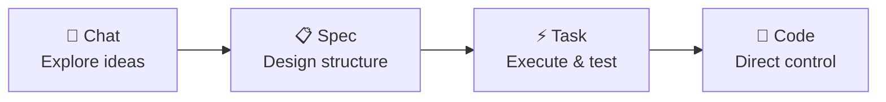
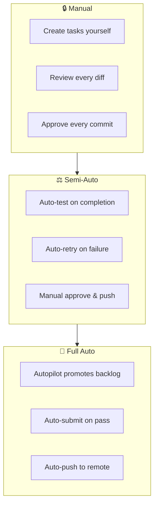

# The Autonomy Spectrum

Every AI coding tool pins you to one interaction mode. Some are chatbots that require constant hand-holding. Others are fire-and-forget agents that run off on their own and surface hours later with unpredictable results. Wallfacer gives you a continuous spectrum between these extremes, and lets you move freely along it depending on what the work demands.

<!-- In-app animated illustration: an indicator gliding along the autonomy spectrum.
     Renders in the in-app docs viewer; GitHub shows the diagram above. -->
<svg viewBox="0 0 720 104" role="img" aria-label="An indicator gliding along the spectrum from Chat to Spec to Task to Code" style="display:block;width:100%;max-width:540px;height:auto;margin:1.25rem auto;font-family:inherit">
  <defs>
    <linearGradient id="wf-spectrum" x1="0" y1="0" x2="1" y2="0">
      <stop offset="0" stop-color="var(--accent-soft,rgba(99,102,241,0.25))"/>
      <stop offset="1" stop-color="var(--accent,#6366f1)"/>
    </linearGradient>
  </defs>
  <rect x="60" y="40" width="600" height="8" rx="4" fill="url(#wf-spectrum)"/>
  <g fill="var(--bg-card,#f6f7f9)" stroke="var(--border,#e2e4e8)" stroke-width="1.5">
    <circle cx="60"  cy="44" r="6"/>
    <circle cx="260" cy="44" r="6"/>
    <circle cx="460" cy="44" r="6"/>
    <circle cx="660" cy="44" r="6"/>
  </g>
  <g font-size="13" text-anchor="middle" fill="var(--text,#1d1f23)">
    <text x="60"  y="74">Chat</text>
    <text x="260" y="74">Spec</text>
    <text x="460" y="74">Task</text>
    <text x="660" y="74">Code</text>
  </g>
  <g font-size="11" fill="var(--text-muted,#8a8f98)">
    <text x="60"  y="94" text-anchor="start">more freedom</text>
    <text x="660" y="94" text-anchor="end">more precision</text>
  </g>
  <g>
    <animateTransform attributeName="transform" type="translate"
      values="0,0; 0,0; 200,0; 400,0; 600,0; 600,0; 400,0; 200,0; 0,0"
      keyTimes="0; 0.05; 0.21; 0.37; 0.5; 0.55; 0.71; 0.87; 1"
      dur="13s" repeatCount="indefinite"/>
    <circle cx="60" cy="44" r="14" fill="var(--accent,#6366f1)" opacity="0.2"/>
    <circle cx="60" cy="44" r="8"  fill="var(--accent,#6366f1)"/>
  </g>
</svg>

---

## The Four Levels

Wallfacer organizes work into four levels, from highest autonomy to most direct control.

### Chat (Conversational Exploration)

You describe what you want in natural language. The agent shapes ideas, explores trade-offs, and proposes directions. This is the entry point for greenfield work -- when you do not yet know what to build.

The planning chat (accessible in Plan mode) is a persistent conversation that runs as a host process in the task's git worktree. It can read your codebase, create files, and execute commands while you steer the direction. The worktree is what isolates the work, so changes stay contained in their own branch until you accept them.

### Spec (Structured Design)

Ideas crystallize into structured documents with lifecycle states, dependencies, and acceptance criteria. Specs track progress through a six-state lifecycle: the main axis runs vague → drafted → validated → complete, with `stale` and `archived` as off-axis states for designs that have drifted from reality or been set aside. Transitions are not free-form, they are enforced by a server-side state machine (`internal/spec/lifecycle.go`) that rejects illegal jumps and keeps dispatched work consistent with the underlying spec.

At this level, agents iterate on design rather than code. They break large specs into sub-specs, validate consistency across the dependency graph, and analyze cross-impacts with existing plans. The output is a blueprint, not a pull request.

### Task (Managed Execution)

Specs break into executable tasks on a task board. Each task picks a **flow**, an ordered chain of sub-agents the runner walks through. The default `implement` flow runs impl, then test, then a parallel finishing step (commit-msg, title, oversight) that writes the commit message, names the change, and produces a review summary. Each step in a flow is an agent that can be cloned or replaced, optionally pinned to a specific coding harness (Claude or Codex), and given a custom system prompt. You review diffs, oversight summaries, and test verdicts before accepting the work.

This is where most day-to-day work happens. Tasks are concrete, trackable, and independently testable. For how to change what runs inside a task (the flow picker, cloning agents, building custom pipelines), see [Agents & Flows](agents-and-flows.md).

### Code (Direct Control)

The file explorer, integrated terminal, and inline editor give you direct access to workspace files. Drop into the code when you need surgical precision -- fix a typo, inspect a log, or manually resolve a conflict.

No agent is involved at this level unless you choose to invoke one.

---

## The Autonomy Dial

At each level, you choose how much freedom the agent gets. Three broad modes exist:

**Manual** -- You create tasks yourself, review every diff, approve every commit. Maximum control, minimum throughput.

**Semi-automatic** -- Agents execute and test automatically, but you approve before changes are merged. Auto-test catches regressions; auto-retry handles transient failures. You still review and accept.

**Full automatic** -- Autopilot promotes backlog tasks as capacity opens. Auto-submit merges passing work without approval. Auto-push sends changes to the remote. You monitor rather than manage.

These modes are not discrete settings but composable toggles. Enable auto-test without auto-submit. Turn on autopilot but keep auto-push off. The combination you choose defines where you sit on the spectrum for any given session.

---

## Moving Between Levels

You do not have to start at chat and work down. Jump to any level based on what you know:

- **Got a clear spec?** Dispatch it directly to the task board.
- **Want to explore a vague idea?** Start in the planning chat.
- **Know exactly what to fix?** Create a task with a concrete prompt.
- **Need to edit one line?** Open the file explorer or terminal.

Nothing stops you from starting a task, switching to the terminal to debug something mid-run, providing feedback based on what you see, and then letting the agent continue. The levels are access points, not a mandatory pipeline.

---

## Moving Up and Down

Work flows naturally between levels in both directions:

- **Up (more autonomy):** A chat conversation produces a spec. The spec is broken down into tasks. Tasks execute automatically.
- **Down (more control):** A failing task surfaces a problem. You inspect the diff, open the terminal to reproduce it, fix the issue manually, then let the agent continue from the corrected state.

The value of the spectrum is that you spend your attention where it matters and delegate the rest.

---

## Self-Development

Wallfacer builds itself using this spectrum. Most recent features -- the spec explorer, planning chat, file editor, dependency graph -- were designed as specs, broken into tasks, and implemented by Wallfacer's own agents running on its own task board.

The workflow you use is the same workflow the project uses to evolve itself.

---

## See Also

- [Exploring Ideas](exploring-ideas.md) -- the planning chat (Chat level)
- [Designing Specs](designing-specs.md) -- structured design (Spec level)
- [Board & Tasks](board-and-tasks.md) -- managed execution (Task level)
- [Configuration](configuration.md) -- automation toggles for the autonomy dial
