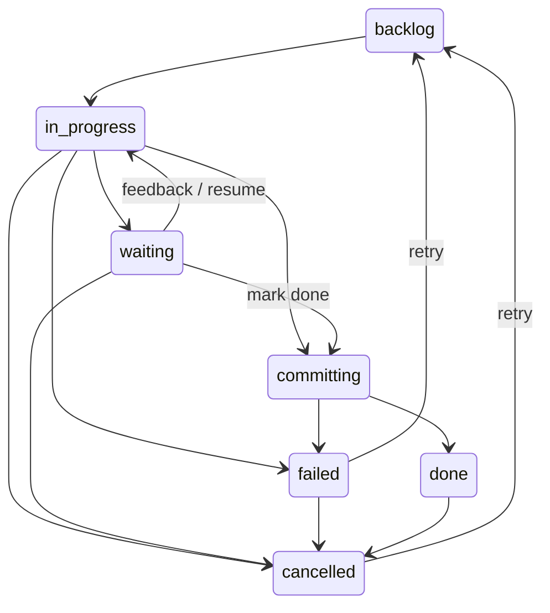

# 📋 Board & Tasks

Wallfacer organizes work on a four-column task board. You create tasks as cards in the Backlog, move them to In Progress to trigger agent execution inside an isolated sandbox container, review results when the agent pauses or finishes, and accept completed work into your repository. This guide covers every aspect of the task board, from creating and configuring tasks to inspecting results and managing the full task lifecycle.

---

## Essentials

### Board Columns

| Column | Status shown | What it means |
|---|---|---|
| **📌 Backlog** | `backlog` | Queued tasks waiting to be started. You can edit their prompt, settings, and dependencies here. |
| **🔄 In Progress** | `in_progress` / `committing` | A sandbox container is running the agent. Live logs stream in the detail panel. |
| **⏸️ Waiting** | `waiting` | The agent has paused and needs your input -- feedback, approval, or a test run. |
| **✅ Done** | `done` / `failed` / `cancelled` | Terminal states. Done tasks have their changes committed. Failed and cancelled tasks retain their history for retry. |

Archived tasks (done or cancelled) are hidden from the Done column by default. Toggle "Show archived tasks" in Settings to reveal them.

### Task States

The full state machine is:



Allowed transitions:

| From | To |
|---|---|
| `backlog` | `in_progress` |
| `in_progress` | `backlog`, `waiting`, `failed`, `cancelled` |
| `committing` | `done`, `failed` |
| `waiting` | `in_progress`, `committing`, `cancelled` |
| `failed` | `backlog`, `cancelled` |
| `done` | `cancelled` |
| `cancelled` | `backlog` |

### ➕ Creating a Task

Click **+ New Task** in the Backlog column header to expand the creation form. The basic fields are:

1. **Prompt textarea** -- describe what the agent should do. Markdown is supported. A draft is auto-saved to local storage so you do not lose work if you navigate away.

2. **🏷️ Tags** -- type a label and press Enter or comma to add it. Tags are lowercase. Use Backspace on an empty input to remove the last tag.

3. **📦 Sandbox selector** -- choose which sandbox environment to use (e.g. Claude, Codex). Defaults to the global setting.

4. **⏱️ Timeout** -- how long the container is allowed to run before being stopped. Options: 5 min, 15 min, 30 min, 1 hour (default), 2 hours, 6 hours, 12 hours, 24 hours.

Click **Add** to create the task. It appears in the Backlog column with an auto-generated title.

Each task has three text fields that form a hierarchy: **Title** (2-5 word label), **Goal** (1-3 sentence summary shown on the card), and **Prompt** (full spec for the agent). At creation, the goal defaults to the prompt text. After refinement, the goal is updated to a concise summary while the prompt becomes the detailed implementation spec. You can edit the goal independently in the task detail modal.

For advanced creation options (templates, batch creation, dependencies, budgets, scheduling, per-activity sandbox overrides, and share-code), see the [Advanced Topics](#advanced-topics) section below.

### ⚡ Running a Task

When a task moves from Backlog to In Progress (by dragging the card, clicking "Start task" in the detail modal, or via Autopilot), the server:

1. Creates an isolated git branch (`task/<uuid-prefix>`) for each workspace
2. Sets up git worktrees so the agent works on a copy, not your main branch
3. Launches an ephemeral sandbox container with the agent
4. Begins streaming live output via Server-Sent Events

Each round-trip with the agent (one prompt, one response) is a "turn". The turn count is displayed on the task card and in the detail modal. Token usage and cost are tracked per turn, and the full per-turn breakdown is available in the detail modal under Usage.

Some stop reasons trigger automatic continuation rather than a state change:

- `max_tokens` -- the agent hit the output token limit; the runner automatically continues in the same session
- `pause_turn` -- similar auto-continue behavior

When the agent signals `end_turn`, the task enters the `committing` state. The commit pipeline:

1. The agent commits its changes
2. Rebases the task branch onto the current default branch
3. Fast-forward merges into the default branch
4. Cleans up the task branch and worktree

If a rebase conflict occurs, the agent is invoked again (same session) to resolve it, with up to three attempts before the task is marked Failed.

If the agent reaches a point where it needs user input (empty stop reason), the task transitions to Waiting.

A task fails when the container crashes, the timeout expires, a budget limit is exceeded, or the agent encounters an unrecoverable error. See [Task Budgets](#task-budgets) for budget-related failures.

### 🔍 Reviewing Results

Click any task card to open its detail modal. The layout adapts based on the task's state.

**Left panel** (always visible):

- **Header** -- status badge, tags, elapsed time, and short task ID
- **Title** -- displayed when the task has a generated or manually set title
- **Prompt** -- the task description, rendered as Markdown with a toggle to view raw text and a copy button
- **Usage** -- token counts (input, output, cache read, cache creation), total cost, and per-activity breakdown
- **Events timeline** -- chronological audit trail of state changes, outputs, feedback, errors, and system events

**Right panel** (appears for non-backlog tasks) key tabs:

| Tab | Content |
|---|---|
| **Implementation** | Live agent logs with three viewing modes: Oversight (high-level summary), Pretty (formatted output), and Raw (unprocessed NDJSON). Includes a log search/filter bar. |
| **Changes** | Git diff of the task's worktree changes vs the default branch. Shows per-file diffs with syntax highlighting. Includes a commit message section and a "behind" indicator if the branch is behind the default. |

For the full detail modal reference including all left panel sections, right panel tabs (Testing, Flamegraph, Timeline), and the backlog refinement interface, see [Task Detail Modal (Full Reference)](#task-detail-modal-full-reference).

### 📝 Handling Waiting Tasks

When a task is in the Waiting state, open its detail modal to see the agent's last output, then choose an action:

| Action | Effect |
|---|---|
| **Submit Feedback** | Type a message in the feedback textarea and click Submit. The agent resumes from where it paused with your message as the next input. |
| **✅ Mark as Done** | Skip remaining agent turns and trigger the commit pipeline to merge changes as-is. |
| **🧪 Test** | Expand the test section, optionally enter acceptance criteria, and click "Run Test Agent" to launch a verification agent on the current code state. |
| **❌ Cancel** | Discard all prepared changes, clean up the container and worktrees, and move the task to Cancelled. History and logs are preserved. |

### 🧪 Test Verification

Test verification lets you check whether a task's changes actually work before committing them. You can trigger a test from a **Waiting** task (the most common case), or from **Done** or **Failed** tasks to verify their state.

**Running a test:**

1. Open the task detail modal.
2. Expand the **Test** section in the left panel.
3. Optionally enter acceptance criteria -- specific requirements the agent should verify beyond running the project's existing test suite.
4. Click **Run Test Agent**.

While the test runs, the task moves back to **In Progress** (the card shows a test indicator to distinguish it from normal execution). A separate verification agent launches in its own container, inspects the task's code changes, runs relevant tests, and reports a **Pass** or **Fail** verdict. When the test finishes, the task returns to **Waiting** with the verdict displayed as a badge on the card.

**After reviewing the verdict:**

- **Pass** -- click **Mark Done** to commit the changes.
- **Fail** -- send feedback to the agent describing what went wrong, let it fix the issues, then re-test.

You can run tests multiple times; each run overwrites the previous verdict. Test logs are visible in the **Testing** tab of the right panel. The test agent uses a customizable system prompt (`test.tmpl`) and can run on a different sandbox than the implementation agent (see [Configuration](configuration.md)).

For automated testing, see [Auto-Test](automation.md).

### 🔍 Search

The search bar in the board header filters visible cards in real time. Type any text to filter by title, prompt content, or tags. Use `#tagname` to filter by specific tags. Press `/` to focus the search bar from anywhere on the board. Press Escape to clear and blur.

Press **Cmd+K** (or Ctrl+K) to open the command palette for fuzzy task search and context-sensitive actions. For full details on server-side search and command palette features, see [Search (Full Reference)](#search-full-reference).

Press **n** to open the new task form from anywhere on the board (focus lands on the prompt textarea so you can start typing immediately). Press **?** to see the full keyboard shortcuts reference. For the complete shortcut list, see [Keyboard Shortcuts](oversight-and-analytics.md#keyboard-shortcuts).

### 📂 File Explorer

The file explorer panel lets you browse workspace files directly in the web UI without leaving the board.

**Opening the explorer:** Click the folder icon in the header toolbar, or press **E** on your keyboard. The panel appears on the left side of the board. Press **E** again or click the button to close it.

**Browsing files:** Each active workspace appears as a root folder in the tree. Click a folder to expand it -- contents are loaded one level at a time from the server. Click again to collapse. Dot-prefixed entries (`.git`, `.env`, etc.) appear dimmed. Directories are listed first, then files, both in case-insensitive alphabetical order.

**File preview:** Click any file to open a syntax-highlighted preview modal. The modal shows line-numbered code with language detection based on the file extension. Binary files and files exceeding 2 MB show a placeholder message instead of content. Press **Escape** or click outside the modal to close it.

**Resizing:** Drag the right edge of the explorer panel to adjust its width (minimum 200 px, maximum 50% of the viewport). Double-click the resize handle to reset to the default 260 px. The panel width and open/closed state persist across page reloads via localStorage.

**Editing files:** In the file preview modal, click **Edit** to switch to a plain-text editor. Make your changes, then click **Save** to write the file back to the workspace, or **Discard** to revert. If you try to close the modal or discard with unsaved changes, a confirmation prompt appears. The Tab key inserts a tab character in the editor. Saving uses an atomic write (temp file + rename) so partial writes cannot corrupt the file. Files inside `.git/` directories cannot be edited, and content exceeding 2 MB is rejected. Saves use `PUT /api/explorer/file` with a JSON body of `{path, workspace, content}`.

**Keyboard navigation:** When focused inside the tree, use arrow keys to navigate between nodes. **Right arrow** expands a collapsed directory, **Left arrow** collapses an expanded one (or moves to the parent). **Enter** toggles directories or opens file preview.

---

## Advanced Topics

### ⏰ Routine Tasks

Routine tasks are board cards that run on a schedule. The card itself never executes — when its interval elapses the server spawns a fresh **instance task** with the routine's prompt, and the routine card stays on the board waiting for the next cycle.

A routine card carries:

- **Prompt / goal** — what the spawned instance should do.
- **Interval (minutes)** — the fixed schedule; minimum of 1 minute. Editable anytime.
- **Enabled toggle** — pauses the schedule without losing the interval.
- **Spawn kind** — usually blank (spawns a normal task); `idea-agent` is reserved for the system ideation routine.

The interactive controls live on the routine card (a dedicated UI ships alongside this feature). Programmatic access is exposed via the `/api/routines` endpoints:

- `GET /api/routines` — list routine cards with their schedules and next-run times.
- `POST /api/routines` — create a routine: `{prompt, interval_minutes, spawn_kind?, enabled?, goal?, tags?, timeout?}`.
- `PATCH /api/routines/{id}/schedule` — update interval and/or enabled flag; fields omitted from the body are left unchanged.
- `POST /api/routines/{id}/trigger` — fire immediately; the scheduled cycle continues unchanged afterwards.

Routine cards are filtered out of auto-promote, auto-refine, and the dependency graph — they stay pinned in backlog regardless of capacity. To remove a routine, delete its card with `DELETE /api/tasks/{id}` (or the UI's delete action); its pending fires are dropped atomically.

### 📝 Prompt Templates

Save reusable prompt patterns so you do not have to retype common instructions:

- **Save a template**: open **Settings > Prompt Templates** (or the Templates Manager from the new task form). Enter a name and body, then click Save.
- **Insert a template**: click the **Templates** button in the new task form. A searchable dropdown appears; click a template to replace the prompt content.
- **Delete a template**: open the Templates Manager, find the template, and click Delete.

Templates are also available via the API:
- `GET /api/templates` -- list all templates
- `POST /api/templates` -- create a new template (`{name, body}`)
- `DELETE /api/templates/{id}` -- delete a template

### 📦 Batch Task Creation

Use `POST /api/tasks/batch` to create multiple tasks in a single atomic operation. This endpoint supports **symbolic dependency wiring**: tasks in the batch can reference each other by their position index so that dependencies are wired up without needing to know task IDs in advance.

Request format:

```json
{
  "tasks": [
    { "prompt": "Set up the database schema", "timeout": 60 },
    { "prompt": "Build the API layer", "timeout": 60, "depends_on_refs": [0] },
    { "prompt": "Write integration tests", "timeout": 30, "depends_on_refs": [0, 1] }
  ]
}
```

In this example, task 1 depends on task 0, and task 2 depends on both tasks 0 and 1. The server validates the dependency graph for cycles before creating any tasks. On success it returns 201 with the created tasks and a mapping from reference indices to actual task IDs.

### 🔗 Task Dependencies

#### Declaring Prerequisites

When creating or editing a backlog task, use the **Depends on** picker to select prerequisite tasks. A task with unmet dependencies will not be auto-promoted by Autopilot even if capacity is available.

#### Dependency Badges

Backlog cards with dependencies display a badge:

- **Blocked** (amber) -- one or more prerequisites have not reached Done. The badge shows the dependency count and hovering reveals the names of blocking tasks.
- **Ready** (green) -- all prerequisites are satisfied; the task is eligible for promotion.

#### Dependency Graph Visualization

Toggle the dependency graph overlay from the board toolbar. It draws bezier-curve arrows between cards that have `depends_on` relationships:

- **Green solid line** -- the dependency is done
- **Red dashed line** -- the dependency failed
- **Amber dashed line** -- the dependency is in any other state

The graph redraws automatically when you scroll the board columns.

### Scheduled Execution

Set the **Schedule start** field on a backlog task to a future date and time. The auto-promoter will skip this task until the scheduled time arrives. Once the time passes, the task becomes eligible for promotion like any other backlog task (subject to capacity and dependency constraints).

The auto-promoter arms a precise one-shot timer for the soonest scheduled task, so promotion happens within milliseconds of the due time rather than waiting for the next 60-second polling tick.

The task card displays a relative time indicator (e.g. "in 3h") when a schedule is set and the time has not yet arrived.

### Task Budgets

The new task form includes an expandable **Budget limits** section:

- **Cost limit (USD)** -- stop execution when accumulated cost exceeds this value. 0 = unlimited.
- **Input token limit** -- stop execution when cumulative input + cache tokens exceed this value. 0 = unlimited.

When a task enters Waiting because a budget limit was hit, a yellow banner appears in the detail modal showing which limit was reached. Click **Raise limit** to adjust the cost or token limit and allow execution to continue.

Failure categories related to budgets:

| Category | Meaning |
|---|---|
| `timeout` | Container ran past its timeout |
| `budget_exceeded` | Cost or token limit reached |
| `worktree_setup` | Git worktree creation failed |
| `container_crash` | Container exited unexpectedly |
| `agent_error` | Agent reported an error |
| `sync_error` | Rebase or merge conflict unresolvable |
| `unknown` | Uncategorized failure |

### Fresh Start Flag

When retrying a task that has a previous session, the **fresh_start** flag controls whether the agent starts from scratch or resumes the existing session:

- **Fresh start enabled** (default for retries) -- the agent starts a new session with no memory of previous turns
- **Fresh start disabled** (resume) -- the agent continues in the previous session, retaining full context

Toggle this via the "Resume previous session" checkbox in the retry or backlog settings sections.

### 🗑️ Soft Delete and Restore

Deleting a task creates a tombstone rather than immediately removing data. Soft-deleted tasks are recoverable for 7 days (configurable via `WALLFACER_TOMBSTONE_RETENTION_DAYS`). The confirmation dialog warns about this retention period. After the retention window, data is permanently pruned on the next server startup.

To restore a deleted task, use `POST /api/tasks/{id}/restore` or view deleted tasks via `GET /api/tasks/deleted`.

### Task Actions Reference

#### 🔄 Retry

Available on: `done`, `failed`, `waiting`, `cancelled`

Moves the task back to Backlog with the same (or edited) prompt. The retry section in the detail modal lets you modify the prompt before resetting. If the task has a previous session, you can check "Resume previous session" to continue from the existing context rather than starting fresh.

#### Resume

Available on: `failed` (when a session ID exists)

Resumes the failed task in its existing session with an extended timeout. The agent picks up where it left off rather than restarting from scratch. Choose a timeout from the dropdown before clicking Resume.

#### Archive / Unarchive

Available on: `done`, `cancelled`

Archive hides a task from the Done column. Unarchive restores it. Use **Archive All Done** from the board toolbar to archive every completed task at once. Archived tasks retain their full history and can be viewed by enabling "Show archived tasks" in Settings.

#### Sync

Available on: `waiting`, `failed`

Rebases the task's worktree branches onto the latest default branch without merging. This brings in changes that other tasks may have committed since this task started.

#### 🧪 Test

Available on: `waiting`, `done`, `failed`

Launches a separate verification agent that inspects the code changes and runs tests. You can optionally provide acceptance criteria. The verdict (pass/fail) appears as a badge on the card. Run tests multiple times -- each run overwrites the previous verdict.

#### ❌ Cancel

Available on: `backlog`, `in_progress`, `waiting`, `failed`, `done`

Kills the container (if running), discards worktrees, and moves the task to Cancelled. All history, logs, and events are preserved so the task can be retried later.

### Task Detail Modal (Full Reference)

Click any task card to open its detail modal. The layout adapts based on the task's state.

#### Left Panel

The left panel is always visible and contains:

- **Header** -- status badge, tags, elapsed time, and short task ID
- **Title** -- displayed when the task has a generated or manually set title
- **Prompt** -- the task description, rendered as Markdown with a toggle to view raw text and a copy button
- **Prompt History** -- collapsible section showing previous prompt versions (visible when the prompt has been edited)
- **Retry History** -- collapsible section listing previous execution attempts with their status, cost, and truncated results
- **Dependencies** -- "Blocked by" section with live status badges and links to prerequisite tasks
- **Settings** (backlog only) -- editable sandbox, timeout, model override, scheduled start, share-code toggle, budget limits, per-activity sandbox overrides, and dependency picker. Changes auto-save with a 500ms debounce.
- **Edit Prompt** (backlog only) -- editable textarea for the task prompt with tag input
- **Start Task** button (backlog only)
- **Resume Session** section (failed tasks with an existing session) -- resume button with timeout selector
- **Implementation / Testing tabs** -- summary of agent outputs organized by activity phase
- **Usage** -- token counts (input, output, cache read, cache creation), total cost, budget indicator, and per-activity breakdown (implementation, testing, refinement, title, oversight, commit message, idea agent)
- **Environment** -- collapsible provenance section showing container image, model, API base URL, instructions hash, and sandbox type
- **Feedback form** (waiting tasks) -- textarea and buttons for Submit Feedback, Mark as Done, and Test
- **Retry section** (done/failed/cancelled) -- editable prompt and Move to Backlog button
- **Events timeline** -- chronological audit trail of state changes, outputs, feedback, errors, and system events
- **Archive/Unarchive** -- for done/cancelled tasks
- **Cancel** -- for backlog, in progress, waiting, and failed tasks
- **Delete** -- soft-delete with confirmation

#### Right Panel

The right panel appears for non-backlog tasks and has five tabs:

| Tab | Content |
|---|---|
| **Implementation** | Live agent logs with three viewing modes: Oversight (high-level summary), Pretty (formatted output), and Raw (unprocessed NDJSON). Includes a log search/filter bar. |
| **Testing** | Test agent logs (same three viewing modes). Visible when test verification has been run. |
| **Changes** | Git diff of the task's worktree changes vs the default branch. Shows per-file diffs with syntax highlighting. Includes a commit message section and a "behind" indicator if the branch is behind the default. |
| **Flamegraph** | Visual timeline of execution spans (worktree setup, agent turns, container runs, commits) rendered as a flamegraph. Visible when the task has completed at least one turn. |
| **Timeline** | Interactive chart of the same span data presented as a timeline view. |

#### Backlog Right Panel (Refinement)

For backlog tasks, the right panel shows the AI refinement interface instead:

- **Refine with AI** -- launch a sandbox agent to analyze the codebase and produce a detailed implementation spec
- **Focus or context** -- optional textarea to guide the refinement agent
- **Running state** -- live logs from the refinement container with pretty/raw toggle
- **Result state** -- editable spec with Apply (replace task prompt) and Dismiss buttons
- **Refinement history** -- previous refinement sessions

### Task Card Anatomy

Each card on the board displays:

- **Title** -- auto-generated from the prompt after creation, or set manually
- **Goal / Prompt preview** -- the card body shows the task's goal (a concise 1-3 sentence summary). If no goal is set, it falls back to the full prompt. For idea-agent tasks, the execution prompt is shown instead.
- **Status badge** -- color-coded indicator of the current state (backlog, in progress, waiting, done, failed, cancelled)
- **Tags** -- user-defined labels for categorization; special tag styles exist for `idea-agent`, `priority:N`, `impact:N`, and brainstorm categories
- **Dependency badge** -- for backlog tasks with dependencies: amber "blocked" badge (with unmet count) or green "ready" badge when all prerequisites are done
- **Time** -- elapsed time since the task started or was created
- **Cost** -- accumulated USD cost across all turns
- **Test result** -- pass/fail badge when test verification has been run
- **Scheduled indicator** -- shows relative time until scheduled start (e.g. "in 3h")
- **Task ID** -- short 8-character UUID prefix, visible on hover and in the detail modal

Click any card to open its detail modal.

### Search (Full Reference)

#### Header Search Bar

The search bar in the board header filters visible cards in real time. Type any text to filter by title, prompt content, or tags. Use `#tagname` to filter by specific tags. Press `/` to focus the search bar from anywhere on the board. Press Escape to clear and blur.

#### Server-Side Search (@mentions)

Prefix your query with `@` to trigger server-side search. This searches across all tasks (including archived ones) by title, prompt, tags, and oversight summaries. Results appear in a dropdown below the search bar, showing the matched field and a context snippet. Click a result to open its detail modal.

Server-side search requires at least 2 characters after the `@` prefix and debounces input by 250ms to avoid excessive API calls.

#### Command Palette (Cmd+K)

Press **Cmd+K** (or Ctrl+K) to open the command palette. It provides:

- **Fuzzy task search** -- type to filter tasks by title, prompt, or short ID
- **Server search** -- prefix with `@` for server-side search (same as the header bar)
- **Context actions** -- when a task is selected, the palette shows available actions based on the task's current state:
  - Backlog: Start
  - Waiting: Run test, Mark done
  - Failed (with session): Resume
  - Done/Failed/Waiting/Cancelled: Retry
  - Done/Cancelled (not archived): Archive
  - Waiting/Failed: Sync with default
  - Any non-backlog: Open task, Open testing, Open changes, Open flamegraph, Open timeline

Navigate with arrow keys, press Enter to execute, and Escape to close.

For the full HTTP API reference, see [API & Transport](../internals/api-and-transport.md).

---

## See Also

- [Workspaces](workspaces.md) -- workspace management, git branches, and multi-repo setups
- [Automation](automation.md) -- autopilot, auto-test, auto-submit, auto-retry, and circuit breakers
- [Refinement & Ideation](refinement-and-ideation.md) -- prompt refinement and brainstorm agents
- [Oversight & Analytics](oversight-and-analytics.md) -- oversight summaries, usage statistics, and cost tracking
- [Configuration](configuration.md) -- environment variables, sandbox setup, and server settings
