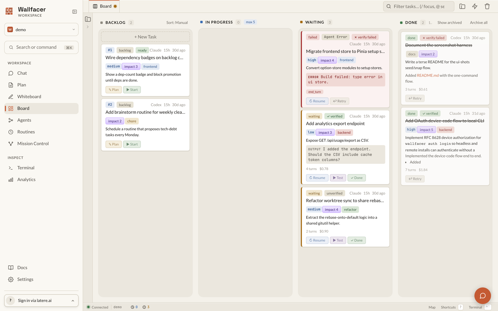
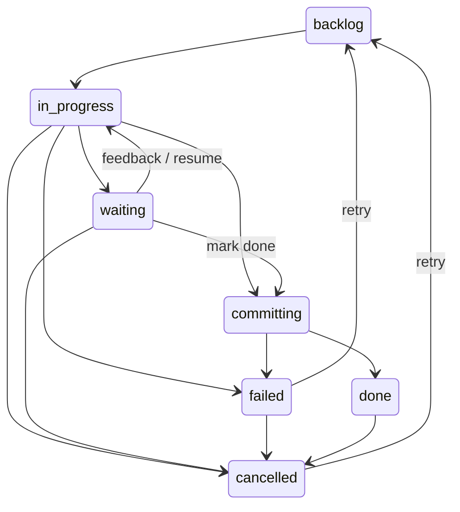
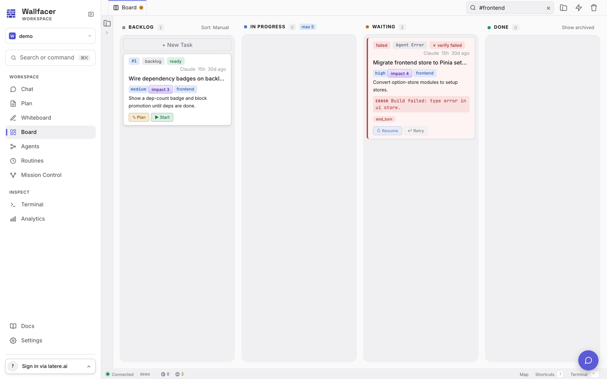

# Board & Tasks

Wallfacer organizes work on a four-column task board. You create tasks as cards in the Backlog, move them to In Progress to trigger agent execution, review results when the agent pauses or finishes, and accept completed work into your repository. Each running task executes as a host process in its own git worktree, so the agent works on an isolated copy of your code without touching your main branch. This guide covers every aspect of the task board, from creating and configuring tasks to inspecting results and managing the full task lifecycle.

---

## Essentials

### Board Columns

| Column | Status shown | What it means |
|---|---|---|
| **📌 Backlog** | `backlog` | Queued tasks waiting to be started. You can edit their prompt, settings, and dependencies here. |
| **🔄 In Progress** | `in_progress` / `committing` | The agent is running as a host process in the task's worktree. Live logs stream in the detail panel. |
| **⏸️ Waiting** | `waiting` | The agent has paused and needs your input: feedback, approval, or a test run. |
| **✅ Done** | `done` / `failed` / `cancelled` | Terminal states. Done tasks have their changes committed. Failed and cancelled tasks retain their history for retry. |

Archived tasks (done or cancelled) are hidden from the Done column by default. Toggle "Show archived tasks" in Settings to reveal them.

<!-- In-app animated illustration: a task card flowing across the board columns.
     Renders in the in-app docs viewer; GitHub shows the table and screenshot below. -->
<svg viewBox="0 0 720 150" role="img" aria-label="A task card moving from Backlog to In Progress to Waiting to Done" style="display:block;width:100%;max-width:460px;height:auto;margin:1.25rem auto;font-family:inherit">
  <g>
    <rect x="16"  y="40" width="160" height="96" rx="10" fill="var(--bg-card,#f6f7f9)" stroke="var(--border,#e2e4e8)"/>
    <rect x="192" y="40" width="160" height="96" rx="10" fill="var(--bg-card,#f6f7f9)" stroke="var(--border,#e2e4e8)"/>
    <rect x="368" y="40" width="160" height="96" rx="10" fill="var(--bg-card,#f6f7f9)" stroke="var(--border,#e2e4e8)"/>
    <rect x="544" y="40" width="160" height="96" rx="10" fill="var(--bg-card,#f6f7f9)" stroke="var(--border,#e2e4e8)"/>
    <text x="96"  y="28" text-anchor="middle" font-size="13" fill="var(--text-muted,#8a8f98)">Backlog</text>
    <text x="272" y="28" text-anchor="middle" font-size="13" fill="var(--text-muted,#8a8f98)">In Progress</text>
    <text x="448" y="28" text-anchor="middle" font-size="13" fill="var(--text-muted,#8a8f98)">Waiting</text>
    <text x="624" y="28" text-anchor="middle" font-size="13" fill="var(--text-muted,#8a8f98)">Done</text>
  </g>
  <g>
    <animateTransform attributeName="transform" type="translate"
      values="0,0; 0,0; 176,0; 176,0; 352,0; 352,0; 528,0; 528,0; 0,0; 0,0"
      keyTimes="0; 0.09; 0.22; 0.34; 0.47; 0.59; 0.72; 0.84; 0.86; 1"
      dur="11s" repeatCount="indefinite"/>
    <animate attributeName="opacity"
      values="1; 1; 1; 0; 1"
      keyTimes="0; 0.83; 0.85; 0.9; 0.96"
      dur="11s" repeatCount="indefinite"/>
    <rect x="32" y="40" width="128" height="96" rx="10" fill="var(--accent-soft,rgba(99,102,241,0.12))"/>
    <rect x="40" y="62" width="112" height="52" rx="8" fill="var(--bg-elevated,#ffffff)" stroke="var(--accent,#6366f1)" stroke-width="1.5"/>
    <circle cx="56" cy="78" r="5" fill="var(--accent,#6366f1)"/>
    <rect x="68" y="74" width="74" height="7" rx="3.5" fill="var(--text-muted,#8a8f98)" opacity="0.6"/>
    <rect x="48" y="94" width="94" height="6" rx="3" fill="var(--text-muted,#8a8f98)" opacity="0.35"/>
    <rect x="48" y="104" width="60" height="6" rx="3" fill="var(--text-muted,#8a8f98)" opacity="0.35"/>
  </g>
</svg>



### Task States

The full state machine is:



Allowed transitions:

| From | To |
|---|---|
| `backlog` | `in_progress` |
| `in_progress` | `backlog`, `waiting`, `failed`, `cancelled` |
| `committing` | `done`, `failed` |
| `waiting` | `in_progress`, `committing`, `cancelled` |
| `failed` | `backlog`, `cancelled` |
| `done` | `cancelled` |
| `cancelled` | `backlog` |

### Creating a Task

Click **+ New Task** in the Backlog column header to expand the creation form. The basic fields are:

1. **Flow picker** lets you choose which sub-agent pipeline runs for this task. The dropdown is populated from `GET /api/flows` (the built-in **Implement** flow plus any user-authored flows you've created). The default is **Implement**.

   See [Agents & Flows](agents-and-flows.md) for the full model: how to clone a built-in, pin a harness per agent, or compose a custom pipeline. This guide only covers the composer UI.

2. **Prompt textarea** is where you describe what the agent should do. Markdown is supported. A draft is auto-saved to local storage so you do not lose work if you navigate away. Every flow requires a prompt.

3. **🏷️ Tags**: type a label and press Enter or comma to add it. Tags are lowercase. Use Backspace on an empty input to remove the last tag.

4. **⏱️ Timeout**: how long the agent process is allowed to run before being stopped. Options: 5 min, 15 min, 30 min, 1 hour (default), 2 hours, 6 hours, 12 hours, 24 hours.

Click **Add** to create the task. It appears in the Backlog column with an auto-generated title.

Each task has two text fields: **Title** (2-5 word label) and **Prompt** (the full spec for the agent, shown on the card). After refinement, the prompt becomes the detailed implementation spec.

For advanced creation options (templates, batch creation, dependencies, budgets, scheduling, and share-code), see the [Advanced Topics](#advanced-topics) section below.

### Running a Task

When a task moves from Backlog to In Progress (by dragging the card, clicking "Start task" in the detail modal, or via Autopilot), the server:

1. Creates an isolated git branch (`task/<uuid-prefix>`) for each workspace
2. Sets up git worktrees so the agent works on a copy, not your main branch
3. Launches the selected coding CLI (Claude or Codex) as a host process, with the task's worktree as its working directory
4. Begins streaming live output via Server-Sent Events

Each round-trip with the agent (one prompt, one response) is a "turn". The turn count is displayed on the task card and in the detail modal. Token usage and cost are tracked per turn, and the full per-turn breakdown is available in the detail modal under Usage.

Some stop reasons trigger automatic continuation rather than a state change:

- `max_tokens` -- the agent hit the output token limit; the runner automatically continues in the same session
- `pause_turn` -- similar auto-continue behavior

When the agent signals `end_turn`, the task enters the `committing` state. The commit pipeline:

1. The agent commits its changes
2. Rebases the task branch onto the current default branch
3. Fast-forward merges into the default branch
4. Cleans up the task branch and worktree

If a rebase conflict occurs, the agent is invoked again (same session) to resolve it, with up to three attempts before the task is marked Failed.

If the agent reaches a point where it needs user input (empty stop reason), the task transitions to Waiting.

A task fails when the agent process exits unexpectedly, the timeout expires, a budget limit is exceeded, or the agent encounters an unrecoverable error. See [Task Budgets](#task-budgets) for budget-related failures.

### Reviewing Results

Click any task card to open its detail modal. The layout adapts based on the task's state.



**Left panel** (always visible):

- **Header** -- status badge, tags, elapsed time, and short task ID
- **Title** -- displayed when the task has a generated or manually set title
- **Prompt** -- the task description, rendered as Markdown with a toggle to view raw text and a copy button
- **Usage** -- token counts (input, output, cache read, cache creation), total cost, and per-activity breakdown
- **Events timeline** -- chronological audit trail of state changes, outputs, feedback, errors, and system events

**Main tabs** (the horizontal bar across the top of the modal) switch what the main pane shows:

| Tab | Content |
|---|---|
| **Spec** | The task's prompt / spec, rendered as Markdown with an Edit/Preview toggle. |
| **Activity** | Live agent logs (Implementation and, when present, Testing sub-tabs): an oversight summary plus parsed activity rows (thinking, tool calls, results) with a filter box. |
| **Changes** | Git diff of the task's worktree vs the default branch, with per-file diffs, a commit-message section, and a "behind" indicator. |

For the full reference, including the **Results**, **Timeline**, and **Events** main tabs, see [Task Detail Modal (Full Reference)](#task-detail-modal-full-reference).

### Handling Waiting Tasks

When a task is in the Waiting state, open its detail modal to see the agent's last output, then choose an action:

| Action | Effect |
|---|---|
| **Submit Feedback** | Type a message in the feedback textarea and click Submit. The agent resumes from where it paused with your message as the next input. |
| **✅ Mark as Done** | Skip remaining agent turns and trigger the commit pipeline to merge changes as-is. |
| **🧪 Test** | Expand the test section, optionally enter acceptance criteria, and click "Run Test Agent" to launch a verification agent on the current code state. |
| **❌ Cancel** | Discard all prepared changes, clean up the worktrees, and move the task to Cancelled. History and logs are preserved. |

### Test Verification

Test verification lets you check whether a task's changes actually work before committing them. You can trigger a test from a **Waiting** task (the most common case), or from **Done** or **Failed** tasks to verify their state.

**Running a test:**

1. Open the task detail modal.
2. Expand the **Test** section in the left panel.
3. Optionally enter acceptance criteria -- specific requirements the agent should verify beyond running the project's existing test suite.
4. Click **Run Test Agent**.

While the test runs, the task moves back to **In Progress** (the card shows a test indicator to distinguish it from normal execution). A separate verification agent runs as a host process against the task's worktree, inspects the code changes, runs relevant tests, and reports a **Pass** or **Fail** verdict. When the test finishes, the task returns to **Waiting** with the verdict displayed as a badge on the card.

**After reviewing the verdict:**

- **Pass** -- click **Mark Done** to commit the changes.
- **Fail** -- send feedback to the agent describing what went wrong, let it fix the issues, then re-test.

You can run tests multiple times; each run overwrites the previous verdict. Test logs are visible in the **Testing** tab of the right panel. The test agent uses a customizable system prompt (`test.tmpl`) and can be pinned to a different harness than the implementation agent (see [Configuration](configuration.md) and [Agents & Flows](agents-and-flows.md)).

For automated testing, see [Auto-Test](automation.md).

### Search

The search bar in the board header filters visible cards in real time. Type any text to filter by title, prompt content, or tags. Use `#tagname` to filter by specific tags. Press `/` to focus the search bar from anywhere on the board. Press Escape to clear and blur.

Press **Cmd+K** (or Ctrl+K) to open the command palette for fuzzy task search and context-sensitive actions. For full details on server-side search and command palette features, see [Search (Full Reference)](#search-full-reference).

Press **n** to open the new task form from anywhere on the board (focus lands on the prompt textarea so you can start typing immediately). Press **?** to see the full keyboard shortcuts reference. For the complete shortcut list, see [Keyboard Shortcuts](oversight-and-analytics.md#keyboard-shortcuts).

### File Explorer

The file explorer panel lets you browse workspace files directly in the web UI without leaving the board.

**Opening the explorer:** Click the folder icon in the header toolbar, or press **E** on your keyboard. The panel appears on the left side of the board. Press **E** again or click the button to close it.

**Browsing files:** Each active workspace appears as a root folder in the tree. Click a folder to expand it -- contents are loaded one level at a time from the server. Click again to collapse. Dot-prefixed entries (`.git`, `.env`, etc.) appear dimmed. Directories are listed first, then files, both in case-insensitive alphabetical order.

**Opening files in tabs:** Click any file to open it as a tab in the top bar, VS Code style. The board itself is the first, pinned tab; switching to a file tab swaps the main area to that file (the board keeps its scroll and filter while you are away). Close a file tab with its **×**, a middle-click, or **Cmd/Ctrl+W**; the board tab cannot be closed.

**Preview vs kept tabs:** A single click opens the file in a *preview* tab (italic title) that the next single click reuses, so browsing through files does not pile up tabs. The tab becomes permanent (kept) when you save it (**Cmd/Ctrl+S**), double-click the file or its tab, or edit it and open another file. The board tab also shows task status at a glance: a spinner while tasks are running and an amber dot when tasks are waiting for your feedback.

**Layout:** The explorer tree sits at a fixed width on the left; the active tab fills the rest. The board grid and the open editors share that area, only the active one is shown.

**Editing files:** Files open in a CodeMirror editor with line numbers, syntax highlighting by file type, and find (**Cmd/Ctrl+F**). Edit directly; a dot on the tab marks unsaved changes. Save with the toolbar **Save** button or **Cmd/Ctrl+S**. Closing a tab with unsaved changes prompts to discard or keep editing. Saving uses an atomic write (temp file + rename) so partial writes cannot corrupt the file. Files inside `.git/` directories cannot be edited, and content exceeding 2 MB is rejected. Saves use `PUT /api/explorer/file` with a JSON body of `{path, workspace, content}`.

**Keyboard navigation:** When focused inside the tree, use arrow keys to navigate between nodes. **Right arrow** expands a collapsed directory, **Left arrow** collapses an expanded one (or moves to the parent). **Enter** toggles directories or opens the file in a tab.

### Integrated Terminal

Wallfacer ships with an integrated terminal panel so you can run shell commands without leaving the browser.

**Opening the terminal:** Press `` Ctrl+` `` to toggle the terminal panel, or click the terminal icon in the status bar. The panel opens at the bottom of the window and supports multiple tabbed sessions.

**Session types:** A new session opens a host shell rooted at your current workspace. From the **+** menu you can also open a shell rooted at a running task's worktree, handy for inspecting state while the task is active. Every session is a PTY-backed host shell; its working directory is validated against your active workspaces.

**Disabling the terminal:** Set `WALLFACER_TERMINAL_ENABLED=false` in `~/.wallfacer/.env` (or via the Settings UI) to hide the terminal panel entirely. This is primarily useful for shared or kiosk deployments.

The transport is a WebSocket at `GET /api/terminal/ws` authenticated via `?token=`; see [API & Transport](../internals/api-and-transport.md) for the multi-session protocol.

---

## Advanced Topics

### Routine Tasks

Routine tasks are board cards that run on a schedule. The card itself never executes. When its interval elapses the server spawns a fresh **instance task** with the routine's prompt, and the routine card stays on the board waiting for the next cycle.

A routine card carries:

- **Prompt**, what the spawned instance should do.
- **Interval (minutes)**, the fixed schedule; minimum of 1 minute. Editable anytime.
- **Enabled toggle** pauses the schedule without losing the interval.
- **Spawn flow** (slug), the flow each spawned instance runs against. Defaults to `implement`. A recurring idea generator is just a routine on the `implement` flow with a prompt that asks the agent to scan the repository and create tasks; the routine creator offers that prompt as a one-click example. See [Agents & Flows](agents-and-flows.md) for how to author or pick a flow.

The interactive controls live on the routine card. Programmatic access is exposed via the `/api/routines` endpoints:

- `GET /api/routines`, list routine cards with their schedules and next-run times.
- `POST /api/routines`, create a routine: `{prompt, interval_minutes, spawn_flow?, spawn_kind?, enabled?, tags?, timeout?}`. `spawn_flow` wins when both are present; `spawn_kind` is the legacy field the server still accepts for back-compat.
- `PATCH /api/routines/{id}/schedule`, update interval and/or enabled flag; fields omitted from the body are left unchanged.
- `POST /api/routines/{id}/trigger`, fire immediately; the scheduled cycle continues unchanged afterwards.

Routine cards are filtered out of auto-promote, auto-refine, and the dependency graph; they stay pinned in backlog regardless of capacity. To remove a routine, delete its card with `DELETE /api/tasks/{id}` (or the UI's delete action); its pending fires are dropped atomically.

**Cascading cancel on routine cleanup.** Cancelling or archiving a routine card cascades to its spawned instance tasks: any still-live children (backlog, in_progress, waiting) are cancelled automatically so they don't linger on the board. Terminal children (done, failed, cancelled) are left alone so you can review their results and archive them yourself. Instance tasks are identified by the `spawned-by:<routine-id>` tag the runner writes on spawn.

Cancelling or archiving a routine card also **clears its enabled flag** and drops its scheduler timer, so the card's enabled state stays consistent with its status: a cancelled routine no longer shows as enabled in the routines list, and cannot silently resume firing if its status is later moved back to an active lane (you would re-enable it deliberately). This differs from a routine that merely *lands* in Done/Failed: those keep their enabled flag so moving the card back to Backlog re-arms the schedule.

### Prompt Templates

Save reusable prompt patterns so you do not have to retype common instructions:

- **Save a template**: open **Settings > Prompt Templates** (or the Templates Manager from the new task form). Enter a name and body, then click Save.
- **Insert a template**: click the **Templates** button in the new task form. A searchable dropdown appears; click a template to replace the prompt content.
- **Delete a template**: open the Templates Manager, find the template, and click Delete.

Templates are also available via the API:
- `GET /api/templates` -- list all templates
- `POST /api/templates` -- create a new template (`{name, body}`)
- `DELETE /api/templates/{id}` -- delete a template

### Batch Task Creation

Use `POST /api/tasks/batch` to create multiple tasks in a single atomic operation. This endpoint supports **symbolic dependency wiring**: tasks in the batch can reference each other by their position index so that dependencies are wired up without needing to know task IDs in advance.

Request format:

```json
{
  "tasks": [
    { "prompt": "Set up the database schema", "timeout": 60 },
    { "prompt": "Build the API layer", "timeout": 60, "depends_on_refs": [0] },
    { "prompt": "Write integration tests", "timeout": 30, "depends_on_refs": [0, 1] }
  ]
}
```

In this example, task 1 depends on task 0, and task 2 depends on both tasks 0 and 1. The server validates the dependency graph for cycles before creating any tasks. On success it returns 201 with the created tasks and a mapping from reference indices to actual task IDs.

### Task Dependencies

#### Declaring Prerequisites

When creating or editing a backlog task, use the **Depends on** picker to select prerequisite tasks. A task with unmet dependencies will not be auto-promoted by Autopilot even if capacity is available.

#### Dependency Badges

Backlog cards with dependencies display a badge:

- **Blocked** (amber) -- one or more prerequisites have not reached Done. The badge shows the dependency count and hovering reveals the names of blocking tasks.
- **Ready** (green) -- all prerequisites are satisfied; the task is eligible for promotion.

#### Dependency Graph Visualization

Toggle the dependency graph overlay from the board toolbar. It draws bezier-curve arrows between cards that have `depends_on` relationships:

- **Green solid line** -- the dependency is done
- **Red dashed line** -- the dependency failed
- **Amber dashed line** -- the dependency is in any other state

The graph redraws automatically when you scroll the board columns.

### Scheduled Execution

Set the **Schedule start** field on a backlog task to a future date and time. The auto-promoter will skip this task until the scheduled time arrives. Once the time passes, the task becomes eligible for promotion like any other backlog task (subject to capacity and dependency constraints).

The auto-promoter arms a precise one-shot timer for the soonest scheduled task, so promotion happens within milliseconds of the due time rather than waiting for the next 60-second polling tick.

The task card displays a relative time indicator (e.g. "in 3h") when a schedule is set and the time has not yet arrived.

### Task Budgets

The new task form includes an expandable **Budget limits** section:

- **Cost limit (USD)** -- stop execution when accumulated cost exceeds this value. 0 = unlimited.
- **Input token limit** -- stop execution when cumulative input + cache tokens exceed this value. 0 = unlimited.

When a task enters Waiting because a budget limit was hit, a yellow banner appears in the detail modal showing which limit was reached. Click **Raise limit** to adjust the cost or token limit and allow execution to continue.

Failure categories related to budgets:

| Category | Meaning |
|---|---|
| `timeout` | Agent ran past its timeout |
| `budget_exceeded` | Cost or token limit reached |
| `worktree_setup` | Git worktree creation failed |
| `container_crash` | Agent process exited unexpectedly |
| `agent_error` | Agent reported an error |
| `sync_error` | Rebase or merge conflict unresolvable |
| `unknown` | Uncategorized failure |

The category keys above are the machine-readable values the API stores; `container_crash` is the legacy identifier for an unexpected agent-process exit.

### Fresh Start Flag

When retrying a task that has a previous session, the **fresh_start** flag controls whether the agent starts from scratch or resumes the existing session:

- **Fresh start enabled** (default for retries) -- the agent starts a new session with no memory of previous turns
- **Fresh start disabled** (resume) -- the agent continues in the previous session, retaining full context

Toggle this via the "Resume previous session" checkbox in the retry or backlog settings sections.

### Soft Delete and Restore

Deleting a task creates a tombstone rather than immediately removing data. Soft-deleted tasks are recoverable for 7 days (configurable via `WALLFACER_TOMBSTONE_RETENTION_DAYS`). The confirmation dialog warns about this retention period. After the retention window, data is permanently pruned on the next server startup.

To restore a deleted task, open the Trash popup from the trash-can icon in the board header and click **Restore**, or use the API directly: `PATCH /api/tasks/{id}` with `{"deleted": false}` (list via `GET /api/tasks/deleted`).

### Task Actions Reference

#### Retry

Available on: `done`, `failed`, `waiting`, `cancelled`

Moves the task back to Backlog with the same (or edited) prompt. The retry section in the detail modal lets you modify the prompt before resetting. If the task has a previous session, you can check "Resume previous session" to continue from the existing context rather than starting fresh.

#### Resume

Available on: `failed`, `waiting` (when a session ID exists)

Resumes the task in its existing session with an extended timeout. The agent picks up where it left off rather than restarting from scratch. This is particularly useful for tasks that hit their timeout and landed in waiting/failed with partial progress: extend the timeout and let the same session continue. Choose a timeout from the dropdown before clicking Resume.

#### Archive / Unarchive

Available on: `done`, `cancelled`

Archive hides a task from the Done column. Unarchive restores it. Use **Archive All Done** from the board toolbar to archive every completed task at once. Archived tasks retain their full history and can be viewed by enabling "Show archived tasks" in Settings.

#### Sync

Available on: `waiting`, `failed`

Rebases the task's worktree branches onto the latest default branch without merging. This brings in changes that other tasks may have committed since this task started.

#### Test

Available on: `waiting`, `done`, `failed`

Launches a separate verification agent that inspects the code changes and runs tests. You can optionally provide acceptance criteria. The verdict (pass/fail) appears as a badge on the card. Run tests multiple times -- each run overwrites the previous verdict.

#### Cancel

Available on: `backlog`, `in_progress`, `waiting`, `failed`, `done`

Stops the agent process (if running), discards worktrees, and moves the task to Cancelled. All history, logs, and events are preserved so the task can be retried later.

### Task Detail Modal (Full Reference)

Click any task card to open its detail modal. The layout adapts based on the task's state.

#### Left Panel

The left panel is always visible and contains:

- **Header** -- status badge, tags, elapsed time, and short task ID
- **Title** -- displayed when the task has a generated or manually set title
- **Prompt** -- the task description, rendered as Markdown with a toggle to view raw text and a copy button
- **Prompt History** -- collapsible section showing previous prompt versions (visible when the prompt has been edited)
- **Retry History** -- collapsible section listing previous execution attempts with their status, cost, and truncated results
- **Dependencies** -- "Blocked by" section with live status badges and links to prerequisite tasks
- **Settings** (backlog only) -- editable sandbox, timeout, model override, scheduled start, share-code toggle, budget limits, and dependency picker. Changes auto-save with a 500ms debounce. Per-activity harness routing now lives on the agent definition (Agents tab → Harness); this panel exposes only the task-level default.
- **Edit Prompt** (backlog only) -- editable textarea for the task prompt with tag input
- **Start Task** button (backlog only)
- **Resume Session** section (failed tasks with an existing session) -- resume button with timeout selector
- **Implementation / Testing tabs** -- summary of agent outputs organized by activity phase
- **Usage** -- token counts (input, output, cache read, cache creation), total cost, budget indicator, and per-activity breakdown (implementation, testing, refinement, title, oversight, commit message, idea agent)
- **Environment** -- collapsible provenance section showing the harness, model, API base URL, instructions hash, and sandbox type
- **Feedback form** (waiting tasks) -- textarea and buttons for Submit Feedback, Mark as Done, and Test
- **Retry section** (done/failed/cancelled) -- editable prompt and Move to Backlog button
- **Events timeline** -- chronological audit trail of state changes, outputs, feedback, errors, and system events
- **Archive/Unarchive** -- for done/cancelled tasks
- **Cancel** -- for backlog, in progress, waiting, and failed tasks
- **Delete** -- soft-delete with confirmation

#### Main Tabs

A horizontal tab bar across the top of the modal switches what the main pane shows. Tabs appear dynamically based on task state:

| Tab | Content |
|---|---|
| **Spec** | The task's prompt / spec, rendered as Markdown with an Edit/Preview toggle. Always visible. |
| **Activity** | Live agent logs. Implementation and, when test verification has run, Testing sub-tabs. Each shows an oversight summary (when generated) followed by parsed activity rows (thinking, tool calls, results, text) with a **Filter activity...** box; tasks with no parsed rows fall back to raw ANSI output. |
| **Changes** | Git diff of the task's worktree vs the default branch, with per-file diffs, a commit-message section, and a "behind" indicator. Visible once the task has produced changes. |
| **Results** | Per-turn agent result entries (Implementation and, when present, Testing), each rendered as Markdown with Copy and Raw toggles. |
| **Events** | Chronological audit trail of state changes, outputs, feedback, errors, and system events. |
| **Timeline** | Execution spans (worktree setup, agent turns, host-process runs, commits) rendered as a flamegraph. |

### Task Card Anatomy

Each card on the board displays:

- **Title** -- auto-generated from the prompt after creation, or set manually
- **Prompt preview** -- the card body shows the task's prompt.
- **Status badge** -- color-coded indicator of the current state (backlog, in progress, waiting, done, failed, cancelled)
- **Tags** -- user-defined labels for categorization; special tag styles exist for `priority:N` and `impact:N`
- **Dependency badge** -- for backlog tasks with dependencies: amber "blocked" badge (with unmet count) or green "ready" badge when all prerequisites are done
- **Time** -- elapsed time since the task started or was created
- **Cost** -- accumulated USD cost across all turns
- **Test result** -- pass/fail badge when test verification has been run
- **Scheduled indicator** -- shows relative time until scheduled start (e.g. "in 3h")
- **Task ID** -- short 8-character UUID prefix, visible on hover and in the detail modal

Click any card to open its detail modal.

### Search (Full Reference)

#### Header Search Bar

The search bar in the board header filters visible cards in real time. Type any text to filter by title, prompt content, or tags. Use `#tagname` to filter by specific tags. Press `/` to focus the search bar from anywhere on the board. Press Escape to clear and blur.

#### Server-Side Search (@mentions)

Prefix your query with `@` to trigger server-side search. This searches across all tasks (including archived ones) by title, prompt, tags, and oversight summaries. Results appear in a dropdown below the search bar, showing the matched field and a context snippet. Click a result to open its detail modal.

Server-side search requires at least 2 characters after the `@` prefix and debounces input by 250ms to avoid excessive API calls.

#### Command Palette (Cmd+K)

Press **Cmd+K** (or Ctrl+K) to open the command palette. It provides:

- **Fuzzy task search** -- type to filter tasks by title, prompt, or short ID
- **Server search** -- prefix with `@` for server-side search (same as the header bar)
- **Spec search** -- matches spec titles and paths from the plan tree
- **Docs search** -- matches documentation by title **and body content** (via `GET /api/docs-search`), showing a context snippet; selecting a result opens the doc
- **Context actions** -- when a task is selected, the palette shows available actions based on the task's current state:
  - Backlog: Start
  - Waiting: Run test, Mark done
  - Failed (with session): Resume
  - Done/Failed/Waiting/Cancelled: Retry
  - Done/Cancelled (not archived): Archive
  - Waiting/Failed: Sync with default
  - Any non-backlog: Open changes; plus Open results and Open timeline once the task has run at least one turn

Navigate with arrow keys, press Enter to execute, and Escape to close.

For the full HTTP API reference, see [API & Transport](../internals/api-and-transport.md).

---

## Agents Tab

The **Agents** entry in the left sidebar opens the catalog of sub-agent roles that power wallfacer. The board ships with six built-ins, each a descriptor naming the role's prompt template, capabilities, and turn behavior:

| Agent (UI title) | Slug | Capabilities | Turns |
|---|---|---|---|
| **Title** | `title` | none | single-turn |
| **Oversight** | `oversight` | none | single-turn |
| **Commit message** | `commit-msg` | none | single-turn |
| **Implementation** | `impl` | `workspace.write`, `board.context` | multi-turn |
| **Testing** | `test` | `workspace.write`, `board.context` | multi-turn |

Capabilities declare what the agent needs from its environment: `workspace.read` to inspect files, `workspace.write` to modify them, `board.context` to read task and board state. The title, oversight, and commit-message agents are headless single-pass roles with no workspace access; only `impl` and `test` run multiple turns and write to the worktree.

Click a row to expand an inline panel showing the agent's prompt template and its full descriptor.

### Cloning and authoring

Agents support full CRUD. Built-ins are read-only on purpose, so the way to customize one is to **clone** it:

1. Select a built-in and click **Clone** in the detail pane.
2. Edit the copy: change the slug, pin a **Harness** (`Default`, `Claude`, or `Codex`), adjust capabilities, or rewrite the system prompt.
3. **Save**. The clone is written to `~/.wallfacer/agents/<slug>.yaml` and becomes immediately available to reference from flows.

You can also click **+ New Agent** to author one from scratch, edit your own agents in place, and delete them. A user agent cannot shadow a built-in slug; rename the file if the slug collides.

For the full model (harness resolution order, how flows reference agents by slug, the system-prompt preamble, and worked examples), see [Agents & Flows](agents-and-flows.md).

Backing APIs:

- `GET /api/agents` -- list the merged catalog (built-ins plus user agents)
- `GET /api/agents/{slug}` -- fetch one agent's descriptor
- `POST /api/agents` -- create a user agent (this is how Clone persists its copy)
- `PUT /api/agents/{slug}` -- update a user agent; built-ins return 409 (clone first)
- `DELETE /api/agents/{slug}` -- delete a user agent

Response fields are neutral by design (slug, title, description, capabilities, multiturn, prompt_template_name) so flows can compose agents by slug without depending on runner internals.

---

## Mission Control

The **Mission Control** entry in the sidebar (`/mission`; `/map` redirects here)
opens a single graph of the whole autonomous-engineering pipeline: specs and
tasks as nodes, connected by their dependencies. Where the Board executes tasks
and Plan authors specs, Mission Control is the place to *see and drive the
cross-cutting flow* neither single surface shows: idea, spec, dispatched task,
done.

**Nodes** are network-style discs, each colored by state (the inspector legend
maps every color, and clicking a legend row shows or hides that state; done and
cancelled start hidden). Double-click a spec node to open its full text in a
draggable, resizable popup. **Edges** carry four meanings:

- **containment** -- a parent spec to its child specs (dashed; organizational);
- **dispatch** -- a leaf spec to the task it materialized;
- **spec dep** -- a prerequisite spec to one that `depends_on` it;
- **task dep** -- a prerequisite task to one that depends on it.

The graph is served whole by `GET /api/graph` (the `internal/graph` builder),
which composes the spec tree and task list into one model: nodes, typed edges,
the longest **critical path** along dependency edges, the **blocked** set, and
the **actions available** on each node. `?archived=1` includes archived specs
and tasks (the "Show archived" toggle).

**Driving the pipeline.** A node the server marks actionable gets an accent ring
and appears under **Ready to act** in the inspector. Select it to:

- **Dispatch** a validated, undispatched leaf spec to the board
  (`POST /api/specs/transition`, action `dispatch`) -- the same transition Plan
  uses;
- **Start** a ready (unblocked) backlog task (`PATCH /api/tasks/{id}`,
  `status: in_progress`), which launches it exactly as dragging it on the Board
  would;
- **Open in Plan** / **Open in Board** to jump to the full surface for that node.

After any action Mission Control refetches the graph, so the affordances re-sync
to the server's view rather than guessing. Drag a node to reposition it; hold
**Space** and drag to pan; **Ctrl**/**Cmd**+scroll to zoom; **Reset layout**
clears the filter and re-lays-out.

## See Also

- [Workspaces](workspaces.md) -- workspace management, git branches, and multi-repo setups
- [Automation](automation.md) -- autopilot, auto-test, auto-submit, auto-retry, and circuit breakers
- [Prompt Refinement](refinement-and-ideation.md) -- shaping a task's prompt in the Plan task-mode chat
- [Oversight & Analytics](oversight-and-analytics.md) -- oversight summaries, usage statistics, and cost tracking
- [Configuration](configuration.md) -- environment variables, sandbox setup, and server settings
