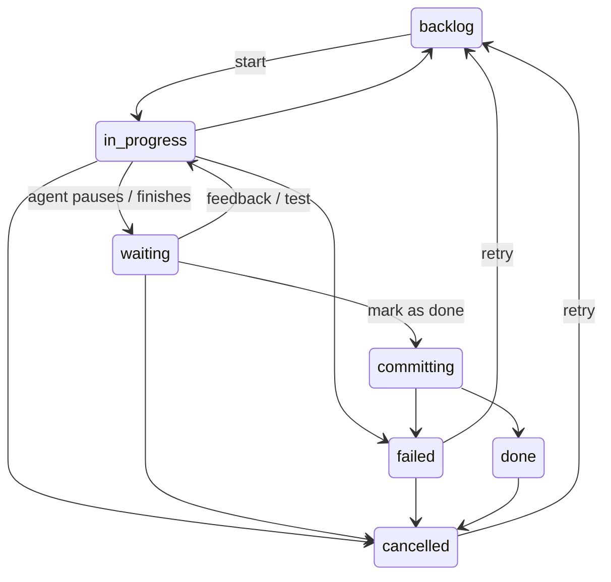

# Board

The Board is the execution surface of wallfacer: a four-column kanban where tasks are created, run by coding agents, reviewed, and merged. Each running task executes as a host process inside its own git worktree, so an agent works on an isolated copy of the code without touching the default branch. For the mental model behind tasks, specs, and agents, see [Concepts](concepts.md); for first-run setup, see [Getting Started](getting-started.md).

## Columns

| Column | Statuses shown | Meaning |
|---|---|---|
| **Backlog** | `backlog` | Queued tasks. Prompt, settings, and dependencies are editable here. |
| **In Progress** | `in_progress`, `committing` | An agent is running in the task's worktree, or the commit pipeline is merging its result. |
| **Waiting** | `waiting`, `failed` | The agent paused for input, a verdict, or a budget raise; failed tasks land here for retry. |
| **Done** | `done`, `cancelled` | Terminal states. Done tasks have their changes merged; cancelled tasks keep their history. |

The In Progress column header shows a `max N` tag: the effective parallel-execution cap for the active workspace. The value resolves from the workspace's `max_parallel` override, then `WALLFACER_MAX_PARALLEL`, with a default of 5 (`0` renders as unlimited). The cap gates how many tasks automation promotes concurrently; see [Automation](automation.md) and [Workspaces](workspaces.md).

The Done column header carries two controls: **Archive all** archives every done task at once, and **Show archived** reveals archived tasks, which are hidden by default.

## Task lifecycle

Tasks move through seven states. Only the transitions below are legal; the server rejects everything else.

| From | To |
|---|---|
| `backlog` | `in_progress` |
| `in_progress` | `backlog`, `waiting`, `failed`, `cancelled` |
| `waiting` | `in_progress`, `committing`, `cancelled` |
| `committing` | `done`, `failed` |
| `failed` | `backlog`, `cancelled` |
| `done` | `cancelled` |
| `cancelled` | `backlog` |

Note that `in_progress` never jumps straight to `committing` or `done`: completion always passes through `waiting`, where a review, a test verdict, or auto-submit decides whether to commit. **Mark as Done** (or the auto-submit watcher) moves a waiting task into `committing`, which rebases the task branch onto the default branch, fast-forward merges it, and cleans up the worktree. Details in [Task Lifecycle internals](../internals/task-lifecycle.md) and [Git Worktrees](../internals/git-worktrees.md).

When a task fails, the failure is categorized: `timeout`, `budget_exceeded`, `worktree_setup`, `container_crash` (unexpected agent-process exit), `agent_error`, `sync_error`, or `unknown`. Categories drive the auto-retry budgets described in [Automation](automation.md).

## Creating tasks

Click **+ New Task** in the Backlog header, or press **n** anywhere on the board. The composer offers:

- **Prompt**: the work description, with Markdown support and `@` file mentions. The draft auto-saves to local storage, so navigating away loses nothing.
- **Agent graph**: which flow the task runs, populated from the flow catalog. The default is the built-in **implement** flow; custom graphs come from the [Agent Graph](agent-graph.md) page and lead/mesh graphs are marked experimental.
- **Tags**: press Enter or comma to add a label. Tags are lowercase; `priority:N` and `impact:N` get special card styling.
- **Timeout**: 15 min, 30 min, 1 hour, 2 hours, 5 hours, or a custom value. The default is no timeout.
- **More** expands: test criteria, a model override, budget limits (max cost in USD and max input tokens), a **Depends on** picker, and a harness override.

Two toggles sit on the action row:

- **Batch mode** splits the prompt on blank lines and creates one task per section in a single atomic call. The underlying `POST /api/tasks/batch` endpoint also supports symbolic dependency wiring (`depends_on_refs` by position index), validated for cycles before anything is created.
- **Schedule** does not create a one-shot task: it creates a recurring [routine](routines.md) with the given interval.

Every task carries a short **Title** (auto-generated after creation, or set manually) and the full **Prompt**.

## Starting, resuming, and completing

A task starts when it moves from Backlog to In Progress: drag the card, click **Start task** in the detail view, or let the auto-implement watcher promote it. The server creates a branch `task/<uuid-prefix>` and a worktree per workspace folder, launches the selected harness as a host process, and streams live output into the detail view. Each prompt/response round-trip is a turn; token usage and cost accumulate per turn.

When the agent pauses or finishes, the task lands in **Waiting**. From there:

| Action | Effect |
|---|---|
| **Submit feedback** | Send a message (with `@` file mentions); the agent resumes in the same session. |
| **Mark as Done** | Trigger the commit pipeline and merge the changes. |
| **Test** | Launch a verification agent, optionally with acceptance criteria. |
| **Review** | Run adversarial verification (experimental, see below). |
| **Sync** | Rebase the task's worktree onto the latest default branch without merging. |
| **Raise budget** | Shown when a cost or token limit was hit; adjust the limit and continue. |
| **Cancel** | Discard the worktree and move to Cancelled; history and logs are preserved. |

Failed tasks offer **Resume** (continue the existing agent session with an extended timeout, available when a session exists), **Retry** (back to Backlog, optionally with an edited prompt and a fresh or resumed session), **Test**, and **Sync**. Done tasks can still be tested or archived; cancelled tasks can be retried.

Full per-state action availability in the detail view:

| Status | Actions |
|---|---|
| `backlog` | Start task, Edit task, Delete |
| `in_progress` / `committing` | Cancel, Delete |
| `waiting` | Mark as Done, Test, Review (with session), Raise budget (when budget-hit), Sync, Cancel, Delete |
| `failed` | Resume (with session), Test, Raise budget, Sync, Retry, Delete |
| `done` | Test, Archive, Delete |
| `cancelled` | Retry, Archive, Delete |
| archived | Unarchive, Delete |

## Dependencies

The **Depends on** picker (in the composer's More section and the backlog Edit panel) declares prerequisite tasks. A task with unmet dependencies is not promoted by automation even when capacity is free: promotion requires every dependency to be `done`, the scheduled time (if any) to have passed, and a free parallel slot.

Backlog cards show a dependency badge: amber **blocked** with the unmet count, green **ready** when all prerequisites are done, or a warning when a dependency was cancelled. The detail view lists prerequisites under **Blocked by** with live status. The cross-task dependency graph is visualized on [Mission Control](mission-control.md), not on the board itself.

## Scheduled tasks

Set **Schedule start** in the backlog Edit panel to defer a task to a future date and time. The auto-promoter skips it until the time arrives (a precise one-shot timer fires within milliseconds of the due time), then treats it like any other backlog task. The card shows a relative indicator such as `in 3h` until then. Recurring work belongs in [Routines](routines.md) instead.

## Search and filtering

The header search bar filters visible cards live by title, prompt, and tags. Use `#tagname` to filter by tag. Press `/` to focus the bar, Escape to clear. Prefixing a query with `@` hands it to the command palette's server-side search, which covers all tasks (including archived) by title, prompt, tags, and oversight summaries.

## Command palette

Press **Cmd+K** (Ctrl+K) to open the palette. It combines fuzzy local task search, server-side task search, spec matches from the Plan tree, and full-text docs search. When a task is highlighted, state-dependent actions appear:

- Backlog: **Plan** (open task-mode chat in Plan), **Start**
- Waiting: **Resume** (with session), **Test**, **Done**, **Sync**
- Failed: **Resume** (with session), **Retry**, **Sync**
- Done / Cancelled: **Retry**
- Any non-backlog task: **Open changes**; once at least one turn has run, **Open verification** and **Open timeline**

## Task detail view

Click any card to open the detail view. A left rail carries the header (status, tags, elapsed time, cost, short ID), settings, dependency and PR panels, and the action buttons; the main pane switches between six tabs.

| Tab | Content |
|---|---|
| **Spec** | The prompt and latest result as rendered Markdown (raw toggle, copy), the agent lineage graph, and, for waiting tasks, the inline feedback box. |
| **Activity** | Oversight summaries per phase followed by the parsed agent transcript (thinking, tool calls, results) with a filter box; raw output fallback. |
| **Changes** | Per-file git diff of the worktree against the default branch, with a commits-behind warning. |
| **Verification** | The Review panel and the test agent's per-turn results. |
| **Events** | The event audit trail grouped by type, usage statistics, per-agent usage, retry history, and prompt history. |
| **Timeline** | Execution spans rendered as a flamegraph with a time axis, an optional cumulative-cost overlay, and a span table sorted by duration. |

### Inline diff comments

While a task is waiting, each line in the **Changes** tab gets a gutter button that opens an inline comment box (Cmd+Enter saves). Comments collect in a **Review comments** panel grouped by file, alongside a general feedback box. **Submit** batches every line comment plus the general text into a single feedback message, and the agent resumes with the full review as its next input. When sign-in is enabled, reviewing requires a signed-in principal.

### Verification and Review

The **Test** action launches a separate verification agent against the task's worktree; it runs the relevant checks and reports a pass or fail verdict shown as a badge on the card. Acceptance criteria can be supplied when starting the run, and repeated runs overwrite the previous verdict.

**Review** is an experimental adversarial verification layer, off by default and enabled as a runtime toggle. It forks proposer/critic debates over the change (fork count, rounds, and cost cap are configured via `WALLFACER_REVIEW_FORKS`, `WALLFACER_REVIEW_ROUNDS`, and `WALLFACER_REVIEW_COST_CAP`). The Verification tab shows its status, configuration, verdict headline, and the per-fork debate threads. When Review is enabled and the task has an agent session, its verdict supersedes the plain test verdict as the auto-submit gate; see [Automation](automation.md).

### Timeline

The **Timeline** tab renders every recorded span (worktree setup, agent turns, commits) as a Gantt-style flamegraph with idle time compressed, plus a detail table. Aggregated timing lives on the Analytics page; see [Oversight](oversight.md).

## Pull requests

When a task has a branch and GitHub is connected, the **PR panel** in the detail rail offers **Create PR** (for tasks not yet done), a state badge (open, closed, merged) linking to the pull request, and a comment box that posts to the PR. GitHub connectivity is borrowed from the signed-in latere.ai account; see [Configuration](configuration.md) for connecting.

## Automation menu

The lightning-bolt menu in the board header exposes five runtime toggles:

| Toggle | Effect |
|---|---|
| **Implement** | Auto-promote eligible backlog tasks into In Progress. |
| **Test** | Run the verification agent automatically when a task reaches Waiting. |
| **Submit** | Move verified waiting tasks to Done automatically. |
| **Catch up** | Rebase waiting tasks onto the default branch as it advances. |
| **Push** | Push completed commits to the remote automatically. |

Numeric knobs (parallelism, thresholds, intervals) live on the Execution settings tab. Auto-retry budgets, circuit breakers, and the Review toggle are covered in [Automation](automation.md).

## Backlog sort

The Backlog header toggles between two sort modes: **Manual** (drag to reorder; cards show their rank) and **Impact** (descending impact score; dragging is disabled). The choice persists per browser.

## Archive and trash

Archiving hides a done or cancelled task from the Done column while keeping its full history; **Archive all** in the Done header archives every done task at once, and **Show archived** reveals them again. Unarchive restores a task to the column.

Deleting a task is a soft delete: the task becomes a tombstone recoverable for 7 days (configurable via `WALLFACER_TOMBSTONE_RETENTION_DAYS`), after which it is purged on server startup. The trash icon in the board header opens the Trash modal, which lists deleted tasks with their remaining retention and a **Restore** button.

## See also

- [Plan](plan.md): author and dispatch specs that become board tasks
- [Chat](chat.md): conversational planning with the same agent engine
- [Mission Control](mission-control.md): the combined spec and task dependency graph
- [Agent Graph](agent-graph.md): define agents and compose the graphs tasks run
- [Automation](automation.md): watchers, retry budgets, and circuit breakers
- [Oversight](oversight.md): summaries, usage, cost, and timing analytics
- [Workspaces](workspaces.md): folders, worktrees, and per-workspace settings
- [Configuration](configuration.md): environment variables and settings tabs
- [API & Transport internals](../internals/api-and-transport.md): the HTTP API behind every board action
