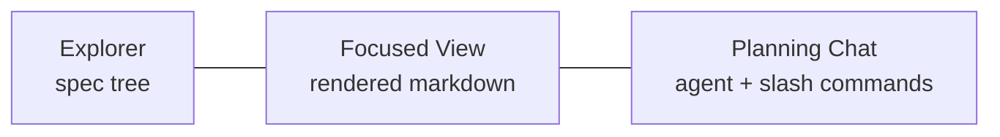
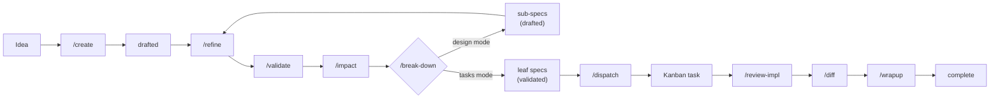
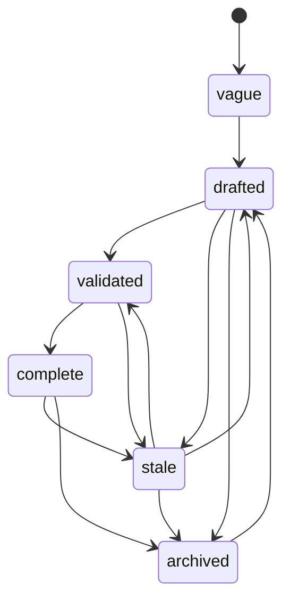

# Designing Specs

Plan mode is where you browse, author, and dispatch spec files from inside the app.



Specs are structured design documents that bridge ideas and executable tasks. Each spec is a markdown file with YAML frontmatter that tracks lifecycle state, dependencies, affected code paths, and effort estimates. Specs live in `specs/` and are organized by track.

---

## Essentials

### What is a Spec?

A spec describes a piece of work at the design level. Unlike a task prompt (which tells an agent what to implement), a spec captures the why, the constraints, the dependencies, and the acceptance criteria. Specs can be high-level (describing an entire feature) or leaf-level (describing a single implementable unit ready for dispatch).

### Spec Mode

Press **P** to toggle between the Board view and the Plan view. Wallfacer remembers your last explicit choice — sidebar click or keyboard shortcut — and reopens in that mode on the next launch; if you have not picked one, it defaults to Board when the task board has any cards and to Plan when it is empty. Activating a fresh workspace group always opens in Plan, regardless of saved preference.

Plan mode picks one of two layouts based on the workspace's spec tree:

- **Three-pane** (default) — when any spec exists or a `specs/README.md` Roadmap is present:
  - **Left pane** — spec explorer (file tree)
  - **Center pane** — focused spec view (rendered content)
  - **Right pane** — planning chat (toggleable with **C**)
- **Chat-first** — when the workspace has no specs and no Roadmap, the chat renders as a centered card (max-width ~720px) with a prominent empty-state hint — `Try /create <title> to save this thread as a spec` — above the composer, and the composer placeholder invites free-form planning ("Describe what you'd like to plan, or /create <title>…"). The spatial position mirrors the empty-Board composer so switching modes on a fresh workspace reads as visually continuous. The hint disappears as soon as the thread has its first message. The **C** shortcut is a no-op in this layout because the chat pane is already the only visible surface. The layout flips automatically once specs appear (via the spec tree SSE stream).

### Spec Explorer

The explorer shows all specs organized by track — the top-level directories under `specs/`. Tracks are user-defined: create a directory under `specs/` and it becomes a track. For example, a project might organize specs as `specs/backend/`, `specs/frontend/`, `specs/infra/`.

When a workspace has a `specs/README.md` file, the explorer pins a `📋 Roadmap` entry at the top of the tree that links back to that file. Clicking it renders the README in the focused view with all spec-only affordances (status chip, dispatch, archive) hidden — the Roadmap is a plain markdown document with no lifecycle.

Each spec entry displays a status badge indicating its lifecycle state. Non-leaf specs (those with children) show a progress indicator reflecting how many of their leaf descendants are complete.

Click a folder to expand or collapse it. Click a spec file to focus it in the center pane.

### Focused View

Clicking a spec in the explorer opens it in the center pane. The content is rendered as formatted markdown with:

- Syntax-highlighted code blocks
- Mermaid diagram rendering
- Table of contents navigation
- YAML frontmatter displayed as a structured header

### Planning Chat Threads

The planning chat supports multiple named threads per workspace group, shown as tabs above the chat stream. Click **+** to start a new thread, double-click a tab (or use the pencil icon) to rename it, and **×** to archive it. Archiving hides the thread from the tab bar but keeps its files on disk; unarchive from the thread manager to restore it.

Each thread keeps its own Claude Code session and its own message history, so parallel lines of design inquiry do not contaminate each other. Only one agent turn runs at a time across all threads — every thread shares the single planner sandbox container. Messages sent to a background thread while another turn is in-flight are queued locally and flushed when the container becomes free.

`/undo` targets the caller thread's most recent round and is implemented via `git revert`: the original commit and its revert both stay in history, so you retain a full audit trail. Dispatched tasks whose linkage was introduced in the reverted commit are automatically cancelled.

### Spec Workflow

Specs follow a structured lifecycle driven by slash commands in the planning chat. Each command maps to a step in the workflow:



```
/create → /refine → /validate → /impact → /break-down → /review-breakdown → /dispatch → /review-impl → /diff → /wrapup
```

You don't need to follow every step linearly. Small specs can skip from `/create` to `/dispatch`. Large specs may cycle through `/refine` and `/break-down` multiple times. Use `/status` at any point to check progress across all specs.

### Breaking Down Specs

Large specs can be decomposed into smaller child specs. Press **B** or use `/break-down` in the planning chat. The agent analyzes the parent spec and creates child specs in a subdirectory named after the parent file. Each child gets its own frontmatter, dependencies, and acceptance criteria.

The agent automatically determines the breakdown mode from the spec's lifecycle state: **design mode** (creates sub-design specs with Options and Open Questions) for `vague` or `drafted` specs, or **tasks mode** (creates implementation-ready leaf specs with Goal, What to do, Tests, Boundaries) for `validated` specs. Override with `/break-down design` or `/break-down tasks`.

```
specs/
  local/
    my-feature.md              <- non-leaf (has children)
    my-feature/
      define-interface.md      <- leaf (dispatchable)
      implement-backend.md     <- leaf
      implement-frontend.md    <- leaf
```

### Dispatching to the Board

When a leaf spec is validated and ready for implementation, press **D** or use `/dispatch` in the chat. This creates a task on the kanban board with the spec's content as the prompt. The spec's `dispatched_task_id` field is updated to link back to the created task.

On a successful dispatch, a small "Dispatched N task(s) to the Board." toast appears at the bottom-right with a **View on Board →** action. Clicking it switches to the Board without altering your saved mode preference, scrolls the Backlog to the freshly created card, and gives it a one-second pulse so you can pick up where you left off. If you stay in Plan, a subtle unread dot lights up on the sidebar Board nav button until you visit the Board. When the board has zero tasks, a focused task-creation composer takes over the Board view with a prompt field, an **Advanced** disclosure (sandbox / timeout / goal), and a link back to Plan — once you create your first task the composer fades out for the rest of the session, even if the task is later archived.

Dispatch is atomic across a batch: task creation and the corresponding `dispatched_task_id` frontmatter writes either all succeed or all roll back, so you never end up with orphaned tasks or dangling spec links. Dependencies within the same batch are resolved by pre-assigning task UUIDs before creation, so child specs wire to their parents correctly even when tasks are persisted out of order. Dispatching a non-leaf spec or a spec that is not yet `validated` returns an error without mutating any state.

---

## Advanced Topics

### Spec Frontmatter

Every spec requires valid YAML frontmatter. The required fields are:

```yaml
---
title: Human-readable title
status: drafted          # vague | drafted | validated | complete | stale
depends_on:              # list of spec paths this one requires
  - specs/shared/agent-abstraction.md
affects:                 # packages and files this spec will modify
  - internal/runner/
effort: large            # small | medium | large | xlarge
created: 2026-04-01      # ISO date
updated: 2026-04-01      # ISO date, must be >= created
author: changkun
dispatched_task_id: null  # null or UUID (leaf specs only)
---
```

The spec document model (`specs/local/spec-coordination/spec-document-model.md`) defines the full schema and validation rules.

### Dependency DAG

Specs declare dependencies via the `depends_on` field, which lists paths to prerequisite specs. The resulting dependency graph must be a directed acyclic graph (DAG) -- circular dependencies are rejected.

### Dependency Minimap

The minimap at the bottom of the explorer renders the DAG as nodes (specs) connected by edges (`depends_on` relationships). It is a navigation aid over the same graph the validator uses.

- Filter the graph by lifecycle status to isolate, for example, only `validated` leaves ready for dispatch.
- Multi-select nodes and batch-dispatch them; the minimap orders the batch topologically so upstream tasks land on the board first.
- Hovering a node highlights its transitive upstream (what it depends on) and downstream (what depends on it) edges, making the critical path visible at a glance.
- Orphan specs — those with no dependents and no dependencies — are easy to spot as isolated nodes, which usually signals a missing `depends_on` or a spec that can be retired.

### Status Lifecycle

Specs progress through a defined lifecycle:

| Status | Meaning |
|---|---|
| `vague` | Initial idea, not yet fleshed out |
| `drafted` | Written up with structure, but not yet reviewed or validated |
| `validated` | Reviewed, dependencies checked, ready for implementation or dispatch |
| `complete` | Fully implemented and verified |
| `stale` | Overtaken by events or no longer relevant |
| `archived` | Deliberately archived — hidden from the live explorer, drift checks, and impact queries. Unarchive to restore. |



Any status except `archived` can transition to `stale`. Leaf specs should reach `validated` before being dispatched to the task board.

### Archive and Unarchive

Archiving takes a spec out of active circulation without deleting it. Archiving a parent cascades to every non-archived descendant, and all of the resulting frontmatter changes land in a single commit so the history is easy to audit and to revert.

The archive handler rejects the cascade if any target has a live `dispatched_task_id` — it returns HTTP 409 and mutates nothing. Cancel the dispatched task first (or wait for it to finish and be cleared), then retry.

Unarchive prefers a lossless path: it locates the archive commit in git history and runs `git revert` on it, which restores every descendant's pre-archive status exactly. If the archive commit cannot be found, or the revert conflicts, it falls back to a single-spec transition from `archived` back to `drafted`.

Archived specs remain on disk but are filtered out of the spec tree by default, and they are skipped when the planning system prompt decides whether the workspace is "empty" versus "non-empty" — so archiving a workspace's only spec will flip Plan mode back into chat-first layout.

### Progress Tracking

Non-leaf specs aggregate progress from their entire subtree. A spec with six leaf descendants, four of which are complete, displays "4/6 leaves done". This recursive rollup gives you a quick read on how much of a large feature is finished without opening each child.

### Reviewing and Completing

After a breakdown, use `/review-breakdown` to validate the task structure before dispatching. The agent checks dependency correctness, task sizing, spec coverage, boundary conflicts, and test completeness.

After implementation, use `/review-impl` to compare the actual code changes against the spec's acceptance criteria. The agent produces a structured report: which criteria were met, which were missed, and whether there were unintended changes.

For dispatched tasks, use `/diff` after the task completes to produce a drift analysis. This compares the implementation against the spec and classifies each item as satisfied, diverged, not implemented, or superseded. The agent appends an `## Outcome` section to the spec documenting what shipped and how it differed from the plan.

Use `/wrapup` to finalize a completed spec. The agent verifies all leaf children are complete, runs tests, writes the outcome summary, updates `specs/README.md`, and flags downstream specs that are now unblocked.

### Deep Linking

Use `#plan/<path>` in the URL to link directly to a spec. For example, `http://localhost:8080/#plan/specs/local/live-serve.md` opens the app in Plan mode with that file focused. The legacy `#spec/<path>` form still works for back-compat with existing bookmarks.

### Keyboard Shortcuts

| Key | Action |
|---|---|
| **P** | Toggle between Board and Plan mode |
| **E** | Toggle the spec explorer pane |
| **C** | Toggle the planning chat pane |
| **D** | Dispatch the focused spec to the task board |
| **B** | Break down the focused spec into children |

---

## See Also

- [The Autonomy Spectrum](autonomy-spectrum.md) -- where specs fit in the overall workflow
- [Exploring Ideas](exploring-ideas.md) -- the planning chat for conversational exploration
- [Board & Tasks](board-and-tasks.md) -- the task board where dispatched specs are executed
- [Configuration](configuration.md) -- keyboard shortcuts and settings
- [Plan Mode internals](../internals/plan-mode.md) -- architecture, lifecycle state machine, dispatch/archive/undo implementation
