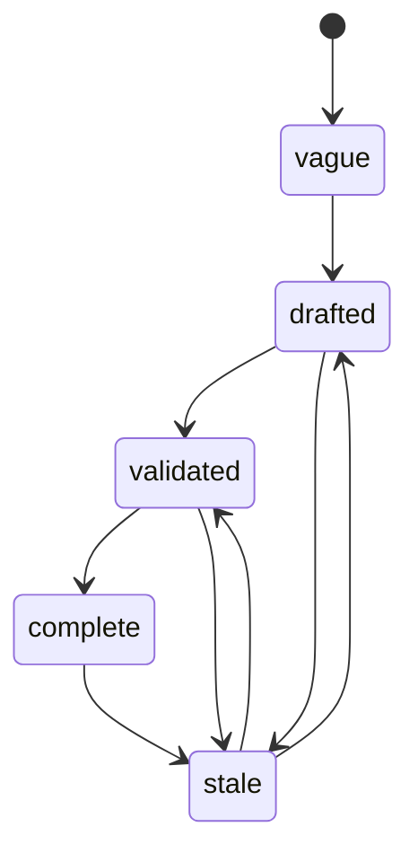

# Designing Specs

Plan mode (formerly Specs) is where you browse, author, and dispatch spec files from inside the app.

Specs are structured design documents that bridge ideas and executable tasks. Each spec is a markdown file with YAML frontmatter that tracks lifecycle state, dependencies, affected code paths, and effort estimates. Specs live in `specs/` and are organized by track.

---

## Essentials

### What is a Spec?

A spec describes a piece of work at the design level. Unlike a task prompt (which tells an agent what to implement), a spec captures the why, the constraints, the dependencies, and the acceptance criteria. Specs can be high-level (describing an entire feature) or leaf-level (describing a single implementable unit ready for dispatch).

### Spec Mode

Press **P** to toggle between the Board view and the Plan view. Wallfacer remembers your last explicit choice — sidebar click or keyboard shortcut — and reopens in that mode on the next launch; if you have not picked one, it defaults to Board when the task board has any cards and to Plan when it is empty. Activating a fresh workspace group always opens in Plan, regardless of saved preference.

Plan mode picks one of two layouts based on the workspace's spec tree:

- **Three-pane** (default) — when any spec exists or a `specs/README.md` Roadmap is present:
  - **Left pane** — spec explorer (file tree)
  - **Center pane** — focused spec view (rendered content)
  - **Right pane** — planning chat (toggleable with **C**)
- **Chat-first** — when the workspace has no specs and no Roadmap, the chat takes the full Plan-mode width. The **C** shortcut is a no-op in this layout because the chat pane is already the only visible surface. The layout flips automatically once specs appear (via the spec tree SSE stream).

### Spec Explorer

The explorer shows all specs organized by track — the top-level directories under `specs/`. Tracks are user-defined: create a directory under `specs/` and it becomes a track. For example, a project might organize specs as `specs/backend/`, `specs/frontend/`, `specs/infra/`.

When a workspace has a `specs/README.md` file, the explorer pins a `📋 Roadmap` entry at the top of the tree that links back to that file. Clicking it renders the README in the focused view with all spec-only affordances (status chip, dispatch, archive) hidden — the Roadmap is a plain markdown document with no lifecycle.

Each spec entry displays a status badge indicating its lifecycle state. Non-leaf specs (those with children) show a progress indicator reflecting how many of their leaf descendants are complete.

Click a folder to expand or collapse it. Click a spec file to focus it in the center pane.

### Focused View

Clicking a spec in the explorer opens it in the center pane. The content is rendered as formatted markdown with:

- Syntax-highlighted code blocks
- Mermaid diagram rendering
- Table of contents navigation
- YAML frontmatter displayed as a structured header

### Spec Workflow

Specs follow a structured lifecycle driven by slash commands in the planning chat. Each command maps to a step in the workflow:

```
/create → /refine → /validate → /impact → /break-down → /review-breakdown → /dispatch → /review-impl → /diff → /wrapup
```

You don't need to follow every step linearly. Small specs can skip from `/create` to `/dispatch`. Large specs may cycle through `/refine` and `/break-down` multiple times. Use `/status` at any point to check progress across all specs.

### Breaking Down Specs

Large specs can be decomposed into smaller child specs. Press **B** or use `/break-down` in the planning chat. The agent analyzes the parent spec and creates child specs in a subdirectory named after the parent file. Each child gets its own frontmatter, dependencies, and acceptance criteria.

The agent automatically determines the breakdown mode from the spec's lifecycle state: **design mode** (creates sub-design specs with Options and Open Questions) for `vague` or `drafted` specs, or **tasks mode** (creates implementation-ready leaf specs with Goal, What to do, Tests, Boundaries) for `validated` specs. Override with `/break-down design` or `/break-down tasks`.

```
specs/
  local/
    my-feature.md              <- non-leaf (has children)
    my-feature/
      define-interface.md      <- leaf (dispatchable)
      implement-backend.md     <- leaf
      implement-frontend.md    <- leaf
```

### Dispatching to the Board

When a leaf spec is validated and ready for implementation, press **D** or use `/dispatch` in the chat. This creates a task on the kanban board with the spec's content as the prompt. The spec's `dispatched_task_id` field is updated to link back to the created task.

On a successful dispatch, a small "Dispatched N task(s) to the Board." toast appears at the bottom-right with a **View on Board →** action. Clicking it switches to the Board without altering your saved mode preference, scrolls the Backlog to the freshly created card, and gives it a one-second pulse so you can pick up where you left off. If you stay in Plan, a subtle unread dot lights up on the sidebar Board nav button until you visit the Board. When the board has zero tasks, an inline hint at the top links back to Plan so new workspaces always have a forward path.

---

## Advanced Topics

### Spec Frontmatter

Every spec requires valid YAML frontmatter. The required fields are:

```yaml
---
title: Human-readable title
status: drafted          # vague | drafted | validated | complete | stale
depends_on:              # list of spec paths this one requires
  - specs/shared/agent-abstraction.md
affects:                 # packages and files this spec will modify
  - internal/runner/
effort: large            # small | medium | large | xlarge
created: 2026-04-01      # ISO date
updated: 2026-04-01      # ISO date, must be >= created
author: changkun
dispatched_task_id: null  # null or UUID (leaf specs only)
---
```

The spec document model (`specs/local/spec-coordination/spec-document-model.md`) defines the full schema and validation rules.

### Dependency DAG

Specs declare dependencies via the `depends_on` field, which lists paths to prerequisite specs. The resulting dependency graph must be a directed acyclic graph (DAG) -- circular dependencies are rejected.

The minimap at the bottom of the explorer visualizes the DAG, showing which specs block others and where the critical path lies.

### Status Lifecycle

Specs progress through a defined lifecycle:

| Status | Meaning |
|---|---|
| `vague` | Initial idea, not yet fleshed out |
| `drafted` | Written up with structure, but not yet reviewed or validated |
| `validated` | Reviewed, dependencies checked, ready for implementation or dispatch |
| `complete` | Fully implemented and verified |
| `stale` | Overtaken by events or no longer relevant |



Any status can transition to `stale`. Leaf specs should reach `validated` before being dispatched to the task board.

### Progress Tracking

Non-leaf specs aggregate progress from their entire subtree. A spec with six leaf descendants, four of which are complete, displays "4/6 leaves done". This recursive rollup gives you a quick read on how much of a large feature is finished without opening each child.

### Reviewing and Completing

After a breakdown, use `/review-breakdown` to validate the task structure before dispatching. The agent checks dependency correctness, task sizing, spec coverage, boundary conflicts, and test completeness.

After implementation, use `/review-impl` to compare the actual code changes against the spec's acceptance criteria. The agent produces a structured report: which criteria were met, which were missed, and whether there were unintended changes.

For dispatched tasks, use `/diff` after the task completes to produce a drift analysis. This compares the implementation against the spec and classifies each item as satisfied, diverged, not implemented, or superseded. The agent appends an `## Outcome` section to the spec documenting what shipped and how it differed from the plan.

Use `/wrapup` to finalize a completed spec. The agent verifies all leaf children are complete, runs tests, writes the outcome summary, updates `specs/README.md`, and flags downstream specs that are now unblocked.

### Deep Linking

Use `#spec/<path>` in the URL to link directly to a spec. For example, `http://localhost:8080/#spec/specs/local/live-serve.md` opens the app in spec mode with that file focused.

### Keyboard Shortcuts

| Key | Action |
|---|---|
| **S** | Toggle between Board and Spec mode |
| **E** | Toggle the spec explorer pane |
| **C** | Toggle the planning chat pane |
| **D** | Dispatch the focused spec to the task board |
| **B** | Break down the focused spec into children |

---

## See Also

- [The Autonomy Spectrum](autonomy-spectrum.md) -- where specs fit in the overall workflow
- [Exploring Ideas](exploring-ideas.md) -- the planning chat for conversational exploration
- [Board & Tasks](board-and-tasks.md) -- the task board where dispatched specs are executed
- [Configuration](configuration.md) -- keyboard shortcuts and settings
