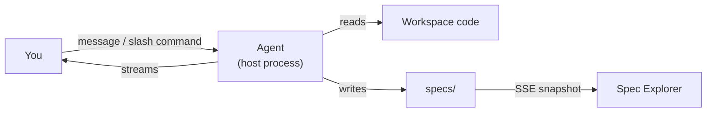
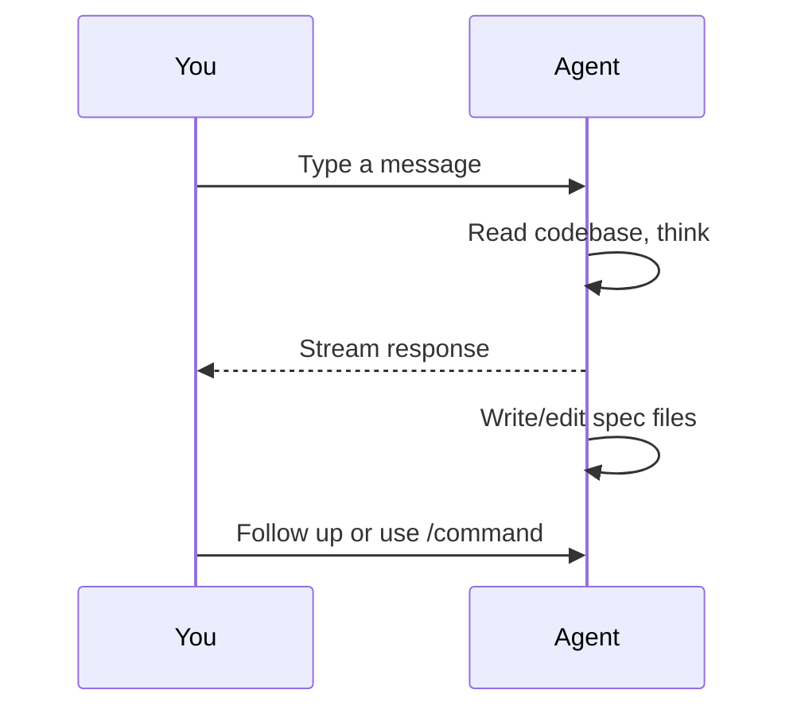

# Exploring Ideas

Plan mode is where you explore ideas conversationally with an AI agent before committing to structured specs or tasks.

The agent chat lives inside Plan mode. It is backed by an agent that can read your codebase, create files, and run commands. The same agent also powers task-mode prompt refinement (see [Prompt Refinement](refinement-and-ideation.md)).

---

## Essentials

### Opening the Agent Chat

Switch to Plan mode by pressing **P** (or click **Plan** in the left sidebar nav). In the three-pane layout (workspace with specs), the chat is a floating, draggable, resizable popup that hovers over the focused spec view. Press **C**, or click the chat toggle in the focused-view header, to open or close it; its position and size persist across sessions. When the workspace has no specs yet, the layout switches to chat-first and the chat fills the workspace as a docked panel (the **C** shortcut is inactive there).

### Sending Messages

Type in the composer at the bottom of the chat pane. Press **Enter** to send (or **Cmd+Enter**, depending on the send mode toggle). Use **Shift+Enter** to insert a newline without sending.

### Agent Responses

Responses stream in real time. Assistant text renders as markdown with syntax-highlighted code blocks. Tool activity (file reads, command execution, file writes) appears in a collapsible "Agent activity" section below each response.

### Drafting a Spec from Chat (`/spec-new`)

When the agent wants to start a new spec, it emits a single `/spec-new <path> [title="..."] [status=...] [effort=...]` directive on its own line, followed by the spec body. The server recognizes the directive **only when it is not inside a fenced code block**, so the agent can quote the grammar in documentation or examples without triggering a scaffold.

On recognition, the server calls the shared spec scaffolder to create the file with valid YAML frontmatter, then appends the agent's body text after it. The path must live under `specs/<track>/<slug>.md`; other locations are rejected with a `system` message in the chat. The agent's raw response (including the directive line) still streams to the chat unchanged. The directive is a parallel side-effect, not a stream rewrite.

After each successful scaffold the server also ensures `specs/README.md` exists. If missing, it is created with a minimal template listing the new spec under the correct track heading; if present, a new row is appended to the track's table. User-authored prose outside the track tables is preserved byte-for-byte, and existing rows are never re-ordered. If the agent opened its body with a short summary sentence, that sentence becomes the "Delivers" cell; otherwise a placeholder invites a later manual fill.

When `/spec-new` fires the very first spec in a previously empty workspace, a short bootstrap choreography stitches the moment together. About 130 ms after the spec-tree SSE arrives, the focused view auto-opens onto the new spec, and around 160 ms a top-center toast slides in reading "Your first spec was created at &lt;path&gt;. Rename or move it anytime." The toast auto-dismisses after six seconds (or on click). Reconnection-induced repeat snapshots never replay the choreography; it fires once per session. Under `prefers-reduced-motion: reduce` the toast still appears but without the slide-in animation.

If the scaffold fails (name collision, invalid path, I/O error), a short "Couldn't create &lt;path&gt;: &lt;reason&gt;" message appears in the chat and the round continues normally. Archive an unwanted spec from the focused view if the agent created one over-eagerly.

### Slash Commands

Type `/` to see an autocomplete menu of built-in commands. They cover the full spec lifecycle:

| Command | Description |
|---|---|
| `/summarize [words]` | Summarize the focused spec, optionally limited to a word count |
| `/create <title>` | Scaffold a new spec server-side (slug derived from the title) and hand the agent a first-draft instruction. Collisions resolve with `-2`, `-3`, … suffixes; empty titles return a 400. |
| `/refine [feedback]` | Update the focused spec against the current codebase state |
| `/validate` | Check the focused spec against document model rules |
| `/impact` | Analyze which code and specs would be affected |
| `/status <state>` | Update the focused spec's lifecycle status |
| `/break-down [design\|tasks]` | Decompose the focused spec into sub-specs or dispatchable tasks |
| `/review-breakdown` | Validate a task breakdown for dependency ordering, sizing, and coverage |
| `/dispatch` | Dispatch the focused spec to the task board |
| `/review-impl [commit-range]` | Review implementation against the spec's acceptance criteria |
| `/diff [commit-range]` | Compare completed implementation against spec (drift analysis) |
| `/wrapup` | Finalize a completed spec with outcome and status updates |

### Mentions

Type `@` in the composer to trigger file path autocomplete. In Plan mode, spec files are prioritized in the suggestion list. Mentioned files are included as context for the agent.

### Interrupting

Click the stop button (which replaces the send button during streaming) to cancel the current response. The session context is preserved, so the agent remembers everything up to the interruption point.

### Message Queue

Keep typing while the agent is responding. New messages appear as queued chips below the composer. You can edit or remove queued messages before they are sent. The queue drains automatically as each response completes.

### Clearing History

Click **Clear** in the chat header to discard all messages in the current thread and start a fresh conversation on that thread. The underlying agent session is preserved; only the visible message history is cleared.

### Empty vs Non-empty Workspace

The agent's system prompt has two variants. The **empty** variant kicks in when the workspace has zero non-archived specs and actively encourages `/spec-new` to bootstrap the first draft; the **nonempty** variant is the normal case and assumes you are iterating on an existing tree. Selection happens per-turn rather than being cached at session start, so archiving the last spec flips the agent's behavior on the very next message, with no restart or clear required.

### Threads

The chat supports multiple named threads per workspace group. Tabs sit above the message stream:

- Click **+** to create a new thread (default name `Chat N`). Click the pencil icon (or double-click the tab) to rename inline: Enter commits, Escape cancels.
- Click **×** on a tab to archive it (the in-flight thread cannot be archived; interrupt it first). Archived threads are hidden from the tab bar but their files are retained; a **▾** menu next to **+** lists archived threads for restore.
- Each thread keeps its own agent session and history. Switching tabs does not abort an in-flight agent; its output continues to land in its own thread. When a background thread finishes, its tab shows a small unread dot.
- Only one agent turn runs at a time across all threads, since they share the single agent. A message sent to a background tab while another thread is in flight is queued locally and fires automatically once the running turn completes (global FIFO).

### Undo

Click the undo button on an assistant bubble to revert the planning round it produced. Undo works across threads: it targets the caller thread's most recent round even when a different thread committed afterwards. Internally this uses `git revert`, which creates a forward revert commit rather than rewriting history, so both the original and the revert remain in `git log`.

---

## Advanced Topics

### Session Persistence

Conversations persist on disk at `~/.wallfacer/agent-sessions/<fingerprint>/`, where `<fingerprint>` is derived from the active workspace paths. Each thread lives under `threads/<thread-id>/` with its own `messages.jsonl` and `session.json`. Reopening the app or refreshing the page restores the full thread manifest and the last active tab for the same workspace group. Installations from before multi-thread support are migrated transparently on first run (the existing conversation appears as `Chat 1`).

### Session Recovery

The agent process exits between turns, so its session is resumed on the next message. If the session cannot be resumed (it expired, or the server restarted), the system automatically replays the conversation history as context instead. You do not need to re-enter previous messages.

### Agent Runtime

The agent runtime is a singleton, workspace-scoped agent keyed by a fingerprint of the active workspaces. It uses the same harness as task agents (Claude or Codex). Each message execs a fresh host process in the workspace; continuity comes from session resume (with history replay as a fallback), not a reused process. Nothing runs until you send the first message in a workspace group.

Because threads share the single agent runtime, only one agent turn runs at a time globally. Messages sent to background threads while another is in flight are queued FIFO and fire automatically as the running round completes. When the active workspace group changes, `UpdateWorkspaces` re-scopes the agent runtime to the new workspace set; open threads keep their history intact.

Stopping the agent ends any in-flight turn but does not touch conversation history; the next message simply starts a fresh process.

### Send Mode Toggle

Click the dropdown arrow next to the send button to switch between two modes:

- **Enter to send**: pressing Enter sends the message, Shift+Enter inserts a newline.
- **Cmd+Enter to send**: pressing Enter inserts a newline, Cmd+Enter sends.

The preference is persisted in localStorage and remembered across sessions.

### Focused Spec Context

When a spec is selected in the explorer (left pane), the agent automatically receives its file path as context. All slash commands operate on the focused spec. To change the target, click a different spec in the explorer before issuing the command.

---

## See Also

- [The Autonomy Spectrum](autonomy-spectrum.md) -- where the agent chat fits in the overall workflow
- [Designing Specs](designing-specs.md) -- structured design with specs
- [Prompt Refinement](refinement-and-ideation.md) -- AI-assisted prompt improvement for tasks
- [Plan Mode Internals](../internals/plan-mode.md) -- packages, SSE protocol, and undo plumbing
</content>
</invoke>
