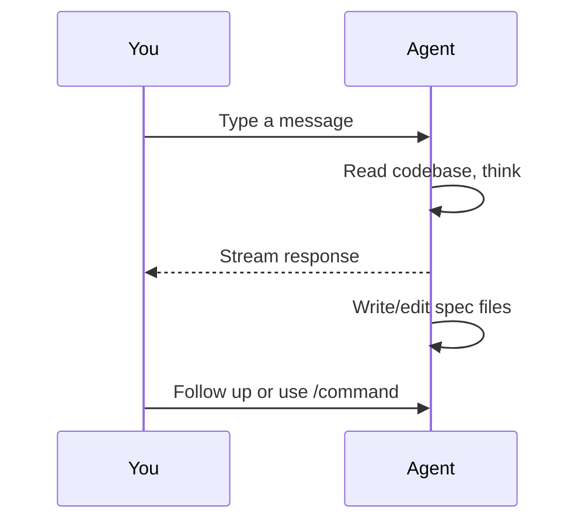

# Exploring Ideas

The planning chat is a conversational interface for exploring ideas with an AI agent before committing to structured specs or tasks. It runs inside the spec mode view and is backed by a persistent sandbox container that can read your codebase, create files, and execute commands.

---

## Essentials

### Opening the Planning Chat

Switch to spec mode by pressing **S** (or clicking the mode toggle in the header). The chat pane appears on the right side of the layout. Press **C** to toggle it open or closed.

### Sending Messages

Type in the composer at the bottom of the chat pane. Press **Enter** to send (or **Cmd+Enter**, depending on the send mode toggle). Use **Shift+Enter** to insert a newline without sending.

### Agent Responses

Responses stream in real-time. Assistant text is rendered as markdown with syntax-highlighted code blocks. Tool activity (file reads, command execution, file writes) appears in a collapsible "Agent activity" section below each response.

### Slash Commands

Type `/` to see an autocomplete menu of built-in commands. Commands cover the full spec lifecycle:

| Command | Description |
|---|---|
| `/summarize [words]` | Summarize the focused spec, optionally limited to a word count |
| `/create <title>` | Create a new spec file with the given title |
| `/refine [feedback]` | Update the focused spec against the current codebase state |
| `/validate` | Check the focused spec against document model rules |
| `/impact` | Analyze which code and specs would be affected |
| `/status <state>` | Update the focused spec's lifecycle status |
| `/break-down [design\|tasks]` | Decompose the focused spec into sub-specs or dispatchable tasks |
| `/review-breakdown` | Validate a task breakdown for dependency ordering, sizing, and coverage |
| `/dispatch` | Dispatch the focused spec to the task board |
| `/review-impl [range]` | Review implementation against the spec's acceptance criteria |
| `/diff [range]` | Compare completed implementation against spec (drift analysis) |
| `/wrapup` | Finalize a completed spec with outcome and status updates |

### @mentions

Type `@` in the composer to trigger file path autocomplete. In spec mode, spec files are prioritized in the suggestion list. Mentioned files are included as context for the agent.

### Interrupting

Click the stop button (which replaces the send button during streaming) to cancel the current response. The session context is preserved -- the agent remembers everything up to the interruption point.

### Message Queue

Keep typing while the agent is responding. New messages appear as queued chips below the composer. You can edit or remove queued messages before they are sent. The queue drains automatically as each response completes.

### Clearing History

Click **Clear** in the chat header to discard all messages and start a fresh conversation. The underlying container session is preserved; only the visible message history is cleared.

---

## Advanced Topics

### Session Persistence

Conversations persist on disk at `~/.wallfacer/planning/<fingerprint>/`, where `<fingerprint>` is derived from the active workspace paths. Reopening the app or refreshing the page restores prior messages for the same workspace group.

### Session Recovery

If the Claude Code session inside the planning container is lost (container recreated, session expired, or server restart), the system automatically retries with the conversation history replayed as context. You do not need to re-enter previous messages.

### Send Mode Toggle

Click the dropdown arrow next to the send button to switch between two modes:

- **Enter to send** -- pressing Enter sends the message, Shift+Enter inserts a newline
- **Cmd+Enter to send** -- pressing Enter inserts a newline, Cmd+Enter sends

The preference is persisted in localStorage and remembered across sessions.

### Focused Spec Context

When a spec is selected in the explorer (left pane), the agent automatically receives its file path as context. All slash commands operate on the focused spec. To change the target, click a different spec in the explorer before issuing the command.

---

## See Also

- [The Autonomy Spectrum](autonomy-spectrum.md) -- where the planning chat fits in the overall workflow
- [Designing Specs](designing-specs.md) -- structured design with specs
- [Refinement & Ideation](refinement-and-ideation.md) -- AI-assisted prompt improvement for tasks
