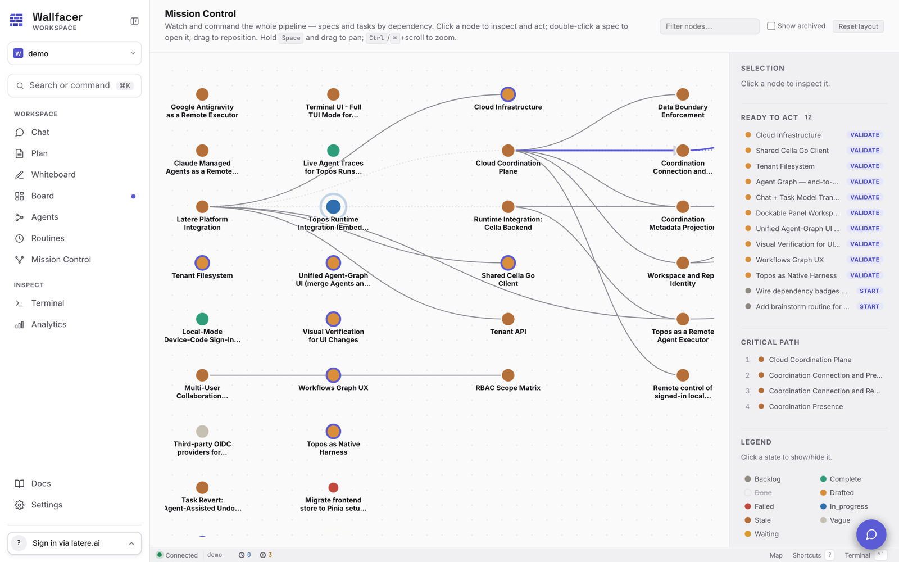

# Mission Control

Mission Control is the pipeline overview: one graph showing every spec and every task in the active workspace, connected by their dependencies, colored by state, and actionable in place. Open it from the sidebar or navigate to `/mission` (the legacy `/map` path redirects).

## The unified graph

The server builds the graph from two sources at once: the spec tree that Plan manages and the task board. It is served by `GET /api/graph` and rendered as a left-to-right layered layout, so upstream work sits left of the work that depends on it.

Node types:

- **Spec nodes** (larger discs) are colored by lifecycle state: vague, drafted, validated, testing, complete, stale, archived.
- **Task nodes** (smaller discs) are colored by board status: backlog, in progress, waiting, committing, done, failed, cancelled.

Edges distinguish containment (a spec's children, drawn dashed), dispatch links (a spec to the task it dispatched), spec dependencies, and task dependencies. The critical path, the longest dependency chain, is drawn with emphasized edges and listed in the inspector; blocked nodes render dimmed.

## Filtering

- The **legend** in the inspector lists every state present in the graph. Click a state to hide or show its nodes; hidden states render struck through. Done and cancelled are hidden by default to keep the overview focused on live work.
- The **Filter nodes** search box keeps only nodes whose label matches; edges survive only when both endpoints do.
- **Show archived** includes archived specs and tasks.
- **Reset layout** clears the filter, recenters the view, and resets zoom.

## Selecting a node

Click a node to select it. The inspector's **Selection** section shows the node's label, kind, and status, plus its action buttons. Double-click behaves per kind:

- A **spec node** opens a floating popup that renders the spec's markdown. The popup is draggable and resizable, and has a **Refine / discuss** shortcut.
- A **task node** opens the same task detail modal used on the Board.

## Acting from the graph

Each node advertises the actions currently legal for it; the server is the source of truth, and the graph re-syncs after every action so buttons never go stale.

- **Spec actions**: Validate, Dispatch (creates a board task from a validated spec; a toast offers a jump to the Board), Undispatch, Force complete, Reopen as Draft, Unarchive. These run the same spec transitions as Plan.
- **Task actions**: Start promotes a ready backlog task to in progress.
- **Refine / discuss** (spec nodes) opens the spec chat popup, the same planning chat Plan uses, focused on that spec, so generative operations (refine, break down, validate) run without leaving the graph.
- **Open in Plan** (spec nodes) jumps to the spec in Plan; **Open in Board** (task nodes) opens the task detail overlay.

The **Ready to act** section lists every node with a primary action available (validate, dispatch, or start), so actionable work is legible without hunting the canvas. Nodes with a primary action also render with an accent ring.

## Live activity

The graph reflects live task activity: running tasks pulse with an expanding ring, waiting tasks show a steady amber pulse, and a running node on the critical path gets a bold accent ring. Task updates stream into the client, and the graph re-fetches whenever a task changes status or dependencies, so the picture stays current without manual refresh. Animations respect the reduced-motion system preference.

## Navigation

- Drag a node to reposition it; edges re-aim live.
- Hold Space and drag to pan.
- Ctrl/Cmd + scroll to zoom (0.3x to 2.5x).
- **Reset layout** restores the computed layout, centering, and zoom.

## See also

[Plan](plan.md) for the spec lifecycle behind spec nodes, [Board](board.md) for task states and the detail modal, [Concepts](concepts.md) for how specs and tasks relate, and [Plan Mode](../internals/plan-mode.md) for spec-transition internals.
