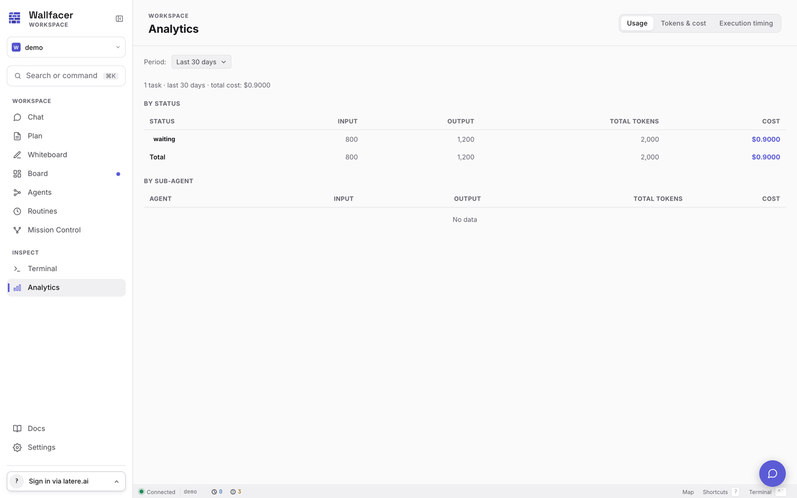

# Oversight and Analytics

Wallfacer records what agents do while they work: structured summaries of each task, an event-sourced audit trail, live transcripts, reviewable diffs, and workspace-level cost and timing analytics. This guide covers each surface, from a single task's oversight summary to the Prometheus endpoint for external monitoring.

## Oversight summaries

An oversight summary is a phase-by-phase account of what an agent did during a task, produced by a lightweight oversight agent that reads the task's transcript. Each phase carries a title, a short summary, and a timestamp, plus the tools used, commands run, and key actions taken where available.

Summaries are generated automatically when a task reaches the waiting, done, or failed state. Test runs produce a separate testing oversight summary covering only the test agent's activity.

A summary has one of four statuses:

| Status | Meaning |
|---|---|
| pending | Not yet generated |
| generating | The oversight agent is running |
| ready | Summary available and displayed |
| failed | Generation failed (the error is recorded) |

### Viewing a summary

Open a task card and select the **Activity** tab in the detail modal. The summary appears above the transcript once ready. Tasks with a test run show an additional testing oversight block. The **Timeline** tab reuses the phases as a colored band across the flamegraph.


### Periodic regeneration

By default a summary is generated only when the task reaches waiting, done, or failed. To also refresh the summary while a task runs, open **Settings > Execution** and set the oversight interval in minutes (0 to 120; 0 disables periodic generation), or set `WALLFACER_OVERSIGHT_INTERVAL`. The value is re-read on every tick, so changes take effect without a restart. A tick is skipped when a generation is already in progress or the task has produced no output yet.

### Backfilling missing summaries

Tasks completed before oversight existed, or tasks whose generation failed, can be backfilled. In **Settings > Execution**, set a limit and click **Generate Missing**, or call the API directly:

```
POST /api/tasks/generate-oversight?limit=10
```

Eligible tasks are those in a terminal or waiting state with at least one turn and no ready summary. The response reports how many tasks were queued (`queued`), their ids (`task_ids`), and the total count still without oversight (`total_without_oversight`).

### Customizing the prompt

The oversight agent's system prompt can be overridden in **Settings > System Prompts**. Delete the override to restore the built-in template.

## Task timeline

Every task keeps an event-sourced audit trail. Events are appended, never rewritten, so the timeline is a faithful record of what happened and why.

Event types: `state_change`, `output`, `feedback`, `error`, `system`, `span_start`, `span_end`, `prompt_round`, and `prompt_round_revert`.

Each state change records a trigger explaining what caused it: `user`, `auto_promote`, `auto_retry`, `auto_test`, `auto_submit`, `feedback`, `sync`, `recovery`, or `system`. When sign-in is enabled, events also carry actor attribution: the principal that caused the event and its type (signed-in user, service account, API-key caller, or the system itself).

View the trail in the **Events** tab of the task detail modal, which also surfaces usage, retry history, and prompt history. The same data is available at `GET /api/tasks/{id}/events`, with optional cursor pagination (`after`, `limit`, `types`).

### The flamegraph

The **Timeline** tab renders task execution as an interactive flamegraph built from spans, the timed intervals recorded around each phase of work: worktree setup, agent turns, harness runs, the commit pipeline, feedback waits. The view updates live while a task runs and shows:

- A time axis from task start, with tick marks at 0%, 25%, 50%, 75%, and 100% of the execution duration.
- An oversight phase band: colored blocks for the summary's phases, with hover details.
- Span blocks packed into lanes to avoid overlap; hover shows the label, start offset, duration, and associated phase.
- A cumulative cost chart with markers for the activity that incurred each increment.
- A detail table of all spans sorted by duration, with each span's share of total time.

Idle gaps (for example, waits for feedback) are compressed and marked with hatched regions so long pauses do not distort the picture.

## Live logs

While a task runs, the **Activity** tab streams the agent transcript in real time. For finished tasks the saved output is replayed from disk over the same endpoint.

The transcript has two views, switched by the toggle button above it:

- **Rendered** (the default): the transcript parsed into structured rows (thinking, tool calls, tool results, text). Rendering works across all harnesses: Claude Code output is parsed in the browser, and every other harness (Codex, Cursor, opencode, pi, Topos) is rendered from the server's normalized event stream.
- **Raw**: the harness-native output with no interpretation.

A filter box above the rows narrows the transcript to matching entries. The browser caps rendering at 5,000 rows and the server caps each turn's output at 8 MB; banners indicate truncation, with a link to download the full log. When nothing parses into rows, the view falls back to raw output automatically.

## Diff review

The **Changes** tab shows the task's diff against the default branch. While a task is waiting for review, the diff supports an inline comment flow:

1. Click the gutter button on a line to open a comment box anchored beneath it. Press Cmd/Ctrl+Enter to save, Escape to cancel.
2. Add as many comments as needed, across any number of files. Lines with comments show a filled gutter marker.
3. The **Review comments** panel collects all comments grouped by file, each editable and deletable, alongside an optional general feedback field. Click a line reference to scroll back to the anchored diff line.
4. Click **Submit** to send everything as one batched feedback message. Comments are serialized with their file and line anchors so the agent can locate each one, and the task resumes with the feedback.

When sign-in is enabled, submitting feedback requires a signed-in principal.

## Analytics

Open **Analytics** from the sidebar (or navigate to `/analytics`). The page has three tabs; the active tab is kept in the URL, so views can be bookmarked.



### Usage

Token and cost accounting over a selectable period (last 7, 30, or 90 days, or all time): total cost and task count, plus **By Status** and **By Sub-Agent** tables. Sub-agents cover implementation, test, refinement, title generation, oversight, testing oversight, and agent sessions.

### Tokens & cost

The cost dashboard: summary tiles for total cost, input, output, and cache tokens; a daily spend chart over the last 30 days; tables by status, by activity, and by workspace; agent-session usage with a trend sparkline; and the top 10 tasks by cost, each clickable to open the task.

Numbers for completed tasks come from immutable task summaries: snapshots written exactly once when a task reaches done, covering final cost, per-activity usage, duration, and turn count. The summaries are also served directly for external dashboards:

```
GET /api/tasks/summaries
```

### Execution timing

Per-phase latency aggregated across all tasks: completed and failed counts, success rate, median and P95 execution time, a daily-completions chart, and a per-phase table (worktree setup, agent turn, harness run, commit pipeline) with min, median, mean, P95, P99, and max durations. Duration cells are color-coded: green under 5 seconds, amber between 5 and 30 seconds, red over 30 seconds.

### Per-turn usage

For granular analysis, each task exposes one usage record per turn, including token counts, cost, stop reason, harness, and sub-agent:

```
GET /api/tasks/{id}/turn-usage
```

## Prometheus metrics

The server exposes `GET /metrics` in Prometheus text format for external monitoring:

| Metric | Type | Labels |
|---|---|---|
| `wallfacer_tasks_total` | gauge | `status`, `archived` |
| `wallfacer_running_containers` | gauge | |
| `wallfacer_background_goroutines` | gauge | |
| `wallfacer_store_subscribers` | gauge | |
| `wallfacer_failed_tasks_by_category` | gauge | `category` |
| `wallfacer_circuit_breaker_open` | gauge | |
| `wallfacer_autoimplement_actions_total` | counter | `watcher`, `outcome` |
| `wallfacer_http_requests_total` | counter | `method`, `route`, `status` |
| `wallfacer_http_request_duration_seconds` | histogram | `method`, `route` |

## See also

[Board](board.md) for the task lifecycle and detail modal, [Automation](automation.md) for the watchers whose triggers appear in the timeline, [Configuration](configuration.md) for the environment variable reference, and [API & Transport](../internals/api-and-transport.md) for the full HTTP API.
