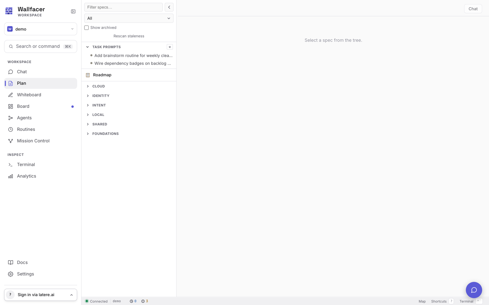

# Plan

Plan is the spec-first design surface, reachable from the sidebar at `/plan` or by pressing **p**. Specs are markdown design documents that bridge ideas and executable tasks: each captures the why, the constraints, the dependencies, and the acceptance criteria of a piece of work, then dispatches to the [Board](board.md) when ready. See [Concepts](concepts.md) for where specs sit in the overall workflow.



## Layout

With specs present, Plan shows three surfaces: the **spec explorer** (file tree) on the left, the **focused view** (rendered markdown) in the center, and the **agent chat** as a floating, draggable, resizable popup toggled with **c** or the Chat button in the focused-view header. The popup's position and size persist across sessions, and it carries a compact thread switcher.

A workspace with no specs and no roadmap opens in a **chat-first** layout instead: a single centered chat panel invites free-form planning, with `/create <title>` as the path to the first spec. The layout flips to three-pane automatically as soon as a spec appears (the tree updates over a live stream). The chat engine is identical to the dedicated [Chat](chat.md) surface, including the twelve slash commands; Plan adds the spec tree and the focused-spec context that gives those commands a target.

## Spec document model

A spec is a markdown file under `specs/` with YAML frontmatter. The tree in the explorer is derived from the filesystem: top-level directories under `specs/` are *tracks*, and a file with a same-named sibling directory is a non-leaf spec whose children live inside that directory. When `specs/README.md` exists, the explorer pins a **Roadmap** entry at the top that renders it as a plain document with no lifecycle.

```yaml
---
title: Human-readable title
status: drafted            # vague | drafted | validated | testing | complete | stale | archived
effort: medium             # small | medium | large | xlarge
created: 2026-07-01
updated: 2026-07-01
author: ada
depends_on:                # optional: prerequisite spec paths
  - specs/shared/agent-abstraction.md
affects:                   # optional: code paths the work will touch
  - internal/runner/
dispatched_task_id: null   # leaf specs only; set on dispatch
---
```

`title`, `status`, `effort`, `created`, `updated`, and `author` are required. `depends_on` declares prerequisite specs; the resulting graph must be a directed acyclic graph, and cycles are rejected. `dispatched_task_id` may only appear on leaf specs. Validation runs via the `/validate` slash command in chat or `wallfacer spec validate` on the command line; it checks required fields, enum values, date ordering, dependency existence and acyclicity, dispatch consistency, and non-empty bodies beyond the `vague` state.

Non-leaf specs roll up progress from their subtree (for example `4/6` leaves complete), shown next to the entry in the explorer.

## Lifecycle

Specs move through seven states. Only the transitions below are legal.

| Status | Meaning |
|---|---|
| `vague` | Initial idea, not yet fleshed out |
| `drafted` | Written up with structure, not yet validated |
| `validated` | Reviewed, dependencies checked, ready for dispatch |
| `testing` | Implementation landed; the drift check is pending or in progress |
| `complete` | Implemented and verified |
| `stale` | Overtaken by upstream changes; needs re-review |
| `archived` | Taken out of circulation; hidden from the live tree |

| From | To |
|---|---|
| `vague` | `drafted`, `archived` |
| `drafted` | `validated`, `stale`, `archived` |
| `validated` | `testing`, `stale` |
| `testing` | `complete`, `stale`, `archived` |
| `complete` | `stale`, `archived` |
| `stale` | `drafted`, `validated`, `archived` |
| `archived` | `drafted` |

`validated → complete` is deliberately not a legal edge: a spec reaches `complete` only through `testing`, where the drift check renders its verdict. `validated → stale` stays legal because stale propagation marks validated dependents when an upstream spec changes.

In the focused view, the status renders as a badge and transitions happen through explicit buttons: **Validate** on a drafted spec, **Dispatch** on a validated one, **Archive** / **Unarchive**, **Reopen as Draft** on a stale spec, and **Mark Complete Without Drift Check** to force-complete. Stale-candidate banners offer **Mark Stale** or **Dismiss**. The `/status <state>` chat command drives the same state machine.

## Working a spec in chat

The typical progression maps to slash commands: `/create` a draft, `/refine` it against the codebase, `/validate` the structure, `/impact` to gauge blast radius, `/break-down` into children, `/review-breakdown` to sanity-check the decomposition, `/dispatch` to the board, then `/review-impl`, `/diff`, and `/wrapup` after implementation. The steps are not mandatory or strictly linear; small specs can go straight from creation to dispatch. The full command table is in [Chat](chat.md).

`/break-down` picks its mode from the spec's state: **design mode** (sub-design specs with options and open questions) for `vague` or `drafted` specs, **tasks mode** (implementation-ready leaves with goal, steps, tests, and boundaries) for `validated` ones. Override with `/break-down design` or `/break-down tasks`, or press **b** with a spec focused. Children land in a subdirectory named after the parent file.

Planning rounds that write spec files are committed per round and can be undone from the latest assistant response; the undo is a forward `git revert`, so history is preserved.

## Dispatch to the board

Dispatching turns a validated leaf spec into a board task: press **d**, click **Dispatch** in the focused view, use `/dispatch` in chat, or multi-select specs in the explorer and dispatch the batch. Dispatching a validated non-leaf expands to its subtree's leaves.

For each leaf, the server creates a task whose prompt is the spec body, tagged `spec-dispatched` plus the track name, wires `depends_on` relationships into task dependencies, and writes the task's ID back into the spec's `dispatched_task_id`. The whole batch is atomic: task creation and frontmatter writes either all succeed or all roll back. Drafted ancestors of a dispatched leaf are promoted along the way. Dispatching a spec that is not validated, or a non-leaf directly, fails without mutating anything.

**Undispatch** reverses the link: the linked task is cancelled if still live, `dispatched_task_id` is cleared, and the spec returns to `validated`.

## Completion and the drift pipeline

What happens when a dispatched task finishes depends on the drift tester gate:

- **Default** (`WALLFACER_DRIFT_TESTER` unset): the spec's status is written to `complete` directly when its task reaches `done`.
- **With `WALLFACER_DRIFT_TESTER=1`** (experimental): the spec moves `validated → testing` and records the implementation commit range. A drift-assessment agent compares the implementation against the spec, and the verdict classifies the spec as `complete` or `stale`. A stale verdict fans out: dependent specs (via `depends_on` and overlapping `affects`) are marked stale as well. An **Outcome** section documenting the verdict is appended to the spec. Everything lands in a single commit, so one `git revert` undoes both the status changes and the fan-out. If the tester itself fails, the spec holds in `testing` with a `testing_pending` marker, surfaced as a banner in the focused view.

Independent of the pipeline, the explorer offers staleness tooling: **Rescan staleness** flags specs whose `affects` paths changed since completion, flagged specs show a stale-candidate banner (**Mark Stale** / **Dismiss**), and **Dismiss all** clears the current candidates.

## Spec comments

Selecting text in a rendered spec (three or more characters) raises a **Comment** button that opens a composer anchored to the selection. Threads render as cards in a right-hand margin rail, aligned with their anchor lines; anchors that can no longer be located fall back to gutter markers, and a triage panel lists orphaned or outdated threads for resolution. Threads support reply, resolve, and reopen.

Comments are stored server-side and stream live to other open views. With a signed-in account and coordination enabled, comments sync across machines through the coordination connector; when signed out or with coordination off, the layer disables itself silently. See [Configuration](configuration.md) for sign-in.

## Free-form specs

A `specs/` directory of plain markdown files without frontmatter still renders: each file appears as a read-only *doc node* with a muted title and no lifecycle controls. When doc nodes are present, a dismissible banner offers **Adopt frontmatter**, which prepends a `drafted` frontmatter block to each file (title taken from the first heading), preserving the prose and committing the change. Dismissal persists per browser; adoption is optional.

## Task prompts

The explorer's **Task Prompts** section lists the board's backlog tasks (plus waiting tasks via the **W** toggle). Selecting one opens a task-mode focus: the task's prompt renders in the focused view, and the chat becomes a prompt-editing thread. Conversational rewrite requests ("make the error handling explicit") end with the agent writing the new prompt straight to the task through a bounded tool; each write is recorded on the task as a numbered prompt-round event.

**Undo** in a task-mode thread rewinds the latest round by restoring the previous prompt and recording a revert event; no git operations are involved, since task prompts live in the task store rather than in files. Prompt editing locks as soon as the task leaves the backlog or waiting states and unlocks if it returns.

## Archive and unarchive

Archiving takes a spec out of circulation without deleting it: the spec (and, cascading, all non-archived descendants) moves under `specs/.archive/` with statuses flipped, in a single commit. The cascade is rejected with a conflict error if any target still has a live dispatched task; cancel or finish the task first. Archived specs are hidden from the tree by default (**Show archived** reveals them) and are skipped by drift checks, staleness scans, and the empty-workspace detection, so archiving the last spec flips Plan back to the chat-first layout.

Unarchive prefers the lossless path: it locates the archive commit and runs `git revert`, restoring every descendant's prior status exactly. When the commit cannot be found or the revert conflicts, it falls back to moving the single spec back with status `drafted`.

## Keyboard shortcuts

| Key | Action |
|---|---|
| `p` | Toggle between Board and Plan |
| `e` | Toggle the explorer |
| `c` | Toggle the chat popup (no-op in chat-first layout) |
| `d` | Dispatch the focused spec |
| `b` | Break down the focused spec |

## See also

- [Board](board.md): where dispatched specs execute
- [Chat](chat.md): the same agent engine without the spec tree
- [Mission Control](mission-control.md): specs and tasks on one dependency graph
- [Getting Started](getting-started.md): first workspace and first spec
- [Configuration](configuration.md): sign-in, coordination, and the drift tester gate
- [Plan Mode internals](../internals/plan-mode.md): tree building, dispatch, drift, and undo implementation
