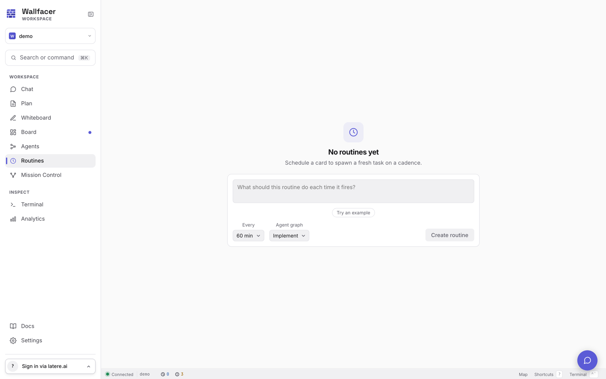

# Routines

A routine is a scheduled card that spawns a fresh task on a cadence. Routines live on the Routines page (`/routines`) and are the mechanism for recurring work: nightly dependency audits, periodic idea generation, scheduled housekeeping.

Under the hood a routine is a task with `kind: routine`. It acts as a schedule template, not a unit of work: the routine card itself never runs. Each time it fires, a brand-new instance task is created and works the routine's prompt from scratch.

## Creating a routine

Create routines from the Routines page. The form takes:

- **Prompt**: what each spawned task should do. Write it as a self-contained task prompt; every instance starts fresh with no memory of previous runs.
- **Interval**: the firing cadence, chosen from presets between 1 minute and 1440 minutes (24 hours). The API enforces a 1 minute minimum to keep instance-task churn reasonable.
- **Agent graph**: which fleet the spawned tasks execute against (see [Agent Graph](agent-graph.md)). Defaults to `implement`.

New routines are enabled immediately and arm their first timer on creation.

## The routine card

Each routine renders as a card with schedule controls in its footer:

- A **routine** badge and the spawn fleet label.
- A live **countdown** to the next scheduled fire, or `paused` when disabled.
- The **last fired** time, once the routine has fired at least once.
- An **interval** picker to change the cadence in place.
- An **enabled** toggle to pause and resume the schedule.
- A **Run now** button that fires the routine immediately and re-arms the timer.

## Pausing

Turn the **enabled** toggle off to pause a routine; the timer disarms and nothing spawns until it is re-enabled. At the storage level an interval of 0 seconds also means paused (the engine treats a non-positive interval as disabled), but the API and UI keep the interval at 1 minute or more and use the enabled flag as the pause switch.

Deleting a routine stops it permanently and removes the card.

## What happens on fire

When a routine's timer elapses (or **Run now** is pressed):

1. A fresh instance task is created in Backlog with the routine's prompt.
2. The instance is tagged `spawned-by:<routine-id>`, so all runs of one routine can be found together.
3. The instance executes against the routine's agent graph. An unknown or since-removed fleet slug resolves to `implement`.
4. The routine records its last-fired time and re-arms for the next interval.

From that point the instance is an ordinary task: it obeys the same lifecycle, automation, and review flow as anything else on the [board](board.md).

## What routines stay out of

Routine cards are deliberately inert on the board side:

- **Autoimplement never promotes them.** The auto-promoter skips `kind: routine` cards; only the routine engine drives them.
- **Archiving ignores them.** "Archive all done" and the archive lifecycle apply to work tasks, not schedule templates.
- **They take no part in the dependency graph.** Routines cannot be depended on and do not block other tasks.

## Note on ideation

Earlier releases shipped "ideation" as a distinct scheduled feature with its own engine. That feature is now expressed as a plain routine: a recurring prompt (for example, "Review the repository for the three highest-impact improvements and create a task for each") on whatever interval fits. The Routines page offers a one-click example prompt for exactly this pattern. Legacy ideation state migrated to a `system:ideation` routine.

## Related pages

- [Board](board.md) for the lifecycle of spawned instance tasks.
- [Agent Graph](agent-graph.md) for composing the fleet a routine spawns.
- [Automation](automation.md) for the watchers that pick spawned tasks up automatically.
