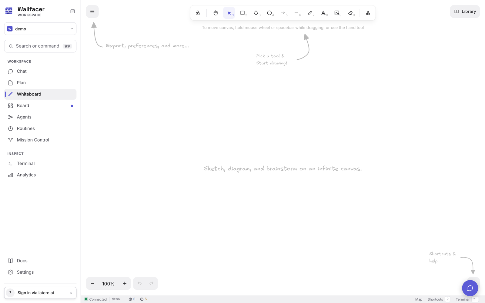

# Whiteboard

The Whiteboard is an infinite canvas for sketching, diagramming, and brainstorming next to the work: an embedded [Excalidraw](https://excalidraw.com) editor with one scene per workspace. Open it from the sidebar or navigate to `/whiteboard`.

## Drawing and saving

The full Excalidraw toolset is available: shapes, arrows, freehand drawing, text, images, frames, and the standard Excalidraw keyboard shortcuts.

Changes save automatically. Edits are debounced (about 1.5 seconds after the last change) and written to the server; a status indicator shows saving, saved, or error states. Pending changes are also flushed, best effort, when leaving the page.

The scene is stored server-side per workspace (under the workspace's data directory as `whiteboard.json`), so switching workspaces switches drawings, and a workspace's whiteboard survives browser restarts and works from any browser pointed at the same server. Scene uploads are capped at 32 MiB.

## Libraries

Excalidraw library items (reusable shape collections) persist in the browser's local storage, separate from the per-workspace scene. Libraries are shared across all workspaces and synchronized across open tabs, and the standard Excalidraw library import flow ("Add to Excalidraw") works.

## Theme

The canvas follows the app theme: switching the app between light and dark re-renders the whiteboard to match. Excalidraw's own theme toggle is hidden to keep a single source of truth.

## Keyboard behavior

Escape closes any open Excalidraw dialog (the library panel, export dialogs, and similar). Excalidraw's native shortcuts are otherwise untouched.

## Current limits

- One scene per workspace; there is no support for multiple named boards yet.
- Scenes are stored by the local server only; cloud sync between machines is not available.
- Libraries live in the browser's local storage, so they do not follow the workspace to another browser or machine.

## See also

[Workspaces](workspaces.md) for the workspace model that scopes each scene, and [Plan](plan.md) for text-first design work with specs.
