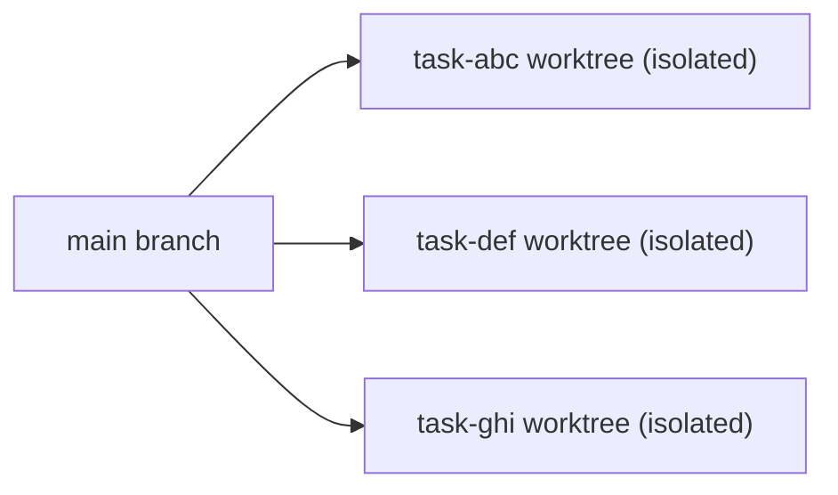

# Workspaces & Git

Workspaces are the directories containing your source code that Wallfacer runs tasks against. Each workspace is an independent project directory on your host machine. Wallfacer supports using multiple workspaces simultaneously, organising them into switchable groups, and providing full git integration -- branch management, sync, push, worktree isolation, and automatic conflict resolution -- all from the web UI.

---

## Essentials

### Key Concepts

| Concept | Description |
|---|---|
| **Workspace** | An absolute host directory a task runs against. Each task gets its own git worktree of the workspace as its working directory. Can be a git repository or a plain directory. |
| **Workspace group** | A saved combination of one or more workspaces. Groups are listed in the sidebar workspace switcher (the **W** button near the top of the left sidebar). Switching groups switches the entire task board. |
| **Default branch** | The branch currently checked out in a workspace (e.g. `main`, `develop`). Task branches are created from the default branch HEAD and merged back into it when the task completes. |

### Setting Up Workspaces

#### From the command line

On startup, Wallfacer restores the most recently used workspace group from your previous session. If no saved group exists, it starts with no active workspaces, select them from the UI workspace picker.

#### Workspace browser

The workspace browser is a modal dialog for selecting workspace directories from the UI. Open it from the header **+** tab or **Settings > Workspace**.

Features:

- **Breadcrumb navigation** -- click any segment of the current path to jump to that directory
- **Path input** -- type or paste an absolute path and press Enter to navigate directly
- **Directory listing** -- shows all subdirectories with a **git** badge on those that are git repositories
- **Hidden files toggle** -- show or hide dotfiles (directories starting with `.`)
- **Filter** -- type in the filter field to narrow the directory list by name
- **Add button** -- click **+ Add** next to any directory to add it to the selection, or click **Add current folder** to add the directory you are currently browsing
- **Selection summary** -- the left panel shows all selected directories with remove buttons

Click **Apply** to switch to the selected workspaces. The server validates every path and creates the necessary data directories.

### Git Status and Basic Operations

#### Git status display

When workspaces are git repositories, the header bar shows compact status chips for each workspace:

- **Repository name** -- links to the remote URL (GitHub, GitLab, etc.) when a remote is configured
- **Branch name** -- a clickable dropdown for switching branches
- **Ahead badge** (e.g. `3 up-arrow`) -- the number of local commits not yet pushed
- **Behind badge** (e.g. `2 down-arrow`) -- the number of upstream commits not yet pulled

Status updates are streamed via Server-Sent Events (SSE) and refresh every 5 seconds, so the display stays current without manual polling.

#### Push

When a workspace has commits ahead of the upstream, a **Push** button appears next to the ahead badge. Clicking it runs `git push` on the workspace. If the push fails due to non-fast-forward, the UI suggests syncing first.

#### Sync

When a workspace is behind the upstream, a **Sync** button appears. Clicking it runs `git fetch` followed by `git rebase @{u}` on the workspace. If a rebase conflict occurs, the operation is aborted and you are asked to resolve it manually.

Sync is blocked while tasks with worktrees in that workspace are in progress, waiting, committing, or failed (with worktrees still on disk).

#### Branch switching

Click the branch name in a workspace chip to open the branch dropdown. Select a branch from the list to switch, or type in the search field to filter. Branch switching is blocked while tasks are in progress, waiting, committing, or failed with worktrees still on disk.

#### Open folder

Click a workspace name (when no remote URL is configured) or use the context menu to open the workspace directory in your OS file manager (Finder on macOS, `xdg-open` on Linux).

### Reviewing Task Changes

Each task works on an isolated branch named `task/<id>`, created from the default branch HEAD. The task's agent makes changes on this branch inside a dedicated git worktree. When a task reaches **Done**, its changes are automatically committed, rebased onto the default branch, and merged via fast-forward. You can view the diff of any task's changes against the default branch from the task detail panel.

---

## Advanced Topics

### Workspace Groups

Workspace groups let you save and switch between different combinations of workspaces without restarting the server.

#### Workspace switcher

The **W** button near the top of the left sidebar opens the workspace switcher popover, which lists every saved group. The active group is marked with a check. Click a group to switch to it. Wallfacer stops any active SSE streams, resets the board, loads the new group's task store, and reconnects the streams -- all within a few seconds.

#### Naming groups

By default, the switcher shows the basename(s) of the workspace directories (e.g. `repo-a + repo-b`). You can assign a short, readable name to any group:

- Open the sidebar workspace switcher and click the **pencil** (rename) button on a group row to set a name in the prompt dialog.

Named groups display the custom name in the switcher. Hover over a group row to see the full workspace paths. To clear a custom name, rename it to an empty string -- the row reverts to the basename fallback.

#### Managing groups

All group actions live in the sidebar workspace switcher popover (the **W** button), except where Settings is noted.

| Action | How |
|---|---|
| Switch to a group | Open the switcher and click the group row |
| Rename a group | Click the **pencil** button on the group row |
| Delete a group | Click the **×** button on the group row and confirm. Tasks under it stay on disk but are unreachable until the group is recreated |
| Add a new group | Click **Add workspace…** to open the workspace picker, choose directories, and **Activate** |
| Set per-group parallel limits | Open **Settings > Workspace** and edit the group's parallel fields |

Groups are saved automatically to `~/.wallfacer/workspace-groups.json` whenever a group becomes active. The most recently used group is promoted to the front of the list.

#### Concurrent workspace groups

You can switch workspace groups at any time, even while tasks are running. Tasks in the previous group continue executing in the background -- their stores and worktrees are kept alive until all tasks complete. The switcher popover shows per-group task count badges (**N running**, **N waiting**) so you can see at a glance which groups have active work.

### Branch Management

Click the branch name in a workspace chip to open the branch dropdown:

| Action | How |
|---|---|
| Switch branch | Select a branch from the list |
| Filter branches | Type in the search field |
| Create a new branch | Type a name that does not match any existing branch, then click "Create branch" or press Enter |

Branch switching and creation are blocked while tasks are in progress, waiting, committing, or failed with worktrees still on disk.

#### Rebase on Main

When you are on a feature branch, a **Rebase on main** button appears. It fetches the remote default branch (e.g. `origin/main`) and rebases your current branch on top of it. This is useful when you want to incorporate upstream changes from the main branch into a feature branch. The button shows the behind-main count when your branch is behind.

Like Sync, this operation is blocked while tasks depend on the workspace's git state.

### Git Worktrees

Every task runs on an isolated git branch and worktree, so multiple tasks can work on the same repository simultaneously without conflicts.

#### How worktrees are created



When a task moves to **In Progress**:

1. Wallfacer creates a new branch named `task/<first-8-chars-of-task-id>` from the current HEAD of each workspace
2. A git worktree is created at `~/.wallfacer/data/<workspace-key>/worktrees/<task-id>/<repo-name>/`
3. The agent runs as a host process with that worktree as its working directory (CWD)

The worktree path on disk is the path the agent sees, with no path translation, so the diffs and file paths the agent produces map directly back to your repository.

For non-git workspaces, a snapshot copy is created instead, with a local git repository initialised for change tracking. When the task completes, the diff is captured from the snapshot before changes are extracted back to the original directory, so the diff view works for non-git workspaces too.

#### Worktree lifecycle

- **In Progress / Waiting / Failed** -- the worktree exists on disk and can be inspected
- **Done** -- after the commit pipeline completes, the worktree and branch are deleted
- **Cancelled** -- the worktree and branch are deleted immediately

If the server restarts while tasks are in progress, it recovers worktrees by reattaching to existing branches.

### The Commit Pipeline

When a task reaches **Done** (either by the agent finishing its work or by the user clicking "Mark Done"), Wallfacer runs a three-phase commit pipeline:

#### Phase 1: Stage and commit

1. All uncommitted changes in every worktree are staged (`git add -A`)
2. A commit message is generated by a lightweight agent (the `commit-msg` builtin) that analyses the diff stats, the task prompt, and the repository's recent commit style
3. Changes are committed on the task branch in each worktree

If commit message generation fails, a fallback message is constructed from the task prompt.

#### Phase 2: Rebase and merge

For each workspace (serialised per repository to avoid races):

1. The task branch is rebased onto the default branch
2. If the rebase succeeds, the default branch is fast-forward merged to the task branch tip
3. Commit hashes are recorded for later reference

If a rebase conflict occurs, Wallfacer invokes a conflict-resolution agent (see below). Up to 3 rebase attempts are made.

#### Phase 3: Cleanup

1. The git worktree is removed
2. The task branch is deleted
3. The task's worktree directory is removed from disk

### Conflict Resolution

When the rebase in Phase 2 encounters a merge conflict, Wallfacer handles it automatically:

1. The failed rebase is aborted, leaving the worktree in a clean state on the task branch
2. A conflict-resolution agent is launched as a host process with the conflicted worktree as its working directory
3. The agent is given a specialised conflict-resolution prompt instructing it to start the rebase, resolve all conflicts, and complete the rebase with `git rebase --continue`
4. If the agent succeeds, the commit pipeline retries the rebase

This process repeats for up to 3 attempts. If all attempts fail, the task is marked **Failed**. You can then inspect the task's event timeline to see what went wrong.

Conflict resolution is triggered in two contexts:

- **Commit pipeline** -- when a completed task's branch conflicts with the default branch during the final merge
- **Task sync** -- when rebasing a waiting or failed task's worktree onto the latest default branch (see below)

### Syncing Tasks

While a task is in the **Waiting** or **Failed** state, you can sync its worktrees to incorporate changes that other tasks have merged into the default branch since this task started. Click **Sync** in the task detail panel.

Syncing runs `git rebase` on the task's worktree against the default branch. If conflicts are encountered, the same agent-driven conflict resolution described above is used (up to 3 attempts).

The **Catch Up** automation toggle (in the Automation menu) can automatically rebase waiting tasks onto the latest branch whenever it advances, preventing merge conflicts.

### Auto-Push

After the commit pipeline completes, Wallfacer can optionally push each workspace to its remote. Auto-push is controlled by the `WALLFACER_AUTO_PUSH` and `WALLFACER_AUTO_PUSH_THRESHOLD` environment variables; see [Configuration → Full Environment Variables Reference](configuration.md#full-environment-variables-reference) for defaults. It can also be toggled from the **Automation** menu in the header.

### Repository Instructions (AGENTS.md / CLAUDE.md)

Each task runs with its git worktree as the working directory, so agents read each repository's own `AGENTS.md` or `CLAUDE.md` natively. Add those files to your repos to give agents per-repo guidance; Wallfacer does not generate or inject a separate workspace-level instructions file.

### Environment Variable

Set `WALLFACER_WORKSPACES` in `~/.wallfacer/.env` to persist workspaces across restarts. Paths are separated by the OS path-list separator (`:` on macOS/Linux, `;` on Windows):

```
WALLFACER_WORKSPACES=/Users/you/project-a:/Users/you/project-b
```

When you switch workspaces in the UI, this variable is updated automatically.

For the full HTTP API reference (workspace and git endpoints), see [API & Transport](../internals/api-and-transport.md). For the `WALLFACER_WORKSPACES`, `WALLFACER_AUTO_PUSH`, and `WALLFACER_AUTO_PUSH_THRESHOLD` env vars, see [Configuration → Full Environment Variables Reference](configuration.md#full-environment-variables-reference).

---

## See Also

[Board & Tasks](board-and-tasks.md) for task lifecycle details, [Automation](automation.md) for autopilot and auto-sync settings, [Configuration](configuration.md) for the full environment variable reference.
