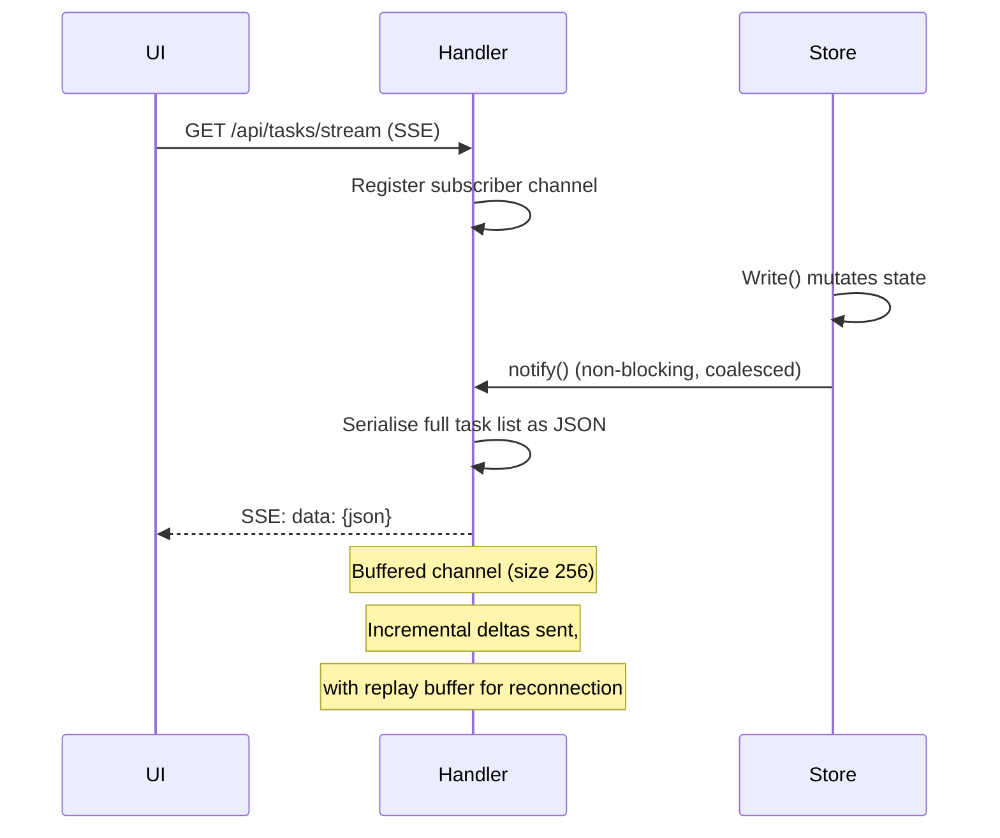
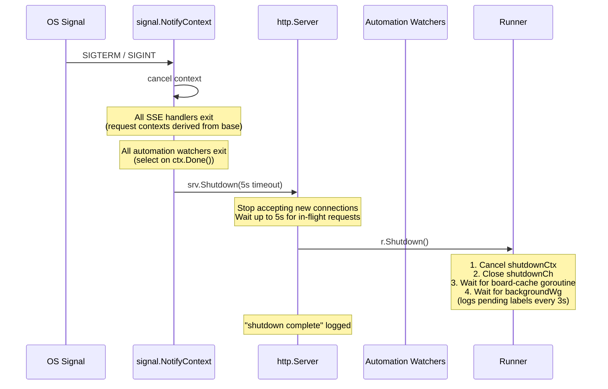

# API & Transport

This document covers the HTTP API surface, request processing pipeline, real-time event delivery (SSE), host execution, metrics, and supporting infrastructure for the Wallfacer server.

## HTTP API

All state changes flow through `handler.go`. The handler never blocks; long-running work is always handed off to a goroutine.

The REST routes are canonically defined in `internal/apicontract/routes.go`. `BuildMux` (`internal/cli/server.go`) registers each one, and `server_routes_test.go` asserts the two agree. A handful of endpoints are registered directly in `BuildMux` and are deliberately not in the contract (WebSocket terminal, docs API, metrics, sandbox trust-plane proxy); they are listed in [Routes outside the contract](#routes-outside-the-contract).

### Routes

| Method + Path | Handler action |
|---|---|
| **Debug & monitoring** | |
| `GET /api/debug/health` | Operational health check: goroutine count, task counts, uptime |
| `GET /api/debug/spans` | Aggregate span timing statistics across all tasks |
| `GET /api/debug/runtime` | Live server internals: pending goroutines, memory, task states, running processes |
| `GET /api/debug/board` | Board manifest as seen by a hypothetical new task (no self-task, no worktree mounts) |
| `GET /api/tasks/{id}/board` | Board manifest as it appeared to a specific task (is_self=true, MountWorktrees applied) |
| **File listing** | |
| `GET /api/files` | File listing for @ mention autocomplete |
| **Server configuration** | |
| `GET /api/config` | Get server configuration (workspaces, autopilot flags, harness list, payload limits) |
| `PUT /api/config` | Update server configuration (autopilot, autotest, autosubmit, harness assignments) |
| **Workspace management** | |
| `GET /api/workspaces/browse` | List child directories for an absolute host path |
| `POST /api/workspaces/mkdir` | Create a new directory under an absolute host path |
| `POST /api/workspaces/rename` | Rename a file or directory at an absolute host path |
| `PUT /api/workspaces` | Replace the active workspace set and switch the scoped task board |
| **Ideation / brainstorm** | |
| `GET /api/ideate` | Get brainstorm/ideation agent status |
| `POST /api/ideate` | Trigger the ideation agent to generate new task ideas |
| `DELETE /api/ideate` | Cancel an in-progress ideation run |
| **Routines** | |
| `GET /api/routines` | List routine cards with their schedules and next-run times |
| `POST /api/routines` | Create a routine card that spawns instance tasks on a fixed interval |
| `PATCH /api/routines/{id}/schedule` | Update a routine's interval or enabled flag; unset fields left unchanged |
| `POST /api/routines/{id}/trigger` | Fire a routine immediately, bypassing the schedule; the scheduled cycle continues |
| **Agents** (sub-agent catalog) | |
| `GET /api/agents` | List all registered sub-agent roles (built-in catalog plus user-authored) |
| `GET /api/agents/{slug}` | Get one agent's full descriptor including its prompt template body |
| `POST /api/agents` | Create a user-authored agent (rejects slugs that shadow a built-in) |
| `PUT /api/agents/{slug}` | Update a user-authored agent; 409 for built-in slugs |
| `DELETE /api/agents/{slug}` | Delete a user-authored agent; 409 for built-in slugs |
| **Flows** (flow catalog) | |
| `GET /api/flows` | List all registered flows (built-in catalog plus user-authored) |
| `GET /api/flows/{slug}` | Get one flow's full descriptor including its step chain and agent names |
| `POST /api/flows` | Create a user-authored flow (rejects slugs that shadow a built-in) |
| `PUT /api/flows/{slug}` | Update a user-authored flow; 409 for built-in slugs |
| `DELETE /api/flows/{slug}` | Delete a user-authored flow; 409 for built-in slugs |
| **Environment configuration** | |
| `GET /api/env` | Get environment configuration (tokens masked) |
| `PUT /api/env` | Update environment file; omitted/empty token fields are preserved |
| `POST /api/env/test` | Test harness configuration by running a lightweight probe task |
| **System prompt templates** | |
| `GET /api/system-prompts` | List all built-in system prompt templates with override status and content |
| `GET /api/system-prompts/{name}` | Get a single built-in system prompt template by name |
| `PUT /api/system-prompts/{name}` | Write a user override for a built-in system prompt template; validates before writing |
| `DELETE /api/system-prompts/{name}` | Remove user override, restoring the embedded default |
| **Prompt templates** | |
| `GET /api/templates` | List all prompt templates sorted by created_at descending |
| `POST /api/templates` | Create a new named prompt template |
| `DELETE /api/templates/{id}` | Delete a prompt template by ID |
| **Git workspace operations** | |
| `GET /api/git/status` | Git status for all mounted workspaces |
| `GET /api/git/stream` | SSE stream of git status updates for all workspaces |
| `POST /api/git/push` | Push a workspace to its remote |
| `POST /api/git/sync` | Fetch and rebase a workspace onto its upstream branch |
| `POST /api/git/rebase-on-main` | Fetch origin/<main> and rebase the current branch on top |
| `GET /api/git/branches` | List branches for a workspace |
| `POST /api/git/checkout` | Switch a workspace to a different branch |
| `POST /api/git/create-branch` | Create and check out a new branch in a workspace |
| `POST /api/git/open-folder` | Open a workspace directory in the OS file manager |
| **Usage & statistics** | |
| `GET /api/usage` | Aggregated token and cost usage statistics |
| `GET /api/stats` | Task status and workspace cost statistics, plus an `agent_sessions` section keyed by workspace group. Optional `?workspace=<path>` restricts task aggregation; optional `?days=N` restricts agent-session aggregation to rounds newer than N days (execution buckets are unchanged by `?days`). |
| **Task collection (no {id})** | |
| `GET /api/tasks` | List all tasks (optionally including archived) |
| `GET /api/tasks/stream` | SSE: full snapshot then incremental task-updated/task-deleted events |
| `POST /api/tasks` | Create a new task in the backlog. **Does not accept `sandbox` or `sandbox_by_activity`**; the harness (Claude, Codex, Cursor) is selected by the agent a flow step references, and the per-task override is applied via `PATCH /api/tasks/{id}` after creation. |
| `POST /api/tasks/batch` | Create multiple tasks atomically with symbolic dependency wiring. Same harness-rejection policy as the singular endpoint. |
| `POST /api/tasks/generate-titles` | Bulk-generate titles for tasks that lack one |
| `POST /api/tasks/generate-oversight` | Bulk-generate oversight summaries for eligible tasks |
| `GET /api/tasks/search` | Search tasks by keyword |
| `POST /api/tasks/archive-done` | Archive all tasks in the done state |
| `GET /api/tasks/summaries` | List immutable task summaries for completed tasks (cost dashboard) |
| `GET /api/tasks/deleted` | List soft-deleted (tombstoned) tasks within retention window |
| **Task instance operations ({id})** | |
| `PATCH /api/tasks/{id}` | Update task fields: status, prompt, timeout, harness, dependencies, fresh_start. Also absorbs the pure transitions: `status=cancelled` (kills the worker, discards worktrees, cascades to routine children), `archived=true`/`false` (archive/unarchive a done or cancelled task), and `deleted=false` (restore a soft-deleted task). |
| `DELETE /api/tasks/{id}` | Soft-delete a task (tombstone); data retained within retention window |
| `GET /api/tasks/{id}/events` | Task event timeline; supports cursor pagination (`after`, `limit`) and type filtering (`types`) |
| `POST /api/tasks/{id}/feedback` | Submit a feedback message to a waiting task |
| `POST /api/tasks/{id}/done` | Mark a waiting task as done and trigger commit-and-push |
| `POST /api/tasks/{id}/resume` | Resume a failed or waiting task using its existing session |
| `POST /api/tasks/{id}/sync` | Rebase task worktrees onto the latest default branch |
| `POST /api/tasks/{id}/test` | Trigger the test agent for a task |
| `GET /api/tasks/{id}/diff` | Git diff of task worktrees versus the default branch |
| `GET /api/tasks/{id}/logs` | Live log stream for a running task (`text/plain`, not SSE; see [Live Task Logs](#live-task-logs)) |
| `GET /api/tasks/{id}/outputs/{filename}` | Raw Claude Code output file for a single agent turn |
| `GET /api/tasks/{id}/turn-usage` | Per-turn token usage breakdown for a task |
| `GET /api/tasks/{id}/spans` | Span timing statistics for a task |
| `GET /api/tasks/{id}/oversight` | Oversight summary for a task; `?phase=impl` (default) or `?phase=test` selects the implementation- or test-agent summary |
| **File Explorer** | |
| `GET /api/explorer/tree` | List one level of a workspace directory |
| `GET /api/explorer/stream` | SSE stream of file tree change notifications |
| `GET /api/explorer/file` | Read file contents from a workspace |
| `PUT /api/explorer/file` | Write file contents to a workspace |
| `GET /api/explorer/task-prompts` | List backlog (and optionally waiting) tasks as virtual entries for the explorer Task Prompts section |
| **OAuth authentication** (agent CLI sign-in) | |
| `POST /api/auth/{provider}/start` | Start OAuth flow; returns `{authorize_url}` |
| `GET /api/auth/{provider}/status` | Poll flow status; returns `{state, error?}` |
| `POST /api/auth/{provider}/cancel` | Cancel an in-progress flow |
| **Admin** | |
| `POST /api/admin/rebuild-index` | Rebuild the in-memory search index from disk |
| **Spec tree** | |
| `GET /api/specs/tree` | Full spec tree with metadata, progress, and dependency edges |
| `GET /api/specs/stream` | SSE: spec tree change notifications |
| `POST /api/specs/transition` | Spec lifecycle transition. Body `{action, ...}`: dispatch/undispatch take `paths[]` (and `run` for dispatch) and return per-spec arrays; archive/unarchive take a single path and return `{path, status}` |
| **Agent session** | |
| `GET /api/agent` | Agent session status (running or not) |
| `POST /api/agent` | Start the agent session (idempotent) |
| `DELETE /api/agent` | Stop the agent session |
| `GET /api/agent/messages` | Retrieve conversation history. `?thread=<id>` selects the session; defaults to the active session. |
| `POST /api/agent/messages` | Send user message (triggers agent execution). Body `thread` field (or `?thread=`) selects the session. |
| `DELETE /api/agent/messages` | Clear a session's conversation history and resume state (`?thread=<id>`). |
| `GET /api/agent/messages/stream` | Stream agent response tokens for the in-flight session. Returns 204 when `?thread=<id>` does not match the session that owns the exec. |
| `POST /api/agent/messages/interrupt` | Interrupt current agent turn. `?thread=<id>` must match the in-flight session or 409. |
| `POST /api/agent/undo` | Undo the caller session's most recent planning round via a forward `git revert` commit (original commit stays in history; revert commit carries `Plan-Thread: <id>` and an incremented `Plan-Round`). `?thread=<id>` selects the caller's session. Task-mode sessions rewind via events instead of git. Cancels dispatched board tasks whose linkage was added by the reverted commit. 409 on revert conflict or when there is nothing to undo. |
| `GET /api/agent/commands` | List available slash commands |
| `POST /api/agent/tool/update_task_prompt` | Tool endpoint: update a task's prompt from a task-mode agent session (the prompt-refinement path) |
| **Agent sessions** | |
| `GET /api/agent/sessions` | List non-archived sessions; `?includeArchived=true` includes archived ones. Returns `{threads, active_id}`. |
| `POST /api/agent/sessions` | Create a new session. Body `{name?}`; omitted name auto-generates `Chat N`. |
| `PATCH /api/agent/sessions/{id}` | Mutate a session. Body `{name}` renames; `{state}` transitions it; `archived` hides it from the tab bar (409 if in-flight), `visible` restores it, `active` records the UI's active session. |
| **Principal & cloud sign-in** (hosted flow active when `WALLFACER_CLOUD=true`) | |
| `GET /login` | Begin the hosted sign-in flow |
| `GET /callback` | OAuth2 authorization-code callback; sets the session cookie |
| `GET /logout` | Clear the session cookie and redirect to the sign-in page |
| `GET /logout/notify` | Front-channel logout: clear the local cookie when the user signs out centrally |
| `GET /api/me` | Return the current principal (user + active org), or 204 when unauthenticated |
| `GET /api/auth/orgs` | List the user's organizations; 204 when single-org or unauthenticated |
| `PATCH /api/auth/me` | Mutate the signed-in principal (currently only `org_id`); clears the session and redirects to `/login?org_id=<target>` to switch the active organization |
| `POST /api/me/switch-org` | Switch the active organization (latere-ui session convention); validates membership, clears the session, returns `{redirect}` to `/login?org_id=<target>` |
| **Local device-code sign-in** (RFC 8628; local mode) | |
| `POST /api/auth/device/start` | Start a device-code flow; returns the user code and verification URI |
| `GET /api/auth/device/poll` | Poll the in-flight flow; returns `{status: idle\|pending\|done\|denied\|expired}` |
| `POST /api/auth/device/cancel` | Cancel the in-flight device-code flow |

### Triggering Task Execution

When a `PATCH /api/tasks/{id}` request moves a task to `in_progress`, the handler:

1. Updates the task record (status, session ID)
2. Launches a background goroutine: `go h.runner.Run(id, prompt, sessionID, false)`
3. Returns `200 OK` immediately; the client does not wait for execution

The same pattern applies to feedback resumption and commit-and-push.

### Routes outside the contract

A few endpoints are registered directly in `BuildMux` and are intentionally absent from `internal/apicontract/routes.go`, since they do not follow the browser-client REST contract:

| Method + Path | Purpose |
|---|---|
| `GET /api/terminal/ws` | Interactive host shell over WebSocket (PTY relay). See [WebSocket Terminal](#websocket-terminal). |
| `GET /api/docs` | List embedded docs (`{slug, title, category, order}`), reading-order sorted |
| `GET /api/docs/{slug...}` | Serve one embedded doc as `text/markdown` (path-traversal guarded) |
| `GET /api/docs-asset/{path...}` | Serve embedded doc images; only whitelisted image extensions are served |
| `GET /metrics` | Prometheus text exposition (see [Metrics Reference](#metrics-reference)) |
| `POST /internal/sandbox-proxy/llm/anthropic/` | Trust-plane LLM proxy (Anthropic) |
| `POST /internal/sandbox-proxy/llm/openai/` | Trust-plane LLM proxy (OpenAI) |
| `GET /internal/sandbox-proxy/github-token` | Trust-plane GitHub token mint |

The `/internal/sandbox-proxy/*` endpoints are server-to-server calls the sandbox credential sidecar makes, not part of the browser contract. They are wired unconditionally but respond 503 when `SandboxProxyConfig.Enabled` is false (local runs with no credentials). When `SANDBOX_PROXY_AUTH_URL` is set, requests are validated against the JWKS built from `SANDBOX_PROXY_AUTH_JWKS_URL` and `SANDBOX_PROXY_AUTH_ISSUER`; when it is unset, validation is skipped and the endpoints rely on the `Enabled` flag alone (acceptable in single-tenant local runs).

## Request Middleware Chain

The HTTP server wraps the `ServeMux` in a layered middleware chain. Each request passes through these layers in order:

```mermaid
flowchart LR
    Request --> Logging["loggingMiddleware<br/>(server.go)"]
    Logging --> CSRF["CSRFMiddleware<br/>(handler/middleware.go)"]
    CSRF --> Cookie["CookieAuth<br/>(internal/auth)"]
    Cookie --> Optional["OptionalAuth<br/>(internal/auth)"]
    Optional --> Bearer["BearerAuthMiddleware<br/>(handler/middleware.go)"]
    Bearer --> Force["ForceLogin<br/>(handler/force_login.go)"]
    Force --> Mux["ServeMux route matching"]
    Mux --> BodyLimit["MaxBytesMiddleware<br/>(per-route, handler/middleware.go)"]
    BodyLimit --> StoreGuard["RequireStoreMiddleware<br/>(per-route, handler/handler.go)"]
    StoreGuard --> Handler["Handler method"]
```



The chain is assembled in `internal/cli/server.go` (outermost first: logging, CSRF, CookieAuth, OptionalAuth, BearerAuth, ForceLogin, mux). `CSRFMiddleware` is unconditional. `ForceLogin` is only inserted in cloud mode:
```go
srvHandler := mux
if cloud {
    srvHandler = h.ForceLogin(mux)
}
srvHandler = handler.BearerAuthMiddleware(envCfg.ServerAPIKey)(srvHandler)
srvHandler = auth.OptionalAuth(jwtValidator, srvHandler)
srvHandler = auth.CookieAuth(authClient, srvHandler)
srvHandler = handler.CSRFMiddleware(actualHostPort)(srvHandler)
srv := &http.Server{Handler: loggingMiddleware(srvHandler, reg), ...}
```

### What each middleware does

| Layer | Location | Behaviour |
|---|---|---|
| **Logging** | `cli/server.go` `loggingMiddleware()` | Wraps the response writer to capture status codes. Logs every API request with method, path, status, and duration. Records `wallfacer_http_requests_total` counter and `wallfacer_http_request_duration_seconds` histogram. Uses `r.Pattern` for route labels; unmatched requests (404, empty `r.Pattern`) collapse to a single `route="<unmatched>"` series to bound label cardinality. |
| **CSRF** | `handler/middleware.go` `CSRFMiddleware()` | Unconditional. For mutating methods (POST, PUT, PATCH, DELETE), validates that the `Origin` or `Referer` header matches the server's host:port. GET/HEAD/OPTIONS pass through. Requests with no Origin/Referer also pass (for CLI/API clients). |
| **CookieAuth** | `internal/auth` `CookieAuth(authClient, next)` | Resolves the session cookie into a principal (user + org claims) and injects it into the request context. No-op when the request has no cookie. Takes the auth client and the next handler (no JWT validator). |
| **OptionalAuth** | `internal/auth` `OptionalAuth(jwtValidator, next)` | If a `Bearer` JWT is present, validates it against the configured JWKS and puts the resulting `*Claims` into the request context. JWT wins over the cookie when both are present; missing tokens pass through. |
| **BearerAuth** | `handler/middleware.go` `BearerAuthMiddleware()` | When `WALLFACER_SERVER_API_KEY` is configured, requires `Authorization: Bearer <key>` on all requests except: the root page (`GET /`), OAuth routes (`/login`, `/callback`, `/logout`), and streaming/WebSocket paths (`/api/tasks/stream`, `/api/git/stream`, `/api/explorer/stream`, `/api/specs/stream`, `*/logs`, `/api/terminal/ws`) which accept `?token=<key>` as a query parameter instead. Bypasses its static-key check when an identity (cookie or JWT claims) is already populated, so cookie-only browser requests succeed alongside script clients. No-op when no API key is configured. |
| **ForceLogin** | `handler/force_login.go` `ForceLogin()` | Cloud-mode only: redirects unauthenticated browser requests for the app shell to `/login`. API routes return 401 instead. Not inserted in local mode. |
| **Body limits** | `handler/middleware.go` `MaxBytesMiddleware()` | Applied per-route via `bodyLimits` map in `BuildMux`. Default: 1 MiB. Feedback: 512 KiB. Wraps `r.Body` with `http.MaxBytesReader` to reject oversized payloads. |
| **Store guard** | `handler/handler.go` `RequireStoreMiddleware()` | Applied per-route via `requiresStore()` check. Returns 503 when no workspace/store is configured. Exempted routes: `GetConfig`, `UpdateConfig`, `BrowseWorkspaces`, `MkdirWorkspace`, `RenameWorkspace`, `UpdateWorkspaces`, `GetEnvConfig`, `UpdateEnvConfig`, `TestSandbox`, `GitStatus`, `GitStatusStream`. |

## SSE Live Updates

Both task state and git status use the same SSE push pattern:



`notify()` uses buffered channels of size 256 (`pubsub.DefaultChannelSize`). Each state change produces a `SequencedDelta` that is fanned out to all subscribers. A replay buffer (up to 512 entries, `pubsub.DefaultReplayCapacity`) enables reconnecting clients to catch up on missed deltas.

The same pattern applies to `GET /api/git/stream`, except the source is a time-based ticker (polling `git status` every few seconds) rather than a store write signal.

Live task logs use a different mechanism: `GET /api/tasks/{id}/logs` streams the running agent process's live-log reader (`runner.TaskLogReader`) line-by-line. See [Live Task Logs](#live-task-logs).

### Task Stream (`GET /api/tasks/stream`)

Implemented in `Handler.StreamTasks()` (`internal/handler/stream.go`).

#### Subscriber Registration

On each SSE connection, the handler calls `store.Subscribe()`, which allocates a buffered channel sized at `pubsub.DefaultChannelSize` (256) and registers it in the store's `subscribers` map under a monotonically increasing integer ID.

The subscription is created **before** reading any state, ensuring no events are missed between the initial snapshot and the live loop.

#### Event Types

Three SSE event types are emitted:

| SSE `event:` | When | `data:` payload |
|---|---|---|
| `snapshot` | Initial connection or gap-too-old reconnect | Full `[]Task` JSON array |
| `task-updated` | Task created or mutated | Single `Task` JSON object |
| `task-deleted` | Task soft-deleted | `{"id": "<uuid>"}` |

Every SSE frame includes an `id:` field set to the delta sequence number, enabling the browser's built-in `Last-Event-ID` reconnection mechanism.

#### Reconnection and Replay

On reconnect, the client provides its last seen sequence via the `?last_event_id` query parameter or the `Last-Event-ID` HTTP header. The store's `DeltasSince(seq)` method binary-searches the replay buffer (up to 512 entries, `replayBufMax`) for deltas newer than the given sequence:

- **Buffer covers the gap**: Missed deltas are replayed individually as `task-updated` / `task-deleted` events. No full snapshot is needed.
- **Gap too old** (oldest buffered delta's Seq > requested seq + 1): Falls back to a full `snapshot` event via `ListTasksAndSeq()`, which reads both the task list and current sequence under the same read lock to guarantee consistency.

#### Backpressure and Dropped Events

`notify()` uses a non-blocking send to each subscriber channel:

```go
select {
case ch <- cloneSequencedDelta(sd):
default:  // channel full: drop this delta for this subscriber
}
```

If a subscriber's buffer (256 slots) is full, the delta is silently dropped for that subscriber. The subscriber will eventually receive a later delta; if it reconnects, the replay buffer provides catch-up. All deltas sent to subscribers are deep clones of the task state, preventing data races.

#### Connection Cleanup

When the client disconnects, `r.Context().Done()` fires in the SSE loop. The deferred `store.Unsubscribe(subID)` removes the channel from the subscribers map and drains any buffered deltas to free memory. The channel is **not** closed; `StreamTasks` is always the caller of `Unsubscribe`, so there is no blocked receiver to wake.

### Wake-Only Subscribers

In addition to the full-delta channel, the store provides a lightweight `SubscribeWake()` mechanism: a `chan struct{}` with capacity 1. Rapid bursts of notifications coalesce; once the channel is full, subsequent sends are no-ops. This is used by watchers (auto-promoter, auto-retrier, etc.) that only need a "something changed" signal, not the full delta payload.

### Git Status Stream (`GET /api/git/stream`)

Implemented in `Handler.GitStatusStream()` (`internal/handler/git.go`). Unlike the task stream, git status uses a **polling ticker** (every 5 seconds) rather than store-driven pub/sub. On each tick, the handler collects `git status` for all workspaces, JSON-marshals the result, compares it byte-for-byte with the previous emission, and only sends an SSE frame if the data has changed.

### Explorer Stream (`GET /api/explorer/stream`)

Implemented in `Handler.ExplorerStream()` (`internal/handler/explorer.go`). Uses a **polling ticker** (every 3 seconds) to fingerprint workspace root directories (hashing entry names, types, sizes, and modification times). Only sends a `refresh` event when a directory's fingerprint changes, so the frontend can re-fetch affected nodes. This replaces the previous approach where the frontend polled `GET /api/explorer/tree` every 3 seconds for each expanded directory.

**Events:** `connected` (on first connect), `refresh` (with `{workspaces: [...]}` payload listing changed workspace paths), `heartbeat` (every 15 seconds).

### Spec Tree Stream (`GET /api/specs/stream`)

Implemented in `Handler.SpecTreeStream()` (`internal/handler/specs.go`). Uses a **polling ticker** (every 3 seconds) to rebuild the spec tree and compare it byte-for-byte with the previous emission. Sends a `snapshot` event with the full tree data only when the content has changed. This replaces the previous frontend polling of `GET /api/specs/tree` every 3 seconds.

**Events:** `snapshot` (initial and on change, with full tree JSON), `heartbeat` (every 15 seconds).

### Live Task Logs (`GET /api/tasks/{id}/logs`)

Not SSE in the strict sense; this endpoint streams raw `text/plain` output. Execution is host-process, so there is no container to shell out to. When a turn is running, the handler prefers the in-process live-log reader: `h.runner.TaskLogReader(id)` returns a `*runner.LiveLogReader` (`internal/handler/stream.go:214`), and `streamLiveLog` first writes the completed turns saved on disk (so the client has full history), then relays the current turn's live chunks. When no turn is running, it falls back to the stored turn outputs on disk. A keepalive ticker keeps the connection alive and detects client disconnects.

## WebSocket Terminal

`GET /api/terminal/ws` is the project's only WebSocket endpoint. It provides an interactive host shell via a PTY relay. Unlike the REST routes defined in `internal/apicontract/routes.go`, this endpoint is registered directly in `BuildMux` (`internal/cli/server.go`) because WebSocket upgrades don't follow REST request/response semantics.

The handler (`internal/handler/terminal.go`) manages multiple concurrent shell sessions per WebSocket connection via a `sessionRegistry`. On connect, one session is auto-created. The relay dispatcher routes PTY output from the active session to the client and directs client input to the active session's PTY. Session switching re-resolves the active session without reconnecting.

Every session is a host shell rooted at the workspace directory. (Earlier builds could exec into a sandbox container; the shipping host-process runtime has no container to exec into, so the `create_session` message carries no target and always spawns a host shell.)

The feature is gated on `WALLFACER_TERMINAL_ENABLED` (default `true`; set to `false` to disable). Authentication uses `?token=` query parameter (same mechanism as SSE paths), since the browser `WebSocket` constructor cannot set custom headers.

### Message Protocol

**Client → Server (JSON text frames):**

| Type | Fields | Description |
|------|--------|-------------|
| `input` | `data` (base64) | Terminal input bytes |
| `resize` | `cols`, `rows` | Resize the active session's PTY |
| `ping` |, | Keep-alive; server responds with `pong` |
| `create_session` |, | Spawn a new host shell session |
| `switch_session` | `session` (ID) | Switch the active session |
| `close_session` | `session` (ID) | Close and remove a session |

**Server → Client (JSON text frames):**

| Type | Fields | Description |
|------|--------|-------------|
| `pong` |, | Keep-alive response |
| `sessions` | `sessions` (array of `{id, active}`) | Full session list; sent on connect and after any session change |
| `session_created` | `session` (ID) | New session spawned |
| `session_switched` | `session` (ID) | Active session changed |
| `session_closed` | `session` (ID) | Session removed |
| `session_exited` | `session` (ID) | Session's shell process exited |
| `error` | `data` (string) | Error message (e.g., invalid session ID) |

**Server → Client (binary frames):** Raw PTY output from the active session.

### Architecture

- **`sessionRegistry`** (`terminal.go`): manages `map[string]*terminalSession`, tracks the active session, and provides `create`, `switchTo`, `remove`, `closeAll`, and `activeSession` methods. A `switchCh` channel signals the relay dispatcher when the active session changes.
- **`relayDispatcher`**: the PTY→WS goroutine re-resolves the active session on each switch signal. The WS→PTY goroutine resolves `activeSession()` per message.
- **`monitorSession`**: per-session goroutine that waits for shell exit, then calls `handleSessionExit` which removes the session, sends `session_exited`, and auto-switches to a fallback or closes the WebSocket.
- **Frontend** (`frontend/src/components/TerminalPanel.vue`): tab bar UI with per-session output buffering (~100KB cap). On `session_switched`, xterm is cleared and the target session's buffer is replayed.

## Host Execution

Each task runs as a host process: the runner builds a launch spec and the host backend (`internal/executor`) execs the selected agent CLI (`claude`, `codex`, or `cursor-agent`, chosen by the agent the flow step references) directly, with the task's git worktree as the working directory. There is no container daemon, image pull, or bind-mount; cancellation is `SIGTERM` then `SIGKILL` on the host process.

### Process Tracking

Each launch spec is tagged with task metadata:

```
wallfacer.task.id=<uuid>
wallfacer.task.prompt=<first 80 chars>
```

These labels are set by the runner (`internal/runner/container.go`). The host backend records them per running process and surfaces them via `ContainerInfo.TaskID` on `List()`; `ListContainers()` uses this to correlate running processes to tasks. (The `Container*` Go names are legacy vocabulary; the behavior is host-process tracking, not container runtime.)

## Metrics Reference

All metrics are served at `GET /metrics` in Prometheus text exposition format via `metrics.Registry.WritePrometheus()`.

### Counters

| Metric | Labels | Description |
|---|---|---|
| `wallfacer_http_requests_total` | `method`, `route`, `status` | Total HTTP requests. Route uses `r.Pattern` (Go 1.22+) to collapse parameterised paths. |
| `wallfacer_autopilot_actions_total` | `watcher`, `outcome` | Autonomous actions taken by autopilot watchers (e.g. promote, retry, test, submit). |

### Histograms

| Metric | Labels | Buckets | Description |
|---|---|---|---|
| `wallfacer_http_request_duration_seconds` | `method`, `route` | 5ms, 10ms, 25ms, 50ms, 100ms, 250ms, 500ms, 1s, 2.5s, 5s, 10s | HTTP request latency distribution. |

### Gauges (scrape-time)

These are computed on each `/metrics` scrape via registered collector functions:

| Metric | Labels | Description |
|---|---|---|
| `wallfacer_tasks_total` | `status`, `archived` | Number of tasks grouped by status and archived flag. |
| `wallfacer_running_containers` |, | Number of running task processes currently tracked (legacy metric name; the value counts host processes). |
| `wallfacer_background_goroutines` |, | Number of outstanding background goroutines tracked by the runner's `trackedWg`. |
| `wallfacer_store_subscribers` |, | Number of active SSE subscribers listening for task state changes. |
| `wallfacer_failed_tasks_by_category` | `category` | Number of currently-failed (non-archived) tasks grouped by failure category. |
| `wallfacer_circuit_breaker_open` |, | 1 when the launch circuit breaker is open (executor unavailable), 0 when closed. |

## Token Tracking & Cost

Per-turn usage is extracted from the agent JSON output and accumulated on the `Task`:

```
TaskUsage {
  InputTokens              int
  OutputTokens             int
  CacheReadInputTokens     int
  CacheCreationTokens      int
  CostUSD                  float64
}
```

Usage is displayed on task cards and aggregated in the Done column header. It persists in `task.json` across server restarts.

In addition to the aggregate `TaskUsage`, each task records:

- `UsageBreakdown map[string]TaskUsage` keyed by activity: `implementation`, `testing`, `title`, `oversight`, `commit_message`, `idea_agent`. This lets the Usage tab in the task detail panel show cost per sub-agent rather than a single lump sum.
- Per-turn `TurnUsageRecord` entries accessible via `GET /api/tasks/{id}/turn-usage`, providing detailed per-turn token consumption, stop reasons, and sub-agent labels.

## Task Search

`GET /api/tasks/search?q=<keyword>` searches across task titles, prompts, tags, and oversight text. Results are returned as `TaskSearchResult` objects with the matched field and a context snippet.

The search index is maintained in-memory and updated on task changes. Use `POST /api/admin/rebuild-index` to manually rebuild if needed.

## Span Instrumentation

Key execution phases are instrumented with `span_start` / `span_end` trace events. Each span carries a `SpanData` payload with a `Phase` (e.g. `worktree_setup`, `agent_turn`, `commit`) and an optional `Label` to differentiate multiple spans of the same phase.

- `GET /api/tasks/{id}/spans` returns all span events for a task, useful for profiling turn latency
- `GET /api/debug/spans`: aggregate span timing statistics across all tasks

## Event Pagination

`GET /api/tasks/{id}/events` supports two modes:

**No query params (backward-compatible)**: returns the full event list as a plain JSON array:

```json
[{"id": 1, "event_type": "state_change", ...}, ...]
```

**With any of `after`, `limit`, or `types` present**: returns a paginated envelope:

```json
{
  "events": [...],
  "next_after": 42,
  "has_more": true,
  "total_filtered": 150
}
```

### Query Params

| Param | Type | Default | Description |
|---|---|---|---|
| `after` | int64 | `0` | Exclusive event ID cursor. Only events with `id > after` are returned. Use `next_after` from the previous response to advance the cursor. |
| `limit` | int | `200` | Maximum events per page. Must be >= 1; values > 1000 are silently capped to 1000. |
| `types` | string | (all) | Comma-separated list of event types to include. Unknown types return 400. Valid values: `state_change`, `output`, `error`, `system`, `feedback`, `span_start`, `span_end`. |

### Response Fields

| Field | Description |
|---|---|
| `events` | The current page of events, ordered by ascending ID. |
| `next_after` | The ID of the last event in this page; pass as `after` to get the next page. `0` when the page is empty. |
| `has_more` | `true` if there are additional events beyond this page. |
| `total_filtered` | Total number of events matching the query (respecting `after` and `types` but ignoring `limit`). Useful for progress display. |

### Pagination Walk Example

```
GET /api/tasks/{id}/events?limit=100&types=output
-> { events: [...100 items], next_after: 347, has_more: true, total_filtered: 250 }

GET /api/tasks/{id}/events?after=347&limit=100&types=output
-> { events: [...100 items], next_after: 503, has_more: true, total_filtered: 250 }

GET /api/tasks/{id}/events?after=503&limit=100&types=output
-> { events: [...50 items], next_after: 553, has_more: false, total_filtered: 250 }
```

### Validation

The handler returns 400 for:
- `after` that is not a non-negative integer
- `limit` that is not a positive integer (including 0)
- Any unrecognised value in `types`

## Store Concurrency

`store.go` manages an in-memory `map[uuid.UUID]*Task` behind a `sync.RWMutex`:

- Reads (`List`, `Get`) acquire a read lock
- Writes (`Create`, `Update`, `UpdateStatus`) acquire a write lock, mutate memory, then atomically persist to disk (temp file + `os.Rename`)
- After every write, `notify()` is called to wake SSE subscribers

Event traces are append-only. Each event is written as a separate file (`traces/NNNN.json`) using the same atomic write pattern. Files are never modified after creation.

## Graceful Shutdown

The server handles `SIGTERM` and `SIGINT` via `signal.NotifyContext`, which creates a cancellable context shared by all background goroutines and the HTTP server's `BaseContext`.



### Shutdown sequence in detail

1. **Signal received**. `signal.NotifyContext` cancels the base context. All SSE handlers and automation watchers detect `ctx.Done()` and exit their loops.

2. **HTTP server shutdown**. `srv.Shutdown()` is called with a 5-second timeout. This stops accepting new connections and waits for in-flight requests to complete. SSE handlers exit promptly because their request contexts (derived from `BaseContext`) are already cancelled.

3. **Runner shutdown**. `r.Shutdown()` performs:
   - Cancels `shutdownCtx` via `shutdownCancel()`.
   - Closes `shutdownCh` to signal the board-cache-invalidator goroutine to exit.
   - Waits for the board subscription goroutine via `boardSubscriptionWg.Wait()`.
   - Waits for all tracked background goroutines via `backgroundWg.Wait()`, logging pending labels every 3 seconds so operators can see what is still running.

4. **In-progress tasks survive**. Running task processes are intentionally left alive. They continue to completion independently and will be recovered on the next server start via `RecoverOrphanedTasks`.

## See Also

- [Architecture](architecture.md): System overview, design decisions, component responsibilities, concurrency model
- [Automation](automation.md): Autopilot watchers, auto-retry, circuit breakers, oversight, ideation
- [Task Lifecycle](task-lifecycle.md): State machine, turn loop, data models
- [Git Worktrees](git-worktrees.md): Per-task worktree isolation and commit pipeline
