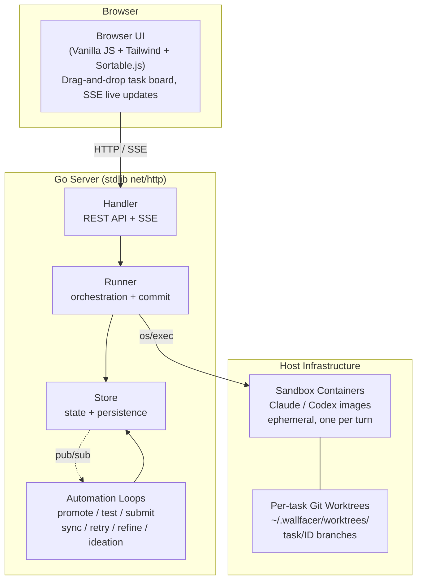
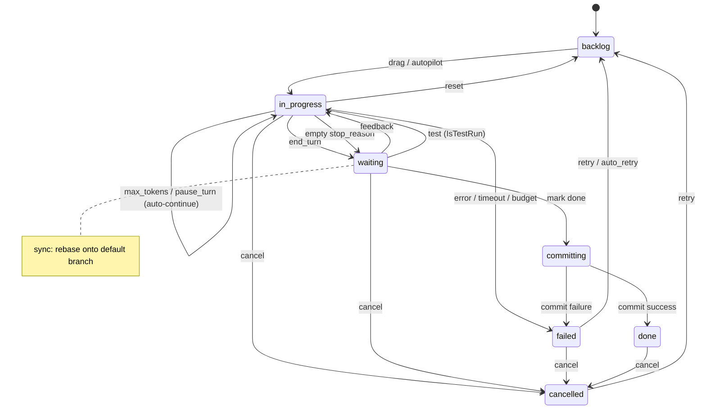
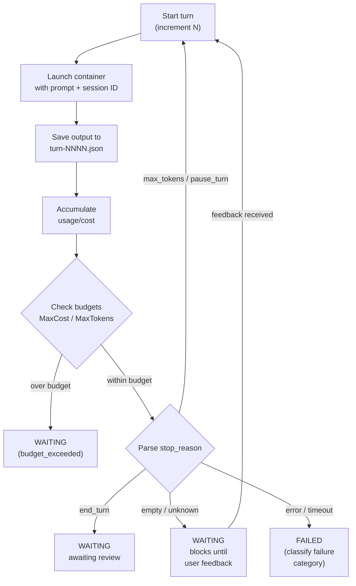
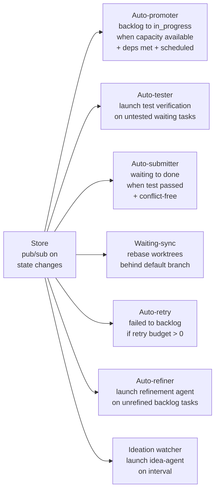
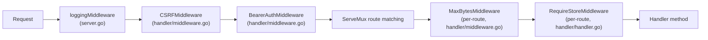
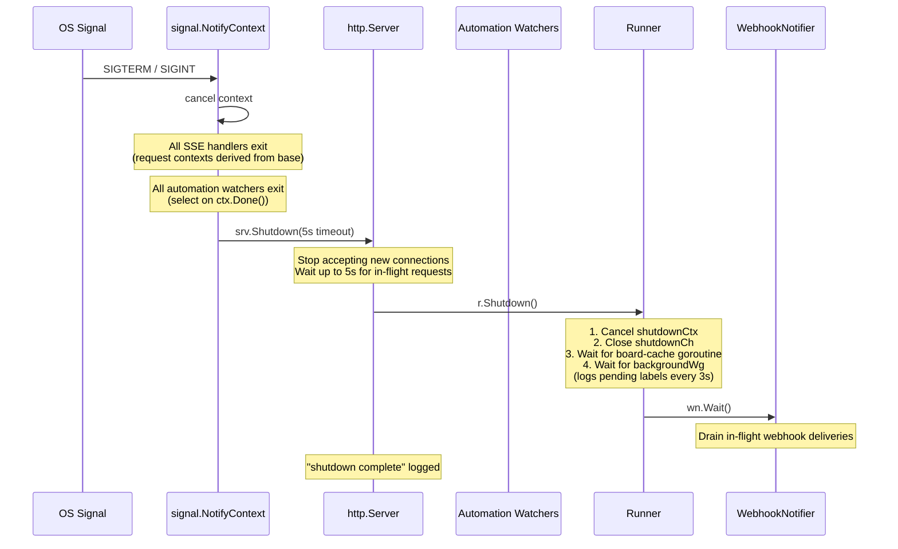

# Architecture

Wallfacer is a host-native Go service that coordinates autonomous coding agents running in ephemeral containers, with per-task git worktree isolation and a web task board for human oversight.

## System Overview



## Design Decisions

**Filesystem-first persistence.** No database. Each task is a directory (`data/<uuid>/`) containing `task.json`, traces, outputs, and oversight summaries. Writes are atomic (temp file + rename). Easy to inspect, back up, and debug.

**Container isolation.** Every agent turn runs in a fresh ephemeral container launched via `os/exec`. The container sees only its task's worktree mounted at `/workspace`. Tasks cannot interfere with each other or the host.

**Git worktree isolation.** Each task gets its own worktree on a `task/<id>` branch. Tasks work in parallel without merge conflicts during execution. Rebase/merge happens at commit time.

**Activity-routed sandboxes.** Different activities (implementation, testing, oversight, title, etc.) can route to different sandbox images and models, so cheap operations use smaller models.

**Automation with guardrails.** Background loops handle promotion, testing, submission, and retry — each with explicit controls (toggles, budgets, thresholds).

## Task State Machine



States: `backlog`, `in_progress`, `waiting`, `committing`, `done`, `failed`, `cancelled`.
`archived` is a boolean flag on done/cancelled tasks, not a separate state.

## Turn Loop



## Background Automation



## Component Responsibilities

**Store** (`internal/store/`) — In-memory task state guarded by `sync.RWMutex`, backed by per-task directory persistence. Enforces the state machine via a transition table. Provides pub/sub for live deltas and a full-text search index.

**Runner** (`internal/runner/`) — Orchestration engine. Creates worktrees, builds container specs, executes the turn loop, accumulates usage, enforces budgets, runs the commit pipeline, and generates titles/oversight in the background.

**Handler** (`internal/handler/`) — REST API and SSE endpoints organized by concern. Hosts automation toggle controls.

**Frontend** (`ui/`) — Vanilla JS modules. Task board, modals, timeline/flamegraph, diff viewer, usage dashboard. All live updates via SSE.

**Workspace Manager** (`internal/workspace/`) — Manages workspace configuration, workspace groups, and hot-swapping between workspace sets without server restart.

## 📦 Package Map

Every `internal/` package and its role in the system:

| Package | Purpose | Key exported types / functions |
|---|---|---|
| `apicontract` | Single source of truth for all HTTP API routes; generates `ui/js/generated/routes.js` | `Route`, `Routes` (slice), `Route.FullPattern()` |
| `envconfig` | `.env` file parsing and atomic update | `Config`, `Parse()`, `Update()` |
| `gitutil` | Git utility operations: worktrees, rebase, merge, status | `RebaseOntoDefault()`, `FFMerge()`, `CommitsBehind()`, `WorkspaceStatus()`, `WorkspaceGitStatus` |
| `handler` | HTTP API handlers organised by concern; automation watchers | `Handler`, `NewHandler()`, `CSRFMiddleware()`, `BearerAuthMiddleware()`, `MaxBytesMiddleware()` |
| `instructions` | Workspace-level `AGENTS.md` management (`~/.wallfacer/instructions/`) | `FilePath()` |
| `logger` | Structured logging via `log/slog` with per-component named loggers | `Init()`, `Fatal()`, `Main`, `Runner`, `Store`, `Git`, `Handler`, `Recovery`, `Prompts` |
| `metrics` | Lightweight Prometheus-compatible metrics registry (no external deps) | `Registry`, `Counter`, `Histogram`, `LabeledValue`, `NewRegistry()` |
| `runner` | Container orchestration, turn loop, commit pipeline, worktree management | `Runner`, `NewRunner()`, `RunnerConfig`, `ContainerInfo`, `CircuitBreaker`, `WebhookNotifier`, `Interface` |
| `sandbox` | Sandbox type enumeration (Claude vs Codex) | `Type`, `Claude`, `Codex`, `All()`, `Parse()`, `Default()` |
| `store` | Per-task directory persistence, data models, event sourcing, pub/sub | `Store`, `Task`, `TaskEvent`, `TaskUsage`, `SandboxActivity`, `SequencedDelta` |
| `workspace` | Workspace lifecycle manager; scoped data directories; hot-swap support | `Manager`, `Snapshot`, `NewManager()`, `NewStatic()` |
| `workspacegroups` | Persistent named workspace group configurations | `Group`, `Load()`, `Save()` |

## 🗂️ Handler Organisation

Each handler file in `internal/handler/` owns a specific concern area. The table below lists every non-test `.go` file:

| File | Concern | Key endpoints |
|---|---|---|
| `handler.go` | Core `Handler` struct, constructor, autopilot toggle state, JSON helpers, workspace snapshot subscription | — (shared infrastructure) |
| `middleware.go` | Request middleware: `CSRFMiddleware`, `BearerAuthMiddleware`, `MaxBytesMiddleware` | — (middleware, not endpoints) |
| `tasks.go` | Task CRUD, batch create, status transitions (cancel, resume, restore, archive, sync, test, done, feedback) | `POST /api/tasks`, `PATCH /api/tasks/{id}`, `POST /api/tasks/{id}/cancel`, etc. |
| `tasks_events.go` | Task event timeline, per-turn output serving, turn usage | `GET /api/tasks/{id}/events`, `GET /api/tasks/{id}/outputs/{filename}`, `GET /api/tasks/{id}/turn-usage` |
| `tasks_autopilot.go` | Automation watchers: auto-promoter, auto-retrier, auto-tester, auto-submitter, auto-refiner, waiting-sync | `StartAutoPromoter()`, `StartAutoRetrier()`, etc. |
| `stream.go` | SSE streaming for live task updates and container logs | `GET /api/tasks/stream`, `GET /api/tasks/{id}/logs` |
| `config.go` | Server configuration (autopilot flags, sandbox list, watcher health) | `GET /api/config`, `PUT /api/config` |
| `env.go` | Environment configuration (API tokens, model settings, sandbox routing) | `GET /api/env`, `PUT /api/env`, `POST /api/env/test`, `POST /api/env/test-webhook` |
| `workspace.go` | Workspace browsing and switching | `GET /api/workspaces/browse`, `PUT /api/workspaces` |
| `instructions.go` | Workspace `AGENTS.md` read/write/reinit | `GET /api/instructions`, `PUT /api/instructions`, `POST /api/instructions/reinit` |
| `prompts.go` | System prompt template listing, override, and deletion | `GET /api/system-prompts`, `PUT /api/system-prompts/{name}`, `DELETE /api/system-prompts/{name}` |
| `templates.go` | Reusable prompt templates | `GET /api/templates`, `POST /api/templates`, `DELETE /api/templates/{id}` |
| `git.go` | Git workspace operations (status, push, sync, rebase, branches, checkout) | `GET /api/git/status`, `POST /api/git/push`, `POST /api/git/sync`, etc. |
| `execute.go` | Task execution trigger (delegates to runner) | — (internal, called by task status transitions) |
| `refine.go` | Prompt refinement agent lifecycle | `POST /api/tasks/{id}/refine`, `DELETE /api/tasks/{id}/refine`, `POST /api/tasks/{id}/refine/apply` |
| `ideate.go` | Brainstorm/ideation agent lifecycle | `GET /api/ideate`, `POST /api/ideate`, `DELETE /api/ideate` |
| `oversight.go` | Task oversight summary retrieval | `GET /api/tasks/{id}/oversight`, `GET /api/tasks/{id}/oversight/test` |
| `usage.go` | Aggregated token and cost usage statistics | `GET /api/usage` |
| `stats.go` | Task status and workspace cost statistics | `GET /api/stats` |
| `spans.go` | Span timing statistics (per-task and aggregate) | `GET /api/debug/spans`, `GET /api/tasks/{id}/spans` |
| `containers.go` | Running container listing | `GET /api/containers` |
| `files.go` | File listing for `@` mention autocomplete | `GET /api/files` |
| `admin.go` | Administrative operations | `POST /api/admin/rebuild-index` |
| `debug.go` | Health check and board manifest | `GET /api/debug/health`, `GET /api/debug/board`, `GET /api/tasks/{id}/board` |
| `runtime.go` | Live server internals (goroutines, memory, task states, containers) | `GET /api/debug/runtime` |
| `sandbox_gate.go` | Sandbox usability checks (auth validation before task launch) | — (internal helpers) |
| `watcher.go` | Ideation watcher loop | `StartIdeationWatcher()` |
| `diffcache.go` | LRU diff cache for task diffs | — (internal) |
| `file_index.go` | Background file indexing for `@` mention | — (internal) |
| `event_helpers.go` | Shared helpers for inserting task events | — (internal) |

## 🔒 Concurrency Model

Wallfacer has several layers of concurrent access that must be coordinated carefully.

### Lock ordering

To prevent deadlocks, locks are always acquired in this order when multiple are needed:

1. **`Store.mu`** (`sync.RWMutex`) — Guards the in-memory task map (`tasks`), deleted tasks, events, status index, and search index. All task reads take a read lock; all mutations take a write lock. The `notify()` method that fans out pub/sub deltas is called while `mu` is write-locked so that the delta sequence is consistent with the task state.

2. **`Runner.worktreeMu`** (`sync.Mutex`) — Serialises all worktree filesystem operations (create, remove, prune, GC) under `~/.wallfacer/worktrees/`. Never held while `Store.mu` is held.

3. **`Runner.repoMu`** (`sync.Map` of per-repo `*sync.Mutex`) — One mutex per repository path, loaded-or-stored lazily via `sync.Map.LoadOrStore`. Serialises rebase and merge operations on a given repo so that concurrent tasks targeting the same repo do not corrupt git state. Independent repos can proceed in parallel.

4. **`Runner.oversightMu`** (`sync.Map` of per-task `*sync.Mutex`) — One mutex per task ID for serialising oversight generation so that concurrent oversight requests for the same task do not race.

5. **`Store.subMu`** / **`Store.wakeSubMu`** (`sync.Mutex`) — Guard the subscriber maps for SSE and wake-only channels. Held only briefly during subscribe/unsubscribe/fan-out.

6. **`Handler.*Mu`** (various `sync.RWMutex`) — Per-toggle mutexes (`autopilotMu`, `autotestMu`, `autosubmitMu`, etc.) for automation boolean flags. Each is independent and fine-grained.

### Background goroutine lifecycle via `trackedWg`

The `trackedWg` type (in `internal/runner/runner.go`) wraps `sync.WaitGroup` with a label registry. Every fire-and-forget background goroutine (task execution, oversight generation, title generation, worktree sync) calls `backgroundWg.Add(label)` before launch and `backgroundWg.Done(label)` on completion.

This enables:
- **Graceful shutdown**: `Runner.Shutdown()` calls `backgroundWg.Wait()` and logs pending labels every 3 seconds so operators know what is still running.
- **Test safety**: `Runner.WaitBackground()` lets tests drain all background work before cleanup.
- **Observability**: `Runner.PendingGoroutines()` returns a sorted slice of outstanding labels, exposed via `GET /api/debug/runtime` and the `wallfacer_background_goroutines` gauge.

### Channel-based pub/sub for store change notifications

The `Store` provides two subscription mechanisms:

1. **Delta subscribers** (`Store.Subscribe() → (int, <-chan SequencedDelta)`) — Buffered channels (capacity 64) that receive a `SequencedDelta` on every task mutation. Each delta carries a monotonic sequence number and a deep-cloned `Task` snapshot. Used by the SSE `StreamTasks` handler for live UI updates. A bounded replay buffer (`replayBufMax = 512`) allows reconnecting clients to catch up without a full snapshot.

2. **Wake subscribers** (`Store.SubscribeWake() → (int, <-chan struct{})`) — Capacity-1 channels that coalesce rapid bursts into a single wake signal. Used by automation watchers (auto-promoter, auto-tester, etc.) that only need to know "something changed" and then re-scan the task list themselves.

Both use non-blocking sends: if a subscriber's channel is full, the notification is dropped (the subscriber already has a pending signal to process).

### How deadlocks are prevented

- **Lock ordering is strict**: `Store.mu` is never acquired while holding `worktreeMu` or `repoMu`. Handler toggle mutexes are independent and never held across store calls.
- **Non-blocking pub/sub**: `notify()` uses `select/default` sends, so a slow subscriber cannot block the store mutex.
- **`sync.Map` for per-entity mutexes**: `repoMu` and `oversightMu` use `sync.Map` to avoid a global lock for lazy initialisation.
- **Context-based cancellation**: All automation watchers receive a `context.Context` from `signal.NotifyContext` and exit promptly on cancellation rather than blocking on channel reads.

## 📊 Metrics Reference

All metrics are served at `GET /metrics` in Prometheus text exposition format via `metrics.Registry.WritePrometheus()`.

### Counters

| Metric | Labels | Description |
|---|---|---|
| `wallfacer_http_requests_total` | `method`, `route`, `status` | Total HTTP requests. Route uses `r.Pattern` (Go 1.22+) to collapse parameterised paths. |
| `wallfacer_autopilot_actions_total` | `watcher`, `outcome` | Autonomous actions taken by autopilot watchers (e.g. promote, retry, test, submit, refine). |

### Histograms

| Metric | Labels | Buckets | Description |
|---|---|---|---|
| `wallfacer_http_request_duration_seconds` | `method`, `route` | 5ms, 10ms, 25ms, 50ms, 100ms, 250ms, 500ms, 1s, 2.5s, 5s, 10s | HTTP request latency distribution. |

### Gauges (scrape-time)

These are computed on each `/metrics` scrape via registered collector functions:

| Metric | Labels | Description |
|---|---|---|
| `wallfacer_tasks_total` | `status`, `archived` | Number of tasks grouped by status and archived flag. |
| `wallfacer_running_containers` | — | Number of sandbox containers currently tracked by the container runtime. |
| `wallfacer_background_goroutines` | — | Number of outstanding background goroutines tracked by the runner's `trackedWg`. |
| `wallfacer_store_subscribers` | — | Number of active SSE subscribers listening for task state changes. |
| `wallfacer_failed_tasks_by_category` | `category` | Number of currently-failed (non-archived) tasks grouped by failure category. |
| `wallfacer_circuit_breaker_open` | — | 1 when the container launch circuit breaker is open (runtime unavailable), 0 when closed. |

## 🔧 Request Middleware Chain

The HTTP server wraps the `ServeMux` in a layered middleware chain. Each request passes through these layers in order:



The chain is assembled in `server.go` line 320:
```go
srv := &http.Server{
    Handler: loggingMiddleware(
        CSRFMiddleware(actualHostPort)(
            BearerAuthMiddleware(envCfg.ServerAPIKey)(mux)
        ), reg),
}
```

### What each middleware does

| Layer | Location | Behaviour |
|---|---|---|
| **Logging** | `server.go` `loggingMiddleware()` | Wraps the response writer to capture status codes. Logs every API request with method, path, status, and duration. Records `wallfacer_http_requests_total` counter and `wallfacer_http_request_duration_seconds` histogram. Uses `r.Pattern` for route labels. |
| **CSRF** | `handler/middleware.go` `CSRFMiddleware()` | For mutating methods (POST, PUT, PATCH, DELETE), validates that the `Origin` or `Referer` header matches the server's host:port. GET/HEAD/OPTIONS pass through. Requests with no Origin/Referer also pass (for CLI/API clients). |
| **Auth** | `handler/middleware.go` `BearerAuthMiddleware()` | When `WALLFACER_SERVER_API_KEY` is configured, requires `Authorization: Bearer <key>` on all requests except: the root page (`GET /`), and SSE paths (`/api/tasks/stream`, `/api/git/stream`, `*/logs`) which accept `?token=<key>` as a query parameter instead. No-op when no API key is configured. |
| **Body limits** | `handler/middleware.go` `MaxBytesMiddleware()` | Applied per-route via `bodyLimits` map in `BuildMux`. Default: 1 MiB. Instructions: 5 MiB. Feedback: 512 KiB. Wraps `r.Body` with `http.MaxBytesReader` to reject oversized payloads. |
| **Store guard** | `handler/handler.go` `RequireStoreMiddleware()` | Applied per-route via `requiresStore()` check. Returns 503 when no workspace/store is configured. Exempted routes: `GetConfig`, `UpdateConfig`, `BrowseWorkspaces`, `UpdateWorkspaces`, `GetEnvConfig`, `UpdateEnvConfig`, `TestSandbox`, `TestWebhook`, `GitStatus`, `GitStatusStream`. |

## 📦 Sandbox Type System

### Claude vs Codex sandbox types

The `internal/sandbox` package defines two sandbox types as `Type` constants:

- **`Claude`** (`"claude"`) — Runs Claude Code in a container built from the `wallfacer` image. Authenticates via `CLAUDE_CODE_OAUTH_TOKEN` or `ANTHROPIC_API_KEY`.
- **`Codex`** (`"codex"`) — Runs OpenAI Codex CLI in a container built from the `wallfacer-codex` image. Authenticates via `OPENAI_API_KEY` or host `~/.codex/auth.json`.

`sandbox.Default(value)` returns the parsed type or falls back to `Claude` for unknown values.

### Activity routing

Each task can override its sandbox type per-activity via `Task.SandboxByActivity` (a `map[SandboxActivity]sandbox.Type`). The resolution chain in `Runner.sandboxForTaskActivity()` is:

1. **Per-task per-activity override** — `task.SandboxByActivity[activity]` if set and valid.
2. **Per-task default** — `task.Sandbox` if set and valid.
3. **Global per-activity env config** — `WALLFACER_SANDBOX_<ACTIVITY>` environment variable (e.g. `WALLFACER_SANDBOX_TESTING=codex`).
4. **Global default** — `WALLFACER_DEFAULT_SANDBOX` environment variable.
5. **Hardcoded fallback** — `Claude`.

The seven routable activities (defined as `SandboxActivity` constants in `internal/store/models.go`):

| Activity | Env variable | Purpose |
|---|---|---|
| `implementation` | `WALLFACER_SANDBOX_IMPLEMENTATION` | Main task execution |
| `testing` | `WALLFACER_SANDBOX_TESTING` | Test verification agent |
| `refinement` | `WALLFACER_SANDBOX_REFINEMENT` | Prompt refinement agent |
| `title` | `WALLFACER_SANDBOX_TITLE` | Auto title generation |
| `oversight` | `WALLFACER_SANDBOX_OVERSIGHT` | Oversight summary generation |
| `commit_message` | `WALLFACER_SANDBOX_COMMIT_MESSAGE` | Commit message generation |
| `idea_agent` | `WALLFACER_SANDBOX_IDEA_AGENT` | Brainstorm/ideation agent |

Two additional activities (`test`, `oversight-test`) are usage-attribution-only and not used for sandbox routing.

### Container image selection

`Runner.sandboxImageForSandbox()` selects the container image:

- For **Claude**: uses the configured `--image` flag value (default: `ghcr.io/changkun/wallfacer:latest`).
- For **Codex**: derives the image by replacing `wallfacer` with `wallfacer-codex` in the image name, preserving the registry prefix and tag/digest. Falls back to `wallfacer-codex:latest` if the base image is empty.

### Model selection

`Runner.modelFromEnvForSandbox()` reads the model from the env file:

- Claude: `CLAUDE_DEFAULT_MODEL` (title generation uses `CLAUDE_TITLE_MODEL` with fallback to the default).
- Codex: `CODEX_DEFAULT_MODEL` (title generation uses `CODEX_TITLE_MODEL` with fallback to the default).

### Sandbox gate

Before launching any task, `Handler.sandboxUsable()` validates that the selected sandbox has valid credentials. For Codex, this checks (in order): host `~/.codex/auth.json`, then `OPENAI_API_KEY` in the env file, and requires a successful sandbox test (`POST /api/env/test`). Tasks are rejected with an error if credentials are missing.

## 🛑 Graceful Shutdown

The server handles `SIGTERM` and `SIGINT` via `signal.NotifyContext`, which creates a cancellable context shared by all background goroutines and the HTTP server's `BaseContext`.



### Shutdown sequence in detail

1. **Signal received** — `signal.NotifyContext` cancels the base context. All SSE handlers and automation watchers detect `ctx.Done()` and exit their loops.

2. **HTTP server shutdown** — `srv.Shutdown()` is called with a 5-second timeout. This stops accepting new connections and waits for in-flight requests to complete. SSE handlers exit promptly because their request contexts (derived from `BaseContext`) are already cancelled.

3. **Runner shutdown** — `r.Shutdown()` performs:
   - Cancels `shutdownCtx` via `shutdownCancel()`.
   - Closes `shutdownCh` to signal the board-cache-invalidator goroutine to exit.
   - Waits for the board subscription goroutine via `boardSubscriptionWg.Wait()`.
   - Waits for all tracked background goroutines via `backgroundWg.Wait()`, logging pending labels every 3 seconds so operators can see what is still running.

4. **Webhook drain** — If a `WebhookNotifier` is active, `wn.Wait()` blocks until all in-flight deliveries complete.

5. **In-progress tasks survive** — Running task containers are intentionally left alive. They continue to completion independently and will be recovered on the next server start via `RecoverOrphanedTasks`.

## 📝 Structured Logging

The `internal/logger` package provides named loggers built on `log/slog`:

| Logger | Component tag | Used by |
|---|---|---|
| `logger.Main` | `main` | CLI startup, server lifecycle, shutdown |
| `logger.Runner` | `runner` | Container orchestration, turn loop, commit pipeline |
| `logger.Store` | `store` | Task persistence, state transitions |
| `logger.Git` | `git` | Worktree and git operations |
| `logger.Handler` | `handler` | HTTP request handling, automation watchers |
| `logger.Recovery` | `recovery` | Orphaned task recovery on startup |
| `logger.Prompts` | `prompts` | System prompt template management |

`logger.Init(format)` configures all loggers. Two formats are supported:
- **`"text"`** (default) — Human-friendly output with ANSI colors (when stdout is a terminal), aligned columns: timestamp, 3-char level badge, 8-char component, source file:line, bold message, dim key=value pairs. Respects `NO_COLOR` and `TERM=dumb`.
- **`"json"`** — Structured JSON via `slog.NewJSONHandler`, suitable for log aggregation.

`logger.Fatal(msg, args...)` prints a user-friendly error to stderr and exits with code 1 (used for startup errors, not for runtime failures).

## Cross-Cutting Concerns

**Concurrency** — `Store.mu` for task map integrity; `Runner.worktreeMu` for filesystem ops; per-repo mutex for rebase serialization; per-task mutex for oversight generation.

**Recovery** — On startup, `RecoverOrphanedTasks` inspects `in_progress` and `committing` tasks against actual container and worktree state, recovering or failing them as appropriate.

**Security** — API key auth, SSRF-hardened gateway URLs, path traversal guards, CSRF protection, request body size limits.

**Circuit breakers** — Per-watcher exponential backoff suppresses individual automation loops on failure; container-level circuit breaker blocks launches when the runtime is unavailable. See [Circuit Breakers](../guide/circuit-breakers.md).

**Observability** — SSE event streams, append-only trace timeline per task, span timing, Prometheus-compatible metrics, webhook notifications.
