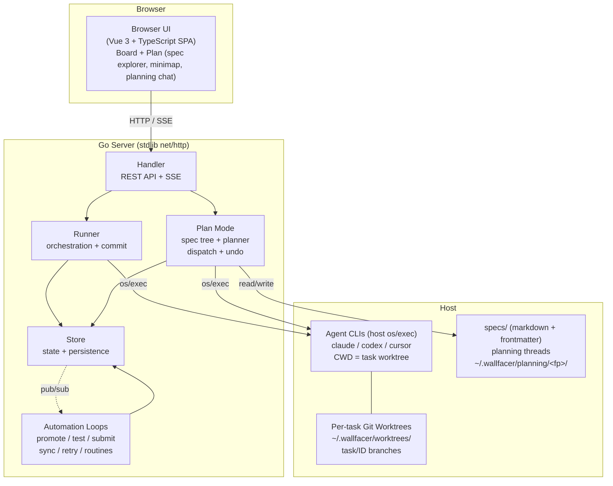
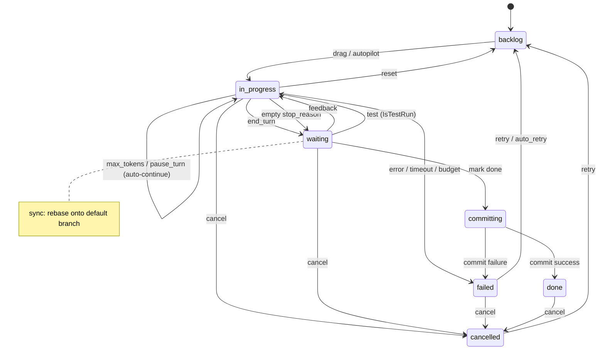
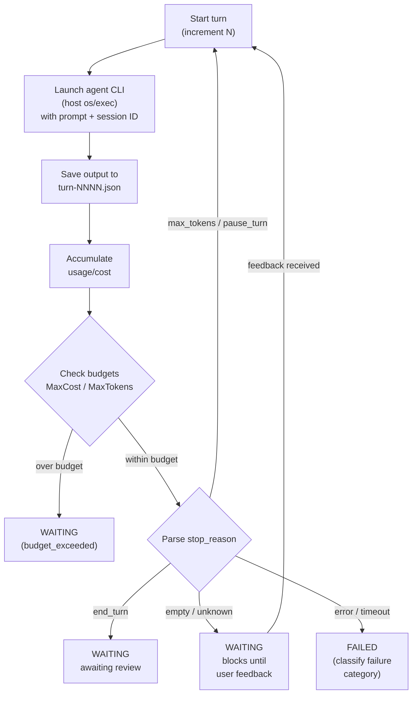
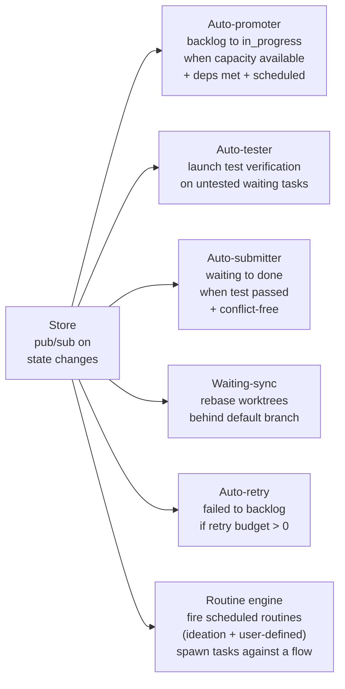
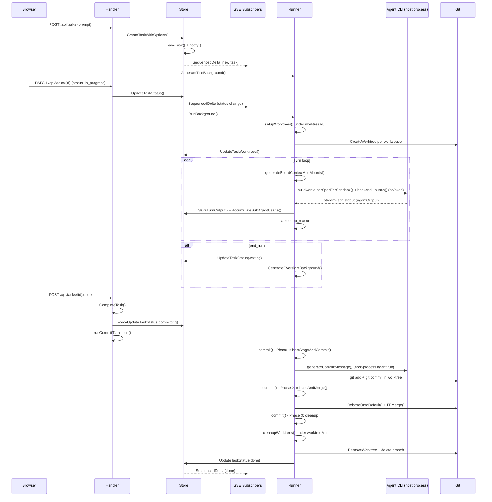
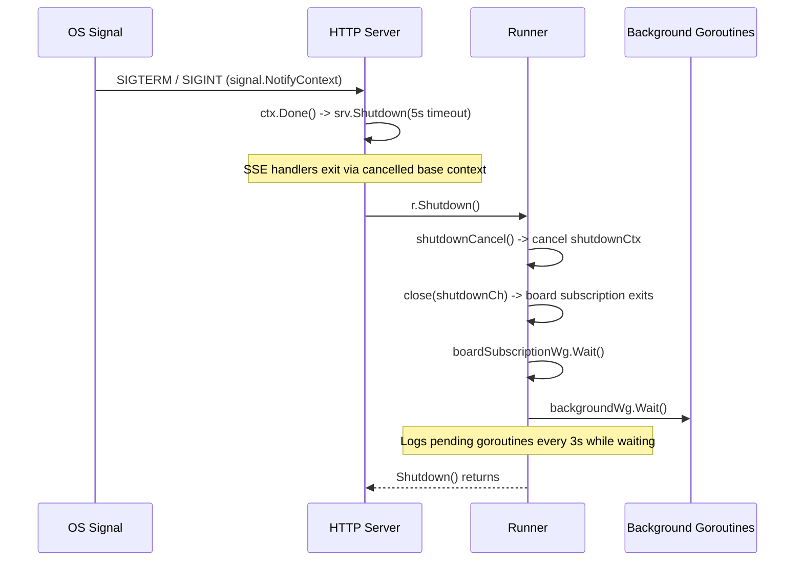

# Architecture

Wallfacer is a host-native Go service that coordinates autonomous coding agents, with per-task git worktree isolation and a web task board for human oversight.

## Host-Process Execution (the core decision)

Each agent turn runs as a host `os/exec` of the selected CLI (`claude`, `codex`, or `cursor`) with the task's git worktree as the working directory. Isolation comes from the worktree, not a container: there is no daemon, no image pull, and no `/workspace` bind-mount in the shipping runtime.

The runner unconditionally selects `executor.HostBackend` (the only `executor.Backend` implementation) and sets `hostMode = true` (`internal/runner/runner.go:491-498`). The backend execs the CLI directly (`internal/executor/host.go`). Cancellation is `SIGTERM` then `SIGKILL` on the host process (`internal/executor/host.go`), not a runtime kill command.

Several Go symbols keep the word "Container" as deliberate legacy vocabulary: `ContainerSpec`, `ContainerInfo`, `ContainerLister`, `buildContainerSpecForSandbox`. These name code, not behaviour. The behaviour is a host process.

## System Overview

## Design Decisions

**Filesystem-first persistence.** No database by default. Each task is a directory (`data/<key>/<uuid>/`) containing `task.json`, traces, outputs, and oversight blobs. Writes are atomic (temp file + rename). Easy to inspect, back up, and debug. Persistence goes through the `StorageBackend` seam (see below), so the filesystem layout is one implementation, not a hard dependency.

**Worktree isolation, not container isolation.** Every agent turn is a host process whose CWD is the task's git worktree. Tasks isolate from each other through separate worktrees and `task/<id>` branches, not through a sandboxed runtime. Tasks work in parallel without merge conflicts during execution; rebase and merge happen at commit time.

**Activity-routed harness + model.** Different activities (implementation, testing, oversight, title, commit-msg, ideate) can route to different harnesses (`claude`, `codex`, `cursor`) and models, so cheap operations use smaller models. Routing selects a CLI and model, not an image.

**Automation with guardrails.** Background loops handle promotion, testing, submission, sync, and retry, each with explicit controls (toggles, budgets, thresholds). Scheduled work (including ideation) runs through the routine engine.

### Recent migrations

The codebase moved off three older designs. The docs and symbols below reflect the current state:

- `sandbox.Type` -> `harness.ID`. The `internal/sandbox` package is deleted; harness identities now live in `internal/harness` (`claude`, `codex`, `cursor`).
- Container -> host process. Execution is a host `os/exec`; the `Container*` Go names are kept as legacy vocabulary.
- Refine retired. There is no `refine` agent or `refine-only` flow. Prompt refinement is the Plan task-mode chat (`POST /api/planning/tool/update_task_prompt`).

## Task State Machine

States: `backlog`, `in_progress`, `waiting`, `committing`, `done`, `failed`, `cancelled`.
`archived` is a boolean flag on done/cancelled tasks, not a separate state.

## Turn Loop

## Background Automation

Six long-lived watchers run, each as a single goroutine started in `RunServer` (`internal/cli/server.go:252-259`). Ideation is not a watcher; it is a routine fired by the routine engine.

The six entry points are `StartAutoPromoter`, `StartAutoRetrier`, `StartRoutineEngine`, `StartWaitingSyncWatcher`, `StartAutoTester`, `StartAutoSubmitter`. There is no auto-refiner and no standalone ideation watcher.

### Agents, flows, and the dispatch layer

At task execution time the runner consults two registries before it execs any CLI:

- `internal/agents/` holds the **Role** descriptors. Six built-ins ship (`title`, `oversight`, `commit-msg`, `ideate`, `impl`, `test`; `internal/agents/builtins.go`), plus any user-authored clones loaded from `~/.wallfacer/agents/`. A role pins a harness (`claude`, `codex`, or `cursor`), declares capabilities, and optionally carries a system-prompt preamble.
- `internal/flow/` holds **Flow** definitions: ordered step chains that reference roles by slug. Three built-ins ship (`implement`, `brainstorm`, `test-only`; `internal/flow/builtins.go`); user flows live under `~/.wallfacer/flows/`. The `implement` flow runs `impl -> test -> parallel(commit-msg, title, oversight)`.

Both directories are fsnotify-watched; edits reload the merged registry without restarting the server.

Task execution picks one of three dispatch paths:

- `flow == "implement"` -> the turn-loop path in `execute.go` (impl -> test -> commit pipeline with full session-recovery semantics).
- `flow == "brainstorm"` (or legacy `Kind = idea-agent`) -> `runIdeationTask`, which parses ideate output and creates backlog tasks.
- any other flow slug -> the flow engine in `internal/flow/engine.go`. It walks steps linearly, fans parallel-sibling groups through an `errgroup`, and launches each role via `Runner.RunAgent`.

See [Agents & Flows](../guide/agents-and-flows.md) for the full user-facing model.

## Component Responsibilities

**Store** (`internal/store/`), In-memory task state guarded by `sync.RWMutex`, persisted through the `StorageBackend` seam. Enforces the state machine via a transition table. Provides pub/sub for live deltas and a full-text search index.

**Runner** (`internal/runner/`), Orchestration engine. Creates worktrees, builds launch specs, execs the agent CLI as a host process, runs the turn loop, accumulates usage, enforces budgets, runs the commit pipeline, and generates titles/oversight in the background.

**Handler** (`internal/handler/`), REST API and SSE endpoints organized by concern. Hosts automation toggle controls and the background watchers.

**Executor** (`internal/executor/`), The `Backend` seam (`Launch`/cancellation) plus `HostBackend`, the single shipping implementation that execs the CLI as a host process and relays its stream-json stdout.

**Harness** (`internal/harness/`), Harness identities and stream parsers (`claude`, `codex`, `cursor`). `harness.Default()` returns Claude. The `cursor` harness adapts the `cursor-agent` CLI and emits Claude-style stream-json.

**Webserver** (`internal/webserver/`), Serves the embedded SPA from `internal/webserver/spa` (`MountSPA`); falls through to `index.html` for client-side routes.

**Frontend** (`frontend/`), Vue 3 + TypeScript SPA (Vite, Vue Router, Pinia). Task board, modals, timeline/flamegraph, diff viewer, usage dashboard. All live updates via SSE.

**Workspace Manager** (`internal/workspace/`), Manages workspace configuration, workspace groups, and hot-swapping between workspace sets without server restart.

### Two storage seams

- `store.StorageBackend` (`internal/store/backend.go`) abstracts the three persistence concerns: tasks (structured, indexed), events (ordered, append-heavy), and blobs (named bytes per task). Domain concepts map onto these primitives; for example `SaveOversight` becomes `SaveBlob(id, "oversight", data)`. Oversight persists as a single blob (`oversight.json`, and `oversight-test.json` for the test phase) via `SaveBlob`, not a per-id file under `oversights/`.
- `executor.Backend` (`internal/executor/`) abstracts agent launch. `HostBackend` is the only implementation.

### Cloud-mode middleware

Cloud Identity is wired in `RunServer` (`internal/cli/server.go:394-401`). The request handler chain wraps the mux outside-in, so requests flow CSRF -> CookieAuth -> OptionalAuth -> BearerAuth -> (ForceLogin in cloud mode) -> mux:

- `handler.CSRFMiddleware(hostPort)`, unconditional CSRF protection (no skip flag).
- `auth.CookieAuth(authClient, next)`, two args; resolves an `Identity` from the session cookie. There is no separate jwt validator argument and no CSRF skip.
- `auth.OptionalAuth(jwtValidator, next)`, populates the principal from a bearer JWT when present, without forcing auth.
- `handler.BearerAuthMiddleware(serverAPIKey)`, static-key check that is bypassed once an identity is already populated, so a cookie-only browser request succeeds.
- `Handler.ForceLogin(mux)`, applied only when `cloudMode` is true; a local `wallfacer run` stays reachable anonymously.
- `auth.RequireSuperadmin(next)`, a per-route admin gate (`server.go:921`), not part of the global chain.

Tasks carry `CreatedBy` and `OrgID` (`internal/store/models.go`); `TasksForPrincipal` (`internal/store/principal.go`) tenant-filters listings. The principal route is `GET /api/me`; `PATCH /api/auth/me` switches org.

## End-to-End Walkthrough: Task Creation to Merge

This section traces a single task through every component from browser click to merged commit. The sequence diagram shows the full flow; the prose below explains each step.

### 1. Task creation

The browser sends `POST /api/tasks` with a prompt and optional goal. `Handler.CreateTask` (`internal/handler/tasks.go`) decodes the request, validates harness availability, and calls `Store.CreateTaskWithOptions` (`internal/store/tasks_create_delete.go`). The store assigns a UUID, writes `task.json` atomically (temp file + rename), adds the task to the in-memory map, and calls `notify()` which fans the new `SequencedDelta` to all SSE subscribers. Back in the handler, `Runner.GenerateTitleBackground` (`internal/runner/runner.go`) fires a background goroutine tracked by `backgroundWg` that runs a lightweight host-process agent to generate a short title from the prompt.

### 2. Move to in_progress

The browser sends `PATCH /api/tasks/{id}` with `{status: "in_progress"}`. `Handler.UpdateTask` (`internal/handler/tasks.go`) checks concurrency limits via `checkConcurrencyAndUpdateStatus`, transitions the store status, inserts a `state_change` event, and calls `Runner.RunBackground` (`internal/runner/runner.go`). `RunBackground` registers the goroutine label with `backgroundWg.Add` and launches `Runner.Run` in a new goroutine. Inside `Run` (`internal/runner/execute.go`), the first thing is worktree setup: `setupWorktrees` (`internal/runner/worktree.go`) acquires `worktreeMu`, creates one git worktree per workspace via `gitutil.CreateWorktree`, and returns the worktree-path map and branch name (e.g. `task/abcd1234`). The runner persists these paths via `Store.UpdateTaskWorktrees`.

### 3. Turn loop

The turn loop in `Run` increments the turn counter, refreshes the board context via `generateBoardContextAndMounts` (`internal/runner/board.go`), and calls `runContainer` (`internal/runner/container.go`). That function builds the launch spec via `buildContainerSpecForSandbox`, resolves the harness and model per activity, checks the circuit breaker, and invokes `backend.Launch`, which execs the agent CLI directly via `os/exec` with the worktree as CWD. The stream-json stdout is parsed into an `agentOutput` struct. The runner saves raw output via `Store.SaveTurnOutput`, accumulates token usage via `Store.AccumulateSubAgentUsage` and `Store.AppendTurnUsage`, then inspects `output.StopReason` to decide the next step.

### 4. Waiting state

When `stop_reason` is `"end_turn"`, the runner transitions the task to `waiting` via `Store.UpdateTaskStatus`, inserts a `state_change` event, and opens a `feedback_waiting` span. `GenerateOversightBackground` fires an asynchronous oversight summary generation (a host-process agent run). The `notify()` call inside the status update fans a delta to SSE subscribers and wakes automation watchers (auto-tester, auto-submitter) via the `SubscribeWake` channels. If `stop_reason` is `"max_tokens"` or `"pause_turn"`, the loop auto-continues by setting `prompt = ""` and resuming the same session.

### 5. Mark done and commit pipeline

The user clicks "Mark as Done", sending `POST /api/tasks/{id}/done`. `Handler.CompleteTask` (`internal/handler/execute.go`) verifies the task is in `waiting`, restores any missing worktrees, transitions to `committing` via `Store.ForceUpdateTaskStatus`, and calls `runCommitTransition` which launches `Runner.Commit` (`internal/runner/commit.go`) in a background goroutine. The commit pipeline has three phases. **Phase 1** (`hostStageAndCommit`) stages and commits host-side: it runs `git add` and `git commit` in each worktree on the host, using a commit message produced by `generateCommitMessage`, which is itself a host-process agent run (the `commit-msg` role). **Phase 2** (`rebaseAndMerge`) acquires the per-repo mutex via `repoLock()`, calls `gitutil.RebaseOntoDefault` with up to 3 conflict-resolution retries (each retry runs a host-process conflict-resolver agent), then `gitutil.FFMerge` to fast-forward the default branch. **Phase 3** persists commit hashes, cleans up worktrees via `cleanupWorktrees` (under `worktreeMu`), and optionally auto-pushes.

### 6. Done

After the commit pipeline succeeds, `runCommitTransition` transitions the task to `done` via `Store.ForceUpdateTaskStatus`. The store persists the status, notifies SSE subscribers, and wakes watchers. The worktree directories and task branch have already been removed in Phase 3. A `TaskSummary` is written for the cost dashboard.

## Concurrency Model

### Mutex domains

| Mutex | Location | Protects | Lock pattern | Typical hold |
|---|---|---|---|---|
| `Store.mu` | `internal/store/store.go` | In-memory task map, status index, search index, event maps | Write lock for all mutations (`mutateTask`, `CreateTaskWithOptions`, status updates); read lock for queries (`ListTasks`, `GetTask`) | Microseconds (in-memory map ops + atomic file write) |
| `Runner.worktreeMu` | `internal/runner/runner.go` | All worktree filesystem operations on `worktreesDir` | Exclusive lock in `setupWorktrees`, `ensureTaskWorktrees`, `cleanupWorktrees`, `CleanupWorktrees`, `PruneUnknownWorktrees` | Milliseconds to seconds (git worktree create/remove) |
| `Runner.repoMu` (per-repo) | `internal/runner/runner.go` | Rebase + merge serialization per repository | Exclusive lock via `repoLock(repoPath)` in `rebaseAndMerge`; tasks on different repos run concurrently | Seconds (rebase + merge + optional conflict resolution) |
| `Runner.oversightMu` (per-task) | `internal/runner/runner.go` | Serializes oversight generation per task | Exclusive lock via `oversightLock(taskID)` in `GenerateOversight` | Seconds (host-process agent run) |
| `Store.subMu` | `internal/store/subscribe.go` | SSE subscriber map | Exclusive lock during `Subscribe`, `Unsubscribe`, and the fan-out in `notify()` | Microseconds |
| `Store.wakeSubMu` | `internal/store/subscribe.go` | Wake-only subscriber map | Exclusive lock during `SubscribeWake`, `UnsubscribeWake`, and the fan-out in `notify()` | Microseconds |
| `Store.replayMu` | `internal/store/subscribe.go` | Replay buffer (ring of recent deltas) | Write lock in `notify()`; read lock in `DeltasSince()` | Microseconds |
| `Runner.boardCache.mu` | `internal/runner/runner.go` | Board context JSON cache and mount cache | Exclusive lock for cache read/write in `generateBoardContextAndMounts` | Microseconds |
| `Runner.storeMu` | `internal/runner/runner.go` | Runner's pointer to the active `*store.Store` (swapped on workspace switch) | Write lock in `applyWorkspaceSnapshot`; read lock in `currentStore` | Microseconds |

### Goroutine model

There is no worker pool. Each task execution gets its own goroutine via `Runner.RunBackground`, which calls `backgroundWg.Add(label)` before launching `go r.Run(...)` and `backgroundWg.Done(label)` in a deferred cleanup. The same `backgroundWg` (`trackedWg`) tracks all fire-and-forget background work: title generation (`GenerateTitleBackground`), oversight generation (`GenerateOversightBackground`), and worktree sync (`SyncWorktreesBackground`). Each goroutine registers with a human-readable label (e.g. `"run:abcd1234"`, `"title:abcd1234"`). `Runner.PendingGoroutines()` returns the sorted list of outstanding labels for diagnostics.

The six automation watchers (`StartAutoPromoter`, `StartAutoRetrier`, `StartRoutineEngine`, `StartWaitingSyncWatcher`, `StartAutoTester`, `StartAutoSubmitter`) each run as a single long-lived goroutine started in `RunServer` (`internal/cli/server.go`). They block on `SubscribeWake` channels and wake when any task mutates, then inspect the current task list to decide whether to act.

### Pub/sub channels

The store provides two subscriber tiers:

- **Full-delta channels** (`Subscribe`): returns `(int, <-chan SequencedDelta)`. Channels are buffered at 256 (`pubsub.DefaultChannelSize`). Each mutation calls `notify()` which stamps a monotonic `deltaSeq`, appends to a bounded replay buffer (512 entries), and fans out a deep-copied `SequencedDelta` to every subscriber. If a subscriber's buffer is full, the delta is silently dropped. SSE reconnection uses `DeltasSince(seq)` to replay missed deltas from the buffer before falling back to a full snapshot.

- **Wake-only channels** (`SubscribeWake`): returns `(int, <-chan struct{})`. Channels are buffered at 1. The capacity-1 design coalesces rapid bursts: once a signal is pending, further sends are no-ops. Automation watchers use this tier to avoid allocating full `SequencedDelta` copies when they only need a "something changed" signal.

Both fan-outs happen inside `notify()` (`internal/store/subscribe.go`), which is always called while `Store.mu` is held, ensuring the delta sequence is consistent with the in-memory state.

### Shutdown coordination

The shutdown sequence is driven by `signal.NotifyContext(ctx, SIGTERM, Interrupt)` in `RunServer` (`internal/cli/server.go`). When a signal arrives, `ctx.Done()` fires. The HTTP server gets `srv.Shutdown(5s)` to drain in-flight requests; SSE handlers exit immediately because their request contexts derive from the now-cancelled base context. Then `Runner.Shutdown()` (`internal/runner/runner.go`) is called: it invokes `shutdownCancel()` to cancel `shutdownCtx` (which propagates to any agent launches or store operations using it), closes `shutdownCh` to stop the board-cache subscription goroutine, waits on `boardSubscriptionWg`, then waits on `backgroundWg` with a 3-second ticker that logs still-pending goroutine labels. In-progress agent processes are intentionally left running; they continue independently and are recovered by `RecoverOrphanedTasks` (`internal/runner/recovery.go`) on the next startup.

## Where to Look

Quick-reference for common maintenance tasks. Each entry names the starting file and the typical next steps.

| If you need to... | Start here |
|---|---|
| Add a new API endpoint | `internal/apicontract/routes.go` -> `internal/handler/<concern>.go` -> run `make api-contract` |
| Add a field to Task | `internal/store/models.go` -> `internal/store/migrate.go` |
| Change the turn loop | `internal/runner/execute.go` (`Run()`) |
| Change the commit pipeline | `internal/runner/commit.go` (`commit()`, `hostStageAndCommit()`, `rebaseAndMerge()`) + `internal/gitutil/ops.go` |
| Add a new automation watcher | `internal/handler/tasks_autopilot.go` (follow `SubscribeWake` pattern) |
| Change the agent launch spec | `internal/runner/container.go` (`buildContainerSpecForSandbox()`) + `internal/executor/host.go` |
| Add or change a harness | `internal/harness/` (`claude.go`, `codex.go`, `cursor.go`, `registry.go`) |
| Add a new env config variable | `internal/envconfig/envconfig.go` |
| Change workspace switching | `internal/workspace/manager.go` (`Switch()`) |
| Debug a failing rebase | `internal/gitutil/ops.go` + `internal/gitutil/stash.go` |
| Understand why a task failed | `data/<key>/<uuid>/traces/` + `outputs/turn-NNNN.json` |
| Add a new system prompt | `internal/prompts/` dir + `internal/prompts/prompts.go` |
| Change the UI | `frontend/src/` (Vue components, composables, Pinia stores) |
| Debug startup recovery | `internal/runner/recovery.go` (`RecoverOrphanedTasks()`) |
| Change pub/sub behaviour | `internal/store/subscribe.go` (`notify()`, `Subscribe()`, `SubscribeWake()`) |
| Change cloud auth wiring | `internal/cli/server.go` (middleware chain) + `internal/auth/` |

## Package Map

Every `internal/` package and its role in the system:

| Package | Purpose | Key exported types / functions |
|---|---|---|
| `agents` | Merged built-in + user-authored agent registry backed by YAML under `~/.wallfacer/agents/`; fsnotify reload | `Registry`, `Role`, `BuiltinAgents`, `NewRegistry()`, `Load()` |
| `apicontract` | Single source of truth for all HTTP API routes; generates `docs/internals/api-contract.json` | `Route`, `Routes` (slice), `Route.FullPattern()` |
| `auth` | JWT + cookie principal resolution, optional auth, and superadmin gating for cloud mode | `OptionalAuth()`, `CookieAuth()`, `RequireSuperadmin()`, `Validator`, `Identity`, `PrincipalFromContext()` |
| `cli` | CLI subcommand implementations (run, exec, status, doctor, spec) and shared helpers | `RunServer()`, `RunExec()`, `RunStatus()`, `RunDoctor()`, `RunSpec()`, `BuildMux()`, `ConfigDir()` |
| `envconfig` | `.env` file parsing and atomic update | `Config`, `Parse()`, `Update()` |
| `eval` | Offline evaluation trajectories for planning/agent regression checks | `Trajectory`, `Run()` |
| `executor` | Agent-launch seam plus the single host-process implementation | `Backend`, `HostBackend`, `NewHostBackend()`, `ContainerSpec`, `Request` |
| `flow` | Merged built-in + user-authored flow registry; composes agents into ordered step chains | `Registry`, `Flow`, `Step`, `NewBuiltinRegistry()` |
| `gitutil` | Git utility operations: worktrees, rebase, merge, status | `RebaseOntoDefault()`, `FFMerge()`, `CommitsBehind()`, `WorkspaceStatus()`, `WorkspaceGitStatus` |
| `handler` | HTTP API handlers organised by concern; automation watchers | `Handler`, `NewHandler()`, `CSRFMiddleware()`, `BearerAuthMiddleware()`, `MaxBytesMiddleware()`, `ForceLogin()` |
| `harness` | Harness identities and stream parsers (`claude`, `codex`, `cursor`); replaces the deleted `sandbox` package | `ID`, `Claude`, `Codex`, `Cursor`, `Harness`, `Register()`, `Lookup()`, `Default()` |
| `logger` | Structured logging via `log/slog` with per-component named loggers | `Init()`, `Fatal()`, `Main`, `Runner`, `Store`, `Git`, `Handler`, `Recovery`, `Prompts` |
| `metrics` | Lightweight Prometheus-compatible metrics registry (no external deps) | `Registry`, `Counter`, `Histogram`, `LabeledValue`, `NewRegistry()` |
| `runner` | Orchestration, turn loop, commit pipeline, worktree management (execs agents as host processes) | `Runner`, `NewRunner()`, `RunnerConfig`, `ContainerInfo`, `CircuitBreaker`, `Interface` |
| `store` | Per-task persistence (via `StorageBackend`), data models, event sourcing, pub/sub | `Store`, `Task`, `TaskEvent`, `TaskUsage`, `SandboxActivity`, `SequencedDelta`, `StorageBackend` |
| `webserver` | Serves the embedded SPA frontend from `internal/webserver/spa` | `MountSPA()` |
| `workspace` | Workspace lifecycle manager; scoped data directories; hot-swap support; persistent workspace group configurations | `Manager`, `Snapshot`, `Group`, `NewManager()`, `NewStatic()`, `LoadGroups()`, `SaveGroups()` |
| `constants` | Consolidated system parameters: timeouts, intervals, retry counts, size limits | Named constants grouped by concern |
| `oauth` | OAuth 2.0 PKCE flow engine, ephemeral callback server, provider configs (Claude, Codex) | `Flow`, `StartFlow()`, `Provider`, `ClaudeProvider`, `CodexProvider` |
| `planner` | Long-lived workspace-scoped planning lifecycle; per-thread `messages.jsonl` + `session.json` under `~/.wallfacer/planning/<fp>/`; slash-command template expansion; single-turn-at-a-time coordination | `Planner`, `ThreadManager`, `ConversationStore`, `CommandRegistry`, `ThreadMeta`, `Slugify`, `Expand` |
| `routine` | Routine scheduler engine that fires routine-kind tasks (ideation, user-defined) on their configured cadence | `Engine`, `Start()`, `Trigger()` |
| `spec` | Spec document model: YAML frontmatter parse/write round-trip; six-state lifecycle state machine; recursive tree builder; per-spec + cross-spec validation; atomic scaffold (`O_CREATE\|O_EXCL`); progress aggregation; impact analysis; roadmap README index resolution | `Spec`, `Status`, `Effort`, `StatusMachine`, `Tree`, `BuildTree()`, `ParseFile()`, `Scaffold()`, `ValidateSpec()`, `UpdateFrontmatter()`, `ResolveIndex()` |

Top-level packages:

| Package | Purpose | Key exported types / functions |
|---|---|---|
| `prompts` | System prompt templates (title, commit, oversight, test, ideation, conflict, instructions) and workspace-level AGENTS.md management (`~/.wallfacer/instructions/`) | `Manager`, `NewManager()`, `InstructionsKey()`, `EnsureInstructions()`, `BuildInstructionsContent()`, `InstructionsData` |

Shared utility packages under `internal/pkg/`:

| Package | Purpose | Key exported types / functions |
|---|---|---|
| `pkg/atomicfile` | Atomic file writes (temp + rename) | `Write()` |
| `pkg/cache` | TTL cache with expiration | `TTLCache[K,V]` |
| `pkg/circuitbreaker` | Circuit breakers (lock-free and backoff variants) | `Breaker`, `BackoffBreaker` |
| `pkg/cmdexec` | `os/exec` wrapper for agent commands | `Runner`, `Run()` |
| `pkg/dagscorer` | DAG-based task dependency scoring | `Score()` |
| `pkg/dircp` | Directory tree copy with filters | `Copy()` |
| `pkg/envutil` | Environment variable parsing with defaults and validation | `String()`, `Int()`, `Bool()`, `Duration()` |
| `pkg/httpjson` | JSON request/response helpers for HTTP handlers | `Decode()`, `Respond()`, `Error()` |
| `pkg/keyedmu` | Per-key mutex map for fine-grained locking | `Map[K]` |
| `pkg/lazyval` | Lazily-computed cached value with invalidation | `Value[T]`, `New()` |
| `pkg/logpipe` | Streaming log pipe for agent output | `Pipe` |
| `pkg/ndjson` | Newline-delimited JSON reader | `Reader` |
| `pkg/pagination` | Cursor-based pagination helpers | `Paginate()` |
| `pkg/pty` | PTY relay for the WebSocket terminal integration | `PTY`, `Start()` |
| `pkg/pubsub` | Generic fan-out notification hub with replay | `Hub[T]` |
| `pkg/sanitize` | Input sanitization helpers | `String()` |
| `pkg/set` | Generic set type | `Set[T]` |
| `pkg/sortedkeys` | Sorted map key iteration | `Of()` |
| `pkg/syncmap` | Type-safe generic wrapper around `sync.Map` | `Map[K,V]` |
| `pkg/systray` | Optional system-tray integration for the desktop build | `Start()` |
| `pkg/tail` | Tail-follow for log files | `Follow()` |
| `pkg/trackedwg` | `sync.WaitGroup` with pending-task labels | `WaitGroup` |
| `pkg/uuidutil` | UUID parsing/generation helpers | `New()`, `Parse()` |
| `pkg/watcher` | Event-loop background watcher | `Start()` |
| `pkg/dag` | Generic DAG operations (ReverseEdges, DetectCycles, Reachable) | `ReverseEdges()`, `DetectCycles()`, `Reachable()` |
| `pkg/livelog` | Concurrency-safe append-only byte buffer with multiple readers for live streaming | `Buffer`, `NewBuffer()`, `Reader` |
| `pkg/statemachine` | Generic state machine with transition validation | `Machine[S]`, `New()`, `Transition()` |
| `pkg/tree` | Generic tree data structure with `iter.Seq` walk | `Node[T]`, `Walk()` |

## Handler Organisation

Each handler file in `internal/handler/` owns a specific concern area. The table below lists representative non-test `.go` files.

| File | Concern | Key endpoints |
|---|---|---|
| `handler.go` | Core `Handler` struct, constructor, autopilot toggle state, JSON helpers, workspace snapshot subscription |, (shared infrastructure) |
| `middleware.go` | Request middleware: `CSRFMiddleware`, `BearerAuthMiddleware`, `MaxBytesMiddleware` |, (middleware, not endpoints) |
| `principal.go` | Request principal plumbing used by auth/cloud middleware |, (internal) |
| `force_login.go` | Force-login gate applied in cloud mode (`Handler.ForceLogin`) |, (internal) |
| `agents.go` | User-authored agent catalog CRUD backed by `~/.wallfacer/agents/` | `GET/POST /api/agents`, `PUT/DELETE /api/agents/{slug}` |
| `flows.go` | User-authored flow catalog CRUD backed by `~/.wallfacer/flows/` | `GET/POST /api/flows`, `PUT/DELETE /api/flows/{slug}` |
| `routines.go` | Routine card CRUD (list, create, update schedule, trigger) | `GET/POST /api/routines`, `PATCH /api/routines/{id}/schedule`, `POST /api/routines/{id}/trigger` |
| `routines_engine.go` | Scheduler loop that fires routine tasks (ideation + user-defined) on their cadence | `StartRoutineEngine()` (internal loop) |
| `orgs.go` | Organization listing and switching for cloud-mode principals | `GET /api/me`, `GET /api/auth/orgs`, `PATCH /api/auth/me` |
| `login.go` | Cloud sign-in flow handler | `POST /api/auth/login`, `POST /api/auth/logout` |
| `tasks.go` | Task CRUD, batch create, status transitions. Cancel/archive/unarchive/restore fold into `PATCH /api/tasks/{id}`; resume/sync/test/done stay dedicated side-effect endpoints | `POST /api/tasks`, `PATCH /api/tasks/{id}`, `POST /api/tasks/{id}/resume`, etc. |
| `tasks_events.go` | Task event timeline, per-turn output serving, turn usage | `GET /api/tasks/{id}/events`, `GET /api/tasks/{id}/outputs/{filename}`, `GET /api/tasks/{id}/turn-usage` |
| `tasks_autopilot.go` | Automation watchers: auto-promoter, auto-retrier, auto-tester, auto-submitter, waiting-sync | `StartAutoPromoter()`, `StartAutoRetrier()`, etc. |
| `stream.go` | SSE streaming for live task updates and agent logs | `GET /api/tasks/stream`, `GET /api/tasks/{id}/logs` |
| `config.go` | Server configuration (autopilot flags, harness list, watcher health) | `GET /api/config`, `PUT /api/config` |
| `env.go` | Environment configuration (API tokens, model settings, harness routing) | `GET /api/env`, `PUT /api/env`, `POST /api/env/test` |
| `git.go` | Git workspace operations (status, push, sync, rebase, branches, checkout) | `GET /api/git/status`, `POST /api/git/push`, `POST /api/git/sync`, etc. |
| `execute.go` | Task execution trigger (delegates to runner) |, (internal, called by task status transitions) |
| `ideate.go` | Brainstorm/ideation agent lifecycle | `GET /api/ideate`, `POST /api/ideate`, `DELETE /api/ideate` |
| `oversight.go` | Task oversight summary retrieval | `GET /api/tasks/{id}/oversight` (impl + test phases via `?phase=`) |
| `spans.go` | Span timing statistics (per-task and aggregate) | `GET /api/debug/spans`, `GET /api/tasks/{id}/spans` |
| `debug.go` | Health check and board manifest | `GET /api/debug/health`, `GET /api/debug/board`, `GET /api/tasks/{id}/board` |
| `sandbox_gate.go` | Harness usability checks (auth validation before task launch) |, (internal helpers) |
| `watcher.go` | Shared two-phase watcher helper used by the autopilot loops in `tasks_autopilot.go` | `TwoPhaseWatcherConfig`, `runTwoPhase()` |
| `planning.go` | Planning chat agent: messages, streaming, interrupt, commands | `GET/POST/DELETE /api/planning/messages`, `GET /api/planning/messages/stream`, `POST /api/planning/messages/interrupt`, `GET /api/planning/commands` |
| `planning_tool.go` | Plan task-mode tools, including prompt refinement | `POST /api/planning/tool/update_task_prompt` |
| `planning_threads.go` | Planning chat thread CRUD (list, create, rename, archive, unarchive, activate) | `GET/POST /api/planning/threads`, `PATCH /api/planning/threads/{id}` |
| `planning_undo.go` | Undo the caller thread's most recent planning round via `git revert`; cancels board tasks whose `dispatched_task_id` was added in the reverted commit | `POST /api/planning/undo` |
| `specs.go` | Spec tree with metadata, progress, and archive/unarchive transitions | `GET /api/specs/tree`, `GET /api/specs/stream`, `POST /api/specs/transition` |
| `specs_dispatch.go` | Atomic dispatch/undispatch pipeline that creates board tasks from validated leaf specs and writes `dispatched_task_id` back into the spec frontmatter | `POST /api/specs/transition` (`action: dispatch\|undispatch`) |
| `terminal.go` | WebSocket terminal relay for the host shell | `GET /api/terminal/ws` |

There is no `refine.go` (prompt refinement is the planning tool above) and no `containers.go` / `GET /api/containers` endpoint.

## Structured Logging

The `internal/logger` package provides named loggers built on `log/slog`:

| Logger | Component tag | Used by |
|---|---|---|
| `logger.Main` | `main` | CLI startup, server lifecycle, shutdown |
| `logger.Runner` | `runner` | Orchestration, turn loop, commit pipeline |
| `logger.Store` | `store` | Task persistence, state transitions |
| `logger.Git` | `git` | Worktree and git operations |
| `logger.Handler` | `handler` | HTTP request handling, automation watchers |
| `logger.Recovery` | `recovery` | Orphaned task recovery on startup |
| `logger.Prompts` | `prompts` | System prompt template management |

`logger.Init(format)` configures all loggers. Two formats are supported:
- **`"text"`** (default), Human-friendly output with ANSI colors (when stdout is a terminal), aligned columns: timestamp, 3-char level badge, 8-char component, source file:line, bold message, dim key=value pairs. Respects `NO_COLOR` and `TERM=dumb`.
- **`"json"`**, Structured JSON via `slog.NewJSONHandler`, suitable for log aggregation.

`logger.Fatal(msg, args...)` prints a user-friendly error to stderr and exits with code 1 (used for startup errors, not for runtime failures).

## Cross-Cutting Concerns

**Concurrency**, `Store.mu` for task map integrity; `Runner.worktreeMu` for filesystem ops; per-repo mutex for rebase serialization; per-task mutex for oversight generation. See [Data & Storage](data-and-storage.md) for the concurrency model.

**Recovery**, On startup, `RecoverOrphanedTasks` inspects `in_progress` and `committing` tasks against actual process and worktree state, recovering or failing them as appropriate.

**Security**, API key + cookie/JWT auth, SSRF-hardened gateway URLs, path traversal guards, CSRF protection, request body size limits, superadmin gating for admin routes.

**Circuit breakers**, Per-watcher exponential backoff suppresses individual automation loops on failure; an agent-launch circuit breaker blocks launches when a CLI is unavailable. See [Circuit Breakers](../guide/circuit-breakers.md).

**Observability**, SSE event streams, append-only trace timeline per task, span timing, Prometheus-compatible metrics. See [API & Transport](api-and-transport.md) for the metrics reference.

**Middleware**, See [API & Transport](api-and-transport.md) for the middleware chain.

**Harness routing**, See [Workspaces & Configuration](workspaces-and-config.md) for per-activity harness and model routing.

**Graceful shutdown**, See [API & Transport](api-and-transport.md) for the shutdown sequence.

## See Also

- [Development Setup](development.md), building from source, tests, make targets, releases
- [Data & Storage](data-and-storage.md), persistence, models, migrations, search index
- [Task Lifecycle](task-lifecycle.md), states, turn loop, dependencies, board context
- [Git Operations](git-worktrees.md), worktrees, commit pipeline, branch management
- [Workspaces & Configuration](workspaces-and-config.md), workspace manager, AGENTS.md, harnesses, templates
- [API & Transport](api-and-transport.md), HTTP routes, SSE, metrics, middleware
- [Automation](automation.md), watchers, auto-retry, circuit breakers