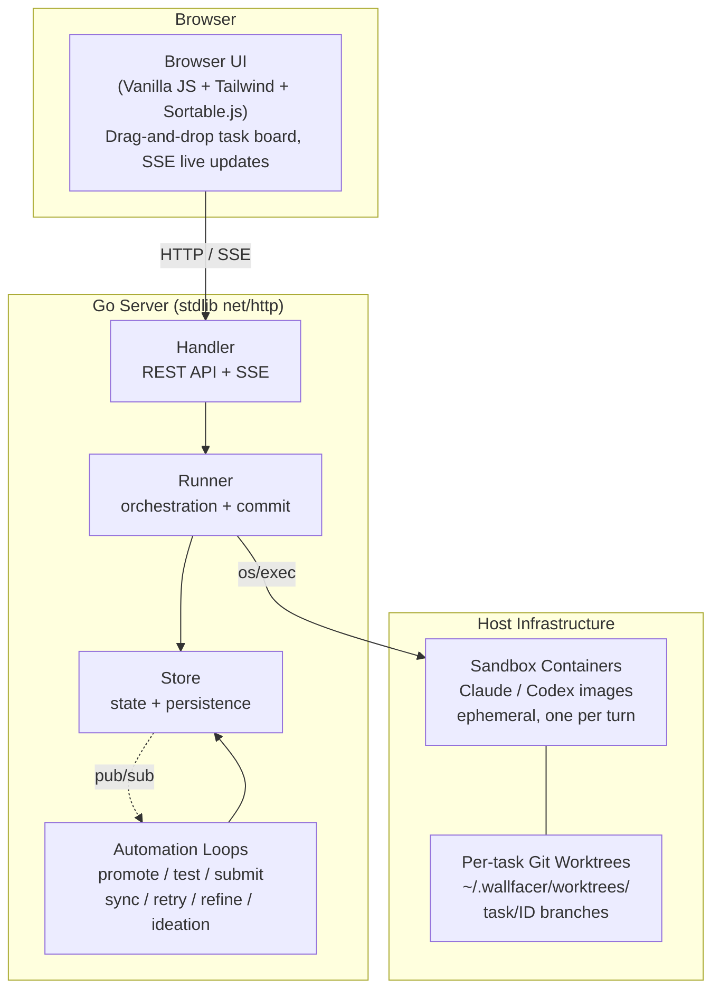
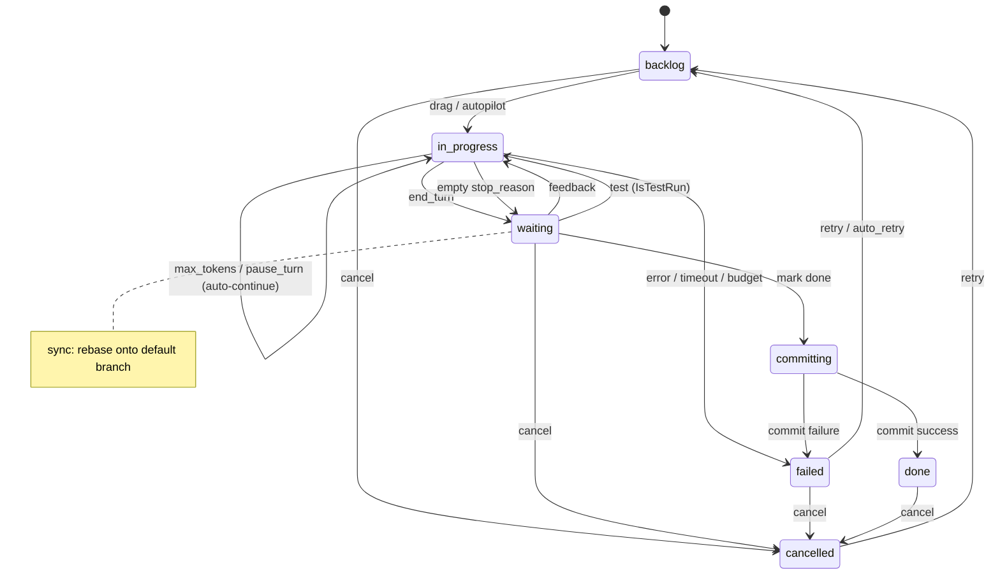
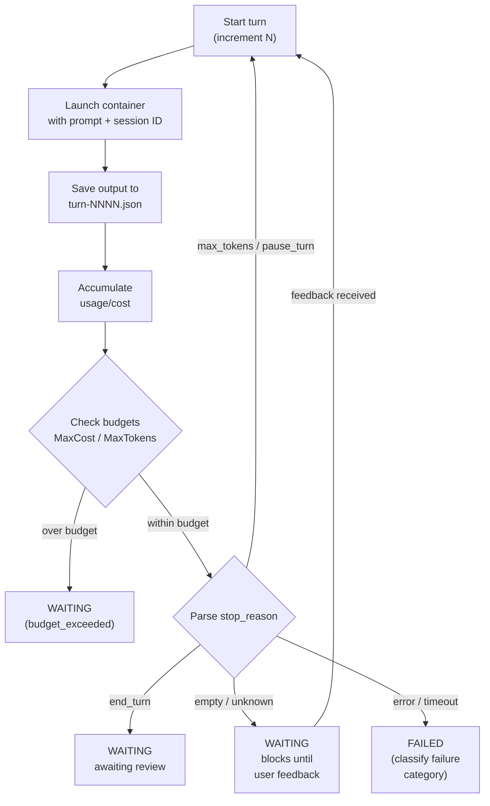
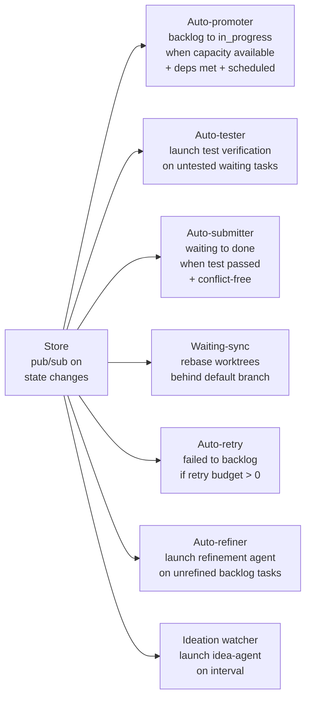

# Architecture

Wallfacer is a host-native Go service that coordinates autonomous coding agents running in ephemeral containers, with per-task git worktree isolation and a web task board for human oversight.

## System Overview

## Design Decisions

**Filesystem-first persistence.** No database. Each task is a directory (`data/<uuid>/`) containing `task.json`, traces, outputs, and oversight summaries. Writes are atomic (temp file + rename). Easy to inspect, back up, and debug.

**Container isolation.** Every agent turn runs in a fresh ephemeral container launched via `os/exec`. The container sees only its task's worktree mounted at `/workspace`. Tasks cannot interfere with each other or the host.

**Git worktree isolation.** Each task gets its own worktree on a `task/<id>` branch. Tasks work in parallel without merge conflicts during execution. Rebase/merge happens at commit time.

**Activity-routed sandboxes.** Different activities (implementation, testing, oversight, title, etc.) can route to different sandbox images and models, so cheap operations use smaller models.

**Automation with guardrails.** Background loops handle promotion, testing, submission, and retry — each with explicit controls (toggles, budgets, thresholds).

## Task State Machine

States: `backlog`, `in_progress`, `waiting`, `committing`, `done`, `failed`, `cancelled`.
`archived` is a boolean flag on done/cancelled tasks, not a separate state.

## Turn Loop

## Background Automation

## Component Responsibilities

**Store** (`internal/store/`) — In-memory task state guarded by `sync.RWMutex`, backed by per-task directory persistence. Enforces the state machine via a transition table. Provides pub/sub for live deltas and a full-text search index.

**Runner** (`internal/runner/`) — Orchestration engine. Creates worktrees, builds container specs, executes the turn loop, accumulates usage, enforces budgets, runs the commit pipeline, and generates titles/oversight in the background.

**Handler** (`internal/handler/`) — REST API and SSE endpoints organized by concern. Hosts automation toggle controls.

**Frontend** (`ui/`) — Vanilla JS modules. Task board, modals, timeline/flamegraph, diff viewer, usage dashboard. All live updates via SSE.

**Workspace Manager** (`internal/workspace/`) — Manages workspace configuration, workspace groups, and hot-swapping between workspace sets without server restart.

## Cross-Cutting Concerns

**Concurrency** — `Store.mu` for task map integrity; `Runner.worktreeMu` for filesystem ops; per-repo mutex for rebase serialization; per-task mutex for oversight generation.

**Recovery** — On startup, `RecoverOrphanedTasks` inspects `in_progress` and `committing` tasks against actual container and worktree state, recovering or failing them as appropriate.

**Security** — API key auth, SSRF-hardened gateway URLs, path traversal guards, CSRF protection, request body size limits.

**Circuit breakers** — Per-watcher exponential backoff suppresses individual automation loops on failure; container-level circuit breaker blocks launches when the runtime is unavailable. See [Circuit Breakers](../guide/circuit-breakers.md).

**Observability** — SSE event streams, append-only trace timeline per task, span timing, Prometheus-compatible metrics, webhook notifications.
