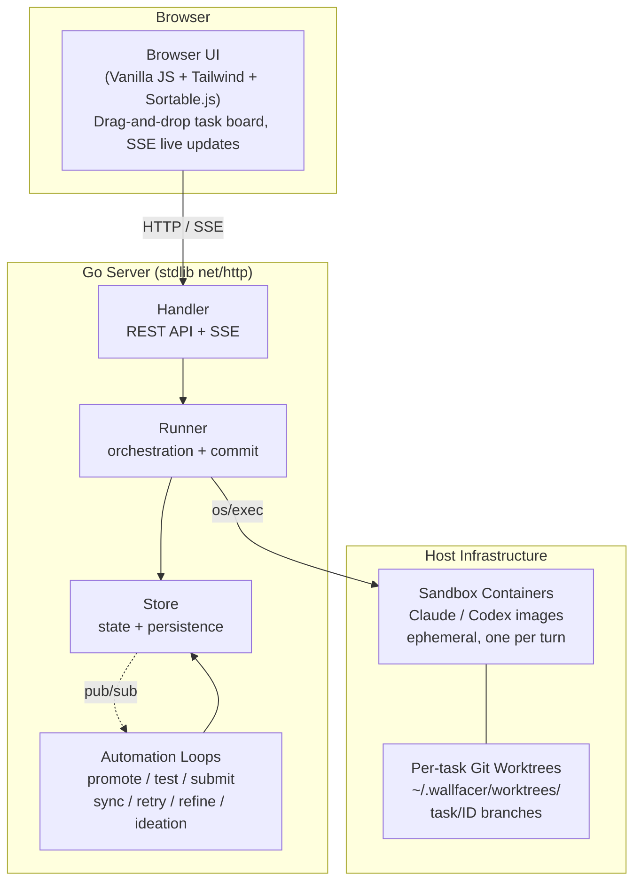
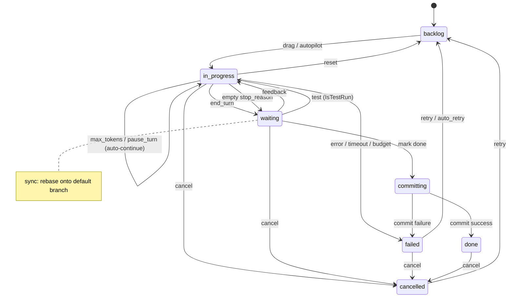
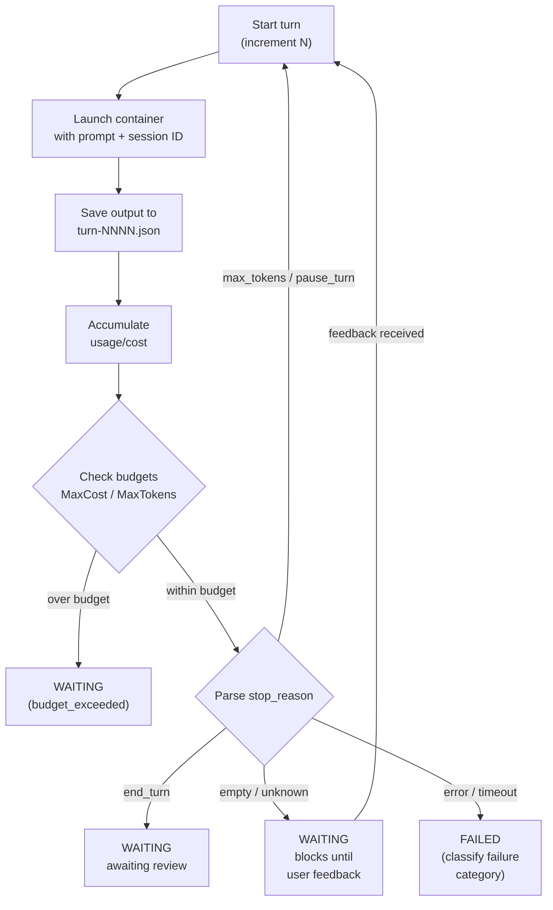
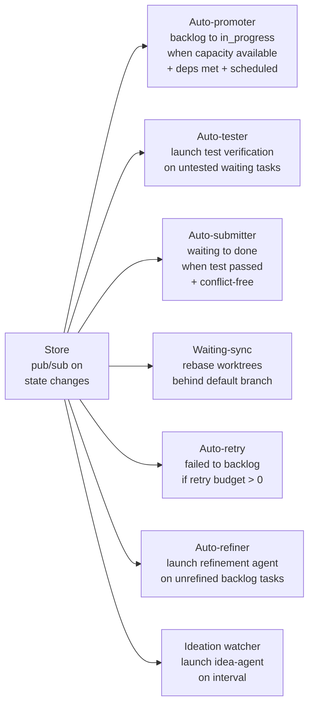
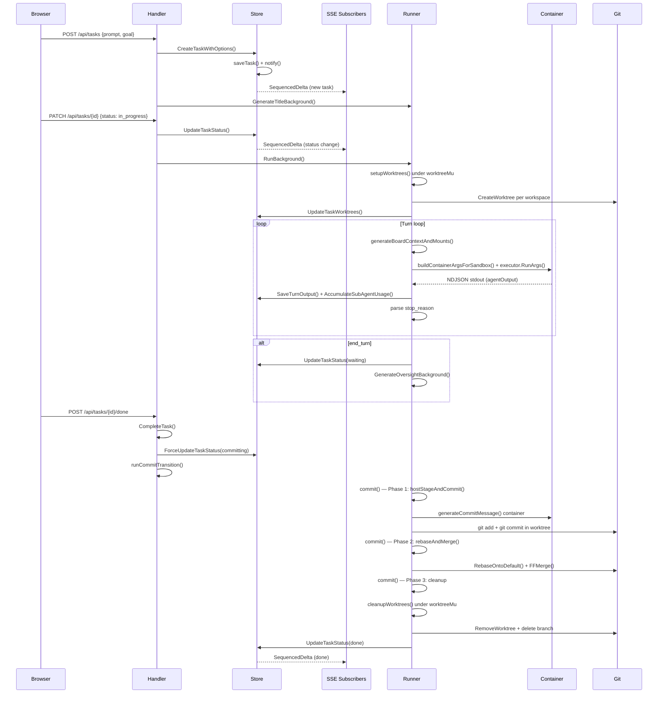
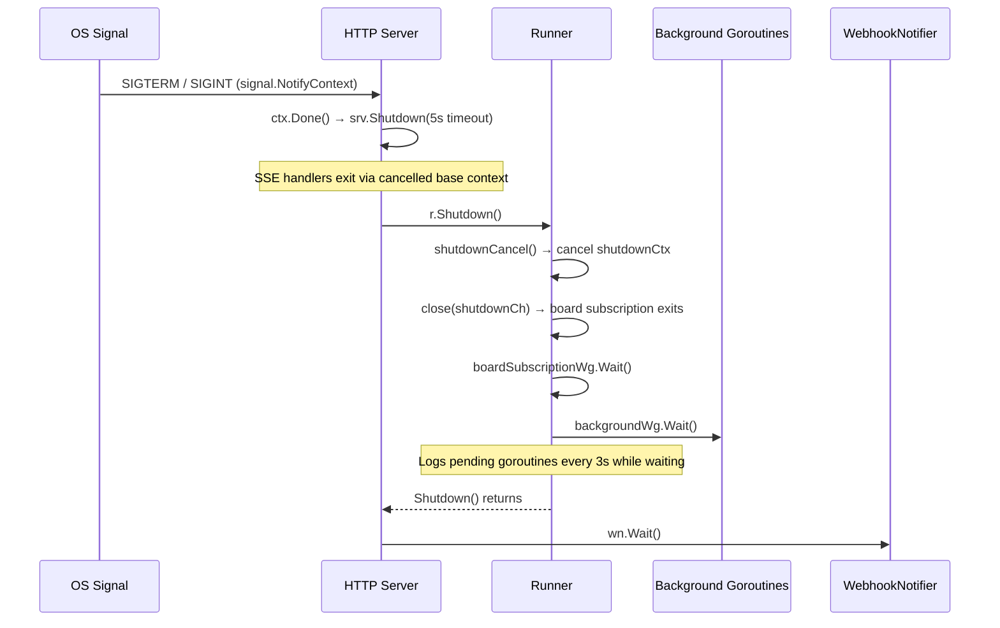

# Architecture

Wallfacer is a host-native Go service that coordinates autonomous coding agents running in ephemeral containers, with per-task git worktree isolation and a web task board for human oversight.

## System Overview



## Design Decisions

**Filesystem-first persistence.** No database. Each task is a directory (`data/<uuid>/`) containing `task.json`, traces, outputs, and oversight summaries. Writes are atomic (temp file + rename). Easy to inspect, back up, and debug.

**Container isolation.** Every agent turn runs in a fresh ephemeral container launched via `os/exec`. The container sees only its task's worktree mounted at `/workspace`. Tasks cannot interfere with each other or the host.

**Git worktree isolation.** Each task gets its own worktree on a `task/<id>` branch. Tasks work in parallel without merge conflicts during execution. Rebase/merge happens at commit time.

**Activity-routed sandboxes.** Different activities (implementation, testing, oversight, title, etc.) can route to different sandbox images and models, so cheap operations use smaller models.

**Automation with guardrails.** Background loops handle promotion, testing, submission, and retry — each with explicit controls (toggles, budgets, thresholds).

## Task State Machine



States: `backlog`, `in_progress`, `waiting`, `committing`, `done`, `failed`, `cancelled`.
`archived` is a boolean flag on done/cancelled tasks, not a separate state.

## Turn Loop



## Background Automation



## Component Responsibilities

**Store** (`internal/store/`) — In-memory task state guarded by `sync.RWMutex`, backed by per-task directory persistence. Enforces the state machine via a transition table. Provides pub/sub for live deltas and a full-text search index.

**Runner** (`internal/runner/`) — Orchestration engine. Creates worktrees, builds container specs, executes the turn loop, accumulates usage, enforces budgets, runs the commit pipeline, and generates titles/oversight in the background.

**Handler** (`internal/handler/`) — REST API and SSE endpoints organized by concern. Hosts automation toggle controls.

**Frontend** (`ui/`) — Vanilla JS modules. Task board, modals, timeline/flamegraph, diff viewer, usage dashboard. All live updates via SSE.

**Workspace Manager** (`internal/workspace/`) — Manages workspace configuration, workspace groups, and hot-swapping between workspace sets without server restart.

## End-to-End Walkthrough: Task Creation to Merge

This section traces a single task through every component from browser click to merged commit. The sequence diagram shows the full flow; the prose below explains each step.



### 1. Task creation

The browser sends `POST /api/tasks` with a prompt and optional goal. `Handler.CreateTask` (`internal/handler/tasks.go`) decodes the request, validates sandbox availability, and calls `Store.CreateTaskWithOptions` (`internal/store/tasks_create_delete.go`). The store assigns a UUID, writes `task.json` atomically (temp file + rename), adds the task to the in-memory map, and calls `notify()` which fans the new `SequencedDelta` to all SSE subscribers. Back in the handler, `Runner.GenerateTitleBackground` (`internal/runner/runner.go`) fires a background goroutine tracked by `backgroundWg` that runs a lightweight container to generate a short title from the prompt.

### 2. Move to in_progress

The browser sends `PATCH /api/tasks/{id}` with `{status: "in_progress"}`. `Handler.UpdateTask` (`internal/handler/tasks.go`) checks concurrency limits via `checkConcurrencyAndUpdateStatus`, transitions the store status, inserts a `state_change` event, and calls `Runner.RunBackground` (`internal/runner/runner.go`). `RunBackground` registers the goroutine label with `backgroundWg.Add` and launches `Runner.Run` in a new goroutine. Inside `Run` (`internal/runner/execute.go`), the first thing is worktree setup: `setupWorktrees` (`internal/runner/worktree.go`) acquires `worktreeMu`, creates one git worktree per workspace via `gitutil.CreateWorktree`, and returns the worktree-path map and branch name (e.g. `task/abcd1234`). The runner persists these paths via `Store.UpdateTaskWorktrees`.

### 3. Turn loop

The turn loop in `Run` increments the turn counter, refreshes the board context via `generateBoardContextAndMounts` (`internal/runner/board.go`), and calls `runContainer` (`internal/runner/container.go`). That function builds the container spec via `buildContainerArgsForSandbox`, resolves the sandbox type per activity, checks the circuit breaker, and invokes `executor.RunArgs` which runs `podman/docker run` via `os/exec`. The NDJSON stdout is parsed into an `agentOutput` struct. The runner saves raw output via `Store.SaveTurnOutput`, accumulates token usage via `Store.AccumulateSubAgentUsage` and `Store.AppendTurnUsage`, then inspects `output.StopReason` to decide the next step.

### 4. Waiting state

When `stop_reason` is `"end_turn"`, the runner transitions the task to `waiting` via `Store.UpdateTaskStatus`, inserts a `state_change` event, and opens a `feedback_waiting` span. `GenerateOversightBackground` fires an asynchronous oversight summary generation. The `notify()` call inside the status update fans a delta to SSE subscribers and wakes automation watchers (auto-tester, auto-submitter) via the `SubscribeWake` channels. If `stop_reason` is `"max_tokens"` or `"pause_turn"`, the loop auto-continues by setting `prompt = ""` and resuming the same session.

### 5. Mark done and commit pipeline

The user clicks "Mark as Done", sending `POST /api/tasks/{id}/done`. `Handler.CompleteTask` (`internal/handler/execute.go`) verifies the task is in `waiting`, restores any missing worktrees, transitions to `committing` via `Store.ForceUpdateTaskStatus`, and calls `runCommitTransition` which launches `Runner.Commit` (`internal/runner/commit.go`) in a background goroutine. The commit pipeline has three phases: **Phase 1** (`hostStageAndCommit`) runs `git add -A` and `git commit` in each worktree using a commit message generated by `generateCommitMessage` (a lightweight container invocation). **Phase 2** (`rebaseAndMerge`) acquires the per-repo mutex via `repoLock()`, calls `gitutil.RebaseOntoDefault` with up to 3 conflict-resolution retries (each retry runs a conflict-resolver container), then `gitutil.FFMerge` to fast-forward the default branch. **Phase 3** persists commit hashes, cleans up worktrees via `cleanupWorktrees` (under `worktreeMu`), and optionally auto-pushes.

### 6. Done

After the commit pipeline succeeds, `runCommitTransition` transitions the task to `done` via `Store.ForceUpdateTaskStatus`. The store persists the status, notifies SSE subscribers, and wakes watchers. The worktree directories and task branch have already been removed in Phase 3. A `TaskSummary` is written to `summary.json` for the cost dashboard.

## Concurrency Model

### Mutex domains

| Mutex | Location | Protects | Lock pattern | Typical hold |
|---|---|---|---|---|
| `Store.mu` | `internal/store/store.go` | In-memory task map, status index, search index, event maps | Write lock for all mutations (`mutateTask`, `CreateTaskWithOptions`, status updates); read lock for queries (`ListTasks`, `GetTask`) | Microseconds (in-memory map ops + atomic file write) |
| `Runner.worktreeMu` | `internal/runner/runner.go` | All worktree filesystem operations on `worktreesDir` | Exclusive lock in `setupWorktrees`, `ensureTaskWorktrees`, `cleanupWorktrees`, `CleanupWorktrees`, `PruneUnknownWorktrees` | Milliseconds to seconds (git worktree create/remove) |
| `Runner.repoMu` (per-repo) | `internal/runner/runner.go` | Rebase + merge serialization per repository | Exclusive lock via `repoLock(repoPath)` in `rebaseAndMerge`; tasks on different repos run concurrently | Seconds (rebase + merge + optional conflict resolution) |
| `Runner.oversightMu` (per-task) | `internal/runner/runner.go` | Serializes oversight generation per task | Exclusive lock via `oversightLock(taskID)` in `GenerateOversight` | Seconds (container invocation) |
| `Store.subMu` | `internal/store/subscribe.go` | SSE subscriber map | Exclusive lock during `Subscribe`, `Unsubscribe`, and the fan-out in `notify()` | Microseconds |
| `Store.wakeSubMu` | `internal/store/subscribe.go` | Wake-only subscriber map | Exclusive lock during `SubscribeWake`, `UnsubscribeWake`, and the fan-out in `notify()` | Microseconds |
| `Store.replayMu` | `internal/store/subscribe.go` | Replay buffer (ring of recent deltas) | Write lock in `notify()`; read lock in `DeltasSince()` | Microseconds |
| `Runner.boardCache.mu` | `internal/runner/runner.go` | Board context JSON cache and mount cache | Exclusive lock for cache read/write in `generateBoardContextAndMounts` | Microseconds |
| `Runner.storeMu` | `internal/runner/runner.go` | Runner's pointer to the active `*store.Store` (swapped on workspace switch) | Write lock in `applyWorkspaceSnapshot`; read lock in `currentStore` | Microseconds |

### Goroutine model

There is no worker pool. Each task execution gets its own goroutine via `Runner.RunBackground`, which calls `backgroundWg.Add(label)` before launching `go r.Run(...)` and `backgroundWg.Done(label)` in a deferred cleanup. The same `backgroundWg` (`trackedWg`) tracks all fire-and-forget background work: title generation (`GenerateTitleBackground`), oversight generation (`GenerateOversightBackground`), worktree sync (`SyncWorktreesBackground`), and refinement (`RunRefinementBackground`). Each goroutine registers with a human-readable label (e.g. `"run:abcd1234"`, `"title:abcd1234"`). `Runner.PendingGoroutines()` returns the sorted list of outstanding labels for diagnostics.

Automation watchers (`StartAutoPromoter`, `StartAutoRetrier`, `StartAutoTester`, `StartAutoSubmitter`, `StartAutoRefiner`, `StartWaitingSyncWatcher`, `StartIdeationWatcher`) each run as a single long-lived goroutine started in `runServer` (`server.go`). They block on `SubscribeWake` channels and wake when any task mutates, then inspect the current task list to decide whether to act.

### Pub/sub channels

The store provides two subscriber tiers:

- **Full-delta channels** (`Subscribe`): returns `(int, <-chan SequencedDelta)`. Channels are buffered at 64. Each mutation calls `notify()` which stamps a monotonic `deltaSeq`, appends to a bounded replay buffer (512 entries), and fans out a deep-copied `SequencedDelta` to every subscriber. If a subscriber's buffer is full, the delta is silently dropped. SSE reconnection uses `DeltasSince(seq)` to replay missed deltas from the buffer before falling back to a full snapshot.

- **Wake-only channels** (`SubscribeWake`): returns `(int, <-chan struct{})`. Channels are buffered at 1. The capacity-1 design coalesces rapid bursts: once a signal is pending, further sends are no-ops. Automation watchers use this tier to avoid allocating full `SequencedDelta` copies when they only need a "something changed" signal.

Both fan-outs happen inside `notify()` (`internal/store/subscribe.go`), which is always called while `Store.mu` is held, ensuring the delta sequence is consistent with the in-memory state.

### Shutdown coordination



The shutdown sequence is driven by `signal.NotifyContext(ctx, SIGTERM, Interrupt)` in `runServer` (`server.go`). When a signal arrives, `ctx.Done()` fires. The HTTP server gets `srv.Shutdown(5s)` to drain in-flight requests; SSE handlers exit immediately because their request contexts derive from the now-cancelled base context. Then `Runner.Shutdown()` (`internal/runner/runner.go`) is called: it invokes `shutdownCancel()` to cancel `shutdownCtx` (which propagates to any container launches or store operations using it), closes `shutdownCh` to stop the board-cache subscription goroutine, waits on `boardSubscriptionWg`, then waits on `backgroundWg` with a 3-second ticker that logs still-pending goroutine labels. In-progress task containers are intentionally left running; they continue independently and are recovered by `RecoverOrphanedTasks` (`internal/runner/recovery.go`) on the next startup. Finally, the webhook notifier's `Wait()` drains any in-flight deliveries.

## Where to Look

Quick-reference for common maintenance tasks. Each entry names the starting file and the typical next steps.

| If you need to... | Start here |
|---|---|
| Add a new API endpoint | `internal/apicontract/routes.go` → `internal/handler/<concern>.go` → run `make api-contract` |
| Add a field to Task | `internal/store/models.go` → `internal/store/migrate.go` |
| Change the turn loop | `internal/runner/execute.go` (`Run()`) |
| Change the commit pipeline | `internal/runner/commit.go` (`commit()`, `hostStageAndCommit()`, `rebaseAndMerge()`) + `internal/gitutil/ops.go` |
| Add a new automation watcher | `internal/handler/tasks_autopilot.go` (follow `SubscribeWake` pattern) |
| Change container arguments | `internal/runner/container.go` (`buildContainerArgsForSandbox()`) |
| Add a new env config variable | `internal/envconfig/envconfig.go` |
| Change workspace switching | `internal/workspace/manager.go` (`Switch()`) |
| Debug a failing rebase | `internal/gitutil/ops.go` + `internal/gitutil/stash.go` |
| Understand why a task failed | `data/<key>/<uuid>/traces/` + `outputs/turn-NNNN.json` |
| Add a new system prompt | `prompts/` dir + `prompts/prompts.go` |
| Change the UI | `ui/js/` (vanilla JS modules) + `ui/index.html` |
| Debug startup recovery | `internal/runner/recovery.go` (`RecoverOrphanedTasks()`) |
| Change pub/sub behaviour | `internal/store/subscribe.go` (`notify()`, `Subscribe()`, `SubscribeWake()`) |

## Package Map

Every `internal/` package and its role in the system:

| Package | Purpose | Key exported types / functions |
|---|---|---|
| `apicontract` | Single source of truth for all HTTP API routes; generates `ui/js/generated/routes.js` | `Route`, `Routes` (slice), `Route.FullPattern()` |
| `envconfig` | `.env` file parsing and atomic update | `Config`, `Parse()`, `Update()` |
| `gitutil` | Git utility operations: worktrees, rebase, merge, status | `RebaseOntoDefault()`, `FFMerge()`, `CommitsBehind()`, `WorkspaceStatus()`, `WorkspaceGitStatus` |
| `handler` | HTTP API handlers organised by concern; automation watchers | `Handler`, `NewHandler()`, `CSRFMiddleware()`, `BearerAuthMiddleware()`, `MaxBytesMiddleware()` |
| `instructions` | Workspace-level `AGENTS.md` management (`~/.wallfacer/instructions/`) | `FilePath()` |
| `logger` | Structured logging via `log/slog` with per-component named loggers | `Init()`, `Fatal()`, `Main`, `Runner`, `Store`, `Git`, `Handler`, `Recovery`, `Prompts` |
| `metrics` | Lightweight Prometheus-compatible metrics registry (no external deps) | `Registry`, `Counter`, `Histogram`, `LabeledValue`, `NewRegistry()` |
| `runner` | Container orchestration, turn loop, commit pipeline, worktree management | `Runner`, `NewRunner()`, `RunnerConfig`, `ContainerInfo`, `CircuitBreaker`, `WebhookNotifier`, `Interface` |
| `sandbox` | Sandbox type enumeration (Claude vs Codex) | `Type`, `Claude`, `Codex`, `All()`, `Parse()`, `Default()` |
| `store` | Per-task directory persistence, data models, event sourcing, pub/sub | `Store`, `Task`, `TaskEvent`, `TaskUsage`, `SandboxActivity`, `SequencedDelta` |
| `workspace` | Workspace lifecycle manager; scoped data directories; hot-swap support | `Manager`, `Snapshot`, `NewManager()`, `NewStatic()` |
| `workspacegroups` | Persistent named workspace group configurations | `Group`, `Load()`, `Save()` |

## Handler Organisation

Each handler file in `internal/handler/` owns a specific concern area. The table below lists every non-test `.go` file:

| File | Concern | Key endpoints |
|---|---|---|
| `handler.go` | Core `Handler` struct, constructor, autopilot toggle state, JSON helpers, workspace snapshot subscription | — (shared infrastructure) |
| `middleware.go` | Request middleware: `CSRFMiddleware`, `BearerAuthMiddleware`, `MaxBytesMiddleware` | — (middleware, not endpoints) |
| `tasks.go` | Task CRUD, batch create, status transitions (cancel, resume, restore, archive, sync, test, done, feedback) | `POST /api/tasks`, `PATCH /api/tasks/{id}`, `POST /api/tasks/{id}/cancel`, etc. |
| `tasks_events.go` | Task event timeline, per-turn output serving, turn usage | `GET /api/tasks/{id}/events`, `GET /api/tasks/{id}/outputs/{filename}`, `GET /api/tasks/{id}/turn-usage` |
| `tasks_autopilot.go` | Automation watchers: auto-promoter, auto-retrier, auto-tester, auto-submitter, auto-refiner, waiting-sync | `StartAutoPromoter()`, `StartAutoRetrier()`, etc. |
| `stream.go` | SSE streaming for live task updates and container logs | `GET /api/tasks/stream`, `GET /api/tasks/{id}/logs` |
| `config.go` | Server configuration (autopilot flags, sandbox list, watcher health) | `GET /api/config`, `PUT /api/config` |
| `env.go` | Environment configuration (API tokens, model settings, sandbox routing) | `GET /api/env`, `PUT /api/env`, `POST /api/env/test`, `POST /api/env/test-webhook` |
| `workspace.go` | Workspace browsing and switching | `GET /api/workspaces/browse`, `PUT /api/workspaces` |
| `instructions.go` | Workspace `AGENTS.md` read/write/reinit | `GET /api/instructions`, `PUT /api/instructions`, `POST /api/instructions/reinit` |
| `prompts.go` | System prompt template listing, override, and deletion | `GET /api/system-prompts`, `PUT /api/system-prompts/{name}`, `DELETE /api/system-prompts/{name}` |
| `templates.go` | Reusable prompt templates | `GET /api/templates`, `POST /api/templates`, `DELETE /api/templates/{id}` |
| `git.go` | Git workspace operations (status, push, sync, rebase, branches, checkout) | `GET /api/git/status`, `POST /api/git/push`, `POST /api/git/sync`, etc. |
| `execute.go` | Task execution trigger (delegates to runner) | — (internal, called by task status transitions) |
| `refine.go` | Prompt refinement agent lifecycle | `POST /api/tasks/{id}/refine`, `DELETE /api/tasks/{id}/refine`, `POST /api/tasks/{id}/refine/apply` |
| `ideate.go` | Brainstorm/ideation agent lifecycle | `GET /api/ideate`, `POST /api/ideate`, `DELETE /api/ideate` |
| `oversight.go` | Task oversight summary retrieval | `GET /api/tasks/{id}/oversight`, `GET /api/tasks/{id}/oversight/test` |
| `usage.go` | Aggregated token and cost usage statistics | `GET /api/usage` |
| `stats.go` | Task status and workspace cost statistics | `GET /api/stats` |
| `spans.go` | Span timing statistics (per-task and aggregate) | `GET /api/debug/spans`, `GET /api/tasks/{id}/spans` |
| `containers.go` | Running container listing | `GET /api/containers` |
| `files.go` | File listing for `@` mention autocomplete | `GET /api/files` |
| `admin.go` | Administrative operations | `POST /api/admin/rebuild-index` |
| `debug.go` | Health check and board manifest | `GET /api/debug/health`, `GET /api/debug/board`, `GET /api/tasks/{id}/board` |
| `runtime.go` | Live server internals (goroutines, memory, task states, containers) | `GET /api/debug/runtime` |
| `sandbox_gate.go` | Sandbox usability checks (auth validation before task launch) | — (internal helpers) |
| `watcher.go` | Ideation watcher loop | `StartIdeationWatcher()` |
| `diffcache.go` | LRU diff cache for task diffs | — (internal) |
| `file_index.go` | Background file indexing for `@` mention | — (internal) |
| `event_helpers.go` | Shared helpers for inserting task events | — (internal) |

## Structured Logging

The `internal/logger` package provides named loggers built on `log/slog`:

| Logger | Component tag | Used by |
|---|---|---|
| `logger.Main` | `main` | CLI startup, server lifecycle, shutdown |
| `logger.Runner` | `runner` | Container orchestration, turn loop, commit pipeline |
| `logger.Store` | `store` | Task persistence, state transitions |
| `logger.Git` | `git` | Worktree and git operations |
| `logger.Handler` | `handler` | HTTP request handling, automation watchers |
| `logger.Recovery` | `recovery` | Orphaned task recovery on startup |
| `logger.Prompts` | `prompts` | System prompt template management |

`logger.Init(format)` configures all loggers. Two formats are supported:
- **`"text"`** (default) — Human-friendly output with ANSI colors (when stdout is a terminal), aligned columns: timestamp, 3-char level badge, 8-char component, source file:line, bold message, dim key=value pairs. Respects `NO_COLOR` and `TERM=dumb`.
- **`"json"`** — Structured JSON via `slog.NewJSONHandler`, suitable for log aggregation.

`logger.Fatal(msg, args...)` prints a user-friendly error to stderr and exits with code 1 (used for startup errors, not for runtime failures).

## Cross-Cutting Concerns

**Concurrency** — `Store.mu` for task map integrity; `Runner.worktreeMu` for filesystem ops; per-repo mutex for rebase serialization; per-task mutex for oversight generation. See [Data & Storage](data-and-storage.md) for the concurrency model.

**Recovery** — On startup, `RecoverOrphanedTasks` inspects `in_progress` and `committing` tasks against actual container and worktree state, recovering or failing them as appropriate.

**Security** — API key auth, SSRF-hardened gateway URLs, path traversal guards, CSRF protection, request body size limits.

**Circuit breakers** — Per-watcher exponential backoff suppresses individual automation loops on failure; container-level circuit breaker blocks launches when the runtime is unavailable. See [Circuit Breakers](../guide/circuit-breakers.md).

**Observability** — SSE event streams, append-only trace timeline per task, span timing, Prometheus-compatible metrics, webhook notifications. See [API & Transport](api-and-transport.md) for the metrics reference.

**Middleware** — See [API & Transport](api-and-transport.md) for the middleware chain.

**Sandbox routing** — See [Workspaces & Configuration](workspaces-and-config.md) for sandbox routing.

**Graceful shutdown** — See [API & Transport](api-and-transport.md) for the shutdown sequence.

## Development Setup

This section is for contributors who want to build everything from source.

### Prerequisites

- **Go 1.25+** — [go.dev](https://go.dev/)
- **Podman** or **Docker** — container runtime for sandbox images
- **Node.js 22+** — for frontend tests and Tailwind CSS regeneration
- **A Claude credential** — OAuth token (`claude setup-token`) or API key from [console.anthropic.com](https://console.anthropic.com/)

### Build from Source

```bash
# Clone the repository
git clone https://github.com/changkun/wallfacer.git
cd wallfacer

# Build the server binary
go build -o wallfacer .

# Build sandbox images locally (optional — auto-pulled from ghcr.io at runtime)
make build-claude   # Claude Code sandbox image
make build-codex    # OpenAI Codex sandbox image
```

`make build` builds the binary and both sandbox images in one step. Building images locally is only necessary when modifying the Dockerfiles in `sandbox/`; for normal development the server pulls `ghcr.io/changkun/wallfacer:latest` automatically on first task run.

### Configure Credentials

```bash
# Start the server once to create ~/.wallfacer/.env
./wallfacer run
# Stop with Ctrl-C, then edit the env file:
```

```bash
# ~/.wallfacer/.env — set one of:
CLAUDE_CODE_OAUTH_TOKEN=<your-token>
# ANTHROPIC_API_KEY=sk-ant-...
```

Alternatively, start the server and configure via **Settings → API Configuration** in the browser.

### Run Tests

```bash
make test           # All tests (backend + frontend)
make test-backend   # Go unit tests: go test ./...
make test-frontend  # Frontend JS tests: cd ui && npx vitest@2 run
```

### Other Make Targets

| Target | Description |
|---|---|
| `make build` | Build binary + both sandbox images |
| `make build-binary` | Build just the Go binary |
| `make build-claude` | Build Claude Code sandbox image |
| `make build-codex` | Build OpenAI Codex sandbox image |
| `make server` | Build and run the server |
| `make shell` | Open a bash shell in a sandbox container |
| `make clean` | Remove all sandbox images |
| `make ui-css` | Regenerate Tailwind CSS |
| `make api-contract` | Regenerate API route artifacts from `apicontract/routes.go` |
| `make run PROMPT="…"` | Headless one-shot Claude execution |

### Verifying the Sandbox Image

```bash
podman images wallfacer   # or: docker images wallfacer
```

The Dockerfiles (`sandbox/claude/Dockerfile`, `sandbox/codex/Dockerfile`) build Ubuntu 24.04 images bundling Go 1.25, Node.js 22, Python 3, and the respective agent CLI (Claude Code or Codex). Multi-arch images (amd64 + arm64) are published to `ghcr.io/changkun/wallfacer` and `ghcr.io/changkun/wallfacer-codex` on version tags via GitHub Actions.

## See Also

- [Data & Storage](data-and-storage.md) — persistence, models, migrations, search index
- [Task Lifecycle](task-lifecycle.md) — states, turn loop, dependencies, board context
- [Git Operations](git-worktrees.md) — worktrees, commit pipeline, branch management
- [Workspaces & Configuration](workspaces-and-config.md) — workspace manager, AGENTS.md, sandboxes, templates
- [API & Transport](api-and-transport.md) — HTTP routes, SSE, webhooks, metrics, middleware
- [Automation](automation.md) — watchers, auto-retry, circuit breakers
