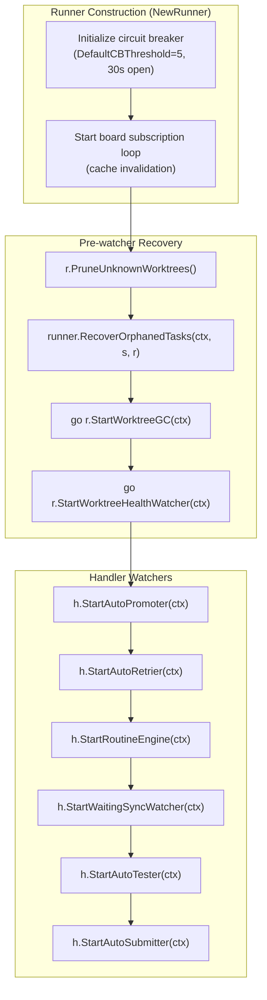
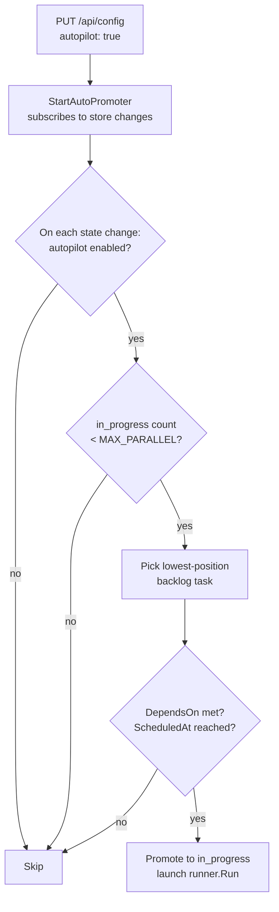
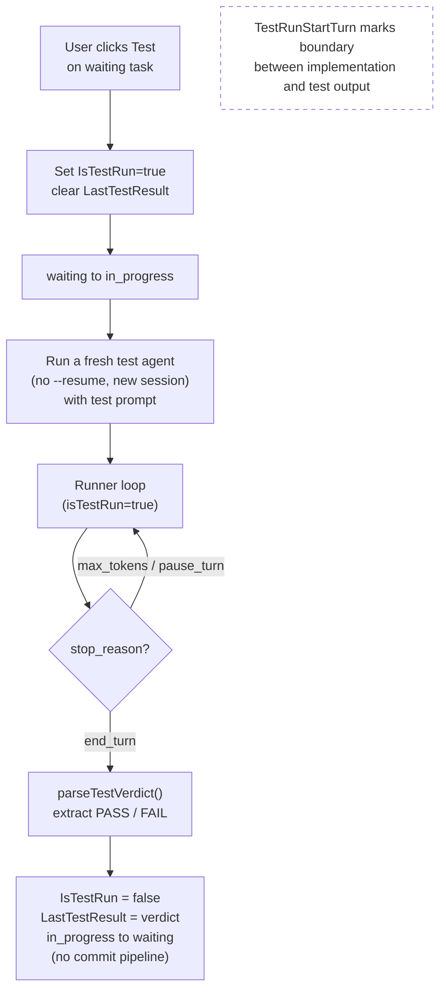
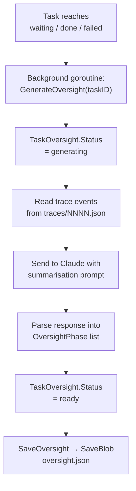
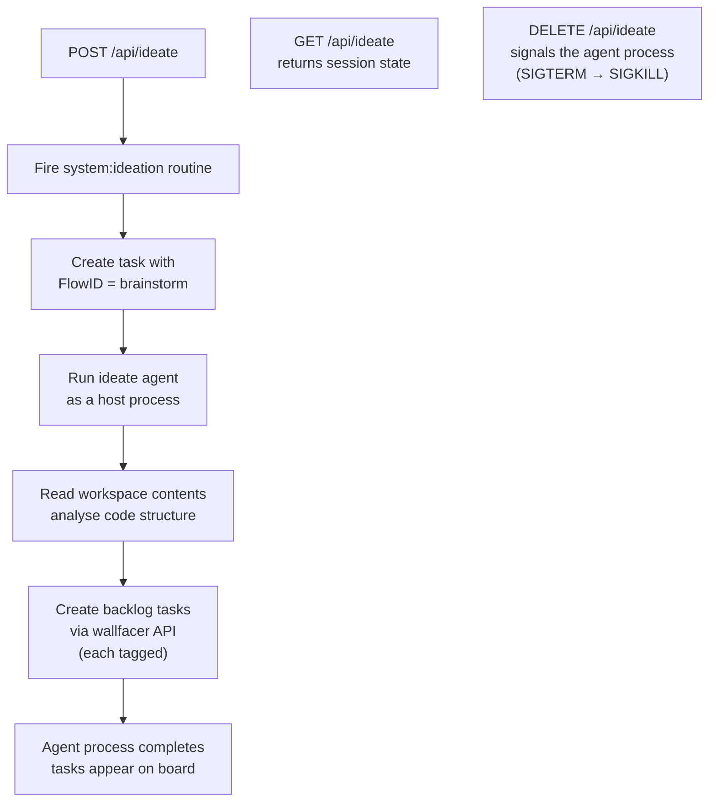
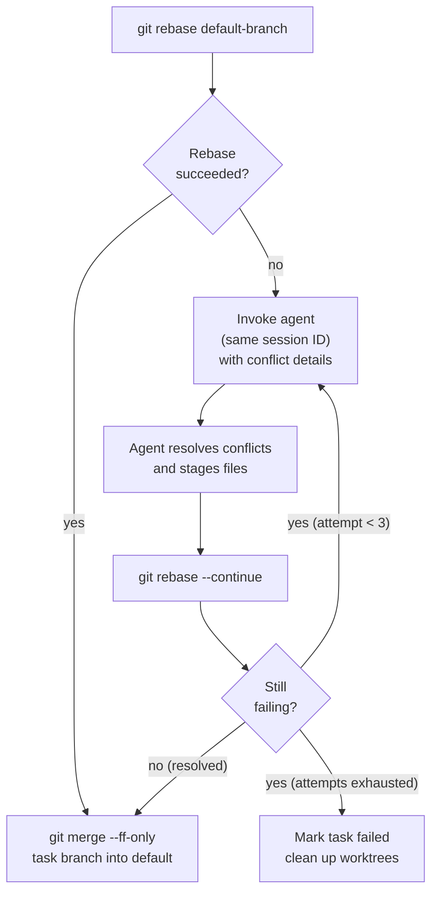

# Automation

Wallfacer runs six background watchers that form an autonomous pipeline: **AutoPromoter**, **AutoRetrier**, **RoutineEngine**, **WaitingSyncWatcher**, **AutoTester**, and **AutoSubmitter**. Together with oversight generation and circuit breakers, these watchers let the task board operate hands-free, promoting backlog tasks, running tests, submitting results, retrying failures, syncing worktrees, firing scheduled routines (including ideation), and generating oversight summaries without manual intervention.

## Background Goroutine Model

No message queue, no worker pool. Concurrency is plain Go goroutines:

```go
// Task execution (new or resumed)
go h.runner.Run(id, prompt, sessionID, freshStart)

// Post-feedback resumption
go h.runner.Run(id, feedbackMessage, sessionID, false)

// Commit pipeline after mark-done
go func() {
    h.runner.Commit(id)
    store.UpdateStatus(id, "done")
}()
```

Tasks are long-running and IO-bound (host-process agent runs, git operations), so goroutines are appropriate: no CPU contention, and Go's scheduler handles the rest.

## Watcher Initialization & Startup

### Startup Sequence in `server.go`

The server starts watchers and recovery routines in a specific order after constructing the `Runner` and `Handler`:



### Recovery Scans

Before watchers begin, two recovery operations run synchronously:

- **`PruneUnknownWorktrees()`**: Scans the `worktrees/` directory and removes any worktree directories that do not correspond to a known task. Also runs `git worktree prune` on each workspace repository to clean up stale Git worktree references.
- **`RecoverOrphanedTasks()`**: Reconciles tasks left in `in_progress` or `committing` after a server restart. See [RecoverOrphanedTasks](#recoverorphanedtasks) below for the per-branch behavior.

### Subscription Patterns

All handler-level watchers follow one of two patterns:

**Store-driven (SubscribeWake)**: The auto-promoter, auto-retrier, auto-tester, and auto-submitter call `store.SubscribeWake()` to get a capacity-1 channel that signals "something changed." They react to the signal by scanning tasks and taking action if conditions are met.

```go
// Auto-promoter pattern
subID, ch := h.store.SubscribeWake()
ticker := time.NewTicker(60 * time.Second)
go func() {
    defer h.store.UnsubscribeWake(subID)
    defer ticker.Stop()
    for {
        select {
        case <-ctx.Done(): return
        case <-ch:         h.tryAutoPromote(ctx)
        case <-ticker.C:   h.tryAutoPromote(ctx)
        }
    }
}()
```

The supplementary ticker (60 seconds for the promoter) ensures scheduled tasks are promoted even when no other state change occurs.

**Startup recovery scan**: The auto-retrier additionally performs a startup scan. Immediately after subscribing, it lists all failed tasks and attempts to retry any that match the transient failure categories (`container_crash`, `worktree`, `sync_error`). This catches tasks that failed while the server was down.

### RecoverOrphanedTasks

On startup, `RecoverOrphanedTasks` in `runner/recovery.go` reconciles tasks that were interrupted by a server restart. It queries the host process state (via `ContainerLister.ListContainers()`, legacy vocabulary for "what agent processes are still running") to learn which tasks still have a live agent process, then handles each interrupted task:

| Status at restart | Process state | Outcome |
|---|---|---|
| `committing` | n/a | Inspect each worktree's branch tip. If a commit landed after the task's `UpdatedAt`, the commit pipeline finished just before the crash, so promote to `done`. Otherwise mark `failed`. |
| `in_progress` | still running | Stay `in_progress`; a monitor goroutine watches the process and transitions to `waiting` once it stops. |
| `in_progress` | already stopped | Transition to `waiting` so the user can review partial output and decide whether to continue or mark done. |

If worktrees are missing during recovery, the task is marked `failed` with `FailureCategory = worktree_setup`. This matches the state machine in [Task Lifecycle](task-lifecycle.md#crash-recovery). A stopped `in_progress` task with its worktree intact goes to `waiting`, not `failed`.

### Circuit Breaker Initialization

The launch circuit breaker is initialized in `NewRunner()` with:
- **Threshold**: `WALLFACER_CONTAINER_CB_THRESHOLD` (default: 5 consecutive failures).
- **Open duration**: `WALLFACER_CONTAINER_CB_OPEN_SECONDS` (default: 30 seconds).

After the threshold is exceeded, the circuit opens and rejects further agent launches. After the open duration, it enters half-open state and allows a single probe. A successful probe resets the breaker; a failed probe re-opens it.

## Autopilot (Auto-Promotion)

When autopilot is enabled, the server automatically promotes backlog tasks to `in_progress` as capacity becomes available, without requiring the user to drag cards manually.



`WALLFACER_MAX_PARALLEL` defaults to 5. The lock ensures two simultaneous state changes cannot both promote tasks, which would exceed the limit. Autopilot state is toggled via `PUT /api/config {"autopilot": true/false}` and does not persist across restarts.

Concurrency limit is read from `WALLFACER_MAX_PARALLEL` in the env file (default: 5). Autopilot is off by default and does not persist across server restarts.

Tasks whose `DependsOn` list contains any task not yet in `done` status are skipped by the auto-promoter even when the in-progress count is below `WALLFACER_MAX_PARALLEL`.

Tasks whose `ScheduledAt` is in the future are also skipped.

## Test Verification

`POST /api/tasks/{id}/test` runs a separate verification agent on a `waiting` task without committing:



The UI splits the live output panel into "Implementation" and "Test" sections using `TestRunStartTurn` as the boundary.

Once a task has reached `waiting` (the agent finished but the user hasn't committed yet), a test verification agent can be triggered to check whether the implementation meets acceptance criteria.

```
POST /api/tasks/{id}/test
  body: { criteria?: string }   // optional additional acceptance criteria
  ↓
  Sets IsTestRun = true, clears LastTestResult.
  Transitions waiting → in_progress.
  Runs a fresh test agent as a host process (separate session, no --resume) with a test prompt.

Test agent runs (IsTestRun = true):
  Host process executes: inspect code, run tests, verify requirements.
  Agent must end its response with **PASS** or **FAIL**.

On end_turn:
  parseTestVerdict() extracts "pass", "fail", or "unknown" from the result.
  Records verdict in LastTestResult.
  Transitions in_progress → waiting (no commit).
  Test output is shown separately from implementation output in the task detail panel.
```

The test verdict is displayed as a badge on the task card and in the task detail panel. Multiple test runs are allowed; each overwrites the previous verdict. The `TestRunStartTurn` field records which turn the test started so the UI can split implementation vs. test output.

After reviewing the verdict, the user can:
- Mark the task done (commit pipeline runs) if the verdict is PASS
- Provide feedback to fix issues, then re-test
- Cancel the task

## Auto-Submit

Auto-submit is part of the autopilot pipeline. When enabled via `PUT /api/config {"autosubmit": true}`, the `StartAutoSubmitter` watcher monitors tasks that reach `waiting` state with a passing test verdict. It automatically marks them as done, triggering the commit-and-push pipeline without manual intervention.

This completes the autonomous loop: autopilot promotes → agent executes → auto-tester verifies → auto-submit commits.

## Auto-Retry

Tasks can have an `AutoRetryBudget map[FailureCategory]int` that specifies how many automatic retries are allowed for each failure category. When a task fails:

1. The failure is classified into a `FailureCategory`
2. If the budget for that category has remaining retries, the count is decremented
3. The task is automatically reset to `backlog` for a fresh run
4. `AutoRetryCount` tracks the total number of auto-retries consumed

A global cap (`constants.MaxAutoRetries`, currently 3) prevents infinite retry loops regardless of per-category budgets.

Failure categories:

| Category | Description |
|---|---|
| `timeout` | Per-turn timeout exceeded |
| `budget_exceeded` | Cost or token budget limit reached |
| `worktree_setup` | Git worktree creation failed |
| `container_crash` | Agent process exited unexpectedly |
| `agent_error` | Agent reported an error in its output |
| `sync_error` | Rebase/sync operation failed |
| `unknown` | Unclassifiable failure |

The `StartAutoRetrier` watcher performs a startup recovery scan for tasks that failed with transient categories (`container_crash`, `worktree`, `sync_error`) while the server was down, then subscribes to store changes for ongoing monitoring.

See [Task Lifecycle](task-lifecycle.md#auto-retry) for retry history and data models.

## Tip-Sync (Auto-Sync)

The `StartWaitingSyncWatcher` monitors tasks in `waiting` or `failed` state and rebases their worktrees onto the latest default branch when upstream changes are detected. This keeps task branches up-to-date without merging, reducing conflict risk when the commit pipeline eventually runs.

Multiple workspace paths can be passed at startup or switched at runtime via `PUT /api/workspaces`. For each workspace:

- Git status is polled independently and shown in the UI header
- A separate worktree is created per task per workspace
- The commit pipeline runs phases 1-3 for each workspace in sequence

Non-git directories are supported as plain mount targets (no worktree, no commit pipeline for that workspace).

## RoutineEngine

`StartRoutineEngine` (`internal/handler/routines_engine.go`) drives all scheduled, fire-and-forget routines on the board. It builds a single `routine.Engine` (`internal/routine`) and attaches it to the store change stream: every store change reconciles the engine against the current routine cards.

Each routine card carries `RoutineEnabled` and `RoutineIntervalSeconds`. The reconciler maps an active, enabled card with a positive interval to a `routine.FixedInterval` schedule and registers it; cancelled, done, failed, archived, or disabled cards become `routine.Disabled()` and are dropped. When a routine's timer elapses, the engine invokes `h.fireRoutine`, which spawns a fresh task for that routine's flow.

The `routine` package is stateless about tasks and stores: it owns one `time.AfterFunc` timer per registered UUID and calls back a `FireFunc`. The handler is the only consumer and reconciles the engine via `Register` / `Unregister`. Ideation is one instance of this primitive (see below).

## Oversight Generation

Oversight is generated asynchronously whenever a task transitions to `waiting`, `done`, or `failed`. It is also regenerated periodically during execution if `WALLFACER_OVERSIGHT_INTERVAL > 0` (minutes).

`POST /api/tasks/generate-oversight` triggers generation for tasks that are missing summaries.



Served by:
- `GET /api/tasks/{id}/oversight`, implementation run summary (default `?phase=impl`)
- `GET /api/tasks/{id}/oversight?phase=test`, test-run summary (if a test was run)

The UI renders phases in the Oversight tab and as an interactive flamegraph Timeline.

The generator reads the task's trace events, passes them to the Claude API with a summarisation prompt, and writes the result as a `TaskOversight` (`status`: `pending` → `generating` → `ready` | `failed`). `SaveOversight` persists it as a single blob via `SaveBlob`: the implementation summary lands in `oversight.json` and the test-agent summary in `oversight-test.json`, both directly under the task directory (`data/<uuid>/`), matching [Data & Storage](data-and-storage.md).

`POST /api/tasks/generate-oversight` can be used to retroactively generate oversight for tasks that completed before this feature existed.

## Ideation / Brainstorm

Ideation is the built-in `brainstorm` flow wrapping a single `ideate` agent. It runs via the standard task-and-flow dispatch path rather than a special case, and its timer lives inside the [RoutineEngine](#routineengine). The system-ideation routine is a routine card tagged `system:ideation` with `spawn_flow: brainstorm`; each fire spawns a fresh task whose `FlowID` is `brainstorm`. Legacy records written before the flow rewrite carry `Kind = "idea-agent"` and resolve to `brainstorm` via the legacy-kind mapper.



- Each created task gets relevant `Tags` and an `ExecutionPrompt` (full instructions) separate from `Prompt` (the short card label).
- Triggered via `POST /api/ideate` (fires the routine); cancelled via `DELETE /api/ideate`.
- `GET /api/ideate` returns current ideation session state (task ID, status, created task count).
- See [Agents & Flows](../guide/agents-and-flows.md) for how to clone the `ideate` agent with a different harness or a custom system prompt.

## Conflict Resolution

When `git rebase` fails during the commit pipeline:



Using the same session ID means the agent has full context of the original task when making conflict resolution decisions.

## Circuit Breakers

Agent launches are protected by a circuit breaker. After a configurable number of consecutive failures (`WALLFACER_CONTAINER_CB_THRESHOLD`, default: 5), the circuit opens and rejects further launches until it resets. This prevents cascading failures when agent launches are persistently failing.

The circuit breaker lifecycle:

1. **Closed** (normal): All agent launches proceed. Each failure increments a counter; each success resets it.
2. **Open** (tripped): After the threshold is exceeded, all launches are rejected for the open duration (`WALLFACER_CONTAINER_CB_OPEN_SECONDS`, default: 30 seconds).
3. **Half-open** (probing): After the open duration expires, a single probe launch is allowed. Success resets the breaker to closed; failure re-opens it.

See [Circuit Breakers](../guide/circuit-breakers.md) for full details.

## See Also

- [Task Lifecycle](task-lifecycle.md), State machine, turn loop, data models, auto-retry details
- [API & Transport](api-and-transport.md), HTTP API, SSE streams, host-process execution, environment configuration
- [Git Worktrees](git-worktrees.md), Per-task worktree isolation and commit pipeline
- [Architecture](architecture.md), High-level design decisions and persistence model
