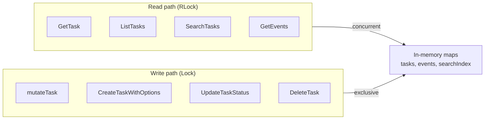
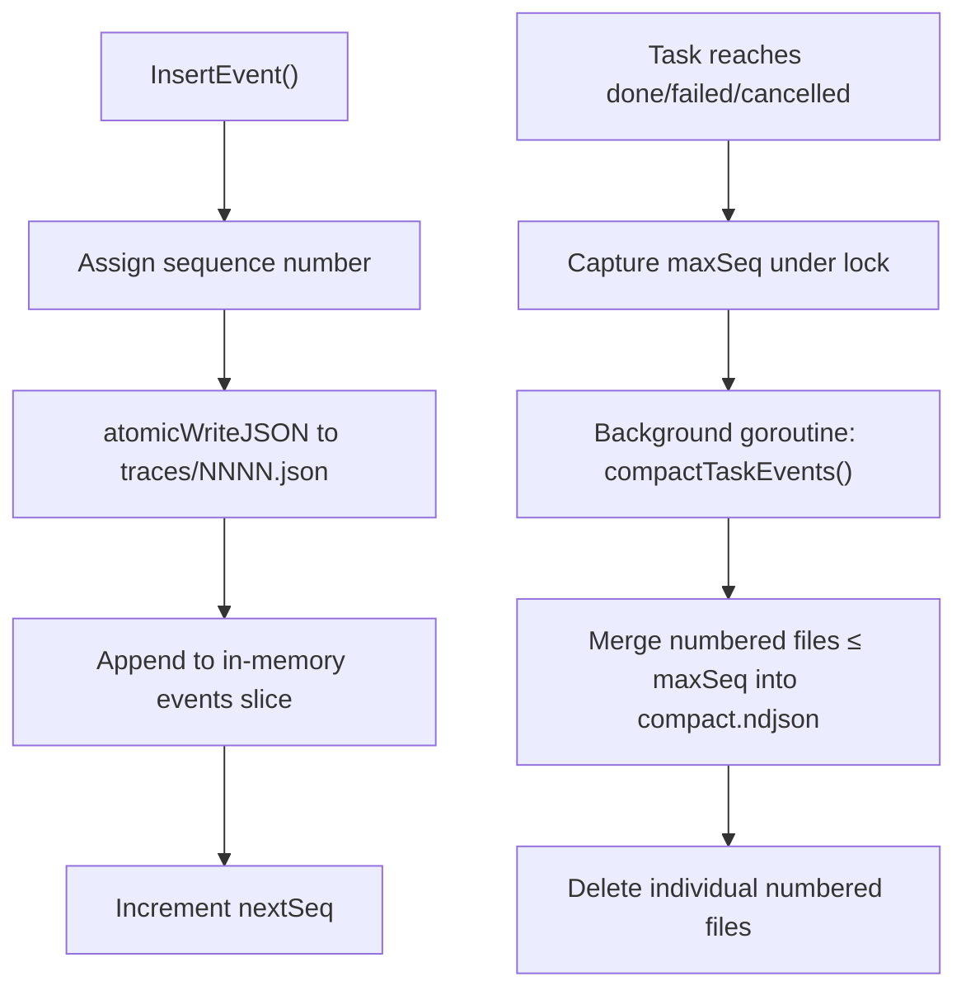
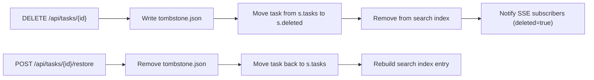

# Data & Storage

Wallfacer uses filesystem-first persistence with no external database. Every task is a directory containing JSON files, and the server maintains an in-memory mirror of all task state for fast reads. Mutations are atomic (temp file + `os.Rename`) and guarded by a `sync.RWMutex`.

The store implementation lives in `internal/store/`.

## Directory Layout

Task data is scoped by workspace key. Each unique combination of workspace directories produces a SHA-256 fingerprint that becomes the workspace key. The data root is `~/.wallfacer/data/<workspace-key>/`.

Within the scoped data directory, each task gets its own UUID-named directory:

```
data/<workspace-key>/
├── <uuid-1>/
│   ├── task.json              # Core task state (Task struct)
│   ├── traces/                # Event sourcing audit trail
│   │   ├── 0001.json          # Individual trace events
│   │   ├── 0002.json
│   │   ├── ...
│   │   └── compact.ndjson     # Compacted events from completed sessions
│   ├── outputs/               # Per-turn agent output
│   │   ├── turn-0001.json     # Stdout (NDJSON from Claude Code -p mode)
│   │   ├── turn-0001.stderr.txt
│   │   ├── turn-0002.json
│   │   └── ...
│   ├── turn-usage.jsonl       # Per-turn token usage log (append-only)
│   ├── oversight.json         # Oversight summary (generated async)
│   ├── oversight-test.json    # Test-agent oversight summary
│   ├── summary.json           # Immutable completion snapshot (cost dashboard)
│   └── tombstone.json         # Soft-delete marker (only if deleted)
├── <uuid-2>/
│   └── ...
└── ...
```

## Task Data Model

The `Task` struct (`internal/store/models.go`) is the core domain model. All fields are serialized to `task.json` via `json.MarshalIndent`.

### Identity and Display

| Field | Type | JSON Key | Description |
|---|---|---|---|
| `SchemaVersion` | `int` | `schema_version` | On-disk schema version (currently `2`) |
| `ID` | `uuid.UUID` | `id` | Unique task identifier |
| `Title` | `string` | `title` | Display title (auto-generated or user-set) |
| `Goal` | `string` | `goal` | 1-3 sentence human-readable summary for card display |
| `GoalManuallySet` | `bool` | `goal_manually_set` | True when user explicitly edited the goal |
| `Kind` | `TaskKind` | `kind` | Execution mode: `""` (standard task) or `"idea-agent"` |
| `Tags` | `[]string` | `tags` | Labels for categorization (e.g. `"idea-agent"`) |

### State and Lifecycle

| Field | Type | JSON Key | Description |
|---|---|---|---|
| `Status` | `TaskStatus` | `status` | Current lifecycle state (see below) |
| `Archived` | `bool` | `archived` | Whether task is archived (done/cancelled only) |
| `Position` | `int` | `position` | Board column sort position |
| `CreatedAt` | `time.Time` | `created_at` | Task creation timestamp |
| `StartedAt` | `*time.Time` | `started_at` | First transition to `in_progress` |
| `UpdatedAt` | `time.Time` | `updated_at` | Last mutation timestamp |
| `ScheduledAt` | `*time.Time` | `scheduled_at` | Optional future time before auto-promotion |
| `DependsOn` | `[]string` | `depends_on` | UUIDs of tasks that must reach `done` first |

`TaskStatus` values: `backlog`, `in_progress`, `waiting`, `committing`, `done`, `failed`, `cancelled`.

### Prompt and Refinement

| Field | Type | JSON Key | Description |
|---|---|---|---|
| `Prompt` | `string` | `prompt` | Current task prompt |
| `ExecutionPrompt` | `string` | `execution_prompt` | Override prompt sent to sandbox (when non-empty) |
| `PromptHistory` | `[]string` | `prompt_history` | Previous prompts (pruned to last 20) |
| `RefineSessions` | `[]RefinementSession` | `refine_sessions` | Past refinement sessions (pruned to last 5) |
| `CurrentRefinement` | `*RefinementJob` | `current_refinement` | Active refinement job state |

### Execution

| Field | Type | JSON Key | Description |
|---|---|---|---|
| `SessionID` | `*string` | `session_id` | Claude Code session identifier |
| `FreshStart` | `bool` | `fresh_start` | Start new session instead of resuming |
| `Result` | `*string` | `result` | Final agent output text |
| `StopReason` | `*string` | `stop_reason` | Why the agent stopped (`end_turn`, `max_tokens`, etc.) |
| `Turns` | `int` | `turns` | Number of agent turns completed |
| `Timeout` | `int` | `timeout` | Timeout in minutes (clamped to 1-1440, default 60) |
| `Sandbox` | `sandbox.Type` | `sandbox` | Sandbox type: `"claude"`, `"codex"` |
| `SandboxByActivity` | `map[SandboxActivity]sandbox.Type` | `sandbox_by_activity` | Per-activity sandbox overrides |
| `ModelOverride` | `*string` | `model_override` | Per-task model override; nil = global default |
| `Environment` | `*ExecutionEnvironment` | `environment` | Runtime environment snapshot for reproducibility |

### Budget and Retry

| Field | Type | JSON Key | Description |
|---|---|---|---|
| `MaxCostUSD` | `float64` | `max_cost_usd` | Cost ceiling (0 = unlimited) |
| `MaxInputTokens` | `int` | `max_input_tokens` | Input token ceiling (0 = unlimited) |
| `FailureCategory` | `FailureCategory` | `failure_category` | Root cause of last failure |
| `AutoRetryBudget` | `map[FailureCategory]int` | `auto_retry_budget` | Per-category retry allowances |
| `AutoRetryCount` | `int` | `auto_retry_count` | Total auto-retries consumed (capped at 3) |
| `RetryHistory` | `[]RetryRecord` | `retry_history` | Past execution snapshots (pruned to last 10) |

### Usage

| Field | Type | JSON Key | Description |
|---|---|---|---|
| `Usage` | `TaskUsage` | `usage` | Accumulated token/cost totals |
| `UsageBreakdown` | `map[SandboxActivity]TaskUsage` | `usage_breakdown` | Per-sub-agent usage attribution |
| `TruncatedTurns` | `[]int` | `truncated_turns` | Turns whose output was truncated by size budget |

### Worktree Isolation

| Field | Type | JSON Key | Description |
|---|---|---|---|
| `WorktreePaths` | `map[string]string` | `worktree_paths` | Host repo path to worktree path |
| `BranchName` | `string` | `branch_name` | Task branch (`task/<uuid8>`) |
| `CommitHashes` | `map[string]string` | `commit_hashes` | Post-merge commit hash per repo |
| `BaseCommitHashes` | `map[string]string` | `base_commit_hashes` | Default branch HEAD before merge |
| `CommitMessage` | `string` | `commit_message` | Generated commit message from commit pipeline |
| `MountWorktrees` | `bool` | `mount_worktrees` | Whether worktrees are mounted into the container |

### Test Verification

| Field | Type | JSON Key | Description |
|---|---|---|---|
| `IsTestRun` | `bool` | `is_test_run` | True while task is running as a test verifier |
| `LastTestResult` | `string` | `last_test_result` | `"pass"`, `"fail"`, or `""` |
| `TestRunStartTurn` | `int` | `test_run_start_turn` | Turn boundary between implementation and test phases |
| `PendingTestFeedback` | `string` | `pending_test_feedback` | Failing test outcome awaiting auto-resume |
| `TestFailCount` | `int` | `test_fail_count` | Consecutive test failures (caps auto-resume) |
| `CustomPassPatterns` | `[]string` | `custom_pass_patterns` | User regex patterns that force "pass" verdict |
| `CustomFailPatterns` | `[]string` | `custom_fail_patterns` | User regex patterns that force "fail" verdict |

## Supporting Data Models

### TaskUsage

Tracks token consumption and cost across all turns:

```go
type TaskUsage struct {
    InputTokens          int     `json:"input_tokens"`
    OutputTokens         int     `json:"output_tokens"`
    CacheReadInputTokens int     `json:"cache_read_input_tokens"`
    CacheCreationTokens  int     `json:"cache_creation_input_tokens"`
    CostUSD              float64 `json:"cost_usd"`
}
```

Values are accumulated directly from per-invocation reports (not session-cumulative), so each container run's output is added to the running total.

### TurnUsageRecord

Per-turn token breakdown persisted to `turn-usage.jsonl` (one JSON object per line):

```go
type TurnUsageRecord struct {
    Turn                 int             `json:"turn"`
    Timestamp            time.Time       `json:"timestamp"`
    InputTokens          int             `json:"input_tokens"`
    OutputTokens         int             `json:"output_tokens"`
    CacheReadInputTokens int             `json:"cache_read_input_tokens"`
    CacheCreationTokens  int             `json:"cache_creation_tokens"`
    CostUSD              float64         `json:"cost_usd"`
    StopReason           string          `json:"stop_reason,omitempty"`
    Sandbox              sandbox.Type    `json:"sandbox,omitempty"`
    SubAgent             SandboxActivity `json:"sub_agent,omitempty"`
}
```

### TaskEvent

A single entry in a task's audit trail (event sourcing). The `Data` field is polymorphic JSON whose schema depends on `EventType`:

```go
type TaskEvent struct {
    ID        int64           `json:"id"`
    TaskID    uuid.UUID       `json:"task_id"`
    EventType EventType       `json:"event_type"`
    Data      json.RawMessage `json:"data"`
    CreatedAt time.Time       `json:"created_at"`
}
```

Event types:

| EventType | Data payload | Description |
|---|---|---|
| `state_change` | `{from, to, trigger, ...}` | Task status transition with trigger source |
| `output` | Output text | Agent turn output reference |
| `feedback` | Feedback text | User feedback submitted to waiting task |
| `error` | Error message | Error during execution |
| `system` | System message | Internal system events |
| `span_start` | `SpanData{Phase, Label}` | Start of a timed execution phase |
| `span_end` | `SpanData{Phase, Label}` | End of a timed execution phase |

State change triggers: `user`, `auto_promote`, `auto_retry`, `auto_test`, `auto_submit`, `feedback`, `sync`, `recovery`, `system`.

### TaskOversight / OversightPhase

Generated asynchronously when tasks reach `waiting`, `done`, or `failed`:

```go
type TaskOversight struct {
    Status      OversightStatus  `json:"status"`
    GeneratedAt time.Time        `json:"generated_at,omitempty"`
    Error       string           `json:"error,omitempty"`
    Phases      []OversightPhase `json:"phases,omitempty"`
}

type OversightPhase struct {
    Timestamp time.Time `json:"timestamp"`
    Title     string    `json:"title"`
    Summary   string    `json:"summary"`
    ToolsUsed []string  `json:"tools_used,omitempty"`
    Commands  []string  `json:"commands,omitempty"`
    Actions   []string  `json:"actions,omitempty"`
}
```

`OversightStatus` values: `pending`, `generating`, `ready`, `failed`.

Stored in `oversight.json` (implementation) and `oversight-test.json` (test agent) alongside `task.json`.

### TaskSummary

Immutable snapshot written exactly once when a task transitions to `done`:

```go
type TaskSummary struct {
    TaskID                  uuid.UUID                    `json:"task_id"`
    Title                   string                       `json:"title"`
    Status                  TaskStatus                   `json:"status"`
    CompletedAt             time.Time                    `json:"completed_at"`
    CreatedAt               time.Time                    `json:"created_at"`
    DurationSeconds         float64                      `json:"duration_seconds"`
    ExecutionDurationSeconds float64                     `json:"execution_duration_seconds"`
    TotalTurns              int                          `json:"total_turns"`
    TotalCostUSD            float64                      `json:"total_cost_usd"`
    ByActivity              map[SandboxActivity]TaskUsage `json:"by_activity"`
    TestResult              string                       `json:"test_result"`
    PhaseCount              int                          `json:"phase_count"`
    FailureCategory         FailureCategory              `json:"failure_category,omitempty"`
}
```

### RetryRecord

Snapshot of an execution lifecycle before reset. Appended to `Task.RetryHistory` by `ResetTaskForRetry`:

```go
type RetryRecord struct {
    RetiredAt       time.Time       `json:"retired_at"`
    Prompt          string          `json:"prompt"`
    Status          TaskStatus      `json:"status"`
    Result          string          `json:"result,omitempty"`     // truncated to 2000 chars
    SessionID       string          `json:"session_id,omitempty"`
    Turns           int             `json:"turns"`
    CostUSD         float64         `json:"cost_usd"`
    FailureCategory FailureCategory `json:"failure_category,omitempty"`
}
```

### RefinementSession / RefinementJob

`RefinementSession` records a completed sandbox-based refinement run:

```go
type RefinementSession struct {
    ID           string              `json:"id"`
    CreatedAt    time.Time           `json:"created_at"`
    StartPrompt  string              `json:"start_prompt"`
    Messages     []RefinementMessage `json:"messages,omitempty"`   // backward compat
    Result       string              `json:"result,omitempty"`
    ResultPrompt string              `json:"result_prompt,omitempty"`
}
```

`RefinementJob` tracks a currently active or recently completed refinement:

```go
type RefinementJob struct {
    ID        string              `json:"id"`
    CreatedAt time.Time           `json:"created_at"`
    Status    RefinementJobStatus `json:"status"`    // "running", "done", "failed"
    Result    string              `json:"result,omitempty"`
    Goal      string              `json:"goal,omitempty"`
    Error     string              `json:"error,omitempty"`
    Source    string              `json:"source,omitempty"` // "runner" for UI-triggered
}
```

### ExecutionEnvironment

Captured once at the start of `Run()` for reproducibility auditing:

```go
type ExecutionEnvironment struct {
    ContainerImage   string       `json:"container_image"`
    ContainerDigest  string       `json:"container_digest"`
    ModelName        string       `json:"model_name"`
    APIBaseURL       string       `json:"api_base_url"`
    InstructionsHash string       `json:"instructions_hash"`
    Sandbox          sandbox.Type `json:"sandbox"`
    RecordedAt       time.Time    `json:"recorded_at"`
}
```

### Tombstone

Marks a task as soft-deleted:

```go
type Tombstone struct {
    DeletedAt time.Time `json:"deleted_at"`
    Reason    string    `json:"reason,omitempty"`
}
```

### SandboxActivity

Identifies which phase of a task a container run belongs to. Used for per-activity sandbox routing and usage attribution:

| Constant | Value | Usage |
|---|---|---|
| `SandboxActivityImplementation` | `"implementation"` | Main implementation phase (routing + attribution) |
| `SandboxActivityTesting` | `"testing"` | Test execution phase (routing + attribution) |
| `SandboxActivityRefinement` | `"refinement"` | Prompt refinement (routing + attribution) |
| `SandboxActivityTitle` | `"title"` | Title generation (routing + attribution) |
| `SandboxActivityOversight` | `"oversight"` | Oversight generation (routing + attribution) |
| `SandboxActivityCommitMessage` | `"commit_message"` | Commit message generation (routing + attribution) |
| `SandboxActivityIdeaAgent` | `"idea_agent"` | Brainstorm/ideation (routing + attribution) |
| `SandboxActivityTest` | `"test"` | Attribution-only (not used for sandbox routing) |
| `SandboxActivityOversightTest` | `"oversight-test"` | Attribution-only (not used for sandbox routing) |

### FailureCategory

Machine-readable root cause classification for failed tasks:

| Constant | Value | Description |
|---|---|---|
| `FailureCategoryTimeout` | `"timeout"` | Task exceeded its timeout |
| `FailureCategoryBudget` | `"budget_exceeded"` | Cost or token budget exhausted |
| `FailureCategoryWorktree` | `"worktree_setup"` | Git worktree setup failed |
| `FailureCategoryContainerCrash` | `"container_crash"` | Container exited unexpectedly |
| `FailureCategoryAgentError` | `"agent_error"` | Agent returned an error |
| `FailureCategorySyncError` | `"sync_error"` | Rebase/sync operation failed |
| `FailureCategoryUnknown` | `"unknown"` | Unclassified failure |

### BoardManifest / BoardTask

Defined in `internal/runner/board.go` (not in the store package). A sanitized view of the task board written to each task's container as `board.json`. See [task-lifecycle.md](task-lifecycle.md) for full field details.

## Persistence Mechanics

### Atomic Writes

All JSON persistence uses the `atomicWriteJSON` helper:

```go
func atomicWriteJSON(path string, v any) error {
    raw, err := json.MarshalIndent(v, "", "  ")
    // ...
    tmp := path + ".tmp"
    os.WriteFile(tmp, raw, 0644)
    return os.Rename(tmp, path)  // atomic on POSIX
}
```

This guarantees that readers never see a partially written file. If the process crashes mid-write, only the `.tmp` file is left and the original remains intact.

### Concurrency Model

The `Store` struct holds a single `sync.RWMutex` (`s.mu`) that protects all in-memory state:



- **Read path**: Acquires `s.mu.RLock()`, reads from in-memory maps, returns deep-cloned `Task` values so callers cannot mutate store state.
- **Write path**: Acquires `s.mu.Lock()`, mutates the in-memory task, calls `saveTask()` (atomic write to disk), then calls `notify()` to push changes to SSE subscribers.
- **Deep cloning**: All outward-facing reads go through `deepCloneTask()` (generated by `cmd/gen-clone`) which duplicates all slices, maps, and pointer fields.

The `mutateTask` helper encapsulates the common write pattern:

```go
func (s *Store) mutateTask(id uuid.UUID, fn func(t *Task) error) error {
    s.mu.Lock()
    defer s.mu.Unlock()
    t := s.tasks[id]          // find task
    fn(t)                      // mutate in-place
    t.UpdatedAt = time.Now()
    s.saveTask(id, t)          // persist atomically
    s.notify(t, false)         // push to SSE subscribers
    return nil
}
```

### Subscriber Notification

After every write, `notify()` stamps a monotonically increasing sequence number on a `SequencedDelta` and fans it out:

1. Appends to a bounded replay buffer (512 entries) so reconnecting SSE clients can catch up without a full snapshot.
2. Non-blocking send to all active subscriber channels (capacity 64). If a subscriber's buffer is full, the delta is dropped for that subscriber.
3. Wake signal to lightweight wake-only subscribers (capacity 1, coalesces bursts).

## Event Sourcing

### Trace Files

Events are the append-only audit trail for each task, stored in `traces/`:

```
traces/
├── 0001.json      # First event (typically state_change: backlog → in_progress)
├── 0002.json      # Second event
├── ...
└── compact.ndjson # Compacted events from completed sessions
```

Each file is a single `TaskEvent` serialized as JSON. The filename sequence number (`%04d.json`) matches the event's `ID` field.

### Event Lifecycle



### Compaction

When a task reaches a terminal state (`done`, `failed`, `cancelled`), the store compacts all numbered trace files up to the current sequence number into a single `compact.ndjson` file (one JSON object per line). Files beyond the compaction boundary are preserved for the next session if the task is retried.

On startup, `loadEvents()` reads `compact.ndjson` first, then merges any numbered trace files with sequence numbers beyond the compacted range.

### SpanData

Span events (`span_start`/`span_end`) carry structured phase data:

```go
type SpanData struct {
    Phase string `json:"phase"`  // e.g. "worktree_setup", "agent_turn", "commit"
    Label string `json:"label"`  // e.g. "agent_turn_1", "agent_turn_2"
}
```

`ComputeSpans()` pairs start/end events by `(Phase, Label)` key and returns `[]SpanResult` with duration in milliseconds. Unclosed spans are included with zero `EndedAt`.

## Soft Delete

Tasks are not immediately removed from disk. Instead, `DeleteTask` writes a `tombstone.json` marker:



- **Retention**: `PurgeExpiredTombstones` runs periodically and removes task directories whose tombstone `DeletedAt` exceeds the retention window. Configured via `WALLFACER_TOMBSTONE_RETENTION_DAYS` (default 7).
- **Listing deleted tasks**: `GET /api/tasks/deleted` returns all tombstoned tasks sorted by `UpdatedAt` descending.
- **Restoring**: `POST /api/tasks/{id}/restore` removes the tombstone file and moves the task back into the active set.
- **Purging**: After the retention window, `purgeTaskLocked` calls `os.RemoveAll` on the entire task directory and removes all in-memory state.

## Task Summaries

`summary.json` is an immutable snapshot written atomically when a task transitions to `done` (inside `buildAndSaveSummary`, called while the store lock is held). It captures:

- Task identity (ID, title, status)
- Timing (created_at, completed_at, wall-clock duration, execution duration)
- Cost and usage (total cost, per-activity breakdown via `ByActivity`)
- Quality signals (total turns, test result, oversight phase count, failure category)

The cost dashboard endpoint (`GET /api/tasks/summaries`) reads `summary.json` files directly from disk via `ListSummaries()`, scanning all task directories without loading full `task.json` files. Tasks that completed before this feature was introduced simply have no summary entry.

## Search Index

The store maintains an in-memory full-text search index for fast substring matching without per-query disk I/O.

### Indexed Fields

Each task entry holds pre-lowercased copies of searchable text:

| Field | Source |
|---|---|
| `title` | `Task.Title` |
| `goal` | `Task.Goal` |
| `prompt` | `Task.Prompt` |
| `tags` | `strings.Join(Task.Tags, " ")` |
| `oversight` | Concatenated phase titles and summaries from `oversight.json` |

### Index Maintenance

- **On startup**: `loadAll()` builds index entries for every task, including oversight text loaded from disk.
- **On mutation**: Each write method that touches a search-indexed field (e.g. `UpdateTaskTitle`, `UpdateTaskBacklog`, `UpdateTaskTags`, `ApplyRefinement`) updates the corresponding index entry inline.
- **On oversight save**: `SaveOversight()` updates the oversight text in the index after writing to disk.
- **On delete**: `DeleteTask()` removes the entry; `RestoreTask()` rebuilds it.
- **Manual rebuild**: `POST /api/admin/rebuild-index` calls `RebuildSearchIndex()`, which re-reads oversight from disk for every task and reports how many entries changed.

### Search Execution

`SearchTasks()` performs case-insensitive substring matching under a single `RLock`, checking fields in cheapest-first order (title, goal, prompt, tags, oversight). Each task produces at most one result (first matching field). Results are capped at 50 entries with HTML-escaped snippet context.

## Payload Pruning

Three unboundedly-growing slice fields on `Task` are pruned to configurable limits on every disk write (via `pruneTaskPayload`). The in-memory copy retains full history for the current server lifetime; only the persisted file is bounded:

| Field | Default Limit | Env Override |
|---|---|---|
| `RetryHistory` | 10 | `WALLFACER_RETRY_HISTORY_LIMIT` |
| `RefineSessions` | 5 | `WALLFACER_REFINE_SESSIONS_LIMIT` |
| `PromptHistory` | 20 | `WALLFACER_PROMPT_HISTORY_LIMIT` |

Turn output files are also subject to a per-turn size budget (`WALLFACER_MAX_TURN_OUTPUT_BYTES`, default 8 MB). When truncation occurs, a `truncation_notice` NDJSON sentinel is appended and the turn number is recorded in `Task.TruncatedTurns`.

## Migration System

The store uses a forward-only migration system in `internal/store/migrate.go`. Every `task.json` is passed through `migrateTaskJSON()` on load, which applies migration steps in order:

1. Default missing values: `Status` to `"backlog"`, `Timeout` to `60`, `CreatedAt`/`UpdatedAt` from file mod time.
2. Canonicalize `DependsOn`: trim whitespace, validate UUIDs, deduplicate, sort.
3. Normalize `Sandbox` and `SandboxByActivity` via validation helpers.
4. Backfill `AutoRetryBudget` for tasks created before schema version 2.
5. Backfill `Goal` from `Prompt` for pre-existing tasks.
6. Stamp `SchemaVersion = CurrentTaskSchemaVersion`.

If any migration step modifies the task, the migrated version is persisted back to disk so future loads skip migration. The `CurrentTaskSchemaVersion` constant (currently `2`) is incremented whenever a new migration step is added.

Migration also handles the deprecated `Model` field by moving its value to `ModelOverride`.

## See Also

- [architecture.md](architecture.md) -- System architecture overview
- [task-lifecycle.md](task-lifecycle.md) -- Task state machine, turn loop, and board manifest
- [api-and-transport.md](api-and-transport.md) -- HTTP API, SSE transport, and webhook delivery
- [git-worktrees.md](git-worktrees.md) -- Worktree isolation and commit pipeline
