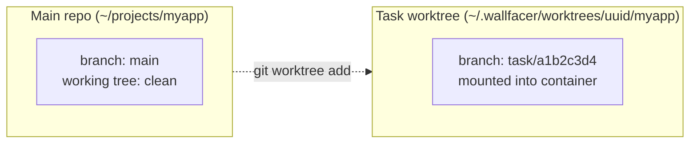
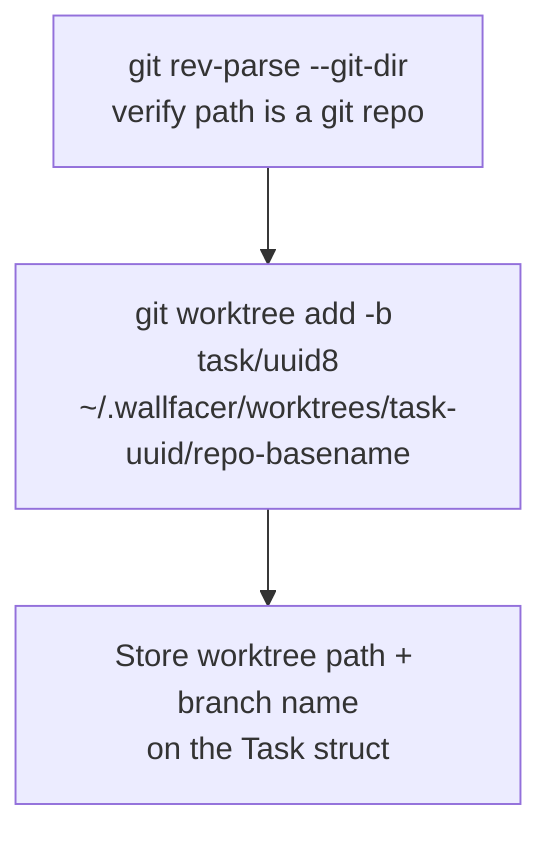
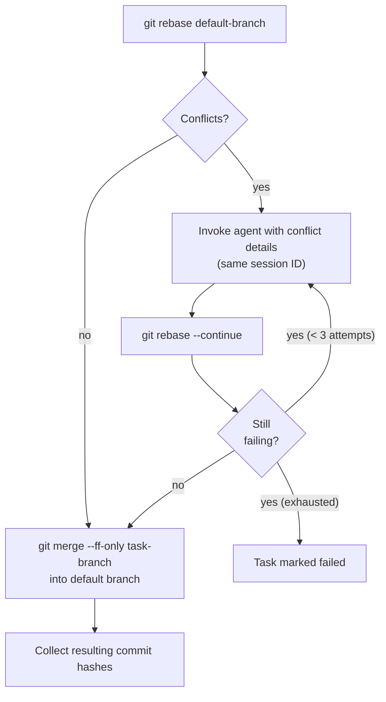
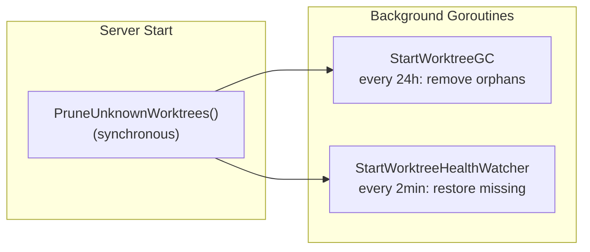
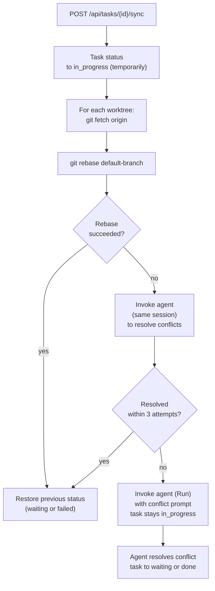

# Git Operations & Worktree Lifecycle

## Core Principle

Every task gets its own isolated copy of each workspace. Git repositories use git worktrees; non-git directories use snapshot copies. The agent operates in an isolated copy of each repository on a dedicated branch, leaving the main working tree untouched and allowing multiple tasks to run concurrently without interfering with each other.



## Worktree Setup

Called by `setupWorktrees()` in `internal/runner/worktree.go` when a task enters `in_progress`. Internally delegates to `ensureTaskWorktrees()` which is idempotent: if the worktree directory already exists and is a valid git repo, it is reused unchanged (e.g. when resuming a `waiting` task).

For each configured workspace:



Branch naming uses the first 8 characters of the task UUID: `task/a1b2c3d4`.

Multiple workspaces produce multiple worktrees, all grouped under `~/.wallfacer/worktrees/<task-uuid>/`:

```
~/.wallfacer/worktrees/
└── <task-uuid>/
    ├── myapp/       # worktree for ~/projects/myapp
    └── mylib/       # worktree for ~/projects/mylib
```

### Non-Git Workspaces

When a workspace is not a git repository (or is an empty git repo with no commits), `setupNonGitSnapshot()` (`internal/runner/snapshot.go`) creates a snapshot copy instead:

1. `cp -a ws/. snapshotPath` copies all files including hidden ones.
2. `git init` + `git add -A` + `git commit --allow-empty` initializes a local git repo for change tracking.
3. The standard commit pipeline (Phase 1) can then commit changes within the snapshot.
4. After task completion, `extractSnapshotToWorkspace()` copies changes back using `rsync --delete --exclude=.git` (falling back to `cp` if rsync is unavailable).

### Stale Branch Recovery

`CreateWorktree()` (`internal/gitutil/worktree.go`) handles the case where the branch already exists but the worktree directory was lost (e.g. after a server crash). If `git worktree add -b` fails because the branch or worktree entry already exists, it retries with `git worktree add --force <path> <branch>` to reattach the existing branch. `CreateWorktreeAt()` follows the same pattern but accepts an explicit base commit.

### Broken Worktree Detection

When `ensureTaskWorktrees()` finds a directory that exists but is not a valid git repo (e.g. the `.git` link was deleted or corrupted by a container), it removes the directory entirely and recreates the worktree from scratch.

## Container Mounts

The sandbox container sees worktrees, not the live main working directory:

```
~/.wallfacer/worktrees/<uuid>/<repo>  ->  /workspace/<repo>:z   (read-write)
AGENTS.md (or CLAUDE.md)               ->  /workspace/AGENTS.md  (read-only)
claude-config (named volume)           ->  /home/claude/.claude
```

The `.env` file is passed via `--env-file`, not as a bind mount.

The agent operates on `/workspace/<repo>` -- the isolated worktree branch -- so all edits land on `task/<uuid8>` and never touch `main`.

### Git Directory Bind-Mount

Git worktrees use a `.git` file (not a directory) that references the main repo's `.git/worktrees/<name>/` via an absolute host path. To make git operations work inside the container, `buildContainerArgsForSandbox()` (`internal/runner/container.go`) bind-mounts the main repo's `.git` directory at the same absolute host path inside the container:

```
~/projects/myapp/.git  ->  ~/projects/myapp/.git:z   (read-write)
```

### Working Directory

When there is exactly one workspace, the container's working directory is set to `/workspace/<basename>` so the agent starts directly in the repo. For multiple workspaces, CWD is `/workspace` so all repos are accessible. See `workdirForBasenames()` in `container.go`.

## Commit Pipeline

Triggered automatically after `end_turn`, or manually when a user marks a `waiting` task as done. Runs three sequential phases in `runner.go`.

### Phase 1 -- Claude Commits (in container)

Staging and committing happen on the host. A container is launched only to generate the commit message, which is then used by the host-side `git commit`.

### Phase 2 -- Rebase & Merge (host-side, `internal/gitutil/ops.go`)



`DefaultBranch()` (`internal/gitutil/repo.go`) resolves the target branch by checking, in order:
1. Current local HEAD branch (so tasks merge back to whatever branch the user is working on)
2. `origin/HEAD` (remote default)
3. Falls back to `"main"`

**Stale rebase recovery:** Before starting a new rebase, `recoverRebaseState()` checks for leftover `REBASE_HEAD`, `MERGE_HEAD`, or `CHERRY_PICK_HEAD` refs. If found, it aborts the stale operation (`git rebase --abort`, `git merge --abort`) and clears conflicted paths via `git reset --merge`, falling back to `git restore` or `git reset --hard HEAD`.

**Conflict resolution loop:** If `git rebase` exits non-zero, Wallfacer invokes the agent again -- using the original task's session ID -- passing it the conflict details. The agent resolves the conflicts and stages the result. The rebase is then continued and retried. Up to 3 attempts are made before the task is marked `failed`.

**Stash operations:** `StashIfDirty()` and `StashPop()` (`internal/gitutil/stash.go`) are used during conflict resolution to preserve uncommitted changes. A failed `StashPop` aborts via `git checkout -- .` + `git clean -fd` to restore a clean state, preserving the stash entry for manual recovery.

### Phase 3 -- Cleanup

```
git worktree remove --force   <- remove worktree directory
git branch -D task/<uuid8>    <- delete task branch
rm -rf ~/.wallfacer/worktrees/<uuid>/   <- remove task worktree directory
```

`RemoveWorktree()` (`internal/gitutil/worktree.go`) handles edge cases: if the directory is already gone, it runs `git worktree prune` and continues to the branch deletion. Branch deletion is best-effort and always attempted.

Note: `data/<uuid>/` (task record, traces, outputs, oversights, summary) is **preserved** after cleanup so execution history remains accessible in the UI.

Cleanup is idempotent and safe to call multiple times (errors are logged, not fatal). Span events (`worktree_cleanup`) are recorded in the task's audit trail.

> **Workspace management** has moved. See [Workspaces & Configuration](workspaces-and-config.md) for workspace management.

> **AGENTS.md lifecycle** has moved. See [Workspaces & Configuration](workspaces-and-config.md) for AGENTS.md lifecycle.

## Sibling Worktree Mounting

Tasks can optionally see the working directories of other active tasks via read-only bind-mounts.

### MountWorktrees Flag

The `MountWorktrees` boolean field on the `Task` model controls whether sibling worktrees are mounted into this task's container. It is set at task creation time (via `TaskCreateOptions.MountWorktrees`) and can be toggled on backlog tasks via `PATCH /api/tasks/{id}`.

### Eligibility

`canMountWorktree()` (`internal/runner/board.go`) determines which sibling tasks are eligible for mounting:

| Sibling status | Eligible? | Reason |
|---|---|---|
| `waiting` | Yes | Worktree exists, not actively being modified |
| `failed` | Yes | Worktree exists, not actively being modified |
| `done` | Only if worktree directory still exists on disk | Worktrees may have been cleaned up already |
| `in_progress` | No | Actively being modified by another agent |
| `backlog` | No | No worktree exists yet |
| `cancelled` / `archived` | No | Worktrees have been cleaned up |

Additionally, siblings must share at least one workspace with the requesting task (checked by `sharesWorkspace()`).

### Path Structure Inside Container

Sibling worktrees are mounted read-only under `/workspace/.tasks/worktrees/<short-id>/<repo>/`:

```
/workspace/.tasks/
    board.json                          # board manifest (read-only)
    worktrees/
        abcd1234/                       # sibling task short ID (first 8 chars of UUID)
            myapp/                      # worktree for ~/projects/myapp
            mylib/                      # worktree for ~/projects/mylib
        ef567890/
            myapp/
```

The mount options are `z,ro` (SELinux relabel + read-only).

### Board Manifest Integration

`generateBoardContextAndMounts()` produces both the `board.json` content and the sibling mount map in a single `ListTasks` call. Each eligible sibling's `BoardTask` entry includes a `worktree_mount` field pointing to the container path, so the agent knows where to find the sibling's files. Results are cached by `(boardChangeSeq, selfTaskID)` to avoid redundant computation across turns.

## Branch Management Internals

### Default Branch Detection

`DefaultBranch()` (`internal/gitutil/repo.go`) prefers the currently checked-out branch so tasks merge back to whatever branch the user is working on (e.g. `develop`), not necessarily the remote's default:

1. `git branch --show-current` -- returns the local HEAD branch
2. `git symbolic-ref --short refs/remotes/origin/HEAD` -- remote default (strips `origin/` prefix)
3. Falls back to `"main"`

`RemoteDefaultBranch()` is a separate function that only considers the remote, used for the git status UI. It checks `origin/HEAD`, then probes `origin/main` and `origin/master`.

### Safety Guards for Branch Switching

Both `GitCheckout()` and `GitCreateBranch()` (`internal/handler/git.go`) call `refuseWorkspaceMutationIfBlocked()` before modifying the workspace. This function checks for tasks in `in_progress`, `waiting`, `committing`, or `failed` status that have worktree paths pointing to the target workspace.

A task blocks workspace mutation if:
- It has a `WorktreePaths` entry for the workspace, AND
- Its status is not `failed`, OR its worktree directory still exists on disk

When blocking tasks exist, the handler returns `409 Conflict` with the list of blocking task IDs, titles, and statuses, so the UI can display which tasks must be completed or cancelled first.

The same guard is applied to `git sync`, `git push`, and `git rebase-on-main` operations.

### Branch Creation Flow

`POST /api/git/create-branch` validates the branch name (no `..`, spaces, or control characters), checks the workspace mutation guard, then runs `git checkout -b <branch>` on the workspace. All future task worktrees branch from the new HEAD.

### Branch Switching

`POST /api/git/checkout` follows the same validation and guard pattern, then runs `git checkout <branch>`. The UI header displays a branch switcher dropdown per workspace.

## Orphan Pruning

`PruneUnknownWorktrees()` (`internal/runner/worktree.go`) runs synchronously on every server startup (called from `server.go`):

1. Scan `~/.wallfacer/worktrees/` for subdirectories
2. Load all task IDs from the store (including archived)
3. For each directory whose name is not a known task UUID: remove the directory
4. Run `git worktree prune` on all git workspaces to clear stale internal refs from `.git/worktrees/`

This handles crashes or ungraceful shutdowns where cleanup never ran.

## Worktree Garbage Collection

`StartWorktreeGC(ctx)` (`internal/runner/worktree_gc.go`) runs as a background goroutine, started from `server.go`. It periodically scans for and removes orphaned worktrees that belong to terminal tasks.

### Scan Phase: `ScanOrphanedWorktrees()`

Inspects `~/.wallfacer/worktrees/` and returns task UUIDs whose:
- Task does not exist in the store, OR
- Task is in a terminal state (`done`, `cancelled`) or is `archived`

Tasks in `backlog`, `in_progress`, `waiting`, `committing`, or `failed` are preserved.

### Prune Phase: `PruneOrphanedWorktrees()`

For each orphaned task ID:
1. Reads subdirectories under `~/.wallfacer/worktrees/<task-uuid>/`
2. Matches subdirectory names to workspace basenames
3. Runs `git worktree remove --force` for each matched worktree (best-effort)
4. Removes the entire task directory via `os.RemoveAll`
5. After all orphans are processed, runs `git worktree prune` on all workspaces

Holds `worktreeMu` for the entire operation to prevent concurrent worktree mutations.

### Timing

- Default interval: **24 hours** (configurable via `WALLFACER_WORKTREE_GC_INTERVAL`, e.g. `"6h"`, `"30m"`)
- Does **not** run an initial scan at startup (that is handled by `PruneUnknownWorktrees()`)

## Worktree Health Watcher

`StartWorktreeHealthWatcher(ctx)` (`internal/runner/worktree_gc.go`) runs as a separate background goroutine, distinct from the GC. Its concern is the opposite: instead of removing orphans, it **restores missing worktrees** for live tasks.

### Scan Phase: `ScanMissingTaskWorktrees()`

Iterates over tasks in `in_progress`, `waiting`, and `committing` states. For each task, checks every `WorktreePaths` entry:
- If the path does not exist on disk: flagged as missing
- If the path exists but is not a valid git repo (`.git` link broken): directory is removed and task is flagged for restoration

### Restore Phase: `RestoreMissingTaskWorktrees()`

For each flagged task (skipping those with an empty `BranchName`):
1. Calls `ensureTaskWorktrees()` to recreate the worktree from the existing branch
2. Inserts a `system` event: "worktree restored by health watcher"
3. Increments the `wallfacer_worktree_restorations_total` Prometheus counter

### Timing

- Runs an initial scan **immediately at startup** (before the first tick)
- Then repeats every **2 minutes** (`defaultWorktreeHealthInterval`)



## Worktree Sync (Rebase Without Merge)

Tasks in `waiting` or `failed` status can be synced with the latest default branch via `POST /api/tasks/{id}/sync`. This rebases the task worktree onto the current default branch HEAD without merging, keeping the task's changes on top.



This is useful when other tasks have merged changes to the default branch and you want the current task to pick them up before continuing.

## Task Diff

`GET /api/tasks/{id}/diff` returns the diff of a task's changes against the default branch. It handles multiple scenarios:

- **Active worktrees** -- uses `merge-base` to diff only the task's changes since it diverged, including untracked files (via `git diff --no-index /dev/null <file>`)
- **Merged tasks** (worktree cleaned up) -- falls back to stored `CommitHashes` / `BaseCommitHashes` or branch names to reconstruct the diff
- Returns `behind_counts` per repo indicating how many commits the default branch has advanced since the task branched off
- **Non-git workspaces** -- silently skipped (no diff to compute)
- **Caching** -- terminal tasks (done/cancelled/archived) are cached with `immutable` Cache-Control; active tasks are cached for 10 seconds with ETag support for conditional requests

## Git Helper Functions (`internal/gitutil/`)

Git operations are organized in the `internal/gitutil` package:

| File | Purpose |
|---|---|
| `repo.go` | Repository queries: `IsGitRepo`, `HasCommits`, `DefaultBranch`, `RemoteDefaultBranch`, `GetCommitHash`, `GetCommitHashForRef` |
| `worktree.go` | Worktree lifecycle: `CreateWorktree`, `CreateWorktreeAt`, `RemoveWorktree`, `ResolveHead` |
| `ops.go` | Git operations: `RebaseOntoDefault`, `FFMerge`, `HasCommitsAheadOf`, `CommitsBehind`, `MergeBase`, `BranchTipCommit`, `FetchOrigin`, `IsConflictOutput`, `HasConflicts` |
| `stash.go` | Stash operations: `StashIfDirty`, `StashPop` |
| `status.go` | Workspace git status: `WorkspaceStatus`, `WorkspaceGitStatus` struct |

### Conflict Detection Helpers

`repo.go` includes several conflict detection functions:
- `IsConflictOutput(s)` -- checks for `CONFLICT`, `Merge conflict`, `conflict` substrings
- `IsRebaseNeedsMergeOutput(s)` -- detects blocked rebase states ("needs merge", "rebase in progress", "cannot rebase" with dirty index, etc.)
- `HasConflicts(worktreePath)` -- parses `git status --porcelain` for unmerged status codes (`UU`, `AA`, `DD`, `AU`, `UA`, `DU`, `UD`)
- `parseConflictedFiles(output)` -- extracts file paths from `CONFLICT (...)` lines via regex

## Git Status & Branch Management API

The server exposes git status and branch management for the UI header bar. See [API & Transport](api-and-transport.md) for the full API route list.

- `GET /api/git/status` -- current branch, remote tracking, ahead/behind counts per workspace
- `GET /api/git/stream` -- SSE endpoint pushing git status updates (5-second poll interval)
- `POST /api/git/push` -- run `git push` on a workspace
- `POST /api/git/sync` -- fetch from remote and rebase workspace onto upstream
- `GET /api/git/branches?workspace=<path>` -- list all local branches for a workspace; returns `{branches: [...], current: "main"}`
- `POST /api/git/checkout` -- switch the active branch (`{workspace, branch}`); refuses while tasks are in progress
- `POST /api/git/create-branch` -- create and checkout a new branch (`{workspace, branch}`); refuses while tasks are in progress
- `POST /api/git/rebase-on-main` -- fetch origin/main and rebase the current branch on top
- `POST /api/git/open-folder` -- open a workspace directory in the OS file manager

All git mutation endpoints (`push`, `sync`, `rebase-on-main`, `checkout`, `create-branch`) return a 400 error for non-git workspaces and a 409 error when blocking tasks exist.

### Branch Switching

The UI header displays a branch switcher dropdown for each workspace. Users can:

1. **Switch branches** -- select an existing branch from the dropdown. The server runs `git checkout` on the workspace. All future task worktrees branch from the new HEAD.
2. **Create branches** -- type a new branch name in the search field and select "Create branch". The server runs `git checkout -b` on the workspace.

Both operations are blocked while any task is `in_progress`, `waiting`, `committing`, or `failed` (with existing worktrees) to prevent worktree conflicts.

## See Also

- [Workspaces & Configuration](workspaces-and-config.md) -- workspace manager, workspace key hashing, hot-swap, AGENTS.md lifecycle
- [API & Transport](api-and-transport.md) -- HTTP routes, SSE, webhooks, metrics, middleware
- [Task Lifecycle](task-lifecycle.md) -- task state machine and execution loop
