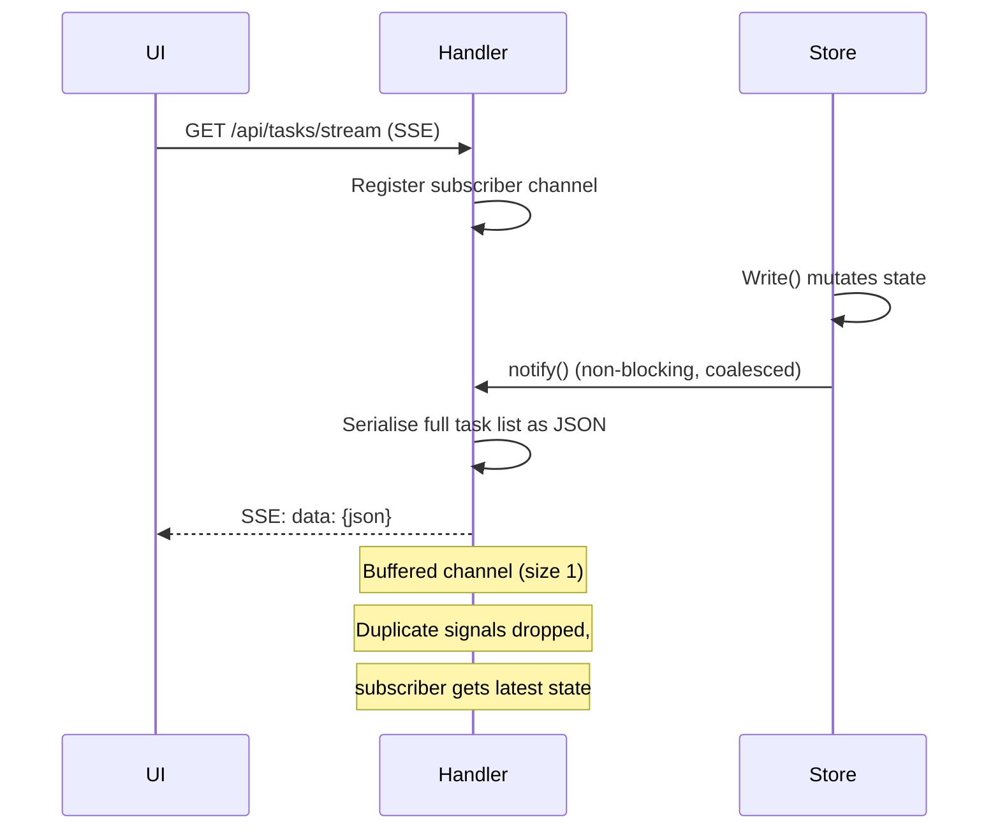
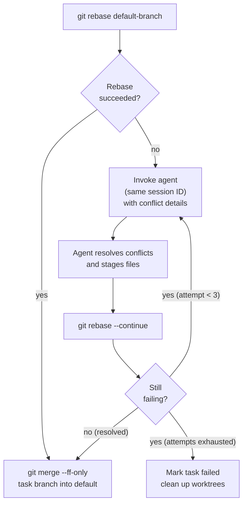
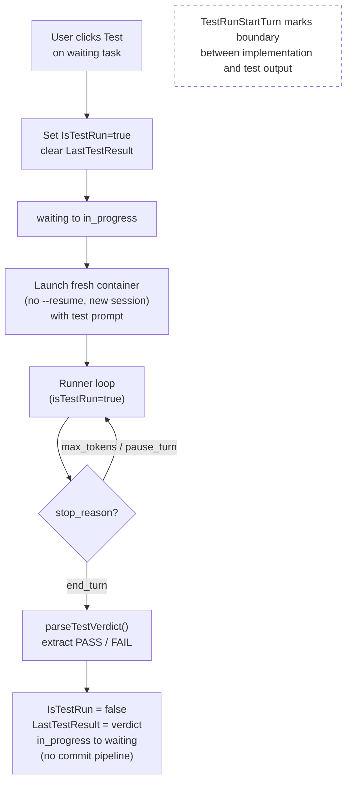
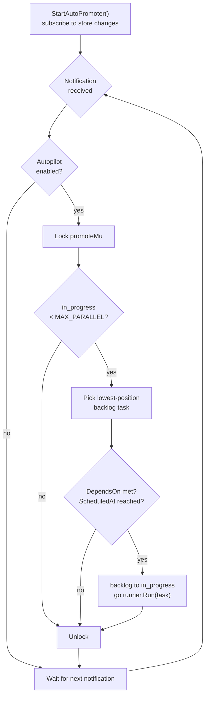
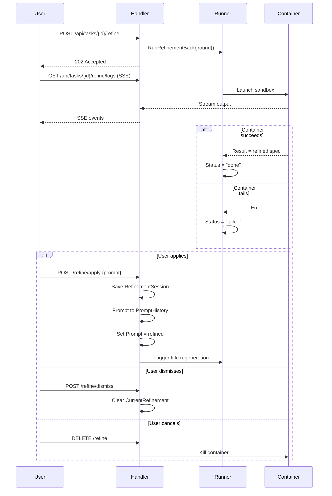
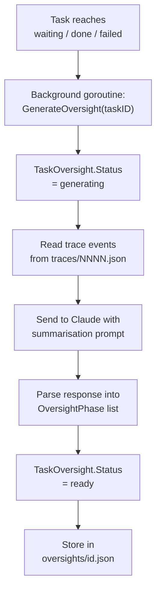
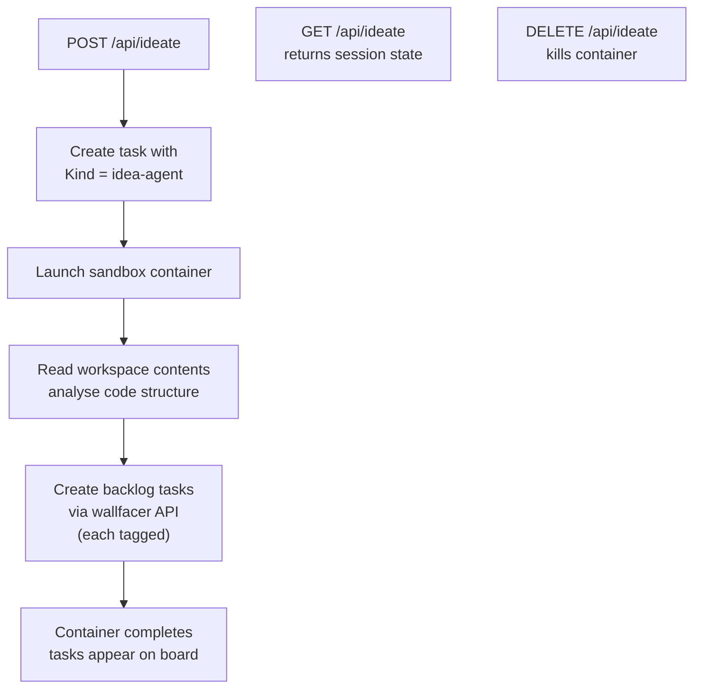

# Orchestration Flows

## HTTP API

All state changes flow through `handler.go`. The handler never blocks — long-running work is always handed off to a goroutine.

All routes are canonically defined in `internal/apicontract/routes.go`.

### Routes

| Method + Path | Handler action |
|---|---|
| **Debug & monitoring** | |
| `GET /api/debug/health` | Operational health check: goroutine count, task counts, uptime |
| `GET /api/debug/spans` | Aggregate span timing statistics across all tasks |
| `GET /api/debug/runtime` | Live server internals: pending goroutines, memory, task states, containers |
| `GET /api/debug/board` | Board manifest as seen by a hypothetical new task (no self-task, no worktree mounts) |
| `GET /api/tasks/{id}/board` | Board manifest as it appeared to a specific task (is_self=true, MountWorktrees applied) |
| **Container monitoring** | |
| `GET /api/containers` | List running sandbox containers |
| **File listing** | |
| `GET /api/files` | File listing for @ mention autocomplete |
| **Server configuration** | |
| `GET /api/config` | Get server configuration (workspaces, autopilot flags, sandbox list, payload limits) |
| `PUT /api/config` | Update server configuration (autopilot, autotest, autosubmit, sandbox assignments) |
| **Workspace management** | |
| `GET /api/workspaces/browse` | List child directories for an absolute host path |
| `PUT /api/workspaces` | Replace the active workspace set and switch the scoped task board |
| **Ideation / brainstorm** | |
| `GET /api/ideate` | Get brainstorm/ideation agent status |
| `POST /api/ideate` | Trigger the ideation agent to generate new task ideas |
| `DELETE /api/ideate` | Cancel an in-progress ideation run |
| **Environment configuration** | |
| `GET /api/env` | Get environment configuration (tokens masked) |
| `PUT /api/env` | Update environment file; omitted/empty token fields are preserved |
| `POST /api/env/test` | Test sandbox configuration by running a lightweight probe task |
| `POST /api/env/test-webhook` | Send a synthetic webhook event using the configured webhook settings |
| **Workspace instructions** | |
| `GET /api/instructions` | Get the workspace AGENTS.md content |
| `PUT /api/instructions` | Save the workspace AGENTS.md |
| `POST /api/instructions/reinit` | Rebuild workspace AGENTS.md from default template and repo files |
| **System prompt templates** | |
| `GET /api/system-prompts` | List all built-in system prompt templates with override status and content |
| `GET /api/system-prompts/{name}` | Get a single built-in system prompt template by name |
| `PUT /api/system-prompts/{name}` | Write a user override for a built-in system prompt template; validates before writing |
| `DELETE /api/system-prompts/{name}` | Remove user override, restoring the embedded default |
| **Prompt templates** | |
| `GET /api/templates` | List all prompt templates sorted by created_at descending |
| `POST /api/templates` | Create a new named prompt template |
| `DELETE /api/templates/{id}` | Delete a prompt template by ID |
| **Git workspace operations** | |
| `GET /api/git/status` | Git status for all mounted workspaces |
| `GET /api/git/stream` | SSE stream of git status updates for all workspaces |
| `POST /api/git/push` | Push a workspace to its remote |
| `POST /api/git/sync` | Fetch and rebase a workspace onto its upstream branch |
| `POST /api/git/rebase-on-main` | Fetch origin/<main> and rebase the current branch on top |
| `GET /api/git/branches` | List branches for a workspace |
| `POST /api/git/checkout` | Switch a workspace to a different branch |
| `POST /api/git/create-branch` | Create and check out a new branch in a workspace |
| `POST /api/git/open-folder` | Open a workspace directory in the OS file manager |
| **Usage & statistics** | |
| `GET /api/usage` | Aggregated token and cost usage statistics |
| `GET /api/stats` | Task status and workspace cost statistics. Optional `?workspace=<path>` restricts aggregation |
| **Task collection (no {id})** | |
| `GET /api/tasks` | List all tasks (optionally including archived) |
| `GET /api/tasks/stream` | SSE: full snapshot then incremental task-updated/task-deleted events |
| `POST /api/tasks` | Create a new task in the backlog |
| `POST /api/tasks/batch` | Create multiple tasks atomically with symbolic dependency wiring |
| `POST /api/tasks/generate-titles` | Bulk-generate titles for tasks that lack one |
| `POST /api/tasks/generate-oversight` | Bulk-generate oversight summaries for eligible tasks |
| `GET /api/tasks/search` | Search tasks by keyword |
| `POST /api/tasks/archive-done` | Archive all tasks in the done state |
| `GET /api/tasks/summaries` | List immutable task summaries for completed tasks (cost dashboard) |
| `GET /api/tasks/deleted` | List soft-deleted (tombstoned) tasks within retention window |
| **Task instance operations ({id})** | |
| `PATCH /api/tasks/{id}` | Update task fields: status, prompt, timeout, sandbox, dependencies, fresh_start |
| `DELETE /api/tasks/{id}` | Soft-delete a task (tombstone); data retained within retention window |
| `GET /api/tasks/{id}/events` | Task event timeline; supports cursor pagination (`after`, `limit`) and type filtering (`types`) |
| `POST /api/tasks/{id}/feedback` | Submit a feedback message to a waiting task |
| `POST /api/tasks/{id}/done` | Mark a waiting task as done and trigger commit-and-push |
| `POST /api/tasks/{id}/cancel` | Cancel a task: kill container and discard worktrees |
| `POST /api/tasks/{id}/resume` | Resume a failed task using its existing session |
| `POST /api/tasks/{id}/restore` | Restore a soft-deleted task by removing its tombstone |
| `POST /api/tasks/{id}/archive` | Move a done/cancelled task to the archived state |
| `POST /api/tasks/{id}/unarchive` | Restore an archived task |
| `POST /api/tasks/{id}/sync` | Rebase task worktrees onto the latest default branch |
| `POST /api/tasks/{id}/test` | Trigger the test agent for a task |

| `GET /api/tasks/{id}/diff` | Git diff of task worktrees versus the default branch |
| `GET /api/tasks/{id}/logs` | SSE stream of live container logs for a running task |
| `GET /api/tasks/{id}/outputs/{filename}` | Raw Claude Code output file for a single agent turn |
| `GET /api/tasks/{id}/turn-usage` | Per-turn token usage breakdown for a task |
| `GET /api/tasks/{id}/spans` | Span timing statistics for a task |
| `GET /api/tasks/{id}/oversight` | Oversight summary for a completed task |
| `GET /api/tasks/{id}/oversight/test` | Test oversight summary for a task |
| **Admin** | |
| `POST /api/admin/rebuild-index` | Rebuild the in-memory search index from disk |
| **Refinement agent** | |
| `POST /api/tasks/{id}/refine` | Start the refinement sandbox agent for a backlog task |
| `DELETE /api/tasks/{id}/refine` | Cancel an in-progress refinement agent |
| `GET /api/tasks/{id}/refine/logs` | Stream live logs from the refinement agent |
| `POST /api/tasks/{id}/refine/apply` | Apply the refined prompt as the new task prompt |
| `POST /api/tasks/{id}/refine/dismiss` | Dismiss the refinement result without applying it |

### Triggering Task Execution

When a `PATCH /api/tasks/{id}` request moves a task to `in_progress`, the handler:

1. Updates the task record (status, session ID)
2. Launches a background goroutine: `go h.runner.Run(id, prompt, sessionID, false)`
3. Returns `200 OK` immediately — the client does not wait for execution

The same pattern applies to feedback resumption and commit-and-push.

## Background Goroutine Model

No message queue, no worker pool. Concurrency is plain Go goroutines:

```go
// Task execution (new or resumed)
go h.runner.Run(id, prompt, sessionID, freshStart)

// Post-feedback resumption
go h.runner.Run(id, feedbackMessage, sessionID, false)

// Commit pipeline after mark-done
go func() {
    h.runner.Commit(id)
    store.UpdateStatus(id, "done")
}()
```

Tasks are long-running and IO-bound (container execution, git operations), so goroutines are appropriate — no CPU contention, and Go's scheduler handles the rest.

## Container Execution (`runner.go` `runContainer`)

Each turn launches an ephemeral container via the configured runtime (Podman or Docker):

```
<podman|docker> run --rm \
  --name wallfacer-<uuid> \
  --env-file ~/.wallfacer/.env \
  -v claude-config:/home/claude/.claude \
  -v <worktree-path>:/workspace/<repo-name> \
  -v ~/.gitconfig:/home/claude/.gitconfig:ro \
  [--cpus <limit>] [--memory <limit>] [--network <name>] \
  wallfacer:latest \
  claude -p "<prompt>" \
         --model <model> \
         --resume <session-id> \
         --verbose \
         --output-format stream-json
```

- `--rm` — container is destroyed on exit; no state leaks between tasks
- `--env-file` — injects `CLAUDE_CODE_OAUTH_TOKEN` (or `ANTHROPIC_API_KEY`), `ANTHROPIC_BASE_URL`, and any other variables from `~/.wallfacer/.env` into the container environment
- `--model` — per-task model override takes priority; falls back to `CLAUDE_DEFAULT_MODEL` from the env file; the server re-reads the file on every container launch so changes take effect immediately without a restart
- `--resume` — omitted on the first turn or when `FreshStart` is set
- `--cpus` / `--memory` — set from `WALLFACER_CONTAINER_CPUS` / `WALLFACER_CONTAINER_MEMORY` if configured
- `--network` — set from `WALLFACER_CONTAINER_NETWORK` if configured
- Output is captured as NDJSON, parsed, and saved to disk
- Stderr is saved separately if non-empty
- Output size is limited by `WALLFACER_MAX_TURN_OUTPUT_BYTES` (default 8 MB)

The container name `wallfacer-<uuid>` lets the server stream logs with `<runtime> logs -f wallfacer-<uuid>` while the container is running.

### Container Runtime Auto-Detection

The `-container` flag defaults to auto-detection (`detectContainerRuntime()` in `main.go`):

1. `/opt/podman/bin/podman` — preferred explicit Podman installation
2. `podman` on `$PATH`
3. `docker` on `$PATH`

Override with `CONTAINER_CMD` env var or `-container` flag. Both Podman and Docker are fully supported — the server handles their different JSON output formats transparently (Podman emits a JSON array from `ps --format json`; Docker emits NDJSON with one object per line).

### Circuit Breaker

Container launches are protected by a circuit breaker. After a configurable number of consecutive failures (`WALLFACER_CONTAINER_CB_THRESHOLD`), the circuit opens and rejects further launches until it resets. This prevents cascading failures when the container runtime is unhealthy.

### Board Context

Each container receives a read-only board context at `/workspace/.tasks/board.json`. This JSON manifest lists all non-archived tasks on the board — their prompts, statuses, results, branch names, and usage — so agents have cross-task awareness and can avoid conflicting changes.

The current task is marked with `"is_self": true`. The manifest is regenerated before every turn to reflect the latest state.

When `MountWorktrees` is enabled on a task, eligible sibling worktrees (from tasks in `waiting`, `failed`, or `done` status) are also mounted read-only under `/workspace/.tasks/worktrees/<short-id>/<repo>/`, allowing the agent to reference other tasks' in-progress code.

## SSE Live Update Flow

Both task state and git status use the same SSE push pattern:



`notify()` uses a buffered channel of size 1. If a signal is already pending (UI hasn't drained yet), the new signal is dropped — the subscriber will still get the latest state on the next drain. This coalesces bursts of rapid state changes into a single UI update.

The same pattern applies to `GET /api/git/stream`, except the source is a time-based ticker (polling `git status` every few seconds) rather than a store write signal.

Live container logs use a different mechanism: `GET /api/tasks/{id}/logs` opens a process pipe to `<runtime> logs -f <name>` and streams its stdout line-by-line as SSE events.

## Store Concurrency

`store.go` manages an in-memory `map[string]*Task` behind a `sync.RWMutex`:

- Reads (`List`, `Get`) acquire a read lock
- Writes (`Create`, `Update`, `UpdateStatus`) acquire a write lock, mutate memory, then atomically persist to disk (temp file + `os.Rename`)
- After every write, `notify()` is called to wake SSE subscribers

Event traces are append-only. Each event is written as a separate file (`traces/NNNN.json`) using the same atomic write pattern. Files are never modified after creation.

## Event Pagination

`GET /api/tasks/{id}/events` supports two modes:

**No query params (backward-compatible)** — returns the full event list as a plain JSON array:

```json
[{"id": 1, "event_type": "state_change", ...}, ...]
```

**With any of `after`, `limit`, or `types` present** — returns a paginated envelope:

```json
{
  "events": [...],
  "next_after": 42,
  "has_more": true,
  "total_filtered": 150
}
```

### Query Params

| Param | Type | Default | Description |
|---|---|---|---|
| `after` | int64 | `0` | Exclusive event ID cursor. Only events with `id > after` are returned. Use `next_after` from the previous response to advance the cursor. |
| `limit` | int | `200` | Maximum events per page. Must be ≥ 1; values > 1000 are silently capped to 1000. |
| `types` | string | (all) | Comma-separated list of event types to include. Unknown types return 400. Valid values: `state_change`, `output`, `error`, `system`, `feedback`, `span_start`, `span_end`. |

### Response Fields

| Field | Description |
|---|---|
| `events` | The current page of events, ordered by ascending ID. |
| `next_after` | The ID of the last event in this page; pass as `after` to get the next page. `0` when the page is empty. |
| `has_more` | `true` if there are additional events beyond this page. |
| `total_filtered` | Total number of events matching the query (respecting `after` and `types` but ignoring `limit`). Useful for progress display. |

### Pagination Walk Example

```
GET /api/tasks/{id}/events?limit=100&types=output
→ { events: [...100 items], next_after: 347, has_more: true, total_filtered: 250 }

GET /api/tasks/{id}/events?after=347&limit=100&types=output
→ { events: [...100 items], next_after: 503, has_more: true, total_filtered: 250 }

GET /api/tasks/{id}/events?after=503&limit=100&types=output
→ { events: [...50 items], next_after: 553, has_more: false, total_filtered: 250 }
```

### Validation

The handler returns 400 for:
- `after` that is not a non-negative integer
- `limit` that is not a positive integer (including 0)
- Any unrecognised value in `types`

## Token Tracking & Cost

Per-turn usage is extracted from the agent JSON output and accumulated on the `Task`:

```
TaskUsage {
  InputTokens              int
  OutputTokens             int
  CacheReadInputTokens     int
  CacheCreationTokens      int
  CostUSD                  float64
}
```

Usage is displayed on task cards and aggregated in the Done column header. It persists in `task.json` across server restarts.

In addition to the aggregate `TaskUsage`, each task records:

- `UsageBreakdown map[string]TaskUsage` keyed by activity: `implementation`, `testing`, `refinement`, `title`, `oversight`, `commit_message`, `idea_agent`. This lets the Usage tab in the task detail panel show cost per sub-agent rather than a single lump sum.
- Per-turn `TurnUsageRecord` entries accessible via `GET /api/tasks/{id}/turn-usage`, providing detailed per-turn token consumption, stop reasons, and sub-agent labels.

## Multi-Workspace Support

Multiple workspace paths can be passed at startup or switched at runtime via `PUT /api/workspaces`. For each workspace:

- Git status is polled independently and shown in the UI header
- A separate worktree is created per task per workspace
- The commit pipeline runs phases 1–3 for each workspace in sequence

Non-git directories are supported as plain mount targets (no worktree, no commit pipeline for that workspace).

## Conflict Resolution Flow

When `git rebase` fails during the commit pipeline:



Using the same session ID means the agent has full context of the original task when making conflict resolution decisions.

## Test Verification Flow

`POST /api/tasks/{id}/test` runs a separate verification agent on a `waiting` task without committing:



The UI splits the live output panel into "Implementation" and "Test" sections using `TestRunStartTurn` as the boundary.

## Autopilot (Auto-Promotion) Flow

Autopilot automatically promotes backlog tasks without user drag-and-drop:



`WALLFACER_MAX_PARALLEL` defaults to 5. The lock ensures two simultaneous state changes cannot both promote tasks, which would exceed the limit. Autopilot state is toggled via `PUT /api/config {"autopilot": true/false}` and does not persist across restarts.

## Refinement Flow

`POST /api/tasks/{id}/refine` launches a sandbox container to analyse the codebase and produce a detailed implementation spec:



## Oversight Generation Flow

Oversight is generated asynchronously whenever a task transitions to `waiting`, `done`, or `failed`. It is also regenerated periodically during execution if `WALLFACER_OVERSIGHT_INTERVAL > 0` (minutes).

`POST /api/tasks/generate-oversight` triggers generation for tasks that are missing summaries.



Served by:
- `GET /api/tasks/{id}/oversight` — implementation run summary
- `GET /api/tasks/{id}/oversight/test` — test-run summary (if a test was run)

The UI renders phases in the Oversight tab and as an interactive flamegraph Timeline.

## Ideation / Brainstorm Agent Flow



## Webhook Notifications

When `WALLFACER_WEBHOOK_URL` is configured, the server sends HTTP POST notifications on task state changes. The payload includes the task ID, old status, new status, and timestamp. If `WALLFACER_WEBHOOK_SECRET` is set, the request includes an HMAC signature header for verification.

Use `POST /api/env/test-webhook` to send a synthetic event and verify your endpoint.

## Task Search

`GET /api/tasks/search?q=<keyword>` searches across task titles, prompts, tags, and oversight text. Results are returned as `TaskSearchResult` objects with the matched field and a context snippet.

The search index is maintained in-memory and updated on task changes. Use `POST /api/admin/rebuild-index` to manually rebuild if needed.

## Span Instrumentation

Key execution phases are instrumented with `span_start` / `span_end` trace events. Each span carries a `SpanData` payload with a `Phase` (e.g. `worktree_setup`, `agent_turn`, `container_run`, `commit`) and an optional `Label` to differentiate multiple spans of the same phase.

- `GET /api/tasks/{id}/spans` — returns all span events for a task, useful for profiling turn latency
- `GET /api/debug/spans` — aggregate span timing statistics across all tasks
