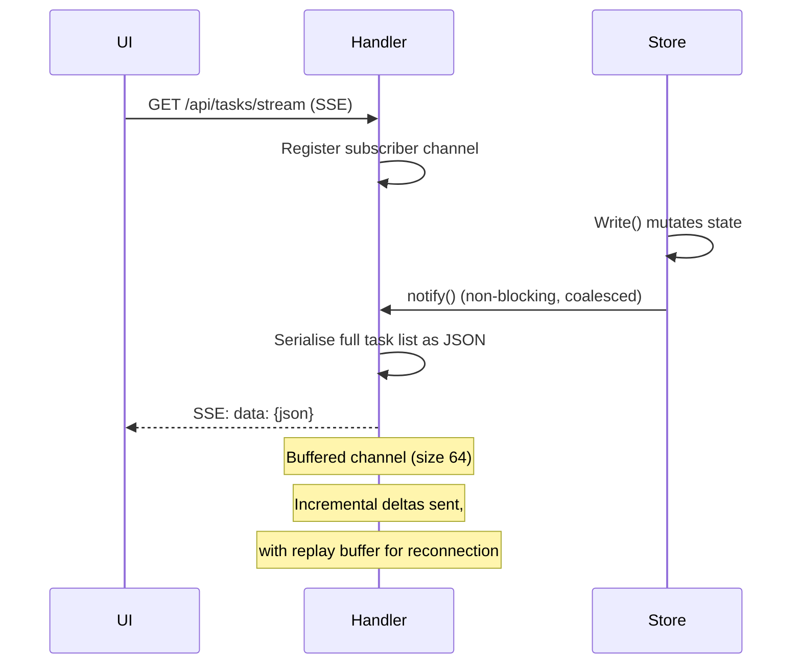
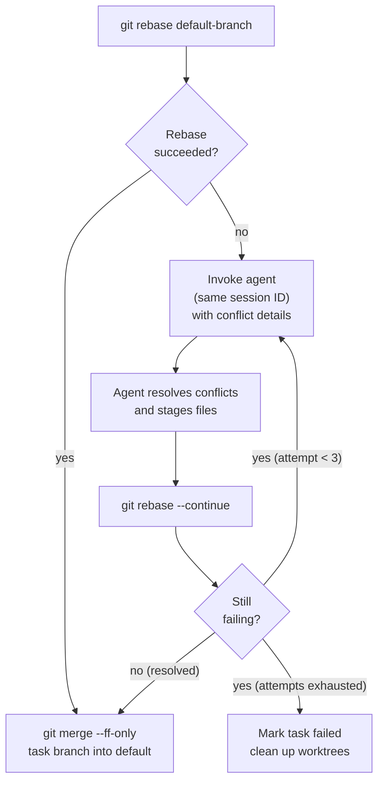
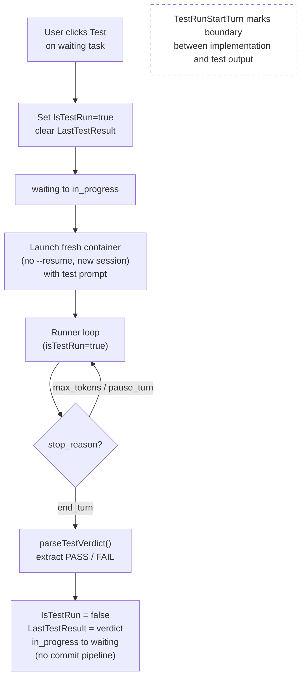
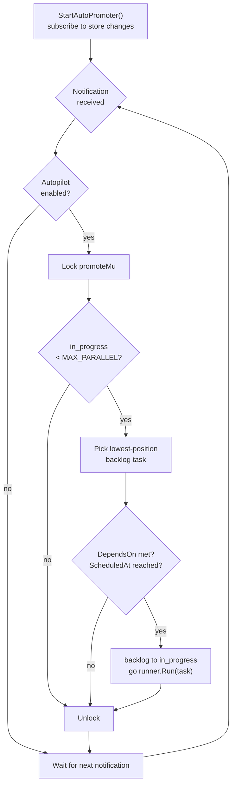
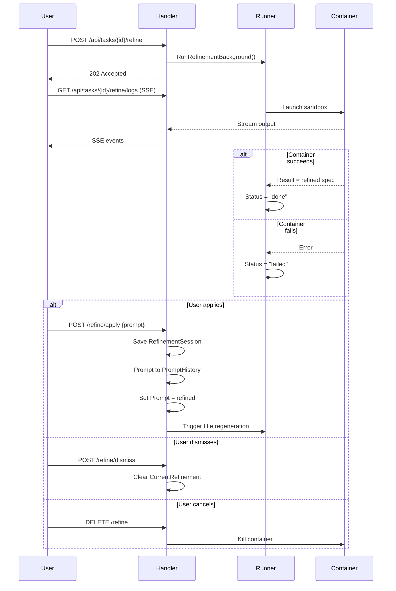
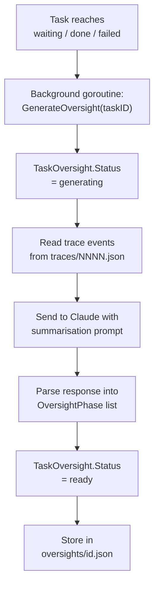
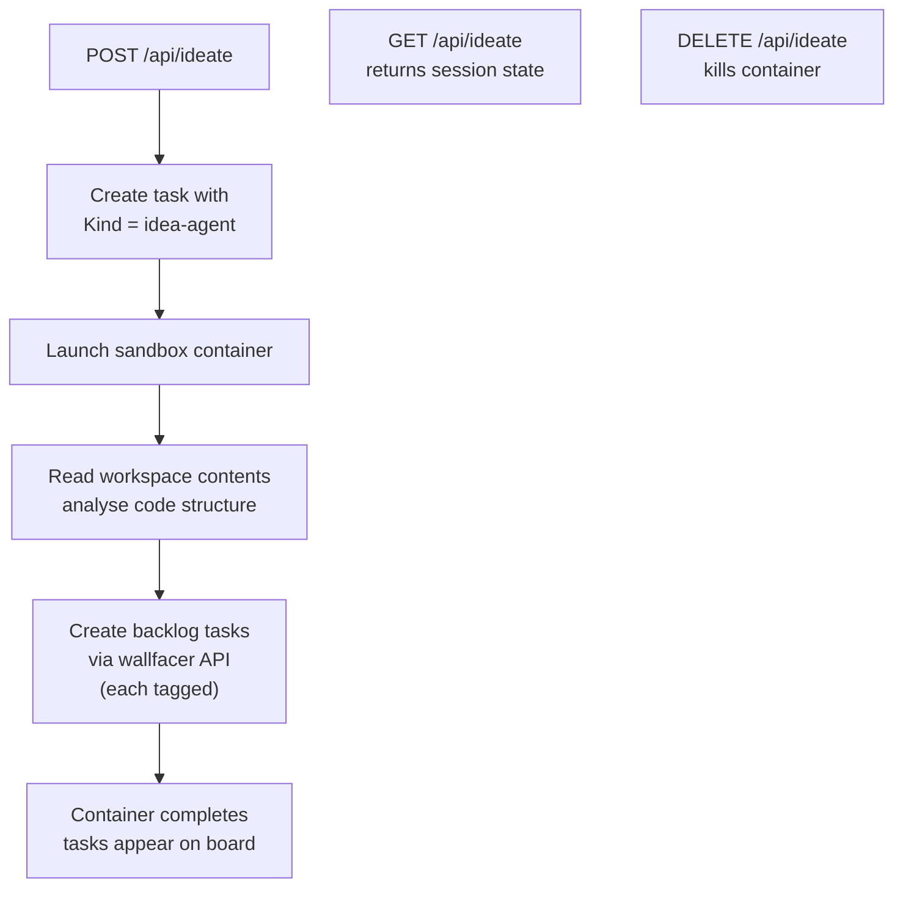
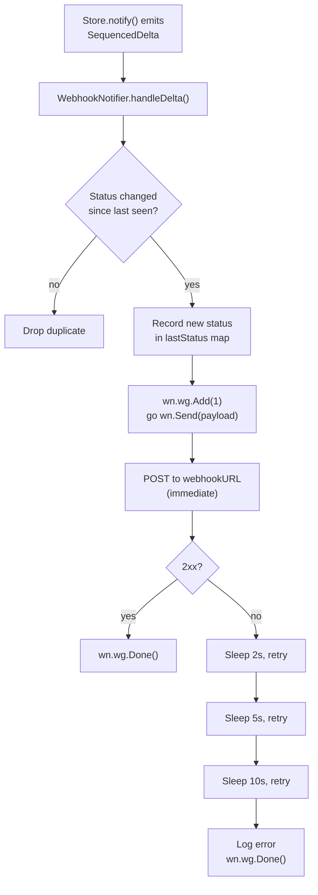
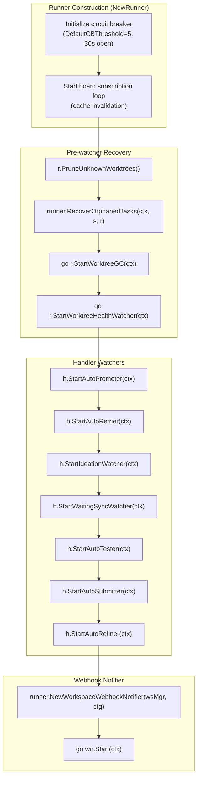
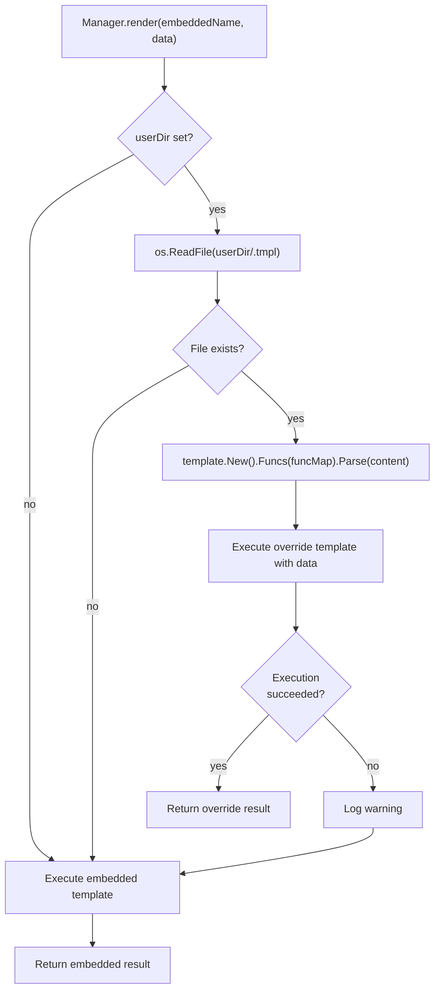

# Orchestration Flows

## HTTP API

All state changes flow through `handler.go`. The handler never blocks — long-running work is always handed off to a goroutine.

All routes are canonically defined in `internal/apicontract/routes.go`.

### Routes

| Method + Path | Handler action |
|---|---|
| **Debug & monitoring** | |
| `GET /api/debug/health` | Operational health check: goroutine count, task counts, uptime |
| `GET /api/debug/spans` | Aggregate span timing statistics across all tasks |
| `GET /api/debug/runtime` | Live server internals: pending goroutines, memory, task states, containers |
| `GET /api/debug/board` | Board manifest as seen by a hypothetical new task (no self-task, no worktree mounts) |
| `GET /api/tasks/{id}/board` | Board manifest as it appeared to a specific task (is_self=true, MountWorktrees applied) |
| **Container monitoring** | |
| `GET /api/containers` | List running sandbox containers |
| **File listing** | |
| `GET /api/files` | File listing for @ mention autocomplete |
| **Server configuration** | |
| `GET /api/config` | Get server configuration (workspaces, autopilot flags, sandbox list, payload limits) |
| `PUT /api/config` | Update server configuration (autopilot, autotest, autosubmit, sandbox assignments) |
| **Workspace management** | |
| `GET /api/workspaces/browse` | List child directories for an absolute host path |
| `PUT /api/workspaces` | Replace the active workspace set and switch the scoped task board |
| **Ideation / brainstorm** | |
| `GET /api/ideate` | Get brainstorm/ideation agent status |
| `POST /api/ideate` | Trigger the ideation agent to generate new task ideas |
| `DELETE /api/ideate` | Cancel an in-progress ideation run |
| **Environment configuration** | |
| `GET /api/env` | Get environment configuration (tokens masked) |
| `PUT /api/env` | Update environment file; omitted/empty token fields are preserved |
| `POST /api/env/test` | Test sandbox configuration by running a lightweight probe task |
| `POST /api/env/test-webhook` | Send a synthetic webhook event using the configured webhook settings |
| **Workspace instructions** | |
| `GET /api/instructions` | Get the workspace AGENTS.md content |
| `PUT /api/instructions` | Save the workspace AGENTS.md |
| `POST /api/instructions/reinit` | Rebuild workspace AGENTS.md from default template and repo files |
| **System prompt templates** | |
| `GET /api/system-prompts` | List all built-in system prompt templates with override status and content |
| `GET /api/system-prompts/{name}` | Get a single built-in system prompt template by name |
| `PUT /api/system-prompts/{name}` | Write a user override for a built-in system prompt template; validates before writing |
| `DELETE /api/system-prompts/{name}` | Remove user override, restoring the embedded default |
| **Prompt templates** | |
| `GET /api/templates` | List all prompt templates sorted by created_at descending |
| `POST /api/templates` | Create a new named prompt template |
| `DELETE /api/templates/{id}` | Delete a prompt template by ID |
| **Git workspace operations** | |
| `GET /api/git/status` | Git status for all mounted workspaces |
| `GET /api/git/stream` | SSE stream of git status updates for all workspaces |
| `POST /api/git/push` | Push a workspace to its remote |
| `POST /api/git/sync` | Fetch and rebase a workspace onto its upstream branch |
| `POST /api/git/rebase-on-main` | Fetch origin/<main> and rebase the current branch on top |
| `GET /api/git/branches` | List branches for a workspace |
| `POST /api/git/checkout` | Switch a workspace to a different branch |
| `POST /api/git/create-branch` | Create and check out a new branch in a workspace |
| `POST /api/git/open-folder` | Open a workspace directory in the OS file manager |
| **Usage & statistics** | |
| `GET /api/usage` | Aggregated token and cost usage statistics |
| `GET /api/stats` | Task status and workspace cost statistics. Optional `?workspace=<path>` restricts aggregation |
| **Task collection (no {id})** | |
| `GET /api/tasks` | List all tasks (optionally including archived) |
| `GET /api/tasks/stream` | SSE: full snapshot then incremental task-updated/task-deleted events |
| `POST /api/tasks` | Create a new task in the backlog |
| `POST /api/tasks/batch` | Create multiple tasks atomically with symbolic dependency wiring |
| `POST /api/tasks/generate-titles` | Bulk-generate titles for tasks that lack one |
| `POST /api/tasks/generate-oversight` | Bulk-generate oversight summaries for eligible tasks |
| `GET /api/tasks/search` | Search tasks by keyword |
| `POST /api/tasks/archive-done` | Archive all tasks in the done state |
| `GET /api/tasks/summaries` | List immutable task summaries for completed tasks (cost dashboard) |
| `GET /api/tasks/deleted` | List soft-deleted (tombstoned) tasks within retention window |
| **Task instance operations ({id})** | |
| `PATCH /api/tasks/{id}` | Update task fields: status, prompt, goal, timeout, sandbox, dependencies, fresh_start |
| `DELETE /api/tasks/{id}` | Permanently delete a task and its data |
| `GET /api/tasks/{id}/events` | Task event timeline; supports cursor pagination (`after`, `limit`) and type filtering (`types`) |
| `POST /api/tasks/{id}/feedback` | Submit a feedback message to a waiting task |
| `POST /api/tasks/{id}/done` | Mark a waiting task as done and trigger commit-and-push |
| `POST /api/tasks/{id}/cancel` | Cancel a task: kill container and discard worktrees |
| `POST /api/tasks/{id}/resume` | Resume a failed task using its existing session |
| `POST /api/tasks/{id}/restore` | Restore a soft-deleted task by removing its tombstone |
| `POST /api/tasks/{id}/archive` | Move a done/cancelled task to the archived state |
| `POST /api/tasks/{id}/unarchive` | Restore an archived task |
| `POST /api/tasks/{id}/sync` | Rebase task worktrees onto the latest default branch |
| `POST /api/tasks/{id}/test` | Trigger the test agent for a task |

| `GET /api/tasks/{id}/diff` | Git diff of task worktrees versus the default branch |
| `GET /api/tasks/{id}/logs` | SSE stream of live container logs for a running task |
| `GET /api/tasks/{id}/outputs/{filename}` | Raw Claude Code output file for a single agent turn |
| `GET /api/tasks/{id}/turn-usage` | Per-turn token usage breakdown for a task |
| `GET /api/tasks/{id}/spans` | Span timing statistics for a task |
| `GET /api/tasks/{id}/oversight` | Oversight summary for a completed task |
| `GET /api/tasks/{id}/oversight/test` | Test oversight summary for a task |
| **Admin** | |
| `POST /api/admin/rebuild-index` | Rebuild the in-memory search index from disk |
| **Refinement agent** | |
| `POST /api/tasks/{id}/refine` | Start the refinement sandbox agent for a backlog task |
| `DELETE /api/tasks/{id}/refine` | Cancel an in-progress refinement agent |
| `GET /api/tasks/{id}/refine/logs` | Stream live logs from the refinement agent |
| `POST /api/tasks/{id}/refine/apply` | Apply the refined prompt and goal as the new task spec |
| `POST /api/tasks/{id}/refine/dismiss` | Dismiss the refinement result without applying it |

### Triggering Task Execution

When a `PATCH /api/tasks/{id}` request moves a task to `in_progress`, the handler:

1. Updates the task record (status, session ID)
2. Launches a background goroutine: `go h.runner.Run(id, prompt, sessionID, false)`
3. Returns `200 OK` immediately — the client does not wait for execution

The same pattern applies to feedback resumption and commit-and-push.

## Background Goroutine Model

No message queue, no worker pool. Concurrency is plain Go goroutines:

```go
// Task execution (new or resumed)
go h.runner.Run(id, prompt, sessionID, freshStart)

// Post-feedback resumption
go h.runner.Run(id, feedbackMessage, sessionID, false)

// Commit pipeline after mark-done
go func() {
    h.runner.Commit(id)
    store.UpdateStatus(id, "done")
}()
```

Tasks are long-running and IO-bound (container execution, git operations), so goroutines are appropriate — no CPU contention, and Go's scheduler handles the rest.

## Container Execution (`runner.go` `runContainer`)

Each turn launches an ephemeral container via the configured runtime (Podman or Docker):

```
<podman|docker> run --rm \
  --name wallfacer-<slug>-<uuid8> \
  --env-file ~/.wallfacer/.env \
  -v claude-config:/home/claude/.claude \
  -v <worktree-path>:/workspace/<repo-name> \
  [--cpus <limit>] [--memory <limit>] --network host \
  wallfacer:latest \
  claude -p "<prompt>" \
         --model <model> \
         --resume <session-id> \
         --verbose \
         --output-format stream-json
```

- `--rm` — container is destroyed on exit; no state leaks between tasks
- `--env-file` — injects `CLAUDE_CODE_OAUTH_TOKEN` (or `ANTHROPIC_API_KEY`), `ANTHROPIC_BASE_URL`, and any other variables from `~/.wallfacer/.env` into the container environment
- `--model` — per-task model override takes priority; falls back to `CLAUDE_DEFAULT_MODEL` from the env file; the server re-reads the file on every container launch so changes take effect immediately without a restart
- `--resume` — omitted on the first turn or when `FreshStart` is set
- `--cpus` / `--memory` — set from `WALLFACER_CONTAINER_CPUS` / `WALLFACER_CONTAINER_MEMORY` if configured
- `--network` — defaults to `host`; override with `WALLFACER_CONTAINER_NETWORK`
- Output is captured as NDJSON, parsed, and saved to disk
- Stderr is saved separately if non-empty
- Output size is limited by `WALLFACER_MAX_TURN_OUTPUT_BYTES` (default 8 MB)

The container name `wallfacer-<slug>-<uuid8>` lets the server stream logs with `<runtime> logs -f wallfacer-<slug>-<uuid8>` while the container is running.

### Container Runtime Auto-Detection

The `-container` flag defaults to auto-detection (`detectContainerRuntime()` in `main.go`):

1. `/opt/podman/bin/podman` — preferred explicit Podman installation
2. `podman` on `$PATH`
3. `docker` on `$PATH`

Override with `CONTAINER_CMD` env var or `-container` flag. Both Podman and Docker are fully supported — the server handles their different JSON output formats transparently (Podman emits a JSON array from `ps --format json`; Docker emits NDJSON with one object per line).

### Circuit Breaker

Container launches are protected by a circuit breaker. After a configurable number of consecutive failures (`WALLFACER_CONTAINER_CB_THRESHOLD`), the circuit opens and rejects further launches until it resets. This prevents cascading failures when the container runtime is unhealthy. See [Circuit Breakers](../guide/circuit-breakers.md) for full details.

### Board Context

Each container receives a read-only board context at `/workspace/.tasks/board.json`. This JSON manifest lists all non-archived tasks on the board — their prompts, statuses, results, branch names, and usage — so agents have cross-task awareness and can avoid conflicting changes.

The current task is marked with `"is_self": true`. The manifest is regenerated before every turn to reflect the latest state.

When `MountWorktrees` is enabled on a task, eligible sibling worktrees (from tasks in `waiting`, `failed`, or `done` status) are also mounted read-only under `/workspace/.tasks/worktrees/<short-id>/<repo>/`, allowing the agent to reference other tasks' in-progress code.

## SSE Live Update Flow

Both task state and git status use the same SSE push pattern:



`notify()` uses buffered channels of size 64. Each state change produces a `SequencedDelta` that is fanned out to all subscribers. A replay buffer (up to 512 entries) enables reconnecting clients to catch up on missed deltas.

The same pattern applies to `GET /api/git/stream`, except the source is a time-based ticker (polling `git status` every few seconds) rather than a store write signal.

Live container logs use a different mechanism: `GET /api/tasks/{id}/logs` opens a process pipe to `<runtime> logs -f <name>` and streams its stdout line-by-line as SSE events.

## Store Concurrency

`store.go` manages an in-memory `map[uuid.UUID]*Task` behind a `sync.RWMutex`:

- Reads (`List`, `Get`) acquire a read lock
- Writes (`Create`, `Update`, `UpdateStatus`) acquire a write lock, mutate memory, then atomically persist to disk (temp file + `os.Rename`)
- After every write, `notify()` is called to wake SSE subscribers

Event traces are append-only. Each event is written as a separate file (`traces/NNNN.json`) using the same atomic write pattern. Files are never modified after creation.

## Event Pagination

`GET /api/tasks/{id}/events` supports two modes:

**No query params (backward-compatible)** — returns the full event list as a plain JSON array:

```json
[{"id": 1, "event_type": "state_change", ...}, ...]
```

**With any of `after`, `limit`, or `types` present** — returns a paginated envelope:

```json
{
  "events": [...],
  "next_after": 42,
  "has_more": true,
  "total_filtered": 150
}
```

### Query Params

| Param | Type | Default | Description |
|---|---|---|---|
| `after` | int64 | `0` | Exclusive event ID cursor. Only events with `id > after` are returned. Use `next_after` from the previous response to advance the cursor. |
| `limit` | int | `200` | Maximum events per page. Must be >= 1; values > 1000 are silently capped to 1000. |
| `types` | string | (all) | Comma-separated list of event types to include. Unknown types return 400. Valid values: `state_change`, `output`, `error`, `system`, `feedback`, `span_start`, `span_end`. |

### Response Fields

| Field | Description |
|---|---|
| `events` | The current page of events, ordered by ascending ID. |
| `next_after` | The ID of the last event in this page; pass as `after` to get the next page. `0` when the page is empty. |
| `has_more` | `true` if there are additional events beyond this page. |
| `total_filtered` | Total number of events matching the query (respecting `after` and `types` but ignoring `limit`). Useful for progress display. |

### Pagination Walk Example

```
GET /api/tasks/{id}/events?limit=100&types=output
-> { events: [...100 items], next_after: 347, has_more: true, total_filtered: 250 }

GET /api/tasks/{id}/events?after=347&limit=100&types=output
-> { events: [...100 items], next_after: 503, has_more: true, total_filtered: 250 }

GET /api/tasks/{id}/events?after=503&limit=100&types=output
-> { events: [...50 items], next_after: 553, has_more: false, total_filtered: 250 }
```

### Validation

The handler returns 400 for:
- `after` that is not a non-negative integer
- `limit` that is not a positive integer (including 0)
- Any unrecognised value in `types`

## Token Tracking & Cost

Per-turn usage is extracted from the agent JSON output and accumulated on the `Task`:

```
TaskUsage {
  InputTokens              int
  OutputTokens             int
  CacheReadInputTokens     int
  CacheCreationTokens      int
  CostUSD                  float64
}
```

Usage is displayed on task cards and aggregated in the Done column header. It persists in `task.json` across server restarts.

In addition to the aggregate `TaskUsage`, each task records:

- `UsageBreakdown map[string]TaskUsage` keyed by activity: `implementation`, `testing`, `refinement`, `title`, `oversight`, `commit_message`, `idea_agent`. This lets the Usage tab in the task detail panel show cost per sub-agent rather than a single lump sum.
- Per-turn `TurnUsageRecord` entries accessible via `GET /api/tasks/{id}/turn-usage`, providing detailed per-turn token consumption, stop reasons, and sub-agent labels.

## Multi-Workspace Support

Multiple workspace paths can be passed at startup or switched at runtime via `PUT /api/workspaces`. For each workspace:

- Git status is polled independently and shown in the UI header
- A separate worktree is created per task per workspace
- The commit pipeline runs phases 1-3 for each workspace in sequence

Non-git directories are supported as plain mount targets (no worktree, no commit pipeline for that workspace).

## Conflict Resolution Flow

When `git rebase` fails during the commit pipeline:



Using the same session ID means the agent has full context of the original task when making conflict resolution decisions.

## Test Verification Flow

`POST /api/tasks/{id}/test` runs a separate verification agent on a `waiting` task without committing:



The UI splits the live output panel into "Implementation" and "Test" sections using `TestRunStartTurn` as the boundary.

## Autopilot (Auto-Promotion) Flow

Autopilot automatically promotes backlog tasks without user drag-and-drop:



`WALLFACER_MAX_PARALLEL` defaults to 5. The lock ensures two simultaneous state changes cannot both promote tasks, which would exceed the limit. Autopilot state is toggled via `PUT /api/config {"autopilot": true/false}` and does not persist across restarts.

## Refinement Flow

`POST /api/tasks/{id}/refine` launches a sandbox container to analyse the codebase and produce a detailed implementation spec:



## Oversight Generation Flow

Oversight is generated asynchronously whenever a task transitions to `waiting`, `done`, or `failed`. It is also regenerated periodically during execution if `WALLFACER_OVERSIGHT_INTERVAL > 0` (minutes).

`POST /api/tasks/generate-oversight` triggers generation for tasks that are missing summaries.



Served by:
- `GET /api/tasks/{id}/oversight` — implementation run summary
- `GET /api/tasks/{id}/oversight/test` — test-run summary (if a test was run)

The UI renders phases in the Oversight tab and as an interactive flamegraph Timeline.

## Ideation / Brainstorm Agent Flow



## Webhook Notifications

When `WALLFACER_WEBHOOK_URL` is configured, the server sends HTTP POST notifications on task state changes. The payload includes the task ID, old status, new status, and timestamp. If `WALLFACER_WEBHOOK_SECRET` is set, the request includes an HMAC signature header for verification.

Use `POST /api/env/test-webhook` to send a synthetic event and verify your endpoint.

## Task Search

`GET /api/tasks/search?q=<keyword>` searches across task titles, prompts, tags, and oversight text. Results are returned as `TaskSearchResult` objects with the matched field and a context snippet.

The search index is maintained in-memory and updated on task changes. Use `POST /api/admin/rebuild-index` to manually rebuild if needed.

## Span Instrumentation

Key execution phases are instrumented with `span_start` / `span_end` trace events. Each span carries a `SpanData` payload with a `Phase` (e.g. `worktree_setup`, `agent_turn`, `container_run`, `commit`) and an optional `Label` to differentiate multiple spans of the same phase.

- `GET /api/tasks/{id}/spans` — returns all span events for a task, useful for profiling turn latency
- `GET /api/debug/spans` — aggregate span timing statistics across all tasks

---

## Environment Configuration

### File Location and Parsing

The environment configuration lives at `~/.wallfacer/.env`. It is a standard dotenv file: blank lines and lines starting with `#` are ignored, an optional `export ` prefix is stripped, values may be quoted (single or double), and inline comments after unquoted values are stripped while literal `#` inside quoted strings is preserved.

`envconfig.Parse(path)` (`internal/envconfig/envconfig.go`) reads the file and returns a typed `envconfig.Config` struct. The parser is permissive — unknown keys are silently skipped, and integer fields that fail to parse are left at their zero value (which triggers default behavior downstream).

### Config Fields

The `Config` struct covers all known keys. Key categories:

| Category | Fields |
|---|---|
| **Authentication** | `OAuthToken` (`CLAUDE_CODE_OAUTH_TOKEN`), `APIKey` (`ANTHROPIC_API_KEY`), `AuthToken` (`ANTHROPIC_AUTH_TOKEN`), `ServerAPIKey` (`WALLFACER_SERVER_API_KEY`) |
| **Claude model** | `BaseURL`, `DefaultModel`, `TitleModel` |
| **OpenAI/Codex** | `OpenAIAPIKey`, `OpenAIBaseURL`, `CodexDefaultModel`, `CodexTitleModel` |
| **Parallelism** | `MaxParallelTasks`, `MaxTestParallelTasks` |
| **Sandbox routing** | `DefaultSandbox`, `ImplementationSandbox`, `TestingSandbox`, `RefinementSandbox`, `TitleSandbox`, `OversightSandbox`, `CommitMessageSandbox`, `IdeaAgentSandbox`, `SandboxFast` |
| **Container** | `ContainerNetwork`, `ContainerCPUs`, `ContainerMemory` |
| **Webhooks** | `WebhookURL`, `WebhookSecret` |
| **Behavior** | `OversightInterval`, `ArchivedTasksPerPage`, `AutoPushEnabled`, `AutoPushThreshold` |
| **Workspaces** | `Workspaces` (parsed from OS path-list separator via `filepath.SplitList`) |

The `SandboxFast` field defaults to `true` when unset — the parser initializes it before scanning lines, and it is only set to `false` when the env file explicitly contains `WALLFACER_SANDBOX_FAST=false`.

### Atomic Updates

`envconfig.Update(path, updates)` performs a read-modify-write merge:

1. Reads the existing file line-by-line.
2. For each line whose key matches an entry in the `Updates` struct:
   - `nil` pointer: line is left unchanged (field preservation for omitted token fields).
   - Non-nil, non-empty: line is replaced with `KEY=value`.
   - Non-nil, empty string: line is removed (cleared).
3. New keys not already in the file are appended in the stable order defined by `knownKeys`.
4. The result is written atomically via a temp file + `os.Rename`.

This design means that `PUT /api/env` can safely omit token fields — they are preserved in the file as-is. The handler only sets a pointer when the caller explicitly provides a value.

### Propagation to Running Components

The env file is re-read on every container launch (`r.modelFromEnvForSandbox`, `r.resolvedContainerNetwork`, etc.), so changes made via the UI take effect immediately for new containers without a server restart. Running containers are unaffected — they received their environment at launch time via `--env-file`.

Watchers (auto-promoter, auto-retrier, etc.) do not directly subscribe to env file changes. They read configuration values from in-memory state on the `Handler` or `Runner` structs, which are populated from the env file at startup. Some values (like `MaxParallelTasks`) are re-read from the env file whenever they are needed by the promoter logic.

---

## Webhook Implementation

### Payload Structure

Every webhook delivery is an HTTP POST with a JSON body of type `WebhookPayload` (`internal/runner/webhook.go`):

```json
{
  "event_type": "task.state_changed",
  "task_id": "abc12345-...",
  "status": "done",
  "title": "Fix auth regression",
  "prompt": "Fix the login flow...",
  "result": "Applied fix to auth.go...",
  "occurred_at": "2026-03-21T12:00:00Z"
}
```

Fields are truncated to prevent oversized payloads: `title` to 80 characters, `prompt` to 200, `result` to 500. If `title` is empty, it falls back to the first 80 characters of the prompt.

### HMAC-SHA256 Signature

When `WALLFACER_WEBHOOK_SECRET` is configured, each request includes the header:

```
X-Wallfacer-Signature: sha256=<hex-encoded-hmac>
```

The HMAC is computed over the raw JSON body bytes using `crypto/hmac` with `sha256.New` and the secret as the key. Receivers should recompute the HMAC and compare using `hmac.Equal` to verify authenticity.

An additional header `X-Wallfacer-Event: task.state_changed` identifies the event type.

### Delivery Model



Key implementation details:

- **Deduplication**: The notifier maintains a `lastStatus` map keyed by task UUID. Only transitions to a genuinely new status trigger a delivery — repeated notifications for the same status (e.g., from a position-only update) are silently dropped.
- **Async goroutine pool**: Each delivery runs in its own goroutine, tracked by `wn.wg` (`sync.WaitGroup`). There is no fixed pool size; goroutines are spawned per-event.
- **Retry schedule**: 4 attempts total — immediate, then 2s, 5s, 10s delays. The backoff durations are configurable via `SetRetryBackoffs()`. Inter-attempt sleeps respect context cancellation.
- **HTTP client**: 10-second timeout per request (`http.Client{Timeout: 10 * time.Second}`).

### Graceful Shutdown

During server shutdown, after the HTTP server stops and `Runner.Shutdown()` completes, `wn.Wait()` blocks until all in-flight deliveries finish. This ensures no webhook is silently dropped on process exit.

### Workspace-Aware Notifier

`NewWorkspaceWebhookNotifier(wsMgr, cfg)` creates a notifier that re-subscribes to the active store whenever the workspace manager switches workspaces. It listens on both the workspace manager's channel (for workspace switches) and the current store's delta channel (for task changes).

### Test Webhook

`POST /api/env/test-webhook` constructs a synthetic `WebhookPayload` with a fake task ID and delivers it to the configured URL, returning the HTTP status code and any error to the caller. Useful for verifying endpoint connectivity and signature verification before relying on it in production.

---

## Container Runtime Details

### Auto-Detection Order

`detectContainerRuntime()` in `main.go` probes for a container runtime in this order:

1. `CONTAINER_CMD` environment variable — if set, used verbatim (highest priority).
2. `/opt/podman/bin/podman` — checks for the file with `os.Stat`.
3. `podman` on `$PATH` — found via `exec.LookPath`.
4. `docker` on `$PATH` — found via `exec.LookPath`.
5. Falls back to `/opt/podman/bin/podman` as a hardcoded default (so the error message is clear when nothing is found).

The `-container` CLI flag can also override the detected runtime.

### Podman vs Docker Format Differences

The server handles format differences transparently in `parseContainerList()` (`internal/runner/runner.go`):

| Aspect | Podman | Docker |
|---|---|---|
| `ps --format json` output | JSON array (`[{...}, ...]`) | NDJSON (one `{...}` per line) |
| `Names` field | `[]string` | `string` |
| `Created` field | `int64` (unix timestamp) | `string` (formatted datetime) |

The `containerJSON` struct uses `json.RawMessage` for `Names` and `any` for `Created`, then tries both formats in sequence.

### Image Pull Logic

`ensureImage()` in `server.go` runs at startup:

1. **Check local**: `<runtime> images -q <image>` — if output is non-empty, the image exists locally and is used as-is.
2. **Pull from registry**: `<runtime> pull <image>` — streams stdout/stderr to the terminal. The default image is `ghcr.io/changkun/wallfacer:latest`.
3. **Fallback to local**: If the pull fails and the requested image differs from `wallfacer:latest`, check whether `wallfacer:latest` exists locally. If so, use it instead.
4. **No image**: If neither the remote nor local fallback is available, the server starts anyway but warns that tasks may fail.

### Container Labels

Every task container is labeled with metadata for monitoring and correlation:

```
--label wallfacer.task.id=<uuid>
--label wallfacer.task.prompt=<first 80 chars>
```

These labels are set in `buildContainerArgsForSandbox()` (`internal/runner/container.go`). The `ListContainers()` method reads these labels to correlate containers to tasks without relying on container name parsing — this is the primary lookup path, with name-based UUID extraction as a legacy fallback.

### Resource Limits

Container resource limits follow a three-tier resolution order (in `resolvedContainerCPUs()`, `resolvedContainerMemory()`, `resolvedContainerNetwork()`):

1. Explicit `RunnerConfig` value passed at construction time.
2. Value from `~/.wallfacer/.env` (re-read on each container launch).
3. Default: no CPU/memory limit; `host` network.

```
[--cpus 2.0]       # from WALLFACER_CONTAINER_CPUS
[--memory 4g]      # from WALLFACER_CONTAINER_MEMORY
[--network mynet]   # from WALLFACER_CONTAINER_NETWORK, default "host"
```

---

## SSE Implementation Details

### Task Stream (`GET /api/tasks/stream`)

Implemented in `Handler.StreamTasks()` (`internal/handler/stream.go`).

#### Subscriber Registration

On each SSE connection, the handler calls `store.Subscribe()`, which allocates a buffered channel of size 64 (`make(chan SequencedDelta, 64)`) and registers it in the store's `subscribers` map under a monotonically increasing integer ID.

The subscription is created **before** reading any state, ensuring no events are missed between the initial snapshot and the live loop.

#### Event Types

Three SSE event types are emitted:

| SSE `event:` | When | `data:` payload |
|---|---|---|
| `snapshot` | Initial connection or gap-too-old reconnect | Full `[]Task` JSON array |
| `task-updated` | Task created or mutated | Single `Task` JSON object |
| `task-deleted` | Task soft-deleted | `{"id": "<uuid>"}` |

Every SSE frame includes an `id:` field set to the delta sequence number, enabling the browser's built-in `Last-Event-ID` reconnection mechanism.

#### Reconnection and Replay

On reconnect, the client provides its last seen sequence via the `?last_event_id` query parameter or the `Last-Event-ID` HTTP header. The store's `DeltasSince(seq)` method binary-searches the replay buffer (up to 512 entries, `replayBufMax`) for deltas newer than the given sequence:

- **Buffer covers the gap**: Missed deltas are replayed individually as `task-updated` / `task-deleted` events. No full snapshot is needed.
- **Gap too old** (oldest buffered delta's Seq > requested seq + 1): Falls back to a full `snapshot` event via `ListTasksAndSeq()`, which reads both the task list and current sequence under the same read lock to guarantee consistency.

#### Backpressure and Dropped Events

`notify()` uses a non-blocking send to each subscriber channel:

```go
select {
case ch <- cloneSequencedDelta(sd):
default:  // channel full — drop this delta for this subscriber
}
```

If a subscriber's buffer (64 slots) is full, the delta is silently dropped for that subscriber. The subscriber will eventually receive a later delta; if it reconnects, the replay buffer provides catch-up. All deltas sent to subscribers are deep clones of the task state, preventing data races.

#### Connection Cleanup

When the client disconnects, `r.Context().Done()` fires in the SSE loop. The deferred `store.Unsubscribe(subID)` removes the channel from the subscribers map and drains any buffered deltas to free memory. The channel is **not** closed — `StreamTasks` is always the caller of `Unsubscribe`, so there is no blocked receiver to wake.

### Wake-Only Subscribers

In addition to the full-delta channel, the store provides a lightweight `SubscribeWake()` mechanism: a `chan struct{}` with capacity 1. Rapid bursts of notifications coalesce — once the channel is full, subsequent sends are no-ops. This is used by watchers (auto-promoter, auto-retrier, etc.) that only need a "something changed" signal, not the full delta payload.

### Git Status Stream (`GET /api/git/stream`)

Implemented in `Handler.GitStatusStream()` (`internal/handler/git.go`). Unlike the task stream, git status uses a **polling ticker** (every 5 seconds) rather than store-driven pub/sub. On each tick, the handler collects `git status` for all workspaces, JSON-marshals the result, compares it byte-for-byte with the previous emission, and only sends an SSE frame if the data has changed.

### Live Container Logs (`GET /api/tasks/{id}/logs`)

Not SSE in the strict sense — this endpoint streams raw `text/plain` output. It spawns `<runtime> logs -f --tail 100 <containerName>` as a subprocess, pipes stdout and stderr through a scanner, and writes lines to the HTTP response. A 15-second keepalive ticker sends empty newlines to keep the connection alive and detect client disconnects.

---

## Watcher Initialization and Startup

### Startup Sequence in `server.go`

The server starts watchers and recovery routines in a specific order after constructing the `Runner` and `Handler`:



### Recovery Scans

Before watchers begin, two recovery operations run synchronously:

- **`PruneUnknownWorktrees()`**: Scans the `worktrees/` directory and removes any worktree directories that do not correspond to a known task. Also runs `git worktree prune` on each workspace repository to clean up stale Git worktree references.
- **`RecoverOrphanedTasks()`**: Scans all tasks in `in_progress` or `committing` status. For each, it checks whether a corresponding container is still running. If so, it starts a monitoring goroutine. If not (container crashed while the server was down), it transitions the task to `failed`.

### Watcher Subscription Patterns

All handler-level watchers follow one of two patterns:

**Store-driven (SubscribeWake)**: The auto-promoter, auto-retrier, auto-tester, auto-submitter, and auto-refiner call `store.SubscribeWake()` to get a capacity-1 channel that signals "something changed." They react to the signal by scanning tasks and taking action if conditions are met.

```go
// Auto-promoter pattern
subID, ch := h.store.SubscribeWake()
ticker := time.NewTicker(60 * time.Second)
go func() {
    defer h.store.UnsubscribeWake(subID)
    defer ticker.Stop()
    for {
        select {
        case <-ctx.Done(): return
        case <-ch:         h.tryAutoPromote(ctx)
        case <-ticker.C:   h.tryAutoPromote(ctx)
        }
    }
}()
```

The supplementary ticker (60 seconds for the promoter) ensures scheduled tasks are promoted even when no other state change occurs.

**Startup recovery scan**: The auto-retrier additionally performs a startup scan — immediately after subscribing, it lists all failed tasks and attempts to retry any that match the transient failure categories (`container_crash`, `worktree`, `sync_error`). This catches tasks that failed while the server was down.

### Circuit Breaker Initialization

The container circuit breaker is initialized in `NewRunner()` with:
- **Threshold**: `WALLFACER_CONTAINER_CB_THRESHOLD` (default: 5 consecutive failures).
- **Open duration**: `WALLFACER_CONTAINER_CB_OPEN_SECONDS` (default: 30 seconds).

After the threshold is exceeded, the circuit opens and rejects further launches. After the open duration, it enters half-open state and allows a single probe. A successful probe resets the breaker; a failed probe re-opens it.

---

## System Prompt Template System

### Embedded Templates

Seven prompt templates are embedded into the binary at compile time via `go:embed *.tmpl` in the `prompts` package (`prompts/prompts.go`):

| Embedded file | API name | Used for |
|---|---|---|
| `title.tmpl` | `title` | Auto-generating task titles from prompts |
| `commit.tmpl` | `commit_message` | Generating commit messages during the commit pipeline |
| `test.tmpl` | `test_verification` | Test verification agent prompt |
| `refinement.tmpl` | `refinement` | Prompt refinement agent |
| `oversight.tmpl` | `oversight` | Oversight summarization of task activity |
| `ideation.tmpl` | `ideation` | Brainstorm/ideation agent |
| `conflict.tmpl` | `conflict_resolution` | Rebase conflict resolution agent |

### Override Storage

User overrides are stored at `~/.wallfacer/prompts/<apiName>.tmpl`. The `Manager` checks this directory on every render call — no caching, so edits take effect immediately.

### Render Pipeline



Key design: a broken override never crashes the server. Parse or execution errors are logged as warnings and the embedded default is used instead.

### Template Function Map

All templates (embedded and override) share a single `FuncMap`:

- `add(a, b int) int` — integer addition, used for 1-based indexing in templates (e.g., `{{add $i 1}}`).

### Validation

`Manager.Validate(apiName, content)` performs a two-phase check:
1. **Parse**: verifies template syntax.
2. **Dry-run execute**: runs the template against a mock context struct (`mockContextFor()`) specific to each API name. This catches field-access errors (e.g., referencing `.NonExistentField`) at write time rather than at runtime.

`PUT /api/system-prompts/{name}` calls `Validate` before writing the override file.

### API Endpoints

| Method | Path | Behavior |
|---|---|---|
| `GET /api/system-prompts` | Lists all 7 templates with their content and override status |
| `GET /api/system-prompts/{name}` | Returns a single template by API name |
| `PUT /api/system-prompts/{name}` | Validates and writes override to `~/.wallfacer/prompts/<name>.tmpl` |
| `DELETE /api/system-prompts/{name}` | Deletes the override file, restoring the embedded default |

---

## Prompt Template Storage

Prompt templates are user-created reusable text fragments (distinct from the system prompt templates above). They are managed by `internal/handler/templates.go`.

### Data Model

```go
type PromptTemplate struct {
    ID        string    `json:"id"`
    Name      string    `json:"name"`
    Body      string    `json:"body"`
    CreatedAt time.Time `json:"created_at"`
}
```

- **ID**: UUID generated via `uuid.New().String()` on creation.
- **CreatedAt**: set to `time.Now().UTC()` on creation.

### Storage

All templates are stored in a single JSON file at `~/.wallfacer/templates.json` as a JSON array. Reads and writes are protected by a package-level `sync.RWMutex` (`templatesMu`). Writes use the atomic temp-file-plus-rename pattern.

### API Behavior

| Endpoint | Notes |
|---|---|
| `GET /api/templates` | Returns all templates sorted by `created_at` descending (newest first). Returns `[]` when the file does not exist. |
| `POST /api/templates` | Requires `name` and `body` (both non-empty). Returns 201 with the created template. |
| `DELETE /api/templates/{id}` | Returns 404 if not found, 204 on success. |
