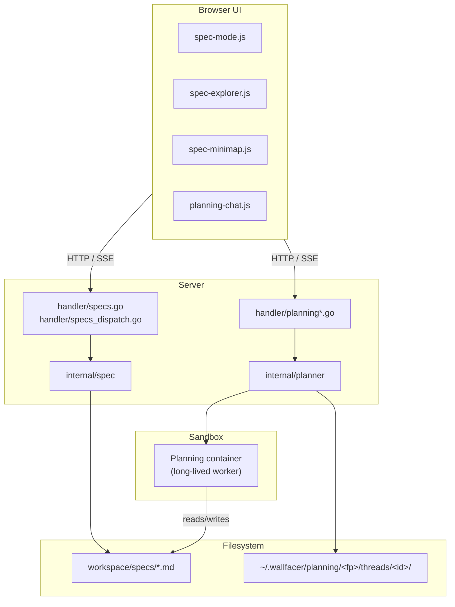
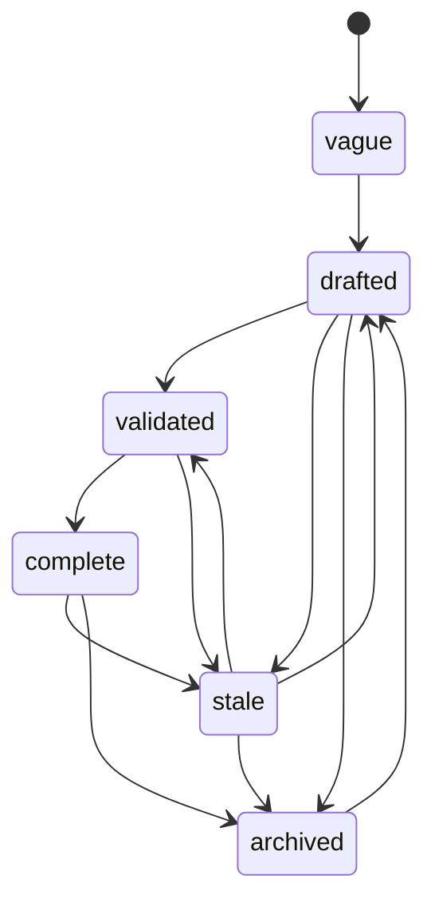
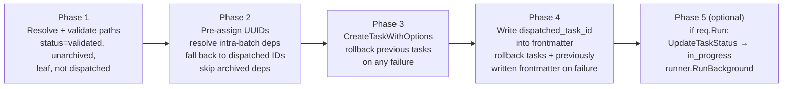

# Plan Mode

Plan Mode is the specification-coordination subsystem that turns free-form design discussions into structured, validated specs, and turns validated specs into kanban tasks. It is built around three components: the `internal/spec` package (the document model), the `internal/planner` package (the long-lived planning sandbox and per-thread chat persistence), and a set of `internal/handler` endpoints that wire them together and surface them through the UI.

## System Overview



Plan Mode layers strictly on top of the task board. The planning container writes only to `specs/` in the mounted workspace; task dispatch is the hand-off point at which a validated spec becomes a first-class kanban task with its own worktree and container. Everything upstream of dispatch is the responsibility of this subsystem.

## Package: internal/spec

### Document Model

`internal/spec/model.go` defines the on-disk shape of a spec document. Every spec is a markdown file with YAML frontmatter and a markdown body:

```go
type Spec struct {
    Title            string
    Status           Status    // vague | drafted | validated | complete | stale | archived
    DependsOn        []string
    Affects          []string
    Effort           Effort    // small | medium | large | xlarge
    Created, Updated Date
    Author           string
    DispatchedTaskID *string

    // Derived fields (not from YAML).
    Path  string
    Track string
    Body  string  // excluded from API responses
}
```

`Status` enumerates the six lifecycle states; `Effort` enumerates the four size buckets. Both sets are exposed via `ValidStatuses()` and `ValidEfforts()`. The `Date` type marshals from `YYYY-MM-DD` YAML scalars and serialises to the same shape in JSON. `Path` and `Track` are filled by the tree builder (they are not user-authored frontmatter). `Body` is kept in the Go struct but omitted from JSON responses because specs can be kilobytes long and the frontend renders bodies lazily through the file explorer endpoints.

### Lifecycle State Machine

`internal/spec/lifecycle.go` defines the allowed transitions:



| From      | Allowed Targets                      |
|-----------|--------------------------------------|
| vague     | drafted                              |
| drafted   | validated, stale, archived           |
| validated | complete, stale                      |
| complete  | stale, archived                      |
| stale     | drafted, validated, archived         |
| archived  | drafted                              |

The machine is built atop `internal/pkg/statemachine.New`; handlers validate transitions through `spec.StatusMachine.Validate(from, to)` and convert `ErrInvalidTransition` errors into HTTP 422 responses.

### Tree Builder

`internal/spec/tree.go` produces the in-memory `Tree` that backs the explorer and the dispatch pipeline. `BuildTree(specsDir)` walks each track directory under `specs/` and parses every `.md` file into a `Spec`. A spec named `foo.md` claims a companion directory `foo/` for its children: `specs/local/foo.md` is the parent of any `.md` files under `specs/local/foo/`.

Parse errors are collected in `Tree.Errs` rather than aborting the build. This matters because the UI must keep rendering when a single spec has broken frontmatter — the corresponding node is simply skipped.

After a subtree scan, `reorderChildren` rewrites the parent's `Children` slice so children appear in the order their markdown links are cited in the parent's body (via the regexp `\[[^\]]*\]\(([^)]+\.md)\)`). Unreferenced children keep their alphabetical order and are appended after referenced ones.

Orphan directories (a `foo/` with no `foo.md` sibling) are still scanned; their children are reparented to the orphan's parent key so no spec falls out of the tree. `checkOrphanDirectories` surfaces these as validation warnings for human attention.

### Validation

`internal/spec/validate.go` runs two tiers of rules. Per-spec rules (`ValidateSpec`):

- **required-fields** — `title`, `status`, `effort`, `created`, `updated`, `author` must all be non-empty.
- **valid-status / valid-effort** — enum check against `ValidStatuses` and `ValidEfforts`.
- **date-ordering** — `updated` must not precede `created`.
- **no-self-dependency** — a spec path cannot appear in its own `depends_on`.
- **dispatch-consistency** — non-leaf specs must not have `dispatched_task_id`.
- **depends-on-exist** — every `depends_on` path must resolve under `repoRoot`.
- **affects-exist** — every `affects` path must resolve (warning, not error; skipped for archived specs).
- **body-not-empty** — warning for specs beyond `vague`/`archived` with empty bodies.

Cross-spec rules (`ValidateTree`):

- **dag-acyclic** — `checkDAGAcyclic` delegates to `internal/pkg/dag.DetectCycles(Adjacency(tree))`.
- **no-orphan-directories** — companion directories without parent `.md` files.
- **status-consistency** — `complete` non-leaf specs whose subtree still has incomplete leaves.
- **stale-propagation** — validated specs that depend on stale ones.
- **dependency-is-archived** — live specs that depend on archived specs.
- **unique-dispatches** — two specs cannot share the same `dispatched_task_id`.

Archived subtrees are universally treated as "below glass": they contribute no edges to the live DAG (`Adjacency` strips archived nodes and archived targets) and no incomplete leaves to progress or status-consistency checks.

### Scaffold

`internal/spec/scaffold.go` is the single source of truth for creating a new spec file. Both the `wallfacer spec new` CLI and the server-side `/spec-new` directive scanner call `spec.Scaffold(opts)`; the agent never composes frontmatter itself.

`ScaffoldOptions.Path` must pass `ValidateSpecPath` — it has to end in `.md` and live under `specs/<track>/`. Missing fields fall back to sensible defaults: `Title` is derived from the filename via `TitleFromFilename`, `Status` defaults to `vague`, `Effort` to `medium`, `Author` to `git config user.name` (or `"unknown"` when git is unavailable), `Now` to `time.Now()`.

The write path uses `os.OpenFile(..., O_CREATE|O_EXCL|O_WRONLY, 0o644)` by default so two concurrent scaffolds of the same path fail atomically — the kernel rejects the second open with `os.ErrExist` rather than letting both callers silently clobber each other. `Force=true` falls back to `os.WriteFile` for the documented "overwrite" case (used by tests and `wallfacer spec new -force`).

`RenderSkeleton` emits the frontmatter plus a minimal three-section body skeleton (`## Problem`, `## Design`, `## Acceptance`) and is exposed for dry-run callers.

### Progress Tracking

`internal/spec/progress.go` computes completion ratios for non-leaf specs. A node is a **leaf** when it has no children in the tree; `spec.IsLeafPath(absPath)` and `IsLeafRel(workspace, relPath)` provide the filesystem-only predicate used by the dispatch pipeline (which runs before a full `BuildTree`).

`NodeProgress(node)` returns `Progress{Complete, Total}`:

- Leaves count as `{1, 1}` when `Status == complete`, `{0, 1}` otherwise.
- Archived leaves contribute `{0, 0}` — invisible to progress.
- Archived non-leaves mask their entire subtree.
- Non-leaves sum their children.

`TreeProgress(tree)` returns a map keyed by spec path for all non-leaf nodes. Used by the explorer to render per-track progress bars.

### Impact Analysis

`internal/spec/impact.go` computes the "blast radius" of a proposed change. `Adjacency(tree)` builds the forward `depends_on` graph with archived specs stripped. `ComputeImpact(tree, specPath)` returns `{Direct, Transitive}` — the immediate dependents of the target (plus, for non-leaf targets, dependents of any leaf in its subtree) and the transitive closure beyond them. Used by the `/impact` slash command and the dependency minimap in the UI. `UnblockedSpecs(tree, completedPath)` returns specs whose `depends_on` just became fully satisfied; archived dependencies count as satisfied by construction.

### Roadmap Index

`internal/spec/index.go` surfaces the top-level `specs/README.md` as a pinned entry in the explorer. `ResolveIndex(workspaces)` walks the workspace slice in order and returns the first workspace that contains a readable `specs/README.md`, along with its first-H1 title (fallback `"Roadmap"`) and mtime. Per-workspace stat or scan errors are logged and skipped rather than aborting resolution, so a misconfigured mount on workspace A cannot hide a valid roadmap in workspace B.

`internal/spec/readme.go` keeps the roadmap fresh when new specs are scaffolded. `EnsureReadme(workspace, meta)` appends a row to the correct track table (creating the section when absent, or writing a minimal template when the file does not yet exist). Writes are atomic — the updated content is rendered to a sibling tempfile, fsynced, and renamed into place. User-authored prose outside track tables is preserved byte-for-byte.

## Package: internal/planner

### Planner

`internal/planner/planner.go` manages a singleton long-lived planning container per workspace group. The container is keyed by the workspace **fingerprint** (sha256 of the sorted workspace paths, truncated to 12 chars in the container name as `wallfacer-plan-<fp>`). The planner uses a fixed synthetic task ID, `planningTaskID = "planning-sandbox"`, so the `LocalBackend`'s worker-container logic (which keys on the `wallfacer.task.id` label) reuses the same container across every `Exec` call.

Key lifecycle methods:

| Method                                      | Role                                                                                   |
|---------------------------------------------|----------------------------------------------------------------------------------------|
| `Start(ctx)`                                | Mark the planner active. The container is created lazily on first `Exec`.              |
| `Stop()`                                    | Kill the current handle, tell `WorkerManager` to stop the worker, mark inactive.       |
| `Exec(ctx, cmd)`                            | Launch `cmd` in the planning container, reusing the worker when available.            |
| `IsBusy / SetBusy / BusyThreadID`           | Single-turn-at-a-time constraint across all threads.                                   |
| `StartLiveLog / CloseLiveLog / LogReader`   | Tee raw stdout into a `livelog.Log`; SSE consumers subscribe via per-thread readers.  |
| `Interrupt()`                               | Kill the handle, close the live log, but keep the session ID so the next message `--resume`s. |
| `UpdateWorkspaces(paths, fingerprint)`      | Stop the current container and re-open a `ThreadManager` rooted at the new fingerprint. |

### Conversation Store

`internal/planner/conversation.go` persists chat history to `~/.wallfacer/planning/<fingerprint>/threads/<thread-id>/`:

- `messages.jsonl` — append-only newline-delimited JSON of `Message{Role, Content, Timestamp, FocusedSpec, RawOutput, PlanRound}` records. The scanner buffer is bumped to 32 MiB because a single assistant round's raw NDJSON easily exceeds `bufio.Scanner`'s default; oversized records are skipped with a warning so one pathological round cannot bury the whole thread.
- `session.json` — the active Claude Code session ID plus last-focused spec, written atomically via `atomicfile.WriteJSON`. `SaveSession` / `LoadSession` drive the `--resume` argument on subsequent `Exec` calls.

Helpers `ExtractSessionID`, `ExtractResultText`, `IsStaleSessionError`, and `IsErrorResult` parse the Claude Code NDJSON stream so the handler can distinguish a successful round, a stale session (retry with `BuildHistoryContext()` prepended), and a generic error (skip the assistant append).

### Threads

`internal/planner/threads.go` introduces multi-thread chat. The `ThreadManager` owns:

- `threads.json` — ordered manifest of `ThreadMeta{ID, Name, Created, Updated, Archived}`.
- `active.json` — the UI's current active-thread ID.
- `threads/<id>/` — each thread's `ConversationStore`.

Thread IDs are UUIDv7 so they sort chronologically on disk.

On first open of a legacy single-thread layout (`messages.jsonl`/`session.json` sitting directly in the fingerprint root), the manager migrates the files into a new "Chat 1" thread using a crash-safe copy → write-manifest → delete sequence. The manifest write is the commit point; if a crash interrupts the process, the original files are preserved and the migration reruns idempotently on the next load.

Operations:

| Method                              | Notes                                                                                  |
|-------------------------------------|----------------------------------------------------------------------------------------|
| `List(includeArchived)`             | Returns threads sorted by `Created`.                                                  |
| `Create(name)`                      | Empty name defaults to `"Chat N"` using the highest existing `Chat <n>` + 1.          |
| `Rename(id, name)` / `Touch(id)`    | Mutate the manifest and bump `Updated`.                                               |
| `Archive(id)` / `Unarchive(id)`     | Toggle the `Archived` flag; archiving the active thread picks the first non-archived as the new active. Files are retained. |
| `SetActiveID(id)`                   | Rejects archived or unknown IDs.                                                      |
| `Store(id)`                         | Lazy-opens a per-thread `ConversationStore`; returns `ErrThreadNotFound` for unknown IDs. |

The planner enforces a **global FIFO**: `IsBusy` is a single boolean guarding the entire planner, so only one thread can run an exec at any time. The UI can freely switch tabs while a turn is in flight — polling endpoints consult `BusyThreadID` to decide whether the caller's SSE stream gets the raw stdout or a `204 No Content`.

### Slash Commands

`internal/planner/commands.go` registers twelve built-in commands. Each command has a name, description, usage string, and a Go text/template in `internal/planner/commands_templates/`:

| Command            | Template                  | Purpose                                                      |
|--------------------|---------------------------|--------------------------------------------------------------|
| `/summarize`       | `summarize.tmpl`          | Produce a structured summary of the focused spec             |
| `/create`          | `create.tmpl`             | Create a new spec file with proper frontmatter               |
| `/refine`          | `refine.tmpl`             | Update the spec against the current codebase state           |
| `/validate`        | `validate.tmpl`           | Check the focused spec against document model rules          |
| `/impact`          | `impact.tmpl`             | Analyze what code and specs would be affected                |
| `/status`          | `status.tmpl`             | Update the focused spec's status                             |
| `/break-down`      | `breakdown.tmpl`          | Decompose into sub-specs or tasks                            |
| `/review-breakdown`| `review-breakdown.tmpl`   | Validate a task breakdown for correctness                    |
| `/dispatch`        | `dispatch.tmpl`           | Dispatch the focused spec to the task board                  |
| `/review-impl`     | `review-impl.tmpl`        | Review implementation against the spec's criteria            |
| `/diff`            | `diff.tmpl`               | Compare completed implementation against spec                |
| `/wrapup`          | `wrapup.tmpl`             | Finalize a completed spec with outcome and status            |

`CommandRegistry.Expand(input, focusedSpec)` splits `/name args`, looks the command up, and executes the template with `expandData{FocusedSpec, Args, WordLimit, Title, State}`. Templates can call the exported `slugify` function (also exposed at package level as `Slugify`) which produces a URL-safe filename stem capped at 48 chars at a word boundary.

`/spec-new` is NOT in this registry. It is a directive the agent emits, parsed server-side by `handler.DirectiveScanner` (see below). `/create` expands into a prompt that ends with a `/spec-new ...` line, which the handler intercepts and turns into a real `spec.Scaffold` call.

## Handler Plumbing

### Spec Tree SSE

`internal/handler/specs.go`:

- `GET /api/specs/tree` — calls `collectSpecTree()` which merges `BuildTree` output from every workspace, appends `ResolveIndex` as the roadmap pin, and serializes the whole thing as `spec.TreeResponse`.
- `GET /api/specs/stream` — SSE. Emits one `event: snapshot` immediately, then polls `collectSpecTree` every 3 seconds and emits a new snapshot only when the JSON differs from the previous one. Keepalive heartbeats fire every `constants.SSEKeepaliveInterval`. Roadmap changes flow through this same path because `TreeResponse.Index` is part of the diffed payload — any mtime or title change drives a new event.

### Dispatch Pipeline

`internal/handler/specs_dispatch.go` turns a set of validated specs into kanban tasks atomically. Per the handler comment, each spec reaches `dispatched_task_id` or is rolled back — the frontmatter write and task creation are mutually-recoverable.



Every task carries `SpecSourcePath` so the completion hook can find its way back. `SpecCompletionHook(workspaceFn)` returns a `func(store.Task)` wired into `store.OnDone`: when a dispatched task reaches `done`, the hook resolves the spec via `findSpecFile(workspaces, task.SpecSourcePath)` and flips its frontmatter to `status: complete` with an updated date. A nil `SpecSourcePath` is the no-op case for non-dispatched tasks.

`UndispatchSpecs` is the inverse: cancel the linked task (when cancellable), then clear `dispatched_task_id` and reset the spec to `validated`.

### Archive / Unarchive

`ArchiveSpec` collects the primary spec plus every non-archived descendant under its companion directory (`collectArchiveTargets` walks the `foo/` subtree for a `foo.md` target). The whole cascade is rejected if any target has a live `dispatched_task_id` (409 Conflict) or an invalid status transition (422 Unprocessable Entity). On success, every target's frontmatter is flipped to `archived` and all paths are staged into a single commit with subject `<relPath>: archive` or `<relPath>: archive (1 + N descendants)` — the pinned subject prefix is what unarchive greps for.

`UnarchiveSpec` locates the archive commit via `git log --format=%H -1 --grep '^<relPath>: archive' -- <relPath>` and runs `git revert --no-edit`. A successful revert restores every descendant's pre-archive status losslessly. If the grep finds nothing (spec was archived by hand, outside the UI) or the revert hits a conflict (`revertArchiveCommit` aborts cleanly via `git revert --abort`), the handler falls back to a single-spec `archived → drafted` transition via `spec.UpdateFrontmatter` and `commitSpecTransition`.

### Planning Chat

`internal/handler/planning.go` exposes the chat endpoints. Every turn goes through `assemblePlanningPrompt(workspaces, focusedSpec, base)` which layers three system prompts:

```
[planning_system][archivedSpecGuard][base]
```

- `selectPlanningSystemPrompt(workspaces)` picks the "empty" prompt when every workspace's `BuildTree` yields no non-archived parseable specs and the "nonempty" prompt otherwise. Evaluated per-turn so archiving the last spec takes effect on the very next message. I/O errors (permission denied, EIO) default to the **nonempty** variant on the principle that falsely signalling "no specs" would invite the agent to scaffold against an unknown tree.
- `archivedSpecGuard(workspaces, focusedSpec)` returns a guard prefix only when the focused spec's status is `archived`, instructing the agent to refuse writes. Empty string otherwise.

The assembled prompt is passed to `planner.Exec` with `--verbose --output-format stream-json`; an `--resume <session-id>` flag is appended when `LoadSession()` yields a non-empty session. If the round fails with `IsStaleSessionError`, the handler clears the session (keeping history) and retries with `BuildHistoryContext()` prepended.

After a successful round, the handler:

1. Persists per-round usage via `persistPlanningRoundUsage` (best-effort; errors logged).
2. Scans the assistant-authored text for `/spec-new` directives (see below).
3. Calls `commitPlanningRound` for each workspace with any staged specs changes.
4. Appends the assistant message with `PlanRound = max(round)` so the UI can attach an "Undo" affordance.
5. Touches the thread so recent-activity sort works.

Commits write kanban-style subjects `<primary-path>(plan): <imperative>` plus the `Plan-Round: N` and `Plan-Thread: <id>` trailers. `hostGitIdentityOverrides` forces the host's global `user.name`/`user.email` so a sandbox-polluted repo-local config never poisons the author.

### /spec-new Directive Scanner

`internal/handler/planning_directive.go` implements a line-oriented, fence-aware scanner. `DirectiveScanner.ScanLine(line)` tracks a `inFence` toggle on lines whose trimmed prefix is ```` ``` ````, and only fires a directive when the first non-whitespace token on a non-fenced line is `/spec-new`. This means code samples that quote the grammar never trigger spurious scaffolds.

Each directive captures:

- `Path` — required; validated against `spec.ValidateSpecPath`.
- `Title`, `Status`, `Effort` — optional `key=value` attributes; quoted values (`title="two words"`) survive tokenisation.
- `Body` — every non-directive line emitted between this directive and the next (or the end of the turn) is appended as the spec's body.

`processDirectives` runs each captured directive through `scaffoldDirective`, which calls `spec.Scaffold` with `Force=false`: racing scaffolds are rejected atomically by `O_CREATE|O_EXCL`, and a collision surfaces as a `system`-role chat message rather than silently overwriting. On success, `scaffoldDirective` also calls `spec.EnsureReadme` so the workspace roadmap gains a row for the new spec. A successful scaffold emits no chat message — the agent's original text flows through untouched.

`applySlashSpecNew` is the symmetric case on the user side: when a slash-expanded prompt begins with `/spec-new ...`, the handler scaffolds the file server-side immediately, strips the directive line from the prompt the agent sees, and threads the scaffolded path through as `FocusedSpec`. This prevents the agent from echoing the directive and re-triggering the scanner.

### Planning Undo

`internal/handler/planning_undo.go` reverses a prior planning round via `git revert` rather than `git reset --hard` so concurrent thread activity is preserved.

Every planning round carries three commit attributes:

- Subject: `<primary-path>(plan): <imperative>` (parsed by `planCommitSubject`).
- `Plan-Round: N` trailer (parsed by `planRoundTrailer`).
- `Plan-Thread: <id>` trailer (parsed by `planThreadTrailer`).

`findLatestThreadPlanCommit(ctx, ws, threadID)` greps commit bodies for `^Plan-Round:`, filters to matching `Plan-Thread:` entries, and uses a revert-aware walk (rounds toggled on/off by forward and revert commits) to pick the most recent commit of the caller's thread that is still "applied". Critically, the caller's thread is targeted even when another thread committed after it — each thread's rounds are independently revertible.

The revert runs in three stages:

1. `gitutil.StashIfDirty(ws)` stashes any user edits.
2. `git revert --no-commit <hash>` stages the reversal. On conflict, `git revert --abort` restores the tree and the stash is popped; the handler returns **409**.
3. A hand-built commit message carries `Plan-Round: <next>` and `Plan-Thread: <id>` trailers and a subject of the form `planning(plan): revert round <N>` so `revertedRoundFromSubject` can identify reverts on future walks.

After the revert commits, `extractDispatchedTaskIDs(diff)` greps the reverted diff for added lines of the form `+dispatched_task_id: <uuid>`, and `cancelDispatchedTask` cancels each one (best-effort — missing or terminal tasks are logged and skipped). Finally, `gitutil.StashPop` restores the user's edits; a stash-pop conflict also returns 409 with the stash retained for manual resolution.

## Frontend

The Plan Mode UI is split across four vanilla-JS modules in `ui/js/`:

- `spec-mode.js` — layout state machine. Toggles between the three-pane (tree + focused spec + chat) and chat-first layouts; handles the `#plan/<path>` deep link so refresh preserves the focused spec.
- `spec-explorer.js` — tree rendering. Groups roots by track, pins the roadmap entry when `TreeResponse.Index` is present, and draws status badges and per-spec progress indicators using `TreeResponse.Progress`.
- `spec-minimap.js` — dependency DAG minimap. Renders the `depends_on` graph for the focused spec using the adjacency data from `TreeResponse`.
- `planning-chat.js` — chat pane. Streams `GET /api/planning/messages/stream` responses, handles slash-command autocomplete against `GET /api/planning/commands`, renders the thread tab bar, queues user messages as chips while the agent is busy, and wires the interrupt and undo buttons to their respective endpoints.

All four consume the two SSE streams (`/api/specs/stream` and `/api/planning/messages/stream`) and the thread CRUD endpoints (`/api/planning/threads`) to stay in sync with server-side state.

## See Also

- [Architecture](architecture.md)
- [Data & Storage](data-and-storage.md)
- [API & Transport](api-and-transport.md)
- [Designing Specs](../guide/designing-specs.md)
- [Exploring Ideas](../guide/exploring-ideas.md)
