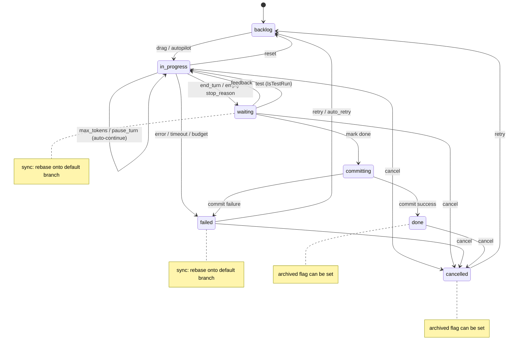
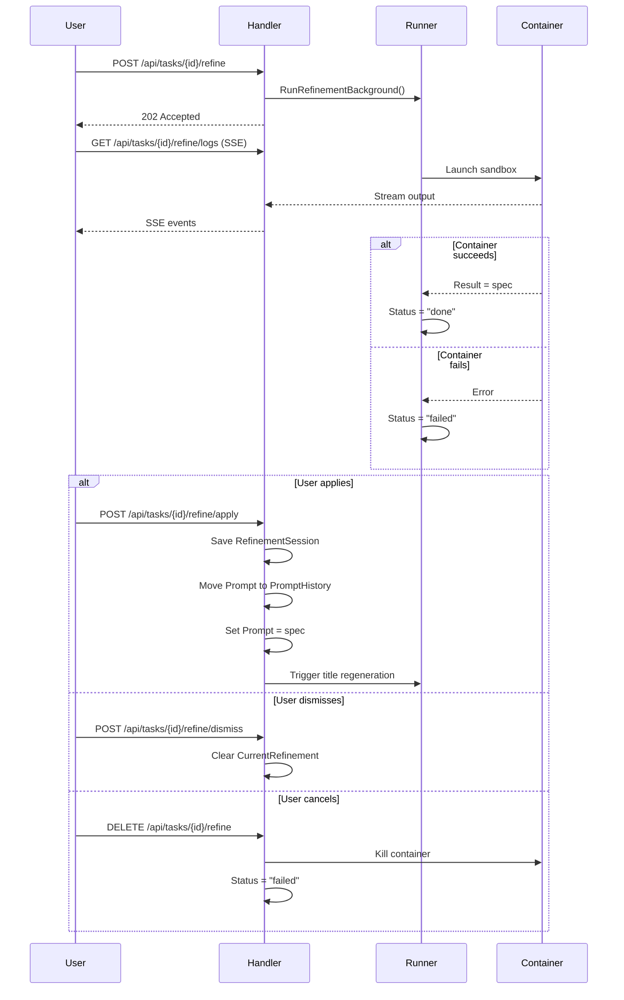

# Task Lifecycle

## State Machine

Tasks progress through a well-defined set of states. Every transition is recorded as an immutable event in `data/<uuid>/traces/`.



## States

| State | Description |
|---|---|
| `backlog` | Queued, not yet started |
| `in_progress` | Container running, agent executing |
| `waiting` | Claude paused mid-task, awaiting user feedback |
| `committing` | Transient: commit pipeline running after mark-done |
| `done` | Completed; changes committed and merged |
| `failed` | Container error, Claude error, timeout, or budget exceeded |
| `cancelled` | Explicitly cancelled; sandbox cleaned up, history preserved |

**Note:** `archived` is a boolean flag (`Archived bool`) on the task, not a separate state. Tasks in `done` or `cancelled` state can have `Archived = true`, which moves them to the Archived column in the UI. The state machine has exactly 7 states (`backlog`, `in_progress`, `waiting`, `committing`, `done`, `failed`, `cancelled`).

## Turn Loop

Each pass through the loop in `runner.go` `Run()`:

1. Increment turn counter
2. Run container with current prompt and session ID
3. Save raw stdout to `data/<uuid>/outputs/turn-NNNN.json`; stderr (if any) to `turn-NNNN.stderr.txt`
4. Parse `stop_reason` from agent JSON output:

| `stop_reason` | `is_error` | Result |
|---|---|---|
| `end_turn` | false | Exit loop → `waiting` (awaiting review; auto-submit or user marks done to trigger commit pipeline) |
| `max_tokens` | false | Auto-continue (next iteration, same session) |
| `pause_turn` | false | Auto-continue (next iteration, same session) |
| empty / unknown | false | Set `waiting`; block until user provides feedback |
| any | true | Set `failed` with classified `FailureCategory` |

5. Accumulate token usage (`input_tokens`, `output_tokens`, cache tokens, `cost_usd`)
6. Record per-turn usage as `TurnUsageRecord`
7. Check budget limits (`MaxCostUSD`, `MaxInputTokens`); if exceeded → `failed` with `FailureCategory = budget_exceeded`

## Session Continuity

Claude Code supports `--resume <session-id>` for session continuity. The first turn creates a new session; subsequent turns (auto-continue or post-feedback) pass the same session ID, preserving the full conversation context.

Setting `FreshStart = true` on a task skips `--resume`, starting a brand-new session. This is what happens when a user retries a failed task.

## Feedback & Waiting State

When `stop_reason` is empty, Claude has asked a question or is blocked. The task enters `waiting`:

- Worktrees are **not** cleaned up — the git branch is preserved
- User submits feedback via `POST /api/tasks/{id}/feedback`
- Handler writes a `feedback` event to the trace log, then launches a new `runner.Run` goroutine using the existing session ID
- The task resumes from exactly where it paused, with the feedback message as the next prompt

Alternatively, the user can mark the task done from `waiting`, which skips further Claude turns and jumps straight to the commit pipeline.

## Cancellation

Any task in `backlog`, `in_progress`, `waiting`, `failed`, or `done` can be cancelled via `POST /api/tasks/{id}/cancel`. The handler:

1. **Kills the container** (if `in_progress`) — sends `<runtime> kill wallfacer-<uuid>`. The running goroutine detects the cancelled status and exits without overwriting it to `failed`.
2. **Cleans up worktrees** — removes the git worktree and deletes the task branch, discarding all prepared changes.
3. **Sets status to `cancelled`** and appends a `state_change` event.
4. **Preserves history** — `data/<uuid>/traces/` and `data/<uuid>/outputs/` are left intact so execution logs, token usage, and the event timeline remain visible.

From `cancelled`, the user can retry the task (moves it back to `backlog`) to restart from scratch.

## Failure Categorization

When a task transitions to `failed`, the runner classifies the failure into one of these categories:

| Category | Description |
|---|---|
| `timeout` | Per-turn timeout exceeded |
| `budget_exceeded` | Cost or token budget limit reached |
| `worktree_setup` | Git worktree creation failed |
| `container_crash` | Container exited unexpectedly |
| `agent_error` | Agent reported an error in its output |
| `sync_error` | Rebase/sync operation failed |
| `unknown` | Unclassifiable failure |

The category is stored in `Task.FailureCategory` and included in `RetryRecord` when the task is reset for retry.

## Auto-Retry

Tasks can have an `AutoRetryBudget map[FailureCategory]int` that specifies how many automatic retries are allowed for each failure category. When a task fails:

1. The failure is classified into a `FailureCategory`
2. If the budget for that category has remaining retries, the count is decremented
3. The task is automatically reset to `backlog` for a fresh run
4. `AutoRetryCount` tracks the total number of auto-retries consumed

A global cap (`maxTotalAutoRetries`) prevents infinite retry loops regardless of per-category budgets.

## Retry History

Each time a task is reset for retry (manual or automatic), a `RetryRecord` is appended to `Task.RetryHistory`:

```
RetryRecord {
  RetiredAt        time.Time
  Prompt           string
  Status           TaskStatus
  Result           string           // truncated to 2000 chars
  SessionID        string
  Turns            int
  CostUSD          float64
  FailureCategory  FailureCategory
}
```

The list is capped at `DefaultRetryHistoryLimit` (10) entries. This allows operators to inspect the history of failed attempts.

## Title Generation

When a task is created, a background goroutine (`runner.GenerateTitle`) launches a lightweight container to generate a short title from the prompt. Titles are stored on the task and displayed on the board cards instead of the full prompt text. `POST /api/tasks/generate-titles` can retroactively generate titles for older untitled tasks.

## Prompt Refinement

Before running a task, users can have an AI agent analyse the codebase and produce a detailed implementation spec (the refined prompt). Only `backlog` tasks can be refined.



Both `RefineSessions []RefinementSession` (past history) and `CurrentRefinement *RefinementJob` (present job) live on the Task struct. `RefineSessions` grows over time as each refinement is applied (capped at `DefaultRefineSessionsLimit` = 5); `CurrentRefinement` is replaced on each new run and cleared on dismiss.

## Test Verification

Once a task has reached `waiting` (Claude finished but the user hasn't committed yet), a test verification agent can be triggered to check whether the implementation meets acceptance criteria.

```
POST /api/tasks/{id}/test
  body: { criteria?: string }   // optional additional acceptance criteria
  ↓
  Sets IsTestRun = true, clears LastTestResult.
  Transitions waiting → in_progress.
  Launches a fresh container (separate session, no --resume) with a test prompt.

Test agent runs (IsTestRun = true):
  Container executes: inspect code, run tests, verify requirements.
  Agent must end its response with **PASS** or **FAIL**.

On end_turn:
  parseTestVerdict() extracts "pass", "fail", or "unknown" from the result.
  Records verdict in LastTestResult.
  Transitions in_progress → waiting (no commit).
  Test output is shown separately from implementation output in the task detail panel.
```

The test verdict is displayed as a badge on the task card and in the task detail panel. Multiple test runs are allowed; each overwrites the previous verdict. The `TestRunStartTurn` field records which turn the test started so the UI can split implementation vs. test output.

After reviewing the verdict, the user can:
- Mark the task done (commit pipeline runs) if the verdict is PASS
- Provide feedback to fix issues, then re-test
- Cancel the task

## Autopilot

See [Automation](automation.md).

## Board Context

Each container receives a read-only `board.json` at `/workspace/.tasks/board.json` containing a manifest of all non-archived tasks. The current task is marked `"is_self": true`. This gives agents cross-task awareness to avoid conflicting changes with sibling tasks. The manifest is refreshed before every turn.

When `MountWorktrees` is enabled on a task, eligible sibling worktrees are also mounted read-only at `/workspace/.tasks/worktrees/<short-id>/<repo>/`.

## Data Models

See [Data & Storage](data-and-storage.md) for data model definitions.

## Persistence

See [Data & Storage](data-and-storage.md).

## Crash Recovery

On startup, `RecoverOrphanedTasks` in `runner/recovery.go` reconciles tasks that were interrupted by a server restart. It first queries the container runtime to determine which containers are still running, then handles each interrupted task as follows:

| Previous status | Container state | Recovery action |
|---|---|---|
| `committing` | any | Inspect worktree: if commit landed after `UpdatedAt` → `done`; otherwise → `failed` |
| `in_progress` | still running | Stay `in_progress`; a monitor goroutine watches the container and transitions to `waiting` once it stops |
| `in_progress` | already stopped | → `waiting` — user can review partial output, provide feedback, or mark as done |

If worktrees are missing during recovery, the task is marked `failed` with `FailureCategory = worktree_setup`.

**Why `waiting` instead of `failed` for stopped containers?**
The task may have produced useful partial output. Moving to `waiting` lets the user inspect results and choose the next action (resume with feedback, mark as done, or cancel) rather than forcing a retry from scratch.

**Monitor goroutine** (`monitorContainerUntilStopped`):
When a container is found still running after a restart, a background goroutine polls `podman/docker ps` every 5 seconds. Once the container stops it moves the task from `in_progress` to `waiting` with an explanatory output event. If the task was already transitioned by another path (e.g. cancelled by the user) the goroutine exits cleanly.

## Oversight Generation

See [Automation](automation.md).

## Ideation / Brainstorm Agent

See [Automation](automation.md).

## Output Truncation

Server-side output truncation is controlled by `WALLFACER_MAX_TURN_OUTPUT_BYTES` (default 8 MB). When a turn's stdout or stderr exceeds this limit, the output is truncated and a sentinel is appended. Truncated turn numbers are recorded in `Task.TruncatedTurns` so the UI can surface warnings.

---

## Storage Layer Deep-Dive

See [Data & Storage](data-and-storage.md).

## Migration System

See [Data & Storage](data-and-storage.md).

## Search Index

See [Data & Storage](data-and-storage.md).

## Soft Delete Implementation

See [Data & Storage](data-and-storage.md).

---

## Dependency Resolution

Tasks can declare dependencies on other tasks via `DependsOn []string` (a list of task UUID strings). A task with unsatisfied dependencies is not eligible for auto-promotion, even when capacity is available.

### DAG Validation in Batch Create

`POST /api/tasks/batch` (`Handler.BatchCreateTasks` in `internal/handler/tasks.go`) performs comprehensive DAG validation before creating any tasks. The entire validation phase has zero side effects — if any check fails, no tasks are created.

#### Step-by-Step Validation

1. **Ref uniqueness**: Each task in the batch can have a symbolic `ref` string. Duplicate refs are rejected.

2. **Prompt validation**: Every task must have a non-empty prompt unless its flow resolves to `brainstorm` (the legacy `idea-agent` kind also qualifies), in which case the agent derives the topic from the workspace itself.

3. **Flow validation**: Each task's `flow` field is optional on input but normalises to `implement` when omitted; unknown flow slugs are rejected at dispatch time by the runner. The deprecated `sandbox` and `sandbox_by_activity` fields are rejected outright with a 400; see the [Agents & Flows](../guide/agents-and-flows.md) guide for the migration path.

4. **Dependency reference resolution**: Each `depends_on_refs` entry must be either a known batch ref or a syntactically valid UUID.

5. **Batch-internal cycle detection (Kahn's algorithm)**: The batch-internal dependency edges are extracted into an adjacency list. Kahn's topological sort algorithm processes nodes with in-degree 0 iteratively:

   ```
   inDegree[i] = number of batch tasks that task i depends on
   batchAdj[i] = indices of tasks that depend on task i

   queue = all tasks with inDegree == 0
   while queue is not empty:
       curr = dequeue
       topoOrder.append(curr)
       for each next in batchAdj[curr]:
           inDegree[next]--
           if inDegree[next] == 0: enqueue(next)

   if len(topoOrder) != n: cycle detected
   ```

   When a cycle is detected, the response includes the refs of all tasks involved in the cycle.

6. **UUID pre-assignment**: UUIDs are pre-assigned for all batch tasks so that cross-reference resolution and full-graph cycle detection can reason about the complete post-creation dependency graph.

7. **External dependency existence**: Every UUID-format dependency that is not a batch ref is verified to exist in the store via `GetTask`.

8. **Full combined-graph cycle detection**: A combined adjacency map is built from all existing tasks plus the proposed batch tasks (using pre-assigned UUIDs). For each new task, `taskReachableInAdj` performs a DFS to check whether the task can reach itself through its dependencies:

   ```go
   func taskReachableInAdj(adj map[uuid.UUID][]uuid.UUID, start, target uuid.UUID) bool {
       // DFS from start; returns true if target is reachable
   }
   ```

   This catches cycles that span both existing tasks and new batch tasks.

#### Creation Order

Tasks are created in topological order (from the Kahn's sort output), so each task's dependencies already exist in the store by the time it is created. The response returns tasks in the original input order with a `ref_to_id` mapping.

### Single-Task Dependency Update

`PATCH /api/tasks/{id}` with a `depends_on` field calls `UpdateTaskDependsOn`, which stores the list via `mutateTask`. No cycle detection is performed on single-task updates — the caller is responsible for ensuring validity.

### Dependency Satisfaction Check

`AreDependenciesSatisfied` (in `internal/store/tasks_update.go`) is the authoritative dependency gate:

```go
func (s *Store) AreDependenciesSatisfied(ctx context.Context, id uuid.UUID) (bool, error) {
    // Under RLock:
    for each depStr in task.DependsOn:
        parse UUID (malformed → unsatisfied)
        lookup in s.tasks (missing → unsatisfied, conservative)
        if dep.Status != TaskStatusDone → unsatisfied
    return true (all deps done)
}
```

Conservative semantics: a malformed UUID or a deleted dependency is treated as unsatisfied to avoid silent unblocking.

### Dependency in Auto-Promoter

The auto-promoter (`tryAutoPromote` in `internal/handler/tasks_autopilot.go`) checks dependencies as part of candidate selection:

1. Lists all backlog tasks sorted by position.
2. For each candidate, calls `AreDependenciesSatisfied` — skips if any dependency is not `done`.
3. Also checks `ScheduledAt` — skips if the scheduled time is in the future.
4. Promotes the highest-priority eligible candidate.

---

## Board Context Generation

Board context gives each running agent visibility into sibling tasks on the board, enabling cross-task coordination and conflict avoidance.

### What Board Context Contains

The board context is a `BoardManifest` JSON file written to `/workspace/.tasks/board.json` inside each task container:

```go
type BoardManifest struct {
    GeneratedAt time.Time   `json:"generated_at"`
    SelfTaskID  string      `json:"self_task_id"`
    Tasks       []BoardTask `json:"tasks"`
}
```

Each `BoardTask` entry includes:

| Field | Description |
|---|---|
| `id` | Full UUID string |
| `short_id` | First 8 characters of the UUID |
| `title` | Task display title |
| `prompt` | Task prompt (truncated to 500 chars for siblings) |
| `status` | Current task status |
| `is_self` | `true` for the task's own entry |
| `turns` | Turn count (0 for siblings to reduce noise) |
| `result` | Last result text (truncated to 1000 chars for siblings) |
| `stop_reason` | Last stop reason |
| `usage` | Token/cost usage |
| `branch_name` | Git branch name |
| `worktree_mount` | Container-side mount path (if eligible) |
| `created_at` / `updated_at` | Timestamps |

`SessionID` is deliberately excluded from `BoardTask` to prevent session hijacking between tasks.

### How Board Context Is Assembled

`generateBoardContextAndMounts` in `internal/runner/board.go` produces both the `board.json` bytes and the sibling worktree mount map:

1. Lists all non-archived tasks via `store.ListTasks`.
2. Builds the set of workspace repo paths the self task operates on.
3. Filters siblings to only those sharing at least one workspace.
4. For the self task: includes full `Prompt`, `Result`, and `Turns`.
5. For siblings: truncates `Prompt` to 500 chars, `Result` to 1000 chars, zeros `Turns`.
6. Determines eligible sibling worktree mounts (tasks in `waiting`, `failed`, or `done` with extant worktree directories).
7. Marshals to JSON with indent; logs a warning if the manifest exceeds 64 KB.

### Caching

Results are cached by `(boardChangeSeq, selfTaskID)`. The cache is invalidated when any store mutation increments the change sequence. Per-turn calls cost nearly nothing when no task has changed since the last generation.

### Worktree Mounts

When `MountWorktrees` is enabled, eligible sibling worktrees are mounted read-only inside the container at `/workspace/.tasks/worktrees/<short-id>/<repo-basename>/`. Mount eligibility is determined by `canMountWorktree`:

- `waiting` or `failed` tasks: always eligible.
- `done` tasks: eligible only if at least one worktree directory still exists on disk.
- `backlog`, `in_progress`, `cancelled`: not eligible (no worktree, actively modified, or cleaned up).

### API Endpoints

- `GET /api/tasks/{id}/board` — Returns the `BoardManifest` as it appears to a specific task (with that task marked `is_self: true`).
- `GET /api/debug/board` — Returns the `BoardManifest` as seen by a hypothetical new task (no task marked as self, `selfTaskID` = `uuid.Nil`).

---

## Task Summaries

See [Data & Storage](data-and-storage.md).

---

## See Also

- [Internals Index](internals.md) — Overview and reading order for all internals docs
- [Architecture](architecture.md) — System design, component overview, and design decisions
- [Data & Storage](data-and-storage.md) — Data models, persistence, storage layer, migrations, search index, soft delete, task summaries
- [Automation](automation.md) — Autopilot, oversight generation, ideation agent
- [Git Worktrees](git-worktrees.md) — Worktree lifecycle, branch naming, cleanup
- [API & Transport](api-and-transport.md) — HTTP routes, SSE, metrics, middleware
