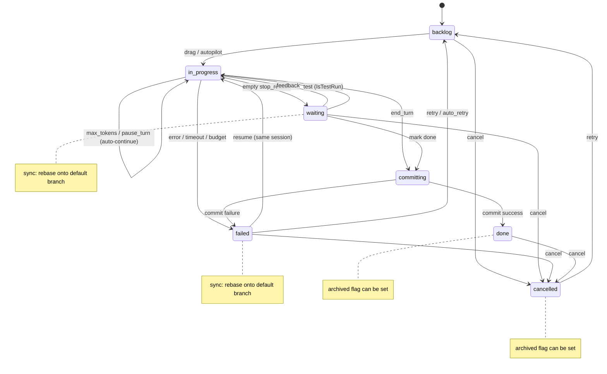
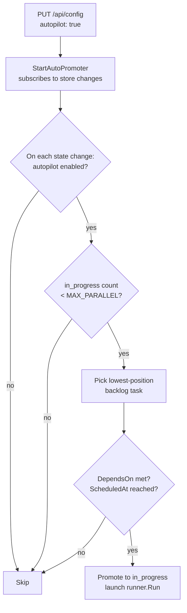

# Task Lifecycle

## State Machine

Tasks progress through a well-defined set of states. Every transition is recorded as an immutable event in `data/<uuid>/traces/`.



## States

| State | Description |
|---|---|
| `backlog` | Queued, not yet started |
| `in_progress` | Container running, agent executing |
| `waiting` | Claude paused mid-task, awaiting user feedback |
| `committing` | Transient: commit pipeline running after mark-done |
| `done` | Completed; changes committed and merged |
| `failed` | Container error, Claude error, timeout, or budget exceeded |
| `cancelled` | Explicitly cancelled; sandbox cleaned up, history preserved |

**Note:** `archived` is a boolean flag (`Archived bool`) on the task, not a separate state. Tasks in `done` or `cancelled` state can have `Archived = true`, which moves them to the Archived column in the UI. The state machine has exactly 7 states (`backlog`, `in_progress`, `waiting`, `committing`, `done`, `failed`, `cancelled`).

## Turn Loop

Each pass through the loop in `runner.go` `Run()`:

1. Increment turn counter
2. Run container with current prompt and session ID
3. Save raw stdout to `data/<uuid>/outputs/turn-NNNN.json`; stderr (if any) to `turn-NNNN.stderr.txt`
4. Parse `stop_reason` from agent JSON output:

| `stop_reason` | `is_error` | Result |
|---|---|---|
| `end_turn` | false | Exit loop → trigger commit pipeline → `done` (or → `waiting` with verdict if this is a test run) |
| `max_tokens` | false | Auto-continue (next iteration, same session) |
| `pause_turn` | false | Auto-continue (next iteration, same session) |
| empty / unknown | false | Set `waiting`; block until user provides feedback |
| any | true | Set `failed` with classified `FailureCategory` |

5. Accumulate token usage (`input_tokens`, `output_tokens`, cache tokens, `cost_usd`)
6. Record per-turn usage as `TurnUsageRecord`
7. Check budget limits (`MaxCostUSD`, `MaxInputTokens`); if exceeded → `failed` with `FailureCategory = budget_exceeded`

## Session Continuity

Claude Code supports `--resume <session-id>` for session continuity. The first turn creates a new session; subsequent turns (auto-continue or post-feedback) pass the same session ID, preserving the full conversation context.

Setting `FreshStart = true` on a task skips `--resume`, starting a brand-new session. This is what happens when a user retries a failed task.

## Feedback & Waiting State

When `stop_reason` is empty, Claude has asked a question or is blocked. The task enters `waiting`:

- Worktrees are **not** cleaned up — the git branch is preserved
- User submits feedback via `POST /api/tasks/{id}/feedback`
- Handler writes a `feedback` event to the trace log, then launches a new `runner.Run` goroutine using the existing session ID
- The task resumes from exactly where it paused, with the feedback message as the next prompt

Alternatively, the user can mark the task done from `waiting`, which skips further Claude turns and jumps straight to the commit pipeline.

## Cancellation

Any task in `backlog`, `in_progress`, `waiting`, `failed`, or `done` can be cancelled via `POST /api/tasks/{id}/cancel`. The handler:

1. **Kills the container** (if `in_progress`) — sends `<runtime> kill wallfacer-<uuid>`. The running goroutine detects the cancelled status and exits without overwriting it to `failed`.
2. **Cleans up worktrees** — removes the git worktree and deletes the task branch, discarding all prepared changes.
3. **Sets status to `cancelled`** and appends a `state_change` event.
4. **Preserves history** — `data/<uuid>/traces/` and `data/<uuid>/outputs/` are left intact so execution logs, token usage, and the event timeline remain visible.

From `cancelled`, the user can retry the task (moves it back to `backlog`) to restart from scratch.

## Failure Categorization

When a task transitions to `failed`, the runner classifies the failure into one of these categories:

| Category | Description |
|---|---|
| `timeout` | Per-turn timeout exceeded |
| `budget_exceeded` | Cost or token budget limit reached |
| `worktree_setup` | Git worktree creation failed |
| `container_crash` | Container exited unexpectedly |
| `agent_error` | Agent reported an error in its output |
| `sync_error` | Rebase/sync operation failed |
| `unknown` | Unclassifiable failure |

The category is stored in `Task.FailureCategory` and included in `RetryRecord` when the task is reset for retry.

## Auto-Retry

Tasks can have an `AutoRetryBudget map[FailureCategory]int` that specifies how many automatic retries are allowed for each failure category. When a task fails:

1. The failure is classified into a `FailureCategory`
2. If the budget for that category has remaining retries, the count is decremented
3. The task is automatically reset to `backlog` for a fresh run
4. `AutoRetryCount` tracks the total number of auto-retries consumed

A global cap (`maxTotalAutoRetries`) prevents infinite retry loops regardless of per-category budgets.

## Retry History

Each time a task is reset for retry (manual or automatic), a `RetryRecord` is appended to `Task.RetryHistory`:

```
RetryRecord {
  RetiredAt        time.Time
  Prompt           string
  Status           TaskStatus
  Result           string           // truncated to 2000 chars
  SessionID        string
  Turns            int
  CostUSD          float64
  FailureCategory  FailureCategory
}
```

The list is capped at `DefaultRetryHistoryLimit` (10) entries. This allows operators to inspect the history of failed attempts.

## Title Generation

When a task is created, a background goroutine (`runner.GenerateTitle`) launches a lightweight container to generate a short title from the prompt. Titles are stored on the task and displayed on the board cards instead of the full prompt text. `POST /api/tasks/generate-titles` can retroactively generate titles for older untitled tasks.

## Prompt Refinement

Before running a task, users can have an AI agent analyse the codebase and produce a detailed implementation spec (the refined prompt). Only `backlog` tasks can be refined.


Both `RefineSessions []RefinementSession` (past history) and `CurrentRefinement *RefinementJob` (present job) live on the Task struct. `RefineSessions` grows over time as each refinement is applied (capped at `DefaultRefineSessionsLimit` = 5); `CurrentRefinement` is replaced on each new run and cleared on dismiss.

## Test Verification

Once a task has reached `waiting` (Claude finished but the user hasn't committed yet), a test verification agent can be triggered to check whether the implementation meets acceptance criteria.

```
POST /api/tasks/{id}/test
  body: { criteria?: string }   // optional additional acceptance criteria
  ↓
  Sets IsTestRun = true, clears LastTestResult.
  Transitions waiting → in_progress.
  Launches a fresh container (separate session, no --resume) with a test prompt.

Test agent runs (IsTestRun = true):
  Container executes: inspect code, run tests, verify requirements.
  Agent must end its response with **PASS** or **FAIL**.

On end_turn:
  parseTestVerdict() extracts "pass", "fail", or "unknown" from the result.
  Records verdict in LastTestResult.
  Transitions in_progress → waiting (no commit).
  Test output is shown separately from implementation output in the task detail panel.
```

The test verdict is displayed as a badge on the task card and in the task detail panel. Multiple test runs are allowed; each overwrites the previous verdict. The `TestRunStartTurn` field records which turn the test started so the UI can split implementation vs. test output.

After reviewing the verdict, the user can:
- Mark the task done (commit pipeline runs) if the verdict is PASS
- Provide feedback to fix issues, then re-test
- Cancel the task


## Autopilot

When autopilot is enabled, the server automatically promotes backlog tasks to `in_progress` as capacity becomes available, without requiring the user to drag cards manually.



Concurrency limit is read from `WALLFACER_MAX_PARALLEL` in the env file (default: 5). Autopilot is off by default and does not persist across server restarts.

Tasks whose `DependsOn` list contains any task not yet in `done` status are skipped by the auto-promoter even when the in-progress count is below `WALLFACER_MAX_PARALLEL`.

Tasks whose `ScheduledAt` is in the future are also skipped.

## Board Context

Each container receives a read-only `board.json` at `/workspace/.tasks/board.json` containing a manifest of all non-archived tasks. The current task is marked `"is_self": true`. This gives agents cross-task awareness to avoid conflicting changes with sibling tasks. The manifest is refreshed before every turn.

When `MountWorktrees` is enabled on a task, eligible sibling worktrees are also mounted read-only at `/workspace/.tasks/worktrees/<short-id>/<repo>/`.

## Data Models

Defined in `internal/store/models.go`:

**Task**
```
SchemaVersion      int                         // on-disk schema version for migrations
ID                 uuid.UUID                   // UUID
Title              string                      // auto-generated short title
Prompt             string                      // current task description (short card label)
PromptHistory      []string                    // previous prompt versions (before refinements)
RetryHistory       []RetryRecord               // history of failed attempts before retry
RefineSessions     []RefinementSession         // history of completed sandbox refinement sessions
CurrentRefinement  *RefinementJob              // active or recently completed sandbox refinement job
Status             TaskStatus                  // current state
Archived           bool                        // true when moved to archived view (done/cancelled tasks only)
SessionID          *string                     // agent session ID (persisted across turns)
FreshStart         bool                        // skip --resume on next run
StopReason         *string                     // last stop_reason from Claude
Result             *string                     // last result text from Claude
Turns              int                         // number of completed turns
Timeout            int                         // per-turn timeout in minutes
MaxCostUSD         float64                     // cost budget limit (0 = unlimited)
MaxInputTokens     int                         // input+cache token budget (0 = unlimited)
Usage              TaskUsage                   // accumulated token counts and cost (all activities)
UsageBreakdown     map[string]TaskUsage        // token/cost per sub-agent activity key
Sandbox            sandbox.Type                // container sandbox type for this task
SandboxByActivity  map[string]sandbox.Type     // per-activity sandbox overrides
Environment        *ExecutionEnvironment       // runtime environment snapshot at execution start
Position           int                         // sort order within column
CreatedAt          time.Time
UpdatedAt          time.Time
ModelOverride      *string                     // per-task model override; nil means use global default
MountWorktrees     bool                        // enable sibling worktree mounts + board context
WorktreePaths      map[string]string           // repo path → worktree path
BranchName         string                      // task branch name (e.g. task/a1b2c3d4)
CommitHashes       map[string]string           // repo path → commit hash after merge
BaseCommitHashes   map[string]string           // repo path → base commit hash at branch creation
Kind               TaskKind                    // "" or "idea-agent"
Tags               []string                    // labels for categorisation
ExecutionPrompt    string                      // overrides Prompt when invoking the sandbox agent
DependsOn          []string                    // UUIDs of prerequisite tasks
ScheduledAt        *time.Time                  // optional future auto-promotion time

FailureCategory    FailureCategory             // root cause of last failure
TruncatedTurns     []int                       // turns whose output was truncated
AutoRetryBudget    map[FailureCategory]int     // remaining auto-retries per failure category
AutoRetryCount     int                         // total auto-retries consumed
PendingTestFeedback string                     // failing test outcome awaiting auto-resume

// Test verification
IsTestRun        bool   // true while a test agent is running on this task
LastTestResult   string // "pass", "fail", "unknown", or "" (untested)
TestRunStartTurn int    // turn count when test run started
```

**ExecutionEnvironment** (recorded at run start for reproducibility)
```
ContainerImage   string       // e.g. "wallfacer:latest"
ContainerDigest  string       // sha256 of image, empty if unavailable
ModelName        string       // e.g. "claude-opus-4-6"
APIBaseURL       string       // empty = default Anthropic endpoint
InstructionsHash string       // sha256 hex of AGENTS.md at run start
Sandbox          sandbox.Type // configured sandbox type
RecordedAt       time.Time
```

**TurnUsageRecord** (per-turn token consumption)
```
Turn                 int
Timestamp            time.Time
InputTokens          int
OutputTokens         int
CacheReadInputTokens int
CacheCreationTokens  int
CostUSD              float64
StopReason           string
Sandbox              sandbox.Type
SubAgent             string       // "implementation", "test", "refinement", etc.
```

**RetryRecord** (one failed attempt before retry)
```
RetiredAt       time.Time
Prompt          string
Status          TaskStatus
Result          string          // truncated to 2000 chars
SessionID       string
Turns           int
CostUSD         float64
FailureCategory FailureCategory
```

**RefinementSession** (one completed sandbox refinement interaction)
```
ID           string
CreatedAt    time.Time
StartPrompt  string
Result       string
ResultPrompt string
Messages     []RefinementMessage  // legacy; for older chat-based sessions
```

**RefinementJob** (active or most-recently-completed refinement run)
```
ID        string
CreatedAt time.Time
Status    RefinementJobStatus    // "running" | "done" | "failed"
Result    string                 // refined prompt/spec text
Error     string                 // error message
Source    string                 // originator ("runner" for UI-triggered)
```

**TaskOversight** (aggregated high-level summary of agent execution)
```
Status       OversightStatus  // "pending" | "generating" | "ready" | "failed"
GeneratedAt  time.Time
Error        string
Phases       []OversightPhase
```

**OversightPhase** (one logical grouping of related agent activities)
```
Timestamp  time.Time
Title      string
Summary    string
ToolsUsed  []string
Commands   []string
Actions    []string
```

**TaskSummary** (immutable completion snapshot)
```
TaskID          uuid.UUID
Title           string
Status          TaskStatus
CompletedAt     time.Time
CreatedAt       time.Time
DurationSeconds float64
TotalTurns      int
TotalCostUSD    float64
ByActivity      map[string]TaskUsage
TestResult      string
PhaseCount      int
FailureCategory FailureCategory
```

**Tombstone** (soft-delete marker)
```
DeletedAt time.Time
Reason    string
```

**SpanData** (attached to span_start / span_end trace events)
```
Phase  string  // e.g. "worktree_setup", "agent_turn", "container_run", "commit"
Label  string  // differentiates multiple spans of the same phase
```

**TaskEvent** (append-only trace log)
```
ID        int64
TaskID    uuid.UUID
EventType EventType // state_change | output | feedback | error | system | span_start | span_end
Data      json.RawMessage
CreatedAt time.Time
```

**TaskUsage**
```
InputTokens              int
OutputTokens             int
CacheReadInputTokens     int
CacheCreationTokens      int
CostUSD                  float64
```

**EventType values**

| Value | Description |
|---|---|
| `state_change` | Task moved to a new state |
| `output` | Agent turn output text |
| `feedback` | User-submitted feedback message |
| `error` | Error during execution |
| `system` | Server-inserted note (e.g. crash recovery message, pipeline progress) |
| `span_start` | Start of a named execution phase (data: SpanData) |
| `span_end` | End of a named execution phase (data: SpanData) |

**Trigger values** (attached to state_change events)

| Value | Description |
|---|---|
| `user` | Manual user action |
| `auto_promote` | Autopilot promotion |
| `auto_retry` | Automatic retry after failure |
| `auto_test` | Auto-tester triggered test run |
| `auto_submit` | Auto-submitter marked task done |
| `feedback` | User feedback resumption |
| `sync` | Sync/rebase operation |
| `recovery` | Server restart recovery |
| `system` | Other system-initiated transition |

## Persistence

Each task owns a directory under `data/<uuid>/`:

```
data/<uuid>/
├── task.json          # current task state (atomically overwritten on each update)
├── tombstone.json     # present only for soft-deleted tasks
├── summary.json       # immutable completion snapshot (written once at done)
├── traces/
│   ├── 0001.json      # first event
│   ├── 0002.json      # second event
│   └── ...            # append-only
├── outputs/
│   ├── turn-0001.json        # raw agent JSON output
│   ├── turn-0001.stderr.txt  # stderr (if non-empty)
│   └── ...
└── oversights/
    └── <oversight-id>.json   # generated oversight summary
```

All writes are atomic (temp file + `os.Rename`). On startup, `task.json` files are loaded into memory and migrated to `CurrentTaskSchemaVersion` if needed. See [Architecture](architecture.md#design-decisions) for the persistence design rationale.

### Soft Delete

`DELETE /api/tasks/{id}` writes a `tombstone.json` file rather than immediately removing data. Tombstoned tasks are excluded from normal listings but visible via `GET /api/tasks/deleted`. They can be restored with `POST /api/tasks/{id}/restore`. On each server startup, tombstones older than `WALLFACER_TOMBSTONE_RETENTION_DAYS` (default 7) are permanently pruned.

## Crash Recovery

On startup, `RecoverOrphanedTasks` in `runner/recovery.go` reconciles tasks that were interrupted by a server restart. It first queries the container runtime to determine which containers are still running, then handles each interrupted task as follows:

| Previous status | Container state | Recovery action |
|---|---|---|
| `committing` | any | Inspect worktree: if commit landed after `UpdatedAt` → `done`; otherwise → `failed` |
| `in_progress` | still running | Stay `in_progress`; a monitor goroutine watches the container and transitions to `waiting` once it stops |
| `in_progress` | already stopped | → `waiting` — user can review partial output, provide feedback, or mark as done |

If worktrees are missing during recovery, the task is marked `failed` with `FailureCategory = worktree_setup`.

**Why `waiting` instead of `failed` for stopped containers?**
The task may have produced useful partial output. Moving to `waiting` lets the user inspect results and choose the next action (resume with feedback, mark as done, or cancel) rather than forcing a retry from scratch.

**Monitor goroutine** (`monitorContainerUntilStopped`):
When a container is found still running after a restart, a background goroutine polls `podman/docker ps` every 5 seconds. Once the container stops it moves the task from `in_progress` to `waiting` with an explanatory output event. If the task was already transitioned by another path (e.g. cancelled by the user) the goroutine exits cleanly.

## Oversight Generation

When a task transitions to `waiting`, `done`, or `failed`, the server launches a background goroutine to generate an oversight summary. The summary is also regenerated periodically if `WALLFACER_OVERSIGHT_INTERVAL` is set to a positive number of minutes.

The generator reads the task's trace events, passes them to the Claude API with a summarisation prompt, and writes the result as a `TaskOversight` (`status`: `pending` → `generating` → `ready` | `failed`). The result is persisted in `data/<uuid>/oversights/<id>.json`.

The UI shows the oversight in the Oversight tab (logical phases with tools/commands used) and as an interactive flamegraph Timeline.

`POST /api/tasks/generate-oversight` can be used to retroactively generate oversight for tasks that completed before this feature existed.

## Ideation / Brainstorm Agent

The ideation feature creates a task with `Kind = "idea-agent"`. The agent runs in a sandbox container, reads the configured workspaces, and calls the wallfacer API to create backlog tasks.

- Each created task gets relevant `Tags` and an `ExecutionPrompt` (full instructions) separate from `Prompt` (the short card label).
- Triggered via `POST /api/ideate`; cancelled via `DELETE /api/ideate`.
- `GET /api/ideate` returns current ideation session state (task ID, status, created task count).

## Output Truncation

Server-side output truncation is controlled by `WALLFACER_MAX_TURN_OUTPUT_BYTES` (default 8 MB). When a turn's stdout or stderr exceeds this limit, the output is truncated and a sentinel is appended. Truncated turn numbers are recorded in `Task.TruncatedTurns` so the UI can surface warnings.
