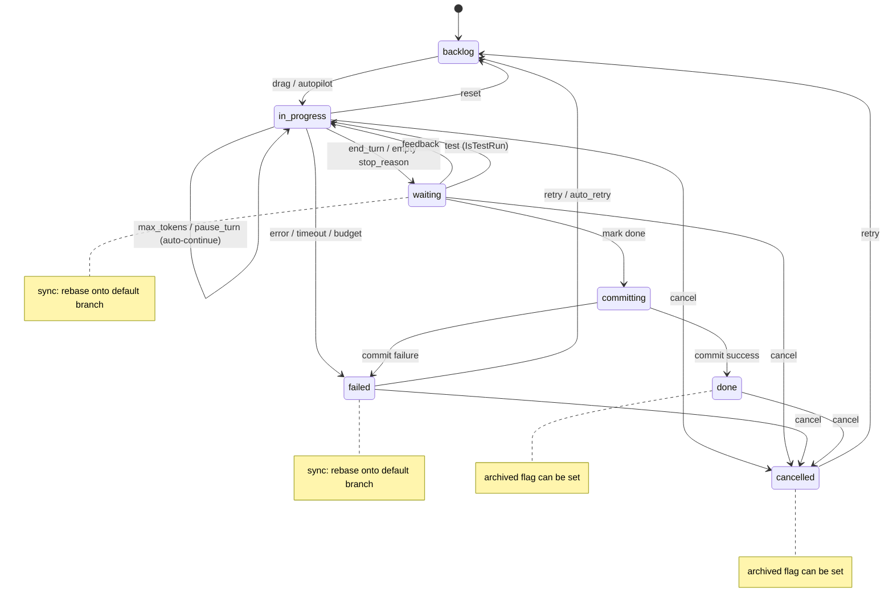
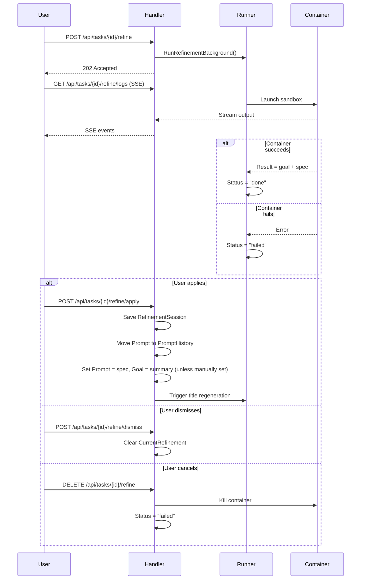
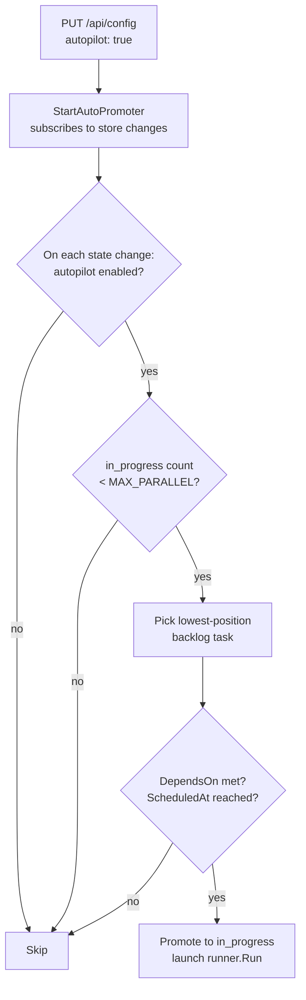
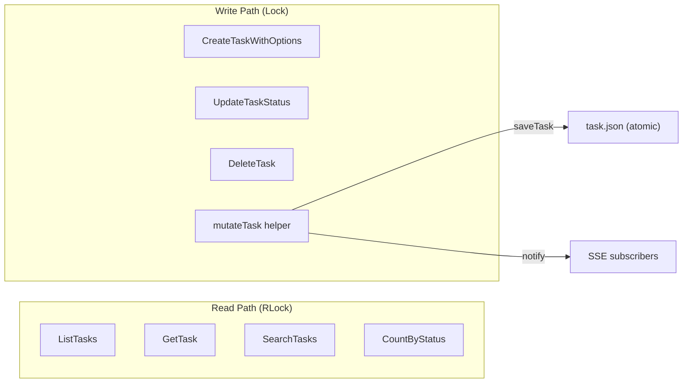
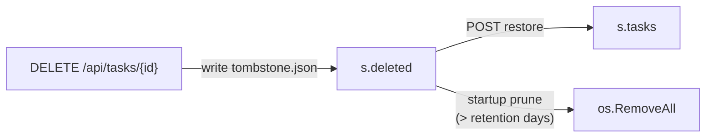

# Task Lifecycle

## State Machine

Tasks progress through a well-defined set of states. Every transition is recorded as an immutable event in `data/<uuid>/traces/`.



## States

| State | Description |
|---|---|
| `backlog` | Queued, not yet started |
| `in_progress` | Container running, agent executing |
| `waiting` | Claude paused mid-task, awaiting user feedback |
| `committing` | Transient: commit pipeline running after mark-done |
| `done` | Completed; changes committed and merged |
| `failed` | Container error, Claude error, timeout, or budget exceeded |
| `cancelled` | Explicitly cancelled; sandbox cleaned up, history preserved |

**Note:** `archived` is a boolean flag (`Archived bool`) on the task, not a separate state. Tasks in `done` or `cancelled` state can have `Archived = true`, which moves them to the Archived column in the UI. The state machine has exactly 7 states (`backlog`, `in_progress`, `waiting`, `committing`, `done`, `failed`, `cancelled`).

## Turn Loop

Each pass through the loop in `runner.go` `Run()`:

1. Increment turn counter
2. Run container with current prompt and session ID
3. Save raw stdout to `data/<uuid>/outputs/turn-NNNN.json`; stderr (if any) to `turn-NNNN.stderr.txt`
4. Parse `stop_reason` from agent JSON output:

| `stop_reason` | `is_error` | Result |
|---|---|---|
| `end_turn` | false | Exit loop → `waiting` (awaiting review; auto-submit or user marks done to trigger commit pipeline) |
| `max_tokens` | false | Auto-continue (next iteration, same session) |
| `pause_turn` | false | Auto-continue (next iteration, same session) |
| empty / unknown | false | Set `waiting`; block until user provides feedback |
| any | true | Set `failed` with classified `FailureCategory` |

5. Accumulate token usage (`input_tokens`, `output_tokens`, cache tokens, `cost_usd`)
6. Record per-turn usage as `TurnUsageRecord`
7. Check budget limits (`MaxCostUSD`, `MaxInputTokens`); if exceeded → `failed` with `FailureCategory = budget_exceeded`

## Session Continuity

Claude Code supports `--resume <session-id>` for session continuity. The first turn creates a new session; subsequent turns (auto-continue or post-feedback) pass the same session ID, preserving the full conversation context.

Setting `FreshStart = true` on a task skips `--resume`, starting a brand-new session. This is what happens when a user retries a failed task.

## Feedback & Waiting State

When `stop_reason` is empty, Claude has asked a question or is blocked. The task enters `waiting`:

- Worktrees are **not** cleaned up — the git branch is preserved
- User submits feedback via `POST /api/tasks/{id}/feedback`
- Handler writes a `feedback` event to the trace log, then launches a new `runner.Run` goroutine using the existing session ID
- The task resumes from exactly where it paused, with the feedback message as the next prompt

Alternatively, the user can mark the task done from `waiting`, which skips further Claude turns and jumps straight to the commit pipeline.

## Cancellation

Any task in `backlog`, `in_progress`, `waiting`, `failed`, or `done` can be cancelled via `POST /api/tasks/{id}/cancel`. The handler:

1. **Kills the container** (if `in_progress`) — sends `<runtime> kill wallfacer-<uuid>`. The running goroutine detects the cancelled status and exits without overwriting it to `failed`.
2. **Cleans up worktrees** — removes the git worktree and deletes the task branch, discarding all prepared changes.
3. **Sets status to `cancelled`** and appends a `state_change` event.
4. **Preserves history** — `data/<uuid>/traces/` and `data/<uuid>/outputs/` are left intact so execution logs, token usage, and the event timeline remain visible.

From `cancelled`, the user can retry the task (moves it back to `backlog`) to restart from scratch.

## Failure Categorization

When a task transitions to `failed`, the runner classifies the failure into one of these categories:

| Category | Description |
|---|---|
| `timeout` | Per-turn timeout exceeded |
| `budget_exceeded` | Cost or token budget limit reached |
| `worktree_setup` | Git worktree creation failed |
| `container_crash` | Container exited unexpectedly |
| `agent_error` | Agent reported an error in its output |
| `sync_error` | Rebase/sync operation failed |
| `unknown` | Unclassifiable failure |

The category is stored in `Task.FailureCategory` and included in `RetryRecord` when the task is reset for retry.

## Auto-Retry

Tasks can have an `AutoRetryBudget map[FailureCategory]int` that specifies how many automatic retries are allowed for each failure category. When a task fails:

1. The failure is classified into a `FailureCategory`
2. If the budget for that category has remaining retries, the count is decremented
3. The task is automatically reset to `backlog` for a fresh run
4. `AutoRetryCount` tracks the total number of auto-retries consumed

A global cap (`maxTotalAutoRetries`) prevents infinite retry loops regardless of per-category budgets.

## Retry History

Each time a task is reset for retry (manual or automatic), a `RetryRecord` is appended to `Task.RetryHistory`:

```
RetryRecord {
  RetiredAt        time.Time
  Prompt           string
  Status           TaskStatus
  Result           string           // truncated to 2000 chars
  SessionID        string
  Turns            int
  CostUSD          float64
  FailureCategory  FailureCategory
}
```

The list is capped at `DefaultRetryHistoryLimit` (10) entries. This allows operators to inspect the history of failed attempts.

## Title Generation

When a task is created, a background goroutine (`runner.GenerateTitle`) launches a lightweight container to generate a short title from the prompt. Titles are stored on the task and displayed on the board cards instead of the full prompt text. `POST /api/tasks/generate-titles` can retroactively generate titles for older untitled tasks.

## Prompt Refinement

Before running a task, users can have an AI agent analyse the codebase and produce a detailed implementation spec (the refined prompt) plus a concise goal summary. Only `backlog` tasks can be refined.



Both `RefineSessions []RefinementSession` (past history) and `CurrentRefinement *RefinementJob` (present job) live on the Task struct. `RefineSessions` grows over time as each refinement is applied (capped at `DefaultRefineSessionsLimit` = 5); `CurrentRefinement` is replaced on each new run and cleared on dismiss.

## Test Verification

Once a task has reached `waiting` (Claude finished but the user hasn't committed yet), a test verification agent can be triggered to check whether the implementation meets acceptance criteria.

```
POST /api/tasks/{id}/test
  body: { criteria?: string }   // optional additional acceptance criteria
  ↓
  Sets IsTestRun = true, clears LastTestResult.
  Transitions waiting → in_progress.
  Launches a fresh container (separate session, no --resume) with a test prompt.

Test agent runs (IsTestRun = true):
  Container executes: inspect code, run tests, verify requirements.
  Agent must end its response with **PASS** or **FAIL**.

On end_turn:
  parseTestVerdict() extracts "pass", "fail", or "unknown" from the result.
  Records verdict in LastTestResult.
  Transitions in_progress → waiting (no commit).
  Test output is shown separately from implementation output in the task detail panel.
```

The test verdict is displayed as a badge on the task card and in the task detail panel. Multiple test runs are allowed; each overwrites the previous verdict. The `TestRunStartTurn` field records which turn the test started so the UI can split implementation vs. test output.

After reviewing the verdict, the user can:
- Mark the task done (commit pipeline runs) if the verdict is PASS
- Provide feedback to fix issues, then re-test
- Cancel the task


## Autopilot

When autopilot is enabled, the server automatically promotes backlog tasks to `in_progress` as capacity becomes available, without requiring the user to drag cards manually.



Concurrency limit is read from `WALLFACER_MAX_PARALLEL` in the env file (default: 5). Autopilot is off by default and does not persist across server restarts.

Tasks whose `DependsOn` list contains any task not yet in `done` status are skipped by the auto-promoter even when the in-progress count is below `WALLFACER_MAX_PARALLEL`.

Tasks whose `ScheduledAt` is in the future are also skipped.

## Board Context

Each container receives a read-only `board.json` at `/workspace/.tasks/board.json` containing a manifest of all non-archived tasks. The current task is marked `"is_self": true`. This gives agents cross-task awareness to avoid conflicting changes with sibling tasks. The manifest is refreshed before every turn.

When `MountWorktrees` is enabled on a task, eligible sibling worktrees are also mounted read-only at `/workspace/.tasks/worktrees/<short-id>/<repo>/`.

## Data Models

Defined in `internal/store/models.go`:

**Task**
```
SchemaVersion      int                         // on-disk schema version for migrations
ID                 uuid.UUID                   // UUID
Title              string                      // auto-generated short title
Goal               string                      // 1-3 sentence human-readable summary for card display
GoalManuallySet    bool                        // true when user explicitly edited the goal
Prompt             string                      // current task description (full spec for agents)
PromptHistory      []string                    // previous prompt versions (before refinements)
RetryHistory       []RetryRecord               // history of failed attempts before retry
RefineSessions     []RefinementSession         // history of completed sandbox refinement sessions
CurrentRefinement  *RefinementJob              // active or recently completed sandbox refinement job
Status             TaskStatus                  // current state
Archived           bool                        // true when moved to archived view (done/cancelled tasks only)
SessionID          *string                     // agent session ID (persisted across turns)
FreshStart         bool                        // skip --resume on next run
StopReason         *string                     // last stop_reason from Claude
Result             *string                     // last result text from Claude
Turns              int                         // number of completed turns
Timeout            int                         // per-turn timeout in minutes
MaxCostUSD         float64                     // cost budget limit (0 = unlimited)
MaxInputTokens     int                         // input+cache token budget (0 = unlimited)
Usage              TaskUsage                   // accumulated token counts and cost (all activities)
UsageBreakdown     map[SandboxActivity]TaskUsage // token/cost per sub-agent activity key
Sandbox            sandbox.Type                // container sandbox type for this task
SandboxByActivity  map[SandboxActivity]sandbox.Type // per-activity sandbox overrides
Environment        *ExecutionEnvironment       // runtime environment snapshot at execution start
Position           int                         // sort order within column
CreatedAt          time.Time
UpdatedAt          time.Time
ModelOverride      *string                     // per-task model override; nil means use global default
MountWorktrees     bool                        // enable sibling worktree mounts + board context
WorktreePaths      map[string]string           // repo path → worktree path
BranchName         string                      // task branch name (e.g. task/a1b2c3d4)
CommitHashes       map[string]string           // repo path → commit hash after merge
BaseCommitHashes   map[string]string           // repo path → base commit hash at branch creation
Kind               TaskKind                    // "" or "idea-agent"
Tags               []string                    // labels for categorisation
ExecutionPrompt    string                      // overrides Prompt when invoking the sandbox agent
DependsOn          []string                    // UUIDs of prerequisite tasks
ScheduledAt        *time.Time                  // optional future auto-promotion time
StartedAt          *time.Time                  // timestamp when task execution started
CommitMessage      string                      // generated commit message from commit pipeline
CustomPassPatterns []string                    // user-supplied regex patterns for test pass detection
CustomFailPatterns []string                    // user-supplied regex patterns for test fail detection
TestFailCount      int                         // consecutive test failure count for auto-resume capping

FailureCategory    FailureCategory             // root cause of last failure
TruncatedTurns     []int                       // turns whose output was truncated
AutoRetryBudget    map[FailureCategory]int     // remaining auto-retries per failure category
AutoRetryCount     int                         // total auto-retries consumed
PendingTestFeedback string                     // failing test outcome awaiting auto-resume

// Test verification
IsTestRun        bool   // true while a test agent is running on this task
LastTestResult   string // "pass", "fail", "unknown", or "" (untested)
TestRunStartTurn int    // turn count when test run started
```

**ExecutionEnvironment** (recorded at run start for reproducibility)
```
ContainerImage   string       // e.g. "wallfacer:latest"
ContainerDigest  string       // sha256 of image, empty if unavailable
ModelName        string       // e.g. "claude-opus-4-6"
APIBaseURL       string       // empty = default Anthropic endpoint
InstructionsHash string       // sha256 hex of AGENTS.md at run start
Sandbox          sandbox.Type // configured sandbox type
RecordedAt       time.Time
```

**TurnUsageRecord** (per-turn token consumption)
```
Turn                 int
Timestamp            time.Time
InputTokens          int
OutputTokens         int
CacheReadInputTokens int
CacheCreationTokens  int
CostUSD              float64
StopReason           string
Sandbox              sandbox.Type
SubAgent             SandboxActivity // "implementation", "test", "refinement", etc.
```

**RetryRecord** (one failed attempt before retry)
```
RetiredAt       time.Time
Prompt          string
Status          TaskStatus
Result          string          // truncated to 2000 chars
SessionID       string
Turns           int
CostUSD         float64
FailureCategory FailureCategory
```

**RefinementSession** (one completed sandbox refinement interaction)
```
ID           string
CreatedAt    time.Time
StartPrompt  string
Result       string
ResultPrompt string
Messages     []RefinementMessage  // legacy; for older chat-based sessions
```

**RefinementJob** (active or most-recently-completed refinement run)
```
ID        string
CreatedAt time.Time
Status    RefinementJobStatus    // "running" | "done" | "failed"
Result    string                 // refined prompt/spec text
Error     string                 // error message
Source    string                 // originator ("runner" for UI-triggered)
```

**TaskOversight** (aggregated high-level summary of agent execution)
```
Status       OversightStatus  // "pending" | "generating" | "ready" | "failed"
GeneratedAt  time.Time
Error        string
Phases       []OversightPhase
```

**OversightPhase** (one logical grouping of related agent activities)
```
Timestamp  time.Time
Title      string
Summary    string
ToolsUsed  []string
Commands   []string
Actions    []string
```

**TaskSummary** (immutable completion snapshot)
```
TaskID          uuid.UUID
Title           string
Status          TaskStatus
CompletedAt     time.Time
CreatedAt       time.Time
DurationSeconds float64
ExecutionDurationSeconds float64
TotalTurns      int
TotalCostUSD    float64
ByActivity      map[SandboxActivity]TaskUsage
TestResult      string
PhaseCount      int
FailureCategory FailureCategory
```

**Tombstone** (soft-delete marker)
```
DeletedAt time.Time
Reason    string
```

**SpanData** (attached to span_start / span_end trace events)
```
Phase  string  // e.g. "worktree_setup", "agent_turn", "container_run", "commit"
Label  string  // differentiates multiple spans of the same phase
```

**TaskEvent** (append-only trace log)
```
ID        int64
TaskID    uuid.UUID
EventType EventType // state_change | output | feedback | error | system | span_start | span_end
Data      json.RawMessage
CreatedAt time.Time
```

**TaskUsage**
```
InputTokens              int
OutputTokens             int
CacheReadInputTokens     int
CacheCreationTokens      int
CostUSD                  float64
```

**EventType values**

| Value | Description |
|---|---|
| `state_change` | Task moved to a new state |
| `output` | Agent turn output text |
| `feedback` | User-submitted feedback message |
| `error` | Error during execution |
| `system` | Server-inserted note (e.g. crash recovery message, pipeline progress) |
| `span_start` | Start of a named execution phase (data: SpanData) |
| `span_end` | End of a named execution phase (data: SpanData) |

**Trigger values** (attached to state_change events)

| Value | Description |
|---|---|
| `user` | Manual user action |
| `auto_promote` | Autopilot promotion |
| `auto_retry` | Automatic retry after failure |
| `auto_test` | Auto-tester triggered test run |
| `auto_submit` | Auto-submitter marked task done |
| `feedback` | User feedback resumption |
| `sync` | Sync/rebase operation |
| `recovery` | Server restart recovery |
| `system` | Other system-initiated transition |

## Persistence

Each task owns a directory under `data/<uuid>/`:

```
data/<uuid>/
├── task.json          # current task state (atomically overwritten on each update)
├── tombstone.json     # present only for soft-deleted tasks
├── summary.json       # immutable completion snapshot (written once at done)
├── traces/
│   ├── 0001.json      # first event
│   ├── 0002.json      # second event
│   └── ...            # append-only
├── outputs/
│   ├── turn-0001.json        # raw agent JSON output
│   ├── turn-0001.stderr.txt  # stderr (if non-empty)
│   └── ...
└── oversights/
    └── <oversight-id>.json   # generated oversight summary
```

All writes are atomic (temp file + `os.Rename`). On startup, `task.json` files are loaded into memory and migrated to `CurrentTaskSchemaVersion` if needed. See [Architecture](architecture.md#design-decisions) for the persistence design rationale.

### Soft Delete

`DELETE /api/tasks/{id}` writes a `tombstone.json` file rather than immediately removing data. Tombstoned tasks are excluded from normal listings but visible via `GET /api/tasks/deleted`. They can be restored with `POST /api/tasks/{id}/restore`. On each server startup, tombstones older than `WALLFACER_TOMBSTONE_RETENTION_DAYS` (default 7) are permanently pruned.

## Crash Recovery

On startup, `RecoverOrphanedTasks` in `runner/recovery.go` reconciles tasks that were interrupted by a server restart. It first queries the container runtime to determine which containers are still running, then handles each interrupted task as follows:

| Previous status | Container state | Recovery action |
|---|---|---|
| `committing` | any | Inspect worktree: if commit landed after `UpdatedAt` → `done`; otherwise → `failed` |
| `in_progress` | still running | Stay `in_progress`; a monitor goroutine watches the container and transitions to `waiting` once it stops |
| `in_progress` | already stopped | → `waiting` — user can review partial output, provide feedback, or mark as done |

If worktrees are missing during recovery, the task is marked `failed` with `FailureCategory = worktree_setup`.

**Why `waiting` instead of `failed` for stopped containers?**
The task may have produced useful partial output. Moving to `waiting` lets the user inspect results and choose the next action (resume with feedback, mark as done, or cancel) rather than forcing a retry from scratch.

**Monitor goroutine** (`monitorContainerUntilStopped`):
When a container is found still running after a restart, a background goroutine polls `podman/docker ps` every 5 seconds. Once the container stops it moves the task from `in_progress` to `waiting` with an explanatory output event. If the task was already transitioned by another path (e.g. cancelled by the user) the goroutine exits cleanly.

## Oversight Generation

When a task transitions to `waiting`, `done`, or `failed`, the server launches a background goroutine to generate an oversight summary. The summary is also regenerated periodically if `WALLFACER_OVERSIGHT_INTERVAL` is set to a positive number of minutes.

The generator reads the task's trace events, passes them to the Claude API with a summarisation prompt, and writes the result as a `TaskOversight` (`status`: `pending` → `generating` → `ready` | `failed`). The result is persisted in `data/<uuid>/oversights/<id>.json`.

The UI shows the oversight in the Oversight tab (logical phases with tools/commands used) and as an interactive flamegraph Timeline.

`POST /api/tasks/generate-oversight` can be used to retroactively generate oversight for tasks that completed before this feature existed.

## Ideation / Brainstorm Agent

The ideation feature creates a task with `Kind = "idea-agent"`. Ideation is disabled by default and must be explicitly enabled via the Automation menu or Settings. The agent runs in a sandbox container, reads the configured workspaces, and calls the wallfacer API to create backlog tasks.

- Each created task gets relevant `Tags` and an `ExecutionPrompt` (full instructions) separate from `Prompt` (the short card label).
- Triggered via `POST /api/ideate`; cancelled via `DELETE /api/ideate`.
- `GET /api/ideate` returns current ideation session state (task ID, status, created task count).

## Output Truncation

Server-side output truncation is controlled by `WALLFACER_MAX_TURN_OUTPUT_BYTES` (default 8 MB). When a turn's stdout or stderr exceeds this limit, the output is truncated and a sentinel is appended. Truncated turn numbers are recorded in `Task.TruncatedTurns` so the UI can surface warnings.

---

## Storage Layer Deep-Dive

The `Store` struct in `internal/store/store.go` is the single in-memory database for all task state. It holds the authoritative copy of every task, event log, and search index, backed by per-task directory persistence on disk.

### Per-Task Directory Structure

Every task gets a directory under the store's data root, keyed by its UUID:

```
data/<uuid>/
├── task.json              # Canonical task state; overwritten atomically on every mutation
├── tombstone.json         # Present only when the task is soft-deleted
├── summary.json           # Immutable completion snapshot; written once when status → done
├── oversight.json         # Oversight summary (implementation agent)
├── oversight-test.json    # Oversight summary (test agent)
├── traces/
│   ├── compact.ndjson     # Compacted event log (newline-delimited JSON)
│   ├── 0001.json          # Individual event files (pre-compaction or post-compaction overflow)
│   ├── 0002.json
│   └── ...
└── outputs/
    ├── turn-0001.json         # Raw agent stdout (NDJSON)
    ├── turn-0001.stderr.txt   # Agent stderr (only when non-empty)
    ├── turn-0002.json
    └── ...
```

The `traces/` directory uses an append-only numbered-file scheme during task execution. When a task reaches a terminal state (`done`, `failed`, `cancelled`), a background goroutine compacts all numbered event files into a single `compact.ndjson` file. Subsequent event files added after compaction (e.g. during a retry) are written with sequence numbers higher than the compaction horizon.

### Atomic Writes

All JSON file mutations use the `atomicWriteJSON` function (`internal/store/io.go`):

```go
func atomicWriteJSON(path string, v any) error {
    raw, err := json.MarshalIndent(v, "", "  ")
    tmp := path + ".tmp"
    os.WriteFile(tmp, raw, 0644)
    return os.Rename(tmp, path)
}
```

The pattern is: marshal to JSON, write to `<path>.tmp`, then `os.Rename` to the final path. Since `os.Rename` is atomic on POSIX filesystems, readers never see a partially-written file. A crash mid-write leaves only the `.tmp` file, and the original remains intact.

The `saveTask` method wraps `atomicWriteJSON` with two additional responsibilities:
1. Stamps `SchemaVersion = CurrentTaskSchemaVersion` on every write.
2. Creates a shallow copy of the task and prunes unboundedly-growing slices (`RetryHistory`, `RefineSessions`, `PromptHistory`) to their configured limits before persisting. The in-memory task retains full history for the current server lifetime; only the on-disk file is bounded.

### Concurrency: `sync.RWMutex`

The `Store.mu` field is a `sync.RWMutex` that guards all in-memory maps (`tasks`, `deleted`, `events`, `nextSeq`, `tasksByStatus`, `searchIndex`).

- **Read lock** (`mu.RLock`): used by query methods like `ListTasks`, `GetTask`, `SearchTasks`, `AreDependenciesSatisfied`, `CountByStatus`. Multiple readers can proceed concurrently.
- **Write lock** (`mu.Lock`): used by all mutation methods (`CreateTaskWithOptions`, `UpdateTaskStatus`, `DeleteTask`, `RestoreTask`, etc.). Only one writer can proceed; all readers block.

The `mutateTask` helper encapsulates the common pattern: acquire write lock, find task by ID, call a mutation function, set `UpdatedAt`, persist via `saveTask`, notify subscribers, release lock.



A secondary index, `tasksByStatus` (`map[TaskStatus]map[uuid.UUID]struct{}`), enables O(1) count-by-status and O(k) list-by-status queries without scanning the full task map. It is maintained by `addToStatusIndex` / `removeFromStatusIndex`, always called under the write lock.

### Subscriber Notification

Every mutation that changes task state calls `Store.notify(task, deleted)`. This method:

1. Deep-clones the task via `deepCloneTask` (or creates a minimal ID-only stub for deletes).
2. Assigns a monotonically increasing sequence number via `deltaSeq.Add(1)`.
3. Wraps the clone in a `SequencedDelta` and appends it to a bounded replay buffer (`replayBuf`, max 512 entries).
4. Fans out the delta to all live SSE subscriber channels (non-blocking: if a channel buffer is full, the delta is dropped for that subscriber).
5. Sends a wake signal to all `SubscribeWake` channels (capacity-1, coalescing burst notifications).

```go
type SequencedDelta struct {
    Seq int64
    TaskDelta
}

type TaskDelta struct {
    Task    *Task  // deep clone of the mutated task
    Deleted bool   // true for soft-delete notifications
}
```

The replay buffer enables reconnecting SSE clients to catch up via `DeltasSince(seq)` without a full snapshot, as long as the gap is within the last 512 deltas. If the gap is too old, the client falls back to a full task list.

### Payload Pruning

Three unboundedly-growing slice fields are pruned on disk writes to prevent task.json from growing indefinitely:

| Field | Default Limit | Env Override |
|---|---|---|
| `RetryHistory` | 10 | `WALLFACER_RETRY_HISTORY_LIMIT` |
| `RefineSessions` | 5 | `WALLFACER_REFINE_SESSIONS_LIMIT` |
| `PromptHistory` | 20 | `WALLFACER_PROMPT_HISTORY_LIMIT` |

Pruning retains the most recent (tail) entries. A limit of 0 disables pruning. The in-memory task retains the full unpruned slices for the current server lifetime.

---

## Migration System

The migration system in `internal/store/migrate.go` upgrades task.json files from older schema versions to the current version. It is a forward-only system with no rollback capability.

### How It Works

`migrateTaskJSON(raw []byte, fileModTime time.Time)` deserializes raw JSON into a `Task` struct and applies a sequence of migration steps. It returns the migrated task, a boolean indicating whether any change was made, and any parse error.

### When Migrations Run

Migrations run during `loadAll()` at server startup. For each task directory:

1. Read `task.json` from disk.
2. Call `migrateTaskJSON` to apply any needed migrations.
3. If the task changed (`changed == true`), persist the migrated task back to disk immediately via `saveTask`, so future loads skip the migration path.

### Migration Steps (Applied in Order)

The current schema version is `CurrentTaskSchemaVersion = 2`. Each migration step is applied unconditionally in sequence:

1. **Migrate deprecated `Model` field to `ModelOverride`**: If `task.Model` is set and `task.ModelOverride` is nil, copies `Model` to `ModelOverride` and clears `Model`.

2. **Default missing/zero values**:
   - Empty `Status` defaults to `"backlog"`.
   - Zero `Timeout` defaults to 60 minutes (via `clampTimeout(0)`).
   - Zero `CreatedAt` / `UpdatedAt` defaults to the file's filesystem modification time.

3. **Canonicalize `DependsOn`**: Trims whitespace, validates UUID format (drops non-UUID values), deduplicates using the 16-byte UUID value, and stable-sorts the result. Returns nil instead of an empty slice so `json:"omitempty"` keeps the field absent.

4. **Normalize `Sandbox` and `SandboxByActivity`**: Trims whitespace from sandbox type strings and validates activity keys against `SandboxActivities`.

5. **Backfill `AutoRetryBudget`**: Tasks created before schema version 2 (when `AutoRetryBudget` is nil) receive the default budget: `container_crash: 2`, `sync_error: 2`, `worktree_setup: 1`.

6. **Backfill `Goal` from `Prompt`**: Tasks with an empty `Goal` but non-empty `Prompt` get `Goal = Prompt`.

7. **Stamp `SchemaVersion`**: If `SchemaVersion != CurrentTaskSchemaVersion`, it is updated.

### Forward-Only Design

There is no downgrade path. Once a task is migrated to a newer schema version, older server versions cannot correctly read it (they will not understand new fields, though JSON parsing will not fail). The `SchemaVersion` field serves as a guard: `saveTask` always stamps the current version, so on-disk files are always at the latest schema.

---

## Search Index

The store maintains an in-memory search index (`searchIndex map[uuid.UUID]indexedTaskText`) for fast full-text substring search across all active tasks.

### Index Structure

Each task has an `indexedTaskText` entry containing pre-lowercased copies of searchable fields:

```go
type indexedTaskText struct {
    title        string // strings.ToLower(task.Title)
    goal         string // strings.ToLower(task.Goal)
    prompt       string // strings.ToLower(task.Prompt)
    tags         string // strings.ToLower(strings.Join(task.Tags, " "))
    oversight    string // strings.ToLower(oversightRaw)
    oversightRaw string // original text for snippet generation
}
```

### Indexed Fields

| Field | Source | Updated When |
|---|---|---|
| `title` | `Task.Title` | `UpdateTaskTitle` |
| `goal` | `Task.Goal` | `UpdateTaskBacklog`, `ApplyRefinement` |
| `prompt` | `Task.Prompt` | `UpdateTaskBacklog`, `ApplyRefinement` |
| `tags` | `Task.Tags` (space-joined) | `UpdateTaskTags` |
| `oversight` | Concatenated oversight phase titles/summaries | `SaveOversight` |

Fields not in the index (status, position, timeout, usage, etc.) do not trigger index updates on mutation, as noted in code comments throughout `tasks_update.go`.

### Search Algorithm

`SearchTasks` (`internal/store/tasks_worktree.go`) performs case-insensitive substring matching:

1. The query is lowercased once.
2. Under a single `RLock`, each task's pre-lowercased index entry is checked field by field in cheapest-first order: title, goal, prompt, tags, oversight.
3. First matching field wins (each task produces at most one result).
4. Results are capped at `maxSearchResults` (50).
5. After releasing the lock, matched tasks are deep-cloned via `GetTask`.

Each result includes a `MatchedField` string and a `Snippet` — an HTML-escaped substring centered on the match with up to 60 bytes of context on each side, aligned to UTF-8 rune boundaries.

### Index Update Triggers

- **Create**: `CreateTaskWithOptions` calls `buildIndexEntry` before acquiring the lock and stores it in `searchIndex` under the lock.
- **Title update**: `UpdateTaskTitle` pre-computes `strings.ToLower(title)` outside the lock and updates `entry.title` inside `mutateTask`.
- **Tags update**: `UpdateTaskTags` updates `entry.tags` inside `mutateTask`.
- **Prompt/Goal update**: `UpdateTaskBacklog` and `ApplyRefinement` update `entry.prompt` and `entry.goal`.
- **Oversight save**: `SaveOversight` acquires the write lock and updates `entry.oversight` and `entry.oversightRaw`.
- **Delete**: `DeleteTask` removes the entry from `searchIndex`.
- **Restore**: `RestoreTask` rebuilds the entry (including oversight from disk) and adds it back.

### Rebuild

`POST /api/admin/rebuild-index` triggers `RebuildSearchIndex` (`internal/store/reconcile.go`), which:

1. Snapshots all task IDs under a read lock.
2. For each task: reads oversight text from disk, calls `buildIndexEntry`, then acquires the write lock briefly to compare and replace the entry if it differs.
3. Returns the count of entries that were repaired.

This is safe to call concurrently with ongoing reads and writes. It is intended as a recovery mechanism if the index drifts out of sync (e.g. after a bug fix).

---

## Soft Delete Implementation

Soft delete preserves task data on disk while hiding the task from normal listings, enabling recovery within a retention window.

### Tombstone File

When `DELETE /api/tasks/{id}` is called, `Store.DeleteTask` writes a `tombstone.json` file in the task directory:

```json
{
  "deleted_at": "2026-03-21T10:00:00Z",
  "reason": "optional human-readable context"
}
```

The `Tombstone` struct contains two fields:
- `DeletedAt time.Time` — when the deletion occurred.
- `Reason string` — optional human-readable context for why the task was deleted.

### In-Memory State Transition

On soft delete:

1. The tombstone is written to disk atomically (via `atomicWriteJSON`).
2. The task is removed from `s.tasks` and moved to `s.deleted`.
3. The task is removed from `tasksByStatus` (secondary status index).
4. The task is removed from `searchIndex`.
5. A `TaskDelta` with `Deleted: true` is sent to all SSE subscribers.

The task's events remain loaded in `s.events` so that deleted tasks' history remains accessible.

### Listing and Restoring

- `GET /api/tasks/deleted` → `ListDeletedTasks` returns all tombstoned tasks sorted by `UpdatedAt` descending.
- `POST /api/tasks/{id}/restore` → `RestoreTask` removes the tombstone file from disk and moves the task from `s.deleted` back to `s.tasks`, restoring its `tasksByStatus` and `searchIndex` entries.

`RestoreTask` uses a two-phase protocol: it snapshots the task pointer under a brief read lock, performs disk I/O (oversight text load, index entry construction) outside the lock, then re-checks under a write lock to guard against concurrent restore or purge.

### Retention and Pruning

On server startup, `PurgeExpiredTombstones(retentionDays)` scans all entries in `s.deleted`:

1. For each tombstoned task, reads `tombstone.json` from disk to get the authoritative `DeletedAt` timestamp.
2. If `DeletedAt` is older than `retentionDays` days (default 7, configurable via `WALLFACER_TOMBSTONE_RETENTION_DAYS`), calls `purgeTaskLocked`:
   - Removes the entire task directory from disk (`os.RemoveAll`).
   - Deletes all in-memory state (`s.deleted`, `s.events`, `s.nextSeq`).
3. Errors for individual tasks are logged and skipped so a single bad file does not block the sweep.



---

## Dependency Resolution

Tasks can declare dependencies on other tasks via `DependsOn []string` (a list of task UUID strings). A task with unsatisfied dependencies is not eligible for auto-promotion, even when capacity is available.

### DAG Validation in Batch Create

`POST /api/tasks/batch` (`Handler.BatchCreateTasks` in `internal/handler/tasks.go`) performs comprehensive DAG validation before creating any tasks. The entire validation phase has zero side effects — if any check fails, no tasks are created.

#### Step-by-Step Validation

1. **Ref uniqueness**: Each task in the batch can have a symbolic `ref` string. Duplicate refs are rejected.

2. **Prompt validation**: Every non-idea-agent task must have a non-empty prompt.

3. **Sandbox validation**: Each task's sandbox configuration is validated against available sandbox types.

4. **Dependency reference resolution**: Each `depends_on_refs` entry must be either a known batch ref or a syntactically valid UUID.

5. **Batch-internal cycle detection (Kahn's algorithm)**: The batch-internal dependency edges are extracted into an adjacency list. Kahn's topological sort algorithm processes nodes with in-degree 0 iteratively:

   ```
   inDegree[i] = number of batch tasks that task i depends on
   batchAdj[i] = indices of tasks that depend on task i

   queue = all tasks with inDegree == 0
   while queue is not empty:
       curr = dequeue
       topoOrder.append(curr)
       for each next in batchAdj[curr]:
           inDegree[next]--
           if inDegree[next] == 0: enqueue(next)

   if len(topoOrder) != n: cycle detected
   ```

   When a cycle is detected, the response includes the refs of all tasks involved in the cycle.

6. **UUID pre-assignment**: UUIDs are pre-assigned for all batch tasks so that cross-reference resolution and full-graph cycle detection can reason about the complete post-creation dependency graph.

7. **External dependency existence**: Every UUID-format dependency that is not a batch ref is verified to exist in the store via `GetTask`.

8. **Full combined-graph cycle detection**: A combined adjacency map is built from all existing tasks plus the proposed batch tasks (using pre-assigned UUIDs). For each new task, `taskReachableInAdj` performs a DFS to check whether the task can reach itself through its dependencies:

   ```go
   func taskReachableInAdj(adj map[uuid.UUID][]uuid.UUID, start, target uuid.UUID) bool {
       // DFS from start; returns true if target is reachable
   }
   ```

   This catches cycles that span both existing tasks and new batch tasks.

#### Creation Order

Tasks are created in topological order (from the Kahn's sort output), so each task's dependencies already exist in the store by the time it is created. The response returns tasks in the original input order with a `ref_to_id` mapping.

### Single-Task Dependency Update

`PATCH /api/tasks/{id}` with a `depends_on` field calls `UpdateTaskDependsOn`, which stores the list via `mutateTask`. No cycle detection is performed on single-task updates — the caller is responsible for ensuring validity.

### Dependency Satisfaction Check

`AreDependenciesSatisfied` (in `internal/store/tasks_update.go`) is the authoritative dependency gate:

```go
func (s *Store) AreDependenciesSatisfied(ctx context.Context, id uuid.UUID) (bool, error) {
    // Under RLock:
    for each depStr in task.DependsOn:
        parse UUID (malformed → unsatisfied)
        lookup in s.tasks (missing → unsatisfied, conservative)
        if dep.Status != TaskStatusDone → unsatisfied
    return true (all deps done)
}
```

Conservative semantics: a malformed UUID or a deleted dependency is treated as unsatisfied to avoid silent unblocking.

### Dependency in Auto-Promoter

The auto-promoter (`tryAutoPromote` in `internal/handler/tasks_autopilot.go`) checks dependencies as part of candidate selection:

1. Lists all backlog tasks sorted by position.
2. For each candidate, calls `AreDependenciesSatisfied` — skips if any dependency is not `done`.
3. Also checks `ScheduledAt` — skips if the scheduled time is in the future.
4. Promotes the highest-priority eligible candidate.

---

## Board Context Generation

Board context gives each running agent visibility into sibling tasks on the board, enabling cross-task coordination and conflict avoidance.

### What Board Context Contains

The board context is a `BoardManifest` JSON file written to `/workspace/.tasks/board.json` inside each task container:

```go
type BoardManifest struct {
    GeneratedAt time.Time   `json:"generated_at"`
    SelfTaskID  string      `json:"self_task_id"`
    Tasks       []BoardTask `json:"tasks"`
}
```

Each `BoardTask` entry includes:

| Field | Description |
|---|---|
| `id` | Full UUID string |
| `short_id` | First 8 characters of the UUID |
| `title` | Task display title |
| `prompt` | Task prompt (truncated to 500 chars for siblings) |
| `status` | Current task status |
| `is_self` | `true` for the task's own entry |
| `turns` | Turn count (0 for siblings to reduce noise) |
| `result` | Last result text (truncated to 1000 chars for siblings) |
| `stop_reason` | Last stop reason |
| `usage` | Token/cost usage |
| `branch_name` | Git branch name |
| `worktree_mount` | Container-side mount path (if eligible) |
| `created_at` / `updated_at` | Timestamps |

`SessionID` is deliberately excluded from `BoardTask` to prevent session hijacking between tasks.

### How Board Context Is Assembled

`generateBoardContextAndMounts` in `internal/runner/board.go` produces both the `board.json` bytes and the sibling worktree mount map:

1. Lists all non-archived tasks via `store.ListTasks`.
2. Builds the set of workspace repo paths the self task operates on.
3. Filters siblings to only those sharing at least one workspace.
4. For the self task: includes full `Prompt`, `Result`, and `Turns`.
5. For siblings: truncates `Prompt` to 500 chars, `Result` to 1000 chars, zeros `Turns`.
6. Determines eligible sibling worktree mounts (tasks in `waiting`, `failed`, or `done` with extant worktree directories).
7. Marshals to JSON with indent; logs a warning if the manifest exceeds 64 KB.

### Caching

Results are cached by `(boardChangeSeq, selfTaskID)`. The cache is invalidated when any store mutation increments the change sequence. Per-turn calls cost nearly nothing when no task has changed since the last generation.

### Worktree Mounts

When `MountWorktrees` is enabled, eligible sibling worktrees are mounted read-only inside the container at `/workspace/.tasks/worktrees/<short-id>/<repo-basename>/`. Mount eligibility is determined by `canMountWorktree`:

- `waiting` or `failed` tasks: always eligible.
- `done` tasks: eligible only if at least one worktree directory still exists on disk.
- `backlog`, `in_progress`, `cancelled`: not eligible (no worktree, actively modified, or cleaned up).

### API Endpoints

- `GET /api/tasks/{id}/board` — Returns the `BoardManifest` as it appears to a specific task (with that task marked `is_self: true`).
- `GET /api/debug/board` — Returns the `BoardManifest` as seen by a hypothetical new task (no task marked as self, `selfTaskID` = `uuid.Nil`).

---

## Task Summaries

Task summaries are immutable snapshots created when a task completes, designed for efficient analytics without re-reading full task.json files.

### When Summaries Are Created

`buildAndSaveSummary` is called inside `UpdateTaskStatus` (and `ForceUpdateTaskStatus`) when the target status is `TaskStatusDone`. It runs while the store write lock is held, so the `summary.json` file is guaranteed to exist before any SSE subscriber is notified of the `done` transition.

### What Summaries Contain

```go
type TaskSummary struct {
    TaskID                   uuid.UUID
    Title                    string
    Status                   TaskStatus
    CompletedAt              time.Time                    // = task.UpdatedAt
    CreatedAt                time.Time
    DurationSeconds          float64                      // wall-clock: UpdatedAt - CreatedAt
    ExecutionDurationSeconds float64                      // execution: UpdatedAt - StartedAt (or wall-clock if no StartedAt)
    TotalTurns               int
    TotalCostUSD             float64                      // = task.Usage.CostUSD
    ByActivity               map[SandboxActivity]TaskUsage // per-sub-agent cost breakdown
    TestResult               string                       // "pass", "fail", "unknown", or ""
    PhaseCount               int                          // number of oversight phases (0 if no oversight)
    FailureCategory          FailureCategory              // empty for successful tasks
}
```

Duration calculations:
- `DurationSeconds` = `UpdatedAt - CreatedAt` (total wall-clock time from creation to completion).
- `ExecutionDurationSeconds` = `UpdatedAt - StartedAt` (actual execution time). Falls back to `DurationSeconds` if `StartedAt` was never set.

### Immutability

Summaries are written exactly once and never updated. `SaveSummary` uses `atomicWriteJSON` to persist `data/<uuid>/summary.json`. `LoadSummary` returns `(nil, nil)` when no summary file exists (for tasks completed before this feature existed, or tasks not yet done).

### Usage

`GET /api/tasks/summaries` reads summaries from disk for all completed tasks, providing a cost dashboard without loading full task state. The per-activity breakdown (`ByActivity`) enables cost attribution across implementation, testing, refinement, title generation, oversight, commit message generation, and ideation.
