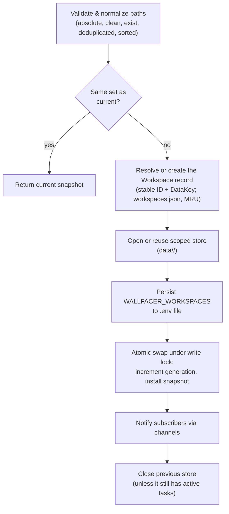
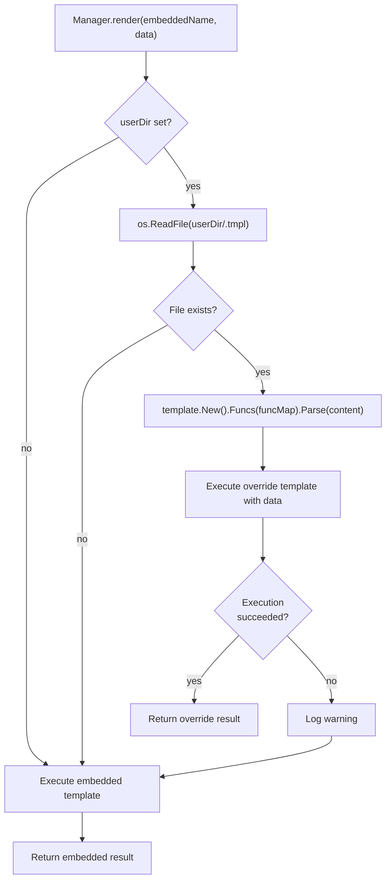

# Workspaces & Configuration

This document consolidates workspace management, activity routing, and configuration systems. These components control how Wallfacer scopes task data, selects the host CLI for each agent, and propagates user settings.

## Workspace Manager

The workspace manager (`internal/workspace/manager.go`) coordinates workspace switching, store lifecycle, and change notification.

### Data Model

A workspace is an owned, stably-identified set of folder paths (`internal/workspace/groups.go`). Its identity (`ID`) and its storage handle (`DataKey`) are independent of its membership (`Folders`), so the owner may change folders without orphaning history:

```go
type Workspace struct {
    ID      string   // stable UUIDv4, assigned once at creation/migration
    Name    string   // optional human label
    Folders []string // mutable; absolute, clean, sorted, deduped
    DataKey string   // stable storage handle under data/<DataKey>

    MaxParallel     *int  // per-workspace override of WALLFACER_MAX_PARALLEL (nil = inherit)
    MaxTestParallel *int  // same for WALLFACER_MAX_TEST_PARALLEL
    Autoimplement   *bool // per-workspace automation toggles (autopush stays global)
    Autotest        *bool
    Autosubmit      *bool
    Autosync        *bool

    CreatedBy string // principal sub in cloud mode; empty locally
    OrgID     string // org scope; empty for personal/legacy workspaces
    Dormant   bool   // history recovered by migration; folders await re-pointing
}
```

The manager's `Snapshot` (`internal/workspace/manager.go`) captures the active workspace at a point in time: `WorkspaceID` (empty for ad-hoc/legacy path switches pre-migration), `Workspaces` (the active folder set), `Store`, `ScopedDataDir`, `Key` (the active workspace's `DataKey`), and a monotonically increasing `Generation`.

### DataKey: identity decoupled from paths

The workspace's identity is its `ID`; its data directory is `data/<DataKey>/`. Neither is a function of the folder set. Two key sources exist:

- **Explicit creation** (`Manager.Create`, `POST /api/workspaces`): a random key from `prompts.NewDataKey()`. A new workspace pointing at the same folders as an existing one starts with empty history, the core property of the redesign.
- **Path-seeded** (`prompts.WorkspaceDataKey(folders)`, `internal/prompts/instructions.go`): a SHA-256 fingerprint of the sorted, colon-joined absolute paths, truncated to 16 hex characters. This hash survives only as the initial `DataKey` of records migrated from the legacy path-keyed model, and for transitional workspaces minted by plain path switches (`resolveWorkspaceForPaths`), where reusing the hash means the existing `data/<hash>/` directory keeps its history.

`Manager.UpdateFolders` replaces a workspace's folder set without touching `ID` or `DataKey`, so its task store, agent-session transcripts, planning state, and whiteboard stay attached. When the workspace is active, the live snapshot's paths are refreshed in place without reopening the store.

### Persistence and migration

Workspace records are persisted in `~/.wallfacer/workspaces.json` as a JSON array ordered by recency (most recently used first). `LoadGroups(configDir)` reads the canonical file and falls back to the legacy `workspace-groups.json`; `SaveGroups` writes atomically (temp file + rename).

`MigrateToWorkspaces` (`internal/workspace/migrate.go`) performs the one-time migration from the legacy path-keyed model. It is idempotent: once `workspaces.json` exists it is a no-op. Live groups become workspaces with `DataKey = WorkspaceDataKey(folders)`, the very hash that already names their data directory, so no data moves. Each `data/<hash>/` directory that holds task history but matches no live group is adopted as a **dormant** workspace (folders best-effort recovered from contained `task.json` worktree paths), so stranded history stays reachable until the owner re-points it.

On startup, `Manager.startupWorkspaces()` restores the most-recent workspace whose folder paths still validate, skipping stale records with a warning; if none are valid it starts with no active workspace so the picker opens instead of crashing.

### Workspace Scoping

The store is scoped by `DataKey`. Each workspace gets its own data directory at `data/<data-key>/`, containing all task records, events, and outputs. When the active workspace changes, a new `store.Store` is opened for (or reused from) the target data directory.

### Activation and hot-swap

The SPA manages workspaces through the CRUD endpoints (`GET/POST /api/workspaces`, `PUT/DELETE /api/workspaces/{id}`) and switches boards via `POST /api/workspaces/{id}/activate`. Activation resolves the record by ID (`Manager.SwitchByID`) and runs `Manager.activate(ws)`, which opens or reuses the store keyed by `ws.DataKey` (not by the folder paths). `Manager.Switch(paths)` remains for path-based switches (startup, `WALLFACER_WORKSPACES`); it resolves or transitionally creates the workspace record backing those folders before delegating to the same activation path:



All external side effects (store creation, workspace record upsert, env file) are applied before the atomic swap. Every failure path closes the candidate store so it does not accumulate. Deleting the active workspace returns 409.

#### Multi-store lifecycle

The manager supports multiple concurrent workspace groups via an `activeGroups` map (`map[string]*activeGroup`). Each entry tracks a `Snapshot` and an atomic `taskCount` representing the number of in-progress + committing tasks in that group.

**Store lifecycle rule**: a store stays open when `taskCount > 0 OR key == current.Key` (the viewed group).

After a successful swap:
- The new group is added to `activeGroups` (or its snapshot is updated if already present).
- The previous group's store is closed only if its `taskCount == 0` and it is no longer the viewed group.
- If switching back to a key already in `activeGroups`, the existing store is reused instead of creating a new one.

`IncrementTaskCount(key)` and `DecrementAndCleanup(key)` are called by the Runner at task start and completion to manage the reference count.

#### Runner task-to-store resolution

Each task is associated with a workspace group key at dispatch time (captured in `RunBackground()`). The Runner's `taskStore(taskID)` method resolves the correct store by looking up the task's key in `Manager.StoreForKey()`, falling back to the currently viewed store if the mapping is missing or the group is no longer active. All execution-path code (`Run()`, `commit()`, `GenerateTitle()`, etc.) uses `taskStore()` instead of the mutable `r.store` field.

Subscribers (registered via `Manager.Subscribe()`) receive `Snapshot` values on a buffered channel whenever workspaces change, allowing other components (e.g. SSE streams, the runner, autoimplement watchers) to react to workspace switches.

## Repository Instructions

Wallfacer does not generate or inject a workspace-level instructions file. Each task runs with its git worktree as the working directory (see Harness Routing below), so the agent reads each repository's own `AGENTS.md` or `CLAUDE.md` natively from the worktree CWD. The constants `prompts.CodexInstructionsFilename` (`AGENTS.md`) and `prompts.ClaudeInstructionsFilename` (`CLAUDE.md`) name those files.

## Harness Routing

### Registered harnesses

The `internal/harness` package defines harness identities as `ID` constants and keeps a package-level registry (`internal/harness/registry.go`). Five subprocess harnesses register at init time, plus one in-process harness:

- **`Claude`** (`"claude"`): execs the Claude Code CLI. Authenticates via `CLAUDE_CODE_OAUTH_TOKEN` or `ANTHROPIC_API_KEY`. `harness.Default()` returns Claude.
- **`Codex`** (`"codex"`): execs the OpenAI Codex CLI. Authenticates via `OPENAI_API_KEY` or host `~/.codex/auth.json`.
- **`Cursor`** (`"cursor"`): adapts the `cursor-agent` CLI and emits Claude-style stream-json so the runner parses it on the same path. Authenticates via `CURSOR_API_KEY`.
- **`OpenCode`** (`"opencode"`): execs the opencode CLI; provider auth is managed by `opencode auth login` on the host.
- **`Pi`** (`"pi"`): execs the pi CLI; no credential fields.
- **`Topos`** (`"topos"`): in-process, not a subprocess. Runs through the embedded topos runtime (`internal/agentgraph`); supports system prompts and usage reporting but not resume or MCP. Experimental/opt-in.

Execution for the subprocess harnesses is host-process. The runner execs the selected CLI as a host process with the task's git worktree as CWD (`internal/runner/runner.go`, `HostBackend` in `internal/executor/host.go`); there is no container start, image pull, or bind-mount. The `WALLFACER_AGENT` env var the runner injects records which CLI was selected.

`harness.DefaultFrom(value)` returns the parsed identity or falls back to `Claude` for unknown values.

### Activity routing

`Runner.runAgent()` resolves the effective harness per agent run, newest tier first (`internal/runner/agent.go:179-194`):

1. **Agent/role harness pin** (`role.Harness` if set and valid). This top tier wins over every per-task and env tier, so a role authored or cloned with harness `codex` always reaches Codex regardless of task or env settings.
2. **Per-task per-activity override, deprecated** (`task.SandboxByActivity[activity]` if set and valid). Back-compat only: new tasks do not populate this map (matching `data-and-storage.md`), but the runner still reads it when present.
3. **Per-task default** (`task.Sandbox` if set and valid).
4. **Env-file per-activity setting** (`WALLFACER_SANDBOX_<ACTIVITY>`, e.g. `WALLFACER_SANDBOX_TESTING=codex`).
5. **Env-file default** (`WALLFACER_DEFAULT_SANDBOX`).
6. **Hardcoded fallback** (`Claude`).

Tiers 2-6 live in `Runner.sandboxForTaskActivity()` (`internal/runner/container.go:253`); tier 1 sits above them in `runAgent`, so the pin short-circuits the per-task chain entirely. `Task.SandboxByActivity` is typed `map[SandboxActivity]harness.ID` (`internal/store/models.go:283`).

Activities consulted by the env-file tier (`Runner.sandboxFromEnvForActivity()`, `internal/runner/container.go:275`):

| Activity | Env variable | Purpose |
|---|---|---|
| `implementation` | `WALLFACER_SANDBOX_IMPLEMENTATION` | Main task execution |
| `testing` | `WALLFACER_SANDBOX_TESTING` | Test verification agent |
| `title` | `WALLFACER_SANDBOX_TITLE` | Auto title generation |
| `oversight` | `WALLFACER_SANDBOX_OVERSIGHT` | Oversight summary generation |
| `commit_message` | `WALLFACER_SANDBOX_COMMIT_MESSAGE` | Commit message generation |

The `SandboxActivity` constant set in `internal/store/models.go` also includes `refinement`, `agent-session`, `test`, and `oversight-test`. These are not switched on by the env-file tier (the resolution switch covers only the six rows above). `test` and `oversight-test` exist for usage attribution, and `refinement` is vestigial now that prompt refinement runs as the Plan task-mode chat rather than a dedicated routed agent.

### Host CLI resolution

There is no `--image` flag and no container start. The host backend selects the CLI by `WALLFACER_AGENT` and resolves its path from the env file via `WALLFACER_HOST_{CLAUDE,CODEX,CURSOR,OPENCODE,PI}_BINARY`: an explicit path when set, otherwise the harness's default binary name resolved via `$PATH`.

`wallfacer doctor` probes readiness via `checkHostBackend` (`internal/cli/doctor.go`): it resolves the `claude` (required) plus `codex` and `cursor-agent` (optional) binaries and runs `--version` on each, printing the same hint the runner would surface at startup if a binary is missing. A claude-only host is valid; tasks typed to an absent optional CLI fail.

### Model selection

`Runner.modelFromEnvForSandbox()` reads the model from the env file:

- Claude: `CLAUDE_DEFAULT_MODEL` (title generation uses `CLAUDE_TITLE_MODEL` with fallback to the default).
- Codex: `CODEX_DEFAULT_MODEL` (title generation uses `CODEX_TITLE_MODEL` with fallback to the default).

### Credential gate

Before launching any task, `Handler.sandboxUsable()` validates that the selected harness has valid credentials. For Codex, this checks (in order): host `~/.codex/auth.json`, then `OPENAI_API_KEY` in the env file, and requires a successful env test (`POST /api/env/test`). Tasks are rejected with an error if credentials are missing.

## Environment Configuration

### File Location and Parsing

The environment configuration lives at `~/.wallfacer/.env` (auto-generated on first run with commented-out defaults). It is a standard dotenv file: blank lines and lines starting with `#` are ignored, an optional `export ` prefix is stripped, values may be quoted (single or double), and inline comments after unquoted values are stripped while literal `#` inside quoted strings is preserved.

`envconfig.Parse(path)` (`internal/envconfig/envconfig.go`) reads the file and returns a typed `envconfig.Config` struct. The parser is permissive, unknown keys are silently skipped, and integer fields that fail to parse are left at their zero value (which triggers default behavior downstream).

### Config Fields

The `Config` struct covers all known keys. Key categories:

| Category | Fields |
|---|---|
| **Authentication** | `OAuthToken` (`CLAUDE_CODE_OAUTH_TOKEN`), `APIKey` (`ANTHROPIC_API_KEY`), `AuthToken` (`ANTHROPIC_AUTH_TOKEN`), `ServerAPIKey` (`WALLFACER_SERVER_API_KEY`) |
| **Claude model** | `BaseURL`, `DefaultModel`, `TitleModel` |
| **OpenAI/Codex** | `OpenAIAPIKey`, `OpenAIBaseURL`, `CodexDefaultModel`, `CodexTitleModel` |
| **Cursor/OpenCode** | `CursorAPIKey` (`CURSOR_API_KEY`), `OpenCodeServerPassword` (`OPENCODE_SERVER_PASSWORD`) |
| **Parallelism** | `MaxParallelTasks`, `MaxTestParallelTasks` |
| **Harness routing** | `DefaultSandbox`, `ImplementationSandbox`, `TestingSandbox`, `TitleSandbox`, `OversightSandbox`, `CommitMessageSandbox` (all typed `harness.ID`) |
| **Host backend** | `HostClaudeBinary`, `HostCodexBinary`, `HostCursorBinary`, `HostOpenCodeBinary`, `HostPiBinary` (`WALLFACER_HOST_{CLAUDE,CODEX,CURSOR,OPENCODE,PI}_BINARY`), optional explicit CLI paths; empty resolves via `$PATH` |
| **Behavior** | `OversightInterval`, `ArchivedTasksPerPage`, `AutoPushEnabled`, `AutoPushThreshold`, `AgentSessionWindowDays` (`WALLFACER_AGENT_SESSION_WINDOW_DAYS`, deprecated alias `WALLFACER_PLANNING_WINDOW_DAYS`), `TerminalEnabled` (`WALLFACER_TERMINAL_ENABLED`, default `true`) |
| **Workspaces** | `Workspaces` (parsed from OS path-list separator via `filepath.SplitList`) |
| **Cloud** | `Cloud` (`WALLFACER_CLOUD`; gates cloud-only UI surfaces and routes) |

### Atomic Updates

`envconfig.Update(path, updates)` performs a read-modify-write merge:

1. Reads the existing file line-by-line.
2. For each line whose key matches an entry in the `Updates` struct:
   - `nil` pointer: line is left unchanged (field preservation for omitted token fields).
   - Non-nil, non-empty: line is replaced with `KEY=value`.
   - Non-nil, empty string: line is removed (cleared).
3. New keys not already in the file are appended in the stable order defined by `knownKeys`.
4. The result is written atomically via a temp file + `os.Rename`.

This design means that `PUT /api/env` can safely omit token fields, they are preserved in the file as-is. The handler only sets a pointer when the caller explicitly provides a value.

### Propagation to Running Components

The env file is re-read on every agent process launch (`r.modelFromEnvForSandbox`, etc.), so changes made via the UI take effect immediately for new tasks without a server restart. Already-running tasks are unaffected, they received their environment when the process was spawned.

The path handed to `--env-file` is resolved per-launch by `Runner.resolveEnvFile()`. When the configured env file (which may be overridden via `ENV_FILE` / `--env-file` to a transient location, e.g. a `mktemp` path under `/var/folders` that macOS's tmp-reaper purges after a few idle days) is missing at launch time, it falls back to the canonical default `~/.wallfacer/.env`. This keeps long-idle scheduled tasks from dying with an opaque `--env-file ... no such file` launch error (a failure mode inherited from the container-era backend). The fallback only redirects to a known-good default; an unrelated missing path is passed through unchanged so the backend still surfaces its own diagnostic. The host backend is independently resilient, `HostBackend.buildChildEnv` merely warns and continues when the env file cannot be read.

Watchers (auto-promoter, auto-retrier, etc.) do not directly subscribe to env file changes. They read configuration values from in-memory state on the `Handler` or `Runner` structs, which are populated from the env file at startup. Some values (like `MaxParallelTasks`) are re-read from the env file whenever they are needed by the promoter logic.

## System Prompt Templates

### Embedded Templates

Prompt templates are embedded into the binary at compile time via `go:embed *.tmpl` in the `prompts` package (`internal/prompts/prompts.go`):

| Embedded file | API name | Used for |
|---|---|---|
| `title.tmpl` | `title` | Auto-generating task titles from prompts |
| `commit.tmpl` | `commit_message` | Generating commit messages during the commit pipeline |
| `test.tmpl` | `test_verification` | Test verification agent prompt |
| `refinement.tmpl` | `refinement` | Prompt refinement agent |
| `oversight.tmpl` | `oversight` | Oversight summarization of task activity |
| `conflict.tmpl` | `conflict_resolution` | Rebase conflict resolution agent |

### Override Storage

User overrides are stored at `~/.wallfacer/prompts/<apiName>.tmpl`. The `Manager` checks this directory on every render call, no caching, so edits take effect immediately.

### Render Pipeline



Key design: a broken override never crashes the server. Parse or execution errors are logged as warnings and the embedded default is used instead.

### Template Function Map

All templates (embedded and override) share a single `FuncMap`:

- `add(a, b int) int`, integer addition, used for 1-based indexing in templates (e.g., `{{add $i 1}}`).
- `mul(a, b float64) float64`, floating-point multiplication.
- `sub(a, b float64) float64`, floating-point subtraction.

### Validation

`Manager.Validate(apiName, content)` performs a two-phase check:
1. **Parse**: verifies template syntax.
2. **Dry-run execute**: runs the template against a mock context struct (`mockContextFor()`) specific to each API name. This catches field-access errors (e.g., referencing `.NonExistentField`) at write time rather than at runtime.

`PUT /api/system-prompts/{name}` calls `Validate` before writing the override file.

### API Endpoints

| Method | Path | Behavior |
|---|---|---|
| `GET /api/system-prompts` | Lists all 8 templates with their content and override status |
| `GET /api/system-prompts/{name}` | Returns a single template by API name |
| `PUT /api/system-prompts/{name}` | Validates and writes override to `~/.wallfacer/prompts/<name>.tmpl` |
| `DELETE /api/system-prompts/{name}` | Deletes the override file, restoring the embedded default |

## See Also

- [Architecture](architecture.md), System overview, state machine, concurrency model
- [Git Worktrees](git-worktrees.md), Worktree setup, commit pipeline, branch management, orphan pruning
- [API & Transport](api-and-transport.md), HTTP API routes, SSE, metrics, middleware
- [Task Lifecycle](task-lifecycle.md), State transitions, data models, event sourcing
