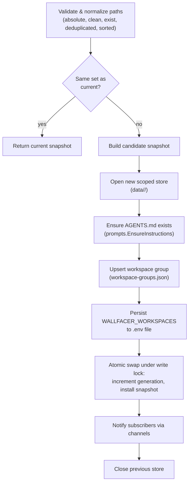
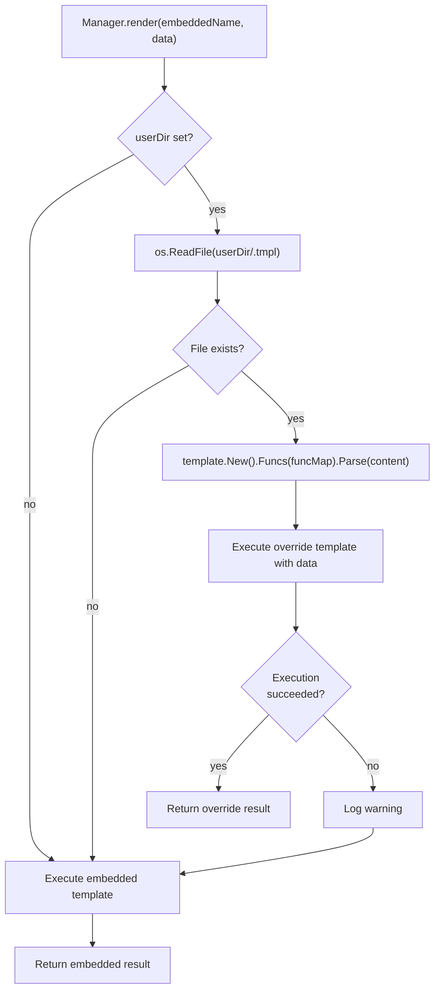

# Workspaces & Configuration

This document consolidates workspace management, instructions lifecycle, activity routing, and configuration systems. These components control how Wallfacer scopes task data, selects the host CLI for each agent, and propagates user settings.

## Workspace Manager

The workspace manager (`internal/workspace/manager.go`) coordinates workspace switching, store lifecycle, and change notification.

### Data Model

```go
type Snapshot struct {
    Workspaces       []string       // sorted, deduplicated absolute paths
    Store            *store.Store   // scoped store for this workspace set
    InstructionsPath string         // path to merged AGENTS.md
    ScopedDataDir    string         // data/<workspace-key>/
    Key              string         // 16-char hex SHA-256 fingerprint
    Generation       uint64         // monotonically increasing version
}
```

### Workspace Key Hashing

Each unique combination of workspace directories is identified by a SHA-256 fingerprint of the sorted, colon-joined absolute paths, truncated to 16 hex characters. This is computed by `prompts.InstructionsKey()` (`internal/prompts/instructions.go:22`):

```go
func InstructionsKey(workspaces []string) string {
    sorted := slices.Clone(workspaces)
    slices.Sort(sorted)
    h := sha256.Sum256([]byte(strings.Join(sorted, ":")))
    return fmt.Sprintf("%x", h[:8]) // 16 hex chars
}
```

Because paths are sorted before hashing, switching to workspaces `~/a` and `~/b` (in any order) produces the same key and shares the same data directory and instructions file.

### Workspace Groups

Workspace groups are persisted in `~/.wallfacer/workspace-groups.json` by the `workspace` package (`internal/workspace/groups.go`). Each group is a `Group{Workspaces: []string}` entry. The file is a JSON array of groups, ordered by recency (most recently used first).

Key operations:
- **`Load(configDir)`** -- reads and normalizes groups from disk
- **`Save(configDir, groups)`** -- atomic write via temp file + rename
- **`Upsert(configDir, workspaces)`** -- adds a new group or promotes an existing one to the front of the list (MRU ordering)
- **`Normalize(groups)`** -- deduplicates groups, sorts paths within each group, removes empty entries

On startup, `Manager.startupWorkspaces()` loads the first group from `workspace-groups.json` as the default. If no saved group exists, it starts with no active workspaces.

### Workspace Scoping

The store is scoped by workspace key. Each unique workspace set gets its own data directory at `data/<workspace-key>/`, containing all task records, events, and outputs for that workspace combination. When workspaces change, a new `store.Store` is opened for the new data directory.

### Hot-Swap via `PUT /api/workspaces`

`Manager.Switch(paths)` handles runtime workspace switching:



All external side effects (store creation, instructions file, workspace groups, env file) are applied before the atomic swap. Every failure path closes the candidate store so it does not accumulate.

#### Multi-store lifecycle

The manager supports multiple concurrent workspace groups via an `activeGroups` map (`map[string]*activeGroup`). Each entry tracks a `Snapshot` and an atomic `taskCount` representing the number of in-progress + committing tasks in that group.

**Store lifecycle rule**: a store stays open when `taskCount > 0 OR key == current.Key` (the viewed group).

After a successful swap:
- The new group is added to `activeGroups` (or its snapshot is updated if already present).
- The previous group's store is closed only if its `taskCount == 0` and it is no longer the viewed group.
- If switching back to a key already in `activeGroups`, the existing store is reused instead of creating a new one.

`IncrementTaskCount(key)` and `DecrementAndCleanup(key)` are called by the Runner at task start and completion to manage the reference count.

#### Runner task-to-store resolution

Each task is associated with a workspace group key at dispatch time (captured in `RunBackground()`). The Runner's `taskStore(taskID)` method resolves the correct store by looking up the task's key in `Manager.StoreForKey()`, falling back to the currently viewed store if the mapping is missing or the group is no longer active. All execution-path code (`Run()`, `commit()`, `GenerateTitle()`, etc.) uses `taskStore()` instead of the mutable `r.store` field.

Subscribers (registered via `Manager.Subscribe()`) receive `Snapshot` values on a buffered channel whenever workspaces change, allowing other components (e.g. SSE streams, the runner, autopilot watchers) to react to workspace switches.

## AGENTS.md Lifecycle

### Storage Location

Workspace instruction files live in `~/.wallfacer/instructions/`. Each unique workspace combination gets its own file, named by the 16-char hex workspace key: `~/.wallfacer/instructions/<key>.md`.

### Fingerprinting

The filename is derived from the same SHA-256 fingerprint used for workspace scoping (see Workspace Key Hashing above). This means switching to workspaces `~/a` and `~/b` (in any order) shares the same instructions file.

### Default Template Generation

When `prompts.EnsureInstructions()` is called and no file exists yet, `BuildInstructionsContent()` (`internal/prompts/instructions.go`) assembles the initial content from:

1. **Default template** -- general guidance for agents (complete tasks as described, make focused changes, run tests, write clear commit messages, etc.). It also documents a read-only board-context path (`.tasks/board.json`) and sibling worktree paths the agent can read for cross-task awareness.

2. **Workspace layout section** -- lists each active workspace by basename and instructs agents to keep all file operations within those directories.

3. **Repo-specific instruction references** -- scans each workspace for `AGENTS.md` or legacy `CLAUDE.md` files and appends a "Repo-Specific Instructions" section with the per-repo paths so the agent can read them on demand.

The embedded `instructions.tmpl` still phrases these path references with a `/workspace/` prefix (`internal/prompts/instructions.tmpl`). Under host-process execution the agent runs with its git worktree as CWD, so treat the `/workspace/` strings as legacy path framing: the meaningful unit is the workspace basename and the per-repo instruction filename, not a literal mount root.

### Re-init Logic

`prompts.ReinitInstructions()` regenerates the file from scratch using `BuildInstructionsContent()`, overwriting any user edits. This is triggered by **Settings > AGENTS.md > Re-init** in the UI, which calls `POST /api/instructions/reinit`. The re-init picks up any new `AGENTS.md` / `CLAUDE.md` files that may have appeared in the workspaces since the last generation.

### Instructions Delivery

The workspace instructions file is delivered to the agent process via `--append-system-prompt` when the CLI supports it, falling back to prepending it to the `-p` prompt. The runner passes its path to the host backend as `WALLFACER_INSTRUCTIONS_PATH` (see `internal/runner/container.go` and `internal/executor/host.go`). Each task runs with its git worktree as the working directory, so the agent also picks up any per-repo `AGENTS.md` / `CLAUDE.md` natively.

## Harness Routing

### Registered harnesses

The `internal/harness` package defines harness identities as `ID` constants and keeps a package-level registry (`internal/harness/registry.go`). Three harnesses register at init time:

- **`Claude`** (`"claude"`): execs the Claude Code CLI. Authenticates via `CLAUDE_CODE_OAUTH_TOKEN` or `ANTHROPIC_API_KEY`. `harness.Default()` returns Claude.
- **`Codex`** (`"codex"`): execs the OpenAI Codex CLI. Authenticates via `OPENAI_API_KEY` or host `~/.codex/auth.json`.
- **`Cursor`** (`"cursor"`): adapts the `cursor-agent` CLI and emits Claude-style stream-json so the runner parses it on the same path.

Execution is host-process. The runner execs the selected CLI as a host process with the task's git worktree as CWD (`internal/runner/runner.go`, `HostBackend` in `internal/executor/host.go`); there is no container start, image pull, or bind-mount. The `WALLFACER_AGENT` env var the runner injects records which CLI was selected.

`harness.DefaultFrom(value)` returns the parsed identity or falls back to `Claude` for unknown values.

### Activity routing

`Runner.runAgent()` resolves the effective harness per agent run, newest tier first (`internal/runner/agent.go:179-194`):

1. **Agent/role harness pin** (`role.Harness` if set and valid). This top tier wins over every per-task and env tier, so a role authored or cloned with harness `codex` always reaches Codex regardless of task or env settings.
2. **Per-task per-activity override, deprecated** (`task.SandboxByActivity[activity]` if set and valid). Back-compat only: new tasks do not populate this map (matching `data-and-storage.md`), but the runner still reads it when present.
3. **Per-task default** (`task.Sandbox` if set and valid).
4. **Env-file per-activity setting** (`WALLFACER_SANDBOX_<ACTIVITY>`, e.g. `WALLFACER_SANDBOX_TESTING=codex`).
5. **Env-file default** (`WALLFACER_DEFAULT_SANDBOX`).
6. **Hardcoded fallback** (`Claude`).

Tiers 2-6 live in `Runner.sandboxForTaskActivity()` (`internal/runner/container.go:253`); tier 1 sits above them in `runAgent`, so the pin short-circuits the per-task chain entirely. `Task.SandboxByActivity` is typed `map[SandboxActivity]harness.ID` (`internal/store/models.go:283`).

Activities consulted by the env-file tier (`Runner.sandboxFromEnvForActivity()`, `internal/runner/container.go:275`):

| Activity | Env variable | Purpose |
|---|---|---|
| `implementation` | `WALLFACER_SANDBOX_IMPLEMENTATION` | Main task execution |
| `testing` | `WALLFACER_SANDBOX_TESTING` | Test verification agent |
| `title` | `WALLFACER_SANDBOX_TITLE` | Auto title generation |
| `oversight` | `WALLFACER_SANDBOX_OVERSIGHT` | Oversight summary generation |
| `commit_message` | `WALLFACER_SANDBOX_COMMIT_MESSAGE` | Commit message generation |
| `idea_agent` | `WALLFACER_SANDBOX_IDEA_AGENT` | Brainstorm/ideation agent |

The `SandboxActivity` constant set in `internal/store/models.go` also includes `refinement`, `planning`, `test`, and `oversight-test`. These are not switched on by the env-file tier (the resolution switch covers only the six rows above). `test` and `oversight-test` exist for usage attribution, and `refinement` is vestigial now that prompt refinement runs as the Plan task-mode chat rather than a dedicated routed agent.

### Host CLI resolution

There is no `--image` flag and no container start. The host backend selects the CLI by `WALLFACER_AGENT` and resolves its path from the env file:

- `HostClaudeBinary` (`WALLFACER_HOST_CLAUDE_BINARY`): explicit path to the Claude Code CLI; empty resolves `claude` via `$PATH`.
- `HostCodexBinary` (`WALLFACER_HOST_CODEX_BINARY`): explicit path to the Codex CLI; empty resolves `codex` via `$PATH`.

`wallfacer doctor` probes readiness via `checkHostBackend` (`internal/cli/doctor.go:147`): it resolves the `claude` (required) and `codex` (optional) binaries and runs `--version` on each, printing the same hint the runner would surface at startup if a binary is missing. A claude-only host is valid; codex-typed tasks fail if the codex CLI is absent.

### Model selection

`Runner.modelFromEnvForSandbox()` reads the model from the env file:

- Claude: `CLAUDE_DEFAULT_MODEL` (title generation uses `CLAUDE_TITLE_MODEL` with fallback to the default).
- Codex: `CODEX_DEFAULT_MODEL` (title generation uses `CODEX_TITLE_MODEL` with fallback to the default).

### Credential gate

Before launching any task, `Handler.sandboxUsable()` validates that the selected harness has valid credentials. For Codex, this checks (in order): host `~/.codex/auth.json`, then `OPENAI_API_KEY` in the env file, and requires a successful env test (`POST /api/env/test`). Tasks are rejected with an error if credentials are missing.

## Environment Configuration

### File Location and Parsing

The environment configuration lives at `~/.wallfacer/.env` (auto-generated on first run with commented-out defaults). It is a standard dotenv file: blank lines and lines starting with `#` are ignored, an optional `export ` prefix is stripped, values may be quoted (single or double), and inline comments after unquoted values are stripped while literal `#` inside quoted strings is preserved.

`envconfig.Parse(path)` (`internal/envconfig/envconfig.go`) reads the file and returns a typed `envconfig.Config` struct. The parser is permissive, unknown keys are silently skipped, and integer fields that fail to parse are left at their zero value (which triggers default behavior downstream).

### Config Fields

The `Config` struct covers all known keys. Key categories:

| Category | Fields |
|---|---|
| **Authentication** | `OAuthToken` (`CLAUDE_CODE_OAUTH_TOKEN`), `APIKey` (`ANTHROPIC_API_KEY`), `AuthToken` (`ANTHROPIC_AUTH_TOKEN`), `ServerAPIKey` (`WALLFACER_SERVER_API_KEY`) |
| **Claude model** | `BaseURL`, `DefaultModel`, `TitleModel` |
| **OpenAI/Codex** | `OpenAIAPIKey`, `OpenAIBaseURL`, `CodexDefaultModel`, `CodexTitleModel` |
| **Parallelism** | `MaxParallelTasks`, `MaxTestParallelTasks` |
| **Harness routing** | `DefaultSandbox`, `ImplementationSandbox`, `TestingSandbox`, `TitleSandbox`, `OversightSandbox`, `CommitMessageSandbox`, `IdeaAgentSandbox`, `SandboxFast` (all typed `harness.ID` except `SandboxFast`) |
| **Host backend** | `HostClaudeBinary` (`WALLFACER_HOST_CLAUDE_BINARY`), `HostCodexBinary` (`WALLFACER_HOST_CODEX_BINARY`), optional explicit CLI paths; empty resolves via `$PATH` |
| **Behavior** | `OversightInterval`, `ArchivedTasksPerPage`, `AutoPushEnabled`, `AutoPushThreshold`, `PlanningWindowDays` (`WALLFACER_PLANNING_WINDOW_DAYS`), `TerminalEnabled` (`WALLFACER_TERMINAL_ENABLED`, default `true`) |
| **Workspaces** | `Workspaces` (parsed from OS path-list separator via `filepath.SplitList`) |
| **Cloud** | `Cloud` (`WALLFACER_CLOUD`; gates cloud-only UI surfaces and routes) |

The `SandboxFast` field defaults to `true` when unset, the parser initializes it before scanning lines, and it is only set to `false` when the env file explicitly contains `WALLFACER_SANDBOX_FAST=false`.

### Atomic Updates

`envconfig.Update(path, updates)` performs a read-modify-write merge:

1. Reads the existing file line-by-line.
2. For each line whose key matches an entry in the `Updates` struct:
   - `nil` pointer: line is left unchanged (field preservation for omitted token fields).
   - Non-nil, non-empty: line is replaced with `KEY=value`.
   - Non-nil, empty string: line is removed (cleared).
3. New keys not already in the file are appended in the stable order defined by `knownKeys`.
4. The result is written atomically via a temp file + `os.Rename`.

This design means that `PUT /api/env` can safely omit token fields, they are preserved in the file as-is. The handler only sets a pointer when the caller explicitly provides a value.

### Propagation to Running Components

The env file is re-read on every agent process launch (`r.modelFromEnvForSandbox`, etc.), so changes made via the UI take effect immediately for new tasks without a server restart. Already-running tasks are unaffected, they received their environment when the process was spawned.

The path handed to `--env-file` is resolved per-launch by `Runner.resolveEnvFile()`. When the configured env file (which may be overridden via `ENV_FILE` / `--env-file` to a transient location, e.g. a `mktemp` path under `/var/folders` that macOS's tmp-reaper purges after a few idle days) is missing at launch time, it falls back to the canonical default `~/.wallfacer/.env`. This keeps long-idle scheduled tasks from dying with an opaque podman `--env-file … no such file` exit 125. The fallback only redirects to a known-good default; an unrelated missing path is passed through unchanged so the backend still surfaces its own diagnostic. Host mode is independently resilient, `HostBackend.buildChildEnv` merely warns and continues when the env file cannot be read.

Watchers (auto-promoter, auto-retrier, etc.) do not directly subscribe to env file changes. They read configuration values from in-memory state on the `Handler` or `Runner` structs, which are populated from the env file at startup. Some values (like `MaxParallelTasks`) are re-read from the env file whenever they are needed by the promoter logic.

## System Prompt Templates

### Embedded Templates

Eight prompt templates are embedded into the binary at compile time via `go:embed *.tmpl` in the `prompts` package (`internal/prompts/prompts.go`):

| Embedded file | API name | Used for |
|---|---|---|
| `title.tmpl` | `title` | Auto-generating task titles from prompts |
| `commit.tmpl` | `commit_message` | Generating commit messages during the commit pipeline |
| `test.tmpl` | `test_verification` | Test verification agent prompt |
| `refinement.tmpl` | `refinement` | Prompt refinement agent |
| `oversight.tmpl` | `oversight` | Oversight summarization of task activity |
| `ideation.tmpl` | `ideation` | Brainstorm/ideation agent |
| `conflict.tmpl` | `conflict_resolution` | Rebase conflict resolution agent |
| `instructions.tmpl` | `instructions` | Workspace instructions (AGENTS.md) generation |

### Override Storage

User overrides are stored at `~/.wallfacer/prompts/<apiName>.tmpl`. The `Manager` checks this directory on every render call, no caching, so edits take effect immediately.

### Render Pipeline



Key design: a broken override never crashes the server. Parse or execution errors are logged as warnings and the embedded default is used instead.

### Template Function Map

All templates (embedded and override) share a single `FuncMap`:

- `add(a, b int) int`, integer addition, used for 1-based indexing in templates (e.g., `{{add $i 1}}`).
- `mul(a, b float64) float64`, floating-point multiplication.
- `sub(a, b float64) float64`, floating-point subtraction.
- `exploitCount(ratio float64, total int) int`, compute exploitation count for ideation.
- `exploreCount(ratio float64, total int) int`, compute exploration count for ideation.

### Validation

`Manager.Validate(apiName, content)` performs a two-phase check:
1. **Parse**: verifies template syntax.
2. **Dry-run execute**: runs the template against a mock context struct (`mockContextFor()`) specific to each API name. This catches field-access errors (e.g., referencing `.NonExistentField`) at write time rather than at runtime.

`PUT /api/system-prompts/{name}` calls `Validate` before writing the override file.

### API Endpoints

| Method | Path | Behavior |
|---|---|---|
| `GET /api/system-prompts` | Lists all 8 templates with their content and override status |
| `GET /api/system-prompts/{name}` | Returns a single template by API name |
| `PUT /api/system-prompts/{name}` | Validates and writes override to `~/.wallfacer/prompts/<name>.tmpl` |
| `DELETE /api/system-prompts/{name}` | Deletes the override file, restoring the embedded default |

## Prompt Templates

Prompt templates are user-created reusable text fragments (distinct from the system prompt templates above). They are managed by `internal/handler/templates.go`.

### Data Model

```go
type PromptTemplate struct {
    ID        string    `json:"id"`
    Name      string    `json:"name"`
    Body      string    `json:"body"`
    CreatedAt time.Time `json:"created_at"`
}
```

- **ID**: UUID generated via `uuid.New().String()` on creation.
- **CreatedAt**: set to `time.Now().UTC()` on creation.

### Storage

All templates are stored in a single JSON file at `~/.wallfacer/templates.json` as a JSON array. Reads and writes are protected by a package-level `sync.RWMutex` (`templatesMu`). Writes use the atomic temp-file-plus-rename pattern.

### API Behavior

| Endpoint | Notes |
|---|---|
| `GET /api/templates` | Returns all templates sorted by `created_at` descending (newest first). Returns `[]` when the file does not exist. |
| `POST /api/templates` | Requires `name` and `body` (both non-empty). Returns 201 with the created template. |
| `DELETE /api/templates/{id}` | Returns 404 if not found, 204 on success. |

## See Also

- [Architecture](architecture.md), System overview, state machine, concurrency model
- [Git Worktrees](git-worktrees.md), Worktree setup, commit pipeline, branch management, orphan pruning
- [API & Transport](api-and-transport.md), HTTP API routes, SSE, metrics, middleware
- [Task Lifecycle](task-lifecycle.md), State transitions, data models, event sourcing
