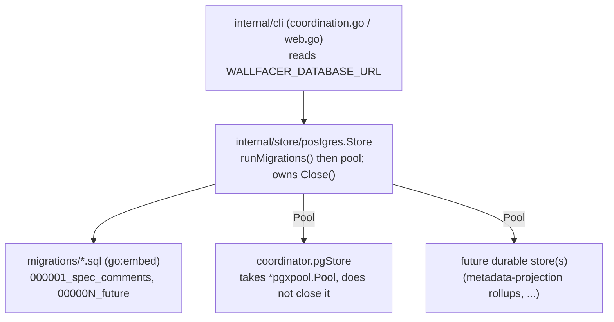

# Shared Postgres Store and Migrations

## Overview

The cloud Postgres schema is currently applied by `Exec`-ing an inline
`CREATE TABLE IF NOT EXISTS` string at store init (`internal/coordinator/pgstore.go`).
[spec-comments.md](spec-comments.md) shipped that way and explicitly deferred a
real migration framework (its Outcome: "schema migrations framework. Deferred;
the Postgres schema is applied idempotently on init rather than via golang-migrate").
This spec delivers that framework: a single shared Postgres store that owns the
pool and runs embedded, versioned migrations, so the next durable consumer
([metadata-projection.md](metadata-projection.md)'s rollups, and any future
storage) adds a numbered migration file instead of another inline schema string.

The inline `IF NOT EXISTS` pattern only ever creates new tables. It cannot
express an `ALTER`, a backfill, or a type change, and it leaves no version marker
to know which shape a database is on. The first time any Postgres table needs a
breaking change, the current approach has no answer. This closes that gap before
it bites, while a second consumer is already landing on the same database.

## Current State

- `internal/coordinator/pgstore.go` holds a `const pgSchema` string and
  `NewPostgresCommentStore(ctx, dsn)` opens its own `pgxpool.Pool`, `Exec`s the
  schema, and the returned `pgStore` owns `Close()` (closes that pool).
- `internal/cli/coordination.go` `newCommentStore` reads `WALLFACER_DATABASE_URL`
  and calls `NewPostgresCommentStore`, falling back to the in-memory store when
  unset. `internal/cli/web.go` wires the result into the web server.
- `internal/coordinator/commentstore_contract_test.go` exercises the Postgres
  store only when `WALLFACER_TEST_DATABASE_URL` is set; CI does not provision
  Postgres, so the pg path is local-only and skipped in CI.
- `go.mod` has `github.com/jackc/pgx/v5`; no migration library.
- The reference convention is `../sixt.com/com.sixt.service.agent-sandbox/internal/store/postgres`:
  golang-migrate `v4.19.1`, `//go:embed migrations/*.sql`, numbered
  `NNNNNN_name.up.sql` / `.down.sql`, migrations run at `New()` before the pool
  is handed out, `Pool()` shared to each domain store.

## Architecture

A new `internal/store/postgres` package is the single owner of the wallfacer
Postgres pool. It runs migrations at construction, then hands the live pool to
each domain store (comments today; rollups and future storage next). Domain
stores never open or close the pool. The migration sequence is one linear,
embedded set of numbered files with one `schema_migrations` table, matching the
reference. "Generic for extension" means exactly this shared-pool-plus-one-
sequence shape, no per-module registry, no per-module migration namespace.

## Components

### `internal/store/postgres` (new package)

The shared store. Mirrors the reference `postgres.go`:

- `New(ctx, dsn) (*Store, error)`: `runMigrations(dsn)` first; on success open
  `pgxpool.New`, `Ping`, return a `*Store` wrapping the pool. Migration failure
  is fatal (the caller refuses to start), matching the reference fail-fast.
- `runMigrations(dsn)`: `iofs.New(migrationsFS, "migrations")` +
  `migrate.NewWithSourceInstance("iofs", src, pgxScheme(dsn))`, then `m.Up()`
  tolerating `migrate.ErrNoChange`.
- `pgxScheme(dsn)`: rewrite `postgres://` / `postgresql://` to the `pgx5://`
  scheme golang-migrate's pgx/v5 driver expects (reference helper).
- `Pool() *pgxpool.Pool`: shared to domain stores.
- `Close()`: closes the pool. The store owns the pool lifecycle; nothing else
  closes it.
- `//go:embed migrations/*.sql` + `var migrationsFS embed.FS`.

Files: new `internal/store/postgres/postgres.go`, new
`internal/store/postgres/migrations/`, new `internal/store/postgres/postgres_test.go`.

### Migration `000001_spec_comments`

`000001_spec_comments.up.sql` is the **verbatim** current `pgSchema` body: the
two `CREATE TABLE IF NOT EXISTS` plus their `CREATE INDEX IF NOT EXISTS`. This
is load-bearing for upgrades: an existing deployment that already set
`WALLFACER_DATABASE_URL` has both tables but no `schema_migrations` table.
golang-migrate reads version 0 and runs `000001` against it; the idempotent
`IF NOT EXISTS` DDL makes that a no-op that simply stamps version 1. Rewriting
to bare `CREATE TABLE` would error on those databases and mark the schema dirty,
which then blocks every subsequent migration for every consumer. Keep the DDL
exactly as it is today. `000001_spec_comments.down.sql` drops `spec_comments`
then `spec_comment_threads` (child first).

### `internal/coordinator/pgstore.go`

- Delete the `const pgSchema` and the `pool.Exec(pgSchema)` path.
- Change the constructor to accept an injected pool:
  `NewPostgresCommentStore(pool *pgxpool.Pool) CommentStore`. It no longer opens
  the pool and no longer reads `dsn`.
- Drop `pgStore.Close()` (the shared `Store` owns the pool). The pool-ownership
  rule matters even though the CLI shutdown path does not call `Close()` today:
  the contract test does, and the next domain store will share the same pool, so
  one domain store closing it would break the others.
- All query methods are unchanged (they already take `pool`).

### CLI wiring (`internal/cli/coordination.go`, `web.go`)

`newCommentStore(ctx)` opens the shared store once when `WALLFACER_DATABASE_URL`
is set (`postgres.New(ctx, dsn)`), then constructs the comment store from
`store.Pool()`. The in-memory fallback when the env var is unset is unchanged
(`commentstore_contract_test.go:19` asserts the unset-message wording, keep it).
The owner of `store.Close()` is the CLI/web shutdown path, alongside the existing
store lifecycle; the comment store no longer carries `Close()`. `web.go` keeps
wiring the returned `CommentStore` into the web server unchanged.

## API Surface

No new external surface. `WALLFACER_DATABASE_URL` (durable store, unchanged) and
`WALLFACER_TEST_DATABASE_URL` (test-only, unchanged) keep their meaning. New
dependency: `github.com/golang-migrate/migrate/v4 v4.19.1` (pinned to the
reference version), with its `database/pgx5` and `source/iofs` drivers.

## Error Handling

- `postgres.New` returns an error on any migration or connection failure (it
  never returns a half-open store). The reference treats that as fatal and
  refuses to start. **Wallfacer's coordinator does not:** `newCommentStore`
  catches the error and falls back to the in-memory comment store with a loud
  Error log, because spec comments are best-effort infrastructure and a Postgres
  problem must not take the web server down. This is the pre-existing behavior
  (the inline-schema constructor failed the same way into the same fallback);
  the migration step just becomes one more thing `New` can fail on. See the
  Deviations note.
- **Dirty `schema_migrations` is a sticky trap.** A migration that fails partway
  marks the version dirty, and golang-migrate refuses a dirty database on every
  subsequent boot. Combined with the fallback above, a single bad migration means
  the coordinator runs on **in-memory comments indefinitely** (lost on restart,
  not shared across replicas, so split-brain across a multi-replica deploy), with
  only the error log as signal. Recovery is the standard golang-migrate `force`
  to the last good version. Whether cloud mode should instead fail loud rather
  than silently degrade is an open decision (see Follow-ups), deliberately not
  changed here.
- Existing-table upgrade (version 0 with tables present) must not error: that is
  exactly what the idempotent `000001` DDL guarantees and what the test below
  pins.

## Testing Strategy

Per the project rule, the framework ships with tests; the Postgres-touching ones
stay env-gated on `WALLFACER_TEST_DATABASE_URL` (CI has no Postgres), the same
gate `commentstore_contract_test.go` already uses.

- **`postgres_test.go` (new), env-gated.**
  - `New` on an empty database creates `schema_migrations` and applies `000001`;
    the comment tables exist and version is 1.
  - **Existing-table upgrade (the load-bearing case):** pre-create
    `spec_comment_threads` / `spec_comments` (the pre-migration shape), then run
    `New`; assert it succeeds, is not dirty, and stamps version 1. This proves
    today's `WALLFACER_DATABASE_URL` deployments upgrade cleanly. It fails if
    anyone rewrites `000001` to non-idempotent DDL.
  - `New` is idempotent: a second `New` against the same database is a no-op
    (`ErrNoChange` tolerated), version stays 1.
  - `000001` down migration drops both tables (child-first, no FK error).
- **`commentstore_contract_test.go` (update).** Switch the Postgres branch to
  open the shared store and pass `store.Pool()` to the new
  `NewPostgresCommentStore(pool)` signature; the store, not the comment store,
  owns `Close()`. The contract assertions over the `CommentStore` behavior are
  unchanged.
- **`make build`** is the gate (lint catches unused code the go toolchain
  misses): run it after the new imports land.

## Implementation notes

### Status

Implementation fully shipped on `main`, 2026-06-25. Commits `518ceb91` (package +
migrations + deps) and `c2fb54f2` (coordinator/CLI switch to the injected pool).
Verified against a real Postgres 16 container; all touched-package tests pass.
Frontmatter promoted to `complete` 2026-06-26 after full implementation was
confirmed shipped on `main`.

### What was done

- **New package `internal/store/postgres`** (`postgres.go`): owns the wallfacer
  pool, runs embedded golang-migrate migrations at `New()` before the pool is
  returned, `pgxScheme` rewrites `postgres://` to `pgx5://`, `Pool()` shares the
  pool, `Close()` is the sole owner. Pinned `github.com/golang-migrate/migrate/v4
  v4.19.1`.
- **Migrations** (`migrations/000001_spec_comments.{up,down}.sql`): the up file
  is the previous inline schema verbatim (idempotent `IF NOT EXISTS`); the down
  drops `spec_comments` then `spec_comment_threads`.
- **Coordinator** (`pgstore.go`): deleted the `pgSchema` const and the inline
  `Exec`; `NewPostgresCommentStore(pool *pgxpool.Pool)` borrows the pool and no
  longer owns `Close()`.
- **CLI** (`coordination.go` `newCommentStore`): opens `postgres.New(ctx, dsn)`
  once and passes `st.Pool()` to the comment store; the memory fallback is
  unchanged. `web.go` needed no change (it never closed the store).
- **Tests**: `postgres_test.go` (empty-DB, existing-tables upgrade, idempotent
  re-run, down) and the updated comment-store contract branch, both env-gated on
  `WALLFACER_TEST_DATABASE_URL`. Verified against Postgres 16: the load-bearing
  `TestNew_ExistingTablesUpgrade` and the `postgres` contract subtest pass.

### Decisions made during implementation

- **`web.go` untouched, pool lives for the process.** The comment store was
  never `Close()`d before (the web server runs for the process lifetime), so
  `newCommentStore` drops the `*postgres.Store` handle rather than threading it
  to a shutdown path. The shared `Close()` exists for tests and future callers.
  Revisit when a graceful-shutdown path is introduced.
- **Down migration tested by building a `migrate` instance in-package.** `New()`
  only goes up, so the down test constructs `migrate.NewWithSourceInstance` from
  the package-private `migrationsFS`/`pgxScheme` to exercise the real `.down.sql`.
- **`to_regclass` for table-existence assertions** in the test, the simplest
  schema-agnostic check.

### Deviations from the spec

- **Migration failure is not fatal in wallfacer.** The spec's first draft
  (following the agent-sandbox reference) said failure is fatal and the caller
  does not start. The coordinator instead falls back to the in-memory store on a
  `postgres.New` error, preserving the pre-existing best-effort behavior of
  `newCommentStore` rather than taking the web server down. The Error Handling
  section above was rewritten to describe the actual fallback (and the dirty-DB
  consequence); this deviation is intentional, not an oversight.
- `web.go` being a no-op change was anticipated in the spec body (it "keeps
  wiring the returned `CommentStore` ... unchanged").

### Surprises / gotchas

- `go mod tidy` pulled `github.com/jackc/pgerrcode` as a new indirect dep of
  golang-migrate's pgx5 driver. Expected, not a concern.
- CI still provisions no Postgres, so the pg-touching tests skip there; they ran
  green only because a container was spun up locally for this verification. The
  durable path remains CI-unverified by design (matches the pre-existing
  contract-test gate).
- **Dirty-DB trap (consequential).** A migration that fails partway leaves
  `schema_migrations` dirty; golang-migrate then refuses every subsequent boot,
  and the coordinator's fallback silently downgrades to in-memory comments
  forever (split-brain across replicas) with only an error log. A green test run
  cannot see this; it surfaces only on a real partial-migration failure. See
  Error Handling and Follow-ups.

### Follow-ups

- **Decide fail-loud vs silent-degrade for cloud mode.** Today a Postgres or
  migration failure (including a sticky dirty DB) falls back to in-memory
  comments with an error log. For data described as cloud-authoritative, the
  team may prefer the coordinator to refuse to start in cloud mode rather than
  serve split-brain comments. Not changed here (it is the pre-existing behavior
  and a deliberate prior decision); flagged for an explicit call.
- The next durable consumer ([metadata-projection.md](metadata-projection.md)
  rollups) adds `000002_*.sql` and a constructor taking `*pgxpool.Pool`; no
  further infra work for the framework itself.
