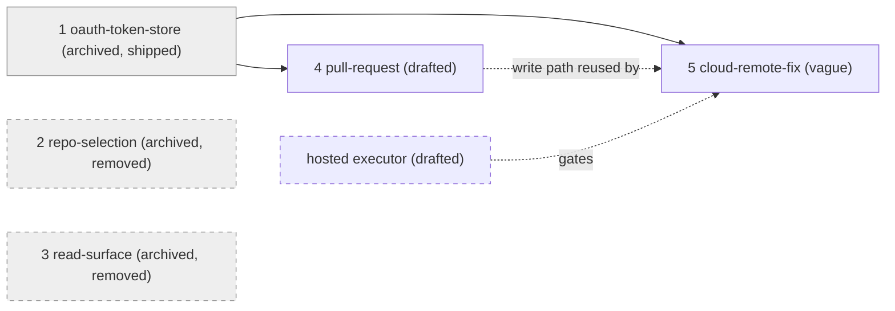
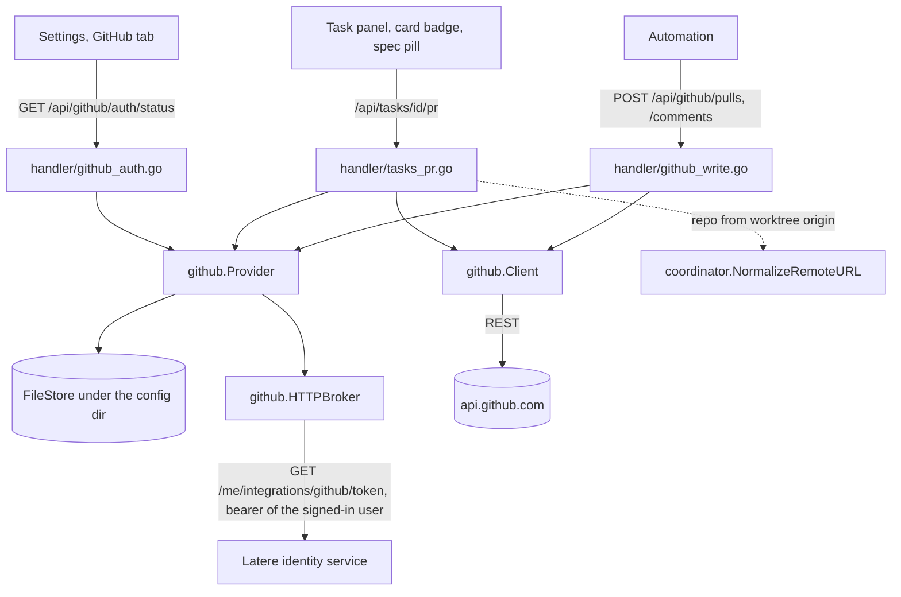

# GitHub Integration: Brokered Connection and Pull Requests on Tasks

> **Archived 2026-10-02. Retired as: wallfacer no longer connects to
> GitHub.** The maintainer decided to remove the GitHub integration from
> wallfacer and to reach GitHub later through a platform connector
> ([remove-github-integration](../../shared/platform-native/remove-github-integration.md),
> under [platform-native](../../shared/platform-native.md)). The token layer that shipped, the pull-request surface on tasks, and the Settings tab are deleted by that spec.
>
> The text below is kept as written for the record. It was refreshed against
> the code on the day it was retired, so it is an accurate description of
> what existed.

Umbrella spec. It records the architecture that is in the code and the two
decisions that shaped it; the work that remains lives in the two live child
specs under `github-integration/`.

## Design Breakdown

| # | Sub-design | What it covers | Depends on | Effort | Status |
|---|---|---|---|---|---|
| 1 | [oauth-token-store](github-integration/oauth-token-store.md) | Brokered token, principal-scoped file store, status routes, Settings tab | identity/authentication | large | archived: shipped |
| 2 | [repo-selection](github-integration/repo-selection.md) | Repository list and picker | #1, repo-identity | medium | archived: built, then removed by the task-centric redesign |
| 3 | [read-surface](github-integration/read-surface.md) | Pull request and issue lists, detail, comment threads | #1 | large | archived: built, then removed by the task-centric redesign |
| 4 | [pull-request](github-integration/pull-request.md) | Pull requests on tasks. Create, state and comment are shipped; commit, push, generated text and non-open states remain | #1 (shipped) | medium | drafted |
| 5 | [cloud-remote-fix](github-integration/cloud-remote-fix.md) | A task on a GitHub repository with no local checkout | #1 (shipped), hosted executor | large | vague |

**Order.** #4 has no unbuilt dependency. Its open question on the merge path
is a product decision that the work it specifies does not wait for. #5 stays
`vague` until the hosted executor
([topos-remote-executor](../../cloud/latere-integration/topos-remote-executor.md))
exists.

## Decisions on record

The integration was specced on 2026-06-26 as a GitHub destination inside
wallfacer: connect, pick a repository, browse its pull requests and issues,
write to them. Components 1 to 4 were built in that shape on 2026-06-29 and
2026-06-30. Two decisions then changed it.

### Wallfacer borrows the GitHub connection

A single GitHub App, "Latere AI", is registered once and brokered by the
Latere identity service; wallfacer does not own the registration
(`internal/github/doc.go`). A user connects GitHub on the
latere.ai account page, and each product fetches a user-to-server token for
the signed-in user from there. Wallfacer registers no app, holds no client
secret, runs no OAuth callback, and has no connect or disconnect control.

The in-app connect flow was built (`a80ff04c`) and removed the next day
(`ff4958e7`): a connection that is shared across products is managed in one
place. `docs/guide/configuration.md` states the result for users.

What the identity service retired on 2026-09-13 is a different credential:
the installation token it used to mint for sandboxes
(`docs/internals/auth-and-identity.md`). The per-user integration this spec
relies on is the path that remains.

### GitHub is metadata on a task, not a destination

Decided 2026-06-30, after components 1 to 4 had shipped. The `/github` page,
its Sidebar entry, the repository picker, the pull request and issue lists
and every issue endpoint were removed (`22407df2`, `bd5740cc`, `df9df847`).
Rationale as recorded then: the connection lives in Settings, so a second
destination is redundant; and the repository is derived from a task's git
origin, so there is nothing to pick.

In its place, a pull request belongs to a task: the task detail has a pull
request panel, the board card has a badge, and a spec whose dispatched task
has a pull request shows a link (`ca8104b3`, `b58ae5e4`). Issues have no
replacement.

## Architecture

- **Token.** `Provider.Get` serves the token cached for the principal while it
  is valid, and otherwise asks the broker and saves the result
  (`internal/github/provider.go`). The broker authenticates with the identity
  token of the signed-in user (`internal/github/broker.go`,
  `internal/cli/server.go`). A request with no identity uses a fixed `local`
  principal.
- **Transport.** `github.Client` attaches the token, pins the REST API
  version, and maps 401, 403, 404 and rate-limit rejections to typed errors
  (`internal/github/client.go`).
- **Repository.** No selection exists. `taskRepoRef`
  (`internal/handler/tasks_pr.go`) derives owner and name from the git
  `origin` of the task's repository through `NormalizeRemoteURL`, which is
  the part of [repo-identity](../../cloud/latere-integration/coordination-plane/repo-identity.md)
  this integration consumes. Only `github.com` origins are accepted.
- **No runner involvement.** Every call is plain authenticated HTTP from the
  handler. The remaining work in [pull-request](github-integration/pull-request.md)
  is what first reaches into the runner.

Principal scoping comes from the shipped
[authentication](../identity/authentication.md) work.

## API surface

As registered in `internal/apicontract/routes.go`.

| Method | Path | Purpose | Called by the UI |
|---|---|---|---|
| `GET` | `/api/github/auth/status` | Connection state for the principal; resolves through the broker | Settings tab |
| `POST` | `/api/github/auth/connect` | Returns the install URL on the identity service | No |
| `POST` | `/api/github/auth/disconnect` | Clears the cached token | No |
| `GET` | `/api/tasks/{id}/pr` | The open pull request for the task's branch, or null | Task panel, card, spec view |
| `POST` | `/api/tasks/{id}/pr` | Create the pull request, or return the existing one | Task panel |
| `POST` | `/api/tasks/{id}/pr/comment` | Comment on the task's pull request | Task panel |
| `POST` | `/api/github/pulls` | Create a pull request for a repository, head and base given in the body | No |
| `POST` | `/api/github/comments` | Comment on a pull request or issue by number | No |

`/api/config` carries a `github` block with the fields of the status route
except `manage_url`, read from the cache without a broker call.

Error mapping, shared by the five pull request and comment routes
(`internal/handler/github.go`):

| Condition | Response |
|---|---|
| GitHub provider not wired | 503 |
| No usable token for the principal | 401 |
| Broker or store failure | 502 |
| GitHub 401 | 401 |
| GitHub rate limit (429, or 403 with no remaining budget) | 429 |
| GitHub 403 otherwise | 403 |
| GitHub 404 | 404 |
| Any other GitHub error | 502 |

## Remaining work

Owned by a child:

- Create PR cannot succeed for a task on its own, because nothing commits or
  pushes a task branch before the API call; the pull request text is not
  generated; merged and closed pull requests are not shown. All in
  [pull-request](github-integration/pull-request.md).
- A task on a GitHub repository with no local checkout.
  [cloud-remote-fix](github-integration/cloud-remote-fix.md), blocked on the
  hosted executor
  ([topos-remote-executor](../../cloud/latere-integration/topos-remote-executor.md)).

Owned by no spec, recorded here so it is not lost:

- **A multi-principal instance.** The broker's bearer is the one identity
  token the instance holds, and the cache is a directory of files. Both fit a
  single-user instance. A hosted board serving several users needs a bearer
  per request and a durable store.
- **Unused surface.** The connect and disconnect routes have no caller since
  `ff4958e7`. `Token` declares `RefreshToken`, `InstallationID`, `Account`
  and `Permissions`, and the live broker sets none of them, so the status
  response's `account` and `permissions` are always empty.
- **Verification tier.** [repo-identity](../../cloud/latere-integration/coordination-plane/repo-identity.md)
  describes an optional tier in which the coordinator verifies repository
  access server-side through the identity service's GitHub login. The
  original umbrella expected the token here to realize that tier. It does
  not: nothing in `internal/github` feeds the coordination plane.

## Scope Boundaries

**In scope:**
- A GitHub token for the signed-in user, borrowed from the latere.ai account.
- Connection state in Settings.
- A pull request per task: create, state, link, comment.
- Later and gated: running a task against a GitHub repository with no local
  checkout.

**Out of scope:**
- A GitHub destination inside wallfacer: repository picker, pull request
  lists, issue lists.
- Issues, in any form.
- Connecting or disconnecting GitHub from wallfacer.
- Merge, close, review approval, review comments.
- GitHub Actions, projects, releases, discussions.
- Hosts other than `github.com`; GitLab and Bitbucket.
- Replacing the local git endpoints in `internal/handler/git.go`; push, sync
  and rebase stay git.
- Redefining repository identity
  ([repo-identity](../../cloud/latere-integration/coordination-plane/repo-identity.md)
  owns it).
