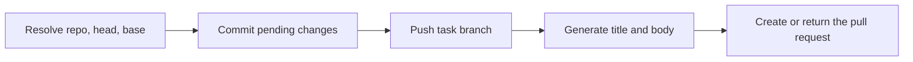

# Pull Request Creation and Commenting (Write Surface)

> **Archived 2026-10-02. Retired as: wallfacer no longer connects to
> GitHub.** The maintainer decided to remove the GitHub integration from
> wallfacer and to reach GitHub later through a platform connector
> ([remove-github-integration](../../shared/platform-native/remove-github-integration.md),
> under [platform-native](../../../shared/platform-native.md)). The shipped create, state and comment surface is deleted, and the remaining work this spec lists (pushing the task branch, a generated title and body, merged and closed states) is not built.
>
> The text below is kept as written for the record. It was refreshed against
> the code on the day it was retired, so it is an accurate description of
> what existed.

Child of [github-integration](../github-integration.md). The pull request
surface is attached to a task: a task is a branch in a repository, and its pull
request is metadata on the task. The token it uses comes from the shipped
[token layer](oauth-token-store.md).

This spec started on 2026-04-01 as a host-side `gh pr create` flow for the
branch a workspace has checked out. The create call moved to the GitHub API on
2026-06-26, and the surface moved from the workspace to the task on 2026-06-30.
What that left behind is listed under
[Removed from the earlier design](#removed-from-the-earlier-design).

---

## Shipped

| Part | Where | Commit |
|---|---|---|
| `CreatePull`, `PullForBranch`, `CreateComment` over the GitHub REST API | `internal/github/write.go` | `661ebe1f`, `ca8104b3` |
| `PullRequest` and `Comment` models | `internal/github/read.go` | `fc3b9a91`, trimmed in `bd5740cc` |
| `GET /api/tasks/{id}/pr`, `POST /api/tasks/{id}/pr`, `POST /api/tasks/{id}/pr/comment` | `internal/handler/tasks_pr.go`, `internal/apicontract/routes.go` | `ca8104b3` |
| `POST /api/github/pulls`, `POST /api/github/comments` (repository named in the body) | `internal/handler/github_write.go` | `661ebe1f` |
| Token resolution and GitHub error mapping shared by all five routes | `internal/handler/github.go` | `94bc7497` |
| Pull request panel in the task detail: create, link, state pill, comment box | `frontend/src/components/TaskPrPanel.vue`, `frontend/src/stores/githubPr.ts` | `b58ae5e4` |
| Pull request badge on the board card and pill on a spec whose dispatched task has one | `frontend/src/components/TaskCard.vue`, `frontend/src/components/plan/SpecFocusedView.vue` | `b58ae5e4` |
| Create is not offered on a done task | `frontend/src/components/TaskPrPanel.vue` | `fb8fcd5a` |

How the shipped routes resolve their inputs (`taskRepoRef`,
`internal/handler/tasks_pr.go`):

- **Repository.** The first of the task's repositories, in sorted path order,
  whose git `origin` normalizes (`coordinator.NormalizeRemoteURL`) to a
  `github.com/owner/name` identity. The sorted order was added in `09420663`
  so that a task spanning several repositories resolves to the same one on
  every call.
- **Head.** `task.BranchName` (`task/<uuid8>`).
- **Base.** The repository's default branch, or `main` when it cannot be read.
- **Title.** The request's `title`, else the task title, else the first line
  of the prompt's first 72 runes (`20bd961c`), else `Changes from <branch>`.
- **Body.** The request's `body`, else `task.CommitMessage`.
- **Existing pull request.** When GitHub answers the create with 422,
  `CreatePull` looks up the open pull request for the head and returns it.

A request with no connected GitHub token is answered 401, and an instance
with no GitHub provider 503 (`githubToken`, `internal/handler/github.go`).

---

## Problem

The shipped surface calls the GitHub API correctly and still cannot open a
pull request for a task on its own, because the task's branch is not on
GitHub when the call is made.

1. **Nothing pushes a task branch.** The code runs `git push` in three places:
   the workspace push endpoint (`internal/handler/git.go`), the auto-push
   after the commit pipeline, and the planning auto-push (both in
   `internal/runner/commit.go`). All three push the branch the workspace has
   checked out. None names the task branch. The handler's own error text says
   the task "needs a pushed branch", and the only way to get one is a manual
   `git push origin task/<uuid8>` in a terminal.
2. **A task's work is not committed until the task is done.** Uncommitted
   changes in a task worktree are staged and committed by `hostStageAndCommit`
   (`internal/runner/commit.go`), which runs in the commit pipeline. Before
   that, the task branch holds only the commits the agent made itself. A
   pushed branch with no commits ahead of the base cannot back a pull request.
3. **The failure is opaque.** GitHub rejects a create for a missing head or
   an empty range with 422. `CreatePull` treats every 422 as "a pull request
   already exists", finds none, and returns the error; `mapGitHubAPIError`
   has no case for it and answers `502 github request failed`. GitHub's own
   message is dropped.
4. **The default body is empty when Create is offered.** `task.CommitMessage`
   is written only by the commit pipeline
   (`UpdateTaskCommitMessage`, called from `hostStageAndCommit`), and the
   panel offers Create only while the task is not done.
5. **Only an open pull request is ever found.** `PullForBranch` queries
   `state=open` and the model has no merged field. The panel, the card badge
   and the user guide (`docs/guide/board.md`) all name a `merged` state that
   the server never returns, and a pull request that was merged or closed
   disappears from its task.
6. **Draft is accepted by the route and not offered by the panel.**

---

## Goal

1. Create PR on a task makes the branch ready (commits pending changes, pushes
   the branch) and then opens the pull request.
2. The title and body are generated from the branch's commits and diff, with
   the shipped defaults as the fallback.
3. A task shows its pull request in every state: open, draft, merged, closed.
4. A failure names its cause.

---

## Design

### Eligibility

Create is allowed when the task has a branch, resolves to a GitHub
repository, and is `waiting` or `failed`: the states in which a task has
run, keeps its branch, and has no agent writing to it. `in_progress` and
`committing` are refused with 409 and a message naming the state. `done` and
`cancelled` are refused with 409: the commit pipeline and the cancel path
both clean up the task's worktrees, which removes the worktree and deletes
the local branch (`gitutil.RemoveWorktree`).

`GET /api/tasks/{id}/pr` stays available in every state. `task.BranchName`
survives completion (it is cleared only by a fresh-start reset,
`internal/store/tasks_update.go`), so the lookup still has a head to query.

The panel mirrors the rule: `canCreate` in `TaskPrPanel.vue` changes from
"not done" to "waiting or failed".

### Create pipeline

`POST /api/tasks/{id}/pr` runs these steps inside the request. Steps 1 and 2
are new; step 3 replaces the shipped defaults; step 4 is the shipped call.



Steps 1 and 2 are one exported runner method in a new file,
`internal/runner/pullrequest.go`, because `hostStageAndCommit` and `repoLock`
are unexported:

```go
// PrepareTaskBranch commits pending worktree changes for the task in repoPath
// and pushes the task branch to origin. It returns ErrNoChanges when the
// branch has nothing ahead of base.
func (r *Runner) PrepareTaskBranch(ctx context.Context, taskID uuid.UUID, repoPath, base string) error
```

The handler reaches the runner through `runner.Interface`
(`internal/runner/interface.go`), so the method is added there and to
`MockRunner`.

**Step 1. Commit pending changes.** Reattach the worktree with
`ensureTaskWorktrees` if worktree garbage collection removed it, then call
`hostStageAndCommit` for the task's worktree in the resolved repository. It
already skips a clean worktree, removes injected instruction files, and
generates the commit message. The per-repository lock (`repoLock`) is held
for steps 1 and 2 so the commit pipeline of another task does not interleave.

If the branch then has no commits ahead of the base
(`gitutil.HasCommitsAheadOf`), the request ends before the push with 409 and
"the task has no changes to open a pull request for".

**Step 2. Push the task branch.** From the worktree:
`git push --set-upstream origin <branch>`. A rejected push (non-fast-forward
after a rebase of an already-pushed branch) is retried once with
`--force-with-lease`; the branch is owned by the task and nothing else writes
to it. A push failure ends the request with 502, with git's output as the
developer detail.

**Step 3. Generate the title and body.** Skipped when the request carries a
`title`. Otherwise a new runner method produces both:

```go
// GeneratePRContent runs a one-shot agent over the branch's commits and diff
// and returns a pull request title and a markdown body.
func (r *Runner) GeneratePRContent(ctx context.Context, taskID uuid.UUID, data prompts.PullRequestData) (title, body string, err error)
```

It follows the task-scoped `generateCommitMessage` in
`internal/runner/commit.go`: a new headless role, `agents.PullRequest`
(`internal/agents/headless.go`, slug `pull-request`), bound in `agentBindings`
(`internal/runner/agent_bindings.go`) as single-turn with no mounts, and run
through `runAgent` with span events and usage tracking on. A task on an
in-process harness takes the same in-process branch that
`generateCommitMessageInProcess` provides for commit messages. Inputs are
collected on the host from the worktree:

| Field | Source |
|---|---|
| `Branch`, `BaseBranch` | resolved in the first step |
| `CommitLog` | `git log --format="%h %s" <base>..HEAD` |
| `CommitBodies` | `git log --format="%h %s%n%n%b" <base>..HEAD` |
| `DiffStat` | `git diff --stat <base>...HEAD` |
| `Diff` | `git diff <base>...HEAD`, cut to 100 KB |
| `TaskPrompt` | `task.Prompt` |

The prompt is a new embedded template, `internal/prompts/pullrequest.tmpl`,
registered in `internal/prompts/prompts.go` beside `commit.tmpl` under the
API name `pull_request`, so it can be overridden like the other prompts:

```
Write a GitHub pull request title and description for the following branch.

Rules:
- Output format: the first line is the title, then a blank line, then the body.
- Title: imperative, at most 72 characters, no "PR:" or "feat:" prefix.
- Body: markdown, with a "## Summary" section of 2 to 5 bullets saying what
  changed and why, and a "## Changes" section grouped by area. Add a
  "## Breaking Changes" section only when there are any.
- Output raw text only. Do not wrap the output in a code fence.
- Do not repeat the commit messages verbatim.

Task: {{.TaskPrompt}}
Branch: {{.Branch}} into {{.BaseBranch}}

Commits:
{{.CommitLog}}

Commit details:
{{.CommitBodies}}

Changed files:
{{.DiffStat}}

Diff (may be truncated):
{{.Diff}}
```

The first non-empty line of the output is the title and the rest is the body.
When generation fails or times out, the request continues with the shipped
defaults, with one change: the body falls back to `CommitBodies` instead of
`task.CommitMessage`. That field is empty unless step 1 made a commit, and
then it describes only that commit, not the ones the agent made. A failed
generation is
recorded as a `system` event on the task and does not fail the request.

The role's binding names a new activity,
`SandboxActivityPullRequest = "pull_request"`, declared with the other
attribution-only activities in `internal/store/models.go`. It is not added to
`SandboxActivities`, so it has no routing of its own:
`sandboxForTaskActivity` (`internal/runner/container.go`) resolves it to the
task's harness, then the configured default. Usage appears under
`pull_request` in the task's `UsageBreakdown`.

**Step 4. Create.** `github.CreatePull` as shipped, with `draft` from the
request.

The request can take over a minute. The panel already shows `Creating…` while
it waits; the server writes a `system` event at each step so the task timeline
shows progress.

### Pull request state

`PullForBranch` changes from "the open pull request" to "the most recent pull
request for the head":

- Query `state=all&sort=created&direction=desc&per_page=1` with the same
  `head=<owner>:<branch>` filter.
- `prPayload` gains `merged_at`. `PullRequest.State` is `merged` when
  `merged_at` is set, otherwise GitHub's `open` or `closed`.
- `CreatePull`'s existing-pull-request path keeps asking for an open one, so a
  closed pull request does not block creating a new one. `PullForBranch`
  takes the state filter as a parameter.

No frontend change is needed for the state itself: `TaskPrPanel.vue`,
`TaskCard.vue` and `SpecFocusedView.vue` already render `open`, `merged` and
anything else as three pill classes. The draft flag is shown next to the
state (`draft` is already on the model).

### Errors

- `CreatePull` returns GitHub's 422 message when no existing pull request is
  found, and `mapGitHubAPIError` maps a 422 to `422` with that message
  instead of the generic 502.
- `CreateTaskPR` checks the result of `httpjson.DecodeOptionalBody` and
  returns when it reports failure. Today the result is discarded and a
  malformed body leads to a nil dereference after the 400 is written.
- `githubPr.ts` keeps one error string for the whole store; it becomes a map
  by task id so one task's failure is not shown on another task's panel.

### Panel

- A "Create as draft" checkbox beside Create PR, sent as `draft`.
- Create is offered for `waiting` and `failed` tasks only.
- A failed request shows the server's message under the button (already
  wired through `pr.error`).

### Repository-level routes

`POST /api/github/pulls` and `POST /api/github/comments` stay as they are.
No frontend code calls them; the user guide documents them for automation.
They do not commit, push or generate text.

---

## Removed from the earlier design

- **The `gh` CLI.** No code shells out to `gh`. The prerequisite checks
  (`gh_installed`, `gh_authenticated`), the Settings prerequisite note and the
  `wallfacer doctor` check went with it. The prerequisite is a connected
  GitHub token.
- **`GET /api/git/pr/status` and `POST /api/git/pr`.** Never built. The
  task-scoped routes replaced them.
- **Create PR in the workspace git panel.** The surface is the task panel.
  `StatusBar.vue` was deleted in `423962f4`; workspace git controls now live
  in `WorkspaceChip.vue` and carry no pull request action.
- **A pull request for the branch a workspace has checked out.** Not offered
  in the UI. The repository-level route covers it for a caller that supplies
  head and base.
- **Per-activity harness routing for pull request text**
  (`WALLFACER_SANDBOX_PULL_REQUEST`). The text is generated on the task's
  harness.
- **Usage not attributed to a task.** The surface is task-scoped, so usage is
  attributed.

---

## Scope Boundaries

**In scope:**
- Commit, push and create for one task and one GitHub repository.
- Generated title and body with a deterministic fallback.
- Open, draft, merged and closed states on the panel, the card and the spec.
- Draft creation from the panel.
- Conversation comments on the task's pull request (shipped).

**Out of scope:**
- A task that spans several GitHub repositories. One pull request is opened,
  for the first repository in sorted path order.
- Hosts other than `github.com`.
- Merge, close, review approval and line-anchored review comments.
- Reading the comment thread.
- The repository's pull request template.
- Editing the generated text before creation; the request's `title` and
  `body` fields remain the override.
- A task with no local worktree
  ([cloud-remote-fix](cloud-remote-fix.md)).

---

## Open Questions

1. **What "done" means for a task with an open pull request.** The commit
   pipeline rebases the task branch onto the local default branch,
   fast-forwards it, and deletes the local branch. The remote branch and the
   pull request are untouched. If the rebase did not rewrite the commits,
   pushing the default branch makes GitHub mark the pull request merged; if
   it did, the pull request stays open against commits that are no longer the
   ones that landed. Options: (a) leave it, and treat the pull request as a
   review artifact that the user closes; (b) after the local merge, force-push
   the rebased branch so the pull request is marked merged when the default
   branch is pushed; (c) for a task with an open pull request, replace the
   local merge with "merge on GitHub, then sync", so the pull request is the
   merge path. This decides whether the board or GitHub owns the merge, and
   is not settled by this spec.
2. Whether GitHub's `head=<owner>:<branch>` filter still matches a merged or
   closed pull request after its head branch has been deleted on the remote.
   The state design above assumes it does; verify against the API before
   building on it.
3. Whether the repository-level routes stay as an automation surface or are
   removed, given that nothing in the product calls them.

---

## Testing

- **Unit, `internal/github`:** `PullForBranch` against an httptest server for
  open, draft, merged and closed payloads, and for the state filter;
  `CreatePull` returning GitHub's message on a 422 with no existing pull
  request.
- **Unit, `internal/runner`:** title and body split from agent output
  (title only, title and body, leading blank lines, fenced output); the
  fallback when the agent fails; diff truncation at 100 KB.
- **Integration, `internal/handler`:** `CreateTaskPR` against a real git
  repository with a bare remote and a mock GitHub server: a waiting task with
  uncommitted changes ends with one commit on the remote branch and one
  create call; a task with no changes answers 409; a rejected push is retried
  with `--force-with-lease`; an `in_progress` task answers 409; a malformed
  body answers 400 without a panic.
- **Frontend:** `githubPr.test.ts` for per-task errors and the draft flag;
  `TaskPrPanel` renders Create only for `waiting` and `failed`, and renders
  the merged and closed states.
- **Docs:** `docs/guide/board.md` and `docs/guide/workspaces.md` describe the
  commit-and-push behavior and the state list that the server returns.
