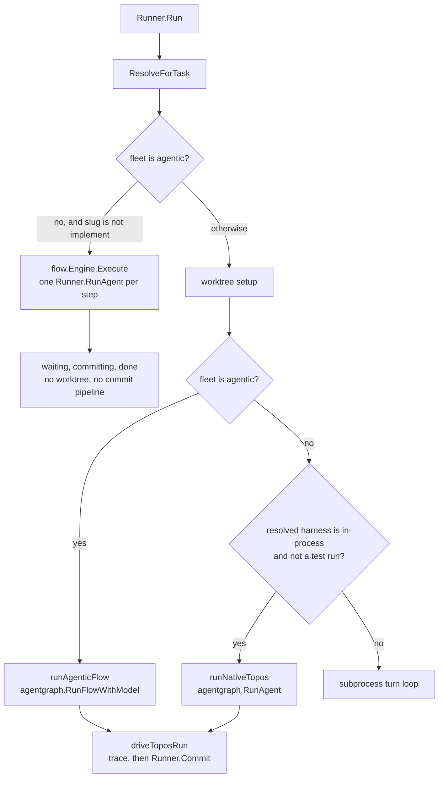

# Agent Graph: end-to-end design and teardown of the legacy flow mechanism

> **Refreshed 2026-10-02 against the code. Not accepted.** The first version
> of this spec (2026-06-28) asked for acceptance before any code.
> Implementation started the same day and ran for three days, and the
> description of the system the spec started from stopped being true. This
> version describes the code as it is, lists what shipped, and keeps the
> design for what remains. Whether the remainder is wanted is the decision in
> the next section.

## Decision this spec is waiting on

Accept the remaining work below as the plan for the agent-graph surface, or
withdraw the spec.

- **Accept** means the spec moves to `validated` and
  [Remaining work](#remaining-work) is dispatched in the order given there.
  Open questions 1 and 2 need an answer first, because two of the items
  change what a task run does to a repository.
- **Withdraw** means the spec is archived. The shipped surface is already
  recorded in
  [unified-agent-graph-ui](../.archive/local/unified-agent-graph-ui.md) and in
  the user guide. The two defects under
  [Findings](#findings-that-change-the-design) would still need an owner; the
  rest of the remaining work is dropped until it is specced again.

A note of 2026-07-18 marked this spec superseded by a consolidation of the
agent-graph model onto `latere.ai/x/topos/graph`. What that consolidation
changed in this repository is the compile path: `agentgraph.FromFlow` builds
a `graph.Graph`, resolves agent references against the registry, and lowers
it to a runtime region (`9233cff7`, `9eac7051`, `172363d9`). It did not retire
`internal/flow`, which is still the stored form of a fleet and still has a
running engine. The note is removed because it described a teardown that did
not happen.

## What this spec is for

One primitive, the **agent graph**: a named set of agents with a lead and a
coordination policy. A task is handed to a graph, enters at the lead, and is
worked to an outcome. The spec covers the whole path: authoring the graph,
choosing it on the board, running it, seeing the run on the graph, and
removing the older flow mechanism where the graph replaces it.

- **Agent.** A role: prompt, tools, harness. Authored once and reused.
- **Agent graph.** A lead, members, and a coordination: *deterministic*
  (ordered stages, agents in a stage run together) or *delegating* (the lead
  hands off to members, or any agent hands off to any other).
- **Task.** Work assigned to one agent graph.
- **Run and trace.** The executed graph: a status per agent and the
  delegations that happened.

In the code the agent graph is a `flow.Flow` (`internal/flow/flow.go`),
stored as YAML under `~/.wallfacer/flows/`, served at `/api/flows`, and
called a fleet on the page that edits it.

## Current state (verified 2026-10-02)

### Four execution paths

`Runner.Run` (`internal/runner/execute.go`) resolves the task's fleet with
`flow.Registry.ResolveForTask` (the task's `FlowID` when it names a
registered fleet, otherwise `implement`) and then branches.

| Path | Reached by | Worktree | Commit pipeline | Oversight and test runs |
|------|------------|----------|-----------------|-------------------------|
| Turn loop | the built-in `implement` fleet, the default for every task | yes | yes | yes |
| Flow engine | a user fleet that is not agentic | no | no | no |
| `runAgenticFlow` | a user fleet saved as agentic | yes | yes | no |
| `runNativeTopos` | a task whose resolved harness is `topos` | yes | yes | no |

- **Turn loop.** The built-in `implement` fleet (`internal/flow/builtins.go`)
  is not agentic and is excluded from the flow engine by name, so it runs the
  runner's own multi-turn loop: a worktree per task, the periodic oversight
  worker, test runs, and the commit pipeline.
- **Flow engine.** `flow.Engine.Execute` (`internal/flow/engine.go`) walks
  the steps in groups and launches each through `Runner.RunAgent`
  (`internal/runner/flow_launcher.go`). The branch runs and returns before
  worktree setup. `Runner.RunAgent` passes no worktree override, so
  `buildHostSpec` (`internal/runner/container.go`) sets the working directory
  of a write-capable agent to the workspace folder itself. After the engine
  returns, the task is walked through `waiting`, `committing`, and `done`
  with no call to `Runner.Commit`. `TestRun_CustomFlowExecutesViaEngine`
  covers the dispatch.
- **Embedded runtime, multi-agent.** `runAgenticFlow`
  (`internal/runner/agentic.go`) compiles the fleet into one region and runs
  it in the task's worktree.
- **Embedded runtime, single agent.** `runNativeTopos` runs one agent in the
  task's worktree. It is reached by a task whose harness resolves to `topos`,
  through a pin on the task or a setting in the env file. `harness.Default()`
  returns `Claude`, so no task reaches it unasked.

Both embedded-runtime paths end in `driveToposRun`, which forwards live
events to the task timeline, stores the final text and the trace, and then
calls `Runner.Commit` when the task has a worktree (`7e351855` for the single
agent, `291cc45d` for fleets). The task never rests in `waiting`: the walk to
`done` and the merge happen in one call. These runs start no oversight worker
and no test step, and store an empty session id. They authenticate with a
static API key only, and with no key they do not fail: they run the runtime's
test model and commit its result. Refusing such a run is Remaining item 3 of
[topos-native-harness](../shared/topos-native-harness.md).

In the UI a fleet becomes agentic through the coordination control.
`setCoordination` (`frontend/src/lib/flowDraft.ts`) sets `agentic` when a
draft is switched to Lead delegates or Open mesh and leaves it unchanged when
switched to Fixed sequence. A new fleet starts non-agentic. So a fleet first
composed in Fixed sequence runs on the flow engine, a delegating fleet runs
on the embedded runtime, and a fleet switched from a delegating mode back to
Fixed sequence stays agentic and runs on the embedded runtime as a pinned
chain. The page labels the first and the third alike, as Fixed sequence,
because `coordinationOf` reads only `dynamic` and `topology`.

### The surface

One page, `frontend/src/views/AgentGraphPage.vue` at `/agent-graph`, reached
from the rail entry "Agents". `/agents`, `/workflows`, and `/flows` redirect
to it. The left column is the agent registry with an embedded editor
(`AgentEditor.vue`); the center is the canvas
(`frontend/src/components/AgentGraphCanvas.vue`).

- A draft is opened by "New fleet", by cloning a built-in, or by editing a
  user fleet. While it is open: drag an agent from the palette to add it,
  remove a node, promote a member to lead (delegating modes), pick the
  coordination, name it, save or cancel.
- Edges are derived, not stored. Fixed sequence connects consecutive stages,
  where a stage is the set of steps joined by `run_in_parallel_with`. Lead
  delegates draws lead to member; Open mesh adds a chain between members.
- In the delegating modes a node can be dragged. Its position is kept in the
  browser's `localStorage` under `agc-pos:<slug>` and is not part of the
  fleet. In Fixed sequence nodes do not move.
- A draft has no undo. Cancel discards the whole draft.
- Fixed sequence has no gesture for reordering, for grouping steps in
  parallel, or for marking a step optional. A cloned fleet keeps the grouping
  it was cloned with.
- A run picker lists the selected fleet's tasks that carry a trace and colors
  the nodes by the chosen run's status.

### Board wiring

- The task composer has an "Agent graph" select, default `implement`, and
  shows the chosen fleet's coordination with an "experimental" tag for the
  delegating modes (`a1d88cce`). It sends the slug as `flow`, stored as
  `Task.FlowID`.
- The routine form has the same select and sends `spawn_flow`
  (`Task.RoutineSpawnFlow`).
- A task does not show which fleet it ran. `flow_id` is on the API type and
  no card or detail view renders it. The task detail renders the trace
  (`AgentTrace.vue`) for a task that has one. The agent-graph page takes no
  route parameter, so nothing can link to a fleet or to a run on it.

### Data model, API, and names

- `flow.SpawnKind` and the legacy `Kind` to fleet mapping are gone
  (`9155fa35`, `8a04ce68`). `TaskKind` has three values: task, planning,
  routine.
- `Task.RoutineSpawnKind` remains, marked deprecated. `POST /api/routines`
  still accepts `spawn_kind`, whose only allowed value is the plain task
  kind; the routine engine copies it onto each spawned task's `Kind`; and
  `RoutinesPage.vue` and `TaskCard.vue` fall back to `routine_spawn_kind` for
  a label.
- The API is `/api/flows`; there is no `/api/agent-graphs`. Fleets load from
  `~/.wallfacer/flows/` (`WALLFACER_FLOWS_DIR`); there is no `agent-graphs`
  directory.
- The same thing has four names: "Agents" on the rail, "fleet" on the page
  (`0f02e232`), "Agent graph" in the composer and the routine form, and
  "flow" in the API, the YAML, and the Go packages.

### The embedded runtime's module

`go.mod` pins `latere.ai/x/topos v0.7.0`. `internal/agentgraph` imports its
root package and `latere.ai/x/topos/graph`; a boundary test keeps every other
package off the runtime. The upstream project restarted its repository on
2026-09-26. The v0.7.0 packages are no longer on its main branch and remain
available at their tags. Any item below that needs a change in the runtime is
therefore work against a pre-rebuild module, and moving the pin to a
post-rebuild release is a migration of its own that this spec does not
design.

## Shipped

| Milestone | What | Evidence |
|-----------|------|----------|
| A1, in part | Parallel agents in a deterministic graph draw as one stage, not a chain | `c6593a66`, `deterministicStages` in `AgentGraphCanvas.vue` |
| A1, in part | Free positioning in the delegating modes; promote to lead; remove; the palette always lists every agent, so a removed agent can be dragged back | `272f6fac`, `da84d6e2` |
| A2 | Agent editing folded into the graph page; Flows and Agents pages deleted; one rail entry; redirects from the old routes | `63e1e833`, `8a04ce68`, `3d9b534a`, `d1b264f9` |
| A2, in part | "Flow" and "Workflows" removed from the composer, the routine form, and the page. One message remains: adding a duplicate agent reports it "is already a step in this flow" | `63e1e833`, `0f02e232`; `onDropAgent` in `AgentGraphPage.vue` |
| A3, in part | Composer and routines pick an agent graph; the composer shows its coordination | `63e1e833`, `a1d88cce` |
| S | Feasibility spike for running `implement` on the embedded runtime, 2026-06-29: no-go | `75a50cb2`; see [Spike S](#spike-s-what-it-found-and-what-changed-since) |
| A4' | Delegating modes labeled experimental in the editor, on the canvas, and in the composer | `66a9a757`, `a1d88cce` |
| A5, in part | `flow.SpawnKind` removed; legacy kind resolution removed; the three raw toggles replaced by one coordination control | `9155fa35`, `8a04ce68`, `da84d6e2` |

The page-level record, including what the editor dropped along the way, is
the Outcome of
[unified-agent-graph-ui](../.archive/local/unified-agent-graph-ui.md).

## Findings that change the design

### 1. A fixed-sequence user fleet is not the production path

The first version of this spec, the editor, the composer tooltip, and
[the guide](../../docs/guide/agent-graph.md) all say a deterministic graph
runs "real, committable work" with worktrees and commits. That holds for the
built-in `implement` fleet on the turn loop. It does not hold for a user
fleet in Fixed sequence, which runs on the flow engine: no worktree is
created, write-capable agents work in the workspace folder directly, and the
task reaches `done` without the commit pipeline. A clone of `implement`
therefore behaves differently from `implement`.

### 2. The experimental label states the opposite of what the runner does

The label says a delegating fleet "does not yet make durable commits or run
verification". Since `291cc45d` a delegating fleet runs in the task's
worktree and is committed and merged by `driveToposRun`. The second half is
still true: no test step, no oversight. And the commit is not gated: the run
merges without stopping in `waiting`.

### Spike S: what it found and what changed since

Spike S (2026-06-29) asked whether the embedded runtime could carry the
duties of the `implement` loop. It answered no, on four counts. Their state
today:

| Finding in the spike | Today |
|----------------------|-------|
| No worktree; edits never reach the repository | Resolved. The runtime's working directory is the task worktree (`73ed429c`, `291cc45d`) and its file tools are confined to it (`b53c98b9`) |
| No commit pipeline | Resolved. `driveToposRun` calls `Runner.Commit` (`7e351855`, `291cc45d`) |
| No test verification, no oversight, no review | Open |
| Empty session id; the run goes to `done` without the checks a waiting task gets | Open |

The spike's conclusion, that the turn loop stays, still describes the code.
Its premise, that the embedded runtime cannot produce durable work, does not.
Closing the two open rows is the work
[topos-native-harness](../shared/topos-native-harness.md) tracks as
verification parity; this spec does not duplicate it.

### Spike E: answered by the model's shape

Spike E asked whether the runtime can express arbitrary delegation between
agents. The history holds no record of it being run. Reading the pinned
module answers it: a
`graph.Region` is a coordination value (`sequence`, `lead`, or `mesh`), an
entry, and a list of peers. `graph.Edge` connects one region to another, not
one agent to another, and `agentgraph.FromFlowGraph` compiles every fleet
into a single region. Per-agent delegation edges cannot be stored or run
without a change to the runtime.

## Remaining work

Ordered so that the two defects come first. Each item changes no more than
it names.

### R1. Make the labels true

Change the copy in `AgentGraphPage.vue`, `AgentGraphCanvas.vue`,
`TaskComposer.vue`, and `docs/guide/agent-graph.md` so that it states what
the runner does: a delegating fleet commits and merges on completion and
runs no tests and no oversight; a fixed-sequence user fleet is described
according to the answer to open question 1. No execution change.

### R2. Give a fixed-sequence user fleet a defined repository contract

Blocked on open question 1. Whichever answer is chosen, the result is that a
clone of `implement` saved without changes does to a repository what
`implement` does, or the editor says plainly that it does not.

### R3. Task to graph

- The task detail names the fleet the task ran on. The card shows it when it
  is not `implement`.
- `/agent-graph` accepts the fleet and the run as route query parameters, and
  the task detail links to the page with both set, so the run overlay is
  reachable from the task and not only from the page's run picker.

### R4. Editing model

One model in every coordination mode.

- **Undo** for edits to a draft (add, remove, promote, coordination change),
  scoped to the open draft.
- **Positions saved with the fleet.** Move node positions out of
  `localStorage` into the stored fleet so a layout travels with it. The
  automatic layout is the placement for a fleet with no saved positions.
  This adds a field to `flow.Flow`, its YAML form, and the `/api/flows`
  shapes.
- **Order and parallel grouping in a deterministic graph.** The stored model
  already expresses both (`Steps` order and `RunInParallelWith`). The editor
  lost its gestures for them in the fleet rebuild. Restore them as edge
  edits: an edge means "runs after", and agents with no edge between them
  share a stage. Include the optional flag on a node.
- **Lead in a deterministic graph.** The first step is the entry in every
  mode. Mark it and let it be changed in Fixed sequence as it can be in the
  delegating modes.
- **Review is not a node.** Review is the Testing agent's verification
  rounds. Show it as a detail of the test node so its absence from the graph
  does not read as a missing step.
- **Editable delegation edges: not planned.** Blocked by the model, per
  Spike E. The two presets (Lead delegates, Open mesh) remain the expressible
  shapes. Revisit only against a runtime that stores per-agent adjacency.

### R5. One word

Blocked on open question 3. Apply the chosen word to the rail entry, the
page, the composer, the routine form, and the guide.

### R6. Data model and API

- Remove `Task.RoutineSpawnKind`, the `spawn_kind` request field, the copy in
  the routine engine, and the two frontend fallbacks to `routine_spawn_kind`.
  The only value the API admits is the plain task kind, which is also what a
  spawned task gets when the field is absent, and a routine with no
  registered spawn fleet already resolves to `implement` through
  `ResolveRoutineFlow`.
- Rename the API and the stored field only if open question 3 picks a word
  other than "flow" for the API as well. If it does: serve the new path, keep
  `/api/flows` as an alias for one release with a deprecation log line, read
  both the old and the new directory and write the new one, and read
  `Task.FlowID` and `RoutineSpawnFlow` as the same string under the new name
  so no record is rewritten.

Each item ships with a regression test for the behavior it changes.

## Acceptance criteria

- No user-facing string or guide sentence about a coordination mode
  contradicts what `Runner.Run` does for a fleet in that mode.
- A user fleet in Fixed sequence either runs in a task worktree and passes
  through the commit pipeline, or cannot be chosen for a task without a
  statement that it edits the workspace in place.
- From a task that ran on a fleet, one click reaches that fleet with that
  run overlaid.
- A draft edit can be undone without discarding the draft.
- A fleet's layout is the same in a second browser.
- A fixed-sequence draft can be reordered, grouped in parallel, and
  ungrouped on the canvas, and the saved fleet round-trips those edits.
- The rail, the page, the composer, the routine form, and the guide use one
  word for the thing a task runs on.
- `RoutineSpawnKind` appears nowhere in the tree.

## Out of scope

- Running `implement` on the embedded runtime, and the default-harness
  change that would do it:
  [topos-native-harness](../shared/topos-native-harness.md).
- Test, oversight, and review parity for embedded-runtime runs: same spec.
- Moving the runtime pin past v0.7.0.
- Per-agent delegation edges.
- First-run guidance for the surface:
  [first-run-onboarding](first-run-onboarding.md).

## Open questions

1. **What should a fixed-sequence user fleet do to a repository?** Options
   the code supports: (a) move the flow-engine branch after worktree setup,
   pass the worktree to `Runner.RunAgent`, and call `Runner.Commit` as
   `driveToposRun` does; (b) save every user fleet as agentic, so a
   fixed-sequence fleet runs as a pinned chain on the embedded runtime, which
   already has a worktree and commits, and delete `internal/flow/engine.go`;
   (c) keep the engine as it is and say so in the UI. Option (b) puts every
   user fleet on a pre-rebuild module. Option (a) keeps a second executor.
2. **Should an embedded-runtime run merge without a stop in `waiting`?**
   Today it does. The turn loop leaves a finished task for review, a test
   run, or auto-submit. This is a property of `driveToposRun` and is shared
   with the native harness; the answer applies to both.
3. **Which word?** The first version chose "agent graph" everywhere and
   allowed "fleet" in prose only. The page was then moved to "fleet"
   (`0f02e232`) and the rail to "Agents" (`d1b264f9`). Pick one for the UI,
   and say whether the API and the YAML directory follow.
4. **Is the delegating mode still wanted on the v0.7.0 embed?** It works and
   commits. Every improvement to it is work on a module the upstream project
   has replaced.
5. **Not established:** whether any stored fleet in use depends on the flow
   engine's `InputFrom` or `Optional` semantics, which the embedded runtime's
   pinned chain does not express (`agentgraph.FromFlow` documents the
   omission). Option 1(b) drops them.

## History

- 2026-06-28: first version (`cdd22ed6`), reframed the same day to stage the
  surface work ahead of any execution change (`6f8ee4fd`).
- 2026-06-28 to 2026-06-30: A1 in part, A2, A3 in part, A4', and parts of A5
  implemented without the acceptance the first version required.
- 2026-06-29: Spike S recorded as no-go (`75a50cb2`).
- 2026-07-18: marked superseded by the graph-model consolidation
  (`64f82f87`); the compile path moved onto `latere.ai/x/topos/graph`.
- 2026-07-18 and 2026-08-03: embedded-runtime runs gained the commit
  pipeline (`7e351855`, `291cc45d`).
- 2026-10-02: rewritten against the code.
