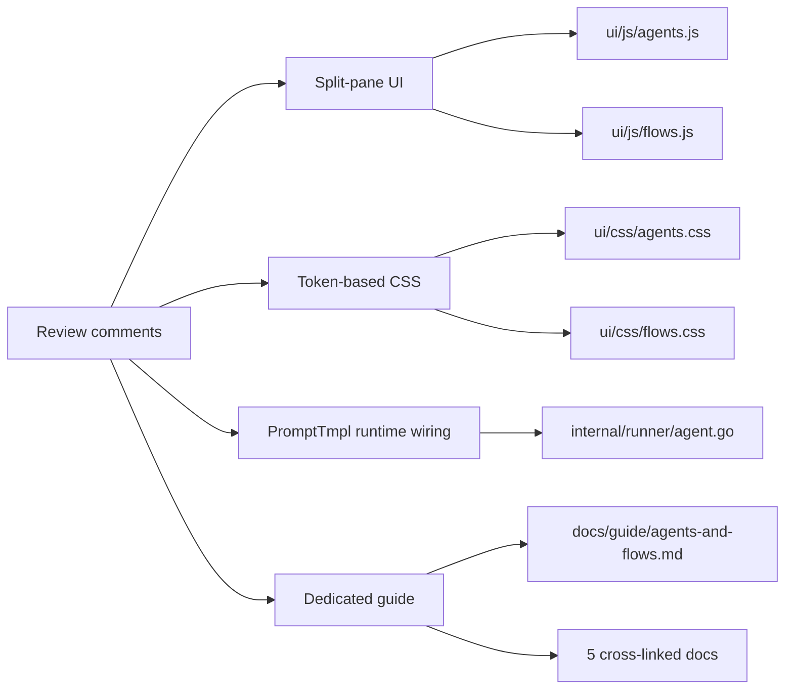

# Agents & Flows post-ship refinements

## Overview

Follow-up work to [agents-and-flows.md](../agents-and-flows.md) after that
parent spec was marked complete and archived. Four product-level
changes shipped against the already-live Agents + Flows surface in
response to post-ship review, plus the dedicated user-facing guide
the review also surfaced as a gap.

The parent's "Post-completion refinements" section captured the
earliest follow-ups (fsnotify hot-reload, inline editors, sandbox
rejection, per-activity UI retirement, a small UX batch). Work that
landed after that section was written is recorded here so a future
reader who wonders "why does the Agents tab look like this" has
one place to read.

## Current State

As of the parent's archive, the Agents and Flows tabs worked but
exhibited four rough edges the user flagged in review:

1. The layout was a vertically stacked list of cards with inline
   editors. Dense and functional but read like a settings dump
   rather than a design surface.
2. The CSS used hardcoded hex values (`#2563eb` blue, neutral
   greys) with zero references to the `tokens.css` design system,
   so the tabs visually disowned the rest of the paper-ink UI.
3. `Role.PromptTmpl` was persisted to YAML and surfaced in the
   editor but was not wired at dispatch time — the field did
   nothing at runtime.
4. There was no dedicated user-facing documentation explaining
   how the four primitives (Agent, Flow, Task, Routine) compose.
   The model was scattered across board-and-tasks.md,
   refinement-and-ideation.md, and the spec itself.

## Architecture



Each track is independent: a user could adopt the redesign without
touching the restyle, or vice-versa. They shipped together because
the review raised them together.

## Components

### Split-pane UI (Agents + Flows tabs)

- Left rail, 260px, with search, group headers (Built-in /
  User-authored), and selectable rows. Active selection gets a
  clay left-border accent; user-authored rows carry a softer
  rule-colour accent that upgrades to clay when selected.
- Right pane renders one item at a time. Read-only view for
  built-ins (key/value rows plus a lazy-loaded system prompt
  preview). Editor view for user-authored items and drafts.
- **Agents editor**: Harness as a three-way segmented control
  (Default / Claude / Codex), capabilities as labelled
  checkboxes (`workspace.read`, `workspace.write`,
  `board.context`), and a ~14-row monospace prompt textarea.
- **Flows editor**: flat step list with a `⋮⋮` drag handle,
  1-based index, agent dropdown populated from the cached
  /api/agents catalog, `optional` checkbox, and a remove
  button. Drag reorder via Sortable.js (already vendored).
  Parallel groups are not yet inline-editable; users edit YAML
  directly for parallel-sibling configurations (the guide
  documents this).
- Tabs gain `+ New Agent` and `+ New Flow` buttons that stage
  an italic dashed "draft" row in the rail while the user
  composes in the detail pane.

### Token-based CSS restyle

Both `agents.css` and `flows.css` rewritten to consume
`tokens.css` exclusively:

- Accent: hardcoded blue → `var(--accent)` (clay orange).
- Surfaces: `#fff` / `#f7f7f7` → `var(--bg-card)`,
  `var(--bg-elevated)`, `var(--bg-sunk)`.
- Typography: serif italic for detail + tab titles
  (`var(--font-serif)`), mono for chips and meta
  (`var(--font-mono)`).
- Sizes, spacing, radii all from `--fs-*`, `--sp-*`, `--r-*`.
- Badges use the tint family: `--tint-neutral` for built-ins,
  `--tint-plum` for user clones.
- Parallel groups in the flow chain render as a dashed clay
  border on `--accent-tint`.
- Error messages render as tinted blocks (`--tint-red` / `--err`).
- Inputs gain a focus ring (`--accent` border + `--accent-tint`
  box-shadow) matching other form controls.
- Dark theme works automatically because every `var()` resolves
  through the dark palette in `tokens.css`.

Token density went from roughly 72:76 (tokens:hex) in both files
to 202:0 and 199:0 respectively, on par with `spec-mode.css`
(205:18) and `board.css` (164:13).

### `Role.PromptTmpl` runtime wiring

The field was persisted + displayed but dormant. `runAgent` in
`internal/runner/agent.go` now prepends the preamble to the
caller's prompt, separated by a blank line, before handing it
to `buildAgentCmd`:

```
<role.PromptTmpl>

<caller prompt>
```

Scope caveat captured in the dispatch-site comment and the
Agents-tab editor hint: the prepend runs for every agent
invocation routed through `Runner.RunAgent` (the flow engine's
launcher). The implement turn loop's direct calls to
`GenerateCommitMessage`, `GenerateTitle`, and `GenerateOversight`
render their own templates with type-specific data structs
(`CommitData`, `TitleData`, etc.) and bypass the prepend, which
is correct for the built-in roles whose PromptTmpl is empty.

Users who want a custom commit-msg body clone the agent AND the
`implement` flow so the task routes through the engine instead
of the turn loop. The guide spells this out.

### Dedicated documentation

`docs/guide/agents-and-flows.md` (381 lines) is the primary
user-facing treatment:

- Mental model diagram (Task → Flow → Agent → Sandbox).
- Agent primitive: fields, built-in catalog, cloning, creating
  from scratch, harness pinning, system prompt with runtime-
  scope caveat, on-disk YAML.
- Flow primitive: fields, built-in catalog, cloning, step editor
  with drag handle explanation, `input_from` for chained
  prompts, the three dispatch paths (turn loop / ideation fast
  path / flow engine), on-disk YAML.
- Tasks pick flows, with composer UI sketch.
- Routines spawn against a flow via `spawn_flow`.
- Workspace defaults and the full 5-tier resolver order.
- Five recipes: pin testing to Codex, add a security-review
  step, TDD flow, custom commit messages (with the runtime-scope
  warning), and what to do when the editor's agent dropdown is
  empty.
- Troubleshooting covering common validation errors.
- Where the code lives (contributor pointer).

Five cross-linked docs were trimmed or rewritten to defer to
the new guide: `board-and-tasks.md`, `refinement-and-ideation.md`,
`autonomy-spectrum.md`, `automation.md`, and the internals trio
(`architecture.md`, `automation.md`, `data-and-storage.md`,
`task-lifecycle.md`). `README.md` gained a "How execution is
structured" section. `AGENTS.md` / `CLAUDE.md` (symlinked) grew
dedicated Agents and Flows entries in the API reference.

## Outcome

Shipped across seven commits on `main`:

| Commit | Scope |
|--------|-------|
| `78fcdcf9` | Agents tab split-pane rebuild |
| `e1aad3a5` | Flows tab split-pane rebuild with drag-and-drop step editor |
| `f7bb0dae` | `Role.PromptTmpl` prepend in `runAgent` |
| `49657486` | Dedicated docs guide and cross-reference repair |
| `74ea2a8a` | Token-based CSS restyle |
| `e8256c10`, `4bcf705e`, `6a89a7fd` | Prettier reflow of the touched files |

### What Shipped

- Two JavaScript modules rewritten around a split-pane model
  (~900 lines of new JS between them).
- Two CSS files rewritten against `tokens.css` (~520 lines of
  CSS per file).
- 20 new tests across agents + flows coverage (rail grouping,
  draft staging, clone pre-fill, parallel-group wrapping,
  harness segmented control, system-prompt textarea, suggest-
  clone-slug cap).
- 2 new backend tests for the PromptTmpl prepend (populated
  case and empty-case no-op).
- 1 new guide doc at 381 lines + 12 cross-linked docs updated
  for accuracy.
- README + AGENTS.md + CLAUDE.md repaired.

### Design Evolution

The review raised five numbered points; the shipped response
records which were adopted and which were course-corrected.

1. **How do I create a new agent / flow?** Answered with
   `+ New Agent` and `+ New Flow` buttons that stage a dashed
   italic draft row.
2. **How do I edit an existing agent's system prompt?** Answered
   with the textarea + PromptTmpl runtime wiring. A scope
   caveat was added honestly rather than papered over: the
   preamble takes effect for flow-engine dispatch, not for the
   implement turn loop's direct sub-agent calls. The alternative
   (wiring every sub-agent caller to read `Role.PromptTmpl`
   before falling back to the named template) would have been a
   deeper refactor than the scope justified.
3. **Composer flow dropdown needed a label.** Added.
4. **What does "inherit" mean?** Relabelled "(use workspace
   default)" and added a hint line.
5. **Global sandbox routing should move to the Agents tab.**
   Compromised: the Agents tab header shows a read-only info
   row with the current default and a "Change" button that
   jumps to Settings → Sandbox. Write state stays in Settings
   to avoid duplicating state across two UIs.

The visual redesign (point 8 in the review) led to the
split-pane rebuild. The docs request ("dedicated docs to
explain") led to the new guide and the cross-reference repair.

### Copy convention

Em-dashes are avoided in user-facing strings per a feedback
memory that surfaced during this review. New UI copy uses
commas, colons, or parentheses. Older docs retain their
existing em-dash convention to avoid one-off inconsistency.

## API Surface

No new HTTP routes. No new persisted fields (the `Role.PromptTmpl`
field was added in the parent spec's editable-agents-and-flows
child; this commit is its runtime activation).

## Testing Strategy

### Unit tests

- `internal/runner/agent_test.go`: `TestRunAgent_PromptTmplPrepend`
  verifies the preamble reaches the container launch args
  verbatim with a blank-line separator;
  `TestRunAgent_PromptTmplEmptyUnchanged` confirms the default
  path is byte-identical to pre-change behaviour.
- `ui/js/tests/agents.test.js`: five cases covering rail
  grouping, new-draft staging, clone pre-fill, and
  `suggestCloneSlug` cap.
- `ui/js/tests/flows.test.js`: seven cases covering rail
  grouping, `groupParallel` transitive closure, `buildChain`
  wrapping parallel groups in a visual box, open-new and clone
  drafts, and the 40-char cap on suggested slugs.

### Regression

`make test` across the full suite stays green: 1534+ backend
tests (runner + handler + agents + flows packages), 2181 UI
tests, `make lint` clean. The docs sidebar's reading-order
parser (`parseReadingOrder` in `internal/cli/server.go`)
auto-picks up the new guide entry; no code change required.

## Boundaries

- Not in scope: parallel-sibling editing in the flow step
  editor UI. Users edit YAML directly for that today.
- Not in scope: end-to-end PromptTmpl wiring through the turn
  loop. The prepend runs for flow-engine dispatch only; the
  guide documents the boundary explicitly.
- Not in scope: removing the legacy `SandboxByActivity` map
  from the persisted Task record. Marked deprecated in
  `data-and-storage.md` and no longer written; full removal
  is a separate follow-up.
- Not in scope: migrating routines whose `RoutineSpawnKind`
  is still set. The legacy-kind mapper resolves them to the
  right flow; a one-shot migration tool is unnecessary.
