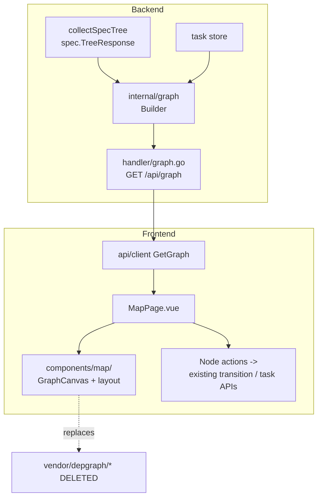
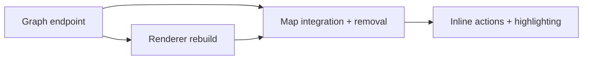

# Map as Mission Control

## Overview

The Map (`/map`) is today an orphaned, read-only visualization built on ~4,583
lines of vendored legacy renderers. It mirrors what Board and Plan already
show, fixes none of its own rendering problems (overlapping straight-line
edges, no hierarchy, drag that lags and visually detaches arrows), and answers
no question the other two surfaces don't. This spec rebuilds it into an
**actionable mission-control surface**: the one place that shows the whole
autonomous-engineering pipeline — idea → spec → task → done — as a single
dependency graph *and* lets the user drive it inline (dispatch a validated
spec, start a backlog task, retract, deep-jump to Board or Plan). The graph
becomes authoritative server-side data instead of a client-side assembly, and
the renderer is rewritten clean with no new dependency.

## Current State

- Route `/map` → `frontend/src/views/MapPage.vue` (263 lines). It installs
  `window` shims (`specModeState`, `openTaskModal`, `focusSpec`,
  `scheduleRender`, …) and dynamically imports two vendored IIFE renderers:
  - `frontend/src/vendor/depgraph/unified-graph.js` (~2,820 lines): SVG,
    Sugiyama (layered) layout, **straight-line polyline edges** (a curved-path
    `_smoothPathCurved` exists but is disabled), arrowhead markers, drag/pan/zoom.
  - `frontend/src/vendor/depgraph/depgraph.js` (~1,500 lines): legacy
    task-only path and interactions.
- The unified graph is **assembled client-side**: `MapPage` fetches
  `GET /api/specs/tree` (`internal/handler/specs.go:34 collectSpecTree`,
  returns `spec.TreeResponse`) and reads the tasks store, then the vendored JS
  derives nodes/edges from a shared `window.specModeState` object. There is no
  server-side graph model.
- Node kinds: `spec` (lifecycle-colored) and `task` (status-colored). Edge
  kinds: `containment` (parent spec → child), `dispatch` (leaf spec → task),
  `spec_dep`, `task_dep`.
- Known defects (verified in the renderer):
  1. **Overlap / no clarity** — edges are straight `L` polylines through frozen
     waypoints; no curved routing, weak hierarchy separation.
  2. **Drag lag + detachment** — `mousemove` (unified-graph.js ~2641) calls
     `liveUpdateNode` (~2403) on *every* event with no `requestAnimationFrame`
     batching, rewriting every incident edge's `d` per event; waypoint-routed
     edges freeze their middle waypoints during drag, so the polyline visually
     separates from the fast-moving node.
  3. **Read-only** — interactions are pan/zoom/filter/focus and
     shift+click-to-open. No way to *act* on a node.
- Existing action APIs the new surface will reuse (no new execution engine):
  - Dispatch a validated leaf spec: `POST /api/specs/transition`
    (`internal/handler/specs_dispatch.go`, action `dispatch`).
  - Start / promote / retract a task: `PATCH /api/tasks/{id}`
    (`routes.go:589 UpdateTask`), `DELETE /api/tasks/{id}`.
  - Spec ↔ task linkage: `spec.dispatched_task_id` ↔ `task.spec_source_path`.

## Architecture

Three layers change; the execution and lifecycle engines do not.

- **`internal/graph/`** (new): a pure builder that takes the spec tree + tasks
  and produces one authoritative `Graph` (nodes, typed edges, derived
  critical-path and blocked-chain annotations, per-node available actions).
  Pure and table-testable, mirroring `internal/pkg/dag/` and `internal/pkg/tree/`.
- **`internal/handler/graph.go`** (new): `GET /api/graph` serializing the
  builder output, registered in `internal/apicontract/routes.go` alongside
  `GetSpecTree`. Principal-scoped exactly like `collectSpecTree`.
- **`frontend/src/components/map/`** (new): a clean Vue + hand-rolled SVG
  renderer — layered layout, curved edges, RAF-batched drag, pan/zoom — with
  no new npm dependency. `MapPage.vue` is rewritten to consume `/api/graph`
  and host node-action affordances; `vendor/depgraph/*` is deleted.

## Components

### Backend graph model — `internal/graph/`

- New package `internal/graph/` with a `Builder` that consumes
  `spec.TreeResponse` (from `collectSpecTree`) and the task list and returns:
  - `Nodes`: `{ id, kind: spec|task, label, status, ref (spec path | task id),
    lane/depth, meta }`.
  - `Edges`: `{ from, to, kind: containment|dispatch|spec_dep|task_dep }`.
  - `CriticalPath`: the longest dependency chain across the *combined*
    spec+task DAG (reuse `internal/pkg/dag/` longest-path utilities).
  - `Blocked`: nodes whose prerequisites are unmet, and per-node
    `available_actions` (e.g. `dispatch` on a validated leaf spec, `start` on a
    ready backlog task) so the client renders affordances without re-deriving
    lifecycle rules.
- Build logic moves the edge/node derivation that currently lives in the
  vendored JS into typed, tested Go. Keep it a pure function of its inputs (no
  store mutation) so it is table-test friendly.

### API endpoint — `internal/handler/graph.go`

- `GET /api/graph` → JSON `{ nodes, edges, critical_path, blocked }`.
- Register in `internal/apicontract/routes.go` (Name `GetGraph`) near
  `GetSpecTree`; reuse the same principal-scoping/hidden-spec rules as
  `collectSpecTree` (see `config_test.go:332`).
- Optional `?archived=1` to include archived specs/tasks, matching the
  existing Map "Show archived" toggle semantics.

### Frontend renderer — `frontend/src/components/map/`

- New `GraphCanvas.vue` (+ a `layout.ts` and `edges.ts` helper module). Pure
  SVG, no library. Responsibilities:
  - **Layout**: layered/hierarchical placement with adequate inter-node gaps
    so hierarchy and connectivity read at a glance. Layout helper is unit-test
    friendly (input graph → node coordinates).
  - **Edges**: curved (cubic-Bézier) paths by edge kind, styled per the
    existing legend (containment / dispatch / spec-dep / task-dep). No
    overlapping straight lines.
  - **Drag**: pointer events with **`requestAnimationFrame`-batched**
    position+edge updates — at most one path rewrite per frame — and edges
    that re-aim *both* endpoints each frame so they never detach from a
    fast-moving node. This is the direct fix for defect #2.
  - **Pan/zoom**: Space-drag pan, Ctrl/⌘+scroll zoom (preserve current
    keyboard model documented in the header copy).
- `MapPage.vue` rewrite: fetch `/api/graph` (replacing the `specModeState`
  window-shim assembly and the dynamic vendored imports), pass the typed graph
  to `GraphCanvas`, keep search/filter/reset and the inspector (legend,
  selection, critical path), and host the node-action menu. Delete all
  `window` shims and the `onShowArchivedChange`/`setMapSearch` shim routing.

### Inline node actions (the "mission-control" leg)

- Selecting a node opens an action menu in the existing inspector pane with the
  actions the backend marked available:
  - **Spec node** (validated leaf): *Dispatch* → `POST /api/specs/transition`
    (action `dispatch`); *Open in Plan* → route `/plan?spec=<path>`.
  - **Task node** (backlog/ready): *Start* → `PATCH /api/tasks/{id}`
    (`status: in_progress`); *Retract/Cancel* → `PATCH`/`DELETE`; *Open in
    Board* → open `TaskDetail` (already wired via `selectedTaskId`).
- After an action, refetch `/api/graph` (or apply the SSE task delta already
  watched in `MapPage`) so the graph reflects the new state. No optimistic
  lifecycle logic on the client — the server's `available_actions` is the
  source of truth.
- **Critical-path / blocked-chain highlighting is operational**: the inspector
  surfaces "what is actionable now" (ready specs to dispatch, ready tasks to
  start) rather than a static longest-chain readout.

### Removal

- Delete `frontend/src/vendor/depgraph/unified-graph.js`,
  `depgraph.js`, and their tests (`unified-graph.drag.test.ts`,
  `unified-graph.layout.test.ts`). Remove the ambient `window` shim
  declarations in `frontend/src/env.d.ts`. Confirm no remaining `frontend/`
  reference to `vendor/depgraph` or legacy `ui/` after removal.

## Data Flow

1. `MapPage` mounts → `GET /api/graph` (optionally `?archived=1`).
2. Backend `collectSpecTree` + task store → `internal/graph` builder → JSON
   graph with critical-path / blocked / per-node actions.
3. `GraphCanvas` lays out nodes (layered), draws curved typed edges, renders
   status/lifecycle colors per the legend.
4. User drags a node → RAF-batched position + both-endpoint edge re-aim, one
   path rewrite per frame.
5. User picks a node action → existing transition/task API → refetch graph or
   apply SSE delta → re-render.

## API Surface

- `GET /api/graph` — unified spec+task graph. Query: `archived` (bool, default
  false). Response `{ nodes[], edges[], critical_path[], blocked[] }`.
- No new mutation routes: dispatch and task transitions reuse
  `POST /api/specs/transition`, `PATCH/DELETE /api/tasks/{id}`.

## Error Handling

- `/api/graph` failure → MapPage shows a non-blocking error state and a retry,
  not a blank canvas (current code only `console.error`s a tree-load failure).
- A node action that 4xx/5xxs (e.g. dispatch on a now-invalid spec, start on a
  task whose deps regressed) surfaces a toast and re-fetches the graph so the
  affordances re-sync; the optimistic affordance never leaves the UI in a lie.
- Empty graph (no specs/tasks) renders the existing empty-state copy, not an
  error.

## Testing Strategy

- **Backend (`internal/graph/`)**: table tests for node/edge derivation from a
  fixture spec tree + tasks; critical-path correctness; `available_actions`
  per lifecycle state (validated leaf → dispatch; ready backlog task → start;
  blocked task → none). Handler test for `GET /api/graph` shape and principal
  scoping, mirroring `specs_test.go` / `config_test.go:332`.
- **Frontend renderer**:
  - *Drag regression (per the test-a-bug rule)*: a test that drives a sequence
    of rapid pointer-move events and asserts (a) edge `d` is recomputed at most
    once per animation frame (RAF batched), and (b) every incident edge's
    moving endpoint equals the node's live position after the drag — i.e. no
    detachment. This fails against the un-batched vendored behavior and passes
    against the rebuild.
  - *Layout*: input graph → deterministic coordinates with non-overlapping
    nodes and correct layering (port of the intent behind
    `unified-graph.layout.test.ts`).
  - *Actions*: clicking a node's Dispatch/Start calls the right API and the
    graph refetches; deep-jump routes to Plan/Board.
- **Build/visual**: `vue-tsc --noEmit` clean; visual verification via the
  `frontend/scripts/ui-shots` harness on a graph with a parallel/branching
  shape (confirms curved edges + hierarchy clarity).

## Acceptance Criteria

- [ ] `GET /api/graph` exists in `internal/handler/graph.go`, registered in
      `routes.go`, backed by a pure tested `internal/graph` builder; returns
      nodes, typed edges, critical path, blocked set, and per-node available
      actions; principal-scoped like `collectSpecTree`; `?archived` honored.
- [ ] `frontend/src/vendor/depgraph/unified-graph.js`, `depgraph.js`, and their
      tests are deleted; `MapPage` no longer installs `window` shims or imports
      vendored renderers; no remaining `frontend/` reference to
      `vendor/depgraph` or `ui/`.
- [ ] New `components/map` renderer draws **curved** typed edges with clear
      hierarchy/layering and visibly reduced overlap vs the legacy view.
- [ ] Dragging a node fast does **not** lag and edges stay attached, proven by
      a reproducible drag test (RAF-batched updates; endpoints track the live
      node position).
- [ ] A user can act inline: dispatch a validated leaf spec, start/retract a
      backlog task, and deep-jump to Plan or Board from a node — wired to the
      real `transition` / task APIs, with the graph re-syncing after each action.
- [ ] Critical-path / blocked highlighting is operational (surfaces what is
      actionable now), not a static readout.
- [ ] `vue-tsc --noEmit` clean; visual verification via the ui-shots harness;
      `docs/guide/` updated to describe the Map mission-control surface and the
      `/api/graph` model per the docs-update rule.

## Non-Goals

- **No new graph library.** Hand-rolled SVG only; the project is deliberately
  dependency-conscious (only `mermaid` is present; even Excalidraw's React cost
  is flagged for sign-off). No vue-flow / cytoscape / d3 / dagre.
- **Not folding the Map into Board/Plan.** The standalone surface is retained
  by decision; a Board/Plan "graph lens" was the rejected alternative.
- **Board and Plan consuming `/api/graph` is forward-looking, not required**
  here. The endpoint is designed to be reusable, but this spec only wires the
  Map.
- **No change to the spec lifecycle or task execution engines.** Inline actions
  reuse existing transition/task APIs; no new states, no new runner path.

## Task Breakdown

| Child spec | Depends on | Effort | Status |
|------------|-----------|--------|--------|
| [Graph endpoint](map-mission-control/graph-endpoint.md) | — | medium | complete |
| [Renderer rebuild](map-mission-control/renderer-rebuild.md) | graph-endpoint | large | complete |
| [Map integration + removal](map-mission-control/map-integration.md) | graph-endpoint, renderer-rebuild | medium | complete |
| [Inline actions + highlighting](map-mission-control/inline-actions.md) | map-integration | medium | complete |

**Recommended order:** start the backend endpoint (A) first — it defines the
wire contract. The renderer (B) can be built in parallel once A's type shape is
fixed. Integration (C) merges both and deletes the vendored code. Inline actions
(D) land last on the working new surface.

## Open Questions

- Should `/api/graph` stream (SSE) like `/api/tasks/stream` and
  `/api/specs/tree` (stream variant), or is refetch-on-action + the existing
  task SSE delta sufficient for v1? (Lean: refetch + existing task SSE for v1;
  add a stream only if the refetch feels heavy in practice.)
- Layout determinism vs. pinned positions: keep the legacy "drag to pin /
  double-click to un-pin / reset layout" affordance, or drop pinning in favor
  of a stable deterministic layout? (Lean: keep reset; revisit pinning during
  breakdown.)

## Outcome (2026-06-27)

Implemented directly (not dispatched) across four commits, one per breakdown
task; all four leaves are complete.

- **Backend graph model** (`743d4ab7`, hardened in `c2dd5143`): new pure
  `internal/graph` builder + `GET /api/graph` compose the spec tree and task
  list into one authoritative model — typed nodes/edges, a dependency-only
  critical path, the blocked set, and per-node available actions — reusing the
  same principal-scoped sources (`collectSpecTree`, `TasksForPrincipal`) the
  spec tree and task list already use. Readiness is computed over the full task
  set so an archived-done prerequisite doesn't read as blocked; the critical
  path excludes organizational containment hops.
- **Renderer rebuild** (`cfd9b43a`, scaling fix `80d7ce5a`): hand-rolled SVG
  renderer with no new dependency — `layout.ts` (layered placement),
  `edges.ts` (curved cubic-Bézier, recomputed from live positions), and a
  RAF-batched `dragController.ts` (one path rewrite per frame, edges stay
  attached). Verifying against a live `/api/graph` capture of the **real** repo
  (352 nodes) exposed a pathology the small unit fixtures missed — a naive
  one-column-per-layer layout stacked a 93-node layer into an ~8,280px wall, so
  `computeLayout` now grid-wraps wide layers into sub-columns. Re-measured on
  the same 352-node graph: ≤16 nodes per sub-column, height bounded to 1,350px,
  zero overlaps, all 558 edges resolve. Both bug fixes plus the wide-layer cap
  are covered by unit tests.
- **Integration + removal** (`0e482920`): `MapPage` rewired onto `/api/graph` +
  `GraphCanvas`; the ~4,583-line vendored depgraph and all `window` shims
  deleted; no remaining `vendor/depgraph` or `ui/` reference.
- **Inline actions** (`80f41f61`): dispatch a validated leaf spec / start a
  ready backlog task directly from a node, plus a "Ready to act" list and
  accent-ring highlighting; docs updated.

The layout/edge geometry was validated against the real spec tree (the
352-node `/api/graph` capture above); a final pixel-level pass with the
`frontend/scripts/ui-shots` harness — which needs Playwright installed — is
left for the author to run in-app, since the subjective "feel" of the drag and
the look are best judged on screen.

Deferred (not blocking): undispatch/retract from the graph, `/api/graph` SSE
streaming (refetch-on-action + the existing task SSE delta cover v1), node
pinning, and per-layer crossing minimization (the grid-wrap bounds size; it
does not minimize edge crossings the way the old Sugiyama pass did).
