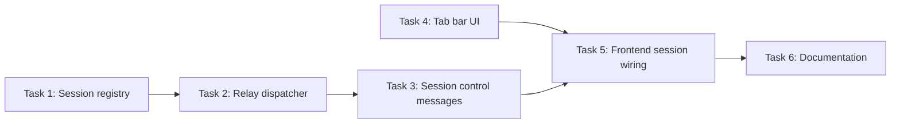

# Terminal: Multiple Sessions with Tabs

---

## Current State

- **Host terminal** is complete: single WebSocket connection per browser tab, single PTY per connection.
- **Backend**: `internal/handler/terminal.go` — `HandleTerminalWS` creates one `terminalSession` (PTY + shell process) per WebSocket. Message types: `input`, `resize`, `ping`. Two relay goroutines hardcoded to the single PTY.
- **Frontend**: `ui/js/terminal.js` — single xterm.js instance opened directly into `#status-bar-panel` (from `ui/partials/status-bar.html`). `onData`/`onResize` handlers write straight to the WebSocket with no session routing.

## Problem

Phase 1 of the host terminal ([host-terminal.md](../foundations/host-terminal.md)) provides a single shell session per browser tab. Users who need multiple shells (e.g., one for builds, one for logs, one for git) must open separate browser tabs. A tabbed terminal — like VS Code's — would allow multiple sessions within the same panel.

## Goal

Add a tab bar above the terminal panel supporting multiple concurrent shell sessions per browser tab.

## Design

- **Tab bar** above the xterm.js canvas inside `#status-bar-panel` (`ui/partials/status-bar.html`).
- **Session registry** in the handler: `map[string]*terminalSession` keyed by session ID, replacing the current single-session local variable in `HandleTerminalWS`.
- **New WebSocket messages**: `create_session`, `switch_session`, `close_session` — extend the existing `terminalMessage` struct (`internal/handler/terminal.go`) alongside the current `input`/`resize`/`ping` types.
- **Relay dispatcher**: replace the two hardcoded relay goroutines with a dispatcher that routes I/O to the currently active session's PTY.
- Each tab shows a label (numbered, or named by cwd basename).
- Switching tabs detaches xterm from the current session's PTY output and attaches to the new one.
- Closing the last tab disconnects the WebSocket.

## Dependencies

- Requires host terminal (complete).
- Required by [terminal-container-exec.md](terminal-container-exec.md) (container shell tabs need the session/tab registry).

## Outcome

Multi-session terminal tabs are fully implemented across 6 tasks. The terminal panel now supports creating, switching, and closing shell sessions via a VS Code-style tab bar, with per-session output buffering and theme-aware ANSI color palettes for both light and dark modes.

### What Shipped

- **Backend session management** (`internal/handler/terminal.go`): `sessionRegistry` with `create`, `switchTo`, `remove`, `closeAll`, `activeSession` methods; per-session PTY reader goroutines pumping into `outputCh` channels; relay dispatcher that `select`s on the active session's channel for instant switching; process monitor with auto-fallback on session exit
- **6 new WebSocket message types**: client sends `create_session`, `switch_session`, `close_session`; server responds with `session_created`, `session_switched`, `session_closed`, `session_exited`, `sessions` (list), `error`
- **Tab bar UI** (`ui/js/terminal.js`, `ui/partials/status-bar.html`, `ui/css/status-bar.css`): tab bar above xterm canvas with "+" button, per-tab close button, active tab highlighting, `mousedown preventDefault` to prevent focus theft
- **Frontend session wiring** (`ui/js/terminal.js`): session state tracking, per-session output buffering (~100KB cap), buffer replay on switch, tab population from server sessions list, automatic cleanup on disconnect/reconnect
- **Theme-aware ANSI colors**: full 16-color palettes for dark and light modes (modeled after VSCode defaults), auto-detection via background luminance, live update on theme switch via `MutationObserver`
- **20 backend tests** (7 existing + 4 registry + 3 dispatcher + 6 session message tests)
- **28 frontend tests** (11 existing + 9 tab bar + 8 session wiring tests)

### Design Evolution

1. **Per-session reader goroutines instead of blocking read loop.** The spec proposed `sync.Cond` or per-session context pause/resume for the PTY→WS relay. The initial implementation used a single blocking `ptmx.Read()` loop that checked `switchCh` between reads, but this blocked on idle sessions. Fixed by giving each session its own reader goroutine that pumps PTY output into a channel (`outputCh`), allowing the relay `select` to respond to `switchCh` instantly.

2. **`_term.clear()` instead of `_term.reset()` on session switch.** The spec suggested `reset()` for buffer clearing, but `reset()` also clears theme and font settings. Using `clear()` preserves terminal configuration.

3. **`mousedown preventDefault` on tab elements.** Not in the original spec — discovered during debugging that clicking tabs stole focus from xterm's internal textarea, causing keystrokes to trigger global shortcuts (e.g., 'e' opening the file explorer). Fixed by preventing default on `mousedown` for all tab bar elements.

4. **ANSI color palettes and theme switching.** Not in the original spec — the xterm.js theme only set background/foreground/cursor, leaving ANSI colors at defaults designed for pure black backgrounds. Added full 16-color palettes for both modes and a `MutationObserver` to reapply on theme change.

5. **`macOptionIsMeta` and Cmd+Backspace mapping.** Not in the original spec — added `macOptionIsMeta: true` for proper Option-as-Meta keybindings and `attachCustomKeyEventHandler` to map Cmd+Backspace to Ctrl+U (kill line) and Cmd+K to Ctrl+K (kill to end of line).

## Task Breakdown

| # | Task | Depends on | Effort | Status |
|---|------|-----------|--------|--------|
| 1 | [Session registry](terminal-sessions/task-01-session-registry.md) | — | Medium | Done |
| 2 | [Relay dispatcher](terminal-sessions/task-02-relay-dispatcher.md) | 1 | Medium | Done |
| 3 | [Session control messages](terminal-sessions/task-03-session-messages.md) | 2 | Small | Done |
| 4 | [Tab bar UI](terminal-sessions/task-04-tab-bar-ui.md) | — | Medium | Done |
| 5 | [Frontend session wiring](terminal-sessions/task-05-frontend-session-wiring.md) | 3, 4 | Large | Done |
| 6 | [Documentation](terminal-sessions/task-06-docs.md) | 5 | Small | Done |

