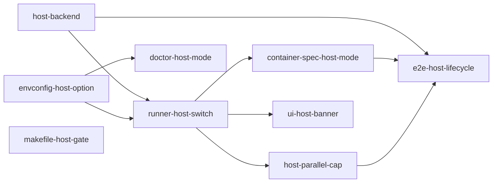

# Host Exec Mode

## Overview

Add an opt-in `wallfacer run --backend host` that runs `claude` directly on the host machine — no podman, no docker, no image pull. The image ergonomics are the top onboarding friction: pulling `ghcr.io/latere-ai/sandbox-agents` fails on flaky networks, triggers GHCR rate limits, drifts from the user's locally-built tag, and forces a container runtime on machines that already have the CLIs installed. Host mode is the escape hatch that lets wallfacer work as a pure orchestrator over the host-installed CLIs, trading filesystem isolation for zero install friction.

**v1 scope:** both Claude and Codex are supported in host mode. The Claude path passes the runner's argv through with optional `--append-system-prompt` for workspace instructions. The Codex path (in `internal/sandbox/host_codex.go`) translates the runner's Claude-style argv into `codex exec --full-auto --sandbox workspace-write --skip-git-repo-check --json --output-last-message <tmp>`, tees codex's native NDJSON event stream to the caller while tracking `session_id` / `turn.completed` usage / `stop_reason` / `total_cost_usd`, and appends a Claude-compatible final result record so the runner's existing parser picks it up unchanged. Session resume is a no-op for codex (matches the container path's `codex-agent.sh`). Workspace instructions are prepended to the prompt because `codex exec` has no `--append-system-prompt` equivalent.

This spec is **not** a replacement for the native sandbox backends (Bubblewrap / Landlock / `sandbox_init` / JobObjects / Hyper-V) tracked in the external [`latere.ai/sandbox`](https://github.com/latere-ai/sandbox) repo's `native/{linux,macos,windows}.md`. Those specs treat host execution as a platform for adding a new isolation layer. This spec owns the simpler "no isolation at all" case those specs mention as "Option C: Local CLI" but do not implement.

## Current State

All task and sub-agent execution flows through `sandbox.Backend.Launch(ContainerSpec)`. Two implementations exist today — neither is applicable on a host-exec path:

- `internal/sandbox/local.go:18` — `LocalBackend` execs `podman run` / `docker run` with the args from `ContainerSpec.Build()`.
- `internal/sandbox/worker.go` — per-task worker containers via `podman exec`, driven by `LocalBackend.launchViaTaskWorker()`.

Backend selection is a single switch in `internal/runner/runner.go:416`:

```go
switch cfg.SandboxBackend {
case "", "local":
    r.backend = sandbox.NewLocalBackend(r.command, localCfg)
default:
    logger.Runner.Warn("unknown sandbox backend, falling back to local", ...)
    r.backend = sandbox.NewLocalBackend(r.command, localCfg)
}
```

Container specs are built in `internal/runner/container.go:87` (`buildContainerSpecForSandbox`) and assume `/workspace/<basename>` paths for every mount:

- Workspace worktree → `/workspace/<basename>` (RW).
- Composed workspace AGENTS.md/CLAUDE.md → `/workspace/<basename>/<filename>` (RO, via `appendInstructionsMount` at `container.go:236`).
- Board JSON → `/workspace/.tasks/board.json` (RO, line 171).
- Sibling worktrees → `/workspace/.tasks/worktrees/<shortID>/<basename>` (RO, line 186).
- Named volume `claude-config` → `/home/agent/.claude` (`container.go:332`).
- Codex `auth.json` → `/home/agent/.codex/auth.json` (`container.go:287`).
- Optional dependency caches (npm/pip/cargo/go-build) → `/home/agent/.cache/...` (`container.go:362`).

The agent CLI args are produced by `buildAgentCmd` (`container.go:270`): `-p <prompt> --verbose --output-format stream-json [--model <m>] [--resume <session>]`. These are appended to `ContainerSpec.Cmd` and survive `Build()` unchanged — they are the same argv the host `claude`/`codex` binary accepts.

`wallfacer doctor` (`internal/cli/doctor.go`) reports "Sandbox image" and relies on image presence for readiness. `Makefile` line 33 unconditionally wires `pull-images` into `build`.

## Architecture

Host mode re-uses the full runner pipeline unchanged (prompt assembly, turn loop, session resume, event sourcing, circuit breaker, live log, oversight, commit pipeline). Only the leaf that talks to a container runtime is swapped.

```
Runner.runContainer (unchanged)
   │
   ├── buildContainerSpecForSandbox(... sb, hostMode) ← gated by backend kind
   │       spec.Volumes / spec.WorkDir / spec.Cmd / spec.Env   (same declarative shape)
   │
   └── backend.Launch(spec)
         ├── LocalBackend  → podman run … IMAGE  spec.Cmd
         └── HostBackend   → exec.Command(agentBinary, spec.Cmd...) with env merged
```

`ContainerSpec` stays the single source of truth. `HostBackend` interprets it as a *translation table* — mounts become host-path bindings (CWD, env vars, or no-op), `EnvFile` is parsed into `cmd.Env`, labels become internal PID-map entries. The `Build()` method (which is inherently podman-shaped) is not called on host mode.

## Components

### `internal/sandbox/host.go` (new)

New file implementing `Backend` and `Handle`. Shape mirrors `LocalBackend`/`localHandle` (`internal/sandbox/local.go:250`) so the callsites don't branch:

- `HostBackend` struct holds `agentBinaries map[sandbox.Type]string` resolved at construction (falls back to `$PATH` lookup of `claude` / `codex`). Also holds a `sync.Mutex`-guarded `procs map[string]*hostHandle` keyed by container name for `List()` and shutdown.
- `NewHostBackend(cfg HostBackendConfig) (*HostBackend, error)` validates at construction that the binaries resolve. Fails fast so `wallfacer run` surfaces a clear message instead of failing at first task.
- `Launch(ctx, spec)`:
  1. Pick the binary from `spec.Env["WALLFACER_AGENT"]` (`claude`|`codex`).
  2. Compute CWD from `spec.WorkDir` — if it is a `/workspace/<basename>` path, resolve it to the matching host worktree using the translation table built by the runner (see *Path translation* below).
  3. Parse `spec.EnvFile` (reuse `envconfig.Parse` or a generic key=val parser) and merge into `cmd.Env`; then overlay `spec.Env` on top.
  4. `cmd := exec.CommandContext(ctx, binary, agentArgv...)` where `agentArgv` is the `spec.Cmd` (which already includes `-p <prompt> --verbose --output-format stream-json ...`).
  5. Pipe stdout/stderr, start, return `hostHandle`.
- `hostHandle` reuses the state machine from `backend.go:46` (`StateMachine`). `Kill()` sends SIGTERM, waits up to 5 s, then SIGKILL — no `podman kill` equivalent needed. `Wait()` returns the process exit code. The handle also nils-out its entry in `HostBackend.procs` on exit.
- `List(ctx)` walks `procs` and returns `ContainerInfo` with `State: "running"`, `Image: "host"`, and the `wallfacer.task.id` label promoted to `TaskID`. Status text is `"Host PID <pid>"`.
- Does **not** implement `WorkerManager` — the worker/exec optimization is a container-runtime concept. Host mode always launches a fresh process per turn (this is cheap; no image load cost).

Estimated size: ~200 LOC + ~150 LOC test.

### `internal/sandbox/spec.go`

Add `(ContainerSpec).AgentArgv() []string` — returns `spec.Cmd` (optionally prefixed by `spec.Entrypoint` if that's how we decide to wire dispatch on the image side; for host mode we bypass the entrypoint). No change to `Build()`. This accessor is a docstring-level concession that the agent argv is backend-agnostic and reusable.

### `internal/runner/container.go`

`buildContainerSpecForSandbox` gains one new input: `hostMode bool`, plumbed from the runner. When `hostMode`:

- Workspace mounts (the `spec.Volumes` loop around `container.go:128`): skip the append. Instead, record the `host→container` mapping in a new `spec.PathMap map[string]string` field so the backend can resolve `spec.WorkDir` back to a host path. `appendInstructionsMount` (line 236), the board mount (line 171), sibling worktrees (line 186): skip; replace with env-var injection:
  - `WALLFACER_INSTRUCTIONS_PATH=<host path to composed AGENTS.md>` (claude/codex CLIs do not auto-read this; see *AGENTS.md handling* below).
  - `WALLFACER_BOARD_JSON=<host path to board.json>`.
  - `WALLFACER_SIBLING_WORKTREES_JSON=<host path to a manifest file>` (write the manifest once; path is read-only).
- `claude-config` named-volume mount (`container.go:332`): skip. The host user's real `~/.claude` / `~/.codex` is already on disk; the CLIs find it by default.
- Codex `auth.json` mount (line 287): skip. Same reason.
- Dependency caches (line 362): skip. Host caches are the source of truth.
- `spec.WorkDir` becomes the host worktree path directly, not `/workspace/<basename>`.
- `spec.CPUs` / `spec.Memory`: ignored by host backend (document; no cgroup plumbing in v1).

`ContainerSpec.PathMap` is a new field on the struct; unused by `LocalBackend.Build()` but consulted by `HostBackend` to resolve any path fields in spec.

### `internal/runner/runner.go`

Extend the `switch cfg.SandboxBackend` at line 416:

```go
case "host":
    hb, err := sandbox.NewHostBackend(sandbox.HostBackendConfig{
        ClaudeBinary: cfg.ClaudeBinaryOverride, // optional
        CodexBinary:  cfg.CodexBinaryOverride,
    })
    if err != nil {
        return nil, fmt.Errorf("host backend: %w", err)
    }
    r.backend = hb
    r.hostMode = true // new field, consumed by buildContainerSpecForSandbox
```

A new `Runner.hostMode bool` is threaded into every `buildContainerSpecForSandbox` call site (grep `buildContainerSpecForSandbox\|buildBaseContainerSpec` — ~8 callers across `container.go`, `refine.go`, `title.go`, `oversight.go`, etc.). Alternative: expose `r.hostMode` via a method and read it inside the builder. The method approach is cleaner; use it.

### `internal/envconfig/envconfig.go`

Accept `host` as a valid `WALLFACER_SANDBOX_BACKEND` value. `envconfig` already stores the raw string; only documentation + tests change.

### `internal/cli/doctor.go`

When `WALLFACER_SANDBOX_BACKEND=host`:

- Replace the "Container command: podman" line with "Agent binaries: claude=<path or NOT FOUND>, codex=<path or NOT FOUND>".
- Replace the "Sandbox image" line and the image-presence check with `claude --version` / `codex --version` probes; report the versions.
- Keep the existing credential and env file checks.

### `Makefile`

Two changes:

1. Do not pull images when the user has explicitly chosen host mode:
   ```makefile
   ifeq ($(WALLFACER_SANDBOX_BACKEND),host)
   build: fmt lint ui-ts build-binary
   else
   build: fmt lint ui-ts build-binary pull-images
   endif
   ```
2. Document `make build-binary` as the canonical host-mode build.

### Docs

- `docs/guide/configuration.md`: new subsection "Host mode (no containers)" in the Sandbox section, with the isolation warning and install-claude instructions.
- `docs/guide/getting-started.md`: add a one-liner "Don't want to install podman? See Host Mode" pointer.
- `CLAUDE.md` / `AGENTS.md`: add `host` to the `WALLFACER_SANDBOX_BACKEND` values list.

### UI

A visible banner in **Settings → API Configuration** when backend=host, with text along the lines of:

> **Host mode active.** Tasks run directly on your machine with your user's permissions. Wallfacer cannot prevent an agent from writing outside the worktree. Recommended only on trusted machines.

This uses the existing alert component; ~20 LOC change in `ui/partials/settings.html` plus env-read in the settings handler.

## Data Flow

For a single turn of an implementation agent:

1. Runner calls `buildContainerSpecForSandbox(..., hostMode=true)`.
2. Builder produces a `ContainerSpec` with:
   - `Cmd = ["-p", "<prompt>", "--verbose", "--output-format", "stream-json", "--model", "...", "--resume", "<session>"]`
   - `Env = {"WALLFACER_AGENT": "claude", "CLAUDE_CODE_MODEL": "sonnet-4-6", "WALLFACER_INSTRUCTIONS_PATH": "/Users/u/.wallfacer/instructions/<fp>/AGENTS.md", ...}`
   - `EnvFile = "/Users/u/.wallfacer/.env"`
   - `WorkDir = "/Users/u/dev/myrepo/.wallfacer-worktrees/<task>/myrepo"`
   - `PathMap` populated with worktree paths.
3. `HostBackend.Launch(spec)` resolves binary, builds `cmd.Env` (envfile + Env), sets `Cwd=WorkDir`, execs.
4. Agent produces NDJSON on stdout, pipes read by runner exactly as today.
5. On `end_turn`, runner commits via the existing pipeline — nothing changes because worktrees are on the real host FS.

### AGENTS.md handling

The Claude CLI's auto-discovery walks up from CWD to find `AGENTS.md` / `CLAUDE.md`. With CWD=worktree, it finds the repo's own file (if any). Wallfacer's *composed* instructions (per-workspace, under `~/.wallfacer/instructions/<fp>/AGENTS.md`) need a different delivery path in host mode. Three options, scored:

| Option | Pro | Con |
|---|---|---|
| (a) Symlink composed file into worktree root as `AGENTS.md` | Zero change to prompt pipeline | Conflicts with repo's own AGENTS.md; symlink may get staged/committed; restore required on cancel/crash |
| (b) Pass via `--append-system-prompt` or `--system-prompt-file` CLI flag (Claude CLI supports `--append-system-prompt`) | Clean, no FS side effect; composable with repo AGENTS.md | Codex CLI flag parity must be verified; missing flag ⇒ fall back to (c) |
| (c) Prepend composed content to the task prompt text | Works on any CLI; no flag dependency | Prompt gets longer; less structured — instructions end up in the user-role turn rather than the system slot |

**Decision:** (b) with (c) as the automatic fallback when the CLI doesn't accept the flag. Probe support once at `HostBackend` construction by running `<binary> --help` and grepping for the flag name; cache the result. Option (a) is explicitly rejected: touching the user's repo on every task is a footgun.

### Parallel tasks

All concurrent tasks in host mode share `~/.claude/` (session dir, credentials, config). Claude CLI's session file is per-process (it writes `.claude/projects/<cwd-hash>/*.jsonl`) so N concurrent tasks with distinct worktrees will produce N distinct session files — this should be safe. Credentials are read-only access, also safe. **But** the CLI also writes to `~/.claude/__store.db` (settings cache) and `~/.claude/statsig/` (telemetry) — these may race.

**Decision for v1:** default to `WALLFACER_MAX_PARALLEL=1` when host mode is active and log a notice. Users who verify parallelism works on their CLI version can override. Track real-world reports and relax the default later.

### Windows

Skip for v1. Claude CLI on Windows runs fine in WSL2; users on Windows should either (i) use container mode with Docker Desktop / Podman Desktop (unchanged), or (ii) run wallfacer itself inside WSL2 where host mode then behaves like Linux. Document both. Adding native Windows support to host mode is out of scope — `exec.Command` works, but path handling, `setrlimit`, signal behavior, and `claude`/`codex` install detection all need Windows variants that don't exist in the tree today.

### Write containment

**Non-goal.** Host mode intentionally provides no write containment — an agent can `rm -rf $HOME`. This is the deliberate tradeoff. The mitigation is documentation + the Settings UI banner above. Users who need containment should use container mode, or wait for the native-OS backends in [`latere.ai/sandbox`](https://github.com/latere-ai/sandbox) to ship. No code-level defense in v1.

## API Surface

### CLI flags

Backend selection moves to a CLI flag — no env var. The previously-planned `WALLFACER_SANDBOX_BACKEND` is dropped from user-facing docs; the internal `cfg.SandboxBackend` field stays as plumbing, populated by the flag.

- `wallfacer run --backend <container|host>` — default `container`. Aliases: `container` is the primary user-facing name for the current `LocalBackend` (internally `"local"`); accept `local` as a backward-compat alias at the flag boundary.
- `wallfacer doctor --backend <container|host>` — mirrors `run` so readiness checks match the mode the user intends to run. Default `container`.

### Environment variables

Two new optional vars (binary path overrides only — they are purely about *where* the CLIs live, not *whether* to use them):

- `WALLFACER_HOST_CLAUDE_BINARY` — explicit path to `claude`. Default: `exec.LookPath("claude")`.
- `WALLFACER_HOST_CODEX_BINARY` — explicit path to `codex`. Default: `exec.LookPath("codex")`.

No new API routes. No new CLI subcommands.

## Error Handling

- **Binary not found at construction.** `NewHostBackend` returns an error that propagates up through `runner.New()`; server startup fails with `Fatal: host sandbox backend: claude binary not found in PATH. Install with 'npm i -g @anthropic-ai/claude-code' or set WALLFACER_HOST_CLAUDE_BINARY.`
- **Binary missing at launch time** (e.g., uninstalled after startup): `Launch` returns an error; the runner's existing circuit breaker records a failure and surfaces it as a task failure. No fallback to container mode — the user explicitly opted in.
- **Process crash / non-zero exit:** handled by existing `runContainer` logic at `container.go:605`. A non-zero exit with no stdout is treated as a task failure; exit=0 with parseable NDJSON succeeds.
- **Cancellation via `Kill`:** SIGTERM then SIGKILL as described. Existing runner cancellation via `ctx.Err() != nil` at `container.go:600` works unchanged because `exec.CommandContext` propagates cancellation.
- **Parallel lock race (if user opts past the default cap):** not detected proactively. If the CLI's SQLite settings cache produces a "database is locked" error it surfaces to the user as a task failure. Document the risk; don't try to serialize access from wallfacer.

## Testing Strategy

### Unit tests (new, `internal/sandbox/host_test.go`)

- `NewHostBackend` resolves `$PATH` binaries; returns descriptive error when missing.
- `Launch` builds correct `exec.Cmd` argv from `spec.Cmd` (parameterized table: happy path, with `--resume`, with `--model`).
- Env-file parsing merges correctly with `spec.Env` (spec.Env wins on conflict).
- `WorkDir` is used as `cmd.Dir`.
- `Kill` escalates SIGTERM→SIGKILL with the documented timeout.
- `Wait` returns the child exit code; does not leak the process on `Kill`.
- `List` returns exactly the running processes keyed by container name.

Use a fake agent binary compiled into the test (`go build -o <tmp>/fake ./testdata/fakeagent`) that emits canned NDJSON on stdin of a `-p` flag and respects `--resume`. The `--append-system-prompt` probe uses the fake's `--help` output to assert the feature-detect path.

### Runner integration (extend `internal/runner/execute_test.go`)

- Add a `MockHostBackend`-equivalent scenario — or better, parametrize the existing `MockSandboxBackend` tests with a host-mode flag that asserts `/workspace/` paths do **not** appear in `spec.WorkDir` / `spec.Volumes`. This catches the mount-translation regression if someone adds a new mount without a host-mode branch.
- Verify that `appendInstructionsMount`, `boardDir` injection, and sibling-worktree injection emit `WALLFACER_*` env vars when `hostMode=true` and mounts when `hostMode=false`.

### E2E (extend `scripts/e2e-lifecycle.sh`)

- Add a `BACKEND=host` mode to the script. Gate behind `command -v claude && command -v codex`. Run the existing two-sandbox lifecycle with the host backend — same 30 checks, same assertions on task state and container cleanup (skip container-cleanup assertions; assert PID reaping instead).
- Add a smoke test to `make e2e-lifecycle`: `SANDBOX=claude BACKEND=host make e2e-lifecycle`.

### Manual verification

- Start wallfacer with `WALLFACER_SANDBOX_BACKEND=host`, run the golden-path task from `docs/guide/getting-started.md` (create task, mark done, verify commit, archive).
- Cancel a running host-mode task; confirm the child process is SIGKILLed.
- Run `wallfacer doctor` and confirm it reports binaries + versions.
- Flip backend from local → host mid-session (restart required); confirm both modes work against the same workspace.

### Non-test checks

- `make build` with `WALLFACER_SANDBOX_BACKEND=host` succeeds without pulling images.
- `make lint` passes (new backend gets the same golangci-lint coverage as `local.go`).

## Task Breakdown

| Child spec | Depends on | Effort | Status |
|------------|-----------|--------|--------|
| [host-backend](host-exec-mode/host-backend.md) | — | medium | complete |
| [envconfig-host-option](host-exec-mode/envconfig-host-option.md) | — | small | complete |
| [makefile-host-gate](host-exec-mode/makefile-host-gate.md) | — | small | complete |
| [runner-host-switch](host-exec-mode/runner-host-switch.md) | host-backend, envconfig-host-option | small | complete |
| [container-spec-host-mode](host-exec-mode/container-spec-host-mode.md) | runner-host-switch | medium | complete |
| [doctor-host-mode](host-exec-mode/doctor-host-mode.md) | envconfig-host-option | small | complete |
| [host-parallel-cap](host-exec-mode/host-parallel-cap.md) | runner-host-switch | small | complete |
| [ui-host-banner](host-exec-mode/ui-host-banner.md) | runner-host-switch | small | complete |
| [e2e-host-lifecycle](host-exec-mode/e2e-host-lifecycle.md) | host-backend, container-spec-host-mode, host-parallel-cap | small | complete |



**Parallel execution.** The three roots — `host-backend`, `envconfig-host-option`, `makefile-host-gate` — have no shared files and can be implemented in parallel. Once both `host-backend` and `envconfig-host-option` are merged, `runner-host-switch` unblocks four children (`container-spec-host-mode`, `host-parallel-cap`, `ui-host-banner`, `doctor-host-mode`) that can also land in parallel since they touch disjoint files. `e2e-host-lifecycle` is the final gate — it exercises the full pipeline.

**Docs updates.** Per the project's implementation checklist, each task updates `docs/guide/configuration.md` and related docs for the behavior it ships. There is intentionally no separate "docs" task — coupling docs to code keeps them from drifting.

## Outcome

Host mode shipped as an opt-in alternative to the container backend, selected via `wallfacer run --backend host`. Users who already have `claude` (and optionally `codex`) installed can now run wallfacer with zero container runtime, no image pull, and no `/workspace/*` path remapping — the agent CLI is exec'd directly against the real host worktree.

### What Shipped

- **`HostBackend` + `hostHandle`** in `internal/sandbox/host.go` (~420 LOC): construction-time binary resolution (with helpful install hints on failure), `Launch` that execs claude with `--dangerously-skip-permissions` + `/fast` to match the container wrapper, lazy `--append-system-prompt` probing cached per agent type, SIGTERM→SIGKILL escalation on `Kill`, PID-map tracking for `List`.
- **Codex host-mode adapter** in `internal/sandbox/host_codex.go` (~310 LOC): translates the runner's Claude-style argv to `codex exec --full-auto --sandbox workspace-write --skip-git-repo-check --json --output-last-message …`, tees codex's native NDJSON events live to the runner while tracking `session_id` / `turn.completed` usage / `stop_reason` / `total_cost_usd`, and appends a synthesized Claude-compatible result record as the final NDJSON line so the existing runner parser picks it up unchanged.
- **CLI flag `--backend {container|host}`** on `wallfacer run` and `wallfacer doctor` (`internal/cli/server.go`, `internal/cli/doctor.go`). Single shared `resolveBackendFlag` translates user-facing names to the runner's internal `"local"` / `"host"` identifiers.
- **Runner wiring** (`internal/runner/runner.go`, `interface.go`, `mock.go`): backend switch grows a `"host"` case, `Runner.HostMode()` accessor exposes the mode to handlers, `MockRunner` gains a `Host` field for tests.
- **Container-spec translation** (`internal/runner/container.go`): `buildContainerSpecForSandbox` branches early to `buildHostSpec`, which drops all container volumes and surfaces instructions / board JSON / sibling worktrees via `WALLFACER_INSTRUCTIONS_PATH` / `WALLFACER_BOARD_JSON` / `WALLFACER_SIBLING_WORKTREES_JSON` env vars.
- **Doctor readiness branching** (`internal/cli/doctor.go`): `--backend host` replaces the container-runtime + image checks with `claude --version` / `codex --version` probes, keeps credential + git checks unchanged.
- **Parallel cap** (`internal/handler/handler.go`): when host mode is active and `WALLFACER_MAX_PARALLEL` is unset, autopilot promotion caps to 1 to avoid races on shared `~/.claude` / `~/.codex` state; explicit env overrides wins.
- **Settings UI banner** (`ui/partials/settings-tab-sandbox.html`, `ui/js/images.js`): prominent "Host mode active" warning card at the top of the Sandbox tab when `/api/config` returns `host_mode: true`.
- **Build + tooling**: `make build-host` sibling target (full fmt + lint + ts-build, no pull), `make pull-images` retag fallback for a locally-built `sandbox-agents:latest`.
- **E2E harness**: `scripts/e2e-lifecycle.sh` accepts `BACKEND=host`, preflight verifies the server is actually running with `--backend host` via `/api/config`, swaps container-cleanup assertions for host-mode PID checks.
- **Tests** (~30 new): 20 in `internal/sandbox/` (argv, env merge, WorkDir, Kill escalation, List, codex argv translation, result envelope wrapping, usage field remapping, instructions preamble, `WALLFACER_SANDBOX_FAST`), 8 in `internal/runner/` (backend switch, host-mode spec translation, codex passthrough), 3 in `internal/handler/` (max-parallel cap, `host_mode` config field), 3 in `internal/cli/` (backend-flag resolution, doctor host-mode output), 3 vitest cases (banner show/hide).

### Design Evolution

1. **Backend selection moved from env var to CLI flag.** The initial draft used `WALLFACER_SANDBOX_BACKEND=host` in `.env`. Mid-design the user asked for a CLI flag (`wallfacer run --backend {container|host}`), replacing the env var entirely. The envconfig field stays as internal plumbing — populated by the flag, never read from disk. The `wallfacer doctor` subcommand now accepts `args []string` so it can parse its own `--backend` flag symmetrically.

2. **Codex shipped in v1, not as follow-up.** The first live test surfaced `codex: unexpected argument '--verbose'` — the runner emits Claude-style argv that `codex exec` doesn't accept, and the container path's `codex-agent.sh` wrapper hadn't been ported to host mode. We initially gated codex with a clear error and documented v1 as claude-only; the user then asked to port properly. The result (`host_codex.go`) reproduces the wrapper's behaviour in Go: argv translation, event tee'ing, final-record synthesis with `cached_input_tokens → cache_read_input_tokens` remapping. Session resume is still a no-op because `codex exec` has no stable resume flag (matching the container wrapper).

3. **Missing `--dangerously-skip-permissions` broke live streaming.** The original host-backend implementation passed `spec.Cmd` through verbatim, omitting the two flags the container wrapper prepends (`--dangerously-skip-permissions` + `--append-system-prompt "/fast"` when fast mode is on). Without `--dangerously-skip-permissions`, claude waits for interactive permission prompts in a piped non-TTY context; it eventually completes the task but buffers all stream-json output until exit, making the UI's live-log view appear broken. Fix was to prepend both flags inside `launchClaude`, matching the container wrapper exactly.

4. **Parallel-cap coercion moved from envconfig to the handler.** The spec suggested exposing `MaxParallelExplicit` through envconfig so the runner could conditionally cap. The actual implementation is simpler: the handler's `cachedMaxParallel` lazyval checks `h.runner.HostMode()` and the parsed `cfg.MaxParallelTasks <= 0` condition (which is already "value not set" semantically). Single read site, no new envconfig field needed.

5. **Per-task codex coercion added then reverted.** While codex was gated, `sandboxForTaskActivity` silently coerced any codex resolution to claude so sub-agents kept working. After the first real run, a task explicitly set to codex answered "who are you" as Claude, which was misleading. We narrowed coercion to env-file defaults only (passive configuration, not user intent), leaving explicit per-task codex choices to surface the honest "codex not supported" error. Once codex host support shipped, the coercion became unnecessary and was removed entirely — codex routing now passes through to the backend's codex launcher in all modes.

6. **`ContainerSpec.PathMap` was spec'd but never added.** The initial spec proposed a new map field on `ContainerSpec` so `HostBackend` could translate `/workspace/*` paths back to host paths. The actual path translation moved upstream into `buildHostSpec` — by the time the spec reaches the backend, `WorkDir` is already a host path and `Volumes` is nil. The host backend only needs to *reject* leftover container paths (defense in depth). No struct change.

7. **`--append-system-prompt` probe became lazy.** The spec said probe at construction time. The advisor flagged that this pays the probe cost on every server start even when host mode is never used; we moved it to first-Launch-per-agent, cached thereafter. Same observable behaviour, zero cost on the idle path.

8. **`ContainerSpec.AgentArgv()` accessor never added.** The spec proposed extracting the agent argv as an accessor so the host backend could reuse it without calling `Build()`. In practice, the host backend just reads `spec.Cmd` directly — it's already the agent argv — so the accessor would have been a one-line wrapper. Dropped.

### Known Limitations

- **Windows**: out of scope. Users on Windows should either use container mode with Docker Desktop / Podman Desktop, or run wallfacer itself inside WSL2.
- **Codex session resume**: a no-op (codex `exec` has no stable resume flag; matches the container path).
- **No write containment**: intentional. The Settings UI banner, doctor output, and commit messages all make this explicit. Users who need containment should use container mode or the in-progress native-OS backends in [`latere.ai/sandbox`](https://github.com/latere-ai/sandbox).
- **Parallel tasks in host mode**: default cap of 1 to avoid `~/.claude/__store.db` races. Users who have verified their CLI tolerates parallelism can override with `WALLFACER_MAX_PARALLEL=N`.
