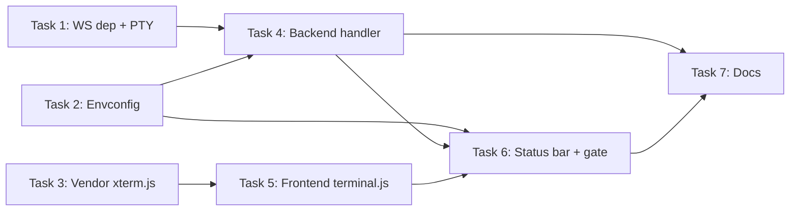

# Plan: Host Shell Terminal Panel

**Status:** Complete | **Date:** 2026-03-22 → 2026-03-28

---

## Problem Statement

The Wallfacer UI has a terminal panel stub (empty `<div id="status-bar-panel">` with resize handle and backtick toggle) but no actual terminal functionality. Users must switch to a separate terminal app to run commands on the host machine. An integrated terminal — like VS Code's — would let users run commands, inspect files, and interact with their workspace without leaving the board UI.

---

## Goal

Populate the existing terminal panel stub with a fully interactive host shell (bash/zsh) using xterm.js for terminal emulation and WebSocket for bidirectional I/O. The shell runs on the host where the Wallfacer server process lives, at the same privilege level as the server itself.

---

## Current State

### Terminal Panel Stub

- **HTML** (`ui/partials/status-bar.html`): Empty `<div id="status-bar-panel" class="status-bar-panel hidden">` with comment "Terminal stub panel (populated by future PRs)"
- **Resize** (`ui/js/status-bar.js:187-234`): Drag-to-resize handle, 80–600px range, height persisted to `localStorage`
- **Toggle** (`ui/js/status-bar.js:134-178`): `_showTerminalPanel()` / `_hideTerminalPanel()` / `toggleTerminalPanel()`, backtick key toggles visibility, Terminal button in status bar right section, bottom panel cycling (Terminal → Dep Graph → Close)
- **CSS** (`ui/css/status-bar.css`): Panel styles (flex column, 260px default height, overflow hidden)

### Existing Streaming Infrastructure

| Component | Location | What it does |
|-----------|----------|-------------|
| `StreamLogs` handler | `internal/handler/stream.go:182` | Streams container logs via HTTP with `http.Flusher` |
| Log consumer | `ui/js/modal-logs.js` | Consumes HTTP streams via Fetch Streams API |
| ANSI converter | `ui/js/modal-ansi.js` | Converts ANSI escape codes to HTML spans |
| SSE auth | `internal/handler/middleware.go:68` | `isSSEPath` closure: `?token=` query param auth for `/api/tasks/stream`, `/api/git/stream`, and `/api/tasks/*/logs` |

**Limitation:** All streaming is one-directional (server→client). Interactive terminal requires full-duplex communication — **WebSocket is needed** (the project's first).

### CLI `exec` Command

`internal/cli/exec.go` uses `cmdexec` (wrapper around `os/exec`) to launch `podman exec -it`. This is terminal-only (requires a local PTY) and cannot work over HTTP.

---

## Design

### Transport: WebSocket

HTTP streaming cannot carry user input. WebSocket provides the full-duplex channel needed for interactive terminal I/O. This introduces the project's first WebSocket endpoint.

### Terminal Emulator: xterm.js

xterm.js is the standard web terminal emulator (used by VS Code, JupyterLab, Gitpod). It handles terminal escape sequences, cursor positioning, scrollback, selection, and clipboard natively. Distributed as standalone JS files — no bundler required.

### PTY Backend: `github.com/creack/pty`

Standard Go PTY library. Wraps `posix_openpt`/`forkpty` on macOS/Linux, ConPTY on Windows 10+. Spawns a shell process with proper terminal semantics.

---

## Backend

### New Dependencies

| Module | Purpose | Size |
|--------|---------|------|
| `nhooyr.io/websocket` | WebSocket built on stdlib `net/http` | Fits existing `http.ServeMux` router; context-aware |

PTY allocation is handled by a small internal package (`internal/pty`, ~60 LOC) wrapping POSIX syscalls directly, avoiding the `creack/pty` dependency. Windows stubs return an error (Phase 1 is macOS/Linux only).

The project currently has one dependency (`github.com/google/uuid`). This adds one more.

### WebSocket Endpoint

```
GET /api/terminal/ws?token=<key>&cols=<n>&rows=<n>&cwd=<path>
```

- **Not registered via `apicontract/routes.go`** — WebSocket upgrades don't follow REST request/response semantics. Registered directly in `BuildMux` (like `/metrics`), with a comment explaining why.
- **Auth:** Add `/api/terminal/ws` to `isSSEPath` in `middleware.go` so it accepts `?token=` authentication (browser `WebSocket` constructor cannot set custom headers). The function currently checks `/api/tasks/stream`, `/api/git/stream`, and `/api/tasks/*/logs`.

### Opt-In Configuration

Add `WALLFACER_TERMINAL_ENABLED` to `internal/envconfig/envconfig.go`:

- Defaults to `false` (opt-in). This is a full host shell — must be explicitly enabled.
- Handler returns `403 Forbidden` when disabled.
- Include `terminalEnabled: bool` in `GET /api/config` response so the frontend can hide the Terminal button when disabled.
- Editable from **Settings → API Configuration** in the UI.

### Handler: `internal/handler/terminal.go`

```go
type TerminalSession struct {
    id     string          // short random ID for logging
    ptmx   *os.File        // PTY master file descriptor
    cmd    *exec.Cmd       // shell process
    cancel context.CancelFunc
}
```

**`HandleTerminalWS` flow:**

1. Check `TerminalEnabled` from env config. Return 403 if disabled.
2. Accept WebSocket upgrade via `websocket.Accept(w, r, nil)`.
3. Determine shell: `$SHELL` env var → `/bin/bash` → `/bin/sh`.
4. Determine cwd: `cwd` query param (if valid and within a workspace) → first active workspace path.
5. Spawn shell: `pty.StartWithSize(cmd, &pty.Winsize{Rows: rows, Cols: cols})`.
6. Two relay goroutines:
   - **PTY→WebSocket**: Read PTY output (32 KB buffer), write as binary WebSocket messages.
   - **WebSocket→PTY**: Read WebSocket messages, dispatch by type, write stdin data to PTY.
7. When either goroutine exits, cancel the other and clean up.

### Message Protocol

**Client→Server** (JSON text messages):

| Type | Payload | Description |
|------|---------|-------------|
| `input` | `{"type":"input","data":"<base64>"}` | Keyboard input → PTY stdin |
| `resize` | `{"type":"resize","cols":N,"rows":N}` | Window resize → `pty.Setsize()` |
| `ping` | `{"type":"ping"}` | Keepalive → server responds with `{"type":"pong"}` |

**Server→Client**: Raw binary (PTY output bytes). Single exception: pong response as JSON text. This asymmetric design minimizes overhead on the high-volume output path.

### Process Cleanup

| Trigger | Action |
|---------|--------|
| WebSocket close (normal) | SIGHUP to shell process group, 2s timeout, SIGKILL if alive, close PTY fd |
| WebSocket drop (abrupt) | `context.Context` cancelled → same cleanup via defer chain |
| Shell exit (`exit` command) | Close WebSocket with status 1000 |
| Server shutdown | Context cancellation propagates from server's `BaseContext` |

### Platform Notes

- **macOS/Linux**: Full support via `creack/pty`.
- **Windows**: ConPTY support exists in `creack/pty` but is less battle-tested. Phase 1 can gate on `runtime.GOOS != "windows"` if needed.

---

## Frontend

### xterm.js Vendoring

Download and place alongside existing vendored libraries:

| File | Destination | Size |
|------|-------------|------|
| `xterm.min.js` | `ui/js/vendor/xterm.min.js` | ~90 KB gzipped |
| `xterm-addon-fit.min.js` | `ui/js/vendor/xterm-addon-fit.min.js` | ~3 KB |
| `xterm.css` | `ui/css/vendor/xterm.css` | ~5 KB |

Loaded via `<script>` and `<link>` tags in `initial-layout.html`, matching the existing pattern for vendored libraries (`sortable.min.js`, `marked.min.js`, `highlight.min.js` in `ui/js/vendor/`). Embedded via existing `//go:embed ui` — no build step changes.

### New File: `ui/js/terminal.js`

**Key functions:**

- **`initTerminal()`** — Called on DOMContentLoaded. Creates `xterm.Terminal` instance with theme from CSS vars (`--bg-card`, `--text`, `--accent`). Attaches `FitAddon`. Mounts into `#status-bar-panel`. Does NOT connect yet — waits for first panel open.

- **`connectTerminal()`** — Called when panel becomes visible. Builds WebSocket URL (`ws(s)://` + host + `/api/terminal/ws?token=...&cols=...&rows=...`). Token appended via `withAuthToken()` in `transport.js` (wraps `getWallfacerToken()`). Wires up:
  - `ws.onmessage` → `terminal.write(data)`
  - `terminal.onData` → send `{"type":"input","data":"<base64>"}`
  - `terminal.onResize` → send `{"type":"resize","cols":N,"rows":N}`

- **`disconnectTerminal()`** — Closes WebSocket with code 1000.

- **Reconnection**: On non-1000 close, exponential backoff (1s, 2s, 4s, max 30s). Show "Disconnected. Reconnecting..." overlay in terminal panel. Clear terminal on reconnect (new shell session).

### Resize Integration

The existing drag-to-resize in `status-bar.js` changes `panel.style.height`. Terminal must respond:

1. Add `ResizeObserver` on `#status-bar-panel` in `initTerminal()`.
2. On size change → `fitAddon.fit()` → recalculates cols/rows → emits `terminal.onResize` → sends WebSocket resize message.
3. On initial panel open, call `fitAddon.fit()` after panel becomes visible (hidden panel has zero dimensions).

### Toggle Integration

Modify `toggleTerminalPanel()` in `status-bar.js`:

- **Panel opens**: Call `connectTerminal()` if not connected, `fitAddon.fit()`, `terminal.focus()`.
- **Panel hides**: Keep WebSocket alive (preserve shell session and scrollback for quick toggle).
- Backtick shortcut already calls `toggleTerminalPanel()` — no change needed.

### Theme Integration

Map xterm.js theme from CSS custom properties:

```javascript
{
  background: getCSSVar('--bg-card'),
  foreground: getCSSVar('--text'),
  cursor: getCSSVar('--accent'),
  selectionBackground: 'rgba(78,140,255,0.3)',
  // Standard ANSI 16-color palette
}
```

xterm.js handles its own ANSI rendering — the existing `modal-ansi.js` converter is not reused here.

### Frontend Visibility Gate

If `GET /api/config` returns `terminalEnabled: false`:
- Hide the Terminal button in the status bar
- Disable the backtick keyboard shortcut
- If the panel is somehow opened, show a message: "Terminal disabled. Set WALLFACER_TERMINAL_ENABLED=true in Settings → API Configuration."

---

## Security

| Concern | Mitigation |
|---------|------------|
| Unauthorized access | Bearer token auth via `?token=` (same as SSE paths) |
| Opt-in control | `WALLFACER_TERMINAL_ENABLED` defaults to `false` |
| Privilege level | Same as host — user already runs the server on their machine |
| Input sanitization | None needed — PTY receives raw bytes like a physical terminal |
| Output flooding | 32 KB read buffer with WebSocket write back-pressure |
| Orphaned processes | Context cancellation + SIGHUP/SIGKILL cleanup chain |
| Path traversal (cwd) | Validate `cwd` against active workspace list |

---

## Outcome

Phase 1 (single terminal session) is fully implemented across 7 tasks. The terminal panel provides a working interactive host shell in the browser via xterm.js and a WebSocket-backed PTY relay, with theme integration, reconnection, and a visibility gate.

### What Shipped

- **1 WebSocket endpoint** (`GET /api/terminal/ws`) registered directly in `BuildMux` — the project's first WebSocket route
- **Inline PTY package** (`internal/pty/`, ~100 LOC across 4 files): macOS and Linux PTY allocation via raw POSIX ioctls, Windows stub
- **Terminal handler** (`internal/handler/terminal.go`): WebSocket accept, shell spawn, bidirectional PTY relay, JSON message protocol (input/resize/ping), SIGHUP/SIGKILL cleanup, cwd validation against workspaces
- **Frontend terminal module** (`ui/js/terminal.js`, ~170 lines): xterm.js init with CSS-var theme, WebSocket connect/disconnect, exponential backoff reconnection, ResizeObserver integration
- **Status bar integration**: `connectTerminal()` on panel open, WebSocket kept alive while hidden, visibility gate hides Terminal button when disabled, backtick cycle skips terminal when disabled
- **25 tests** (3 PTY + 7 handler WebSocket + 10 terminal.js + 5 status-bar integration)
- **Vendored xterm.js 5.5.0** + fit addon 0.10.0

### Design Evolution

1. **Dropped `creack/pty` dependency.** The spec originally proposed `github.com/creack/pty` for PTY allocation. Replaced with `internal/pty/` (~100 LOC) wrapping POSIX ioctls directly — macOS uses `TIOCPTYGRANT`/`TIOCPTYUNLK`/`TIOCPTYGNAME`, Linux uses `TIOCSPTLCK`/`TIOCGPTN`. No cgo required.

2. **Switched `nhooyr.io/websocket` → `github.com/coder/websocket`.** The `nhooyr.io` module is deprecated (ownership transferred to Coder). Same API, new import path. Avoids staticcheck SA1019 lint errors.

3. **Added `Hijack()` to `statusResponseWriter`.** The logging middleware wraps `http.ResponseWriter` with `statusResponseWriter` for status capture. WebSocket upgrades require `http.Hijacker`. Added `Hijack()` delegation (`d620e64`).

4. **Changed `WALLFACER_TERMINAL_ENABLED` default to `true`.** The spec defaulted to `false` (opt-in) citing security. Since Wallfacer is currently a local-only tool where the user already has full host access, the opt-in gate adds friction with no security benefit. Changed to `true` (`4c042b8`).

5. **Theme re-application on connect.** The spec described setting the theme once at init. Added `_buildTermTheme()` helper that re-reads CSS vars on every `connectTerminal()` call, so light/dark theme switches take effect when the panel is reopened. Also added CSS `background: var(--bg-card)` overrides on `.xterm` containers (`d79cbd6`).

---

## Phasing

### Phase 1: Single Terminal Session

- One shell session per browser tab
- Connect on panel open, keep alive while panel hidden, reconnect on disconnect
- Working directory defaults to first active workspace
- Opt-in via `WALLFACER_TERMINAL_ENABLED`

**Complexity: Medium.** Backend WebSocket+PTY relay is the main effort (~60%). Frontend xterm.js integration is straightforward (~25%). Config/auth plumbing is minimal (~15%).

### Phase 2: Multiple Sessions with Tabs (Future)

See [05a-terminal-sessions.md](05a-terminal-sessions.md).

### Phase 3: Container Exec Integration (Future)

See [05b-terminal-container-exec.md](05b-terminal-container-exec.md).

---

## File Inventory

### New Files

| File | Purpose |
|------|---------|
| `internal/pty/pty.go` | Shared PTY helpers: `StartWithSize`, `Setsize` (`//go:build !windows`) |
| `internal/pty/open_darwin.go` | macOS PTY allocation via `TIOCPTYGRANT`/`TIOCPTYUNLK`/`TIOCPTYGNAME` |
| `internal/pty/open_linux.go` | Linux PTY allocation via `TIOCSPTLCK`/`TIOCGPTN` |
| `internal/pty/pty_windows.go` | Windows stub (returns error) |
| `internal/pty/pty_test.go` | PTY open, start, resize tests |
| `internal/handler/terminal.go` | WebSocket handler, PTY lifecycle, message protocol (`//go:build !windows`) |
| `internal/handler/terminal_windows.go` | Windows stub (returns 501) |
| `internal/handler/terminal_test.go` | 7 tests: connect, resize, ping, shell exit, auth, disabled gate, cwd validation |
| `ui/js/terminal.js` | xterm.js integration, WebSocket client, resize/reconnect, theme sync |
| `ui/js/tests/terminal.test.js` | 10 vitest tests for terminal module |
| `ui/js/vendor/xterm.min.js` | Vendored xterm.js 5.5.0 core |
| `ui/js/vendor/xterm-addon-fit.min.js` | Vendored fit addon 0.10.0 |
| `ui/css/vendor/xterm.css` | Vendored xterm.js styles |

### Modified Files

| File | Change |
|------|--------|
| `go.mod` / `go.sum` | Add `github.com/coder/websocket` (was `nhooyr.io/websocket`) |
| `internal/envconfig/envconfig.go` | Add `TerminalEnabled` field (default `true`) |
| `internal/handler/middleware.go` | Add `/api/terminal/ws` to `isSSEPath` |
| `internal/handler/config.go` | Include `terminal_enabled` in config response |
| `internal/cli/server.go` | Register `/api/terminal/ws` in `BuildMux`; add `Hijack()` to `statusResponseWriter` |
| `ui/partials/initial-layout.html` | Add `<link>` for xterm.css, `<script>` for xterm vendor files |
| `ui/partials/scripts.html` | Add `<script src="/js/terminal.js">` |
| `ui/js/status-bar.js` | Call `connectTerminal()` from `_showTerminalPanel()`; visibility gate; `applyTerminalVisibility()` |
| `ui/js/state.js` | Add `terminalEnabled` global |
| `ui/js/workspace.js` | Set `terminalEnabled` from config; call `initTerminal()` when enabled |
| `ui/css/status-bar.css` | xterm container fill styles, dark-mode background overrides, reconnection overlay |
| `docs/guide/configuration.md` | Document `WALLFACER_TERMINAL_ENABLED` |
| `AGENTS.md` | Add terminal endpoint and env var |
| `docs/internals/api-and-transport.md` | WebSocket terminal section; updated auth middleware description |

---

## Task Breakdown

| # | Task | Depends on | Effort | Status |
|---|------|-----------|--------|--------|
| 1 | [WebSocket dep + inline PTY](05-host-terminal/task-01-go-dependencies.md) | — | Small | Done |
| 2 | [TerminalEnabled envconfig + config](05-host-terminal/task-02-envconfig-terminal-enabled.md) | — | Small | Done |
| 3 | [Vendor xterm.js assets](05-host-terminal/task-03-vendor-xtermjs.md) | — | Small | Done |
| 4 | [Backend terminal handler + route](05-host-terminal/task-04-backend-terminal-handler.md) | 1, 2 | Large | Done |
| 5 | [Frontend terminal.js](05-host-terminal/task-05-frontend-terminal-js.md) | 3 | Medium | Done |
| 6 | [Status bar integration + visibility gate](05-host-terminal/task-06-statusbar-integration.md) | 2, 4, 5 | Medium | Done |
| 7 | [Documentation](05-host-terminal/task-07-documentation.md) | 4, 6 | Small | Done |


