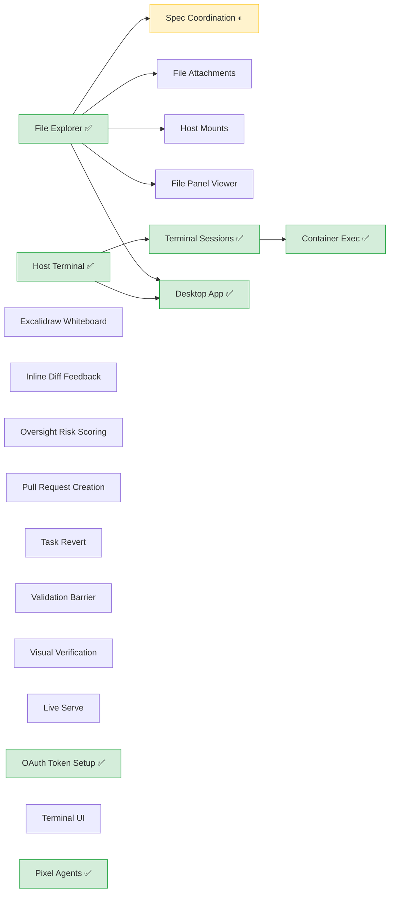
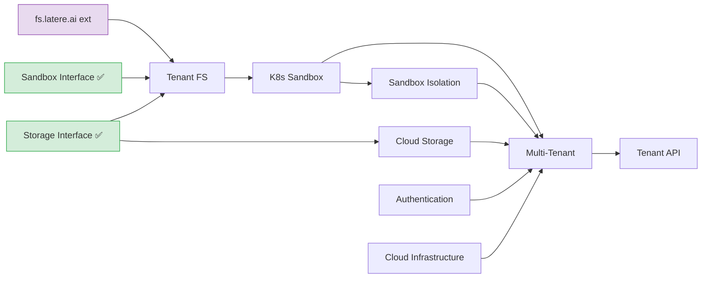

# Specs

Wallfacer roadmap. Three tracks run in parallel, connected by shared design foundations.

## Status Quo

What has shipped vs what remains. ✅ = complete, ◐ = in progress, ○ = not started.

```
Foundations — 7/7 complete
  ✅ Sandbox Backend Interface     ✅ Container Reuse
  ✅ Storage Backend Interface     ✅ File Explorer
  ✅ Multi-Workspace Groups        ✅ Host Terminal
  ✅ Windows Support

Local Product — 5 done, 1 in progress, 17 pending
  ✅ Desktop App                   ✅ Terminal Sessions
  ✅ Container Exec                ✅ OAuth Token Setup
  ✅ Pixel Agent Avatars           ◐ Spec Coordination
  ○ File/Image Attachments         ○ Host Mounts
  ○ File Panel Viewer              ○ Inline Diff Feedback
  ○ Oversight Risk Scoring         ○ Validation Barrier
  ○ Visual Verification            ○ Live Serve
  ○ Pull Request Creation          ○ Task Revert
  ○ Terminal UI (TUI mode)         ○ Excalidraw Whiteboard
  ○ TypeScript Migration           ○ Typed DOM Hooks
  ○ Rebrand Module Path            ○ Spatial Canvas
  ○ Data Boundary Enforcement

Cloud Platform — 0/8
  ○ Tenant Filesystem              ○ K8s Sandbox Backend
  ○ Sandbox Isolation              ○ Cloud Infrastructure
  ○ Multi-Tenant (capstone)        ○ Tenant API
  ○ Billing Idempotency            ○ Telemetry Queue Backpressure

Shared Design — 0/17
  ○ Authentication                 ○ Agent Abstraction
  ○ Overlay Snapshots              ○ Native Sandbox (Linux)
  ○ Native Sandbox (macOS)         ○ Native Sandbox (Windows)
  ○ Telemetry & Observability      ○ Information Inbox
  ○ Multi-Agent Consensus          ○ Multi-Agent Debate
  ○ Token & Cost Optimization      ○ Extensible Prompts
  ○ Intent-Driven Commits          ○ Sandbox Hooks
  ○ Defense in Depth               ○ Agent Memory & Identity
  ○ Intelligence System
```

---

## Foundations (Complete)

Abstraction interfaces that all tracks build on. These are done and stable.

| Spec | Status | Delivers |
|------|--------|----------|
| [sandbox-backends.md](foundations/sandbox-backends.md) | **Complete** | `sandbox.Backend` / `sandbox.Handle` + `LocalBackend` |
| [storage-backends.md](foundations/storage-backends.md) | **Complete** (enablers) | `StorageBackend` + `FilesystemBackend`; cloud backends (PG, S3) deferred to cloud track |
| [multi-workspace-groups.md](foundations/multi-workspace-groups.md) | **Complete** | Multi-store manager, runtime workspace switching |
| [container-reuse.md](foundations/container-reuse.md) | **Complete** | Per-task worker containers via `podman exec` |
| [file-explorer.md](foundations/file-explorer.md) | **Complete** | Browse + edit workspace files in the web UI |
| [host-terminal.md](foundations/host-terminal.md) | **Complete** | Interactive shell in the web UI (WebSocket + PTY) |
| [windows-support.md](foundations/windows-support.md) | **Complete** | Tier 2 Windows host support |

---

## Local Product

Desktop experience and developer workflow improvements. No cloud dependency. Ships value to single-user deployments.

| Spec | Status | Delivers |
|------|--------|----------|
| [spec-coordination.md](local/spec-coordination.md) | In progress | Umbrella: recursive spec tree model, dispatch workflow, cross-task context |
| ↳ [spec-document-model.md](local/spec-coordination/spec-document-model.md) | **Complete** | Spec frontmatter schema, filesystem-derived tree, `depends_on` DAG, six-state lifecycle (including `archived`), per-spec and cross-spec validation, recursive progress tracking, impact analysis. Extracted `internal/pkg/dag/`, `internal/pkg/tree/`, `internal/pkg/statemachine/` |
| ↳ [spec-drift-detection.md](local/spec-coordination/spec-drift-detection.md) | Not started | Drift detection, propagation through spec tree, `affects` field |
| ↳ [spec-planning-ux.md](local/spec-coordination/spec-planning-ux.md) | **Complete** | Three-pane spec mode (explorer, focused markdown view, chat stream), planning sandbox container, chat-driven spec iteration, dispatch & board integration, undo snapshots, planning cost tracking. Deferred: Codex compatibility, enhanced session recovery. |
| ↳ [spec-archival.md](local/spec-coordination/spec-archival.md) | In progress | Sixth lifecycle state (`archived`) — hidden by default, read-only, excluded from impact / progress / drift / stale-propagation. Lets users retire finished or abandoned specs without deleting them. |
| [desktop-app.md](local/desktop-app.md) | **Complete** | Wails native wrapper (macOS .app, Windows .exe, Linux binary) |
| [excalidraw-whiteboard.md](local/excalidraw-whiteboard.md) | Not started | Excalidraw-based drawing/brainstorm whiteboard as a peer view |
| [file-attachments.md](local/file-attachments.md) | Not started | Drag-and-drop file and image attachments for task prompts |
| [host-mounts.md](local/host-mounts.md) | Not started | Per-task read-only host filesystem mounts into sandbox containers |
| [file-panel-viewer.md](local/file-panel-viewer.md) | Not started | VS Code-style inline file panel with tabs, multi-modal preview |
| [inline-diff-feedback.md](local/inline-diff-feedback.md) | Not started | Code-review-style inline comments on diff lines with batch feedback submission |
| [terminal-sessions.md](local/terminal-sessions.md) | **Complete** | Multiple concurrent terminal sessions with tab bar |
| [terminal-container-exec.md](local/terminal-container-exec.md) | **Complete** | Attach to running task containers from the terminal panel |
| [oversight-risk-scoring.md](local/oversight-risk-scoring.md) | Not started | Real-time agent action risk assessment |
| [visual-verification.md](local/visual-verification.md) | Not started | Visual verification for UI changes |
| [live-serve.md](local/live-serve.md) | Not started | Build and run developed software from within Wallfacer |
| [oauth-token-setup.md](local/oauth-token-setup.md) | **Complete** | Browser-based OAuth sign-in for Claude and Codex credentials |
| [pixel-agents.md](local/pixel-agents.md) | **Complete** | Pixel art office view — animated characters representing task agents |
| [validation-barrier.md](local/validation-barrier.md) | Not started | User-defined test criteria persisted on tasks for targeted verification |
| [pull-request.md](local/pull-request.md) | Drafted | Agent-generated GitHub PR from current branch via lightweight sandbox |
| [task-revert.md](local/task-revert.md) | Drafted | Agent-assisted revert of merged task changes with conflict resolution |
| [terminal-ui.md](local/terminal-ui.md) | Not started | Full TUI mode — interactive terminal board, log streaming, task lifecycle via Bubble Tea |
| [typescript-migration.md](local/typescript-migration.md) | Drafted | Gradual migration of the frontend from JavaScript to TypeScript — tsconfig + esbuild + tsc typecheck, `.ts` source in place, compiled `.js` as build artifact. Pilot on `ui/js/lib/clipboard.ts`. |
| [typed-dom-hooks.md](local/typed-dom-hooks.md) | Vague | Generate typed constants from `id` / `data-js-*` attributes in `ui/partials/` so renames fail type-check instead of silently breaking selectors. Contract layer between HTML, CSS, and TS. |
| [rebrand-module-path.md](local/rebrand-module-path.md) | Not started | Migrate module path and image refs from `changkun.de/x/wallfacer` to `latere.ai/wallfacer` |
| [spatial-canvas.md](local/spatial-canvas.md) | Vague | Spatial infinite-canvas view — tasks, agents, and notes as free-form nodes on a 2D plane |
| [data-boundary-enforcement.md](local/data-boundary-enforcement.md) | Drafted | Enforce what metadata can leave the user's machine to wallfacer.cloud — explicit allow-list, redaction at the boundary, CI lint against leaked code/paths/secrets |

### Local product dependencies



---

## Cloud Platform

Multi-tenant hosted service. Builds on sandbox and storage interfaces.

| Spec | Status | Delivers |
|------|--------|----------|
| [tenant-filesystem.md](cloud/tenant-filesystem.md) | Not started | fs.latere.ai integration, repo provisioner, workspace group cloud mapping |
| [k8s-sandbox.md](cloud/k8s-sandbox.md) | Not started | `K8sBackend` — K8s Jobs with fs.latere.ai hot tier mounts, pod log streaming, exec |
| [sandbox-isolation.md](cloud/sandbox-isolation.md) | Not started | Policy engine — network allow/deny + observability, FS isolation, action log |
| [cloud-infrastructure.md](cloud/cloud-infrastructure.md) | Not started | K8s manifests for latere.ai cluster deployment (DO) |
| [multi-tenant.md](cloud/multi-tenant.md) | Not started | Control plane, instance provisioning, policy-controlled sandbox model |
| [tenant-api.md](cloud/tenant-api.md) | Not started | Versioned external API (`/api/v1/`), per-tenant API keys, webhooks |
| [billing-idempotency.md](cloud/billing-idempotency.md) | Drafted | Stripe idempotency keys on every charge operation — prevents double-billing under retry, single-charge guarantee for cost-visibility trust story |
| [telemetry-queue-backpressure.md](cloud/telemetry-queue-backpressure.md) | Drafted | Cap on the local telemetry queue when the cloud is unreachable — bounded disk use, defined drop policy, keeps the local UI responsive under long outages |

### Cloud platform dependencies



### Deployment modes

Three modes, auth is opt-in at every mode (see [authentication.md](shared/authentication.md)):

1. **Local anonymous (today):** Wallfacer runs on the user's machine, no auth. Filesystem storage, local containers.
2. **Local authenticated:** Same binary, signed in to latere.ai. Enables the remote-control placeholder (auth spec) — no other changes.
3. **Cloud hosted:** Wallfacer runs in latere.ai's K8s cluster. Each user gets a dedicated pod + fs.latere.ai workspace; task containers dispatch as K8s Jobs. See [multi-tenant.md](cloud/multi-tenant.md) and [cloud-infrastructure.md](cloud/cloud-infrastructure.md) for cost estimates.

Why no VM-per-tenant intermediate? The wallfacer binary is identical in all three modes. Building a VM provisioner then replacing it with K8s is wasted work.

---

## Shared Design

Specs that serve both tracks. These define interfaces and behaviors that local product and cloud platform both depend on.

| Spec | Status | Serves | Delivers |
|------|--------|--------|----------|
| [authentication.md](shared/authentication.md) | Not started | Both | OAuth2/OIDC login, session management, user identity. Locally: replaces static API key with real login. Cloud: prerequisite for multi-tenant. |
| [agent-abstraction.md](shared/agent-abstraction.md) | Not started | Both | Pluggable agent roles, unified container lifecycle, inter-agent communication. Eliminates role duplication that both tracks would inherit. |
| [native-sandbox-linux.md](shared/native-sandbox-linux.md) | Not started | Local | `BubblewrapBackend`, `NspawnBackend` — daemon-free sandboxing |
| [native-sandbox-macos.md](shared/native-sandbox-macos.md) | Not started | Local | `VZBackend`, `SandboxInitBackend` — macOS-native isolation |
| [native-sandbox-windows.md](shared/native-sandbox-windows.md) | Not started | Local | `JobObjectBackend`, `HyperVBackend` — Windows-native isolation |
| [overlay-snapshots.md](shared/overlay-snapshots.md) | Not started | Both | Overlay snapshot cloning, CRIU checkpoint/restore. Accelerates both local workers and cloud pod startup. |
| [telemetry-observability.md](shared/telemetry-observability.md) | Not started | Both | Runtime telemetry collection, anomaly-to-task feedback loop. Locally: ring buffer + SQLite + MCP server. Cloud: OTEL Collector + Mimir/Loki/Tempo. |
| [information-inbox.md](shared/information-inbox.md) | Drafted | Both | External signal aggregation (HN, Reddit, email, GitHub, RSS), agent-assisted triage, priority inbox panel, convert-to-task workflow. |
| [multi-agent-consensus.md](shared/multi-agent-consensus.md) | Drafted | Both | Cross-provider adversarial verification, multi-agent consensus protocol, disagreement resolution. Builds on agent abstraction. |
| [multi-agent-debate.md](shared/multi-agent-debate.md) | Drafted | Both | Multi-round adversarial deliberation for ideation and telemetry signal triage. Agents debate, critique, and synthesize across providers. |
| [token-cost-optimization.md](shared/token-cost-optimization.md) | Not started | Both | Cache observability, --resume correctness audit, shell output compression (RTK), consumption regression model, prospective budgeting. |
| [extensible-prompts.md](shared/extensible-prompts.md) | Not started | Both | Discoverable, user-creatable prompt system — replace hardcoded templates with skill-like prompt files that the system discovers at runtime. |
| [intent-commits.md](shared/intent-commits.md) | Not started | Both | Every intent (task, planning chat, explorer edit) produces a git commit — enables fine-grained undo, attribution, and revert. |
| [sandbox-hooks.md](shared/sandbox-hooks.md) | Not started | Both | Agent lifecycle hooks via HTTP callbacks — output compression, telemetry, stop guards, command guards. Mechanism layer for token cost optimization. |
| [defense-in-depth.md](shared/defense-in-depth.md) | Drafted | Both | Layered oversight composition (Swiss cheese model), task-level permission modes, pre-dispatch validation, escalation cascade, unified decision audit. |
| [agent-memory-identity.md](shared/agent-memory-identity.md) | Vague | Both | Persistent agent memory as identity construction: hierarchical workspace memory, emotional weighting via somatic markers, narrative coherence, co-emergent self-model, memory extraction and lifecycle. Foundation for intelligence system's shared world model. |
| [intelligence-system.md](shared/intelligence-system.md) | Vague | Both | Design space exploration: shared world model, cross-task awareness, proactive task composition, goal-oriented groups, smarter human-in-the-loop, capability registry, context bus, failure pattern learning. |

### Why these are shared

**Authentication** is the clearest cross-track spec. A single-host deployment gets real login instead of a bearer token. The cloud track needs it as a prerequisite for multi-tenant. Implementing it once serves both.

**Agent abstraction** refactors `internal/runner/` — the execution engine that both tracks use. Without it, every new agent role requires touching 6+ files with duplicated launch/parse/usage logic. Both tracks add new roles (cloud adds K8s-aware agents, local product adds planning/gate agents from spec coordination).

**Native sandboxes** are alternatives to the container-based `LocalBackend`. They eliminate the Docker/Podman dependency for local deployments and the desktop app.

**Overlay snapshots** accelerates container startup for both local workers and cloud K8s pods.

---

## Dependency Graph

How the three tracks connect through shared design and foundations.

```mermaid
graph TB
  subgraph Foundations [Foundations ✅]
    SBI[Sandbox Interface]
    STI[Storage Interface]
    CR[Container Reuse]
    FE[File Explorer]
    MW[Multi-Workspace]
    HT[Host Terminal]
  end

  subgraph Shared [Shared Design]
    AUTH[Authentication]
    AA[Agent Abstraction]
    OS[Overlay Snapshots]
    NSL[Native Sandbox Linux]
    NSM[Native Sandbox macOS]
    NSW[Native Sandbox Windows]
    EP[Extensible Prompts]
    IC[Intent Commits]
    TEL[Telemetry & Observability]
    INB[Information Inbox]
    MAC[Multi-Agent Consensus]
    MAD[Multi-Agent Debate]
    DID[Defense in Depth]
    AMI[Agent Memory & Identity]
    IS[Intelligence System]
  end

  subgraph Local [Local Product]
    SC[Spec Coordination ◐]
    FA[File Attachments]
    HM[Host Mounts]
    FPV[File Panel Viewer]
    DA[Desktop App ✅]
    TS[Terminal Sessions ✅]
    CE[Container Exec ✅]
    ORS[Oversight Risk Scoring]
    VB[Validation Barrier]
    VV[Visual Verification]
    LS[Live Serve]
    OTS[OAuth Token Setup ✅]
    TUI[Terminal UI]
    PA[Pixel Agents ✅]
  end

  subgraph External [External Dependencies]
    FS[fs.latere.ai]
  end

  subgraph Cloud [Cloud Platform]
    TFS[Tenant FS]
    K8S[K8s Sandbox]
    CS[Cloud Storage]
    CI[Cloud Infrastructure]
    MT[Multi-Tenant]
    TA[Tenant API]
  end

  %% Foundations → Local
  FE --> SC
  FE --> FA
  FE --> HM
  FE --> FPV
  FE --> DA
  HT --> DA
  HT --> TS --> CE

  %% External → Cloud
  FS --> TFS

  %% Foundations → Cloud
  SBI --> TFS
  STI --> TFS
  STI --> CS

  %% Shared → Cloud
  AUTH --> MT
  AA --> TEL
  AA --> INB
  TEL --> INB
  AA --> MAC
  MAC --> MAD
  TEL --> MAD
  TEL --> LS
  AA --> AMI
  TEL --> AMI
  AMI --> IS
  AA --> DID
  TEL --> DID
  AA --> IS
  TEL --> IS
  MAC --> IS

  %% Cloud internal
  TFS --> K8S --> MT
  CS --> MT
  CI --> MT
  MT --> TA
```



---

## Ordering Rationale

**Within local product:**
- Spec coordination is in progress (document model complete; drift detection and planning UX remain).
- Terminal extensions complete: sessions and container exec both shipped.
- Desktop app is complete.
- Oversight, visual verification, live serve are independent — start anytime.

**Within cloud platform:**
- Tenant filesystem first — integrates with fs.latere.ai for config persistence and hot tier workspace allocation. Prerequisite: fs.latere.ai Phase 5 (Workspace API).
- K8s sandbox consumes the hot tier workspace layout from tenant FS.
- Cloud storage (PG, S3) can run in parallel with tenant FS / K8s sandbox.
- Cloud infrastructure (IaC) is a leaf — provisions managed services.
- Multi-tenant is the capstone wiring everything together. Tenant API comes after.

**Cross-track:**
- Authentication should be early — useful for both tracks and blocks multi-tenant.
- Agent abstraction reduces duplication before either track adds new agent roles.
- Native sandboxes are independent — start when the desktop app needs them.

**Between tracks:**
- The two tracks are independent after shared foundations. They can run in parallel.
- The only hard cross-track dependency: multi-tenant requires authentication.
